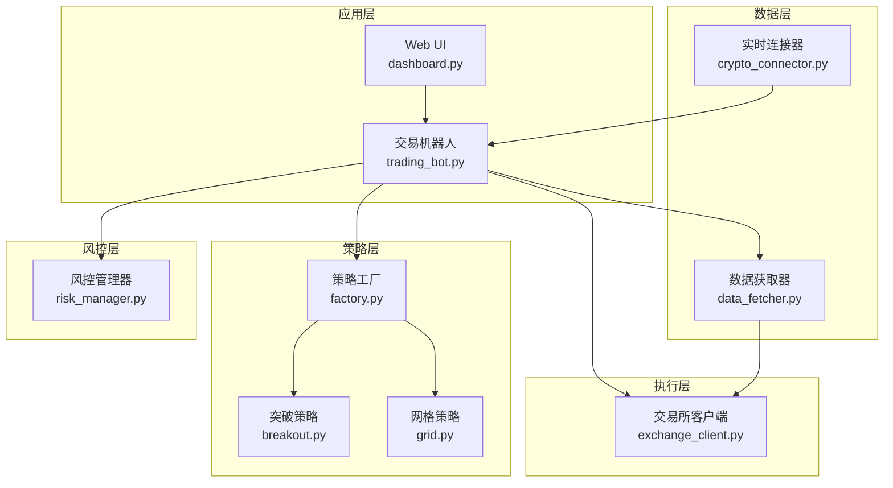
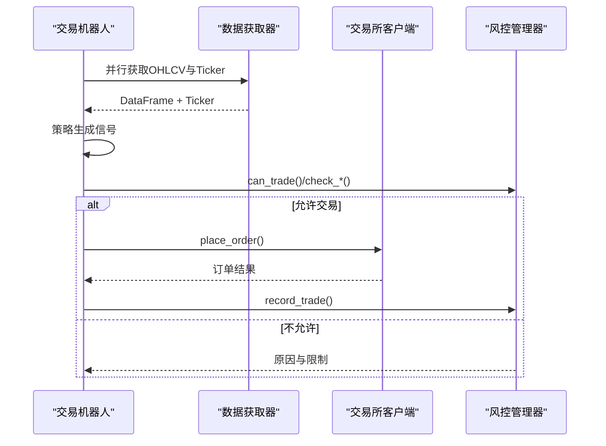
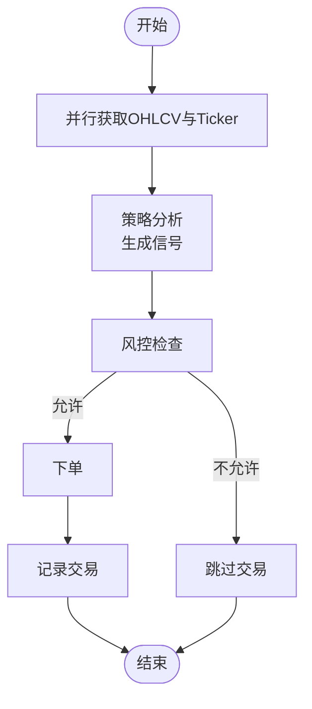
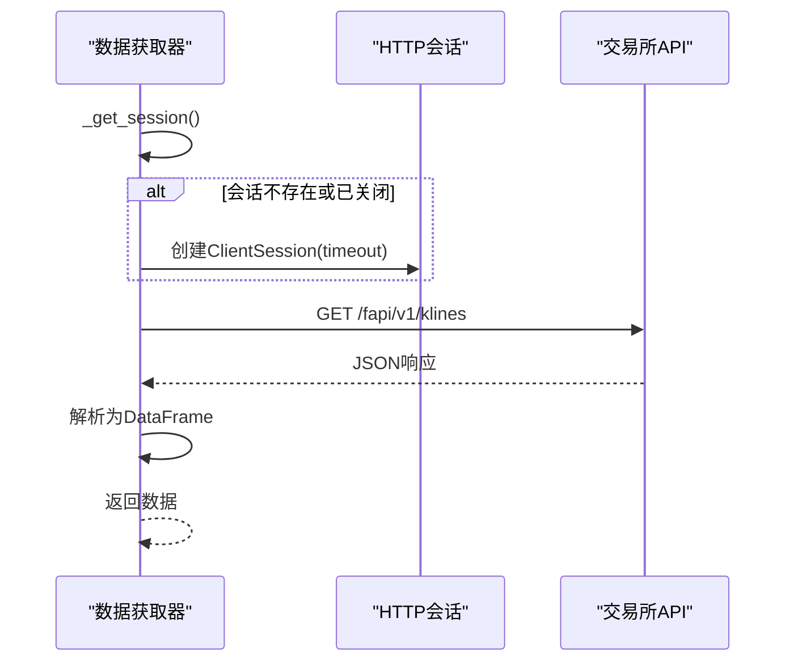
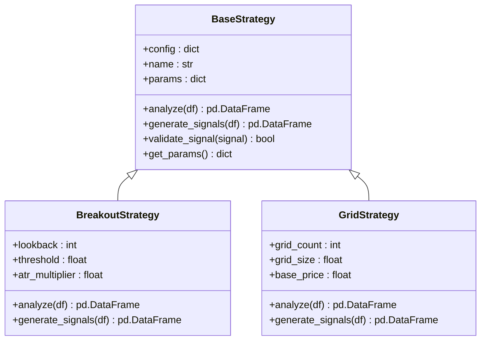
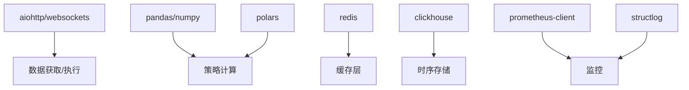

# 性能优化策略

<cite>
**本文引用的文件**
- [src/trading_bot.py](file://src/trading_bot.py)
- [src/data/data_fetcher.py](file://src/data/data_fetcher.py)
- [src/execution/exchange_client.py](file://src/execution/exchange_client.py)
- [src/aetherlife/perception/crypto_connector.py](file://src/aetherlife/perception/crypto_connector.py)
- [src/strategies/breakout.py](file://src/strategies/breakout.py)
- [src/strategies/grid.py](file://src/strategies/grid.py)
- [src/utils/risk_manager.py](file://src/utils/risk_manager.py)
- [src/utils/logger.py](file://src/utils/logger.py)
- [src/ui/dashboard.py](file://src/ui/dashboard.py)
- [requirements.txt](file://requirements.txt)
</cite>

## 目录
1. [简介](#简介)
2. [项目结构](#项目结构)
3. [核心组件](#核心组件)
4. [架构概览](#架构概览)
5. [详细组件分析](#详细组件分析)
6. [依赖分析](#依赖分析)
7. [性能考虑](#性能考虑)
8. [故障排除指南](#故障排除指南)
9. [结论](#结论)
10. [附录](#附录)

## 简介
本指南面向量化交易系统，聚焦于性能优化策略，覆盖数据访问优化（缓存策略、索引优化、批量处理）、网络通信优化（连接池管理、请求合并、超时设置）、计算性能优化（算法优化、并行处理、内存管理），并解释缓存机制设计与使用、资源使用监控方法、并发控制最佳实践以及性能基准测试与回归检测策略。目标是帮助开发者在高频交易场景下提升系统吞吐、降低延迟、增强稳定性。

## 项目结构
系统采用模块化分层设计：
- 数据层：负责从交易所拉取K线、行情、订单簿等数据，支持同步与异步两种方式。
- 执行层：封装交易所API，提供下单、撤单、查询账户与仓位等能力。
- 策略层：多种交易策略（趋势、震荡、多策略组合），以Pandas/NumPy进行指标计算。
- 风控层：仓位管理、止损止盈、熔断与日级限额控制。
- UI层：基于AIOHTTP的Web仪表盘，提供状态展示与手动下单。
- 工具层：日志、配置、风险与位置管理等通用组件。

**图表来源**
- [src/trading_bot.py](file://src/trading_bot.py#L27-L297)
- [src/data/data_fetcher.py](file://src/data/data_fetcher.py#L17-L71)
- [src/aetherlife/perception/crypto_connector.py](file://src/aetherlife/perception/crypto_connector.py#L23-L369)
- [src/execution/exchange_client.py](file://src/execution/exchange_client.py#L20-L85)
- [src/strategies/breakout.py](file://src/strategies/breakout.py#L6-L79)
- [src/strategies/grid.py](file://src/strategies/grid.py#L5-L63)
- [src/utils/risk_manager.py](file://src/utils/risk_manager.py#L12-L242)
- [src/ui/dashboard.py](file://src/ui/dashboard.py#L13-L385)

**章节来源**
- [src/trading_bot.py](file://src/trading_bot.py#L1-L346)
- [src/data/data_fetcher.py](file://src/data/data_fetcher.py#L1-L434)
- [src/execution/exchange_client.py](file://src/execution/exchange_client.py#L1-L432)
- [src/aetherlife/perception/crypto_connector.py](file://src/aetherlife/perception/crypto_connector.py#L1-L369)
- [src/strategies/breakout.py](file://src/strategies/breakout.py#L1-L79)
- [src/strategies/grid.py](file://src/strategies/grid.py#L1-L63)
- [src/utils/risk_manager.py](file://src/utils/risk_manager.py#L1-L388)
- [src/ui/dashboard.py](file://src/ui/dashboard.py#L1-L385)

## 核心组件
- 交易机器人：主循环驱动数据获取、策略分析、风控检查与执行，支持多交易对与多时间周期。
- 数据获取器：封装Binance/OKX REST接口，支持K线、行情、订单簿与WebSocket订阅。
- 交易所客户端：封装Binance/OKX REST接口，支持下单、撤单、查询账户与仓位。
- 实时连接器：基于CCXT Pro的WebSocket订阅，支持Ticker/OrderBook/Trades。
- 策略模块：突破与网格策略，具备信号生成与参数化配置。
- 风控模块：仓位规模、止损止盈、熔断与日级限额，支持追踪止损与暂停恢复。
- UI仪表盘：AIOHTTP服务，提供状态查询与手动下单接口。

**章节来源**
- [src/trading_bot.py](file://src/trading_bot.py#L27-L297)
- [src/data/data_fetcher.py](file://src/data/data_fetcher.py#L17-L71)
- [src/execution/exchange_client.py](file://src/execution/exchange_client.py#L20-L85)
- [src/aetherlife/perception/crypto_connector.py](file://src/aetherlife/perception/crypto_connector.py#L23-L369)
- [src/strategies/breakout.py](file://src/strategies/breakout.py#L6-L79)
- [src/strategies/grid.py](file://src/strategies/grid.py#L5-L63)
- [src/utils/risk_manager.py](file://src/utils/risk_manager.py#L12-L242)
- [src/ui/dashboard.py](file://src/ui/dashboard.py#L13-L385)

## 架构概览
系统采用事件驱动与异步I/O相结合的架构，主循环通过asyncio.gather并行获取OHLCV与Ticker，策略在DataFrame上进行向量化计算，执行层通过REST接口下单，风控在下单前后进行检查与记录。

**图表来源**
- [src/trading_bot.py](file://src/trading_bot.py#L92-L205)
- [src/data/data_fetcher.py](file://src/data/data_fetcher.py#L85-L142)
- [src/execution/exchange_client.py](file://src/execution/exchange_client.py#L226-L275)
- [src/utils/risk_manager.py](file://src/utils/risk_manager.py#L175-L194)

## 详细组件分析

### 数据访问优化
- 并行请求：主循环中对OHLCV与Ticker使用asyncio.gather并行获取，减少串行等待。
- WebSocket订阅：实时连接器支持Ticker/OrderBook/Trades的持续订阅，降低轮询成本。
- 批量处理：策略层使用Pandas/NumPy进行向量化计算，避免Python循环。
- 缓存策略：当前仓库未见专用缓存实现，建议引入内存缓存与持久化缓存（Redis/ClickHouse）配合失效策略。

**图表来源**
- [src/trading_bot.py](file://src/trading_bot.py#L92-L205)

**章节来源**
- [src/trading_bot.py](file://src/trading_bot.py#L92-L113)
- [src/data/data_fetcher.py](file://src/data/data_fetcher.py#L85-L142)
- [src/aetherlife/perception/crypto_connector.py](file://src/aetherlife/perception/crypto_connector.py#L87-L276)

### 网络通信优化
- 超时设置：REST请求统一使用ClientTimeout，避免长时间挂起。
- 连接复用：ExchangeClient/DataFetcher均维护会话，减少TCP握手开销。
- 请求合并：WebSocket订阅按Symbol维度组织，避免重复连接；Ticker/OrderBook/Trades分别独立任务，降低耦合。
- 重连机制：实时连接器在异常时自动重连，保证数据连续性。

**图表来源**
- [src/data/data_fetcher.py](file://src/data/data_fetcher.py#L27-L30)
- [src/data/data_fetcher.py](file://src/data/data_fetcher.py#L85-L119)

**章节来源**
- [src/execution/exchange_client.py](file://src/execution/exchange_client.py#L16-L35)
- [src/data/data_fetcher.py](file://src/data/data_fetcher.py#L14-L30)
- [src/aetherlife/perception/crypto_connector.py](file://src/aetherlife/perception/crypto_connector.py#L50-L86)

### 计算性能优化
- 向量化计算：策略使用Pandas/NumPy进行滚动窗口、EMA、ATR、RSI等指标计算，避免逐行循环。
- 参数化与预计算：策略参数在初始化时注入，部分指标（如exchange_info）在首次使用时加载并缓存。
- 内存管理：DataFrame列裁剪与类型转换在获取阶段完成，减少后续处理负担。

**图表来源**
- [src/strategies/base.py](file://src/strategies/base.py#L6-L31)
- [src/strategies/breakout.py](file://src/strategies/breakout.py#L6-L79)
- [src/strategies/grid.py](file://src/strategies/grid.py#L5-L63)

**章节来源**
- [src/strategies/breakout.py](file://src/strategies/breakout.py#L21-L62)
- [src/strategies/grid.py](file://src/strategies/grid.py#L20-L40)

### 缓存机制设计与使用
- 内存缓存：建议在策略与执行层增加轻量内存缓存（如exchange_info、最近K线片段），结合TTL与LRU淘汰。
- 持久化缓存：利用Redis/ClickHouse存储高频指标与历史K线，支持跨进程共享与快速回放。
- 失效策略：基于时间戳与版本号的缓存键，写操作时主动失效相关键；读操作失败时降级到源数据。

[本节为概念性内容，无需“章节来源”]

### 资源使用监控
- 日志与异常：统一日志输出，异常堆栈记录，便于定位性能瓶颈。
- UI指标：仪表盘提供总权益、持仓、交易次数与胜率等关键指标，支持手动下单与配置修改。
- 建议扩展：集成Prometheus指标（CPU、内存、网络I/O、请求延迟、队列长度）与可视化面板。

**章节来源**
- [src/utils/logger.py](file://src/utils/logger.py#L12-L34)
- [src/ui/dashboard.py](file://src/ui/dashboard.py#L338-L375)

### 并发控制最佳实践
- 异步编程：主循环与数据获取/执行均采用async/await，避免阻塞。
- 任务管理：实时连接器使用Task管理不同Symbol的订阅任务，支持取消与重连。
- 线程池：当前未使用线程池；对于CPU密集型策略（如回测），可考虑进程池分离I/O与计算。
- 锁的使用：风控与位置管理为内存态，建议在多实例部署时引入分布式锁或队列化。

**章节来源**
- [src/trading_bot.py](file://src/trading_bot.py#L256-L283)
- [src/aetherlife/perception/crypto_connector.py](file://src/aetherlife/perception/crypto_connector.py#L116-L154)

### 性能基准测试与回归检测
- 基准测试：对策略指标计算与下单路径进行微基准测试，记录QPS、P95/P99延迟。
- 回归检测：在CI中加入性能回归阈值（如延迟上限、吞吐下限），失败时告警并阻断发布。
- 压力测试：模拟高并发下单与高频行情，评估系统在峰值负载下的稳定性。

[本节为概念性内容，无需“章节来源”]

## 依赖分析
系统依赖以异步HTTP、数据处理与高性能计算为主，建议关注以下方面：
- aiohttp/websockets：网络I/O核心，注意连接池与心跳配置。
- pandas/numpy：策略计算基础，注意内存占用与类型优化。
- polars：高性能替代方案，适合大规模数据处理。
- redis/clickhouse：缓存与时序存储，建议启用压缩与分区策略。
- prometheus-client/structlog：监控与日志结构化，便于性能分析。

**图表来源**
- [requirements.txt](file://requirements.txt#L3-L92)

**章节来源**
- [requirements.txt](file://requirements.txt#L1-L92)

## 性能考虑
- I/O优化
  - 使用ClientSession复用连接，合理设置超时与心跳。
  - WebSocket订阅按Symbol拆分，避免单通道拥塞。
- 计算优化
  - 策略指标尽量向量化，避免Python循环；必要时使用numba或Numba加速。
  - 对高频指标（如ATR、RSI）采用滑动窗口与增量更新。
- 内存优化
  - 及时释放不再使用的中间变量，避免DataFrame复制。
  - 使用适当的数据类型（如float32）降低内存占用。
- 存储优化
  - K线与订单簿采用列式存储，开启压缩；按天/小时分区。
  - 缓存键设计遵循最小必要原则，避免冗余字段。
- 并发与锁
  - 将I/O密集与CPU密集任务分离，避免阻塞事件循环。
  - 在多实例部署时，使用消息队列或分布式锁协调共享资源。

[本节为通用指导，无需“章节来源”]

## 故障排除指南
- 网络异常
  - 检查ClientTimeout与连接状态，确认代理与防火墙设置。
  - WebSocket断连时查看重连逻辑与日志级别。
- 计算异常
  - 策略输入为空或长度不足时返回默认信号，确保前置校验。
  - 指标计算出现NaN/Inf时，检查数据清洗与边界条件。
- 执行异常
  - 下单失败时记录原始响应与签名参数，核对交易所规则与精度。
  - 撤单重试逻辑缺失，建议补充幂等与去重策略。
- 风控异常
  - 熔断与暂停状态需人工干预恢复，确保UI或外部接口可用。

**章节来源**
- [src/execution/exchange_client.py](file://src/execution/exchange_client.py#L169-L171)
- [src/trading_bot.py](file://src/trading_bot.py#L115-L205)
- [src/utils/risk_manager.py](file://src/utils/risk_manager.py#L129-L154)

## 结论
通过并行I/O、向量化计算、合理的缓存与监控体系，以及严格的并发控制与性能回归检测，量化交易系统可在高频场景下实现稳定、低延迟与高吞吐。建议优先实施WebSocket订阅、内存缓存与Prometheus监控，并逐步引入分布式缓存与时序数据库以支撑更大规模的实盘需求。

## 附录
- 快速参考
  - 主循环间隔可通过配置项调整，默认5秒。
  - 支持多交易对与多时间周期，策略参数可配置。
  - UI提供状态查询与手动下单接口，便于运维与调试。

**章节来源**
- [src/trading_bot.py](file://src/trading_bot.py#L256-L297)
- [src/ui/dashboard.py](file://src/ui/dashboard.py#L338-L375)