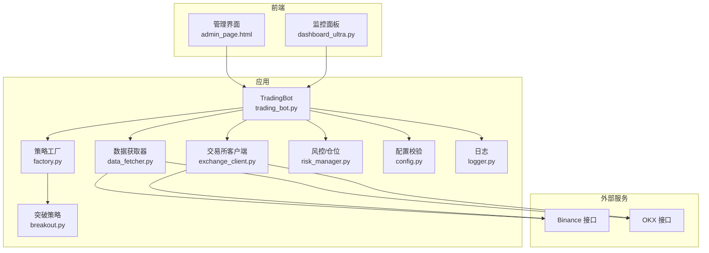
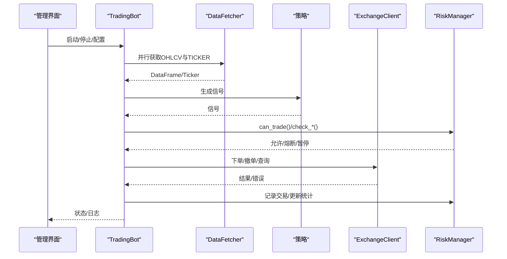
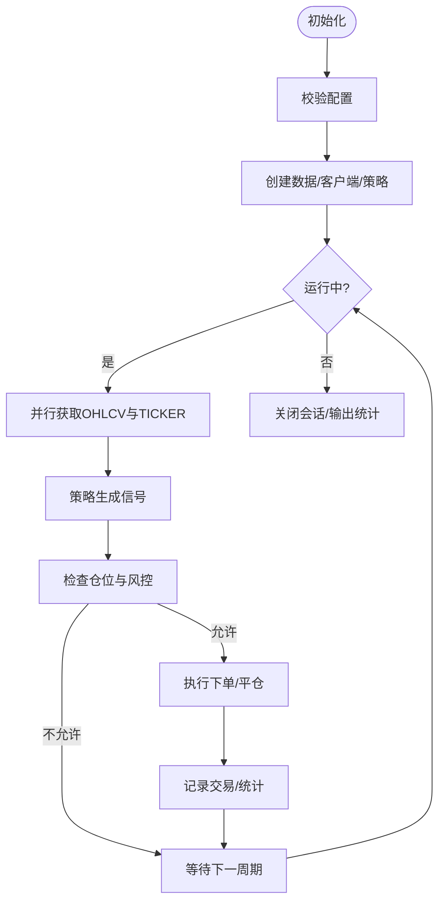
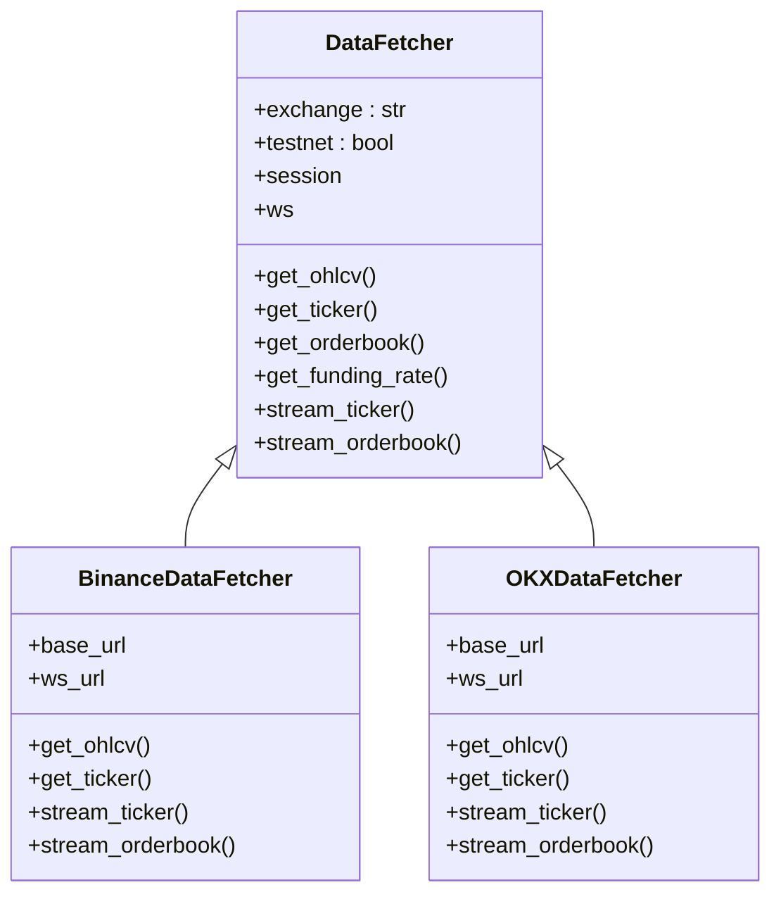
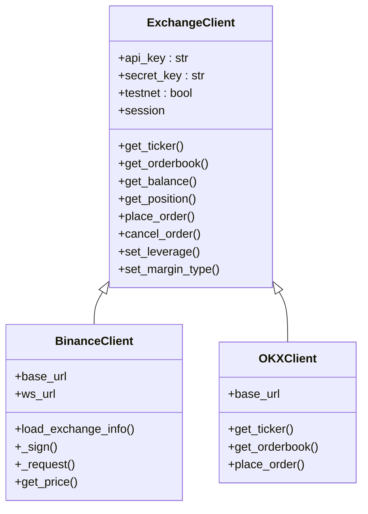
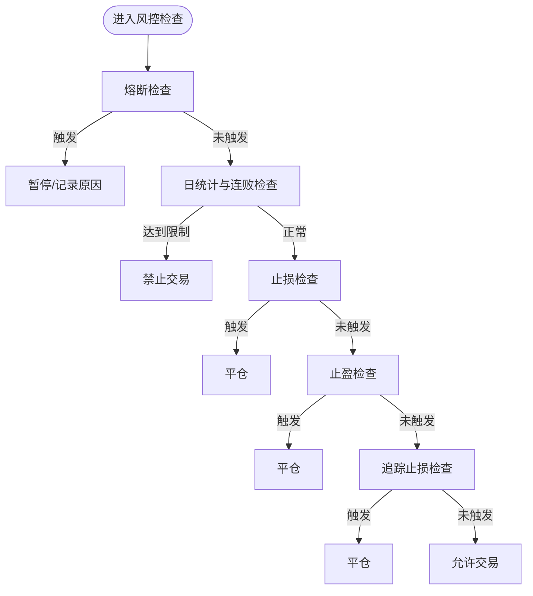
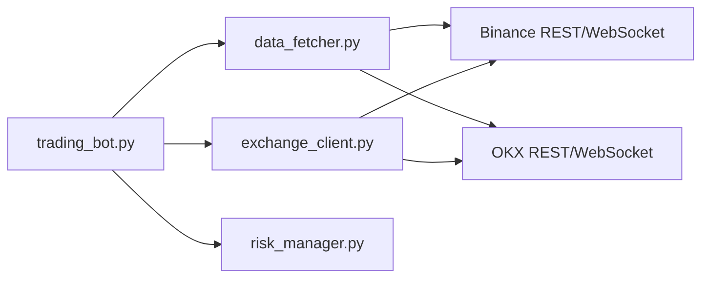

# 故障排除

<cite>
**本文引用的文件**
- [configs/config.json](file://configs/config.json)
- [src/trading_bot.py](file://src/trading_bot.py)
- [src/data/data_fetcher.py](file://src/data/data_fetcher.py)
- [src/execution/exchange_client.py](file://src/execution/exchange_client.py)
- [src/utils/logger.py](file://src/utils/logger.py)
- [src/utils/config.py](file://src/utils/config.py)
- [src/utils/risk_manager.py](file://src/utils/risk_manager.py)
- [src/execution/retry.py](file://src/execution/retry.py)
- [src/strategies/breakout.py](file://src/strategies/breakout.py)
- [src/strategies/factory.py](file://src/strategies/factory.py)
- [src/ui/admin_page.html](file://src/ui/admin_page.html)
- [scripts/ws_realtime_demo.py](file://scripts/ws_realtime_demo.py)
- [requirements.txt](file://requirements.txt)
</cite>

## 目录
1. [简介](#简介)
2. [项目结构](#项目结构)
3. [核心组件](#核心组件)
4. [架构总览](#架构总览)
5. [详细组件分析](#详细组件分析)
6. [依赖关系分析](#依赖关系分析)
7. [性能考虑](#性能考虑)
8. [故障排除指南](#故障排除指南)
9. [结论](#结论)
10. [附录](#附录)

## 简介
本指南面向量化交易系统的运维与开发人员，聚焦于系统在实际运行中可能遇到的连接失败、数据异常、交易错误与性能问题，提供可操作的诊断步骤、错误代码解读、调试方法、性能优化策略、监控告警配置以及应急处理流程。内容基于仓库中的数据获取、执行、风控、策略与配置等模块进行归纳总结。

## 项目结构
系统采用分层架构：数据层负责行情与K线拉取及WebSocket订阅；策略层负责信号生成；执行层负责下单与撤单；风控层负责仓位与熔断；配置与日志贯穿全局。前端提供可视化仪表盘与后台管理页面，支持连接测试与状态展示。

**图示来源**
- [src/trading_bot.py](file://src/trading_bot.py#L27-L91)
- [src/data/data_fetcher.py](file://src/data/data_fetcher.py#L17-L67)
- [src/execution/exchange_client.py](file://src/execution/exchange_client.py#L20-L85)
- [src/utils/risk_manager.py](file://src/utils/risk_manager.py#L12-L52)
- [src/utils/config.py](file://src/utils/config.py#L15-L37)
- [src/utils/logger.py](file://src/utils/logger.py#L12-L28)
- [src/ui/admin_page.html](file://src/ui/admin_page.html#L727-L789)

**章节来源**
- [src/trading_bot.py](file://src/trading_bot.py#L27-L91)
- [src/data/data_fetcher.py](file://src/data/data_fetcher.py#L17-L67)
- [src/execution/exchange_client.py](file://src/execution/exchange_client.py#L20-L85)
- [src/utils/risk_manager.py](file://src/utils/risk_manager.py#L12-L52)
- [src/utils/config.py](file://src/utils/config.py#L15-L37)
- [src/utils/logger.py](file://src/utils/logger.py#L12-L28)
- [src/ui/admin_page.html](file://src/ui/admin_page.html#L727-L789)

## 核心组件
- 交易机器人：负责初始化、数据拉取、策略分析、信号执行、风控检查与仓位管理。
- 数据获取器：封装Binance/OKX的REST与WebSocket接口，提供K线、行情、订单簿与资金费率等数据。
- 交易所客户端：封装Binance/OKX的REST接口，负责下单、撤单、杠杆与保证金模式设置等。
- 风控与仓位：提供熔断、止损止盈、追踪止损、日统计与暂停/恢复逻辑。
- 配置与日志：提供配置校验、默认值合并、统一日志输出与异常记录。
- 策略工厂与策略：支持多种策略并可组合，策略内部包含指标计算与信号生成。

**章节来源**
- [src/trading_bot.py](file://src/trading_bot.py#L27-L91)
- [src/data/data_fetcher.py](file://src/data/data_fetcher.py#L17-L67)
- [src/execution/exchange_client.py](file://src/execution/exchange_client.py#L20-L85)
- [src/utils/risk_manager.py](file://src/utils/risk_manager.py#L12-L52)
- [src/utils/config.py](file://src/utils/config.py#L15-L37)
- [src/utils/logger.py](file://src/utils/logger.py#L12-L28)
- [src/strategies/factory.py](file://src/strategies/factory.py#L10-L36)
- [src/strategies/breakout.py](file://src/strategies/breakout.py#L6-L20)

## 架构总览
系统以TradingBot为核心，按“数据-策略-执行-风控”链路运行。数据层与执行层均通过工厂方法选择具体交易所实现；风控在下单与平仓前后介入；日志贯穿全流程，便于定位问题。

**图示来源**
- [src/trading_bot.py](file://src/trading_bot.py#L92-L205)
- [src/data/data_fetcher.py](file://src/data/data_fetcher.py#L85-L142)
- [src/execution/exchange_client.py](file://src/execution/exchange_client.py#L136-L171)
- [src/utils/risk_manager.py](file://src/utils/risk_manager.py#L175-L194)

**章节来源**
- [src/trading_bot.py](file://src/trading_bot.py#L92-L205)
- [src/data/data_fetcher.py](file://src/data/data_fetcher.py#L85-L142)
- [src/execution/exchange_client.py](file://src/execution/exchange_client.py#L136-L171)
- [src/utils/risk_manager.py](file://src/utils/risk_manager.py#L175-L194)

## 详细组件分析

### 交易机器人（TradingBot）
- 初始化：校验配置、创建数据获取器与客户端、实例化策略。
- 主循环：并行拉取K线与行情，生成信号，检查仓位与风控，执行下单/平仓。
- 统计：记录每日交易次数、胜/负、盈亏与暂停原因。

**图示来源**
- [src/trading_bot.py](file://src/trading_bot.py#L63-L91)
- [src/trading_bot.py](file://src/trading_bot.py#L256-L283)

**章节来源**
- [src/trading_bot.py](file://src/trading_bot.py#L63-L91)
- [src/trading_bot.py](file://src/trading_bot.py#L256-L283)

### 数据获取器（DataFetcher）
- REST接口：K线、24小时行情、订单簿、资金费率等，统一超时与错误处理。
- WebSocket接口：订阅实时行情与订单簿，回调驱动事件处理。
- 错误处理：当返回包含错误码时抛出异常，便于上层捕获与记录。

**图示来源**
- [src/data/data_fetcher.py](file://src/data/data_fetcher.py#L17-L71)
- [src/data/data_fetcher.py](file://src/data/data_fetcher.py#L73-L235)
- [src/data/data_fetcher.py](file://src/data/data_fetcher.py#L237-L397)

**章节来源**
- [src/data/data_fetcher.py](file://src/data/data_fetcher.py#L17-L71)
- [src/data/data_fetcher.py](file://src/data/data_fetcher.py#L85-L142)
- [src/data/data_fetcher.py](file://src/data/data_fetcher.py#L188-L234)
- [src/data/data_fetcher.py](file://src/data/data_fetcher.py#L237-L397)

### 交易所客户端（ExchangeClient）
- REST接口：行情、账户、仓位、下单、撤单、杠杆与保证金模式设置。
- 错误处理：对非2xx响应或返回错误码时抛出异常；对无API Key场景提供降级返回。
- 签名与精度：Binance下单时动态加载精度并按步长取整，避免下单失败。

**图示来源**
- [src/execution/exchange_client.py](file://src/execution/exchange_client.py#L20-L85)
- [src/execution/exchange_client.py](file://src/execution/exchange_client.py#L87-L343)
- [src/execution/exchange_client.py](file://src/execution/exchange_client.py#L345-L411)

**章节来源**
- [src/execution/exchange_client.py](file://src/execution/exchange_client.py#L20-L85)
- [src/execution/exchange_client.py](file://src/execution/exchange_client.py#L136-L171)
- [src/execution/exchange_client.py](file://src/execution/exchange_client.py#L226-L275)
- [src/execution/exchange_client.py](file://src/execution/exchange_client.py#L345-L411)

### 风控与仓位（RiskManager/PositionManager）
- 风控：熔断阈值、单日交易上限、连败限制、止损/止盈/追踪止损检查。
- 仓位：开仓/平仓、更新浮动盈亏、设置止损止盈价格、查询与汇总。

**图示来源**
- [src/utils/risk_manager.py](file://src/utils/risk_manager.py#L129-L154)
- [src/utils/risk_manager.py](file://src/utils/risk_manager.py#L155-L174)
- [src/utils/risk_manager.py](file://src/utils/risk_manager.py#L73-L88)
- [src/utils/risk_manager.py](file://src/utils/risk_manager.py#L90-L105)
- [src/utils/risk_manager.py](file://src/utils/risk_manager.py#L107-L127)

**章节来源**
- [src/utils/risk_manager.py](file://src/utils/risk_manager.py#L129-L154)
- [src/utils/risk_manager.py](file://src/utils/risk_manager.py#L155-L174)
- [src/utils/risk_manager.py](file://src/utils/risk_manager.py#L73-L88)
- [src/utils/risk_manager.py](file://src/utils/risk_manager.py#L90-L105)
- [src/utils/risk_manager.py](file://src/utils/risk_manager.py#L107-L127)

### 策略与工厂
- 策略工厂：根据配置创建具体策略，支持多策略组合。
- 突破策略：计算移动平均、布林带、MACD、RSI等指标并生成信号。

**章节来源**
- [src/strategies/factory.py](file://src/strategies/factory.py#L10-L36)
- [src/strategies/breakout.py](file://src/strategies/breakout.py#L21-L62)
- [src/strategies/breakout.py](file://src/strategies/breakout.py#L64-L78)

## 依赖关系分析
- 第三方库：aiohttp/websockets用于异步HTTP/WebSocket；pandas/numpy用于数据处理；ccxt/kafka/redis等用于扩展能力。
- 交易相关：python-binance、okx用于官方SDK（可选）；本项目主要使用自研REST/WebSocket封装。

**图示来源**
- [src/trading_bot.py](file://src/trading_bot.py#L14-L22)
- [src/data/data_fetcher.py](file://src/data/data_fetcher.py#L76-L83)
- [src/execution/exchange_client.py](file://src/execution/exchange_client.py#L90-L99)

**章节来源**
- [requirements.txt](file://requirements.txt#L3-L13)
- [src/trading_bot.py](file://src/trading_bot.py#L14-L22)
- [src/data/data_fetcher.py](file://src/data/data_fetcher.py#L76-L83)
- [src/execution/exchange_client.py](file://src/execution/exchange_client.py#L90-L99)

## 性能考虑
- 并发与超时：数据与行情并行获取，REST请求设置统一超时，WebSocket心跳维持连接。
- 精度与步长：下单数量按交易所步长取整，避免因精度导致的下单失败。
- 日志与统计：统一日志输出，便于快速定位瓶颈；风控统计帮助评估系统表现。
- 优化建议：缓存常用配置（如交易所规则）、减少不必要的序列化、合理设置轮询间隔、在高延迟网络下增加超时与重试策略。

**章节来源**
- [src/trading_bot.py](file://src/trading_bot.py#L95-L98)
- [src/data/data_fetcher.py](file://src/data/data_fetcher.py#L14-L25)
- [src/execution/exchange_client.py](file://src/execution/exchange_client.py#L16-L30)
- [src/execution/exchange_client.py](file://src/execution/exchange_client.py#L241-L254)
- [src/utils/logger.py](file://src/utils/logger.py#L12-L28)

## 故障排除指南

### 一、连接失败
- 现象
  - REST请求报错或返回错误码。
  - WebSocket连接中断、无法接收实时行情。
  - 管理界面“验证连接”失败。
- 诊断步骤
  - 检查API Key/Secret与测试网开关是否正确。
  - 校验网络连通性与代理设置。
  - 查看日志中的异常堆栈与错误消息。
  - 使用实时演示脚本验证WebSocket订阅。
- 常见原因与解决
  - API凭据无效：在配置文件或环境变量中核对密钥。
  - 交易所限流/风控：降低请求频率或切换至备用节点。
  - 网络不稳定：增加超时、启用重试、使用本地DNS。
  - WebSocket心跳失败：检查防火墙与心跳参数。

**章节来源**
- [src/execution/exchange_client.py](file://src/execution/exchange_client.py#L165-L170)
- [src/data/data_fetcher.py](file://src/data/data_fetcher.py#L97-L98)
- [src/data/data_fetcher.py](file://src/data/data_fetcher.py#L196-L211)
- [src/ui/admin_page.html](file://src/ui/admin_page.html#L746-L778)
- [scripts/ws_realtime_demo.py](file://scripts/ws_realtime_demo.py#L30-L40)

### 二、数据异常
- 现象
  - K线为空或字段缺失；行情价格为0；订单簿买卖盘为空。
- 诊断步骤
  - 确认交易对格式与时间周期是否正确。
  - 检查返回数据结构与错误码。
  - 对比不同交易所的数据差异。
- 常见原因与解决
  - 交易对不存在或格式错误：按交易所规范修正（如OKX使用合约格式）。
  - 限流导致数据缺失：降低请求频率或分批拉取。
  - WebSocket断流：自动重连并校验增量ID。

**章节来源**
- [src/data/data_fetcher.py](file://src/data/data_fetcher.py#L95-L119)
- [src/data/data_fetcher.py](file://src/data/data_fetcher.py#L121-L142)
- [src/data/data_fetcher.py](file://src/data/data_fetcher.py#L144-L157)
- [src/data/data_fetcher.py](file://src/data/data_fetcher.py#L188-L234)

### 三、交易错误
- 现象
  - 下单失败、返回错误码；撤单无响应；仓位查询异常。
- 诊断步骤
  - 捕获并记录异常，查看错误码与消息。
  - 核对下单参数（方向、类型、数量、价格、杠杆）。
  - 检查风控是否拦截（熔断/日限额/暂停）。
- 常见原因与解决
  - 数量精度不符：按交易所步长取整。
  - 杠杆设置失败：先设置杠杆再下单。
  - 风控拦截：等待熔断冷却或调整限额。
  - 未设置API Key：仅能读取公开数据，下单需凭据。

**章节来源**
- [src/execution/exchange_client.py](file://src/execution/exchange_client.py#L165-L170)
- [src/execution/exchange_client.py](file://src/execution/exchange_client.py#L226-L275)
- [src/execution/exchange_client.py](file://src/execution/exchange_client.py#L302-L318)
- [src/utils/risk_manager.py](file://src/utils/risk_manager.py#L175-L194)

### 四、性能问题
- 现象
  - 主循环卡顿、日志堆积、CPU占用高。
- 诊断步骤
  - 分析日志时间戳，定位耗时环节。
  - 检查是否存在阻塞调用或过度重试。
  - 观察WebSocket回调频率与处理耗时。
- 优化建议
  - 使用异步I/O与合理的超时配置。
  - 减少不必要的DataFrame转换与列操作。
  - 合理设置轮询间隔与缓存热点数据。

**章节来源**
- [src/trading_bot.py](file://src/trading_bot.py#L264-L283)
- [src/data/data_fetcher.py](file://src/data/data_fetcher.py#L14-L25)
- [src/execution/exchange_client.py](file://src/execution/exchange_client.py#L16-L30)

### 五、错误代码与含义
- Binance错误码
  - 非2xx响应或返回体包含错误码时视为失败，需根据具体code/msg处理。
- OKX错误码
  - 返回码非成功标识时抛出异常，需检查请求参数与订阅通道。
- 建议
  - 将错误码映射到可读提示，区分网络错误、限流、参数错误与系统错误。

**章节来源**
- [src/execution/exchange_client.py](file://src/execution/exchange_client.py#L165-L167)
- [src/data/data_fetcher.py](file://src/data/data_fetcher.py#L97-L98)
- [src/data/data_fetcher.py](file://src/data/data_fetcher.py#L264-L265)

### 六、调试方法与工具
- 日志分析
  - 使用统一logger输出，结合异常记录辅助定位。
- 网络抓包
  - 使用实时演示脚本验证WebSocket订阅与数据推送。
- 性能分析
  - 关注主循环耗时、回调处理耗时与I/O等待时间。

**章节来源**
- [src/utils/logger.py](file://src/utils/logger.py#L12-L34)
- [scripts/ws_realtime_demo.py](file://scripts/ws_realtime_demo.py#L30-L40)
- [src/trading_bot.py](file://src/trading_bot.py#L264-L283)

### 七、监控与告警
- 系统状态
  - 管理界面提供系统在线状态指示与心跳检测。
- 指标建议
  - 运行时长、信号变更次数、下单成功率、风控触发率、WebSocket断线次数。
- 告警建议
  - 连续熔断、下单失败率过高、WebSocket断线、日限额触发等。

**章节来源**
- [src/ui/admin_page.html](file://src/ui/admin_page.html#L727-L744)
- [src/ui/admin_page.html](file://src/ui/admin_page.html#L404-L423)

### 八、应急处理与恢复
- 应急流程
  - 发现异常立即暂停交易（熔断/暂停），记录日志与错误码。
  - 重启系统，优先恢复网络与API连通性。
  - 校验配置与密钥，必要时回滚到上一稳定版本。
- 恢复策略
  - 重新建立WebSocket连接并校验数据完整性。
  - 重新设置杠杆与保证金模式，确保下单可用。
  - 检查风控统计与暂停状态，按策略恢复。

**章节来源**
- [src/utils/risk_manager.py](file://src/utils/risk_manager.py#L129-L154)
- [src/execution/exchange_client.py](file://src/execution/exchange_client.py#L302-L318)
- [src/trading_bot.py](file://src/trading_bot.py#L284-L296)

### 九、与交易所API相关的常见问题
- 限流处理
  - 降低请求频率、使用指数退避、分批请求。
- 网络延迟
  - 增加超时、启用心跳、在高延迟区域使用就近节点。
- 数据同步
  - WebSocket断线重连、校验增量ID、必要时回补REST数据。

**章节来源**
- [src/data/data_fetcher.py](file://src/data/data_fetcher.py#L196-L211)
- [src/data/data_fetcher.py](file://src/data/data_fetcher.py#L333-L359)
- [src/execution/exchange_client.py](file://src/execution/exchange_client.py#L16-L30)

## 结论
本指南围绕系统的关键模块与典型问题提供了可操作的排障路径。通过统一的日志、严格的配置校验、完善的风控与策略工厂、以及可扩展的监控界面，能够有效提升系统的稳定性与可维护性。建议在生产环境中持续完善告警与自动化恢复机制，并定期演练应急流程。

## 附录

### A. 配置校验与默认值
- 支持的交易所与策略列表、风险参数范围校验。
- 配置文件与默认配置的合并策略。

**章节来源**
- [src/utils/config.py](file://src/utils/config.py#L8-L37)
- [configs/config.json](file://configs/config.json#L1-L28)
- [src/trading_bot.py](file://src/trading_bot.py#L300-L320)

### B. 重试机制
- 当前重试占位，建议在撤单与关键下单场景引入指数退避与幂等键。

**章节来源**
- [src/execution/retry.py](file://src/execution/retry.py#L4-L6)