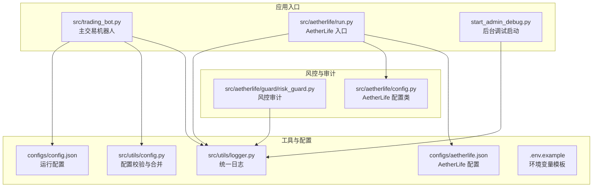
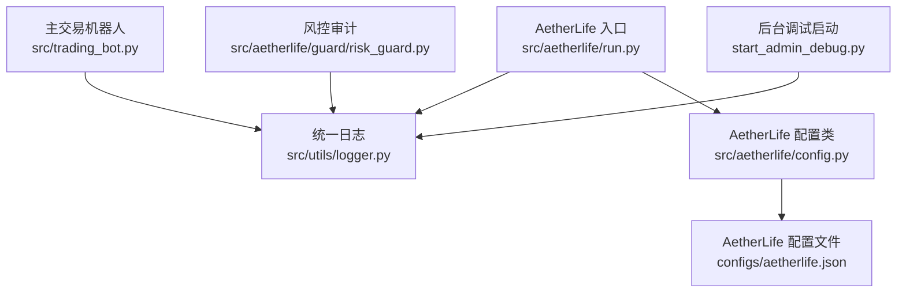
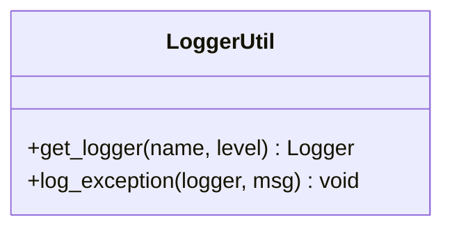
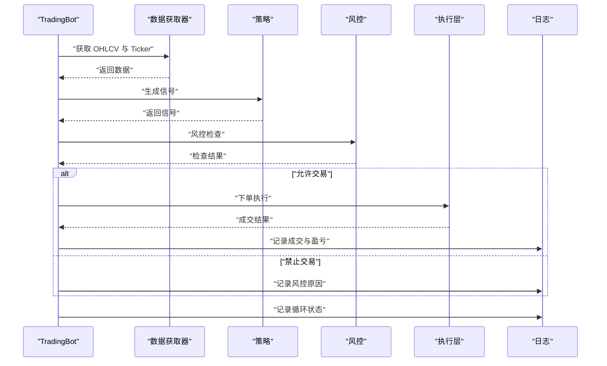
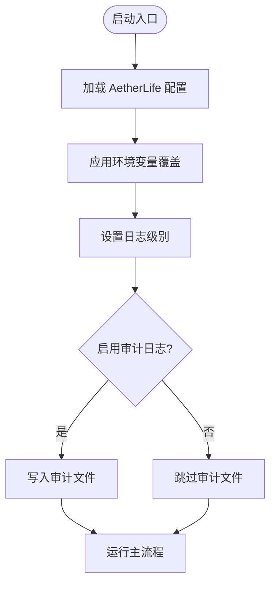
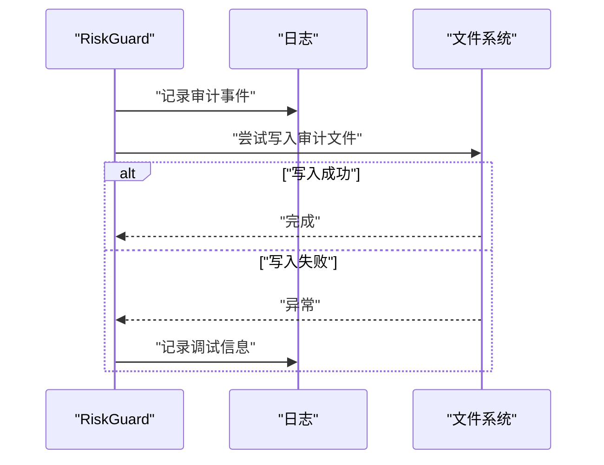
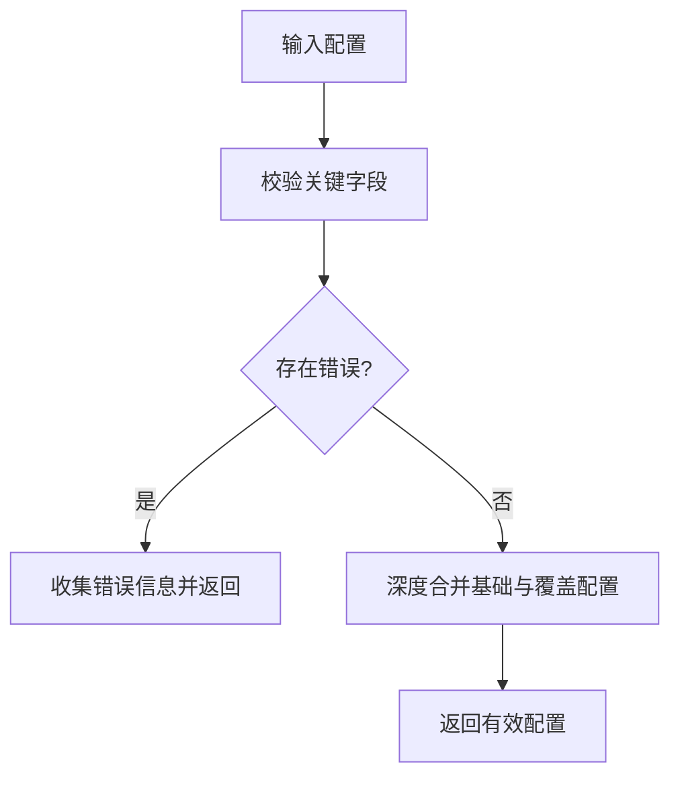
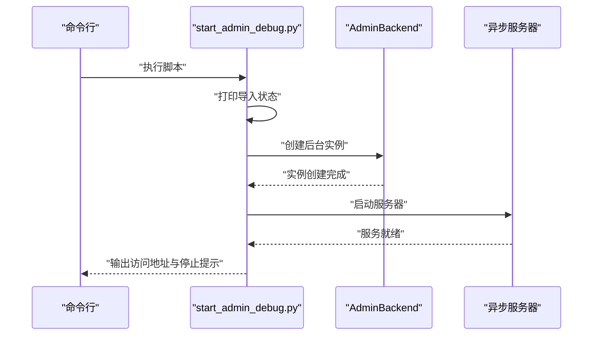
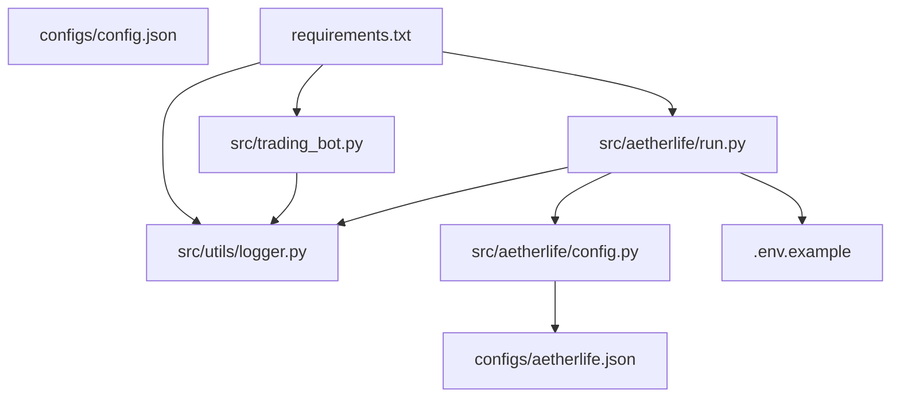

# 调试方法和工具

<cite>
**本文引用的文件**
- [src/utils/logger.py](file://src/utils/logger.py)
- [src/trading_bot.py](file://src/trading_bot.py)
- [src/aetherlife/config.py](file://src/aetherlife/config.py)
- [configs/config.json](file://configs/config.json)
- [configs/aetherlife.json](file://configs/aetherlife.json)
- [src/aetherlife/run.py](file://src/aetherlife/run.py)
- [src/aetherlife/guard/risk_guard.py](file://src/aetherlife/guard/risk_guard.py)
- [src/utils/config.py](file://src/utils/config.py)
- [start_admin_debug.py](file://start_admin_debug.py)
- [.env.example](file://.env.example)
- [requirements.txt](file://requirements.txt)
</cite>

## 目录
1. [简介](#简介)
2. [项目结构](#项目结构)
3. [核心组件](#核心组件)
4. [架构总览](#架构总览)
5. [详细组件分析](#详细组件分析)
6. [依赖分析](#依赖分析)
7. [性能考虑](#性能考虑)
8. [故障排查指南](#故障排查指南)
9. [结论](#结论)
10. [附录](#附录)

## 简介
本指南面向量化交易系统的开发者与运维人员，聚焦于调试方法与工具的实际使用。内容涵盖日志系统配置与管理、调试工具（Python 调试器、日志分析、网络抓包、性能分析）的实操步骤、调试会话的创建与管理、通过环境变量与配置文件切换调试模式与开启详细日志，以及结合系统实际的调试案例与最佳实践。

## 项目结构
该系统采用分层架构：数据层负责行情与外部数据接入；策略层负责信号生成；执行层负责下单与仓位管理；风控层负责限额与审计；UI 层提供后台管理与可视化；工具层提供日志、配置与风险辅助能力。调试相关的关键位置包括统一日志模块、主交易流程、AetherLife 配置与入口、风控审计日志、配置校验与合并逻辑，以及后台调试启动脚本。

**图示来源**
- [src/trading_bot.py](file://src/trading_bot.py#L1-L346)
- [src/aetherlife/run.py](file://src/aetherlife/run.py#L1-L71)
- [src/utils/logger.py](file://src/utils/logger.py#L1-L34)
- [src/utils/config.py](file://src/utils/config.py#L1-L49)
- [configs/config.json](file://configs/config.json#L1-L28)
- [configs/aetherlife.json](file://configs/aetherlife.json#L1-L17)
- [src/aetherlife/config.py](file://src/aetherlife/config.py#L1-L131)
- [src/aetherlife/guard/risk_guard.py](file://src/aetherlife/guard/risk_guard.py#L70-L83)
- [start_admin_debug.py](file://start_admin_debug.py#L1-L93)
- [.env.example](file://.env.example#L1-L17)

**章节来源**
- [src/trading_bot.py](file://src/trading_bot.py#L1-L346)
- [src/aetherlife/run.py](file://src/aetherlife/run.py#L1-L71)
- [src/utils/logger.py](file://src/utils/logger.py#L1-L34)
- [src/utils/config.py](file://src/utils/config.py#L1-L49)
- [configs/config.json](file://configs/config.json#L1-L28)
- [configs/aetherlife.json](file://configs/aetherlife.json#L1-L17)
- [src/aetherlife/config.py](file://src/aetherlife/config.py#L1-L131)
- [src/aetherlife/guard/risk_guard.py](file://src/aetherlife/guard/risk_guard.py#L70-L83)
- [start_admin_debug.py](file://start_admin_debug.py#L1-L93)
- [.env.example](file://.env.example#L1-L17)

## 核心组件
- 统一日志模块：提供控制台输出与可选文件输出，支持异常追踪记录，便于问题定位与后续接入监控。
- 主交易机器人：包含初始化、数据拉取、信号分析、风控检查、下单执行与仓位检查等关键流程，贯穿完整交易循环。
- AetherLife 配置体系：支持从 JSON 配置文件加载并覆盖环境变量，统一日志级别与审计路径等关键参数。
- 风控审计：在关键事件处输出审计日志，并可落盘到指定文件，便于事后复盘与合规审计。
- 配置校验与合并：提供配置项校验与深度合并逻辑，确保运行时配置合法且可叠加。
- 后台调试启动：提供调试模式下的后台服务启动脚本，便于快速验证与排障。

**章节来源**
- [src/utils/logger.py](file://src/utils/logger.py#L1-L34)
- [src/trading_bot.py](file://src/trading_bot.py#L27-L297)
- [src/aetherlife/config.py](file://src/aetherlife/config.py#L97-L131)
- [src/aetherlife/guard/risk_guard.py](file://src/aetherlife/guard/risk_guard.py#L70-L83)
- [src/utils/config.py](file://src/utils/config.py#L15-L49)
- [start_admin_debug.py](file://start_admin_debug.py#L25-L88)

## 架构总览
下图展示了调试相关的组件交互关系：主交易机器人与 AetherLife 入口均依赖统一日志模块；AetherLife 入口从配置文件与环境变量加载配置；风控模块在关键节点输出审计日志；后台调试启动脚本负责 UI 与服务的调试启动。

**图示来源**
- [src/utils/logger.py](file://src/utils/logger.py#L1-L34)
- [src/trading_bot.py](file://src/trading_bot.py#L24-L297)
- [src/aetherlife/run.py](file://src/aetherlife/run.py#L25-L67)
- [src/aetherlife/config.py](file://src/aetherlife/config.py#L97-L131)
- [configs/aetherlife.json](file://configs/aetherlife.json#L1-L17)
- [src/aetherlife/guard/risk_guard.py](file://src/aetherlife/guard/risk_guard.py#L70-L83)
- [start_admin_debug.py](file://start_admin_debug.py#L14-L88)

## 详细组件分析

### 统一日志系统
- 日志级别：默认 INFO，可通过配置文件与环境变量调整。
- 日志格式：包含时间戳、级别、名称与消息，便于快速定位。
- 输出目标：控制台输出；可扩展文件输出以满足长期留存与监控接入需求。
- 异常追踪：提供便捷的异常记录方法，自动输出堆栈信息。

**图示来源**
- [src/utils/logger.py](file://src/utils/logger.py#L12-L33)

**章节来源**
- [src/utils/logger.py](file://src/utils/logger.py#L1-L34)

### 主交易机器人调试要点
- 初始化阶段：校验配置、创建数据获取器与交易客户端、初始化策略与风控。
- 数据获取：并行拉取 OHLCV 与 Ticker，降低等待时间。
- 信号分析：基于策略生成信号，记录信号变化。
- 风控检查：在下单前检查风控条件，避免违规交易。
- 下单执行：根据信号与风控结果执行开仓/平仓，记录成交与盈亏。
- 仓位检查：定期检查止损/止盈条件，必要时强制平仓。
- 主循环异常：捕获异常并记录，避免进程崩溃。

**图示来源**
- [src/trading_bot.py](file://src/trading_bot.py#L92-L205)

**章节来源**
- [src/trading_bot.py](file://src/trading_bot.py#L63-L297)

### AetherLife 配置与调试模式
- 配置来源：优先从项目根目录的多个配置文件路径加载；支持通过环境变量覆盖关键字段（如符号、测试网、间隔等）。
- 日志级别：可在配置中设置全局日志级别，便于在不同场景下调整详细程度。
- 审计日志：可配置审计日志路径，落地到 JSONL 文件，便于离线分析与合规审计。

**图示来源**
- [src/aetherlife/run.py](file://src/aetherlife/run.py#L32-L67)
- [src/aetherlife/config.py](file://src/aetherlife/config.py#L97-L131)
- [configs/aetherlife.json](file://configs/aetherlife.json#L3-L10)

**章节来源**
- [src/aetherlife/run.py](file://src/aetherlife/run.py#L25-L67)
- [src/aetherlife/config.py](file://src/aetherlife/config.py#L97-L131)
- [configs/aetherlife.json](file://configs/aetherlife.json#L1-L17)

### 风控审计日志
- 审计事件：在关键事件处输出审计日志，包含事件类型与载荷。
- 文件落盘：可将审计事件序列化为 JSONL 并追加写入指定路径。
- 异常处理：写文件失败时记录调试信息，不影响主流程。

**图示来源**
- [src/aetherlife/guard/risk_guard.py](file://src/aetherlife/guard/risk_guard.py#L70-L83)

**章节来源**
- [src/aetherlife/guard/risk_guard.py](file://src/aetherlife/guard/risk_guard.py#L70-L83)

### 配置校验与合并
- 校验规则：检查交易所、交易对、策略、风控参数范围等，返回错误列表。
- 合并策略：深度合并基础配置与覆盖配置，保证不破坏原始结构。

**图示来源**
- [src/utils/config.py](file://src/utils/config.py#L15-L49)

**章节来源**
- [src/utils/config.py](file://src/utils/config.py#L15-L49)

### 后台调试启动
- 模块导入：打印导入过程与结果，便于定位依赖问题。
- 服务启动：创建后台实例并启动异步服务，提供访问地址与停止提示。
- 异常处理：捕获并打印异常堆栈，确保问题可见。

**图示来源**
- [start_admin_debug.py](file://start_admin_debug.py#L14-L88)

**章节来源**
- [start_admin_debug.py](file://start_admin_debug.py#L1-L93)

## 依赖分析
- 日志：系统广泛使用标准库 logging，统一日志模块提供便捷封装。
- 配置：运行时配置来自 JSON 文件与环境变量，AetherLife 配置类提供结构化读取与覆盖。
- 后台：FastAPI/Uvicorn 提供 Web 管理界面，便于调试与配置变更。
- 监控：Prometheus 与 structlog 提供监控与结构化日志能力，便于生产级观测。

**图示来源**
- [src/utils/logger.py](file://src/utils/logger.py#L1-L34)
- [src/trading_bot.py](file://src/trading_bot.py#L1-L346)
- [src/aetherlife/run.py](file://src/aetherlife/run.py#L1-L71)
- [src/aetherlife/config.py](file://src/aetherlife/config.py#L1-L131)
- [configs/config.json](file://configs/config.json#L1-L28)
- [configs/aetherlife.json](file://configs/aetherlife.json#L1-L17)
- [.env.example](file://.env.example#L1-L17)
- [requirements.txt](file://requirements.txt#L78-L81)

**章节来源**
- [requirements.txt](file://requirements.txt#L1-L92)

## 性能考虑
- 并行数据获取：在主交易机器人中对 OHLCV 与 Ticker 请求采用并行方式，减少等待时间。
- 日志级别：在调试阶段可提升日志级别以获取更详细信息，但应避免在生产环境过度输出，以免影响性能。
- 审计落盘：审计日志写入文件可能带来 I/O 压力，建议在高并发场景下评估频率与缓冲策略。
- 配置加载：尽量减少频繁读取与解析配置文件的次数，必要时进行缓存。

**章节来源**
- [src/trading_bot.py](file://src/trading_bot.py#L95-L98)
- [src/aetherlife/guard/risk_guard.py](file://src/aetherlife/guard/risk_guard.py#L77-L81)

## 故障排查指南

### 日志系统配置与使用
- 设置日志级别：在 AetherLife 配置文件中设置日志级别，或通过环境变量覆盖。
- 自定义日志格式：统一日志模块提供格式化器，可根据需要扩展字段（如线程 ID、请求 ID 等）。
- 审计日志：启用审计日志并指定文件路径，便于事后分析与合规审计。
- 异常追踪：在捕获异常时使用统一的日志异常记录方法，确保堆栈信息完整。

**章节来源**
- [src/utils/logger.py](file://src/utils/logger.py#L12-L33)
- [configs/aetherlife.json](file://configs/aetherlife.json#L3-L10)
- [src/aetherlife/guard/risk_guard.py](file://src/aetherlife/guard/risk_guard.py#L70-L83)

### 调试工具使用
- Python 调试器（pdb）：在关键函数入口设置断点，逐步执行，检查变量状态与调用栈，定位逻辑错误。
- 日志分析：结合日志级别与格式，筛选关键事件（如信号变化、下单结果、风控拦截），定位异常路径。
- 网络抓包工具（Wireshark）：在交易客户端与交易所 API 通信阶段抓包，核对请求参数、签名与响应状态，排查网络层面的问题。
- 性能分析工具（cProfile）：对高频函数（如信号生成、下单执行）进行性能剖析，识别热点与瓶颈。

**章节来源**
- [src/trading_bot.py](file://src/trading_bot.py#L101-L205)
- [requirements.txt](file://requirements.txt#L78-L81)

### 调试会话创建与管理
- 断点设置：在主循环、信号分析、下单执行等关键路径设置断点，观察状态变化。
- 变量检查：检查当前价格、信号、仓位、风控结果等关键变量，确认业务逻辑一致性。
- 调用栈分析：在异常发生时查看调用栈，定位异常来源与传播路径。

**章节来源**
- [src/trading_bot.py](file://src/trading_bot.py#L256-L282)

### 环境变量与配置文件调试模式切换
- 环境变量：通过环境变量覆盖符号、测试网、运行间隔等关键参数，便于快速切换调试场景。
- 配置文件：在 AetherLife 配置文件中设置日志级别与审计路径，确保调试期间有足够的可观测性。
- API 密钥：使用 .env 示例文件准备密钥，避免硬编码，提高安全性。

**章节来源**
- [src/aetherlife/run.py](file://src/aetherlife/run.py#L48-L48)
- [configs/aetherlife.json](file://configs/aetherlife.json#L3-L10)
- [.env.example](file://.env.example#L5-L16)

### 实际调试案例
- 案例一：信号未触发
  - 现象：长时间无交易信号。
  - 排查：检查信号生成逻辑与数据获取是否正常，核对日志中的信号列与最后信号变化记录。
  - 处理：调整策略参数或数据窗口，确认日志输出后再次运行。
- 案例二：下单失败
  - 现象：下单异常并记录异常日志。
  - 排查：查看异常堆栈与风控拦截原因，核对账户余额与最小下单量。
  - 处理：修正风控阈值或下单数量精度，重新尝试。
- 案例三：审计日志缺失
  - 现象：审计文件未生成。
  - 排查：确认审计路径是否存在、权限是否足够，检查写入异常日志。
  - 处理：修复路径或权限，确保文件夹存在且可写。

**章节来源**
- [src/trading_bot.py](file://src/trading_bot.py#L101-L205)
- [src/aetherlife/guard/risk_guard.py](file://src/aetherlife/guard/risk_guard.py#L70-L83)

## 结论
通过统一日志、完善的配置体系、风控审计与后台调试启动脚本，本系统提供了较为完整的调试能力。建议在开发与测试阶段充分利用日志级别与审计文件，在生产阶段谨慎调整日志输出与审计频率，同时结合 Python 调试器、日志分析、网络抓包与性能分析工具，形成系统化的调试闭环。

## 附录

### 常用调试命令与步骤
- 启动主交易机器人：在项目根目录执行主程序入口，观察初始化日志与主循环输出。
- 启动 AetherLife：在 src 目录下运行入口脚本，加载配置并启动主流程。
- 启动后台调试：执行后台调试启动脚本，访问本地管理页面进行配置与测试。
- 查看日志：根据日志级别筛选关键事件，结合异常追踪定位问题。
- 抓包分析：在交易客户端与交易所通信阶段使用抓包工具，核对请求与响应。
- 性能剖析：对高频函数使用性能分析工具，识别热点并优化。

**章节来源**
- [src/trading_bot.py](file://src/trading_bot.py#L323-L346)
- [src/aetherlife/run.py](file://src/aetherlife/run.py#L52-L67)
- [start_admin_debug.py](file://start_admin_debug.py#L57-L88)
- [requirements.txt](file://requirements.txt#L78-L81)