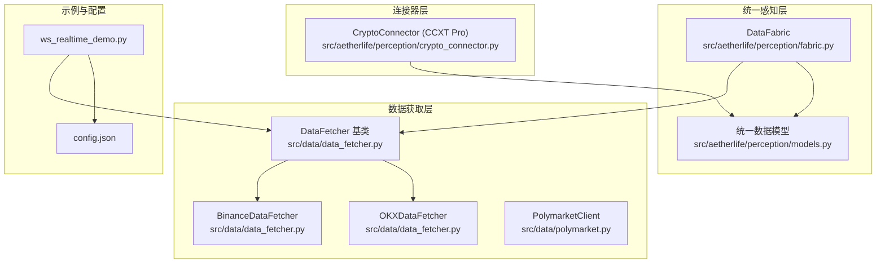
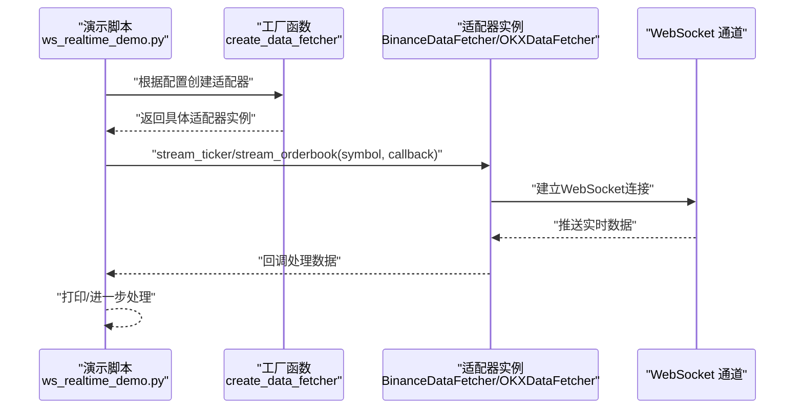
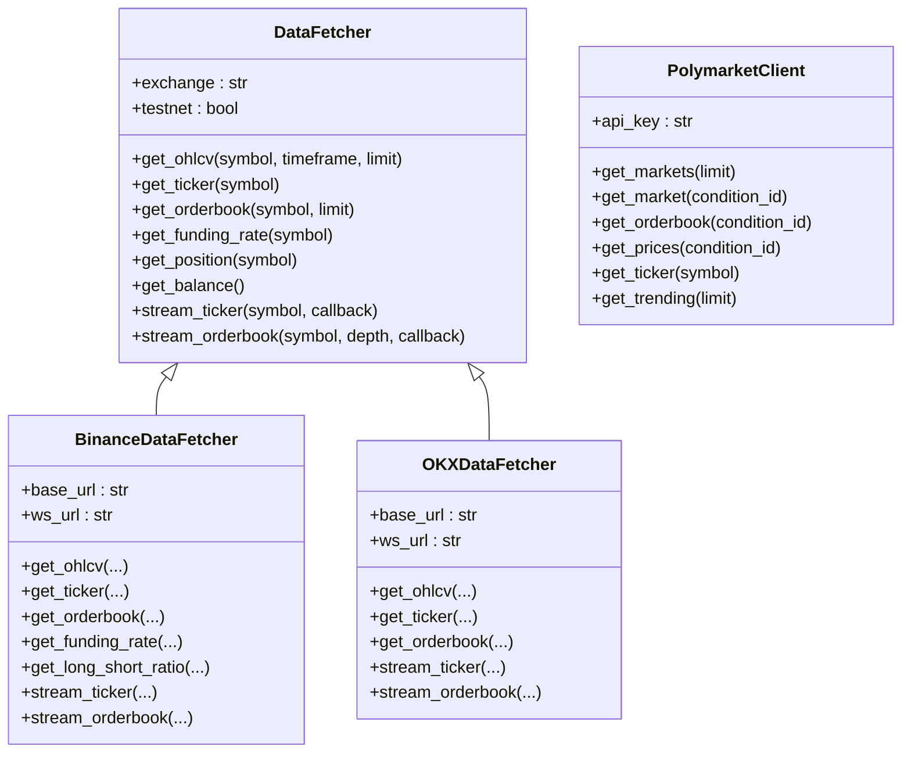
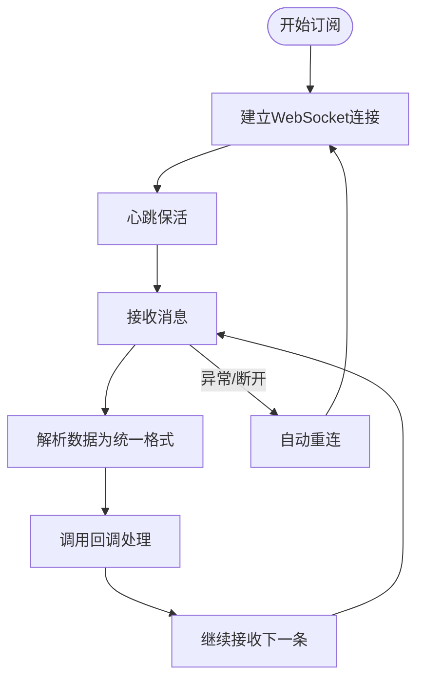
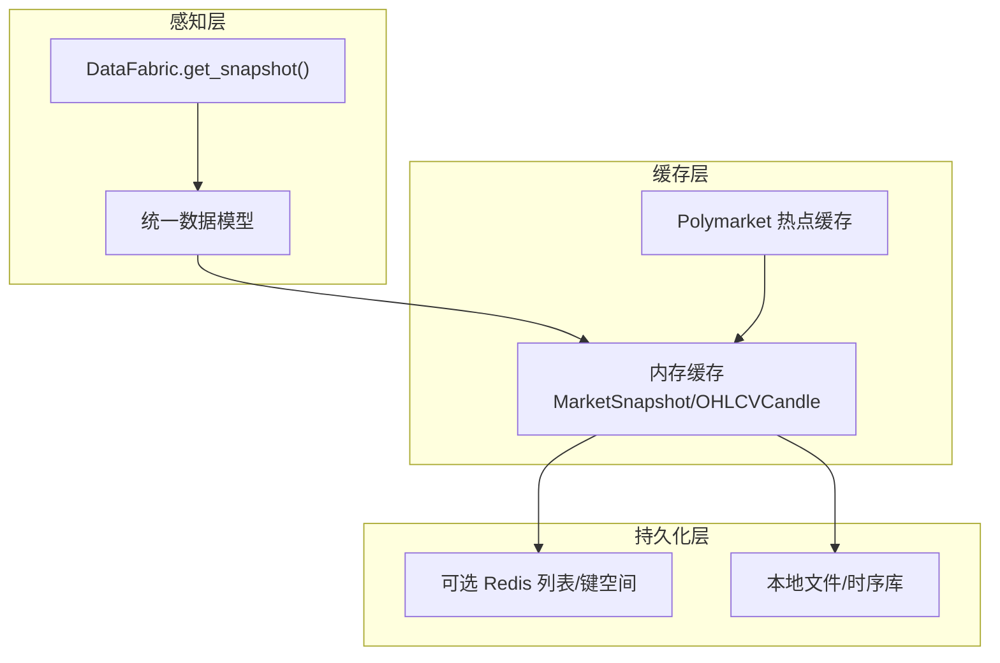
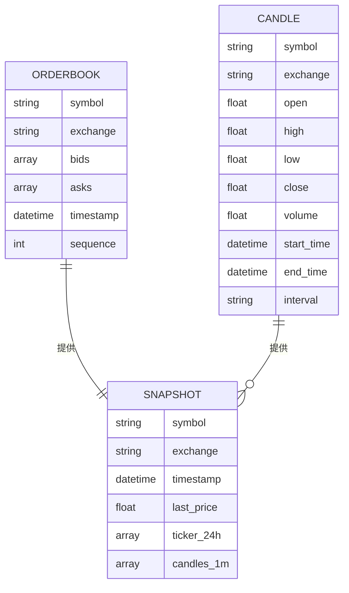
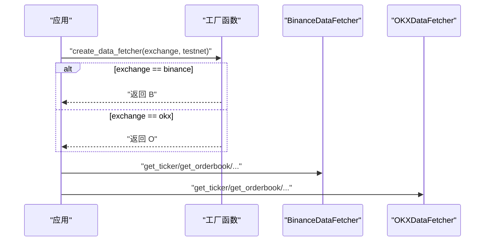
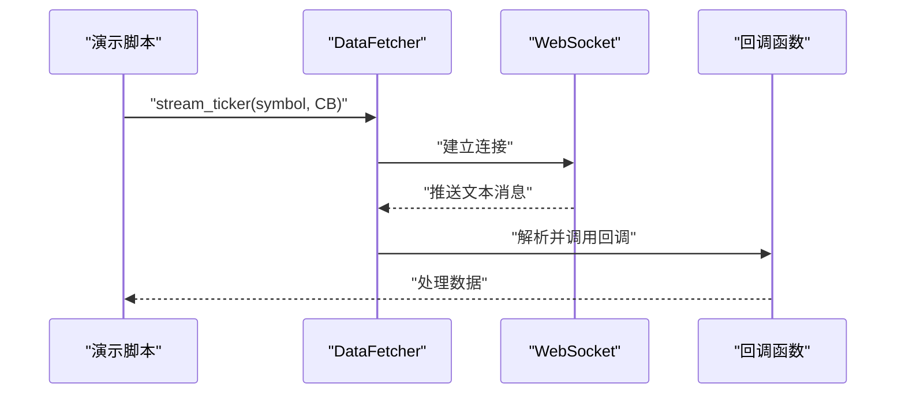
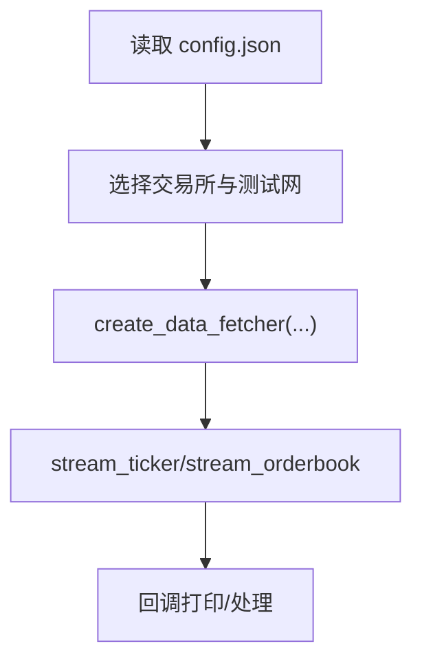
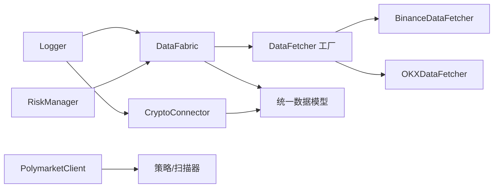

# 数据管理系统

<cite>
**本文引用的文件**
- [src/data/data_fetcher.py](file://src/data/data_fetcher.py)
- [src/data/binance.py](file://src/data/binance.py)
- [src/data/okx.py](file://src/data/okx.py)
- [src/data/polymarket.py](file://src/data/polymarket.py)
- [src/data/cache.py](file://src/data/cache.py)
- [src/aetherlife/perception/fabric.py](file://src/aetherlife/perception/fabric.py)
- [src/aetherlife/perception/models.py](file://src/aetherlife/perception/models.py)
- [src/aetherlife/perception/crypto_connector.py](file://src/aetherlife/perception/crypto_connector.py)
- [scripts/ws_realtime_demo.py](file://scripts/ws_realtime_demo.py)
- [configs/config.json](file://configs/config.json)
- [src/utils/logger.py](file://src/utils/logger.py)
- [src/utils/risk_manager.py](file://src/utils/risk_manager.py)
</cite>

## 目录
1. [引言](#引言)
2. [项目结构](#项目结构)
3. [核心组件](#核心组件)
4. [架构总览](#架构总览)
5. [组件详解](#组件详解)
6. [依赖关系分析](#依赖关系分析)
7. [性能考量](#性能考量)
8. [故障排查指南](#故障排查指南)
9. [结论](#结论)
10. [附录](#附录)

## 引言
本文件面向量化交易系统的数据管理系统，系统性阐述数据获取器架构的设计原理与实现细节，覆盖多交易所数据源的统一抽象与适配器模式应用；重点对比 Binance、OKX、Polymarket 的数据获取器实现差异与配置方法；解释实时数据流处理机制（WebSocket 连接管理、数据缓存策略、异常处理）；文档化数据存储方案（内存缓存、持久化存储与数据同步）；给出数据模型定义与字段说明（市场快照、交易数据、订单信息）；并提供数据质量保证与性能优化策略，帮助开发者进行数据访问与扩展。

## 项目结构
数据管理相关代码主要分布在以下模块：
- 数据获取层：src/data/data_fetcher.py（适配器基类与具体交易所实现）、src/data/polymarket.py（预测市场客户端与策略）
- 统一感知层：src/aetherlife/perception/fabric.py（DataFabric）、src/aetherlife/perception/models.py（统一数据模型）
- 连接器层：src/aetherlife/perception/crypto_connector.py（基于 CCXT Pro 的 WebSocket 连接器）
- 示例与配置：scripts/ws_realtime_demo.py（实时演示脚本）、configs/config.json（系统配置）
- 工具与风控：src/utils/logger.py（日志）、src/utils/risk_manager.py（风控）

**图示来源**
- [src/data/data_fetcher.py](file://src/data/data_fetcher.py#L17-L407)
- [src/aetherlife/perception/fabric.py](file://src/aetherlife/perception/fabric.py#L13-L87)
- [src/aetherlife/perception/models.py](file://src/aetherlife/perception/models.py#L15-L64)
- [src/aetherlife/perception/crypto_connector.py](file://src/aetherlife/perception/crypto_connector.py#L23-L370)
- [scripts/ws_realtime_demo.py](file://scripts/ws_realtime_demo.py#L30-L57)
- [configs/config.json](file://configs/config.json#L1-L28)

**章节来源**
- [src/data/data_fetcher.py](file://src/data/data_fetcher.py#L1-L434)
- [src/aetherlife/perception/fabric.py](file://src/aetherlife/perception/fabric.py#L1-L88)
- [src/aetherlife/perception/models.py](file://src/aetherlife/perception/models.py#L1-L64)
- [src/aetherlife/perception/crypto_connector.py](file://src/aetherlife/perception/crypto_connector.py#L1-L370)
- [scripts/ws_realtime_demo.py](file://scripts/ws_realtime_demo.py#L1-L62)
- [configs/config.json](file://configs/config.json#L1-L28)

## 核心组件
- 适配器基类 DataFetcher：定义统一接口（K线、行情、订单簿、资金费率、仓位、余额、实时流），并提供会话与WebSocket生命周期管理。
- 具体适配器：
  - BinanceDataFetcher：支持测试网/主网、REST与WebSocket，提供K线、24小时行情、深度、资金费率、多空比等。
  - OKXDataFetcher：支持测试网/主网、REST与WebSocket，提供K线、24小时行情、深度（books5/books）。
  - PolymarketClient：预测市场客户端，提供市场列表、订单簿、价格、趋势等。
- 统一感知层 DataFabric：将多源数据聚合为 MarketSnapshot，统一订单簿与K线格式。
- 统一数据模型：OrderBookSlice、OHLCVCandle、MarketSnapshot。
- 连接器 CryptoConnector：基于 CCXT Pro 的 WebSocket 订阅（Ticker/OrderBook/Trades），具备自动重连与回调分发。
- 示例与配置：ws_realtime_demo.py 展示如何通过工厂函数创建适配器并订阅实时流；config.json 提供系统默认配置。

**章节来源**
- [src/data/data_fetcher.py](file://src/data/data_fetcher.py#L17-L407)
- [src/aetherlife/perception/fabric.py](file://src/aetherlife/perception/fabric.py#L13-L87)
- [src/aetherlife/perception/models.py](file://src/aetherlife/perception/models.py#L15-L64)
- [src/aetherlife/perception/crypto_connector.py](file://src/aetherlife/perception/crypto_connector.py#L23-L370)
- [scripts/ws_realtime_demo.py](file://scripts/ws_realtime_demo.py#L30-L57)
- [configs/config.json](file://configs/config.json#L1-L28)

## 架构总览
系统采用“适配器 + 统一感知 + 连接器”的分层架构：
- 适配器层负责对接各交易所 REST/WebSocket 接口，屏蔽差异。
- 统一感知层将多源数据转换为统一数据模型，供上层策略与决策使用。
- 连接器层提供高性能 WebSocket 订阅能力，支持自动重连与并发回调。
- 示例脚本与配置文件用于快速验证与参数化运行。

**图示来源**
- [scripts/ws_realtime_demo.py](file://scripts/ws_realtime_demo.py#L30-L57)
- [src/data/data_fetcher.py](file://src/data/data_fetcher.py#L400-L407)
- [src/data/data_fetcher.py](file://src/data/data_fetcher.py#L188-L234)
- [src/data/data_fetcher.py](file://src/data/data_fetcher.py#L327-L396)

## 组件详解

### 适配器基类与具体实现
- DataFetcher 抽象了统一接口，包含：
  - 同步/异步会话管理与超时配置
  - REST 接口：K线、24小时行情、订单簿、资金费率、仓位、余额
  - WebSocket 接口：实时行情与订单簿订阅
- BinanceDataFetcher 特性：
  - 测试网/主网地址切换
  - REST：K线（返回DataFrame）、24小时行情、深度、资金费率、多空比
  - WebSocket：bookTicker（最优报价）、depth（深度，100ms更新）
- OKXDataFetcher 特性：
  - 测试网/主网地址切换
  - REST：K线（时间列单位毫秒，需反转为时间正序）、24小时行情、深度（books5/books）
  - WebSocket：订阅 tickers 与 books5/books
- PolymarketClient 特性：
  - 预测市场 REST 客户端，提供市场列表、订单簿、价格、趋势
  - PolymarketStrategy 与 ArbitrageScanner 提供策略扫描与套利检测

**图示来源**
- [src/data/data_fetcher.py](file://src/data/data_fetcher.py#L17-L407)
- [src/data/polymarket.py](file://src/data/polymarket.py#L13-L92)

**章节来源**
- [src/data/data_fetcher.py](file://src/data/data_fetcher.py#L17-L407)
- [src/data/polymarket.py](file://src/data/polymarket.py#L13-L92)

### 实时数据流处理机制
- WebSocket 连接管理：
  - 适配器层：心跳保活、异常捕获与断开处理，回调驱动数据流转。
  - CCXT Pro 连接器：自动重连、并发任务管理、回调分发、统一数据结构。
- 数据缓存策略：
  - DataFabric 在感知层聚合多源数据，形成 MarketSnapshot，作为一次性消费的数据快照。
  - PolymarketClient 提供按条件查询的缓存思路（可结合业务场景扩展）。
  - src/data/cache.py 当前为空实现，建议在感知层或策略层引入轻量缓存。
- 异常处理：
  - 适配器层对API错误码进行校验与异常抛出
  - CCXT Pro 连接器对回调异常进行日志记录与自动重连
  - 日志工具提供统一日志格式，便于问题定位

**图示来源**
- [src/data/data_fetcher.py](file://src/data/data_fetcher.py#L188-L234)
- [src/aetherlife/perception/crypto_connector.py](file://src/aetherlife/perception/crypto_connector.py#L116-L154)

**章节来源**
- [src/data/data_fetcher.py](file://src/data/data_fetcher.py#L188-L396)
- [src/aetherlife/perception/crypto_connector.py](file://src/aetherlife/perception/crypto_connector.py#L87-L277)
- [src/utils/logger.py](file://src/utils/logger.py#L12-L34)

### 数据存储方案
- 内存缓存：
  - DataFabric 聚合数据生成 MarketSnapshot，作为短期可用的统一视图
  - PolymarketClient 提供趋势与价格查询，可结合业务缓存热点数据
  - src/data/cache.py 当前为空实现，建议在感知层引入 LRU 或时间窗口缓存
- 持久化存储：
  - 记忆层 MemoryStore 支持内存与可选 Redis 持久化，适合交易事件与决策记录
  - 建议将 MarketSnapshot、OHLCVCandle 等写入时序数据库或本地文件归档
- 数据同步机制：
  - CCXT Pro 连接器提供统一回调，便于在回调中同时写入缓存与持久化
  - DataFabric 的 get_snapshot 可作为定时刷新的同步入口

**图示来源**
- [src/aetherlife/perception/fabric.py](file://src/aetherlife/perception/fabric.py#L32-L82)
- [src/aetherlife/perception/models.py](file://src/aetherlife/perception/models.py#L15-L64)
- [src/aetherlife/memory/store.py](file://src/aetherlife/memory/store.py#L43-L48)

**章节来源**
- [src/aetherlife/perception/fabric.py](file://src/aetherlife/perception/fabric.py#L13-L87)
- [src/aetherlife/perception/models.py](file://src/aetherlife/perception/models.py#L15-L64)
- [src/aetherlife/memory/store.py](file://src/aetherlife/memory/store.py#L43-L48)
- [src/data/cache.py](file://src/data/cache.py#L4-L7)

### 数据模型定义与字段说明
- OrderBookSlice：统一订单簿快照，包含 symbol、exchange、bids、asks、timestamp、sequence 等
- OHLCVCandle：统一K线，包含 open、high、low、close、volume、start_time、end_time、interval
- MarketSnapshot：统一市场快照，包含 orderbook、last_price、ticker_24h、candles_1m、timestamp

**图示来源**
- [src/aetherlife/perception/models.py](file://src/aetherlife/perception/models.py#L15-L64)

**章节来源**
- [src/aetherlife/perception/models.py](file://src/aetherlife/perception/models.py#L15-L64)

### 多交易所数据源的统一抽象与适配器模式
- 统一抽象：DataFetcher 定义统一接口，屏蔽 REST/WebSocket 差异
- 适配器模式：BinanceDataFetcher、OKXDataFetcher 分别实现各自协议细节
- 工厂函数：create_data_fetcher 根据配置选择具体适配器，便于替换与扩展

**图示来源**
- [src/data/data_fetcher.py](file://src/data/data_fetcher.py#L400-L407)

**章节来源**
- [src/data/data_fetcher.py](file://src/data/data_fetcher.py#L17-L407)

### 实时数据流与回调处理流程
- Binance WebSocket：bookTicker 与 depth 订阅，回调解析为统一格式
- OKX WebSocket：订阅 tickers 与 books5/books，回调解析为统一格式
- CCXT Pro：watch_ticker/watch_orderbook/watch_trades，统一回调数据结构

**图示来源**
- [src/data/data_fetcher.py](file://src/data/data_fetcher.py#L188-L234)
- [src/data/data_fetcher.py](file://src/data/data_fetcher.py#L327-L396)
- [scripts/ws_realtime_demo.py](file://scripts/ws_realtime_demo.py#L30-L57)

**章节来源**
- [src/data/data_fetcher.py](file://src/data/data_fetcher.py#L188-L396)
- [scripts/ws_realtime_demo.py](file://scripts/ws_realtime_demo.py#L30-L57)

### 配置方法与示例
- 通过配置文件指定交易所、测试网、交易对、时间周期等
- 使用演示脚本快速验证 WebSocket 订阅（支持 binance/okx，ticker/orderbook）

**图示来源**
- [configs/config.json](file://configs/config.json#L1-L28)
- [scripts/ws_realtime_demo.py](file://scripts/ws_realtime_demo.py#L30-L57)
- [src/data/data_fetcher.py](file://src/data/data_fetcher.py#L400-L407)

**章节来源**
- [configs/config.json](file://configs/config.json#L1-L28)
- [scripts/ws_realtime_demo.py](file://scripts/ws_realtime_demo.py#L20-L57)
- [src/data/data_fetcher.py](file://src/data/data_fetcher.py#L400-L407)

## 依赖关系分析
- DataFabric 依赖 DataFetcher 工厂函数创建具体适配器，并将 REST 结果转换为统一模型
- CryptoConnector 依赖统一数据模型，提供 WebSocket 订阅与自动重连
- PolymarketClient 独立于 DataFetcher，提供预测市场数据与策略扫描
- 日志与风控模块为系统提供可观测性与安全边界

**图示来源**
- [src/aetherlife/perception/fabric.py](file://src/aetherlife/perception/fabric.py#L23-L27)
- [src/data/data_fetcher.py](file://src/data/data_fetcher.py#L400-L407)
- [src/aetherlife/perception/crypto_connector.py](file://src/aetherlife/perception/crypto_connector.py#L23-L370)
- [src/data/polymarket.py](file://src/data/polymarket.py#L94-L201)
- [src/utils/logger.py](file://src/utils/logger.py#L12-L34)
- [src/utils/risk_manager.py](file://src/utils/risk_manager.py#L12-L52)

**章节来源**
- [src/aetherlife/perception/fabric.py](file://src/aetherlife/perception/fabric.py#L13-L87)
- [src/aetherlife/perception/crypto_connector.py](file://src/aetherlife/perception/crypto_connector.py#L23-L370)
- [src/data/data_fetcher.py](file://src/data/data_fetcher.py#L400-L407)
- [src/data/polymarket.py](file://src/data/polymarket.py#L94-L201)
- [src/utils/logger.py](file://src/utils/logger.py#L12-L34)
- [src/utils/risk_manager.py](file://src/utils/risk_manager.py#L12-L52)

## 性能考量
- 并行拉取：DataFabric 使用 asyncio.gather 并行获取订单簿、24小时行情与K线，降低等待时间
- 心跳保活：WebSocket 设置心跳，减少连接中断导致的重连成本
- 轻量缓存：在感知层引入 LRU 或时间窗口缓存，避免重复请求
- 限流与背压：CCXT Pro 提供 rate limit 与自动重连，建议在回调中加入背压与批处理
- 数据压缩：统一模型字段精简，减少序列化开销

[本节为通用性能建议，无需特定文件引用]

## 故障排查指南
- WebSocket 断开与重连：
  - 适配器层：捕获 CLOSED/ERROR 类型消息并退出循环
  - CCXT Pro：异常后等待固定时间重连，重新注册回调
- API 错误处理：
  - 适配器层对返回码进行校验并抛出异常
  - PolymarketClient 对请求异常进行捕获并记录
- 日志与追踪：
  - 使用统一 Logger 输出时间戳、级别与消息
  - 在回调异常处记录 traceback，便于定位

**章节来源**
- [src/data/data_fetcher.py](file://src/data/data_fetcher.py#L188-L234)
- [src/aetherlife/perception/crypto_connector.py](file://src/aetherlife/perception/crypto_connector.py#L146-L154)
- [src/data/polymarket.py](file://src/data/polymarket.py#L38-L39)
- [src/utils/logger.py](file://src/utils/logger.py#L31-L34)

## 结论
该数据管理系统通过适配器模式实现了多交易所数据源的统一抽象，配合统一感知层与连接器层，提供了高效、可扩展的实时数据获取与处理能力。建议在感知层引入轻量缓存与持久化策略，完善数据质量与性能保障，并持续扩展更多交易所与预测市场数据源。

[本节为总结性内容，无需特定文件引用]

## 附录

### 数据质量保证措施
- 字段校验：对API返回的关键字段进行存在性与类型校验
- 时间戳一致性：统一使用 UTC 时间戳，避免时区偏差
- 数据完整性：对空返回与异常状态进行显式处理，确保下游稳定

**章节来源**
- [src/data/data_fetcher.py](file://src/data/data_fetcher.py#L97-L118)
- [src/data/data_fetcher.py](file://src/data/data_fetcher.py#L264-L278)

### 性能优化策略
- 并行化：使用 asyncio.gather 并行拉取多源数据
- 缓存：在感知层引入 LRU/时间窗口缓存，减少重复请求
- 批处理：在回调中合并高频事件，降低处理开销
- 连接池：复用 aiohttp ClientSession，减少握手成本

**章节来源**
- [src/aetherlife/perception/fabric.py](file://src/aetherlife/perception/fabric.py#L37-L41)
- [src/data/data_fetcher.py](file://src/data/data_fetcher.py#L27-L30)

### 开发者扩展指导
- 新增交易所适配器：继承 DataFetcher，实现 REST/WebSocket 方法
- 新增数据模型：在统一模型中扩展字段，确保兼容既有组件
- 新增策略：基于 MarketSnapshot 进行策略开发，注意字段命名与类型
- 集成 CCXT Pro：使用 CryptoConnector 替代原生 WebSocket，获得自动重连与统一回调

**章节来源**
- [src/data/data_fetcher.py](file://src/data/data_fetcher.py#L17-L66)
- [src/aetherlife/perception/models.py](file://src/aetherlife/perception/models.py#L15-L64)
- [src/aetherlife/perception/crypto_connector.py](file://src/aetherlife/perception/crypto_connector.py#L23-L86)