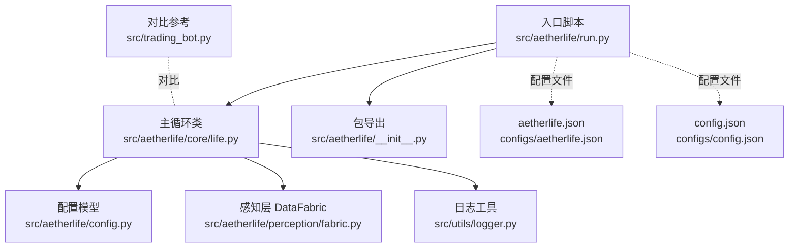
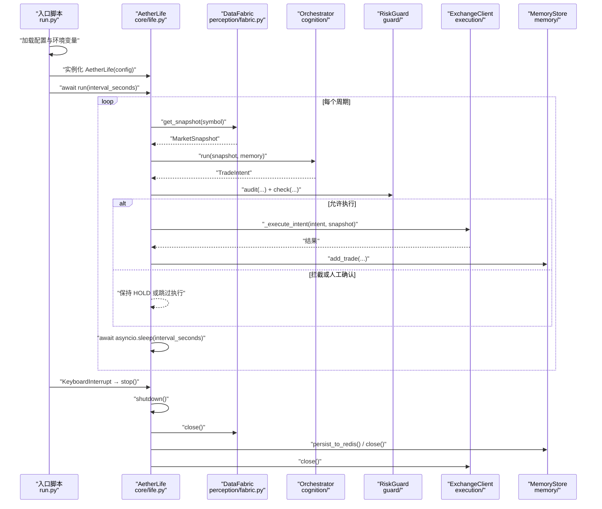
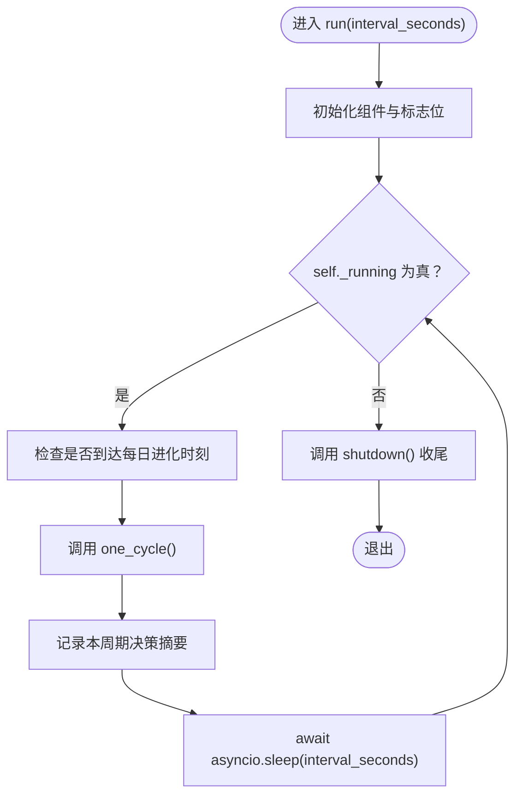
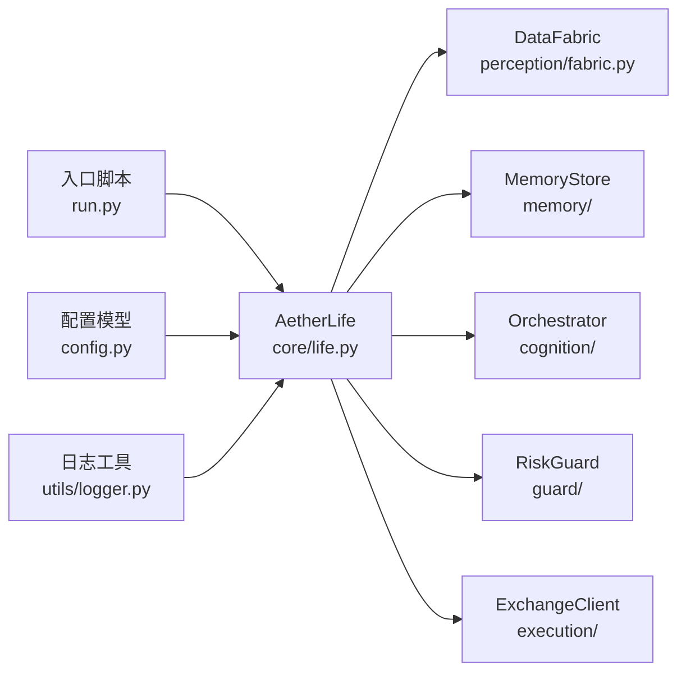

# 主循环控制

<cite>
**本文引用的文件**
- [src/aetherlife/run.py](file://src/aetherlife/run.py)
- [src/aetherlife/core/life.py](file://src/aetherlife/core/life.py)
- [src/aetherlife/__init__.py](file://src/aetherlife/__init__.py)
- [src/aetherlife/config.py](file://src/aetherlife/config.py)
- [src/aetherlife/perception/fabric.py](file://src/aetherlife/perception/fabric.py)
- [src/utils/logger.py](file://src/utils/logger.py)
- [configs/aetherlife.json](file://configs/aetherlife.json)
- [configs/config.json](file://configs/config.json)
- [src/trading_bot.py](file://src/trading_bot.py)
</cite>

## 目录
1. [简介](#简介)
2. [项目结构](#项目结构)
3. [核心组件](#核心组件)
4. [架构总览](#架构总览)
5. [详细组件分析](#详细组件分析)
6. [依赖关系分析](#依赖关系分析)
7. [性能考量](#性能考量)
8. [故障排查指南](#故障排查指南)
9. [结论](#结论)
10. [附录](#附录)

## 简介
本技术文档聚焦于“主循环控制模块”的实现与使用，围绕 AetherLife 的主循环 run() 方法展开，系统性阐述：
- 初始化流程与配置加载
- 循环调度与间隔控制机制
- 异步事件循环管理与并发控制
- 异常处理与优雅停机
- 资源管理、内存优化与系统稳定性保障
- 调试模式、日志级别控制与监控指标采集

该文档既面向开发者，也兼顾非技术读者的理解需求，通过图示与分层讲解帮助快速掌握主循环的工作原理与最佳实践。

## 项目结构
与主循环控制直接相关的关键文件与职责如下：
- 入口与运行时：src/aetherlife/run.py
- 核心生命周期与主循环：src/aetherlife/core/life.py
- 包导出与版本：src/aetherlife/__init__.py
- 配置模型与默认值：src/aetherlife/config.py
- 数据感知层：src/aetherlife/perception/fabric.py
- 日志工具：src/utils/logger.py
- 配置文件样例：configs/aetherlife.json、configs/config.json
- 对比参考：src/trading_bot.py（展示另一种主循环实现）

图表来源
- [src/aetherlife/run.py](file://src/aetherlife/run.py#L52-L71)
- [src/aetherlife/core/life.py](file://src/aetherlife/core/life.py#L20-L169)
- [src/aetherlife/config.py](file://src/aetherlife/config.py#L98-L131)
- [src/aetherlife/perception/fabric.py](file://src/aetherlife/perception/fabric.py#L13-L88)
- [src/utils/logger.py](file://src/utils/logger.py#L12-L34)
- [configs/aetherlife.json](file://configs/aetherlife.json#L1-L17)
- [configs/config.json](file://configs/config.json#L1-L28)
- [src/trading_bot.py](file://src/trading_bot.py#L256-L297)

章节来源
- [src/aetherlife/run.py](file://src/aetherlife/run.py#L1-L71)
- [src/aetherlife/core/life.py](file://src/aetherlife/core/life.py#L1-L169)
- [src/aetherlife/config.py](file://src/aetherlife/config.py#L1-L131)
- [src/aetherlife/perception/fabric.py](file://src/aetherlife/perception/fabric.py#L1-L88)
- [src/utils/logger.py](file://src/utils/logger.py#L1-L34)
- [configs/aetherlife.json](file://configs/aetherlife.json#L1-L17)
- [configs/config.json](file://configs/config.json#L1-L28)
- [src/trading_bot.py](file://src/trading_bot.py#L1-L346)

## 核心组件
- AetherLife：主循环主体，负责感知、记忆、认知、决策、守护与执行，并提供 run()/stop()/shutdown() 生命周期管理。
- DataFabric：统一感知层，负责并行拉取订单簿、Ticker、K线等数据，封装为 MarketSnapshot。
- 配置系统：AetherLifeConfig 提供全局配置，支持从 JSON 文件与环境变量加载。
- 日志系统：统一日志器，支持控制台输出与可选文件输出，便于排障与监控接入。
- 运行入口：run.py 负责加载配置、实例化 AetherLife、启动主循环并处理键盘中断与优雅停机。

章节来源
- [src/aetherlife/core/life.py](file://src/aetherlife/core/life.py#L20-L169)
- [src/aetherlife/perception/fabric.py](file://src/aetherlife/perception/fabric.py#L13-L88)
- [src/aetherlife/config.py](file://src/aetherlife/config.py#L98-L131)
- [src/utils/logger.py](file://src/utils/logger.py#L12-L34)
- [src/aetherlife/run.py](file://src/aetherlife/run.py#L52-L71)

## 架构总览
下图展示了主循环控制的整体调用链与数据流，从入口到感知、认知、决策、守护、执行与资源回收。

图表来源
- [src/aetherlife/run.py](file://src/aetherlife/run.py#L52-L71)
- [src/aetherlife/core/life.py](file://src/aetherlife/core/life.py#L59-L169)
- [src/aetherlife/perception/fabric.py](file://src/aetherlife/perception/fabric.py#L32-L82)

## 详细组件分析

### 主循环 run() 方法详解
- 初始化阶段
  - 实例化感知层 DataFabric、记忆层 MemoryStore、认知层 Orchestrator、风控层 RiskGuard。
  - 按需延迟初始化进化引擎 EvolutionEngine，并尝试从 Redis 加载记忆。
  - 设置运行标志 self._running = True，记录日志。
- 循环调度
  - 在 while self._running 循环中：
    - 每日凌晨特定小时（由配置指定）触发一次每日进化。
    - 调用 one_cycle() 完成一轮完整生命周期。
    - 记录本周期决策摘要。
    - 使用 asyncio.sleep(interval_seconds) 控制循环间隔。
- 异常处理
  - 每个周期内捕获异常并记录，避免中断主循环。
- 停止与优雅停机
  - stop() 将 self._running 设为 False 并记录日志。
  - shutdown() 关闭感知层、持久化记忆（若启用）、关闭内存连接、关闭交易客户端。

图表来源
- [src/aetherlife/core/life.py](file://src/aetherlife/core/life.py#L123-L155)
- [src/aetherlife/core/life.py](file://src/aetherlife/core/life.py#L160-L169)

章节来源
- [src/aetherlife/core/life.py](file://src/aetherlife/core/life.py#L123-L169)

### 循环间隔控制机制
- 参数作用
  - interval_seconds：控制主循环每周期之间的等待时长，默认来自环境变量 AETHERLIFE_INTERVAL，单位为秒。
- 动态调整策略
  - 当前实现采用固定间隔 asyncio.sleep(interval_seconds)。
  - 若需动态调整，可在 run() 中根据运行时指标（如上次周期耗时、队列长度、外部信号）更新该值，但当前仓库未实现此逻辑。
- 配置来源
  - 入口脚本从环境变量读取默认值，优先级：环境变量 > 配置文件 > 默认值。

章节来源
- [src/aetherlife/run.py](file://src/aetherlife/run.py#L62-L62)
- [src/aetherlife/core/life.py](file://src/aetherlife/core/life.py#L123-L155)

### 异步事件循环管理
- 事件循环与协程调度
  - run() 与 one_cycle() 均为异步方法，内部大量使用 await 与 asyncio.gather 并行拉取数据。
  - 主循环通过 asyncio.sleep(interval_seconds) 让出 CPU，避免阻塞。
- 并发控制
  - DataFabric.get_snapshot() 使用 asyncio.gather 并行获取订单簿、Ticker、K线，提升吞吐。
  - 认知层 Orchestrator 的并行分析能力由配置项控制（如并行深度），但具体实现不在本文件中。
- 资源释放
  - shutdown() 显式关闭感知层、内存连接与交易客户端，确保资源回收。

章节来源
- [src/aetherlife/core/life.py](file://src/aetherlife/core/life.py#L59-L122)
- [src/aetherlife/perception/fabric.py](file://src/aetherlife/perception/fabric.py#L32-L82)
- [src/aetherlife/core/life.py](file://src/aetherlife/core/life.py#L160-L169)

### 异常处理与优雅停机
- 异常处理
  - 主循环内捕获异常并记录，保证单次异常不影响后续周期。
  - one_cycle() 内部执行意图时捕获异常并记录，避免影响整体流程。
- 优雅停机
  - 键盘中断触发 stop()，随后在 finally 中调用 shutdown()。
  - shutdown() 顺序关闭各子系统，必要时进行持久化。

章节来源
- [src/aetherlife/core/life.py](file://src/aetherlife/core/life.py#L143-L154)
- [src/aetherlife/core/life.py](file://src/aetherlife/core/life.py#L89-L122)
- [src/aetherlife/run.py](file://src/aetherlife/run.py#L61-L66)

### 资源管理、内存优化与系统稳定性
- 资源管理
  - DataFabric 在首次使用时按需创建底层数据获取器，减少启动成本。
  - MemoryStore 支持从 Redis 加载与持久化，降低重启后的数据丢失风险。
  - ExchangeClient 按需创建，避免不必要的连接。
- 内存优化
  - 订单簿仅保留前 N 档，K线仅取最近若干根，降低内存占用。
  - 记忆层事件数量受配置限制，避免无限增长。
- 系统稳定性
  - 风控层在每日收益、回撤、人工确认等维度进行拦截，防止极端情况。
  - 每日进化在 UTC 小时点触发，避免与业务高峰冲突。

章节来源
- [src/aetherlife/perception/fabric.py](file://src/aetherlife/perception/fabric.py#L16-L82)
- [src/aetherlife/core/life.py](file://src/aetherlife/core/life.py#L23-L43)
- [src/aetherlife/config.py](file://src/aetherlife/config.py#L22-L48)

### 调试模式、日志级别控制与监控指标
- 日志级别控制
  - 入口脚本设置基础日志格式与级别；AetherLifeConfig 提供 log_level 字段用于后续扩展。
- 调试模式
  - 可通过环境变量或配置文件调整日志级别与审计日志路径。
- 监控指标
  - 当前实现主要依赖日志输出；建议结合外部监控系统（如 Prometheus/OpenTelemetry）接入关键指标（周期耗时、执行成功率、风控拦截率等）。

章节来源
- [src/aetherlife/run.py](file://src/aetherlife/run.py#L25-L29)
- [src/aetherlife/config.py](file://src/aetherlife/config.py#L108-L110)
- [src/aetherlife/core/life.py](file://src/aetherlife/core/life.py#L68-L83)

### 运行示例与最佳实践
- 长时间运行
  - 使用固定间隔 asyncio.sleep(interval_seconds)，确保系统稳定。
  - 每日进化在 UTC 小时点触发，避免频繁 IO。
- 异常恢复
  - 单周期异常被捕获并记录，不影响后续周期。
  - 建议在外部增加进程级健康检查与自动重启策略。
- 状态监控
  - 记录本周期决策摘要，便于观察策略行为。
  - 建议补充周期耗时、内存使用、Redis 连接状态等指标。
- 性能统计
  - 可在 shutdown() 中输出交易统计信息，或在 MemoryStore 中扩展持久化统计。

章节来源
- [src/aetherlife/core/life.py](file://src/aetherlife/core/life.py#L143-L155)
- [src/aetherlife/core/life.py](file://src/aetherlife/core/life.py#L160-L169)

### 对比参考：另一种主循环实现
- TradingBot.run() 展示了另一种主循环模式：初始化后进入 while running 循环，分别执行数据获取、分析、风控检查与下单，最后 sleep 指定间隔。
- 两者共同点：均使用 asyncio.sleep 控制间隔；均具备异常捕获与优雅停机。
- 差异点：AetherLife 更强调“感知-认知-决策-守护-执行”的分层流程；TradingBot 更贴近传统策略驱动的交易系统。

章节来源
- [src/trading_bot.py](file://src/trading_bot.py#L256-L297)

## 依赖关系分析
- 组件耦合
  - AetherLife 对感知层、记忆层、认知层、风控层存在直接依赖，耦合度适中，职责清晰。
  - DataFabric 与底层数据获取器解耦，便于替换与扩展。
- 外部依赖
  - asyncio：事件循环与并发控制。
  - redis：可选的记忆持久化。
  - exchange_client：可选的交易执行接口。
- 潜在循环依赖
  - 当前文件未发现循环导入；各模块职责边界明确。

图表来源
- [src/aetherlife/core/life.py](file://src/aetherlife/core/life.py#L20-L43)
- [src/aetherlife/perception/fabric.py](file://src/aetherlife/perception/fabric.py#L13-L27)
- [src/aetherlife/run.py](file://src/aetherlife/run.py#L52-L66)
- [src/aetherlife/config.py](file://src/aetherlife/config.py#L98-L131)
- [src/utils/logger.py](file://src/utils/logger.py#L12-L34)

章节来源
- [src/aetherlife/core/life.py](file://src/aetherlife/core/life.py#L20-L43)
- [src/aetherlife/perception/fabric.py](file://src/aetherlife/perception/fabric.py#L13-L27)
- [src/aetherlife/run.py](file://src/aetherlife/run.py#L52-L66)
- [src/aetherlife/config.py](file://src/aetherlife/config.py#L98-L131)
- [src/utils/logger.py](file://src/utils/logger.py#L12-L34)

## 性能考量
- I/O 密集场景
  - 使用 asyncio.gather 并行拉取多源数据，显著降低感知阶段等待时间。
- CPU 密集场景
  - 认知与决策阶段建议拆分为独立任务或使用线程池，避免阻塞事件循环。
- 内存与缓存
  - 订单簿与 K线仅保留必要档位与数量，避免内存膨胀。
  - Redis 持久化应异步执行，避免阻塞主循环。
- 调度与节流
  - 固定间隔适合大多数场景；若需要自适应调度，可引入滑动窗口统计与指数退避策略。

[本节为通用指导，无需列出章节来源]

## 故障排查指南
- 常见问题
  - 配置加载失败：检查 aetherlife.json 与环境变量 AETHERLIFE_INTERVAL、AETHERLIFE_SYMBOL。
  - 记忆持久化失败：确认 Redis 地址与权限，查看日志中的调试信息。
  - 执行失败：检查 exchange_client 的 API Key/Secret 与测试网配置。
- 调试技巧
  - 提高日志级别至 DEBUG，观察每个子系统的调用轨迹。
  - 使用外部监控系统采集关键指标，定位性能瓶颈。
- 优雅停机
  - 发生异常时，确保 stop() 与 shutdown() 被调用，避免资源泄漏。

章节来源
- [src/aetherlife/run.py](file://src/aetherlife/run.py#L32-L49)
- [src/aetherlife/core/life.py](file://src/aetherlife/core/life.py#L137-L141)
- [src/aetherlife/core/life.py](file://src/aetherlife/core/life.py#L160-L169)

## 结论
AetherLife 的主循环控制模块以清晰的分层架构与稳健的异常处理为基础，通过异步事件循环与并行 I/O 提升吞吐，配合风控与每日进化机制保障系统长期稳定性。建议在生产环境中结合外部监控与自动化运维，进一步完善可观测性与弹性。

[本节为总结性内容，无需列出章节来源]

## 附录

### 配置与环境变量对照表
- AETHERLIFE_INTERVAL：主循环间隔（秒），默认 15。
- AETHERLIFE_SYMBOL：交易标的，默认 BTCUSDT。
- AETHERLIFE_TESTNET：是否使用测试网，默认 true。
- REDIS_URL：Redis 地址，用于记忆持久化。
- BINANCE_API_KEY/BINANCE_SECRET_KEY：交易所 API 凭据。

章节来源
- [src/aetherlife/run.py](file://src/aetherlife/run.py#L32-L49)
- [src/aetherlife/config.py](file://src/aetherlife/config.py#L26-L32)
- [src/aetherlife/core/life.py](file://src/aetherlife/core/life.py#L47-L57)