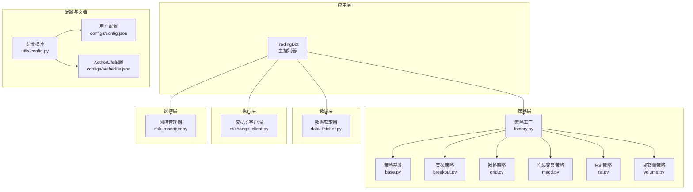
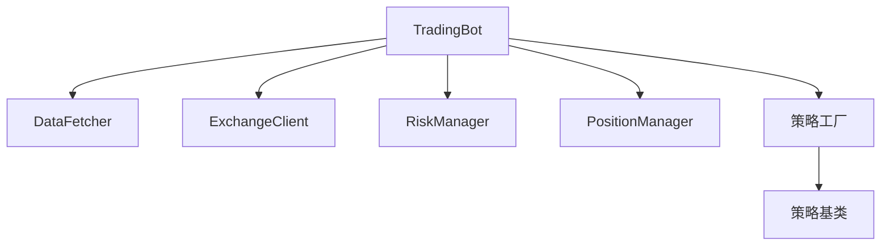
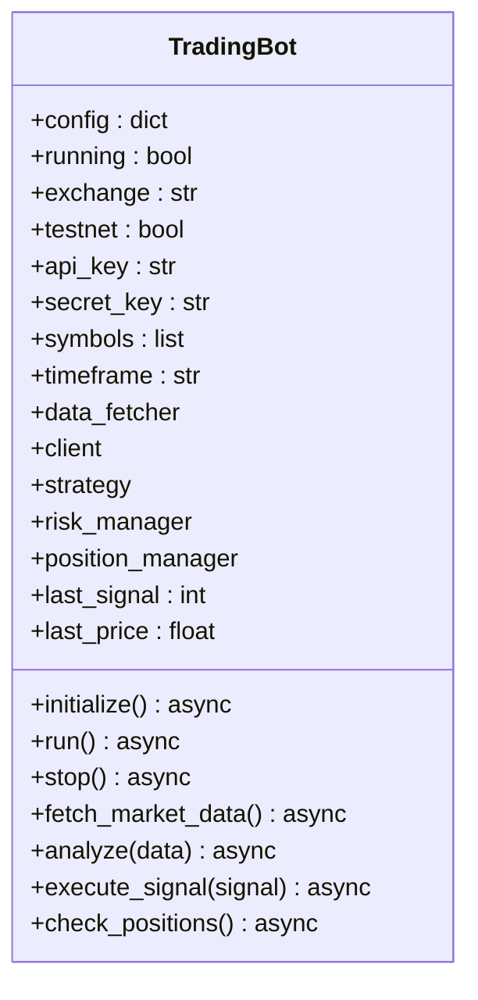
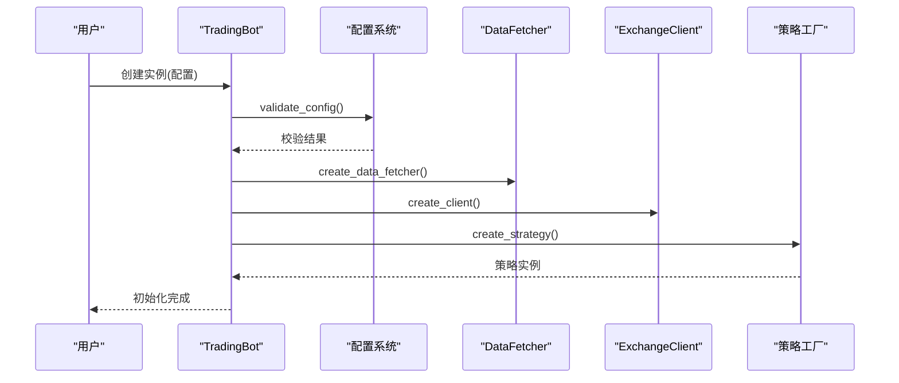
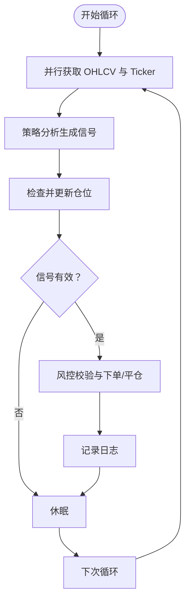
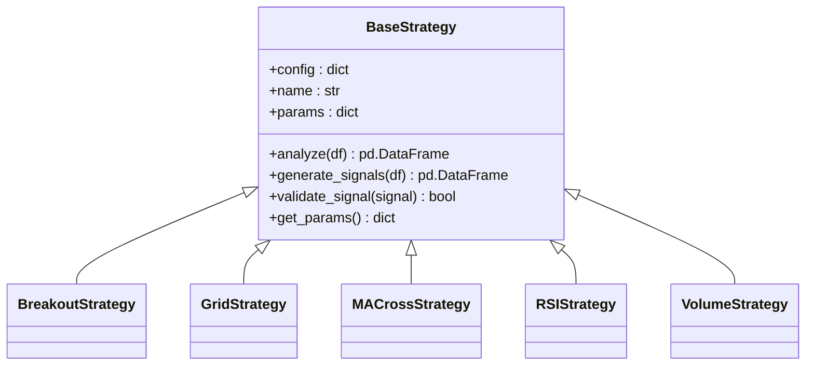
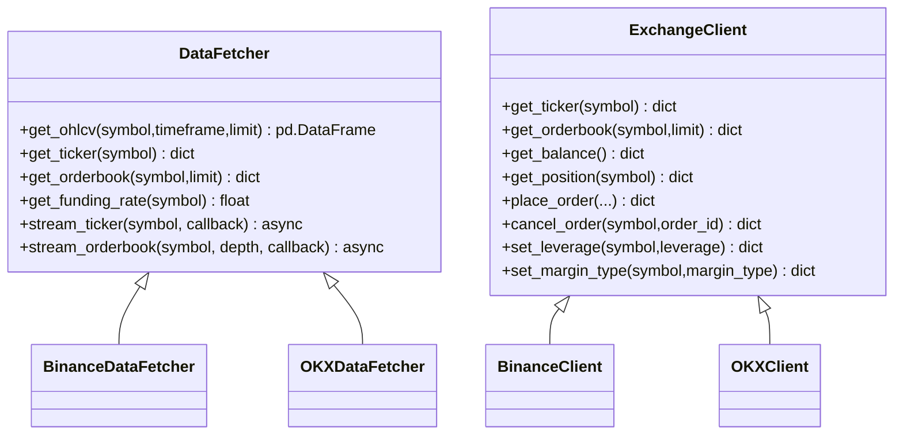
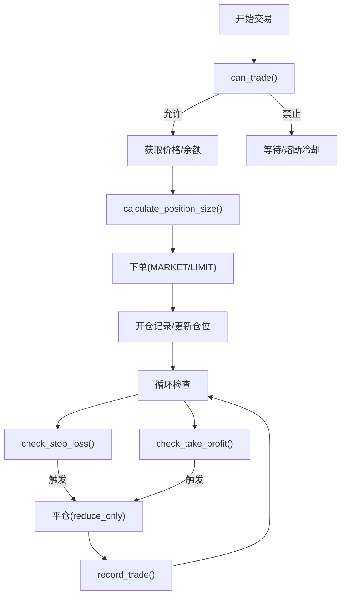
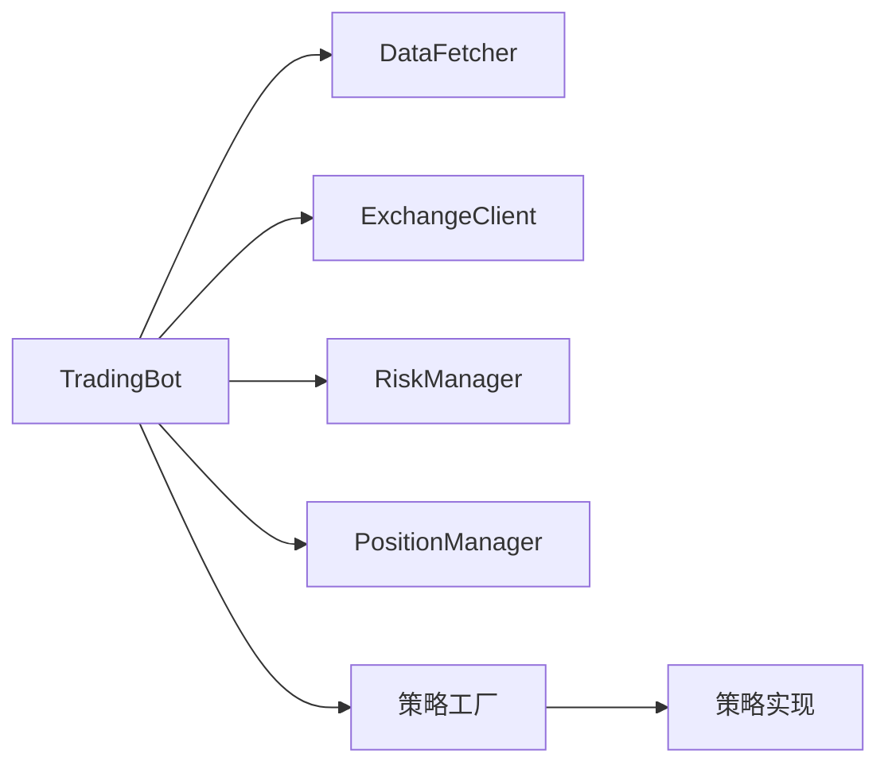

# 交易机器人系统

<cite>
**本文引用的文件**
- [src/trading_bot.py](file://src/trading_bot.py)
- [src/utils/config.py](file://src/utils/config.py)
- [configs/config.json](file://configs/config.json)
- [configs/aetherlife.json](file://configs/aetherlife.json)
- [src/data/data_fetcher.py](file://src/data/data_fetcher.py)
- [src/execution/exchange_client.py](file://src/execution/exchange_client.py)
- [src/utils/risk_manager.py](file://src/utils/risk_manager.py)
- [src/strategies/base.py](file://src/strategies/base.py)
- [src/strategies/breakout.py](file://src/strategies/breakout.py)
- [src/strategies/factory.py](file://src/strategies/factory.py)
- [src/strategies/grid.py](file://src/strategies/grid.py)
- [src/strategies/macd.py](file://src/strategies/macd.py)
- [src/strategies/rsi.py](file://src/strategies/rsi.py)
- [src/strategies/volume.py](file://src/strategies/volume.py)
</cite>

## 目录
1. [简介](#简介)
2. [项目结构](#项目结构)
3. [核心组件](#核心组件)
4. [架构总览](#架构总览)
5. [详细组件分析](#详细组件分析)
6. [依赖关系分析](#依赖关系分析)
7. [性能考量](#性能考量)
8. [故障排查指南](#故障排查指南)
9. [结论](#结论)
10. [附录](#附录)

## 简介
本文件为交易机器人系统的详细技术文档，聚焦于 TradingBot 类的设计与实现，覆盖初始化、配置校验、模块依赖注入、生命周期管理、交易循环机制（数据获取、策略分析、信号执行、仓位检查）、异步编程模式（并行数据获取、事件驱动、错误处理）、配置示例与参数说明、公共接口方法使用与最佳实践，以及与各模块的集成关系与扩展指导。

## 项目结构
系统采用分层模块化组织，核心围绕 TradingBot 主控制器，向上连接策略层、数据层、执行层与风控层，向下对接交易所 API 与 WebSocket 实时流，配置由默认配置与用户配置文件合并而来。

图表来源
- [src/trading_bot.py](file://src/trading_bot.py#L27-L320)
- [src/data/data_fetcher.py](file://src/data/data_fetcher.py#L17-L408)
- [src/execution/exchange_client.py](file://src/execution/exchange_client.py#L20-L411)
- [src/utils/risk_manager.py](file://src/utils/risk_manager.py#L12-L242)
- [src/strategies/factory.py](file://src/strategies/factory.py#L10-L36)
- [src/strategies/base.py](file://src/strategies/base.py#L6-L31)
- [src/utils/config.py](file://src/utils/config.py#L15-L49)
- [configs/config.json](file://configs/config.json#L1-L28)
- [configs/aetherlife.json](file://configs/aetherlife.json#L1-L17)

章节来源
- [src/trading_bot.py](file://src/trading_bot.py#L1-L346)
- [src/data/data_fetcher.py](file://src/data/data_fetcher.py#L1-L434)
- [src/execution/exchange_client.py](file://src/execution/exchange_client.py#L1-L432)
- [src/utils/risk_manager.py](file://src/utils/risk_manager.py#L1-L388)
- [src/strategies/factory.py](file://src/strategies/factory.py#L1-L36)
- [src/strategies/base.py](file://src/strategies/base.py#L1-L31)
- [src/utils/config.py](file://src/utils/config.py#L1-L49)
- [configs/config.json](file://configs/config.json#L1-L28)
- [configs/aetherlife.json](file://configs/aetherlife.json#L1-L17)

## 核心组件
- TradingBot：主控制器，负责初始化、配置校验、模块注入、交易循环、信号执行与仓位检查。
- DataFetcher：抽象数据获取器，提供 OHLCV、Ticker、Orderbook、资金费率等接口；BinanceDataFetcher/OKXDataFetcher 提供具体实现。
- ExchangeClient：抽象执行客户端，提供账户、下单、撤单、杠杆设置等接口；BinanceClient/OKXClient 提供具体实现。
- RiskManager/PositionManager：风控与仓位管理，包含止损止盈、熔断、日限、连败限制与统计。
- 策略体系：BaseStrategy 抽象基类，多种具体策略（突破、网格、MACD、RSI、成交量），策略工厂统一创建。
- 配置系统：默认配置与用户配置合并，配置校验确保参数有效性。

章节来源
- [src/trading_bot.py](file://src/trading_bot.py#L27-L320)
- [src/data/data_fetcher.py](file://src/data/data_fetcher.py#L17-L408)
- [src/execution/exchange_client.py](file://src/execution/exchange_client.py#L20-L411)
- [src/utils/risk_manager.py](file://src/utils/risk_manager.py#L12-L242)
- [src/strategies/base.py](file://src/strategies/base.py#L6-L31)
- [src/strategies/factory.py](file://src/strategies/factory.py#L10-L36)
- [src/utils/config.py](file://src/utils/config.py#L15-L49)

## 架构总览
下图展示 TradingBot 的运行时交互与模块耦合关系。

图表来源
- [src/trading_bot.py](file://src/trading_bot.py#L27-L320)
- [src/data/data_fetcher.py](file://src/data/data_fetcher.py#L17-L408)
- [src/execution/exchange_client.py](file://src/execution/exchange_client.py#L20-L411)
- [src/utils/risk_manager.py](file://src/utils/risk_manager.py#L12-L242)
- [src/strategies/factory.py](file://src/strategies/factory.py#L10-L36)
- [src/strategies/base.py](file://src/strategies/base.py#L6-L31)

## 详细组件分析

### TradingBot 设计与实现
- 初始化与依赖注入
  - 读取配置并深拷贝，设置运行状态、交易所、测试网、API 凭据、交易对、时间周期等。
  - 通过工厂创建 DataFetcher、ExchangeClient、策略实例，并初始化风控与仓位管理器。
- 生命周期管理
  - 提供 initialize()/run()/stop() 方法，run() 中维护主循环，支持优雅停止与资源关闭。
- 异步与并行
  - fetch_market_data() 使用 asyncio.gather 并行获取 OHLCV 与 Ticker。
  - 执行下单与仓位检查均采用异步调用，保证主循环非阻塞。
- 交易循环机制
  - fetch_market_data → analyze → check_positions → execute_signal → 日志输出 → sleep。
  - analyze 对 DataFrame 应用策略生成信号，execute_signal 根据风控与仓位状态下单或平仓。
- 错误处理
  - 主循环捕获异常并等待一段时间再继续，避免崩溃中断。
  - 各模块内部对网络与API错误进行封装与抛出，便于上层感知。

图表来源
- [src/trading_bot.py](file://src/trading_bot.py#L27-L320)

章节来源
- [src/trading_bot.py](file://src/trading_bot.py#L27-L320)

### 初始化流程与配置校验
- 配置来源与合并
  - 默认配置来自 DEFAULT_CONFIG，随后与用户配置文件（config.json）进行深合并。
  - 用户配置文件路径优先级：当前目录与上级目录的 config.json。
- 配置校验
  - validate_config() 校验交易所、交易对、策略、风控参数范围等，返回错误列表。
- 模块注入
  - create_data_fetcher()/create_client() 工厂方法按配置选择具体实现。
  - create_strategy() 根据策略名称创建策略实例，支持多策略组合。

图表来源
- [src/trading_bot.py](file://src/trading_bot.py#L63-L91)
- [src/utils/config.py](file://src/utils/config.py#L15-L49)
- [src/data/data_fetcher.py](file://src/data/data_fetcher.py#L400-L408)
- [src/execution/exchange_client.py](file://src/execution/exchange_client.py#L403-L411)
- [src/strategies/factory.py](file://src/strategies/factory.py#L10-L36)

章节来源
- [src/trading_bot.py](file://src/trading_bot.py#L63-L91)
- [src/utils/config.py](file://src/utils/config.py#L15-L49)
- [configs/config.json](file://configs/config.json#L1-L28)

### 交易循环机制
- 数据获取：并行获取 OHLCV 与 Ticker，减少等待时间。
- 策略分析：将 DataFrame 传入策略生成信号列，取最新信号。
- 仓位检查：若存在仓位，根据风控检查止损/止盈，必要时平仓。
- 信号执行：依据风控与仓位状态决定开多/开空/平仓，下单并更新仓位与风控统计。
- 日志与休眠：输出当前价格、信号与涨跌幅，按 loop_interval 休眠。

图表来源
- [src/trading_bot.py](file://src/trading_bot.py#L92-L282)

章节来源
- [src/trading_bot.py](file://src/trading_bot.py#L92-L282)

### 异步编程模式
- 并行数据获取：使用 asyncio.gather 并发请求 OHLCV 与 Ticker。
- 事件驱动：数据层提供 WebSocket 订阅接口（如 stream_ticker/stream_orderbook），可用于实时行情驱动。
- 错误处理：各模块对 aiohttp 客户端错误进行捕获与转换，TradingBot 主循环捕获未处理异常并延时重试。

章节来源
- [src/trading_bot.py](file://src/trading_bot.py#L95-L98)
- [src/data/data_fetcher.py](file://src/data/data_fetcher.py#L188-L234)
- [src/execution/exchange_client.py](file://src/execution/exchange_client.py#L136-L171)

### 公共接口方法与最佳实践
- initialize()
  - 必须在 run() 前调用，完成配置校验与模块注入。
  - 建议在外部捕获 ValueError 并进行降级处理。
- run()
  - 启动主循环，建议在异常处理中调用 stop()。
  - loop_interval 建议不低于交易所 K 线周期，避免过度请求。
- stop()
  - 关闭数据与执行会话，打印交易统计，确保资源释放。
- execute_signal()
  - 仅在 can_trade() 通过且无重复信号时调用，避免频繁下单。
  - 注意交易所最小下单量精度与步进，系统已做四舍五入与对齐，但应结合 exchange_info 控制输入。

章节来源
- [src/trading_bot.py](file://src/trading_bot.py#L63-L91)
- [src/trading_bot.py](file://src/trading_bot.py#L256-L297)

### 策略体系与工厂
- BaseStrategy：定义 analyze/generate_signals 接口，提供参数与验证钩子。
- 具体策略：突破、网格、MACD、RSI、成交量策略均基于基类实现。
- 策略工厂：根据策略类型创建实例，支持多策略组合（MultiStrategy）。

图表来源
- [src/strategies/base.py](file://src/strategies/base.py#L6-L31)
- [src/strategies/breakout.py](file://src/strategies/breakout.py#L6-L79)
- [src/strategies/grid.py](file://src/strategies/grid.py#L5-L63)
- [src/strategies/macd.py](file://src/strategies/macd.py#L5-L40)
- [src/strategies/rsi.py](file://src/strategies/rsi.py#L6-L42)
- [src/strategies/volume.py](file://src/strategies/volume.py#L6-L44)

章节来源
- [src/strategies/base.py](file://src/strategies/base.py#L6-L31)
- [src/strategies/breakout.py](file://src/strategies/breakout.py#L6-L79)
- [src/strategies/grid.py](file://src/strategies/grid.py#L5-L63)
- [src/strategies/macd.py](file://src/strategies/macd.py#L5-L40)
- [src/strategies/rsi.py](file://src/strategies/rsi.py#L6-L42)
- [src/strategies/volume.py](file://src/strategies/volume.py#L6-L44)
- [src/strategies/factory.py](file://src/strategies/factory.py#L10-L36)

### 数据层与执行层
- DataFetcher
  - 提供 get_ohlcv/get_ticker/get_orderbook/get_funding_rate 等接口。
  - BinanceDataFetcher/OKXDataFetcher 分别实现对应交易所接口与 WebSocket 订阅。
- ExchangeClient
  - 提供 get_ticker/get_orderbook/get_balance/get_position/place_order/cancel_order/set_leverage/set_margin_type 等接口。
  - BinanceClient/OKXClient 实现签名、请求与错误处理，支持测试网与正式网切换。

图表来源
- [src/data/data_fetcher.py](file://src/data/data_fetcher.py#L17-L408)
- [src/execution/exchange_client.py](file://src/execution/exchange_client.py#L20-L411)

章节来源
- [src/data/data_fetcher.py](file://src/data/data_fetcher.py#L17-L408)
- [src/execution/exchange_client.py](file://src/execution/exchange_client.py#L20-L411)

### 风控与仓位管理
- RiskManager
  - 仓位比例、止损止盈、追踪止损、单日限额、连败限制、熔断冷却与暂停机制。
  - calculate_position_size() 基于信号强度与账户余额动态计算下单数量。
  - check_stop_loss/check_take_profit/check_trailing_stop/check_circuit_breaker/check_daily_limits 组成风控决策链。
- PositionManager
  - 开仓/平仓/更新仓位、计算浮动盈亏、查询与判断是否存在仓位。

图表来源
- [src/utils/risk_manager.py](file://src/utils/risk_manager.py#L62-L242)
- [src/trading_bot.py](file://src/trading_bot.py#L115-L255)

章节来源
- [src/utils/risk_manager.py](file://src/utils/risk_manager.py#L12-L242)
- [src/trading_bot.py](file://src/trading_bot.py#L115-L255)

## 依赖关系分析
- 松耦合：TradingBot 通过工厂与抽象接口与数据、执行、策略解耦。
- 可替换性：更换交易所或策略只需调整配置与工厂映射。
- 循环依赖：未发现直接循环导入；模块间通过接口与工厂间接协作。

图表来源
- [src/trading_bot.py](file://src/trading_bot.py#L27-L320)
- [src/strategies/factory.py](file://src/strategies/factory.py#L10-L36)

章节来源
- [src/trading_bot.py](file://src/trading_bot.py#L27-L320)
- [src/strategies/factory.py](file://src/strategies/factory.py#L10-L36)

## 性能考量
- 并行 I/O：使用 asyncio.gather 并行获取 OHLCV 与 Ticker，降低主循环等待时间。
- 会话复用：数据与执行客户端均维护 aiohttp 会话，减少连接开销。
- 精度控制：下单前对数量进行步进对齐与精度处理，避免因精度导致的失败。
- 日限与熔断：风控层限制单日交易次数与连败次数，防止连续亏损扩大。

## 故障排查指南
- 配置错误
  - validate_config() 返回错误列表，检查交易所、交易对、策略与风控参数范围。
- API 错误
  - ExchangeClient/DataFetcher 对底层错误进行封装，查看日志中的错误码与消息。
- 仓位异常
  - 若出现无法下单或下单无效，检查 exchange_info 中的最小下单量与步进，确认已按要求对齐。
- 熔断与暂停
  - 若 can_trade() 返回 should_stop，检查风控统计与熔断冷却时间。

章节来源
- [src/utils/config.py](file://src/utils/config.py#L15-L37)
- [src/execution/exchange_client.py](file://src/execution/exchange_client.py#L136-L171)
- [src/utils/risk_manager.py](file://src/utils/risk_manager.py#L175-L194)

## 结论
TradingBot 以清晰的分层与工厂模式实现了模块解耦，配合异步并行与完善的风控体系，提供了稳定可扩展的交易机器人框架。通过合理配置与参数调优，可在不同市场环境下实现稳健的自动化交易。

## 附录

### 配置示例与参数说明
- 默认配置（DEFAULT_CONFIG）
  - exchange/testnet：交易所与测试网开关
  - strategy/symbols/timeframe：策略、交易对、K线周期
  - leverage/loop_interval：杠杆与主循环间隔
  - risk：风控参数（最大仓位占比、止损/止盈、单日限额、连败限制、熔断阈值）
  - strategy_config：策略参数（如突破策略的 lookback_period/threshold/atr_multiplier）
- 用户配置（config.json）
  - 可覆盖默认配置，建议保留必需字段（exchange、symbols、strategy、risk 等）。
- AetherLife 配置（aetherlife.json）
  - 与本系统核心逻辑解耦，用于认知与进化模块（不影响 TradingBot）。

章节来源
- [src/trading_bot.py](file://src/trading_bot.py#L300-L320)
- [configs/config.json](file://configs/config.json#L1-L28)
- [configs/aetherlife.json](file://configs/aetherlife.json#L1-L17)