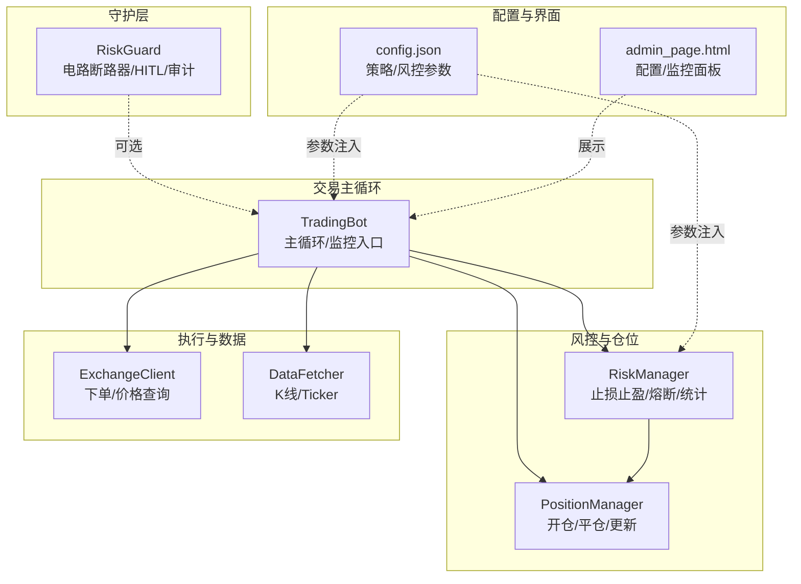
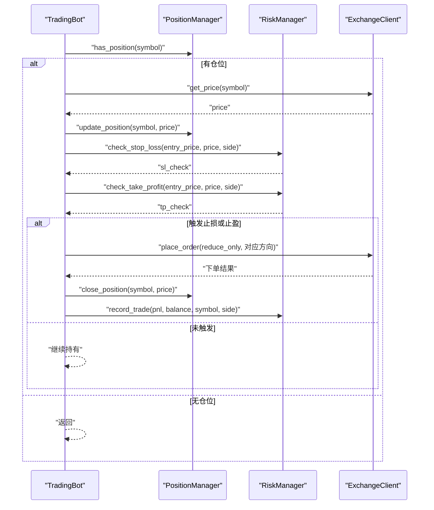
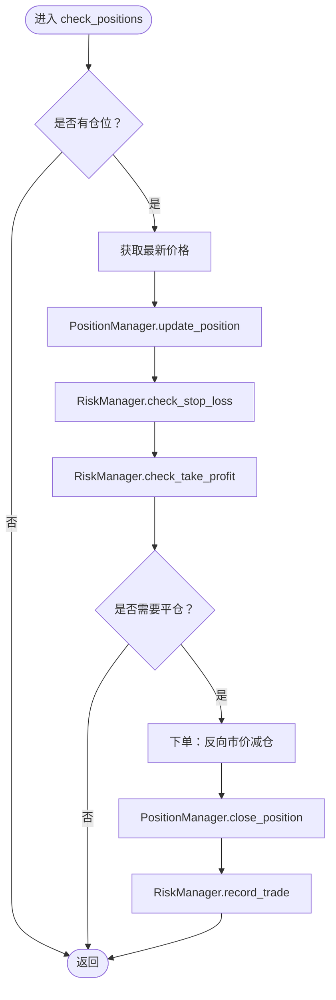
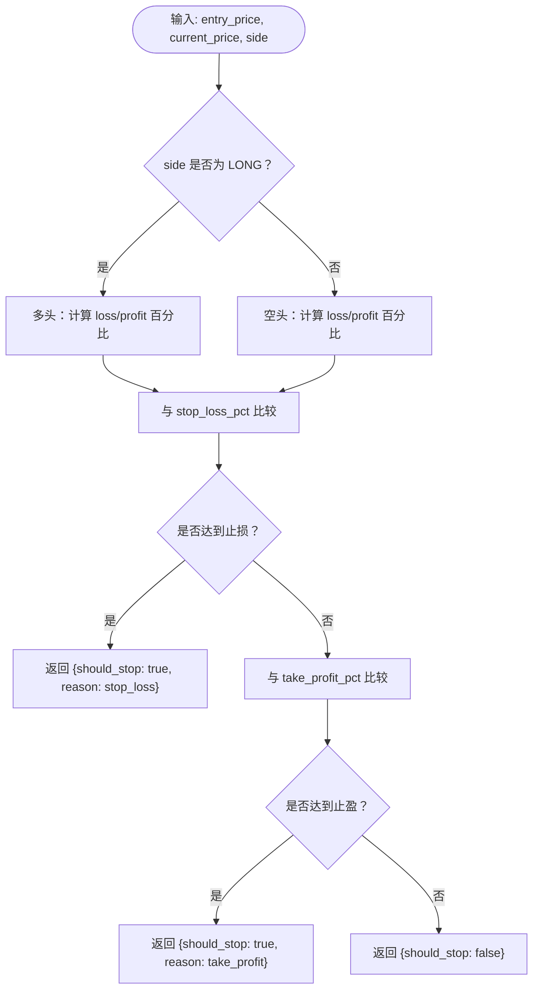
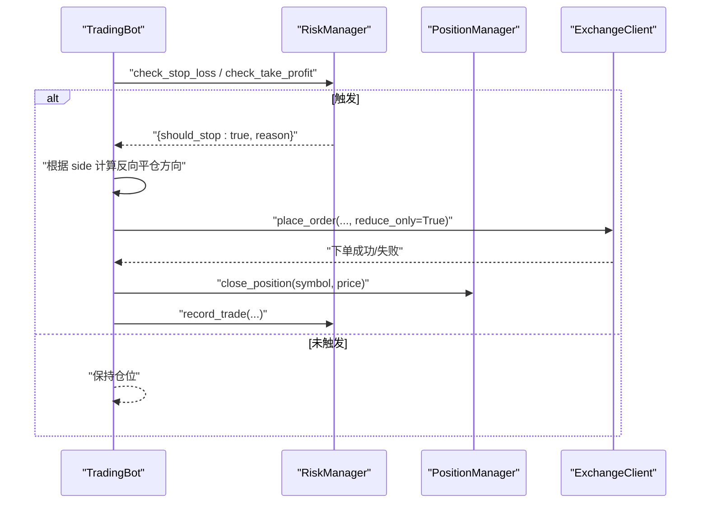
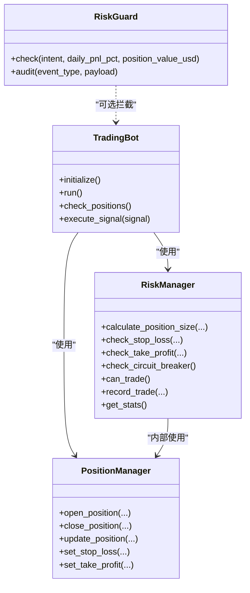

# 仓位监控

<cite>
**本文引用的文件**
- [src/trading_bot.py](file://src/trading_bot.py)
- [src/utils/risk_manager.py](file://src/utils/risk_manager.py)
- [src/aetherlife/guard/risk_guard.py](file://src/aetherlife/guard/risk_guard.py)
- [configs/config.json](file://configs/config.json)
- [src/ui/admin_page.html](file://src/ui/admin_page.html)
- [src/utils/logger.py](file://src/utils/logger.py)
</cite>

## 目录
1. [简介](#简介)
2. [项目结构](#项目结构)
3. [核心组件](#核心组件)
4. [架构总览](#架构总览)
5. [详细组件分析](#详细组件分析)
6. [依赖关系分析](#依赖关系分析)
7. [性能考量](#性能考量)
8. [故障排查指南](#故障排查指南)
9. [结论](#结论)
10. [附录](#附录)

## 简介
本技术文档聚焦“仓位监控”模块，围绕 TradingBot 的 check_positions() 方法进行深入解析，涵盖以下关键内容：
- 仓位状态检查流程与价格更新机制
- 止损止盈检查逻辑，包括 stop_loss_pct 与 take_profit_pct 参数的计算与判定
- 强制平仓、止损平仓、止盈平仓的触发条件与执行路径
- 具体监控示例：多空仓位监控、动态止损设置、熔断机制联动
- 性能优化、异常处理与状态同步策略
- 监控频率设置、价格获取优化与批量处理思路

## 项目结构
与仓位监控直接相关的代码分布在以下模块：
- 交易主循环与监控入口：TradingBot
- 风控与仓位管理：RiskManager、PositionManager
- 守护层（电路断路器等）：RiskGuard
- 配置与前端展示：config.json、admin_page.html
- 日志工具：logger

图表来源
- [src/trading_bot.py](file://src/trading_bot.py#L256-L283)
- [src/utils/risk_manager.py](file://src/utils/risk_manager.py#L12-L387)
- [src/aetherlife/guard/risk_guard.py](file://src/aetherlife/guard/risk_guard.py#L23-L68)
- [configs/config.json](file://configs/config.json#L1-L28)
- [src/ui/admin_page.html](file://src/ui/admin_page.html#L432-L453)

章节来源
- [src/trading_bot.py](file://src/trading_bot.py#L256-L283)
- [src/utils/risk_manager.py](file://src/utils/risk_manager.py#L12-L387)
- [src/aetherlife/guard/risk_guard.py](file://src/aetherlife/guard/risk_guard.py#L23-L68)
- [configs/config.json](file://configs/config.json#L1-L28)
- [src/ui/admin_page.html](file://src/ui/admin_page.html#L432-L453)

## 核心组件
- TradingBot：负责主循环、信号执行与仓位监控。其中 check_positions() 是监控入口，负责拉取最新价格、更新浮动盈亏，并触发止损/止盈平仓。
- RiskManager：提供仓位大小计算、止损止盈检查、熔断检查、日统计与暂停/恢复等风控能力。
- PositionManager：维护活跃仓位字典，提供开仓、平仓、更新浮动盈亏、设置止损止盈等操作。
- RiskGuard：提供电路断路器、单日最大亏损限制、大额人工确认（HITL）与审计能力，可在更高层拦截交易意图。
- 配置与前端：config.json 提供 stop_loss_pct、take_profit_pct、max_daily_loss 等风控参数；admin_page.html 提供配置加载/保存与实时刷新。

章节来源
- [src/trading_bot.py](file://src/trading_bot.py#L206-L255)
- [src/utils/risk_manager.py](file://src/utils/risk_manager.py#L12-L387)
- [src/aetherlife/guard/risk_guard.py](file://src/aetherlife/guard/risk_guard.py#L23-L68)
- [configs/config.json](file://configs/config.json#L15-L20)
- [src/ui/admin_page.html](file://src/ui/admin_page.html#L438-L442)

## 架构总览
下图展示了 check_positions() 的调用链与数据流：

图表来源
- [src/trading_bot.py](file://src/trading_bot.py#L206-L255)
- [src/utils/risk_manager.py](file://src/utils/risk_manager.py#L73-L105)
- [src/utils/risk_manager.py](file://src/utils/risk_manager.py#L268-L299)

章节来源
- [src/trading_bot.py](file://src/trading_bot.py#L206-L255)
- [src/utils/risk_manager.py](file://src/utils/risk_manager.py#L73-L105)
- [src/utils/risk_manager.py](file://src/utils/risk_manager.py#L268-L299)

## 详细组件分析

### check_positions() 方法实现逻辑
- 输入：当前交易对 symbol（由 TradingBot 维护）
- 主要步骤：
  1) 若无该 symbol 的活跃仓位则直接返回
  2) 从交易所客户端获取最新价格
  3) 调用 PositionManager.update_position 更新浮动盈亏
  4) 调用 RiskManager.check_stop_loss 与 check_take_profit 判断是否需要平仓
  5) 若任一条件满足，按多/空方向计算反向平仓方向，发起市价减仓单
  6) 调用 PositionManager.close_position 清理仓位并记录最终盈亏
  7) 调用 RiskManager.record_trade 更新风控统计

图表来源
- [src/trading_bot.py](file://src/trading_bot.py#L206-L255)
- [src/utils/risk_manager.py](file://src/utils/risk_manager.py#L73-L105)
- [src/utils/risk_manager.py](file://src/utils/risk_manager.py#L268-L299)

章节来源
- [src/trading_bot.py](file://src/trading_bot.py#L206-L255)

### 止损止盈检查机制
- 参数来源与含义
  - stop_loss_pct：止损阈值（百分比），用于判断亏损达到该比例即触发止损
  - take_profit_pct：止盈阈值（百分比），用于判断盈利达到该比例即触发止盈
  - 以上参数来自配置文件与 RiskManager 初始化
- 计算与判定逻辑
  - 多头（LONG）：止损基于 entry_price 与 current_price 的差值占 entry_price 的比例；止盈同理
  - 空头（SHORT）：止损与止盈分别以 current_price 相对于 entry_price 的上涨/下跌比例衡量
  - 判定条件：任一达到阈值即返回 should_stop 为真，并标注 reason（"stop_loss"/"take_profit"）

图表来源
- [src/utils/risk_manager.py](file://src/utils/risk_manager.py#L73-L105)

章节来源
- [src/utils/risk_manager.py](file://src/utils/risk_manager.py#L21-L24)
- [src/utils/risk_manager.py](file://src/utils/risk_manager.py#L73-L105)
- [configs/config.json](file://configs/config.json#L17-L18)

### 仓位平仓触发与执行流程
- 触发条件
  - 止损触发：sl_check.should_stop 为真
  - 止盈触发：tp_check.should_stop 为真
- 执行流程
  - 方向确定：LONG 持仓触发时反向为 SELL，SHORT 持仓触发时反向为 BUY
  - 下单：使用市价单并设置 reduce_only，确保只减仓不增仓
  - 平仓：调用 PositionManager.close_position 清理内存中的仓位并计算最终盈亏
  - 统计：调用 RiskManager.record_trade 记录本次交易的盈亏与余额，纳入风控统计

图表来源
- [src/trading_bot.py](file://src/trading_bot.py#L206-L255)
- [src/utils/risk_manager.py](file://src/utils/risk_manager.py#L268-L299)

章节来源
- [src/trading_bot.py](file://src/trading_bot.py#L206-L255)
- [src/utils/risk_manager.py](file://src/utils/risk_manager.py#L268-L299)

### 监控示例与实践要点
- 多空仓位监控
  - 多头监控：当 current_price 下穿 entry_price 且回撤达到 stop_loss_pct 时触发止损；或当上涨达到 take_profit_pct 时触发止盈
  - 空头监控：当 current_price 上穿 entry_price 且涨幅达到 stop_loss_pct 时触发止损；或下跌达到 take_profit_pct 时触发止盈
- 动态止损设置
  - 当前实现采用固定阈值（stop_loss_pct）。若需动态止损，可在 PositionManager 中扩展字段（例如 peak_price）并在 RiskManager 的 check_trailing_stop 中使用
- 熔断机制应用
  - RiskManager 内置熔断检查（check_circuit_breaker），在日累计亏损超过阈值时暂停交易并进入冷却期；可与 TradingBot 的主循环配合，在暂停期间跳过下单与平仓
- 配置与前端联动
  - admin_page.html 提供加载/保存风控配置的接口，stop_loss_pct、take_profit_pct、max_daily_loss 等参数可通过前端界面调整并持久化至配置文件

章节来源
- [src/utils/risk_manager.py](file://src/utils/risk_manager.py#L129-L153)
- [src/utils/risk_manager.py](file://src/utils/risk_manager.py#L107-L127)
- [src/ui/admin_page.html](file://src/ui/admin_page.html#L438-L442)
- [configs/config.json](file://configs/config.json#L17-L19)

### 风控与守护层联动
- RiskGuard（守护层）可对交易意图进行前置拦截，包含：
  - 电路断路器：当日累计亏损达到阈值时禁止交易
  - 单日最大亏损：超过阈值时禁止交易
  - 大额 HITL：超过阈值时要求人工确认
- 与 TradingBot 的关系：守护层通常在更高层（如 AetherLife）使用；在当前 TradingBot 中，主要通过 RiskManager 的 can_trade 与熔断检查实现风控约束

章节来源
- [src/aetherlife/guard/risk_guard.py](file://src/aetherlife/guard/risk_guard.py#L23-L68)
- [src/utils/risk_manager.py](file://src/utils/risk_manager.py#L175-L194)

## 依赖关系分析
- TradingBot 依赖 RiskManager 与 PositionManager 进行风控与仓位管理；同时依赖 ExchangeClient 获取价格与执行下单
- RiskManager 内部聚合 PositionManager 以复用仓位状态；对外提供风控检查与统计
- RiskGuard 作为独立模块，提供更严格的前置拦截，可与上层系统集成

图表来源
- [src/trading_bot.py](file://src/trading_bot.py#L27-L91)
- [src/utils/risk_manager.py](file://src/utils/risk_manager.py#L12-L387)
- [src/aetherlife/guard/risk_guard.py](file://src/aetherlife/guard/risk_guard.py#L23-L68)

章节来源
- [src/trading_bot.py](file://src/trading_bot.py#L27-L91)
- [src/utils/risk_manager.py](file://src/utils/risk_manager.py#L12-L387)
- [src/aetherlife/guard/risk_guard.py](file://src/aetherlife/guard/risk_guard.py#L23-L68)

## 性能考量
- 监控频率设置
  - TradingBot.run 中通过 loop_interval 控制主循环间隔，默认 5 秒；可根据市场波动与成本平衡调整
- 价格获取优化
  - fetch_market_data 已采用并行获取 K 线与 ticker，建议在 check_positions 中复用已有 ticker 缓存，避免重复网络请求
- 批量处理机制
  - 当前对单一 symbol 进行监控；若扩展到多币种，可在 TradingBot 中引入并发调度（如 asyncio.gather）并串行化风控检查，避免竞争与抖动
- 异常处理与状态同步
  - check_positions 对下单异常进行捕获并记录日志，避免中断主循环；建议在下单前后增加幂等检查（如查询订单状态）以保证状态一致性
- 日志与可观测性
  - 使用统一 logger 输出关键事件（开仓、平仓、触发风控等），便于后续接入监控系统

章节来源
- [src/trading_bot.py](file://src/trading_bot.py#L256-L283)
- [src/trading_bot.py](file://src/trading_bot.py#L206-L255)
- [src/utils/logger.py](file://src/utils/logger.py#L12-L28)

## 故障排查指南
- 常见问题定位
  - 未触发止损/止盈：检查 stop_loss_pct/take_profit_pct 配置是否合理；确认 PositionManager.update_position 是否被调用
  - 平仓失败：查看下单异常日志；确认 reduce_only 参数与方向是否正确
  - 熔断导致无法交易：检查 RiskManager.check_circuit_breaker 的冷却时间与日累计亏损
- 排障步骤
  - 在 admin_page.html 中加载/保存配置，确认 stop_loss_pct、take_profit_pct、max_daily_loss 生效
  - 查看日志输出，定位异常发生的具体环节（价格获取、下单、平仓、统计）
  - 如需人工确认，RiskGuard 的 HITL 会要求更高层介入

章节来源
- [src/ui/admin_page.html](file://src/ui/admin_page.html#L438-L442)
- [src/utils/risk_manager.py](file://src/utils/risk_manager.py#L129-L153)
- [src/aetherlife/guard/risk_guard.py](file://src/aetherlife/guard/risk_guard.py#L64-L67)
- [src/utils/logger.py](file://src/utils/logger.py#L31-L34)

## 结论
- check_positions() 将价格更新、风控检查与自动平仓串联为闭环，保障多空仓位在预设阈值下的安全退出
- 固定阈值的止损止盈策略简单可靠，结合熔断与日统计可有效控制回撤
- 建议在保持现有逻辑的基础上，引入动态止损、熔断冷却与多币种并发监控，进一步提升鲁棒性与效率

## 附录
- 配置项参考
  - stop_loss_pct：止损阈值（百分比）
  - take_profit_pct：止盈阈值（百分比）
  - max_daily_loss：单日最大亏损（百分比）
- 前端配置入口
  - admin_page.html 提供加载/保存配置与实时刷新功能，便于快速验证参数效果

章节来源
- [configs/config.json](file://configs/config.json#L17-L19)
- [src/ui/admin_page.html](file://src/ui/admin_page.html#L438-L442)