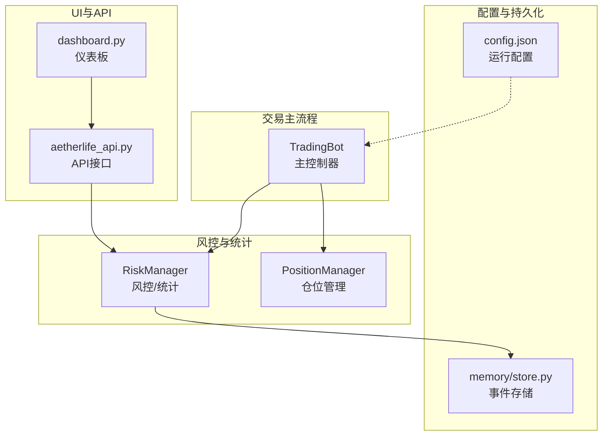
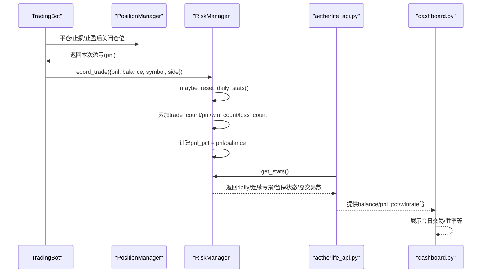
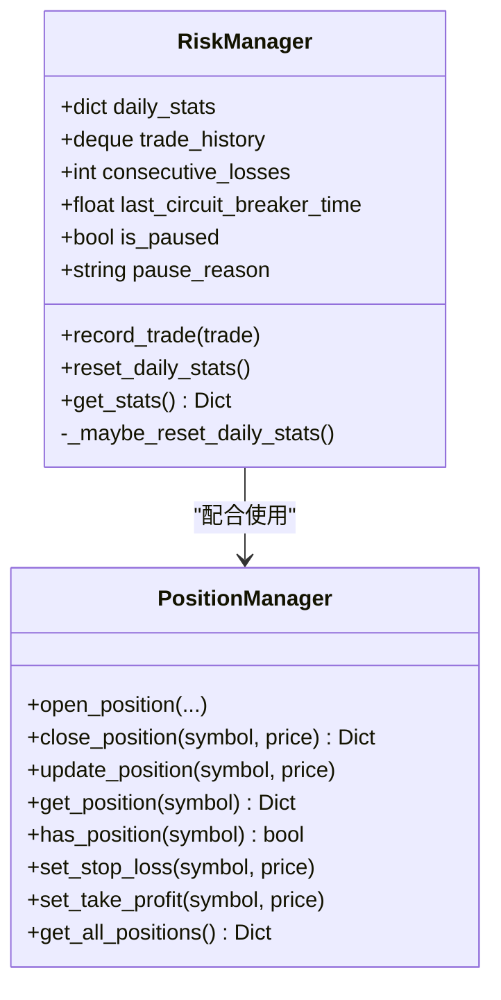
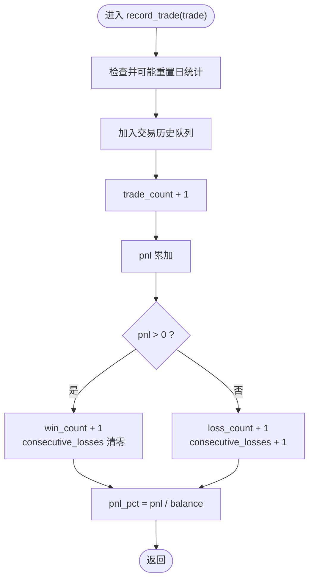
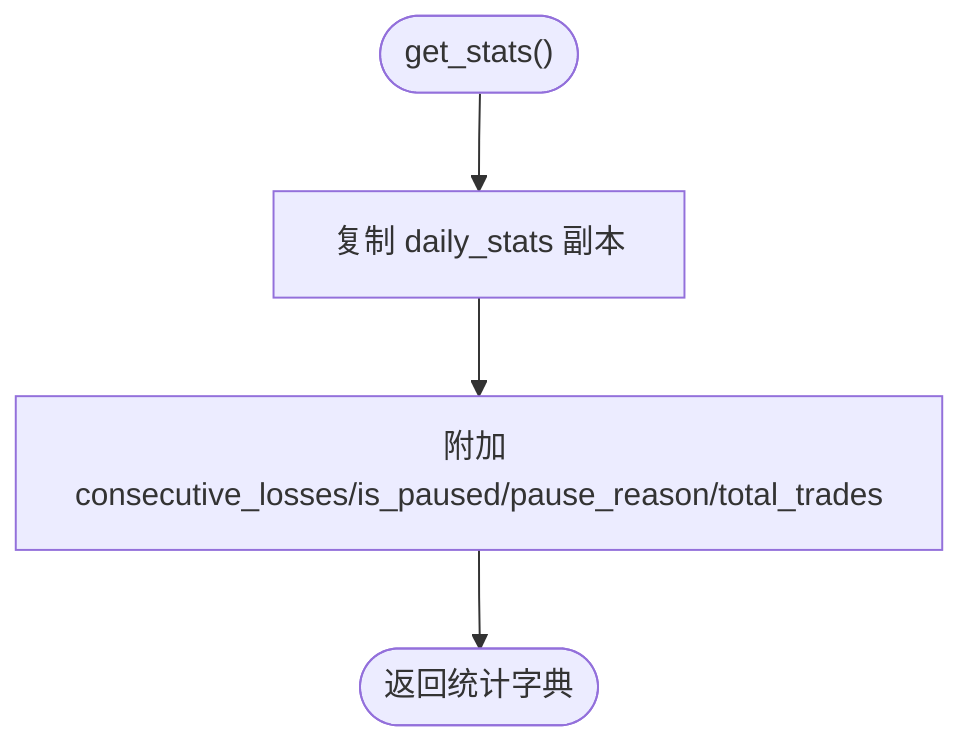
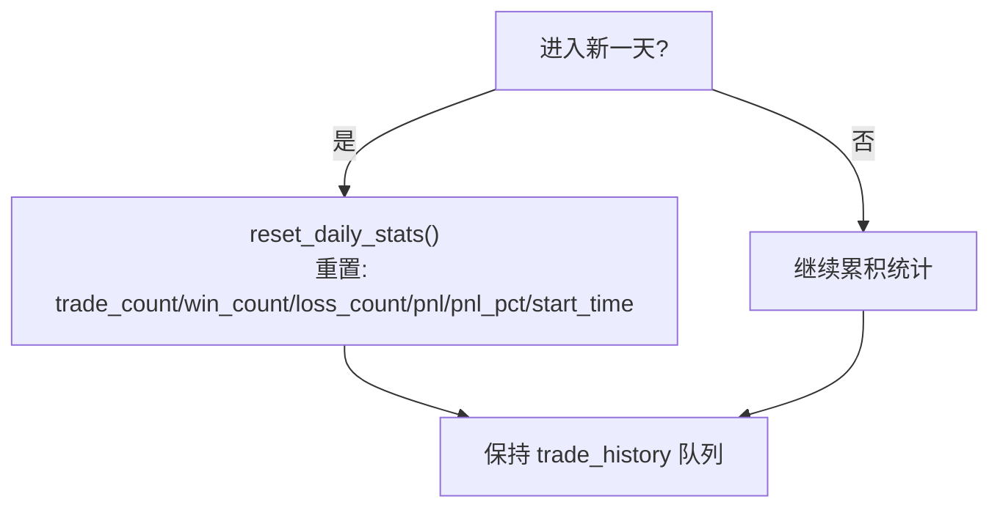
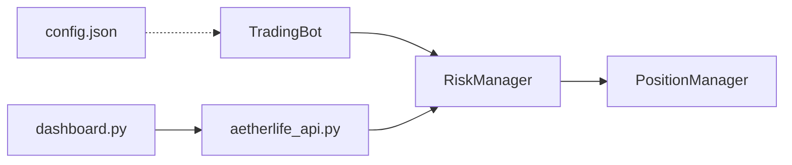

# 交易统计

<cite>
**本文引用的文件**
- [src/utils/risk_manager.py](file://src/utils/risk_manager.py)
- [src/trading_bot.py](file://src/trading_bot.py)
- [src/ui/dashboard.py](file://src/ui/dashboard.py)
- [src/ui/api/aetherlife_api.py](file://src/ui/api/aetherlife_api.py)
- [configs/config.json](file://configs/config.json)
- [src/aetherlife/memory/store.py](file://src/aetherlife/memory/store.py)
</cite>

## 目录
1. [简介](#简介)
2. [项目结构](#项目结构)
3. [核心组件](#核心组件)
4. [架构总览](#架构总览)
5. [详细组件分析](#详细组件分析)
6. [依赖关系分析](#依赖关系分析)
7. [性能考量](#性能考量)
8. [故障排查指南](#故障排查指南)
9. [结论](#结论)
10. [附录](#附录)

## 简介
本技术文档聚焦于交易统计模块，围绕风控模块中的统计能力展开，重点解释以下内容：
- record_trade() 方法的实现细节：pnl 盈亏累计、balance 余额记录、交易时间戳管理
- get_stats() 统计方法的功能：总交易次数、日交易统计、胜率计算、累计盈亏分析
- daily 统计数据结构：trade_count、win_count、loss_count、pnl 字段的含义与使用
- 具体统计分析示例：如何解读交易表现与风险指标
- 统计结果用途：策略效果评估、风险管理优化、绩效报告生成
- 统计数据的持久化机制与重置逻辑：每日统计自动清零与历史数据保存策略

## 项目结构
交易统计功能主要由风控模块提供，并在交易主流程中被调用；UI 层通过 API 获取统计并展示。

图表来源
- [src/trading_bot.py](file://src/trading_bot.py#L199-L204)
- [src/utils/risk_manager.py](file://src/utils/risk_manager.py#L196-L241)
- [src/ui/dashboard.py](file://src/ui/dashboard.py#L113-L133)
- [src/ui/api/aetherlife_api.py](file://src/ui/api/aetherlife_api.py#L43-L56)
- [configs/config.json](file://configs/config.json#L1-L28)
- [src/aetherlife/memory/store.py](file://src/aetherlife/memory/store.py#L46-L103)

章节来源
- [src/trading_bot.py](file://src/trading_bot.py#L199-L204)
- [src/utils/risk_manager.py](file://src/utils/risk_manager.py#L196-L241)
- [src/ui/dashboard.py](file://src/ui/dashboard.py#L113-L133)
- [src/ui/api/aetherlife_api.py](file://src/ui/api/aetherlife_api.py#L43-L56)
- [configs/config.json](file://configs/config.json#L1-L28)
- [src/aetherlife/memory/store.py](file://src/aetherlife/memory/store.py#L46-L103)

## 核心组件
- 风控管理器 RiskManager：负责每日统计的维护、交易记录、熔断与限额检查、胜率与累计盈亏计算
- 交易主流程 TradingBot：在每次平仓或止损止盈触发时，调用风控模块记录交易
- UI 仪表板与 API：对外提供统计概览与实时数据
- 配置文件：定义风控参数与运行参数
- 事件存储：可选地将交易事件持久化至 Redis

章节来源
- [src/utils/risk_manager.py](file://src/utils/risk_manager.py#L12-L241)
- [src/trading_bot.py](file://src/trading_bot.py#L199-L204)
- [src/ui/dashboard.py](file://src/ui/dashboard.py#L113-L133)
- [src/ui/api/aetherlife_api.py](file://src/ui/api/aetherlife_api.py#L43-L56)
- [configs/config.json](file://configs/config.json#L15-L20)
- [src/aetherlife/memory/store.py](file://src/aetherlife/memory/store.py#L46-L103)

## 架构总览
交易统计在系统中的关键流转如下：

图表来源
- [src/trading_bot.py](file://src/trading_bot.py#L199-L204)
- [src/utils/risk_manager.py](file://src/utils/risk_manager.py#L196-L241)
- [src/ui/api/aetherlife_api.py](file://src/ui/api/aetherlife_api.py#L43-L56)
- [src/ui/dashboard.py](file://src/ui/dashboard.py#L113-L133)

## 详细组件分析

### RiskManager 统计子系统
RiskManager 是交易统计的核心，包含以下关键职责：
- 维护每日统计 daily_stats：包含 pnl、pnl_pct、trade_count、win_count、loss_count、start_time
- 维护交易历史 trade_history（固定长度队列），用于统计与回溯
- 在每次交易后调用 record_trade() 更新统计
- 提供 get_stats() 返回当前统计快照
- 自动重置逻辑：_maybe_reset_daily_stats() 在进入新日期时重置 daily_stats

图表来源
- [src/utils/risk_manager.py](file://src/utils/risk_manager.py#L12-L241)

章节来源
- [src/utils/risk_manager.py](file://src/utils/risk_manager.py#L35-L60)
- [src/utils/risk_manager.py](file://src/utils/risk_manager.py#L196-L241)

#### record_trade() 方法实现要点
- 调用 _maybe_reset_daily_stats() 确保按日重置
- 将交易加入 trade_history（固定长度队列）
- 累加 trade_count 与 pnl
- 根据 pnl 正负分别累加 win_count 或 loss_count，并维护 consecutive_losses
- 基于 balance 计算 pnl_pct（pnl/balance）

图表来源
- [src/utils/risk_manager.py](file://src/utils/risk_manager.py#L196-L216)

章节来源
- [src/utils/risk_manager.py](file://src/utils/risk_manager.py#L196-L216)

#### get_stats() 统计方法
- 返回内容包含：
  - daily：当日统计副本（trade_count、win_count、loss_count、pnl、pnl_pct、start_time）
  - consecutive_losses：连续亏损次数
  - is_paused、pause_reason：暂停状态与原因
  - total_trades：交易历史总条目数

图表来源
- [src/utils/risk_manager.py](file://src/utils/risk_manager.py#L233-L241)

章节来源
- [src/utils/risk_manager.py](file://src/utils/risk_manager.py#L233-L241)

#### daily 统计数据结构与字段含义
- trade_count：当日交易总次数
- win_count：当日盈利交易次数
- loss_count：当日亏损交易次数
- pnl：当日累计盈亏（绝对值，单位通常为计价币）
- pnl_pct：当日累计盈亏占余额的比例（pnl/balance）
- start_time：当日统计起始时间（用于判断是否跨日重置）

章节来源
- [src/utils/risk_manager.py](file://src/utils/risk_manager.py#L35-L43)
- [src/utils/risk_manager.py](file://src/utils/risk_manager.py#L53-L60)

#### 胜率与累计盈亏分析
- 胜率：win_count / trade_count（仅基于当日统计）
- 累计盈亏：pnl 与 pnl_pct 反映当日表现
- 连续亏损：consecutive_losses 用于风控熔断与暂停判断

章节来源
- [src/utils/risk_manager.py](file://src/utils/risk_manager.py#L233-L241)
- [src/utils/risk_manager.py](file://src/utils/risk_manager.py#L141-L151)

#### 统计分析示例与指标解读
- 示例场景一：当日交易 20 次，其中 12 次盈利
  - trade_count = 20，win_count = 12，loss_count = 8
  - 胜率 ≈ 60%
  - 若 pnl = 1200，balance = 50000，则 pnl_pct = 1200/50000 = 2.4%
- 示例场景二：连续亏损达到阈值
  - consecutive_losses 达到最大连亏次数，风控可能触发暂停
- 示例场景三：熔断机制
  - 当日 pnl_pct 低于熔断阈值时，系统暂停交易并记录暂停原因

章节来源
- [src/utils/risk_manager.py](file://src/utils/risk_manager.py#L155-L173)
- [src/utils/risk_manager.py](file://src/utils/risk_manager.py#L129-L153)

#### 统计结果用途
- 策略效果评估：通过 win_rate、pnl、pnl_pct 评估策略稳定性与收益性
- 风险管理优化：利用熔断、限额与连亏控制降低极端损失
- 绩效报告生成：结合 UI 展示今日交易、胜率与余额变化趋势

章节来源
- [src/ui/dashboard.py](file://src/ui/dashboard.py#L113-L133)
- [src/ui/api/aetherlife_api.py](file://src/ui/api/aetherlife_api.py#L43-L56)

#### 统计数据的持久化与重置逻辑
- 每日重置：_maybe_reset_daily_stats() 在跨日时调用 reset_daily_stats() 重置统计
- 历史交易：trade_history 使用固定长度队列，超出容量自动丢弃旧记录
- 事件持久化：可选将交易事件写入 Redis（用于回放与报表），并在启动时加载

图表来源
- [src/utils/risk_manager.py](file://src/utils/risk_manager.py#L53-L60)
- [src/utils/risk_manager.py](file://src/utils/risk_manager.py#L217-L226)

章节来源
- [src/utils/risk_manager.py](file://src/utils/risk_manager.py#L53-L60)
- [src/utils/risk_manager.py](file://src/utils/risk_manager.py#L217-L226)
- [src/aetherlife/memory/store.py](file://src/aetherlife/memory/store.py#L46-L103)

### TradingBot 中的统计集成
- 平仓或止损止盈触发后，TradingBot 调用 RiskManager.record_trade()，传入本次交易的 pnl、balance、symbol、side 等
- 在停止时打印统计日志，包含总交易次数、当日交易次数、当日盈/亏次数、当日盈亏

章节来源
- [src/trading_bot.py](file://src/trading_bot.py#L199-L204)
- [src/trading_bot.py](file://src/trading_bot.py#L292-L296)

### UI 与 API 的统计展示
- dashboard.py 展示“今日交易”“胜率”等关键指标
- aetherlife_api.py 提供概览接口，返回 balance、pnl_pct、winrate 等

章节来源
- [src/ui/dashboard.py](file://src/ui/dashboard.py#L113-L133)
- [src/ui/api/aetherlife_api.py](file://src/ui/api/aetherlife_api.py#L43-L56)

## 依赖关系分析
- TradingBot 依赖 RiskManager 进行风控与统计
- RiskManager 依赖 PositionManager 获取平仓后的盈亏
- UI 通过 API 获取统计并展示
- 配置文件影响风控参数（如最大连亏次数、熔断阈值等）

图表来源
- [src/trading_bot.py](file://src/trading_bot.py#L50-L52)
- [src/utils/risk_manager.py](file://src/utils/risk_manager.py#L12-L241)
- [src/ui/api/aetherlife_api.py](file://src/ui/api/aetherlife_api.py#L43-L56)
- [src/ui/dashboard.py](file://src/ui/dashboard.py#L113-L133)
- [configs/config.json](file://configs/config.json#L15-L20)

章节来源
- [src/trading_bot.py](file://src/trading_bot.py#L50-L52)
- [src/utils/risk_manager.py](file://src/utils/risk_manager.py#L12-L241)
- [src/ui/api/aetherlife_api.py](file://src/ui/api/aetherlife_api.py#L43-L56)
- [src/ui/dashboard.py](file://src/ui/dashboard.py#L113-L133)
- [configs/config.json](file://configs/config.json#L15-L20)

## 性能考量
- 统计更新为常数时间操作，队列长度固定，不会随时间线性增长
- 每日重置仅在跨日发生，日常开销极低
- 建议在高频交易场景下，确保记录频率与 UI 刷新频率匹配，避免过度刷新造成前端压力

## 故障排查指南
- 统计不更新
  - 检查 TradingBot 是否在平仓或止损止盈后调用 record_trade()
  - 确认 balance 与 pnl 是否正确传入
- 胜率显示异常
  - 检查 trade_count 与 win_count 是否按预期递增
  - 确认是否触发了熔断或暂停导致统计被冻结
- 每日统计未清零
  - 检查系统时间是否跨日
  - 确认 _maybe_reset_daily_stats() 是否被调用
- 历史数据缺失
  - 检查 trade_history 队列长度是否过短
  - 如启用 Redis 持久化，确认持久化与加载流程正常

章节来源
- [src/trading_bot.py](file://src/trading_bot.py#L199-L204)
- [src/utils/risk_manager.py](file://src/utils/risk_manager.py#L53-L60)
- [src/aetherlife/memory/store.py](file://src/aetherlife/memory/store.py#L90-L127)

## 结论
交易统计模块通过 RiskManager 提供了简洁而高效的日级统计能力，覆盖盈亏累计、胜率计算与风控熔断等关键指标。TradingBot 在关键节点记录交易，UI 与 API 将统计结果可视化，形成闭环。建议在生产环境中结合 Redis 持久化与定期备份，确保历史数据可追溯，同时根据策略表现动态调整风控参数以优化风险收益比。

## 附录
- 配置项参考（节选）
  - 风控参数：max_daily_trades、max_consecutive_losses、circuit_breaker_loss_pct 等
  - 策略参数：strategy_config（如 lookback_period、threshold）

章节来源
- [configs/config.json](file://configs/config.json#L15-L20)
- [src/trading_bot.py](file://src/trading_bot.py#L300-L320)