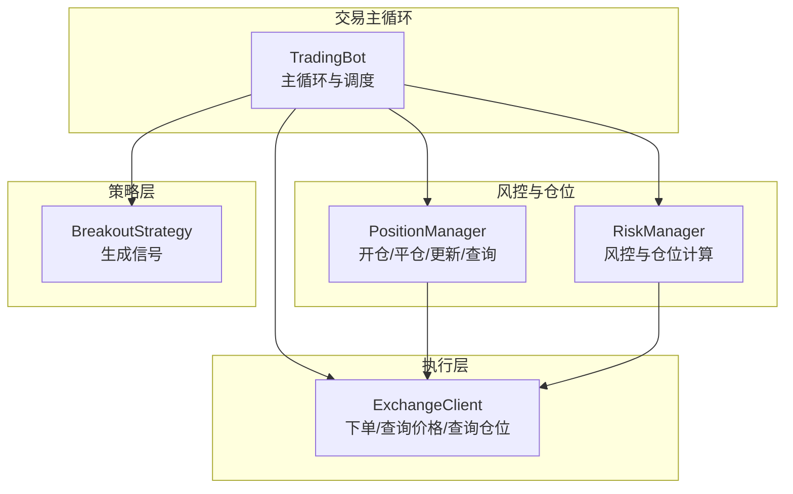
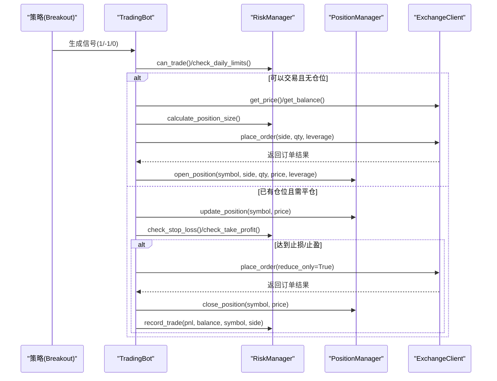
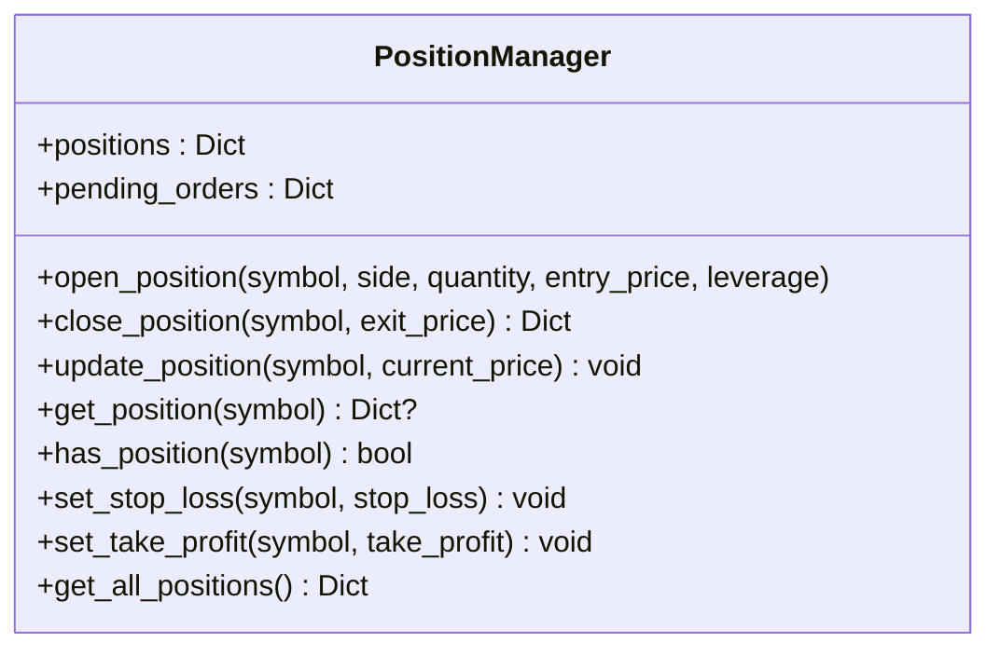
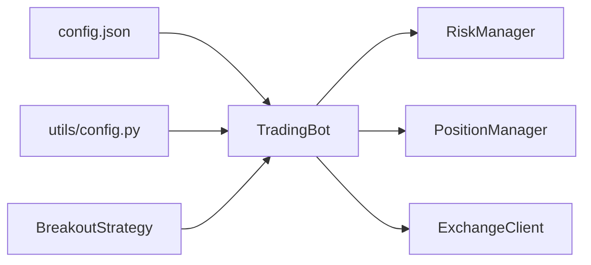
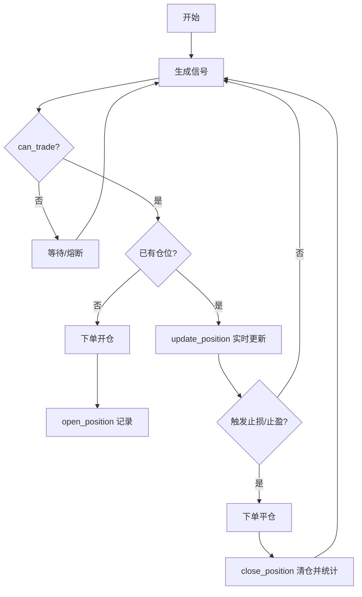

# 仓位管理

<cite>
**本文引用的文件**
- [src/utils/risk_manager.py](file://src/utils/risk_manager.py)
- [src/trading_bot.py](file://src/trading_bot.py)
- [src/execution/exchange_client.py](file://src/execution/exchange_client.py)
- [src/strategies/breakout.py](file://src/strategies/breakout.py)
- [configs/config.json](file://configs/config.json)
- [src/utils/config.py](file://src/utils/config.py)
</cite>

## 目录
1. [简介](#简介)
2. [项目结构](#项目结构)
3. [核心组件](#核心组件)
4. [架构总览](#架构总览)
5. [详细组件分析](#详细组件分析)
6. [依赖关系分析](#依赖关系分析)
7. [性能考量](#性能考量)
8. [故障排查指南](#故障排查指南)
9. [结论](#结论)
10. [附录](#附录)

## 简介
本文件围绕“仓位管理”模块展开，重点解析 PositionManager 类的实现与职责，涵盖开仓、平仓、实时更新、查询与状态监控，并结合 RiskManager 的风控能力，说明仓位计算公式、杠杆影响与保证金管理思路。同时阐述与策略、执行、风控模块的集成关系，给出从开仓到平仓的完整流程示例与最佳实践。

## 项目结构
与仓位管理直接相关的模块分布如下：
- 风控与仓位管理：src/utils/risk_manager.py（包含 PositionManager 与 RiskManager）
- 交易主循环：src/trading_bot.py（策略分析、下单、风控检查、仓位更新）
- 交易所客户端：src/execution/exchange_client.py（下单、查询价格、查询仓位）
- 示例策略：src/strategies/breakout.py（生成交易信号）
- 配置与校验：configs/config.json、src/utils/config.py

图表来源
- [src/trading_bot.py](file://src/trading_bot.py#L27-L205)
- [src/utils/risk_manager.py](file://src/utils/risk_manager.py#L244-L339)
- [src/execution/exchange_client.py](file://src/execution/exchange_client.py#L20-L84)
- [src/strategies/breakout.py](file://src/strategies/breakout.py#L6-L79)

章节来源
- [src/trading_bot.py](file://src/trading_bot.py#L27-L205)
- [src/utils/risk_manager.py](file://src/utils/risk_manager.py#L244-L339)
- [src/execution/exchange_client.py](file://src/execution/exchange_client.py#L20-L84)
- [src/strategies/breakout.py](file://src/strategies/breakout.py#L6-L79)

## 核心组件
- PositionManager：负责本地内存中的仓位生命周期管理（开仓、平仓、实时更新、查询、止损止盈设置、批量查询）
- RiskManager：负责风控策略（止损止盈、熔断、日限、仓位大小计算等）
- TradingBot：主循环，协调策略、风控、执行与仓位管理
- ExchangeClient：与交易所交互，提供下单、查询价格、查询仓位等能力

章节来源
- [src/utils/risk_manager.py](file://src/utils/risk_manager.py#L244-L339)
- [src/trading_bot.py](file://src/trading_bot.py#L27-L205)
- [src/execution/exchange_client.py](file://src/execution/exchange_client.py#L20-L84)

## 架构总览
下图展示了从策略生成信号到执行下单、更新仓位、风控检查与平仓的整体流程。

图表来源
- [src/trading_bot.py](file://src/trading_bot.py#L101-L255)
- [src/utils/risk_manager.py](file://src/utils/risk_manager.py#L175-L241)
- [src/execution/exchange_client.py](file://src/execution/exchange_client.py#L226-L275)

## 详细组件分析

### PositionManager 类详解
PositionManager 是一个基于内存的本地仓位管理器，负责：
- open_position(symbol, side, quantity, entry_price, leverage)：创建新仓位
- close_position(symbol, exit_price)：平仓并计算浮动盈亏
- update_position(symbol, current_price)：实时更新浮动盈亏
- get_position(symbol)/has_position(symbol)：查询仓位是否存在与详情
- set_stop_loss/set_take_profit：设置止损/止盈目标
- get_all_positions：获取全部仓位快照

图表来源
- [src/utils/risk_manager.py](file://src/utils/risk_manager.py#L244-L339)

章节来源
- [src/utils/risk_manager.py](file://src/utils/risk_manager.py#L244-L339)

#### 开仓逻辑 open_position()
- 输入参数：symbol、side、quantity、entry_price、leverage
- 存储结构：字典键为 symbol，值包含 symbol、side、quantity、entry_price、current_price、leverage、pnl、pnl_pct、open_time、stop_loss、take_profit
- side 支持 LONG/SHORT；quantity 为合约数量；leverage 为杠杆倍数
- open_time 记录开仓时间，便于后续统计持有时间

章节来源
- [src/utils/risk_manager.py](file://src/utils/risk_manager.py#L251-L266)

#### 平仓流程 close_position()
- 若无对应 symbol 的仓位，返回错误
- 根据 side 计算浮动盈亏：LONG 使用 (exit_price - entry_price) * quantity；SHORT 使用 (entry_price - exit_price) * quantity
- 计算盈亏百分比：pnl / (entry_price * quantity) * 100
- 生成平仓快照，包含 entry_price、exit_price、pnl、pnl_pct、close_time、duration(open_time 到 close_time)
- 删除该 symbol 的仓位记录

章节来源
- [src/utils/risk_manager.py](file://src/utils/risk_manager.py#L268-L299)

#### 实时更新机制 update_position()
- 若无对应 symbol 的仓位，直接返回
- 更新 current_price
- 根据 side 重新计算浮动盈亏与浮动盈亏百分比
- 不改变已存在的其他字段（如 entry_price、leverage 等）

章节来源
- [src/utils/risk_manager.py](file://src/utils/risk_manager.py#L301-L316)

#### 查询与状态监控
- has_position(symbol)：判断是否存在该 symbol 的仓位
- get_position(symbol)：返回该 symbol 的仓位详情
- get_all_positions()：返回所有仓位的浅拷贝
- set_stop_loss/set_take_profit：设置止损/止盈目标，供风控模块检查使用

章节来源
- [src/utils/risk_manager.py](file://src/utils/risk_manager.py#L318-L338)

### 仓位信息数据结构
PositionManager 内部以字典存储每个 symbol 的仓位，关键字段说明：
- symbol：交易对标识
- side：方向，LONG 或 SHORT
- quantity：开仓数量（合约张数或币数）
- entry_price：开仓成交均价
- current_price：最新价格（用于实时浮动盈亏）
- leverage：杠杆倍数
- pnl：浮动盈亏（按数量计算）
- pnl_pct：浮动盈亏百分比
- open_time：开仓时间
- stop_loss、take_profit：止损/止盈目标价格
- close_time、duration：平仓时补充的字段（来自 close_position）

章节来源
- [src/utils/risk_manager.py](file://src/utils/risk_manager.py#L254-L266)
- [src/utils/risk_manager.py](file://src/utils/risk_manager.py#L283-L290)

### 仓位计算公式与杠杆影响
- 仓位大小计算（RiskManager.calculate_position_size）：
  - 基础仓位 = 账户总余额 × max_position_pct
  - 信号强度归一化到 [0,1]，最终数量 = 基础仓位 × signal_strength / price
  - 最终数量受最小/最大仓位比例约束（min_position_pct、max_position_pct）
- 杠杆对保证金与风险的影响：
  - 杠杆放大收益与风险，但不改变 PositionManager 内部的 quantity 字段
  - 实际占用保证金与下单时的 leverage 设置相关，由交易所客户端负责设置与查询
- 保证金管理：
  - PositionManager 不直接管理保证金，但可通过 ExchangeClient.get_position 获取 unrealizedProfit、margin 等信息，用于风控判断

章节来源
- [src/utils/risk_manager.py](file://src/utils/risk_manager.py#L62-L71)
- [src/execution/exchange_client.py](file://src/execution/exchange_client.py#L206-L224)

### 与 RiskManager 的协作
- 仓位大小计算：RiskManager.calculate_position_size 结合信号强度与账户余额决定下单数量
- 止损止盈检查：RiskManager.check_stop_loss/check_take_profit 依据 entry_price、current_price、side 判断是否触发
- 熔断与日限：RiskManager.can_trade/check_daily_limits/check_circuit_breaker 控制交易开关
- 平仓记录：平仓后调用 RiskManager.record_trade 统计盈亏与连续亏损

章节来源
- [src/utils/risk_manager.py](file://src/utils/risk_manager.py#L175-L241)
- [src/trading_bot.py](file://src/trading_bot.py#L134-L142)
- [src/trading_bot.py](file://src/trading_bot.py#L217-L254)

### 与 ExchangeClient 的状态同步
- 下单与杠杆设置：TradingBot.execute_signal 调用 ExchangeClient.place_order，并在下单前设置 leverage
- 价格与余额：TradingBot.execute_signal 与 check_positions 通过 ExchangeClient.get_price/get_balance 获取最新价格与账户余额
- 仓位同步：ExchangeClient.get_position 提供 unrealizedProfit、margin 等信息，可用于风控判断与可视化

章节来源
- [src/trading_bot.py](file://src/trading_bot.py#L146-L180)
- [src/trading_bot.py](file://src/trading_bot.py#L213-L215)
- [src/execution/exchange_client.py](file://src/execution/exchange_client.py#L226-L275)
- [src/execution/exchange_client.py](file://src/execution/exchange_client.py#L206-L224)

### 与策略模块的集成
- BreakoutStrategy 生成信号（1/-1/0），TradingBot 根据信号与风控条件决定是否开仓或平仓
- TradingBot.analyze 调用策略 generate_signals，取最后一条信号作为决策依据

章节来源
- [src/strategies/breakout.py](file://src/strategies/breakout.py#L64-L78)
- [src/trading_bot.py](file://src/trading_bot.py#L101-L113)

## 依赖关系分析
- TradingBot 依赖 RiskManager 与 PositionManager 进行风控与仓位管理
- TradingBot 依赖 ExchangeClient 进行下单与价格/仓位查询
- 策略模块（如 BreakoutStrategy）为 TradingBot 提供信号输入
- 配置模块（config.json、utils/config.py）提供全局配置与校验

图表来源
- [configs/config.json](file://configs/config.json#L1-L28)
- [src/utils/config.py](file://src/utils/config.py#L15-L37)
- [src/trading_bot.py](file://src/trading_bot.py#L27-L90)
- [src/strategies/breakout.py](file://src/strategies/breakout.py#L6-L79)

章节来源
- [configs/config.json](file://configs/config.json#L1-L28)
- [src/utils/config.py](file://src/utils/config.py#L15-L37)
- [src/trading_bot.py](file://src/trading_bot.py#L27-L90)
- [src/strategies/breakout.py](file://src/strategies/breakout.py#L6-L79)

## 性能考量
- 本地内存存储：PositionManager 使用字典存储仓位，查询与更新均为 O(1)，适合高频轮询场景
- 异步执行：TradingBot 采用异步协程，提高 IO 密集型任务（网络请求）吞吐
- 批量并发：TradingBot.fetch_market_data 并行获取 OHLCV 与 ticker，降低等待时间
- 精度控制：下单数量按交易所精度四舍五入，避免因精度导致的下单失败

章节来源
- [src/trading_bot.py](file://src/trading_bot.py#L92-L99)
- [src/trading_bot.py](file://src/trading_bot.py#L138-L142)
- [src/execution/exchange_client.py](file://src/execution/exchange_client.py#L242-L254)

## 故障排查指南
- 开仓失败
  - 检查风控：RiskManager.can_trade 是否返回 should_stop
  - 检查下单：ExchangeClient.place_order 返回的 success 字段
  - 检查精度：下单数量是否符合交易所 step_size
- 平仓失败
  - 检查 reduce_only 参数是否正确设置
  - 检查是否有未成交订单阻塞
- 仓位未更新
  - 确认 TradingBot.check_positions 是否被调用
  - 确认 PositionManager.update_position 是否被调用
- 风控触发
  - 检查止损/止盈阈值设置是否合理
  - 检查熔断与日限是否触发

章节来源
- [src/trading_bot.py](file://src/trading_bot.py#L120-L124)
- [src/trading_bot.py](file://src/trading_bot.py#L146-L180)
- [src/trading_bot.py](file://src/trading_bot.py#L213-L254)
- [src/execution/exchange_client.py](file://src/execution/exchange_client.py#L226-L275)

## 结论
PositionManager 提供了简洁高效的本地仓位生命周期管理，配合 RiskManager 的风控与 ExchangeClient 的执行能力，形成从信号到下单、实时监控与自动平仓的闭环。通过合理的仓位计算与杠杆设置，可在保证安全的前提下提升资金利用率。建议在生产环境中结合交易所的保证金与强平机制，完善风控阈值与熔断策略。

## 附录

### 从开仓到平仓的完整流程示例
- 初始化：TradingBot.initialize 加载策略、风控与客户端
- 分析：TradingBot.analyze 生成信号
- 执行：根据信号与风控条件调用 ExchangeClient.place_order 下单
- 记录：调用 PositionManager.open_position 记录仓位
- 监控：周期性调用 PositionManager.update_position 与 RiskManager.check_stop_loss/check_take_profit
- 平仓：达到止损/止盈或策略反转时，调用 ExchangeClient.place_order(reduce_only=True) 并 PositionManager.close_position

图表来源
- [src/trading_bot.py](file://src/trading_bot.py#L115-L255)
- [src/utils/risk_manager.py](file://src/utils/risk_manager.py#L175-L241)