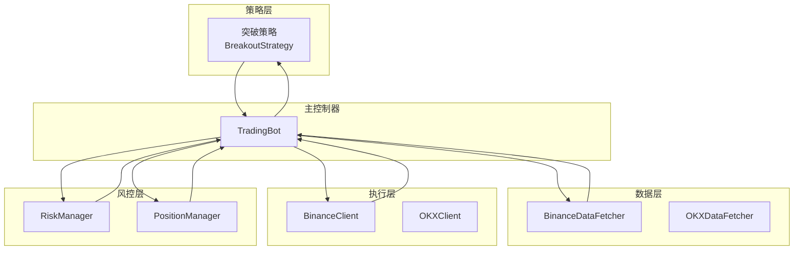
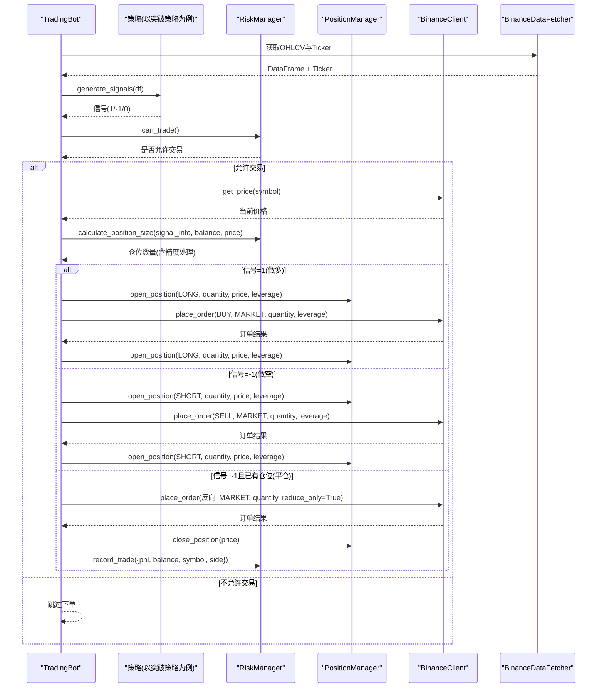
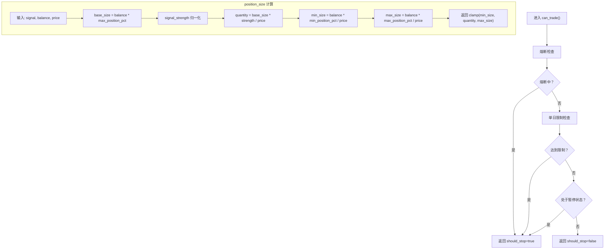
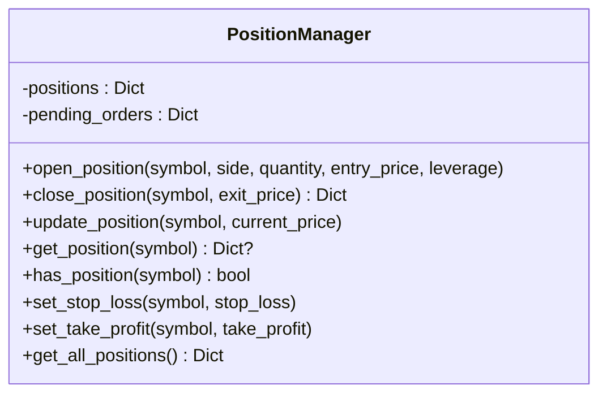
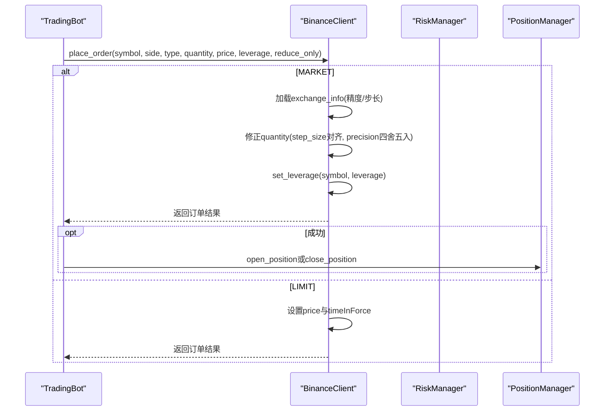
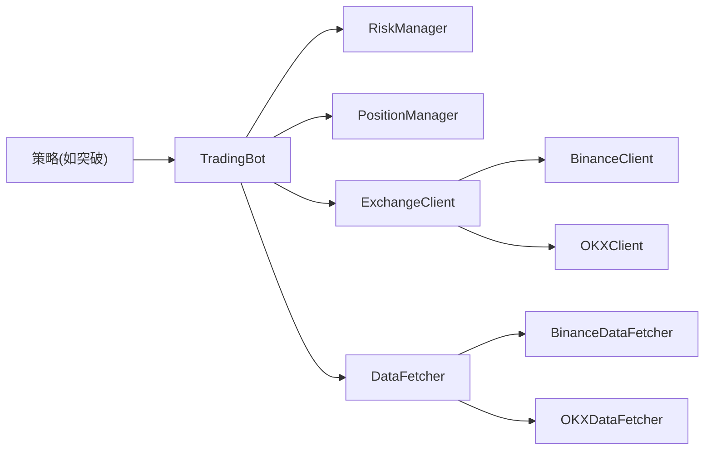

# 信号执行

<cite>
**本文引用的文件**
- [trading_bot.py](file://src/trading_bot.py)
- [exchange_client.py](file://src/execution/exchange_client.py)
- [risk_manager.py](file://src/utils/risk_manager.py)
- [logger.py](file://src/utils/logger.py)
- [data_fetcher.py](file://src/data/data_fetcher.py)
- [breakout.py](file://src/strategies/breakout.py)
- [config.py](file://src/utils/config.py)
- [config.json](file://configs/config.json)
</cite>

## 目录
1. [简介](#简介)
2. [项目结构](#项目结构)
3. [核心组件](#核心组件)
4. [架构总览](#架构总览)
5. [详细组件分析](#详细组件分析)
6. [依赖关系分析](#依赖关系分析)
7. [性能考量](#性能考量)
8. [故障排查指南](#故障排查指南)
9. [结论](#结论)
10. [附录](#附录)

## 简介
本文件围绕“信号执行”模块进行深入技术文档化，重点阐述 TradingBot 的 execute_signal() 方法实现，涵盖信号类型判断、风控检查、仓位计算、订单执行流程；同时系统性说明 PositionManager 的使用、开仓/平仓逻辑、杠杆设置与数量精度控制；解释风险控制系统在信号执行中的作用，包括 can_trade() 检查、position_size 计算与止损止盈参数应用；提供市价单与限价单在不同场景下的执行示例；文档化异常处理机制（订单失败重试、网络异常处理、状态同步策略）以及交易记录、日志记录与统计信息收集功能。

## 项目结构
该系统采用模块化分层设计：
- 策略层：负责生成交易信号（如突破策略）
- 数据层：负责从交易所拉取 OHLCV、Ticker 等市场数据
- 执行层：负责下单、撤单、查询账户与仓位
- 风控层：负责风控检查、仓位管理、止损止盈与熔断
- 主控制器：编排策略、数据、执行与风控，驱动交易循环



图表来源
- [trading_bot.py](file://src/trading_bot.py#L115-L205)
- [breakout.py](file://src/strategies/breakout.py#L64-L79)
- [data_fetcher.py](file://src/data/data_fetcher.py#L85-L142)
- [exchange_client.py](file://src/execution/exchange_client.py#L226-L275)
- [risk_manager.py](file://src/utils/risk_manager.py#L12-L242)

章节来源
- [trading_bot.py](file://src/trading_bot.py#L115-L205)
- [breakout.py](file://src/strategies/breakout.py#L64-L79)
- [data_fetcher.py](file://src/data/data_fetcher.py#L85-L142)
- [exchange_client.py](file://src/execution/exchange_client.py#L226-L275)
- [risk_manager.py](file://src/utils/risk_manager.py#L12-L242)

## 核心组件
- TradingBot：主控制器，负责初始化、数据获取、策略分析、信号执行、仓位检查与风控统计
- RiskManager：风控管理器，负责 can_trade()、position_size 计算、止损止盈检查、熔断与统计
- PositionManager：仓位管理器，负责开仓、平仓、更新浮动盈亏、查询仓位
- ExchangeClient/BinanceClient：交易所客户端，负责下单、查询价格、设置杠杆、查询账户与仓位
- DataFetcher/BinanceDataFetcher：数据获取器，负责获取 OHLCV、Ticker、订单簿等
- Logger：统一日志输出

章节来源
- [trading_bot.py](file://src/trading_bot.py#L27-L91)
- [risk_manager.py](file://src/utils/risk_manager.py#L12-L242)
- [exchange_client.py](file://src/execution/exchange_client.py#L20-L85)
- [data_fetcher.py](file://src/data/data_fetcher.py#L17-L71)
- [logger.py](file://src/utils/logger.py#L12-L34)

## 架构总览
下图展示信号执行的端到端流程：策略生成信号 → 风控检查 → 仓位计算 → 下单执行 → 仓位管理与风控统计。



图表来源
- [trading_bot.py](file://src/trading_bot.py#L115-L205)
- [risk_manager.py](file://src/utils/risk_manager.py#L62-L72)
- [risk_manager.py](file://src/utils/risk_manager.py#L175-L194)
- [exchange_client.py](file://src/execution/exchange_client.py#L226-L275)
- [breakout.py](file://src/strategies/breakout.py#L64-L79)

## 详细组件分析

### execute_signal() 方法详解
该方法是信号执行的核心入口，包含以下关键步骤：
- 信号类型判断：仅当信号为 1（做多）或 -1（做空）时执行下单；0 信号跳过
- 风控检查：调用 can_trade()，若返回 should_stop=true，则记录告警并跳过下单
- 价格与余额获取：通过客户端获取最新价格，并读取账户总余额用于仓位计算
- 仓位计算：调用 calculate_position_size()，传入信号强度、余额与价格，得到目标数量；随后按交易所精度进行四舍五入
- 开仓逻辑：
  - 做多：当信号=1且未持有该币种多仓时，构造 BUY 市价单，设置杠杆并提交下单
  - 做空：当信号=-1且未持有该币种空仓时，构造 SELL 市价单，设置杠杆并提交下单
  - 成功下单后，调用 PositionManager.open_position() 记录开仓信息
- 平仓逻辑：
  - 当信号=-1且已持有该币种多仓时，构造反向市价单（SELL），设置 reduce_only=True，提交平仓
  - 成功下单后，调用 PositionManager.close_position() 计算盈亏并记录到风控统计

```mermaid
flowchart TD
Start(["进入 execute_signal"]) --> CheckSignal["检查信号是否为 1 或 -1"]
CheckSignal --> |否| End(["结束"])
CheckSignal --> |是| RiskCheck["调用 RiskManager.can_trade()"]
RiskCheck --> CanTrade{"can_trade() 允许交易？"}
CanTrade --> |否| LogWarn["记录风控告警"] --> End
CanTrade --> |是| GetPrice["获取当前价格"]
GetPrice --> GetBalance["获取账户余额"]
GetBalance --> CalcQty["RiskManager.calculate_position_size(...)"]
CalcQty --> RoundQty["按精度四舍五入"]
RoundQty --> QtyValid{"数量>0？"}
QtyValid --> |否| End
QtyValid --> |是| SignalType{"信号类型？"}
SignalType --> |1(做多)| OpenLong["开多：BUY 市价单 + 设置杠杆"]
SignalType --> |−1(做空)| OpenShort["开空：SELL 市价单 + 设置杠杆"]
SignalType --> |−1且已有多仓| CloseLong["平多：SELL 市价单(reduce_only)"]
OpenLong --> PlaceOrderLong["下单并检查结果"]
OpenShort --> PlaceOrderShort["下单并检查结果"]
CloseLong --> PlaceOrderClose["下单并检查结果"]
PlaceOrderLong --> |成功| RecordOpenLong["PositionManager.open_position(LONG)"] --> End
PlaceOrderLong --> |失败| LogErrLong["记录开多下单失败"] --> End
PlaceOrderShort --> |成功| RecordOpenShort["PositionManager.open_position(SHORT)"] --> End
PlaceOrderShort --> |失败| LogErrShort["记录开空下单失败"] --> End
PlaceOrderClose --> |成功| ClosePos["PositionManager.close_position(price)"] --> RecordTrade["RiskManager.record_trade(...)"] --> End
PlaceOrderClose --> |失败| LogErrClose["记录平仓下单失败"] --> End
```

图表来源
- [trading_bot.py](file://src/trading_bot.py#L115-L205)
- [risk_manager.py](file://src/utils/risk_manager.py#L62-L72)
- [risk_manager.py](file://src/utils/risk_manager.py#L175-L194)

章节来源
- [trading_bot.py](file://src/trading_bot.py#L115-L205)

### 风控检查与仓位计算
- can_trade()：综合熔断、单日交易限制与暂停状态，决定是否允许下单
- position_size 计算：基于账户总余额、最大仓位比例与信号强度，计算目标下单数量，并限制在最小/最大仓位范围内
- 止损止盈：在 check_positions() 中，根据入场价与当前价计算亏损/盈利百分比，触发则自动平仓并记录交易



图表来源
- [risk_manager.py](file://src/utils/risk_manager.py#L175-L194)
- [risk_manager.py](file://src/utils/risk_manager.py#L62-L72)

章节来源
- [risk_manager.py](file://src/utils/risk_manager.py#L175-L194)
- [risk_manager.py](file://src/utils/risk_manager.py#L62-L72)

### 仓位管理机制（PositionManager）
- 开仓：open_position() 记录方向、数量、入场价、杠杆、时间戳等
- 更新：update_position() 根据最新价格计算浮动盈亏
- 平仓：close_position() 计算实际盈亏、持续时间并移除仓位
- 查询：has_position()/get_position()/get_all_positions()



图表来源
- [risk_manager.py](file://src/utils/risk_manager.py#L244-L339)

章节来源
- [risk_manager.py](file://src/utils/risk_manager.py#L244-L339)

### 订单执行流程（市价单与限价单）
- 市价单：在 BinanceClient 中，MARKET 类型下单会动态加载交易所精度规则，确保 quantity 符合 step_size 并按 quantity_precision 四舍五入；同时设置杠杆
- 限价单：LIMIT 类型下单，设置 price 与 timeInForce=GTC；当前代码中存在限价单占位文件，实际实现可在扩展中完善



图表来源
- [exchange_client.py](file://src/execution/exchange_client.py#L226-L275)

章节来源
- [exchange_client.py](file://src/execution/exchange_client.py#L226-L275)

### 具体订单执行示例
- 市价单开多：当信号=1且无多仓时，构造 BUY 市价单，设置杠杆，下单成功后记录多仓
- 市价单开空：当信号=-1且无空仓时，构造 SELL 市价单，设置杠杆，下单成功后记录空仓
- 市价单平仓：当信号=-1且有多仓时，构造反向 SELL 市价单，设置 reduce_only=True，下单成功后平仓并记录盈亏
- 限价单（扩展）：在 LIMIT 场景下，设置 price 与 GTC 有效期，待后续完善

章节来源
- [trading_bot.py](file://src/trading_bot.py#L143-L180)
- [exchange_client.py](file://src/execution/exchange_client.py#L226-L275)

### 异常处理机制
- 网络异常：ExchangeClient/_request() 对 aiohttp.ClientError 进行捕获并抛出 RuntimeError；BinanceClient.get_balance() 在异常时回退到上次缓存余额
- 订单失败重试：当前代码未实现撤单重试逻辑，建议在 cancel_with_retry() 中增加指数退避与最大重试次数
- 状态同步策略：PositionManager.update_position() 定期根据最新价格更新浮动盈亏；check_positions() 在每次循环中检查止损/止盈并自动平仓

章节来源
- [exchange_client.py](file://src/execution/exchange_client.py#L169-L171)
- [exchange_client.py](file://src/execution/exchange_client.py#L187-L204)
- [trading_bot.py](file://src/trading_bot.py#L206-L255)

### 交易记录、日志记录与统计信息
- 日志：统一通过 get_logger() 输出，包含时间、级别、模块名与消息；异常使用 log_exception() 记录堆栈
- 交易记录：RiskManager.record_trade() 将每笔交易的盈亏、余额、符号与方向写入交易历史，并更新日统计与连败计数
- 统计信息：RiskManager.get_stats() 提供日统计、连败次数、暂停状态与总交易数

章节来源
- [logger.py](file://src/utils/logger.py#L12-L34)
- [risk_manager.py](file://src/utils/risk_manager.py#L196-L241)

## 依赖关系分析
- TradingBot 依赖 RiskManager、PositionManager、ExchangeClient、DataFetcher
- 策略层依赖 BaseStrategy，具体策略（如突破策略）实现 generate_signals()
- 执行层依赖 ExchangeClient 抽象，BinanceClient/OKXClient 实现具体接口
- 风控层依赖 RiskManager 与 PositionManager



图表来源
- [trading_bot.py](file://src/trading_bot.py#L14-L24)
- [breakout.py](file://src/strategies/breakout.py#L6-L20)
- [exchange_client.py](file://src/execution/exchange_client.py#L403-L411)
- [data_fetcher.py](file://src/data/data_fetcher.py#L400-L408)

章节来源
- [trading_bot.py](file://src/trading_bot.py#L14-L24)
- [breakout.py](file://src/strategies/breakout.py#L6-L20)
- [exchange_client.py](file://src/execution/exchange_client.py#L403-L411)
- [data_fetcher.py](file://src/data/data_fetcher.py#L400-L408)

## 性能考量
- 并行数据获取：TradingBot.fetch_market_data() 使用 asyncio.gather 并行获取 OHLCV 与 Ticker，降低等待时间
- 精度与步长：BinanceClient 在下单前加载 exchange_info 并按 step_size 对齐，避免因精度导致的下单失败
- 循环间隔：默认 5 秒一次，可根据市场波动率调整
- 统计与熔断：RiskManager 的熔断与日统计可避免连续亏损扩大

章节来源
- [trading_bot.py](file://src/trading_bot.py#L95-L99)
- [exchange_client.py](file://src/execution/exchange_client.py#L242-L254)

## 故障排查指南
- 配置校验失败：validate_config() 返回错误列表，检查 exchange、symbols、strategy 与 risk 参数范围
- 网络异常：查看 ExchangeClient/_request() 的异常捕获与 RuntimeError 抛出位置
- 下单失败：检查订单返回字段与错误码；确认杠杆设置、精度与步长是否正确
- 仓位未更新：确认 PositionManager.update_position() 是否被调用，以及最新价格是否正确
- 统计异常：核对 RiskManager.record_trade() 的调用时机与 balance 输入

章节来源
- [config.py](file://src/utils/config.py#L15-L37)
- [exchange_client.py](file://src/execution/exchange_client.py#L169-L171)
- [trading_bot.py](file://src/trading_bot.py#L153-L174)
- [risk_manager.py](file://src/utils/risk_manager.py#L196-L216)

## 结论
本信号执行模块以 TradingBot 为核心，结合 RiskManager 与 PositionManager 实现了完整的风控与仓位管理闭环；通过 BinanceClient 的市价单下单与 exchange_info 精度控制，确保下单成功率与合规性；配合日志与统计模块，形成可观测、可审计的交易体系。建议后续完善限价单实现与撤单重试机制，进一步提升系统鲁棒性与自动化水平。

## 附录
- 配置参考：默认配置与用户配置合并逻辑见 DEFAULT_CONFIG 与 deep_merge
- 策略参数：突破策略的 lookback、threshold、atr_multiplier 等参数在策略内部定义

章节来源
- [trading_bot.py](file://src/trading_bot.py#L299-L320)
- [config.py](file://src/utils/config.py#L40-L49)
- [config.json](file://configs/config.json#L1-L28)
- [breakout.py](file://src/strategies/breakout.py#L9-L19)