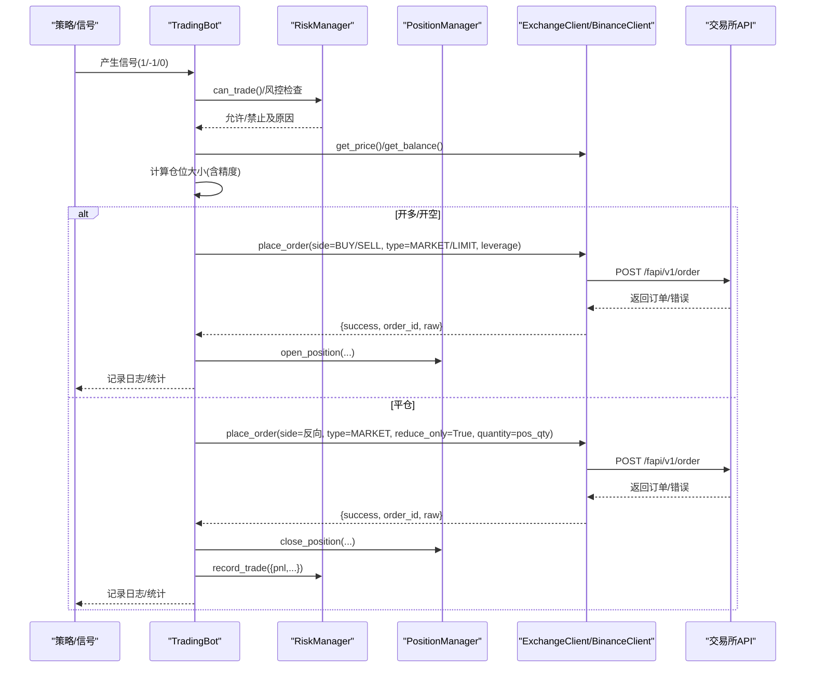
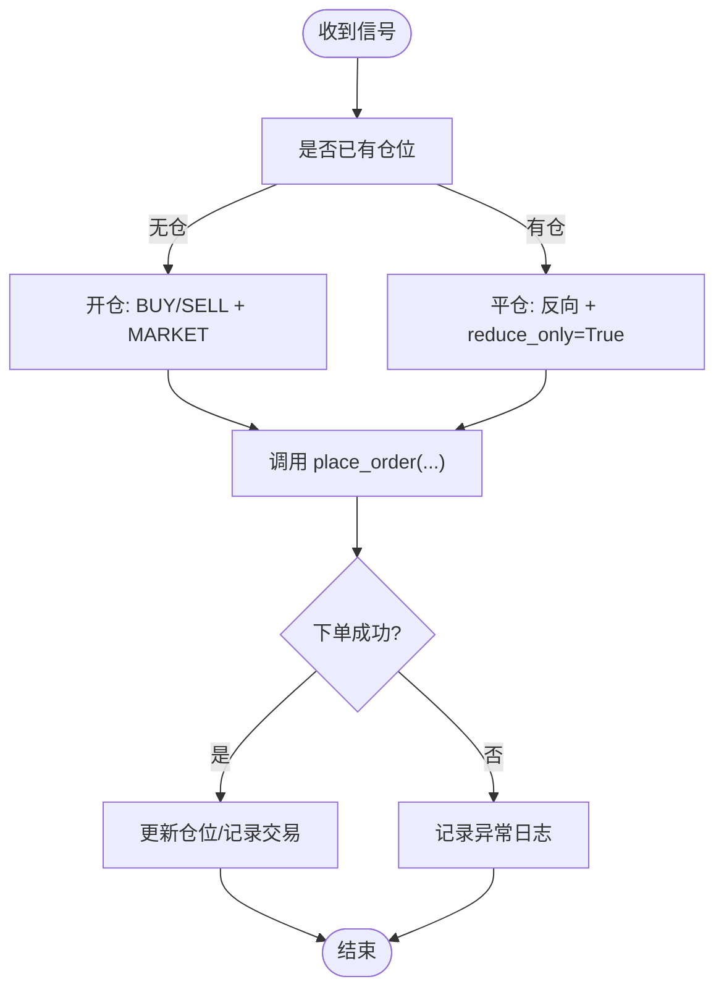
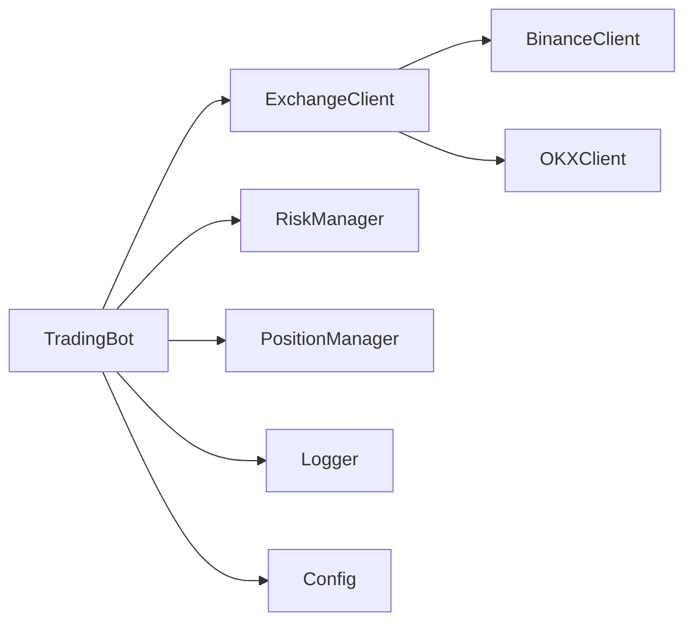

# 订单执行

<cite>
**本文引用的文件**
- [exchange_client.py](file://src/execution/exchange_client.py)
- [order.py](file://src/execution/order.py)
- [retry.py](file://src/execution/retry.py)
- [trading_bot.py](file://src/trading_bot.py)
- [risk_manager.py](file://src/utils/risk_manager.py)
- [logger.py](file://src/utils/logger.py)
- [config.json](file://configs/config.json)
- [aetherlife.json](file://configs/aetherlife.json)
</cite>

## 目录
1. [简介](#简介)
2. [项目结构](#项目结构)
3. [核心组件](#核心组件)
4. [架构总览](#架构总览)
5. [详细组件分析](#详细组件分析)
6. [依赖关系分析](#依赖关系分析)
7. [性能考量](#性能考量)
8. [故障排查指南](#故障排查指南)
9. [结论](#结论)
10. [附录](#附录)

## 简介
本文件面向“订单执行模块”的技术文档，聚焦于市价单与限价单的差异、订单类型参数、杠杆参数传递、数量精度控制、开仓与平仓逻辑（含 BUY/SELL 方向与 reduce_only 机制）、异步下单流程（网络请求、响应解析、错误处理与状态更新）、与交易所 API 的交互细节（认证、请求频率限制与错误码处理），并提供开多、开空、平仓等典型场景的执行示例与状态跟踪策略。

## 项目结构
订单执行相关代码主要分布在以下模块：
- 执行层：交易所客户端封装与下单实现
- 策略层：交易机器人根据信号调用下单
- 风控层：仓位管理与风控检查
- 工具层：日志与配置

```mermaid
graph TB
subgraph "策略层"
Bot["TradingBot<br/>生成信号并驱动下单"]
end
subgraph "执行层"
EC["ExchangeClient<br/>抽象基类"]
BC["BinanceClient<br/>实现下单/撤单/杠杆/保证金"]
OK["OKXClient<br/>占位实现"]
end
subgraph "风控层"
RM["RiskManager<br/>风控检查"]
PM["PositionManager<br/>仓位管理"]
end
subgraph "工具层"
LG["Logger<br/>统一日志"]
CFG["Config<br/>默认配置"]
end
Bot --> EC
EC --> BC
EC --> OK
Bot --> RM
Bot --> PM
Bot --> LG
Bot --> CFG
```

图表来源
- [trading_bot.py](file://src/trading_bot.py#L27-L205)
- [exchange_client.py](file://src/execution/exchange_client.py#L20-L84)
- [risk_manager.py](file://src/utils/risk_manager.py#L12-L241)

章节来源
- [trading_bot.py](file://src/trading_bot.py#L27-L205)
- [exchange_client.py](file://src/execution/exchange_client.py#L20-L84)
- [risk_manager.py](file://src/utils/risk_manager.py#L12-L241)

## 核心组件
- 交易所客户端抽象与实现
  - 抽象基类提供通用接口：行情、账户、下单、撤单、杠杆与保证金模式设置
  - 具体实现包含 BinanceClient 与 OKXClient
- 交易机器人
  - 根据策略信号与风控条件，调用下单接口执行开多、开空、平仓
- 风控与仓位管理
  - 计算仓位大小、检查止损止盈、熔断与日限额；维护开仓/平仓状态
- 日志与配置
  - 统一日志输出；默认配置文件定义交易参数

章节来源
- [exchange_client.py](file://src/execution/exchange_client.py#L20-L84)
- [exchange_client.py](file://src/execution/exchange_client.py#L87-L342)
- [trading_bot.py](file://src/trading_bot.py#L27-L205)
- [risk_manager.py](file://src/utils/risk_manager.py#L12-L241)
- [logger.py](file://src/utils/logger.py#L12-L34)
- [config.json](file://configs/config.json#L1-L28)

## 架构总览
下图展示从策略到下单、风控与交易所交互的整体流程。

图表来源
- [trading_bot.py](file://src/trading_bot.py#L115-L205)
- [exchange_client.py](file://src/execution/exchange_client.py#L226-L275)
- [risk_manager.py](file://src/utils/risk_manager.py#L175-L241)

## 详细组件分析

### 1) 市价单 vs 限价单：区别与参数
- 市价单
  - 用于快速成交，按市场最优价格立即成交
  - 在下单时会进行数量精度与步长校正，确保符合交易所规则
- 限价单
  - 指定价格，仅在达到该价格时成交
  - 支持 GTC 等时间参数（具体取决于交易所）

章节来源
- [exchange_client.py](file://src/execution/exchange_client.py#L238-L260)
- [exchange_client.py](file://src/execution/exchange_client.py#L241-L254)

### 2) 订单类型参数与数量精度控制
- 订单类型
  - MARKET/LIMIT 由调用方传入
- 数量精度与步长
  - 市价单下单前会加载交易所规则，读取 quantity_precision 与 step_size，并对 quantity 进行“向下取整到步长”的处理，随后按精度四舍五入
- 价格精度
  - 通过交易所返回的 price_precision 控制（在 BinanceClient 中动态获取）

章节来源
- [exchange_client.py](file://src/execution/exchange_client.py#L101-L121)
- [exchange_client.py](file://src/execution/exchange_client.py#L241-L254)

### 3) 开仓与平仓逻辑
- 开仓
  - 信号为 1 且无仓时，执行 BUY 开多；信号为 -1 且无仓时，执行 SELL 开空
  - 使用市价单，数量由风控计算并保留 3 位小数
- 平仓
  - 若已有仓，则根据当前仓位方向反向平仓（LONG 平仓使用 SELL，SHORT 平仓使用 BUY）
  - 平仓时启用 reduce_only=True，确保只减仓不增仓
  - 平仓数量等于当前仓位数量

图表来源
- [trading_bot.py](file://src/trading_bot.py#L143-L204)

章节来源
- [trading_bot.py](file://src/trading_bot.py#L143-L204)

### 4) 异步下单流程与错误处理
- 异步网络请求
  - 使用 aiohttp 客户端，支持 GET/POST/DELETE
  - 请求超时配置为总时长与连接时长
- 响应解析
  - 对于 Binance：若返回字典且包含 code 非 0 则抛错；否则解析 orderId、price、origQty 等字段
- 错误处理
  - 对 aiohttp.ClientError 包装为 RuntimeError
  - 交易机器人中对下单异常进行捕获并记录日志
- 状态更新
  - 下单成功后，交易机器人更新 PositionManager 的开仓/平仓状态，并记录风控统计

章节来源
- [exchange_client.py](file://src/execution/exchange_client.py#L16-L17)
- [exchange_client.py](file://src/execution/exchange_client.py#L153-L171)
- [exchange_client.py](file://src/execution/exchange_client.py#L266-L275)
- [trading_bot.py](file://src/trading_bot.py#L145-L155)
- [trading_bot.py](file://src/trading_bot.py#L164-L174)
- [trading_bot.py](file://src/trading_bot.py#L185-L194)

### 5) 杠杆参数传递与设置
- 传参
  - place_order 接口接收 leverage 参数
- 设置流程
  - 市价单下单前先调用 set_leverage 设置目标杠杆
  - OKXClient 的 set_leverage 为占位实现（返回成功）
- 注意
  - 不同交易所对杠杆设置的权限与生效时机可能不同，需结合实际交易所文档

章节来源
- [exchange_client.py](file://src/execution/exchange_client.py#L261-L262)
- [exchange_client.py](file://src/execution/exchange_client.py#L302-L318)
- [exchange_client.py](file://src/execution/exchange_client.py#L398-L399)

### 6) 与交易所 API 的交互细节
- 认证机制
  - Binance：使用 HMAC SHA256 签名，附加 X-MBX-APIKEY 头
  - OKX：占位实现，尚未实现签名
- 请求频率限制
  - 代码未显式实现速率限制，建议在上层策略或外部代理中控制
- 错误码处理
  - Binance：当返回字典且 code 存在且非 0 时视为错误
  - aiohttp 请求异常统一包装为 RuntimeError

章节来源
- [exchange_client.py](file://src/execution/exchange_client.py#L128-L151)
- [exchange_client.py](file://src/execution/exchange_client.py#L165-L171)
- [exchange_client.py](file://src/execution/exchange_client.py#L391-L396)

### 7) 订单状态跟踪与 ID 管理
- 订单 ID 管理
  - 下单成功后，返回字典包含 order_id 字段，交易机器人据此记录
- 执行结果验证
  - 通过 success 字段与返回的原始数据进行验证
- 异常处理策略
  - 交易机器人对下单异常进行捕获并记录日志，避免中断主循环
- 与风控联动
  - 平仓完成后调用 record_trade 记录盈亏与统计

章节来源
- [exchange_client.py](file://src/execution/exchange_client.py#L266-L275)
- [trading_bot.py](file://src/trading_bot.py#L156-L161)
- [trading_bot.py](file://src/trading_bot.py#L175-L180)
- [trading_bot.py](file://src/trading_bot.py#L196-L204)
- [risk_manager.py](file://src/utils/risk_manager.py#L196-L216)

### 8) 示例：开多、开空、平仓
- 开多
  - 条件：信号为 1 且无仓
  - 调用：place_order(symbol, side="BUY", order_type="MARKET", quantity=计算值, leverage=配置)
  - 结果：开仓 LONG，记录日志与仓位
- 开空
  - 条件：信号为 -1 且无仓
  - 调用：place_order(symbol, side="SELL", order_type="MARKET", quantity=计算值, leverage=配置)
  - 结果：开仓 SHORT，记录日志与仓位
- 平仓
  - 条件：已有仓
  - 调用：place_order(symbol, side=反向, order_type="MARKET", quantity=当前仓位数量, reduce_only=True)
  - 结果：平仓并记录盈亏与风控统计

章节来源
- [trading_bot.py](file://src/trading_bot.py#L143-L204)

### 9) 市价单类与限价单函数（扩展性）
- 市价单类
  - 提供市价单对象与执行入口，便于未来扩展
- 限价单函数
  - 提供限价单下单函数占位，便于后续实现

章节来源
- [order.py](file://src/execution/order.py#L1-L26)

### 10) 撤单重试（扩展性）
- 撤单重试函数占位，便于后续实现带退避与最大重试次数的撤单流程

章节来源
- [retry.py](file://src/execution/retry.py#L1-L6)

## 依赖关系分析
- TradingBot 依赖 ExchangeClient 抽象与其实现（BinanceClient/OKXClient），并通过 RiskManager/PositionManager 进行风控与仓位管理
- ExchangeClient 封装了 aiohttp 会话、签名与错误处理
- 日志模块提供统一输出，配置文件提供默认参数

图表来源
- [trading_bot.py](file://src/trading_bot.py#L27-L205)
- [exchange_client.py](file://src/execution/exchange_client.py#L20-L84)
- [risk_manager.py](file://src/utils/risk_manager.py#L12-L241)
- [logger.py](file://src/utils/logger.py#L12-L34)
- [config.json](file://configs/config.json#L1-L28)

章节来源
- [trading_bot.py](file://src/trading_bot.py#L27-L205)
- [exchange_client.py](file://src/execution/exchange_client.py#L20-L84)
- [risk_manager.py](file://src/utils/risk_manager.py#L12-L241)
- [logger.py](file://src/utils/logger.py#L12-L34)
- [config.json](file://configs/config.json#L1-L28)

## 性能考量
- 异步 I/O
  - 使用 aiohttp 并发请求，减少阻塞
- 精度与步长
  - 下单前进行数量精度与步长校正，避免因不符合规则导致的失败重试
- 风控前置
  - 在下单前进行风控检查，减少无效请求
- 日志与统计
  - 统一日志输出，便于定位问题与统计交易表现

[本节为一般性指导，无需特定文件来源]

## 故障排查指南
- 下单失败
  - 检查返回的错误码与消息；确认 API Key/Secret 是否正确
  - 确认数量精度与步长是否满足交易所要求
- 仓位未更新
  - 确认下单成功标志与 order_id 是否存在
  - 检查风控与仓位管理是否正确记录
- 平仓未生效
  - 确认 reduce_only 是否为 True，side 是否与当前仓位相反
- 日志定位
  - 使用统一日志输出查看下单异常堆栈

章节来源
- [exchange_client.py](file://src/execution/exchange_client.py#L165-L171)
- [exchange_client.py](file://src/execution/exchange_client.py#L266-L275)
- [trading_bot.py](file://src/trading_bot.py#L153-L155)
- [trading_bot.py](file://src/trading_bot.py#L173-L174)
- [trading_bot.py](file://src/trading_bot.py#L194-L195)
- [logger.py](file://src/utils/logger.py#L12-L34)

## 结论
本模块以异步方式封装了与交易所的交互，实现了市价单与限价单的下单、数量精度控制、杠杆设置、开仓与平仓逻辑，并通过风控与仓位管理保障交易安全。建议在生产环境中补充撤单重试、速率限制与更完善的错误码映射，并针对不同交易所细化参数与行为差异。

[本节为总结性内容，无需特定文件来源]

## 附录

### A. place_order 方法实现要点（来自 BinanceClient）
- 参数
  - symbol、side、order_type、quantity、price、leverage、reduce_only
- 流程
  - 构造基础参数（含 positionSide 与 reduceOnly）
  - 市价单：加载交易所规则、按 quantity_precision 与 step_size 校正数量、四舍五入
  - 限价单：设置 price 与 timeInForce
  - 设置杠杆并提交下单
  - 返回标准化结果（包含 success、order_id、raw 等）

章节来源
- [exchange_client.py](file://src/execution/exchange_client.py#L226-L275)

### B. 配置参考
- 默认配置
  - 交易所、测试网、交易对、时间周期、杠杆、策略与风控参数
- Aetherlife 配置
  - 日志级别、认知与守护相关选项

章节来源
- [config.json](file://configs/config.json#L1-L28)
- [aetherlife.json](file://configs/aetherlife.json#L1-L17)