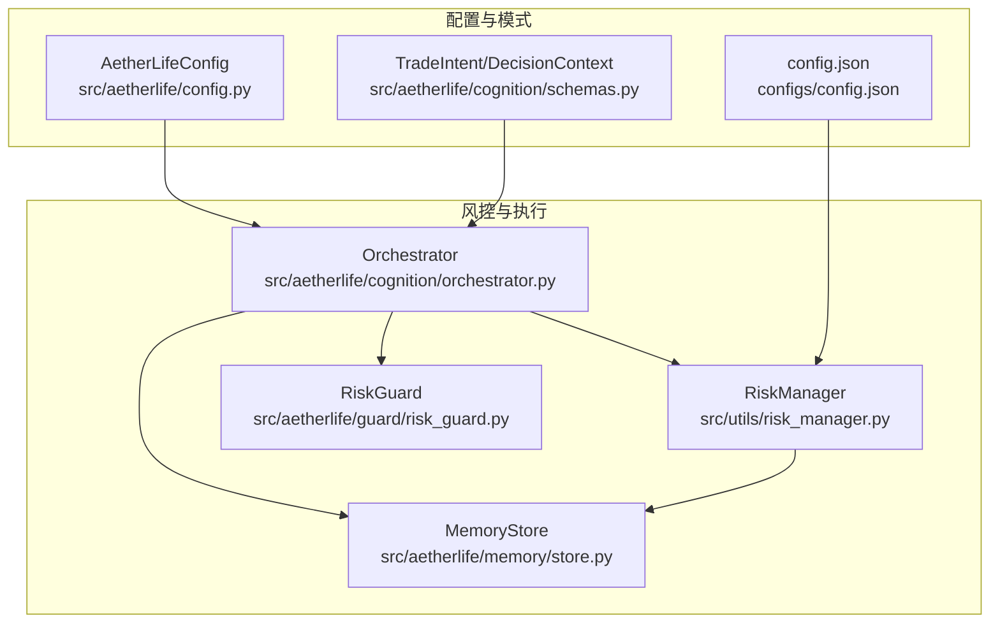
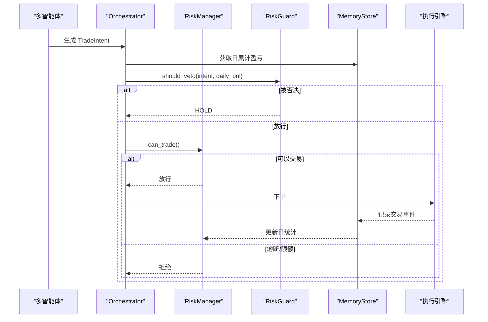
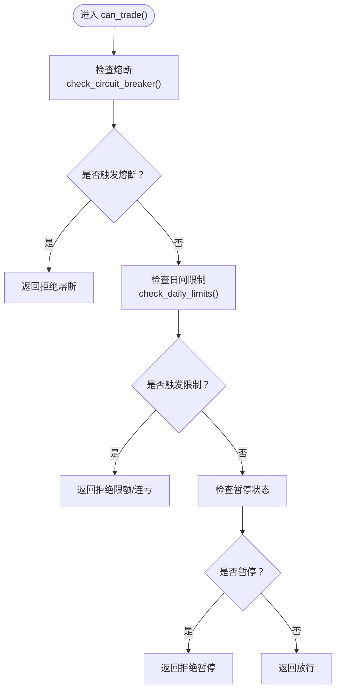
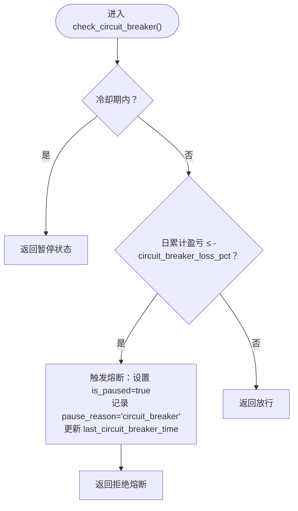
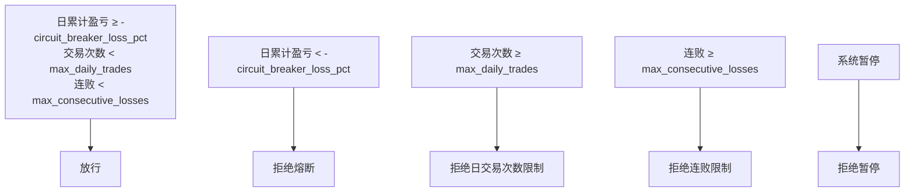
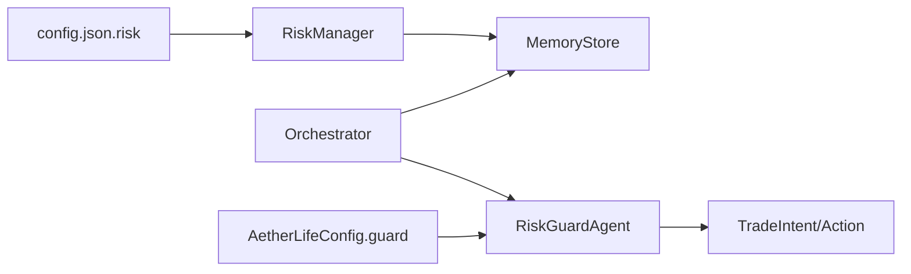

# 风控检查

<cite>
**本文引用的文件列表**
- [src/utils/risk_manager.py](file://src/utils/risk_manager.py)
- [src/aetherlife/guard/risk_guard.py](file://src/aetherlife/guard/risk_guard.py)
- [src/aetherlife/cognition/orchestrator.py](file://src/aetherlife/cognition/orchestrator.py)
- [src/aetherlife/cognition/schemas.py](file://src/aetherlife/cognition/schemas.py)
- [src/aetherlife/memory/store.py](file://src/aetherlife/memory/store.py)
- [src/aetherlife/config.py](file://src/aetherlife/config.py)
- [configs/config.json](file://configs/config.json)
</cite>

## 目录
1. [简介](#简介)
2. [项目结构](#项目结构)
3. [核心组件](#核心组件)
4. [架构总览](#架构总览)
5. [组件详解](#组件详解)
6. [依赖关系分析](#依赖关系分析)
7. [性能考量](#性能考量)
8. [故障排查指南](#故障排查指南)
9. [结论](#结论)
10. [附录](#附录)

## 简介
本文件面向风控检查模块，系统性阐述以下内容：
- can_trade() 方法的实现逻辑与控制流，覆盖最大仓位比例检查、连续亏损限制、日交易次数限制与熔断机制
- stop_loss_pct 与 take_profit_pct 参数的作用机制
- circuit_breaker_loss_pct 熔断保护的工作原理
- 风控统计系统：record_trade() 如何记录交易结果、get_stats() 如何统计交易表现
- 风控检查示例：不同场景下的风控决策过程
- 风控配置参数的含义与调优建议

## 项目结构
风控相关代码主要分布在以下模块：
- 风控管理器：负责仓位、止损止盈、熔断、日统计与交易记录
- 守护层：执行前的最后一道关卡，结合日累计盈亏与头寸价值进行拦截或放行
- 协调器：在多智能体决策后，对最终意图进行风控否决
- 记忆存储：提供日累计盈亏等风控所需的基础数据
- 配置：全局与策略级风控参数来源

图表来源
- [src/utils/risk_manager.py](file://src/utils/risk_manager.py#L12-L241)
- [src/aetherlife/guard/risk_guard.py](file://src/aetherlife/guard/risk_guard.py#L23-L68)
- [src/aetherlife/cognition/orchestrator.py](file://src/aetherlife/cognition/orchestrator.py#L16-L53)
- [src/aetherlife/memory/store.py](file://src/aetherlife/memory/store.py#L43-L145)
- [src/aetherlife/config.py](file://src/aetherlife/config.py#L70-L82)
- [configs/config.json](file://configs/config.json#L15-L20)

章节来源
- [src/utils/risk_manager.py](file://src/utils/risk_manager.py#L12-L241)
- [src/aetherlife/guard/risk_guard.py](file://src/aetherlife/guard/risk_guard.py#L23-L68)
- [src/aetherlife/cognition/orchestrator.py](file://src/aetherlife/cognition/orchestrator.py#L16-L53)
- [src/aetherlife/memory/store.py](file://src/aetherlife/memory/store.py#L43-L145)
- [src/aetherlife/config.py](file://src/aetherlife/config.py#L70-L82)
- [configs/config.json](file://configs/config.json#L15-L20)

## 核心组件
- RiskManager：集中式风控管理器，负责仓位计算、止损止盈、熔断、日统计与交易记录
- RiskGuard：执行前最后一道关卡，基于日累计盈亏与头寸价值决定是否拦截
- Orchestrator：在多智能体聚合后，使用 RiskGuard 对最终意图进行风控否决
- MemoryStore：提供日累计盈亏等风控所需的数据
- 配置：AetherLifeConfig 与 config.json 提供风控参数来源

章节来源
- [src/utils/risk_manager.py](file://src/utils/risk_manager.py#L12-L241)
- [src/aetherlife/guard/risk_guard.py](file://src/aetherlife/guard/risk_guard.py#L23-L68)
- [src/aetherlife/cognition/orchestrator.py](file://src/aetherlife/cognition/orchestrator.py#L16-L53)
- [src/aetherlife/memory/store.py](file://src/aetherlife/memory/store.py#L140-L145)
- [src/aetherlife/config.py](file://src/aetherlife/config.py#L70-L82)
- [configs/config.json](file://configs/config.json#L15-L20)

## 架构总览
风控检查贯穿“决策—执行—审计”链路：
- 决策阶段：多智能体产生 TradeIntent
- 风控阶段：RiskManager.can_trade() 与 RiskGuard.check() 双重把关
- 执行阶段：若未被否决，则执行订单；交易完成后通过 MemoryStore 记录并更新日统计
- 审计阶段：RiskGuard.audit() 记录审计事件

图表来源
- [src/aetherlife/cognition/orchestrator.py](file://src/aetherlife/cognition/orchestrator.py#L38-L53)
- [src/aetherlife/guard/risk_guard.py](file://src/aetherlife/guard/risk_guard.py#L48-L68)
- [src/aetherlife/memory/store.py](file://src/aetherlife/memory/store.py#L140-L145)
- [src/utils/risk_manager.py](file://src/utils/risk_manager.py#L175-L194)

## 组件详解

### RiskManager.can_trade() 实现与控制流
RiskManager.can_trade() 是风控检查的核心入口，其控制流如下：
- 检查熔断：若处于冷却期或日累计盈亏达到熔断阈值，则返回拒绝
- 检查日间限制：若当日交易次数或连续亏损达到阈值，则返回拒绝
- 检查暂停状态：若风控系统被手动暂停，则返回拒绝
- 其余情况返回放行

图表来源
- [src/utils/risk_manager.py](file://src/utils/risk_manager.py#L175-L194)
- [src/utils/risk_manager.py](file://src/utils/risk_manager.py#L129-L153)
- [src/utils/risk_manager.py](file://src/utils/risk_manager.py#L155-L173)

章节来源
- [src/utils/risk_manager.py](file://src/utils/risk_manager.py#L175-L194)

### 最大仓位比例检查
RiskManager.calculate_position_size() 基于信号强度与账户余额计算可下单的合约数量，确保不超过 max_position_pct 与 min_position_pct 的约束，并考虑价格与杠杆。

- 输入：信号强度、账户余额、标的价格
- 输出：合约数量（受最小/最大仓位与价格约束）

章节来源
- [src/utils/risk_manager.py](file://src/utils/risk_manager.py#L62-L71)

### 连续亏损限制
RiskManager.check_daily_limits() 在每日统计基础上检查：
- 日交易次数是否达到 max_daily_trades
- 连续亏损次数是否达到 max_consecutive_losses

一旦任一条件满足，返回拒绝并标注原因。

章节来源
- [src/utils/risk_manager.py](file://src/utils/risk_manager.py#L155-L173)

### 日交易次数限制
RiskManager.record_trade() 在每次交易完成后更新：
- 日交易计数
- 胜负计数
- 连续亏损计数
- 日累计盈亏（以余额为基准的百分比）

章节来源
- [src/utils/risk_manager.py](file://src/utils/risk_manager.py#L196-L216)

### 熔断机制
RiskManager.check_circuit_breaker() 的工作流程：
- 若处于冷却期（由上次熔断时间与冷却时长决定），则返回当前暂停状态
- 若日累计盈亏跌破 -circuit_breaker_loss_pct，则触发熔断：设置 is_paused、记录 pause_reason、更新 last_circuit_breaker_time，并返回拒绝

图表来源
- [src/utils/risk_manager.py](file://src/utils/risk_manager.py#L129-L153)

章节来源
- [src/utils/risk_manager.py](file://src/utils/risk_manager.py#L129-L153)

### stop_loss_pct 与 take_profit_pct 参数机制
- 止损检查：根据入场价与当前价计算损失比例，当损失比例达到或超过 stop_loss_pct 时，返回“应止损”
- 止盈检查：根据入场价与当前价计算利润比例，当利润比例达到或超过 take_profit_pct 时，返回“应止盈”

章节来源
- [src/utils/risk_manager.py](file://src/utils/risk_manager.py#L73-L105)

### circuit_breaker_loss_pct 熔断保护原理
- 触发条件：日累计盈亏百分比低于等于 -circuit_breaker_loss_pct
- 行为：系统进入暂停状态，暂停原因标记为“熔断”，并记录最后一次熔断时间
- 冷却期：在冷却时间内不再重复触发熔断，但 can_trade() 仍会返回暂停状态

章节来源
- [src/utils/risk_manager.py](file://src/utils/risk_manager.py#L31-L33)
- [src/utils/risk_manager.py](file://src/utils/risk_manager.py#L129-L153)

### 风控统计系统：record_trade() 与 get_stats()
- record_trade()：更新日统计与连败计数，维护交易历史队列
- get_stats()：返回日统计、连败计数、暂停状态与总交易数

章节来源
- [src/utils/risk_manager.py](file://src/utils/risk_manager.py#L196-L241)

### 执行前风控：RiskGuard.check()
RiskGuard.check() 在执行前对 TradeIntent 进行拦截：
- 若系统暂停，直接拒绝
- 若意图动作为 HOLD，直接放行
- 若日累计盈亏低于 -circuit_breaker_pct 或 -max_daily_loss_pct，拒绝
- 若头寸价值超过阈值，放行但标记需要人工确认（HITL）

章节来源
- [src/aetherlife/guard/risk_guard.py](file://src/aetherlife/guard/risk_guard.py#L48-L68)

### 协调器中的风控否决
Orchestrator 在多智能体聚合后，使用 RiskGuardAgent.should_veto() 对最终意图进行风控否决：
- 若意图动作为 HOLD，不否决
- 若日累计盈亏低于 -max_daily_loss_pct，否决
- 若意图置信度过低，否决

章节来源
- [src/aetherlife/cognition/orchestrator.py](file://src/aetherlife/cognition/orchestrator.py#L38-L53)
- [src/aetherlife/cognition/orchestrator.py](file://src/aetherlife/cognition/orchestrator.py#L60-L68)

### 风控检查示例
以下示例展示不同场景下的风控决策过程（以 RiskManager.can_trade() 为主线）：
- 场景A：日累计盈亏未达熔断阈值，且未超过日交易次数与连败阈值，返回放行
- 场景B：日累计盈亏跌破熔断阈值，返回拒绝（熔断）
- 场景C：当日交易次数达到上限，返回拒绝（日交易次数限制）
- 场景D：连续亏损达到上限，返回拒绝（连败限制）
- 场景E：系统被手动暂停，返回拒绝（暂停）

图表来源
- [src/utils/risk_manager.py](file://src/utils/risk_manager.py#L175-L194)
- [src/utils/risk_manager.py](file://src/utils/risk_manager.py#L129-L153)
- [src/utils/risk_manager.py](file://src/utils/risk_manager.py#L155-L173)

## 依赖关系分析
- RiskManager 依赖 MemoryStore 提供日累计盈亏与交易事件
- Orchestrator 依赖 RiskGuardAgent 与 MemoryStore 获取日累计盈亏
- RiskGuard 依赖 TradeIntent 与日累计盈亏进行拦截
- 配置来源：AetherLifeConfig.guard 与 config.json 的 risk 字段

图表来源
- [src/aetherlife/cognition/orchestrator.py](file://src/aetherlife/cognition/orchestrator.py#L38-L53)
- [src/aetherlife/guard/risk_guard.py](file://src/aetherlife/guard/risk_guard.py#L48-L68)
- [src/aetherlife/memory/store.py](file://src/aetherlife/memory/store.py#L140-L145)
- [src/aetherlife/config.py](file://src/aetherlife/config.py#L70-L82)
- [configs/config.json](file://configs/config.json#L15-L20)

章节来源
- [src/aetherlife/cognition/orchestrator.py](file://src/aetherlife/cognition/orchestrator.py#L38-L53)
- [src/aetherlife/guard/risk_guard.py](file://src/aetherlife/guard/risk_guard.py#L48-L68)
- [src/aetherlife/memory/store.py](file://src/aetherlife/memory/store.py#L140-L145)
- [src/aetherlife/config.py](file://src/aetherlife/config.py#L70-L82)
- [configs/config.json](file://configs/config.json#L15-L20)

## 性能考量
- RiskManager 的日统计与交易历史采用固定长度队列，避免内存无限增长
- RiskGuard.check() 与 RiskGuardAgent.should_veto() 为 O(1) 检查，开销极低
- 熔断冷却期减少频繁触发导致的抖动
- 建议：在高频交易场景下，适当提高 max_daily_trades 与 max_consecutive_losses，降低误伤概率

## 故障排查指南
- 熔断误触发：检查 circuit_breaker_loss_pct 与 circuit_breaker_cooldown 设置是否合理；查看 get_stats() 中的 is_paused 与 pause_reason
- 交易被拒：确认是否达到日交易次数上限或连续亏损上限；检查 RiskGuard.check() 返回的原因
- 日累计盈亏异常：核对 MemoryStore.get_daily_pnl() 的数据来源与时间范围
- HITL 触发：确认 position_value_usd 是否超过 hitl_threshold_usd；必要时调整阈值

章节来源
- [src/utils/risk_manager.py](file://src/utils/risk_manager.py#L129-L153)
- [src/utils/risk_manager.py](file://src/utils/risk_manager.py#L155-L173)
- [src/aetherlife/guard/risk_guard.py](file://src/aetherlife/guard/risk_guard.py#L48-L68)
- [src/aetherlife/memory/store.py](file://src/aetherlife/memory/store.py#L140-L145)

## 结论
风控检查模块通过 RiskManager 与 RiskGuard 的协同，实现了从“最大仓位比例、止损止盈、熔断、日交易次数与连败限制”到“执行前拦截”的全链路风控。配合 MemoryStore 的日统计与 Orchestrator 的风控否决，系统在保证稳定性的同时，提供了灵活的参数配置与可观测性。

## 附录

### 风控配置参数与调优建议
- max_position_pct：单笔最大仓位占总资产的比例，建议根据策略回测波动率与资金曲线稳定性设置，通常在 5%-20% 之间
- stop_loss_pct：止损比例，建议与策略预期最大回撤一致，通常在 1%-5%
- take_profit_pct：止盈比例，建议略高于手续费与滑点成本之和，通常在 2%-10%
- max_daily_trades：单日最大交易次数，建议根据频率与滑点成本设置，避免过度交易
- max_consecutive_losses：最大连续亏损次数，建议与策略胜率匹配，通常在 3-10
- circuit_breaker_loss_pct：熔断阈值，建议设置为策略年化回撤的 1.5-3 倍，避免系统性风险
- circuit_breaker_cooldown：熔断冷却时间，建议设置为 1-6 小时，兼顾恢复与稳定
- max_daily_loss_pct：单日最大亏损阈值（守护层），建议与策略目标回撤一致
- hitl_threshold_usd：大额人工确认阈值，建议根据策略规模与监管要求设置

章节来源
- [src/utils/risk_manager.py](file://src/utils/risk_manager.py#L15-L33)
- [src/aetherlife/guard/risk_guard.py](file://src/aetherlife/guard/risk_guard.py#L26-L42)
- [src/aetherlife/config.py](file://src/aetherlife/config.py#L70-L82)
- [configs/config.json](file://configs/config.json#L15-L20)