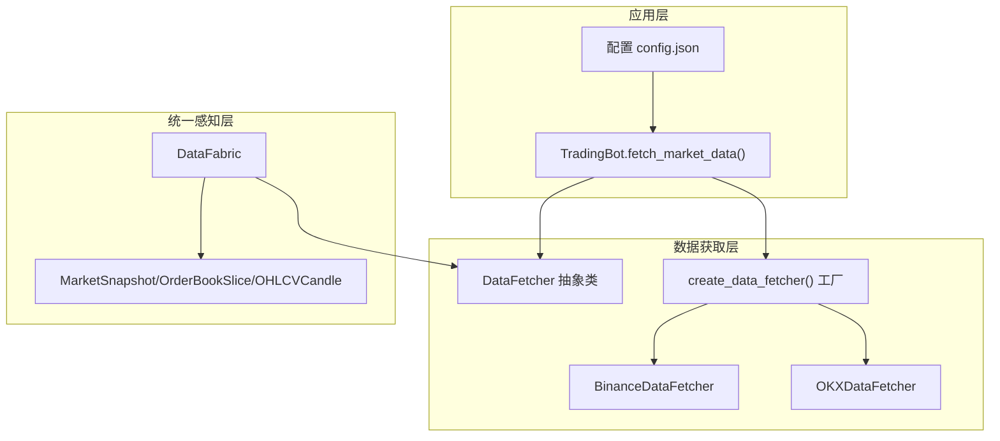
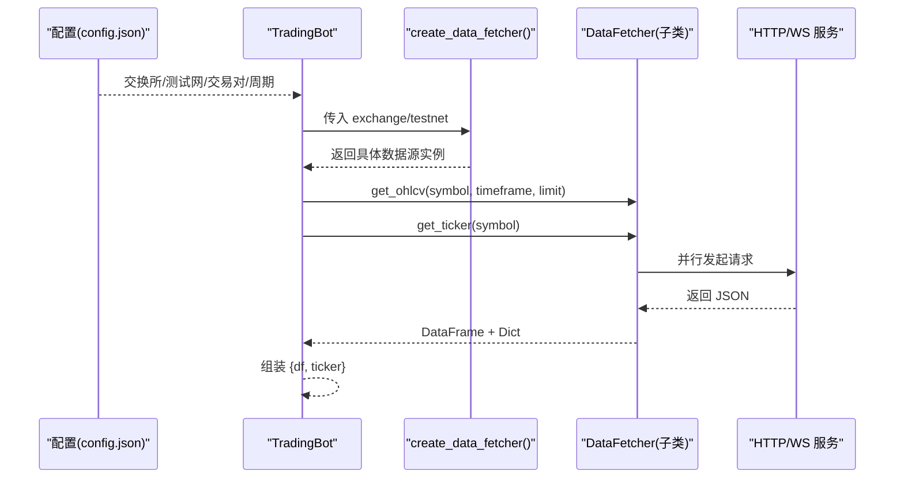
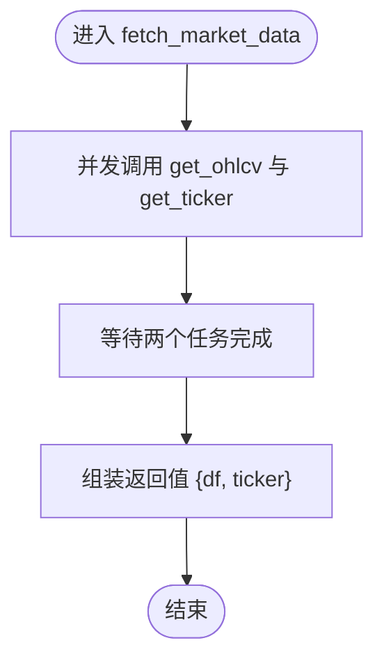
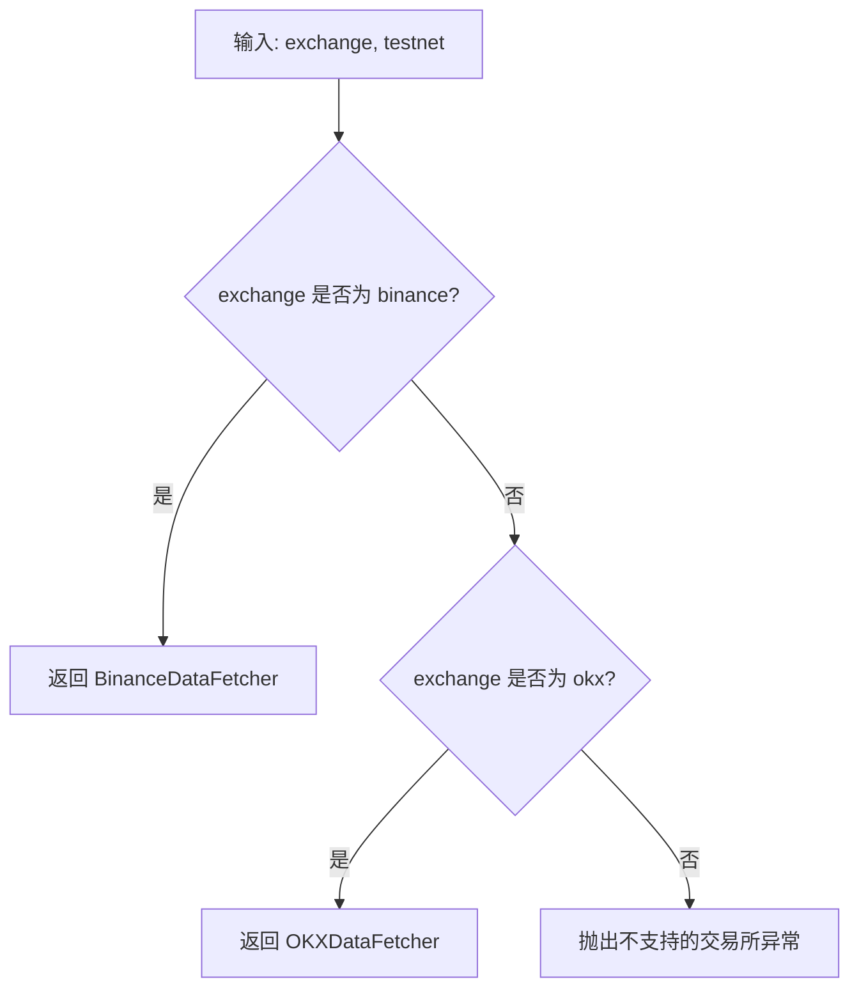
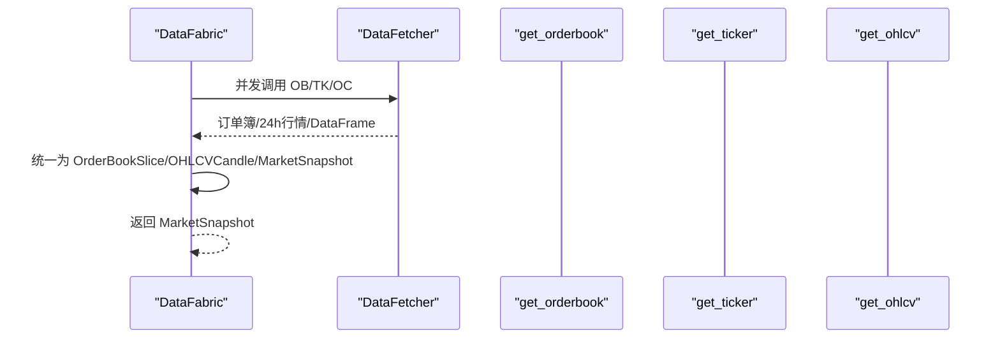
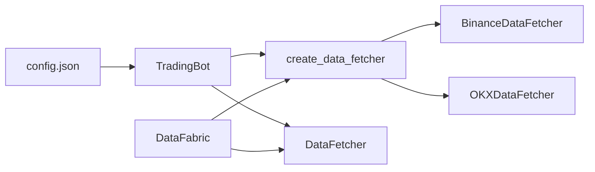

# 市场数据获取

<cite>
**本文引用的文件**
- [src/data/data_fetcher.py](file://src/data/data_fetcher.py)
- [src/aetherlife/perception/fabric.py](file://src/aetherlife/perception/fabric.py)
- [src/aetherlife/perception/models.py](file://src/aetherlife/perception/models.py)
- [src/trading_bot.py](file://src/trading_bot.py)
- [configs/config.json](file://configs/config.json)
- [src/aetherlife/perception/crypto_connector.py](file://src/aetherlife/perception/crypto_connector.py)
- [src/aetherlife/perception/ibkr_connector.py](file://src/aetherlife/perception/ibkr_connector.py)
</cite>

## 目录
1. [简介](#简介)
2. [项目结构](#项目结构)
3. [核心组件](#核心组件)
4. [架构总览](#架构总览)
5. [详细组件分析](#详细组件分析)
6. [依赖关系分析](#依赖关系分析)
7. [性能考量](#性能考量)
8. [故障排查指南](#故障排查指南)
9. [结论](#结论)
10. [附录](#附录)

## 简介
本文档聚焦“市场数据获取”模块，围绕 fetch_market_data() 方法的实现原理展开，系统性阐述以下主题：
- 并行数据获取机制：基于 asyncio.gather() 的并发调用与性能优化
- OHLCV 与 Ticker 数据的异步获取流程
- 工厂模式 create_data_fetcher() 如何依据配置选择交易所数据源
- 使用示例：单/多交易对、不同时间周期、数据格式标准化
- 异常处理、重试与超时控制策略

## 项目结构
与市场数据获取直接相关的模块分布如下：
- 数据获取层：src/data/data_fetcher.py（抽象基类与具体交易所实现、工厂函数）
- 统一感知层：src/aetherlife/perception/fabric.py（DataFabric 将多源数据聚合为 MarketSnapshot）
- 数据模型：src/aetherlife/perception/models.py（统一订单簿、K线、市场快照数据结构）
- 主交易机器人：src/trading_bot.py（使用工厂创建数据获取器，并通过 fetch_market_data() 并行获取 OHLCV 与 Ticker）

图表来源
- [src/data/data_fetcher.py](file://src/data/data_fetcher.py#L17-L408)
- [src/aetherlife/perception/fabric.py](file://src/aetherlife/perception/fabric.py#L13-L87)
- [src/aetherlife/perception/models.py](file://src/aetherlife/perception/models.py#L15-L64)
- [src/trading_bot.py](file://src/trading_bot.py#L92-L99)
- [configs/config.json](file://configs/config.json#L1-L28)

章节来源
- [src/data/data_fetcher.py](file://src/data/data_fetcher.py#L1-L434)
- [src/aetherlife/perception/fabric.py](file://src/aetherlife/perception/fabric.py#L1-L87)
- [src/aetherlife/perception/models.py](file://src/aetherlife/perception/models.py#L1-L64)
- [src/trading_bot.py](file://src/trading_bot.py#L1-L346)
- [configs/config.json](file://configs/config.json#L1-L28)

## 核心组件
- DataFetcher 抽象基类：定义统一接口（OHLCV、Ticker、OrderBook、资金费率、仓位、余额、WebSocket 实时流）
- BinanceDataFetcher/OKXDataFetcher：具体交易所实现，负责 HTTP 请求与响应解析
- create_data_fetcher()：工厂函数，按配置选择合适的数据源
- TradingBot.fetch_market_data()：业务层入口，使用 asyncio.gather() 并行获取 OHLCV 与 Ticker
- DataFabric：感知层聚合器，将订单簿、Ticker、K线统一为 MarketSnapshot，内部同样使用 asyncio.gather()

章节来源
- [src/data/data_fetcher.py](file://src/data/data_fetcher.py#L17-L408)
- [src/trading_bot.py](file://src/trading_bot.py#L92-L99)
- [src/aetherlife/perception/fabric.py](file://src/aetherlife/perception/fabric.py#L29-L82)

## 架构总览
下图展示了从配置到数据获取再到统一模型的端到端流程。

图表来源
- [configs/config.json](file://configs/config.json#L1-L28)
- [src/trading_bot.py](file://src/trading_bot.py#L92-L99)
- [src/data/data_fetcher.py](file://src/data/data_fetcher.py#L85-L142)

## 详细组件分析

### fetch_market_data() 方法实现原理
- 并行获取：通过 asyncio.gather() 同时调用 get_ohlcv() 与 get_ticker()，显著降低总等待时间
- 返回结构：统一返回字典包含 DataFrame 与字典，便于后续策略生成信号
- 错误处理：若任一请求异常，将抛出并中断当前轮次；外层循环可捕获并重试或记录日志

图表来源
- [src/trading_bot.py](file://src/trading_bot.py#L92-L99)

章节来源
- [src/trading_bot.py](file://src/trading_bot.py#L92-L99)

### asyncio.gather() 的使用与性能优化
- 并发优势：HTTP 请求通常受网络延迟与服务器限速约束，使用 gather() 可减少串行等待，提升吞吐
- 统一超时：全局请求超时在 DataFetcher 中统一设置，避免个别请求阻塞整体
- 错误传播：任一任务异常会立即引发异常，便于快速失败与重试

章节来源
- [src/data/data_fetcher.py](file://src/data/data_fetcher.py#L14-L25)
- [src/trading_bot.py](file://src/trading_bot.py#L92-L99)

### 数据获取器工厂模式：create_data_fetcher()
- 输入参数：exchange（如 binance/okx）、testnet（是否使用测试网）
- 选择逻辑：根据 exchange 字符串匹配返回对应实现；不支持的值抛出异常
- 作用：屏蔽上层对具体交易所实现的依赖，便于扩展新交易所

图表来源
- [src/data/data_fetcher.py](file://src/data/data_fetcher.py#L400-L407)

章节来源
- [src/data/data_fetcher.py](file://src/data/data_fetcher.py#L400-L407)

### OHLCV 与 Ticker 的异步获取流程
- OHLCV：构造 URL 与查询参数，发起 GET 请求，解析 JSON，转换为 DataFrame，统一列名与类型
- Ticker：获取 24 小时行情，解析关键字段（最新价、买卖价、成交量等），返回字典
- 订单簿/资金费率/仓位/余额：同属 DataFetcher 接口族，按交易所差异实现

章节来源
- [src/data/data_fetcher.py](file://src/data/data_fetcher.py#L85-L142)
- [src/data/data_fetcher.py](file://src/data/data_fetcher.py#L249-L303)

### DataFabric 的并行聚合与数据标准化
- 并行聚合：get_snapshot() 内部使用 asyncio.gather() 同时获取订单簿、Ticker、K线
- 格式标准化：统一为 OrderBookSlice、OHLCVCandle、MarketSnapshot，便于上层 Agent 消费
- 适配多源：DataFabric 通过 create_data_fetcher() 与具体交易所解耦

图表来源
- [src/aetherlife/perception/fabric.py](file://src/aetherlife/perception/fabric.py#L36-L82)
- [src/aetherlife/perception/models.py](file://src/aetherlife/perception/models.py#L15-L64)

章节来源
- [src/aetherlife/perception/fabric.py](file://src/aetherlife/perception/fabric.py#L29-L82)
- [src/aetherlife/perception/models.py](file://src/aetherlife/perception/models.py#L15-L64)

### 使用示例（路径指引）
- 不同时间周期的数据获取
  - 路径：[src/data/data_fetcher.py](file://src/data/data_fetcher.py#L85-L119)（Binance OHLCV）
  - 路径：[src/data/data_fetcher.py](file://src/data/data_fetcher.py#L249-L278)（OKX OHLCV）
- 多交易对数据获取
  - 路径：[src/trading_bot.py](file://src/trading_bot.py#L55-L57)（symbols/timeframe 来自配置）
  - 路径：[configs/config.json](file://configs/config.json#L4-L7)
- 数据格式标准化处理
  - 路径：[src/aetherlife/perception/fabric.py](file://src/aetherlife/perception/fabric.py#L43-L82)
  - 路径：[src/aetherlife/perception/models.py](file://src/aetherlife/perception/models.py#L15-L64)

章节来源
- [src/data/data_fetcher.py](file://src/data/data_fetcher.py#L85-L119)
- [src/data/data_fetcher.py](file://src/data/data_fetcher.py#L249-L278)
- [src/trading_bot.py](file://src/trading_bot.py#L55-L57)
- [configs/config.json](file://configs/config.json#L4-L7)
- [src/aetherlife/perception/fabric.py](file://src/aetherlife/perception/fabric.py#L43-L82)
- [src/aetherlife/perception/models.py](file://src/aetherlife/perception/models.py#L15-L64)

### 异常处理、重试机制与超时控制
- 超时控制：全局请求超时在 DataFetcher 中统一设置，避免长时间阻塞
- 错误传播：当交易所返回错误码或空数据时，抛出异常，便于上层捕获
- 重试机制：当前仓库未内置自动重试；可在 TradingBot 主循环中捕获异常后进行指数退避重试（建议做法）
- WebSocket 连接：Binance/OKX 的 stream_* 方法具备心跳与断线检测，异常时会退出循环

章节来源
- [src/data/data_fetcher.py](file://src/data/data_fetcher.py#L14-L25)
- [src/data/data_fetcher.py](file://src/data/data_fetcher.py#L97-L98)
- [src/data/data_fetcher.py](file://src/data/data_fetcher.py#L129-L130)
- [src/data/data_fetcher.py](file://src/data/data_fetcher.py#L196-L211)
- [src/data/data_fetcher.py](file://src/data/data_fetcher.py#L340-L359)

## 依赖关系分析
- TradingBot 依赖 create_data_fetcher() 工厂创建具体数据源
- DataFabric 依赖 create_data_fetcher() 获取数据源，并将结果标准化
- DataFetcher 子类依赖 aiohttp 客户端会话与 pandas 数据处理
- 配置文件 config.json 提供 exchange/testnet/symbols/timeframe 等关键参数

图表来源
- [configs/config.json](file://configs/config.json#L1-L28)
- [src/trading_bot.py](file://src/trading_bot.py#L73-L85)
- [src/data/data_fetcher.py](file://src/data/data_fetcher.py#L400-L407)
- [src/aetherlife/perception/fabric.py](file://src/aetherlife/perception/fabric.py#L23-L27)

章节来源
- [configs/config.json](file://configs/config.json#L1-L28)
- [src/trading_bot.py](file://src/trading_bot.py#L73-L85)
- [src/data/data_fetcher.py](file://src/data/data_fetcher.py#L400-L407)
- [src/aetherlife/perception/fabric.py](file://src/aetherlife/perception/fabric.py#L23-L27)

## 性能考量
- 并发优先：在 TradingBot 与 DataFabric 中均采用 asyncio.gather() 并行拉取，减少总等待时间
- 会话复用：DataFetcher 内部维护 aiohttp.ClientSession，避免频繁建立连接
- 数据类型转换：OHLCV 解析后统一为数值类型与时间戳，有利于后续策略计算
- 超时与限流：统一的请求超时有助于避免慢请求拖垮整体性能

章节来源
- [src/trading_bot.py](file://src/trading_bot.py#L92-L99)
- [src/aetherlife/perception/fabric.py](file://src/aetherlife/perception/fabric.py#L36-L41)
- [src/data/data_fetcher.py](file://src/data/data_fetcher.py#L27-L29)
- [src/data/data_fetcher.py](file://src/data/data_fetcher.py#L14-L25)

## 故障排查指南
- 无法创建数据源
  - 症状：工厂函数抛出不支持的交易所异常
  - 排查：确认 exchange 参数大小写与可用值一致
  - 参考：[src/data/data_fetcher.py](file://src/data/data_fetcher.py#L400-L407)
- 请求超时或连接失败
  - 症状：HTTP 请求抛出超时或连接错误
  - 排查：检查网络连通性、代理设置、超时配置
  - 参考：[src/data/data_fetcher.py](file://src/data/data_fetcher.py#L14-L25)
- 交易所返回错误码
  - 症状：OHLCV/Ticker 解析时报错或返回空数据
  - 排查：核对 symbol、timeframe、limit 参数；确认测试网/正式网地址
  - 参考：[src/data/data_fetcher.py](file://src/data/data_fetcher.py#L97-L98), [src/data/data_fetcher.py](file://src/data/data_fetcher.py#L129-L130)
- WebSocket 断线
  - 症状：stream_* 方法提前退出
  - 排查：检查心跳设置、网络稳定性；考虑在上层增加重连逻辑
  - 参考：[src/data/data_fetcher.py](file://src/data/data_fetcher.py#L196-L211), [src/data/data_fetcher.py](file://src/data/data_fetcher.py#L340-L359)

章节来源
- [src/data/data_fetcher.py](file://src/data/data_fetcher.py#L14-L25)
- [src/data/data_fetcher.py](file://src/data/data_fetcher.py#L400-L407)
- [src/data/data_fetcher.py](file://src/data/data_fetcher.py#L97-L98)
- [src/data/data_fetcher.py](file://src/data/data_fetcher.py#L129-L130)
- [src/data/data_fetcher.py](file://src/data/data_fetcher.py#L196-L211)
- [src/data/data_fetcher.py](file://src/data/data_fetcher.py#L340-L359)

## 结论
- fetch_market_data() 通过 asyncio.gather() 实现 OHLCV 与 Ticker 的并行获取，显著提升响应速度
- 工厂模式 create_data_fetcher() 将配置与实现解耦，便于扩展新交易所
- DataFabric 进一步将多源数据标准化为统一模型，支撑上层智能体决策
- 建议在主循环中引入异常捕获与指数退避重试，结合统一超时配置，构建稳健的生产级数据获取链路

## 附录
- 配置项参考
  - exchange/testnet：决定工厂返回的数据源与测试网地址
  - symbols/timeframe：决定批量交易对与时间周期
  - 参考：[configs/config.json](file://configs/config.json#L1-L28), [src/trading_bot.py](file://src/trading_bot.py#L55-L57)

章节来源
- [configs/config.json](file://configs/config.json#L1-L28)
- [src/trading_bot.py](file://src/trading_bot.py#L55-L57)