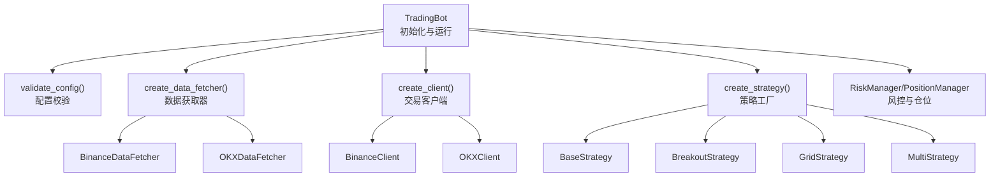
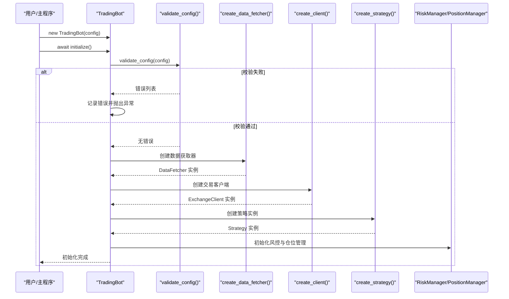
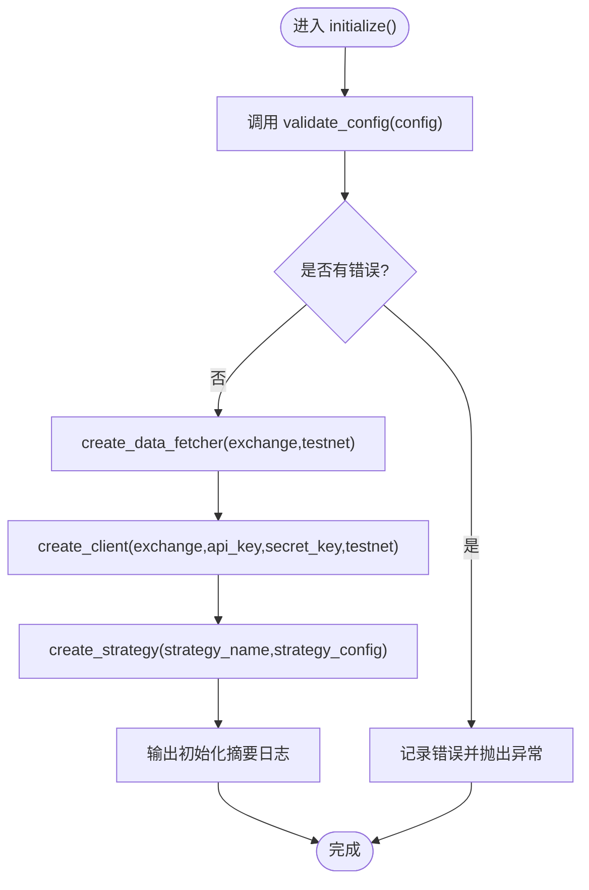
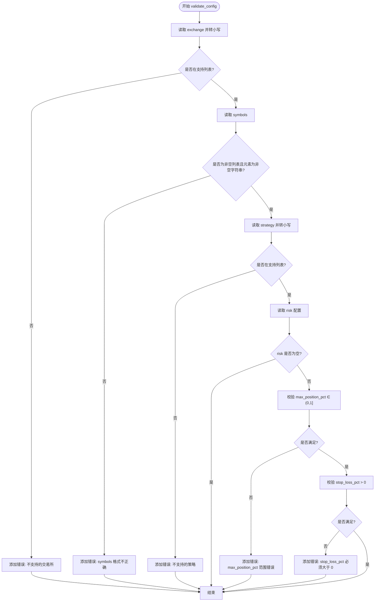
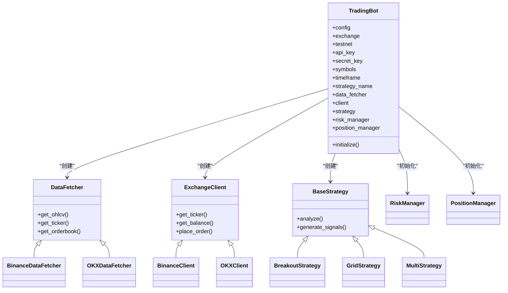
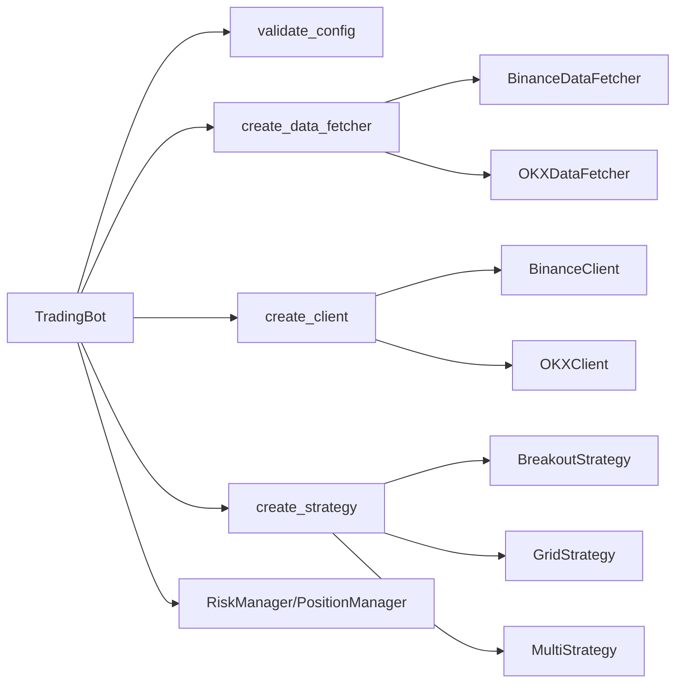

# 机器人初始化

<cite>
**本文引用的文件**
- [src/trading_bot.py](file://src/trading_bot.py)
- [src/utils/config.py](file://src/utils/config.py)
- [src/data/data_fetcher.py](file://src/data/data_fetcher.py)
- [src/execution/exchange_client.py](file://src/execution/exchange_client.py)
- [src/utils/risk_manager.py](file://src/utils/risk_manager.py)
- [src/strategies/factory.py](file://src/strategies/factory.py)
- [src/strategies/base.py](file://src/strategies/base.py)
- [src/strategies/breakout.py](file://src/strategies/breakout.py)
- [src/strategies/grid.py](file://src/strategies/grid.py)
- [src/strategies/multi.py](file://src/strategies/multi.py)
- [configs/config.json](file://configs/config.json)
- [configs/aetherlife.json](file://configs/aetherlife.json)
- [src/aetherlife/config.py](file://src/aetherlife/config.py)
</cite>

## 目录
1. [简介](#简介)
2. [项目结构](#项目结构)
3. [核心组件](#核心组件)
4. [架构总览](#架构总览)
5. [详细组件分析](#详细组件分析)
6. [依赖分析](#依赖分析)
7. [性能考虑](#性能考虑)
8. [故障排查指南](#故障排查指南)
9. [结论](#结论)
10. [附录](#附录)

## 简介
本文档聚焦于交易机器人初始化模块，系统性阐述 TradingBot.__init__() 与 initialize() 的实现细节，覆盖配置参数解析、交易所设置、API 密钥来源、模块依赖注入顺序与关系，并深入解析 validate_config() 的配置验证机制（必填字段、参数范围、冲突检测）。同时给出初始化流程的时序图、组件关系图与关键算法流程图，提供配置示例与参数说明，以及错误处理与异常策略。

## 项目结构
围绕“初始化”主题，涉及以下关键文件与职责：
- 主入口与初始化：src/trading_bot.py
- 配置校验：src/utils/config.py
- 数据获取器工厂与实现：src/data/data_fetcher.py
- 交易客户端工厂与实现：src/execution/exchange_client.py
- 风控与仓位管理：src/utils/risk_manager.py
- 策略工厂与策略实现：src/strategies/factory.py、src/strategies/base.py、具体策略如 src/strategies/breakout.py、src/strategies/grid.py、src/strategies/multi.py
- 配置文件样例：configs/config.json、configs/aetherlife.json
- AetherLife 全局配置：src/aetherlife/config.py

图表来源
- [src/trading_bot.py](file://src/trading_bot.py#L63-L91)
- [src/utils/config.py](file://src/utils/config.py#L15-L37)
- [src/data/data_fetcher.py](file://src/data/data_fetcher.py#L400-L408)
- [src/execution/exchange_client.py](file://src/execution/exchange_client.py#L402-L411)
- [src/strategies/factory.py](file://src/strategies/factory.py#L10-L35)
- [src/utils/risk_manager.py](file://src/utils/risk_manager.py#L12-L52)

章节来源
- [src/trading_bot.py](file://src/trading_bot.py#L30-L91)
- [src/utils/config.py](file://src/utils/config.py#L15-L37)
- [src/data/data_fetcher.py](file://src/data/data_fetcher.py#L400-L408)
- [src/execution/exchange_client.py](file://src/execution/exchange_client.py#L402-L411)
- [src/utils/risk_manager.py](file://src/utils/risk_manager.py#L12-L52)
- [src/strategies/factory.py](file://src/strategies/factory.py#L10-L35)

## 核心组件
- TradingBot.__init__(): 负责从传入配置深拷贝、设置默认字段（交易所、测试网、API密钥、交易对、时间周期、策略名称）、初始化风控与仓位管理器、记录状态字段。
- TradingBot.initialize(): 执行 validate_config() 校验；创建数据获取器、交易客户端、策略实例；打印初始化摘要。
- validate_config(): 校验交易所与策略支持、symbols 类型与非空、risk 参数范围与正数约束。
- 工厂与实现：
  - 数据获取器：create_data_fetcher() → BinanceDataFetcher/OKXDataFetcher
  - 交易客户端：create_client() → BinanceClient/OKXClient
  - 策略工厂：create_strategy() → 多种策略类或 MultiStrategy 组合
- 风控与仓位：RiskManager、PositionManager

章节来源
- [src/trading_bot.py](file://src/trading_bot.py#L30-L91)
- [src/utils/config.py](file://src/utils/config.py#L15-L37)
- [src/data/data_fetcher.py](file://src/data/data_fetcher.py#L400-L408)
- [src/execution/exchange_client.py](file://src/execution/exchange_client.py#L402-L411)
- [src/strategies/factory.py](file://src/strategies/factory.py#L10-L35)
- [src/utils/risk_manager.py](file://src/utils/risk_manager.py#L12-L52)

## 架构总览
初始化阶段的高层交互如下：

图表来源
- [src/trading_bot.py](file://src/trading_bot.py#L63-L91)
- [src/utils/config.py](file://src/utils/config.py#L15-L37)
- [src/data/data_fetcher.py](file://src/data/data_fetcher.py#L400-L408)
- [src/execution/exchange_client.py](file://src/execution/exchange_client.py#L402-L411)
- [src/strategies/factory.py](file://src/strategies/factory.py#L10-L35)
- [src/utils/risk_manager.py](file://src/utils/risk_manager.py#L12-L52)

## 详细组件分析

### TradingBot.__init__() 与 initialize() 实现细节
- 参数解析与默认值
  - 交易所与测试网：从配置读取，未提供时使用默认值。
  - API 密钥：优先使用配置，否则回退至环境变量。
  - 交易对与时间周期：默认单币种与 1 分钟周期。
  - 策略名称：默认突破策略。
  - 风控与仓位：RiskManager 使用 risk 配置，PositionManager 默认初始化。
- initialize() 流程
  - 调用 validate_config() 校验配置，若有错误则记录并抛出异常。
  - create_data_fetcher() 创建数据获取器实例。
  - create_client() 创建交易客户端实例。
  - create_strategy() 创建策略实例。
  - 输出初始化摘要日志。

图表来源
- [src/trading_bot.py](file://src/trading_bot.py#L63-L91)
- [src/utils/config.py](file://src/utils/config.py#L15-L37)
- [src/data/data_fetcher.py](file://src/data/data_fetcher.py#L400-L408)
- [src/execution/exchange_client.py](file://src/execution/exchange_client.py#L402-L411)
- [src/strategies/factory.py](file://src/strategies/factory.py#L10-L35)

章节来源
- [src/trading_bot.py](file://src/trading_bot.py#L30-L91)

### validate_config() 配置验证机制
- 支持的交易所与策略枚举校验
- symbols 字段校验：必须为非空列表，且列表元素为非空字符串
- risk 字段校验：max_position_pct 在 (0,1] 区间；stop_loss_pct 必须大于 0
- 返回错误列表，空列表表示通过

图表来源
- [src/utils/config.py](file://src/utils/config.py#L15-L37)

章节来源
- [src/utils/config.py](file://src/utils/config.py#L15-L37)

### 交易所设置与 API 密钥来源
- 交易所选择：由配置决定，默认 binance；create_data_fetcher()/create_client() 依据该值创建对应实现。
- 测试网开关：testnet 控制使用测试网 URL。
- API 密钥来源：
  - 优先使用配置中的 api_key/secret_key
  - 若配置中未提供，则尝试从环境变量读取（TradingBot.__init__ 中体现）
- 注意：当前 initialize() 未进行 API 密钥格式与可用性测试，建议结合工具模块进行额外校验（参见配置管理器的 API 校验方法）。

章节来源
- [src/trading_bot.py](file://src/trading_bot.py#L35-L41)
- [src/data/data_fetcher.py](file://src/data/data_fetcher.py#L76-L83)
- [src/execution/exchange_client.py](file://src/execution/exchange_client.py#L94-L99)

### 模块依赖注入与创建顺序
- 顺序：数据获取器 → 交易客户端 → 策略实例 → 风控与仓位管理器
- 关键点：
  - 数据获取器与交易客户端均依赖 exchange/testnet
  - 策略实例依赖 strategy_name 与 strategy_config
  - 风控与仓位管理器依赖 risk 配置

图表来源
- [src/trading_bot.py](file://src/trading_bot.py#L63-L91)
- [src/data/data_fetcher.py](file://src/data/data_fetcher.py#L17-L71)
- [src/execution/exchange_client.py](file://src/execution/exchange_client.py#L20-L84)
- [src/strategies/base.py](file://src/strategies/base.py#L6-L31)
- [src/utils/risk_manager.py](file://src/utils/risk_manager.py#L12-L52)

章节来源
- [src/trading_bot.py](file://src/trading_bot.py#L63-L91)
- [src/data/data_fetcher.py](file://src/data/data_fetcher.py#L400-L408)
- [src/execution/exchange_client.py](file://src/execution/exchange_client.py#L402-L411)
- [src/strategies/factory.py](file://src/strategies/factory.py#L10-L35)
- [src/utils/risk_manager.py](file://src/utils/risk_manager.py#L12-L52)

### 策略实例创建与参数传递
- 策略工厂根据 strategy_name 选择具体策略类，并将 strategy_config 传入构造函数。
- MultiStrategy 支持子策略与权重组合，内部递归创建子策略实例。
- 具体策略（如 BreakoutStrategy、GridStrategy）在 analyze/generate_signals 中实现信号生成逻辑。

章节来源
- [src/strategies/factory.py](file://src/strategies/factory.py#L10-L35)
- [src/strategies/breakout.py](file://src/strategies/breakout.py#L6-L79)
- [src/strategies/grid.py](file://src/strategies/grid.py#L5-L63)
- [src/strategies/multi.py](file://src/strategies/multi.py#L6-L38)

### 风控管理器与仓位管理器
- RiskManager
  - 仓位规模计算：基于最大仓位比例、信号强度、价格与余额
  - 止损/止盈检查：按多空方向计算盈亏百分比
  - 熔断与日限：每日回撤阈值、连败次数、交易次数上限
- PositionManager
  - 开仓/平仓、更新浮动盈亏、查询仓位状态

章节来源
- [src/utils/risk_manager.py](file://src/utils/risk_manager.py#L62-L105)
- [src/utils/risk_manager.py](file://src/utils/risk_manager.py#L175-L241)
- [src/utils/risk_manager.py](file://src/utils/risk_manager.py#L244-L339)

## 依赖分析
- 组件耦合
  - TradingBot 依赖配置校验、工厂与实现类，耦合度适中，职责清晰
  - 工厂函数降低模块间直接耦合，便于扩展新策略/数据源/交易所
- 外部依赖
  - aiohttp 用于异步 HTTP/WebSocket
  - pandas 用于 OHLCV 数据处理
- 潜在循环依赖
  - 未发现直接循环导入；工厂与实现分离，避免循环

图表来源
- [src/trading_bot.py](file://src/trading_bot.py#L63-L91)
- [src/utils/config.py](file://src/utils/config.py#L15-L37)
- [src/data/data_fetcher.py](file://src/data/data_fetcher.py#L400-L408)
- [src/execution/exchange_client.py](file://src/execution/exchange_client.py#L402-L411)
- [src/strategies/factory.py](file://src/strategies/factory.py#L10-L35)
- [src/utils/risk_manager.py](file://src/utils/risk_manager.py#L12-L52)

章节来源
- [src/trading_bot.py](file://src/trading_bot.py#L63-L91)
- [src/utils/config.py](file://src/utils/config.py#L15-L37)
- [src/data/data_fetcher.py](file://src/data/data_fetcher.py#L400-L408)
- [src/execution/exchange_client.py](file://src/execution/exchange_client.py#L402-L411)
- [src/strategies/factory.py](file://src/strategies/factory.py#L10-L35)
- [src/utils/risk_manager.py](file://src/utils/risk_manager.py#L12-L52)

## 性能考虑
- 异步 I/O：数据获取与下单均采用异步 HTTP/WebSocket，减少阻塞
- 并行请求：主循环中数据获取与分析并行，提高吞吐
- 精度与步进：下单数量按交易所步进调整，避免无效请求
- 日志与统计：风控统计与日志输出应避免高频写入影响性能

## 故障排查指南
- 配置校验失败
  - 症状：启动即抛出配置错误异常
  - 排查：检查 exchange、symbols、strategy、risk 参数范围
- API 密钥问题
  - 症状：下单或查询账户报错
  - 排查：确认密钥格式与测试网匹配；必要时使用配置管理器进行格式校验
- 交易所不可用
  - 症状：HTTP/WS 请求失败
  - 排查：检查网络与测试网地址；查看交易所返回的错误码
- 策略参数异常
  - 症状：信号列缺失或长度不足
  - 排查：确保 OHLCV 数据足够长以满足策略需求

章节来源
- [src/trading_bot.py](file://src/trading_bot.py#L65-L69)
- [src/utils/config.py](file://src/utils/config.py#L15-L37)
- [src/execution/exchange_client.py](file://src/execution/exchange_client.py#L165-L170)

## 结论
本文档系统梳理了交易机器人初始化模块的实现与验证机制，明确了配置解析、依赖注入顺序与关键组件关系。validate_config() 提供基础参数校验，initialize() 串联数据、交易、策略与风控模块。建议在生产环境中补充 API 密钥格式与可用性测试，并持续完善配置文件与默认值管理。

## 附录

### 配置示例与参数说明
- 基础配置示例（来自配置文件）
  - exchange：交易所名称（binance/okx）
  - testnet：是否使用测试网
  - symbols：交易对列表
  - timeframe：K线时间周期
  - strategy：策略名称（breakout/grid/ma_cross/rsi/volume/multi）
  - leverage：杠杆倍数
  - strategy_config：策略参数（如 lookback_period、threshold、atr_multiplier 等）
  - risk：风控参数（max_position_pct、stop_loss_pct、take_profit_pct、max_daily_loss 等）
  - ai_enhance：AI 增强相关开关（可选）

- AetherLife 全局配置（独立模块）
  - symbol、log_level、cognition.guard.evolution 等字段

章节来源
- [configs/config.json](file://configs/config.json#L1-L28)
- [configs/aetherlife.json](file://configs/aetherlife.json#L1-L17)
- [src/aetherlife/config.py](file://src/aetherlife/config.py#L98-L131)

### API 密钥格式与来源
- 密钥来源优先级：配置文件 > 环境变量
- 格式要求：当前校验要求长度至少 20 字符
- 建议：结合配置管理器进行更严格的格式与可用性测试

章节来源
- [src/trading_bot.py](file://src/trading_bot.py#L35-L41)
- [src/utils/config_manager.py](file://src/utils/config_manager.py#L146-L160)