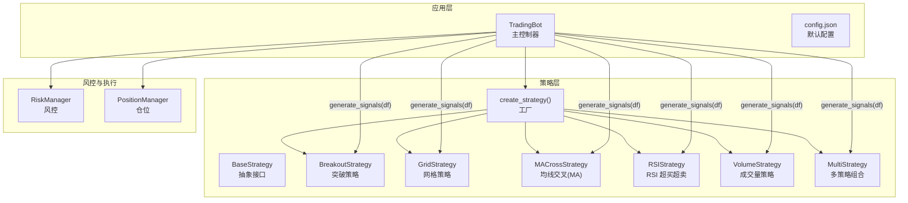
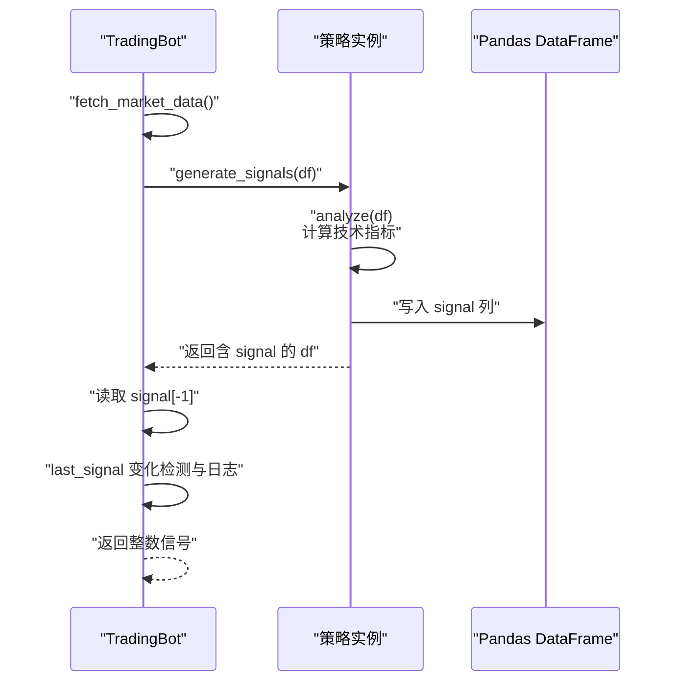
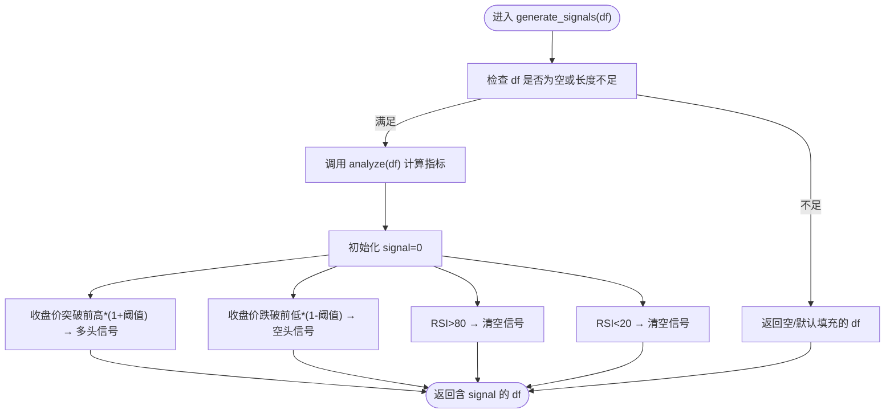
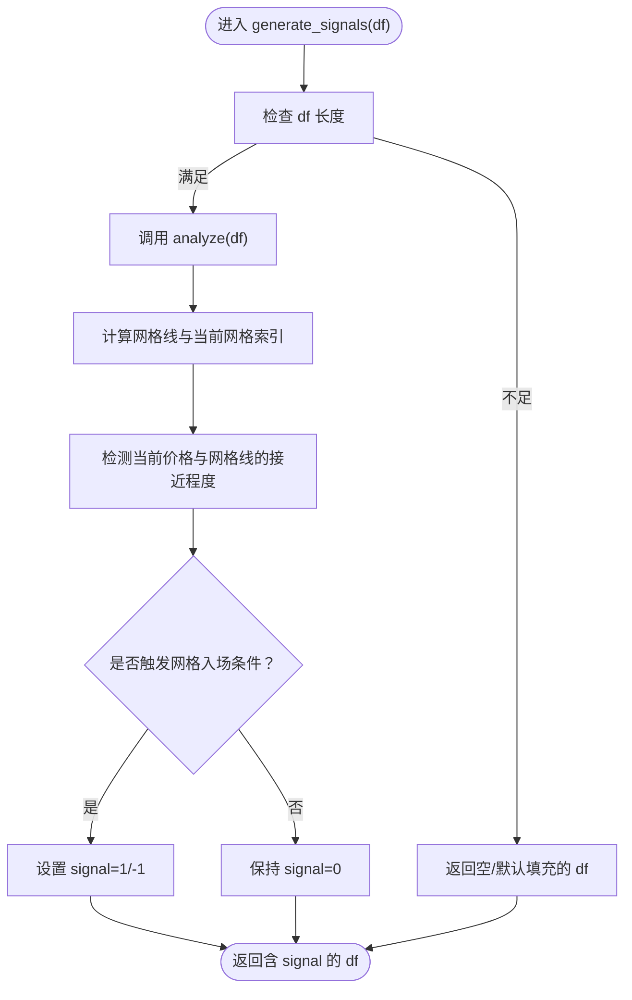
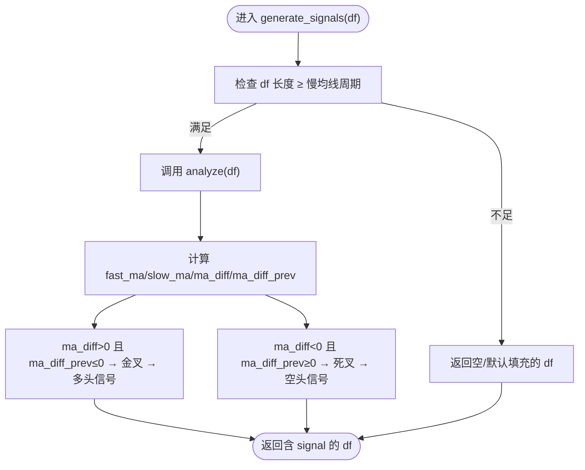
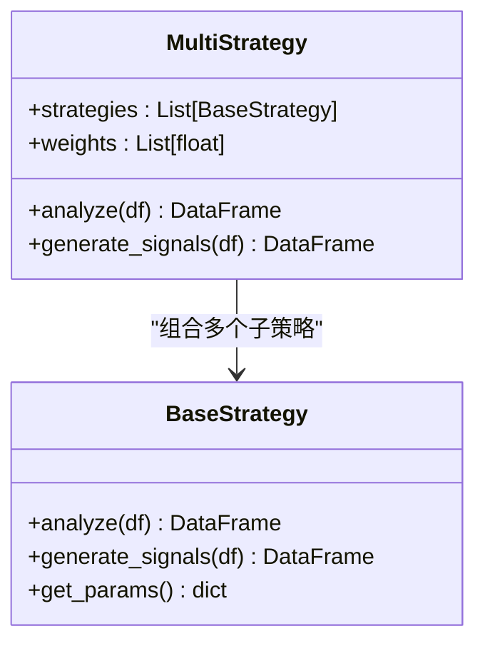
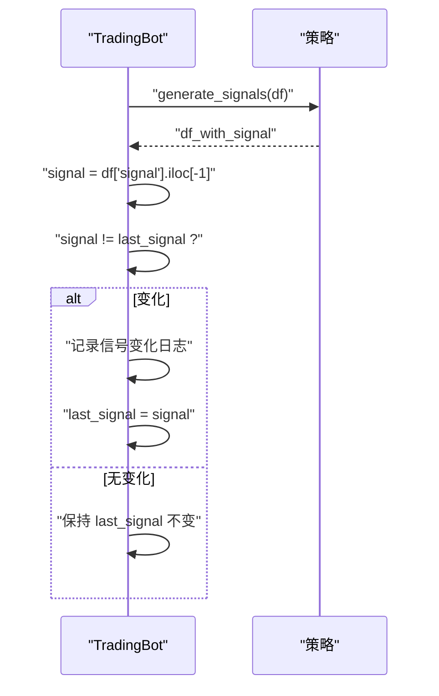
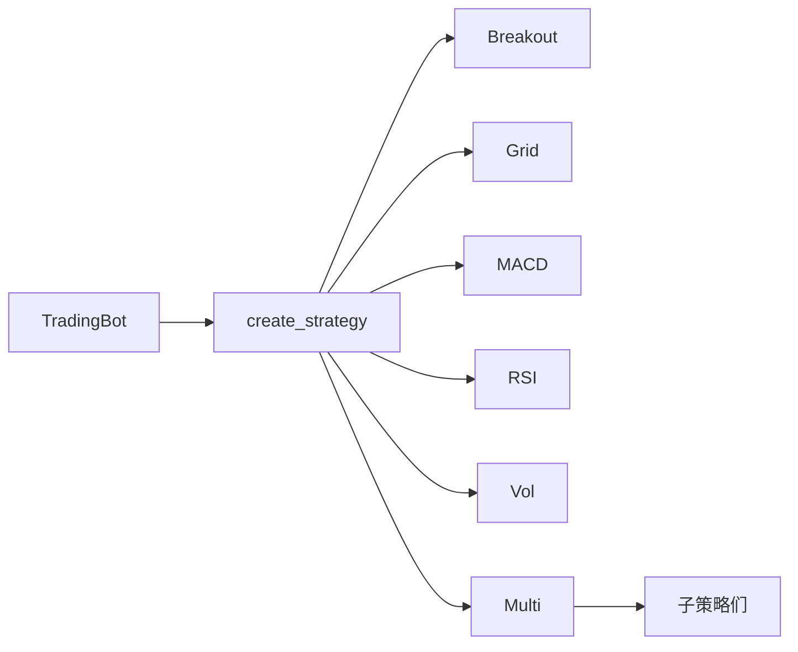

# 策略分析

<cite>
**本文引用的文件**
- [src/strategies/base.py](file://src/strategies/base.py)
- [src/strategies/breakout.py](file://src/strategies/breakout.py)
- [src/strategies/grid.py](file://src/strategies/grid.py)
- [src/strategies/macd.py](file://src/strategies/macd.py)
- [src/strategies/rsi.py](file://src/strategies/rsi.py)
- [src/strategies/volume.py](file://src/strategies/volume.py)
- [src/strategies/multi.py](file://src/strategies/multi.py)
- [src/strategies/factory.py](file://src/strategies/factory.py)
- [src/trading_bot.py](file://src/trading_bot.py)
- [configs/config.json](file://configs/config.json)
- [tests/test_strategies.py](file://tests/test_strategies.py)
- [src/utils/risk_manager.py](file://src/utils/risk_manager.py)
- [src/utils/logger.py](file://src/utils/logger.py)
</cite>

## 目录
1. [引言](#引言)
2. [项目结构](#项目结构)
3. [核心组件](#核心组件)
4. [架构总览](#架构总览)
5. [详细组件分析](#详细组件分析)
6. [依赖关系分析](#依赖关系分析)
7. [性能考虑](#性能考虑)
8. [故障排查指南](#故障排查指南)
9. [结论](#结论)
10. [附录](#附录)

## 引言
本文件面向“策略分析模块”的技术文档，聚焦于以下目标：
- 深入解释 analyze() 方法的实现逻辑，涵盖数据验证、技术指标计算与信号生成前的数据准备。
- 详解 generate_signals() 的工作原理，包括信号规则判断与信号序列生成。
- 解释信号状态变更检测机制，包括 last_signal 变量的作用与信号变化的日志记录。
- 提供多种策略（突破、网格、MACD、RSI、成交量）的信号生成逻辑示例。
- 文档化信号分析过程中的数据预处理、异常处理与性能优化策略。
- 说明信号输出格式与后续处理流程（风控与执行）。

## 项目结构
策略分析模块位于 src/strategies 目录下，采用“策略基类 + 多个具体策略实现 + 工厂模式 + 组合策略”的分层设计。TradingBot 作为顶层控制器，负责拉取数据、调用策略生成信号，并通过风控与执行模块完成下单与风控检查。

图表来源
- [src/strategies/base.py](file://src/strategies/base.py#L6-L31)
- [src/strategies/breakout.py](file://src/strategies/breakout.py#L6-L79)
- [src/strategies/grid.py](file://src/strategies/grid.py#L5-L63)
- [src/strategies/macd.py](file://src/strategies/macd.py#L5-L40)
- [src/strategies/rsi.py](file://src/strategies/rsi.py#L6-L42)
- [src/strategies/volume.py](file://src/strategies/volume.py#L6-L44)
- [src/strategies/multi.py](file://src/strategies/multi.py#L6-L38)
- [src/strategies/factory.py](file://src/strategies/factory.py#L10-L36)
- [src/trading_bot.py](file://src/trading_bot.py#L27-L114)
- [configs/config.json](file://configs/config.json#L1-L28)

章节来源
- [src/strategies/base.py](file://src/strategies/base.py#L6-L31)
- [src/strategies/factory.py](file://src/strategies/factory.py#L10-L36)
- [src/trading_bot.py](file://src/trading_bot.py#L27-L114)
- [configs/config.json](file://configs/config.json#L1-L28)

## 核心组件
- BaseStrategy 抽象基类：定义 analyze() 与 generate_signals() 接口，提供参数导出与信号验证钩子。
- 具体策略：Breakout、Grid、MACross、RSI、Volume 等，各自在 analyze() 中计算所需技术指标，在 generate_signals() 中根据规则生成信号列。
- MultiStrategy：对多个子策略进行串联分析与信号聚合，最终输出归一化后的信号。
- TradingBot：在每次循环中拉取 OHLCV 数据，调用策略生成信号，检测 last_signal 变化并记录日志，随后进入风控与执行阶段。

章节来源
- [src/strategies/base.py](file://src/strategies/base.py#L6-L31)
- [src/strategies/multi.py](file://src/strategies/multi.py#L6-L38)
- [src/trading_bot.py](file://src/trading_bot.py#L101-L114)

## 架构总览
策略分析在 TradingBot 的 analyze() 中完成，其关键流程如下：

图表来源
- [src/trading_bot.py](file://src/trading_bot.py#L101-L114)
- [src/strategies/base.py](file://src/strategies/base.py#L14-L22)
- [src/strategies/breakout.py](file://src/strategies/breakout.py#L64-L79)
- [src/strategies/grid.py](file://src/strategies/grid.py#L42-L63)
- [src/strategies/macd.py](file://src/strategies/macd.py#L29-L40)
- [src/strategies/rsi.py](file://src/strategies/rsi.py#L31-L42)
- [src/strategies/volume.py](file://src/strategies/volume.py#L33-L44)

## 详细组件分析

### BaseStrategy 抽象基类
- 职责：定义策略统一接口 analyze() 与 generate_signals()；提供参数导出 get_params() 与信号验证 validate_signal() 钩子。
- 设计要点：通过抽象方法强制子类实现分析与信号生成；默认 validate_signal 返回 True，可由子类覆盖。

章节来源
- [src/strategies/base.py](file://src/strategies/base.py#L6-L31)

### BreakoutStrategy（突破策略）
- analyze() 实现要点
  - 计算移动平均线（短/长）、布林带上下轨、ATR、MACD 与 RSI 等指标，为信号生成提供多因子支持。
  - 使用滚动窗口与指数加权移动平均，确保时序一致性。
- generate_signals() 实现要点
  - 对输入长度进行保护性校验，不足时直接返回空 DataFrame 或填充默认信号列。
  - 基于最高/最低价格突破与阈值生成多空信号；同时结合 RSI 超买/超卖过滤，避免震荡市中的噪声信号。
  - 通过 loc 条件赋值一次性生成信号序列，避免显式循环。
- 参数与配置
  - lookback_period、threshold、atr_multiplier 等参数通过构造函数注入，并通过 get_params() 导出。

图表来源
- [src/strategies/breakout.py](file://src/strategies/breakout.py#L21-L62)
- [src/strategies/breakout.py](file://src/strategies/breakout.py#L64-L79)

章节来源
- [src/strategies/breakout.py](file://src/strategies/breakout.py#L6-L79)

### GridStrategy（网格策略）
- analyze() 实现要点
  - 若未设置 base_price，则使用最新收盘价作为基准。
  - 生成网格上下边界与网格线集合，并为每根 K 线计算当前处于第几条网格线上。
- generate_signals() 实现要点
  - 基于当前价格与网格线的相对位置判断方向，生成多/空信号；通过比较当前网格索引与价格接近度决定入场方向。
  - 对空价格网格进行跳过，避免无效计算。

图表来源
- [src/strategies/grid.py](file://src/strategies/grid.py#L20-L40)
- [src/strategies/grid.py](file://src/strategies/grid.py#L42-L63)

章节来源
- [src/strategies/grid.py](file://src/strategies/grid.py#L5-L63)

### MACrossStrategy（均线交叉策略）
- analyze() 实现要点
  - 计算快慢均线与差值序列，以及差值的前一时刻序列，用于识别零轴穿越。
- generate_signals() 实现要点
  - 严格校验数据长度，不足时返回默认填充。
  - 通过 ma_diff 与 ma_diff_prev 的符号变化判断金叉/死叉，生成多/空信号。

图表来源
- [src/strategies/macd.py](file://src/strategies/macd.py#L18-L27)
- [src/strategies/macd.py](file://src/strategies/macd.py#L29-L40)

章节来源
- [src/strategies/macd.py](file://src/strategies/macd.py#L5-L40)

### RSIStrategy（RSI 超买超卖策略）
- analyze() 实现要点
  - 计算 RSI 指标，注意对零损失进行安全替换，避免除零。
- generate_signals() 实现要点
  - 基于 oversold 与 overbought 阈值生成多/空信号；阈值可配置。

章节来源
- [src/strategies/rsi.py](file://src/strategies/rsi.py#L6-L42)

### VolumeStrategy（成交量策略）
- analyze() 实现要点
  - 计算成交量均线与放量比率，同时计算价格变化幅度，为信号生成提供量价配合依据。
- generate_signals() 实现要点
  - 在成交量显著放大且价格同向变动时生成信号，避免噪音。

章节来源
- [src/strategies/volume.py](file://src/strategies/volume.py#L6-L44)

### MultiStrategy（多策略组合）
- analyze() 实现要点
  - 依次对子策略执行 analyze()，使每个子策略都能基于完整数据集生成指标。
- generate_signals() 实现要点
  - 为每个子策略生成 signal_i 列，按权重加权求和，再将连续信号映射到离散的 -1/0/1。
  - 支持自定义权重或均权。

图表来源
- [src/strategies/multi.py](file://src/strategies/multi.py#L6-L38)
- [src/strategies/base.py](file://src/strategies/base.py#L6-L31)

章节来源
- [src/strategies/multi.py](file://src/strategies/multi.py#L6-L38)

### 策略工厂 create_strategy()
- 功能：根据策略类型字符串创建对应策略实例；当类型为 multi 时，解析子策略列表与权重，构建 MultiStrategy。
- 错误处理：未知类型抛出异常，提示策略类型非法。

章节来源
- [src/strategies/factory.py](file://src/strategies/factory.py#L10-L36)

### TradingBot 中的信号状态跟踪与日志
- last_signal 字段：记录上一次信号值，用于检测信号变化。
- analyze() 流程：
  - 校验数据有效性与长度；
  - 调用策略 generate_signals()；
  - 从最后一根 K 线提取整数信号；
  - 比较 last_signal 与新信号，若不同则记录日志并更新 last_signal。
- 该机制确保仅在信号发生实际变化时输出日志，降低冗余。

图表来源
- [src/trading_bot.py](file://src/trading_bot.py#L101-L114)

章节来源
- [src/trading_bot.py](file://src/trading_bot.py#L60-L62)
- [src/trading_bot.py](file://src/trading_bot.py#L101-L114)

## 依赖关系分析
- 策略层内部依赖：各策略继承 BaseStrategy，遵循统一接口；MultiStrategy 组合多个子策略。
- 应用层依赖：TradingBot 通过工厂创建策略实例，并在主循环中调用 generate_signals()。
- 配置依赖：策略参数来自 config.json 与策略配置字典；TradingBot 读取默认配置并合并用户配置。

图表来源
- [src/strategies/factory.py](file://src/strategies/factory.py#L10-L36)
- [src/trading_bot.py](file://src/trading_bot.py#L83-L85)

章节来源
- [src/strategies/factory.py](file://src/strategies/factory.py#L10-L36)
- [src/trading_bot.py](file://src/trading_bot.py#L83-L85)

## 性能考虑
- 向量化优先：所有策略均使用 Pandas 的 rolling、ewm、loc 条件赋值等向量化操作，避免 Python 循环，提升吞吐。
- 数据长度保护：在 generate_signals() 中对输入长度进行快速校验，避免不必要的计算。
- 指标复用：MultiStrategy 在 analyze() 阶段对子策略逐个执行，减少重复计算。
- 日志与异常：统一日志器与异常捕获，保证运行稳定性与可观测性。

章节来源
- [src/strategies/breakout.py](file://src/strategies/breakout.py#L64-L79)
- [src/strategies/grid.py](file://src/strategies/grid.py#L42-L63)
- [src/strategies/macd.py](file://src/strategies/macd.py#L29-L40)
- [src/strategies/rsi.py](file://src/strategies/rsi.py#L31-L42)
- [src/strategies/volume.py](file://src/strategies/volume.py#L33-L44)
- [src/strategies/multi.py](file://src/strategies/multi.py#L16-L20)
- [src/utils/logger.py](file://src/utils/logger.py#L12-L34)

## 故障排查指南
- 策略单元测试
  - 测试用例覆盖 analyze() 输出列存在性、generate_signals() 输出范围与空 DataFrame 场景。
- 常见问题定位
  - 空 DataFrame：generate_signals() 对空表直接返回，确认上游数据拉取是否成功。
  - 信号全为 0：检查阈值、周期参数是否合理，或 RSI 过滤是否过于严格。
  - last_signal 未变化：确认信号列是否正确写入，或 compare 逻辑是否被外部修改。
- 日志与异常
  - 使用 get_logger() 获取统一日志器，异常路径通过异常栈打印，便于定位。

章节来源
- [tests/test_strategies.py](file://tests/test_strategies.py#L13-L59)
- [src/utils/logger.py](file://src/utils/logger.py#L12-L34)

## 结论
策略分析模块通过统一的基类接口与工厂模式，实现了多策略的灵活扩展与组合。各策略在 analyze() 中完成指标计算，在 generate_signals() 中完成信号规则判断，最终由 TradingBot 完成信号状态跟踪与日志记录。整体设计具备良好的可维护性与性能表现，适合在高频交易场景中稳定运行。

## 附录

### 信号输出格式与后续处理
- 输出格式：generate_signals() 返回包含 signal 列的 DataFrame，TradingBot 读取最后一根 K 线的整数值作为信号。
- 后续处理：TradingBot 将信号传递给风控模块（RiskManager）与仓位管理（PositionManager），在满足风控条件下执行下单与止盈止损检查。

章节来源
- [src/trading_bot.py](file://src/trading_bot.py#L101-L114)
- [src/utils/risk_manager.py](file://src/utils/risk_manager.py#L12-L242)

### 配置参考
- 默认配置示例：包含交易所、策略类型、时间周期、杠杆、策略参数与风控参数等。

章节来源
- [configs/config.json](file://configs/config.json#L1-L28)