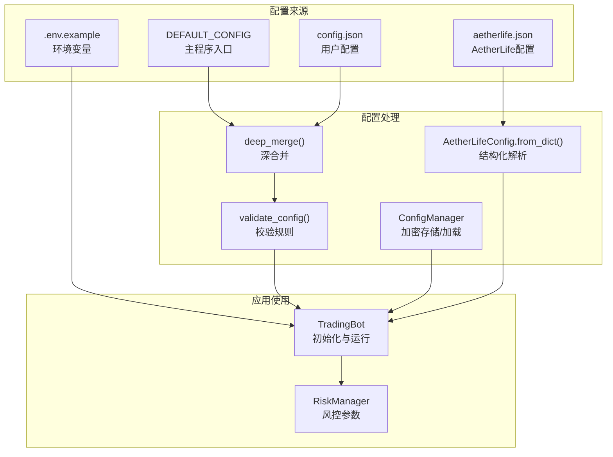
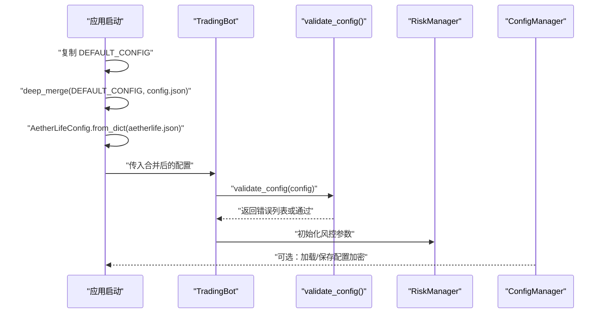
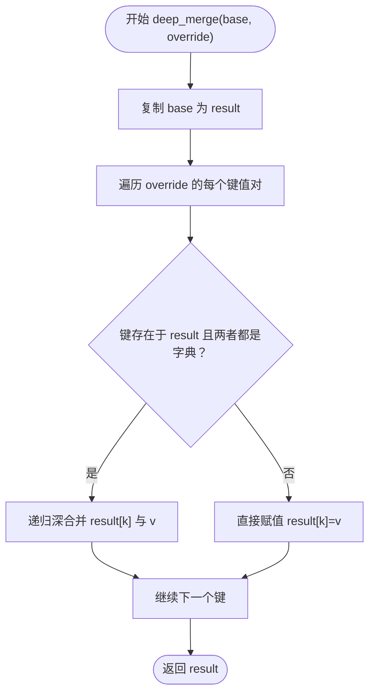
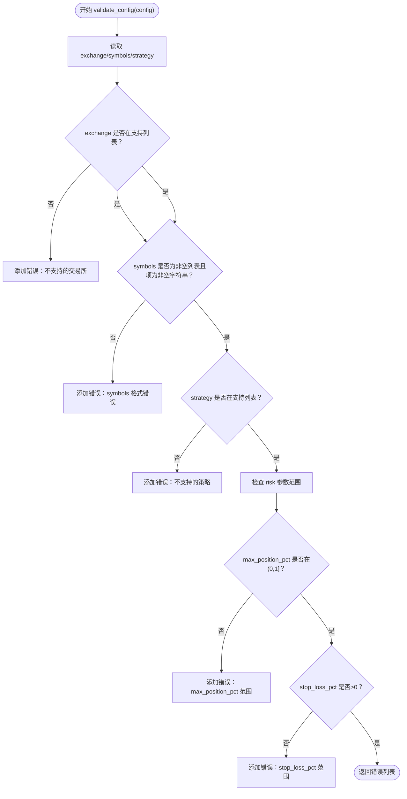
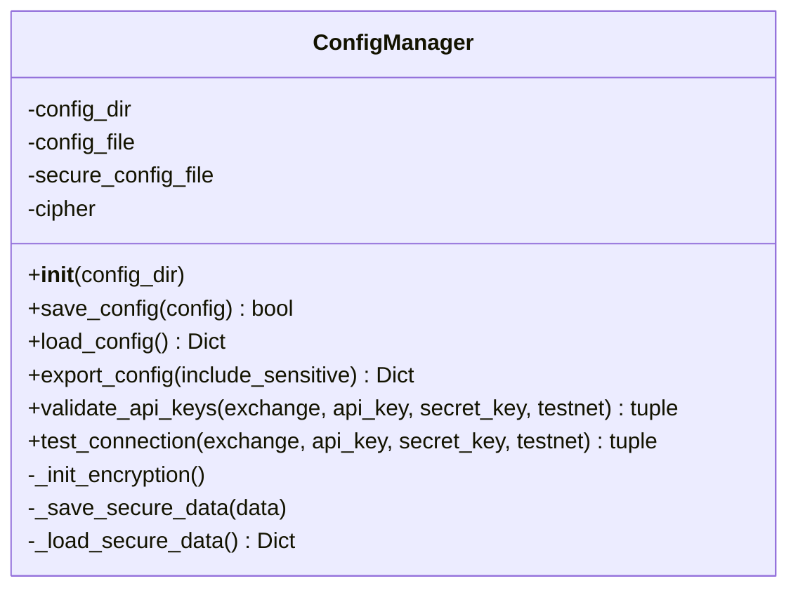
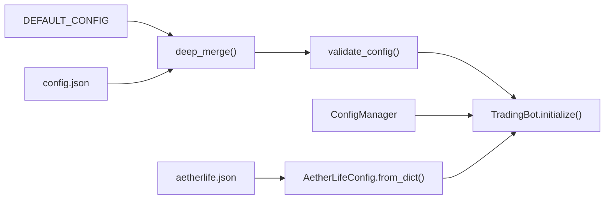

# 配置管理

<cite>
**本文引用的文件**
- [src/utils/config_manager.py](file://src/utils/config_manager.py)
- [src/utils/config.py](file://src/utils/config.py)
- [src/trading_bot.py](file://src/trading_bot.py)
- [src/utils/risk_manager.py](file://src/utils/risk_manager.py)
- [src/aetherlife/config.py](file://src/aetherlife/config.py)
- [configs/config.json](file://configs/config.json)
- [configs/aetherlife.json](file://configs/aetherlife.json)
- [.env.example](file://.env.example)
- [docs/交易所配置.md](file://docs/交易所配置.md)
</cite>

## 目录
1. [简介](#简介)
2. [项目结构](#项目结构)
3. [核心组件](#核心组件)
4. [架构总览](#架构总览)
5. [详细组件分析](#详细组件分析)
6. [依赖关系分析](#依赖关系分析)
7. [性能考量](#性能考量)
8. [故障排查指南](#故障排查指南)
9. [结论](#结论)
10. [附录](#附录)

## 简介
本文件面向配置管理模块，系统性阐述以下主题：
- DEFAULT_CONFIG 的结构与参数含义（交易所配置、策略参数、风控设置、运行参数）
- 配置文件合并机制（deep_merge 函数的实现与优先级规则）
- 配置验证流程（validate_config 的检查规则与错误处理）
- 配置热更新、环境变量支持与配置文件格式规范
- 配置最佳实践与常见错误排查

## 项目结构
配置相关的关键位置与职责如下：
- 配置定义与默认值：DEFAULT_CONFIG 位于主程序入口，提供基础运行参数与风控参数的默认值
- 配置校验：validate_config 在工具模块中提供统一的校验规则
- 配置合并：deep_merge 实现深合并，保证嵌套字典逐层覆盖
- 配置持久化与安全：ConfigManager 负责普通配置与敏感信息的分离存储与加密
- AetherLife 配置：AetherLifeConfig 提供多层架构的结构化配置模型
- 示例配置：configs 目录下的 config.json 与 aetherlife.json 作为用户配置样例
- 环境变量：.env.example 展示如何通过环境变量注入 API Key

图表来源
- [src/trading_bot.py](file://src/trading_bot.py#L299-L320)
- [src/utils/config.py](file://src/utils/config.py#L15-L48)
- [src/utils/config_manager.py](file://src/utils/config_manager.py#L48-L116)
- [src/aetherlife/config.py](file://src/aetherlife/config.py#L97-L131)
- [configs/config.json](file://configs/config.json#L1-L28)
- [configs/aetherlife.json](file://configs/aetherlife.json#L1-L17)

章节来源
- [src/trading_bot.py](file://src/trading_bot.py#L299-L320)
- [src/utils/config.py](file://src/utils/config.py#L15-L48)
- [src/utils/config_manager.py](file://src/utils/config_manager.py#L48-L116)
- [src/aetherlife/config.py](file://src/aetherlife/config.py#L97-L131)
- [configs/config.json](file://configs/config.json#L1-L28)
- [configs/aetherlife.json](file://configs/aetherlife.json#L1-L17)
- [.env.example](file://.env.example#L1-L17)

## 核心组件
- DEFAULT_CONFIG：主程序入口处定义的基础配置，默认包含交易所、测试网、策略、交易对、时间周期、杠杆、循环间隔以及风控与策略参数的默认值
- validate_config：对配置进行合法性校验，包括交易所支持性、交易对列表有效性、策略支持性、风控参数范围等
- deep_merge：递归合并两个字典，override 中的键会覆盖 base 中同名键，且对嵌套字典进行深合并
- ConfigManager：负责配置文件的保存与加载，支持敏感信息加密存储与普通配置分离
- AetherLifeConfig：面向 AetherLife 架构的分层配置模型，支持从字典加载并兼容 config.json

章节来源
- [src/trading_bot.py](file://src/trading_bot.py#L299-L320)
- [src/utils/config.py](file://src/utils/config.py#L15-L48)
- [src/utils/config_manager.py](file://src/utils/config_manager.py#L48-L116)
- [src/aetherlife/config.py](file://src/aetherlife/config.py#L97-L131)

## 架构总览
配置在系统中的流转路径如下：
- 应用启动时，先复制 DEFAULT_CONFIG 为基础配置
- 若存在用户配置文件（config.json），则使用 deep_merge 将其与 DEFAULT_CONFIG 合并
- 同时加载 AetherLife 配置（aetherlife.json），并通过 AetherLifeConfig.from_dict 解析
- 在 TradingBot 初始化阶段，调用 validate_config 对最终配置进行校验
- 风控参数由 RiskManager 从配置中提取并生效

图表来源
- [src/trading_bot.py](file://src/trading_bot.py#L330-L341)
- [src/utils/config.py](file://src/utils/config.py#L15-L37)
- [src/utils/config_manager.py](file://src/utils/config_manager.py#L82-L116)
- [src/aetherlife/config.py](file://src/aetherlife/config.py#L112-L131)

## 详细组件分析

### DEFAULT_CONFIG 结构与参数说明
- 基础运行参数
  - exchange：交易所名称，默认 binance
  - testnet：是否使用测试网，默认 True
  - strategy：策略名称，默认 breakout
  - symbols：交易对列表，默认 ["BTCUSDT"]
  - timeframe：K线时间周期，默认 "1m"
  - leverage：杠杆倍数，默认 10
  - loop_interval：主循环间隔（秒），默认 5
- 风控参数（risk）
  - max_position_pct：最大单笔仓位占可用资金比例，默认 0.1
  - stop_loss_pct：止损比例，默认 0.02
  - take_profit_pct：止盈比例，默认 0.05
  - max_daily_trades：单日最大交易次数，默认 20
  - max_consecutive_losses：最大连续亏损次数，默认 5
  - circuit_breaker_loss_pct：熔断触发的单日最大亏损比例，默认 0.2
- 策略参数（strategy_config）
  - lookback_period：回看周期，默认 20
  - threshold：阈值，默认 0.005

章节来源
- [src/trading_bot.py](file://src/trading_bot.py#L299-L320)

### 配置文件合并机制：deep_merge()
- 实现要点
  - 创建 base 的浅拷贝作为结果容器
  - 遍历 override 的键值对
  - 若键存在于结果且两者均为字典，则递归深合并；否则直接覆盖
- 优先级规则
  - override 的键值优先于 base
  - 对嵌套字典采用逐层覆盖，避免整块替换
- 使用场景
  - 将用户配置文件（如 config.json）与 DEFAULT_CONFIG 合并，以用户配置为准

图表来源
- [src/utils/config.py](file://src/utils/config.py#L40-L48)

章节来源
- [src/utils/config.py](file://src/utils/config.py#L40-L48)

### 配置验证流程：validate_config()
- 支持的交易所与策略
  - 交易所：binance、okx
  - 策略：breakout、grid、ma_cross、rsi、volume
- 校验规则
  - exchange：必须在支持列表内
  - symbols：必须为非空列表，且每项为非空字符串
  - strategy：必须在支持列表内
  - risk.max_position_pct：若存在，必须在 (0, 1] 区间
  - risk.stop_loss_pct：若存在，必须大于 0
- 错误处理
  - 返回错误信息列表；为空表示通过
  - TradingBot 初始化阶段会打印错误并抛出异常

图表来源
- [src/utils/config.py](file://src/utils/config.py#L15-L37)

章节来源
- [src/utils/config.py](file://src/utils/config.py#L15-L37)
- [src/trading_bot.py](file://src/trading_bot.py#L65-L69)

### 配置持久化与安全：ConfigManager
- 功能
  - 分离敏感字段（如 api_key、secret_key、passphrase）与普通配置
  - 普通配置明文保存到 config.json
  - 敏感信息使用对称加密（Fernet）保存到 secure.enc
  - 自动管理密钥文件（.key）的生成与权限
- 加载流程
  - 先加载普通配置，再解密加载敏感信息并合并
- API 关键点
  - save_config：保存配置并分离敏感信息
  - load_config：合并普通与敏感配置
  - export_config：导出配置（可选择移除敏感信息）
  - validate_api_keys：对 API Key 格式进行基础校验
  - test_connection：预留连接测试（当前返回格式验证通过）

图表来源
- [src/utils/config_manager.py](file://src/utils/config_manager.py#L14-L116)

章节来源
- [src/utils/config_manager.py](file://src/utils/config_manager.py#L48-L116)

### AetherLife 配置模型：AetherLifeConfig
- 分层配置
  - DataFabricConfig：多源数据（WebSocket 交易所、刷新间隔、新闻/社交流）
  - MemoryConfig：内存与向量存储（Redis URL、上下文长度、向量记忆、事件保留）
  - CognitionConfig：认知层（编排器类型、Worker Agent 列表、辩论、并行分析数）
  - DecisionConfig：决策层（决策模式、严格 Schema、快速路径）
  - ExecutionConfig：执行层（引擎、交易所、测试网）
  - GuardConfig：守护层（人工在环、熔断、审计日志）
  - EvolutionConfig：进化层（每日进化时间、策略变体数量、部署阈值、代码生成）
- 加载方式
  - from_dict：从字典加载，兼容 config.json 的嵌套结构

章节来源
- [src/aetherlife/config.py](file://src/aetherlife/config.py#L97-L131)

### 示例配置与模板
- 通用配置模板（config.json）
  - 包含 exchange、testnet、symbols、timeframe、strategy、leverage、strategy_config、risk、ai_enhance 等字段
- AetherLife 配置模板（aetherlife.json）
  - 包含 symbol、log_level、cognition.guard.evolution 等子配置
- 交易所配置与环境变量
  - 支持 Binance、OKX、Bybit 等交易所
  - 通过 .env.example 展示如何设置 API Key 环境变量

章节来源
- [configs/config.json](file://configs/config.json#L1-L28)
- [configs/aetherlife.json](file://configs/aetherlife.json#L1-L17)
- [.env.example](file://.env.example#L1-L17)
- [docs/交易所配置.md](file://docs/交易所配置.md#L1-L32)

### 配置热更新与运行参数
- 热更新现状
  - 主程序通过启动时一次性加载并合并配置，未内置运行时热更新逻辑
- 运行参数
  - loop_interval：主循环间隔（秒）
  - leverage：杠杆倍数
  - timeframe：K线时间周期
  - symbols：交易对列表
  - strategy_config：策略参数（如 lookback_period、threshold）

章节来源
- [src/trading_bot.py](file://src/trading_bot.py#L256-L282)
- [src/trading_bot.py](file://src/trading_bot.py#L306-L319)

## 依赖关系分析
- DEFAULT_CONFIG 与 validate_config 的耦合
  - TradingBot 初始化前调用 validate_config，确保配置合法
- deep_merge 与 DEFAULT_CONFIG 的耦合
  - 用户配置仅覆盖 DEFAULT_CONFIG 中存在的键，未声明的键保持默认
- ConfigManager 与 TradingBot 的耦合
  - 可用于保存/加载配置（含敏感信息），但主程序当前通过文件与环境变量加载
- AetherLifeConfig 与 TradingBot 的耦合
  - 通过 from_dict 兼容 config.json 的嵌套结构，便于扩展

图表来源
- [src/trading_bot.py](file://src/trading_bot.py#L330-L341)
- [src/utils/config.py](file://src/utils/config.py#L15-L48)
- [src/utils/config_manager.py](file://src/utils/config_manager.py#L82-L116)
- [src/aetherlife/config.py](file://src/aetherlife/config.py#L112-L131)

章节来源
- [src/trading_bot.py](file://src/trading_bot.py#L330-L341)
- [src/utils/config.py](file://src/utils/config.py#L15-L48)
- [src/utils/config_manager.py](file://src/utils/config_manager.py#L82-L116)
- [src/aetherlife/config.py](file://src/aetherlife/config.py#L112-L131)

## 性能考量
- 合并与校验复杂度
  - deep_merge 的时间复杂度近似 O(N)，N 为 override 字典的键数量
  - validate_config 的时间复杂度近似 O(M)，M 为配置中需要检查的字段数量
- 风控参数对运行时的影响
  - 风控参数在 RiskManager 初始化时一次性读取，运行时不会频繁访问配置
- 建议
  - 将用户配置文件尽量精简，减少不必要的嵌套层级
  - 在高频循环中避免重复读取配置文件，建议在初始化阶段完成合并与校验

[本节为通用性能讨论，无需特定文件来源]

## 故障排查指南
- 常见错误与定位
  - 交易所不支持：检查 exchange 是否在支持列表
  - symbols 格式错误：确保为非空字符串列表
  - 策略不支持：检查 strategy 是否在支持列表
  - 风控参数越界：max_position_pct 应在 (0,1]，stop_loss_pct 应 > 0
- 配置加载问题
  - 确认 config.json 存在且 JSON 格式正确
  - 确认 aetherlife.json 存在且结构与 AetherLifeConfig 兼容
  - 确认 .env 文件已复制为 .env 并正确设置 API Key
- 安全与权限
  - secure.enc 与 .key 文件权限应为只读
  - 避免将敏感信息提交至版本库
- API Key 校验
  - validate_api_keys 对 Key 长度与非空进行基础校验
  - test_connection 为预留功能，当前返回格式验证通过

章节来源
- [src/utils/config.py](file://src/utils/config.py#L15-L37)
- [src/utils/config_manager.py](file://src/utils/config_manager.py#L146-L160)
- [src/utils/config_manager.py](file://src/utils/config_manager.py#L195-L211)
- [docs/交易所配置.md](file://docs/交易所配置.md#L16-L31)

## 结论
本配置管理模块通过 DEFAULT_CONFIG、deep_merge、validate_config、ConfigManager 与 AetherLifeConfig 形成完整的配置体系：
- 明确的默认值与严格的校验规则保障系统稳定性
- 深合并机制使用户配置具备高灵活性
- 加密存储与环境变量支持提升安全性与可移植性
- 建议在后续版本中引入配置热更新与更丰富的运行时参数动态调整能力

[本节为总结性内容，无需特定文件来源]

## 附录

### 配置参数对照表（重点字段）
- 交易所与运行
  - exchange：支持的交易所名称
  - testnet：是否使用测试网
  - symbols：交易对列表
  - timeframe：K线时间周期
  - leverage：杠杆倍数
  - loop_interval：主循环间隔（秒）
- 策略参数
  - strategy：策略名称
  - strategy_config.lookback_period：回看周期
  - strategy_config.threshold：阈值
- 风控参数
  - risk.max_position_pct：最大单笔仓位占比
  - risk.stop_loss_pct：止损比例
  - risk.take_profit_pct：止盈比例
  - risk.max_daily_trades：单日最大交易次数
  - risk.max_consecutive_losses：最大连续亏损次数
  - risk.circuit_breaker_loss_pct：熔断触发的单日最大亏损比例

章节来源
- [src/trading_bot.py](file://src/trading_bot.py#L299-L320)
- [src/utils/risk_manager.py](file://src/utils/risk_manager.py#L15-L51)

### 配置文件格式规范
- config.json
  - 必填：exchange、testnet、symbols、timeframe、strategy、leverage
  - 可选：strategy_config、risk、ai_enhance
- aetherlife.json
  - 可选：symbol、log_level、cognition.guard.evolution 等子配置
- 环境变量
  - BINANCE_API_KEY、BINANCE_SECRET_KEY、OKX_API_KEY、OKX_SECRET_KEY、OKX_PASSPHRASE、BYBIT_API_KEY、BYBIT_SECRET_KEY

章节来源
- [configs/config.json](file://configs/config.json#L1-L28)
- [configs/aetherlife.json](file://configs/aetherlife.json#L1-L17)
- [.env.example](file://.env.example#L1-L17)
- [docs/交易所配置.md](file://docs/交易所配置.md#L16-L25)