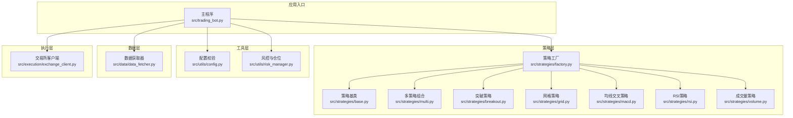
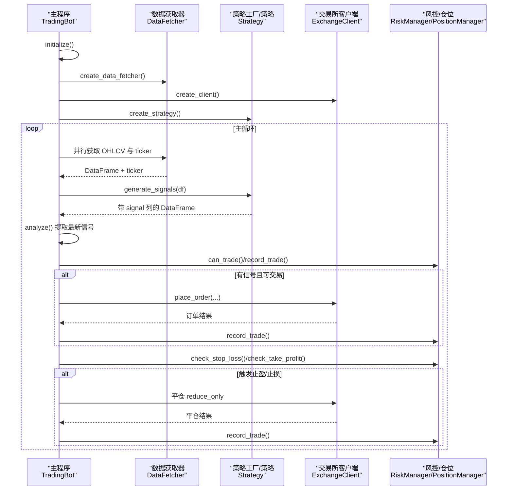
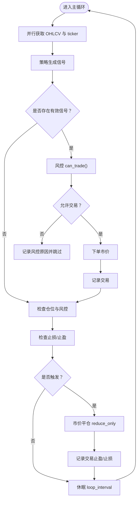
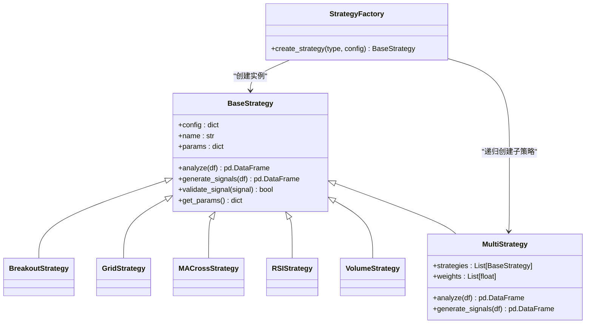
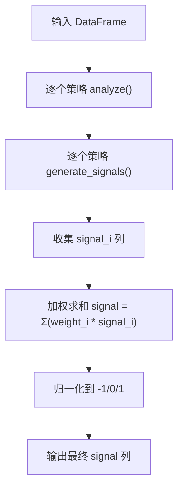
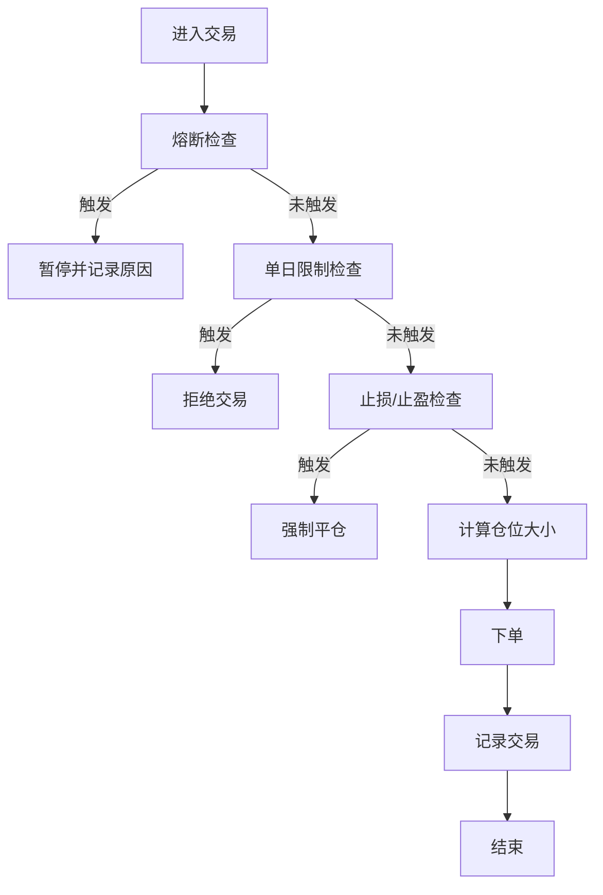
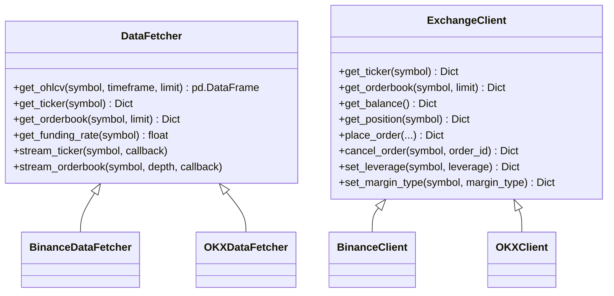
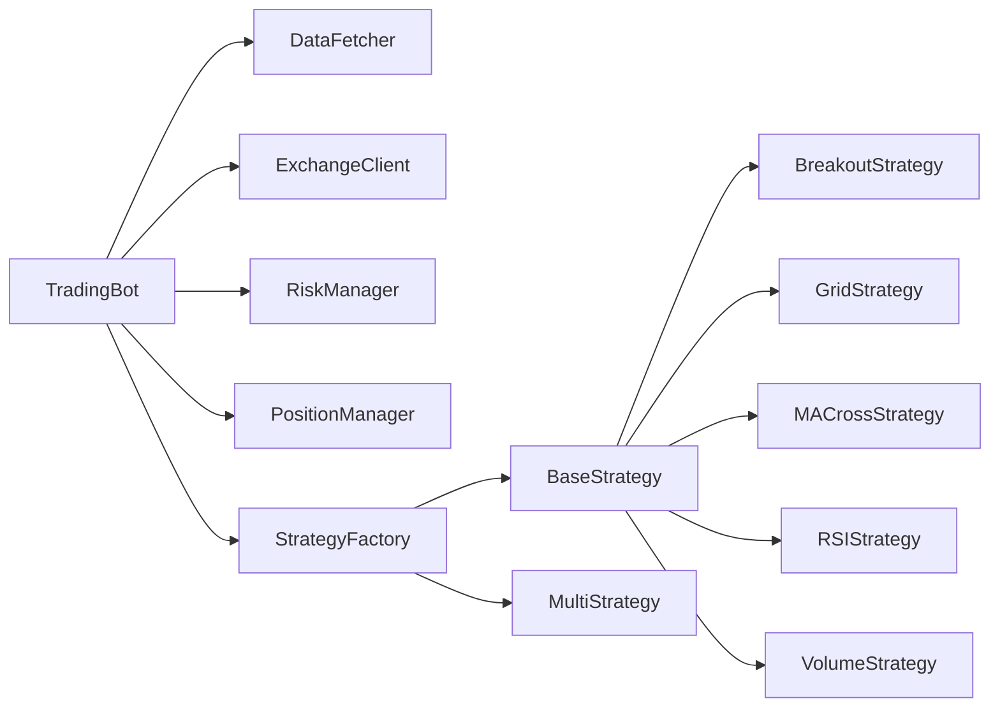

# 核心模块详解

<cite>
**本文档引用的文件**
- [src/trading_bot.py](file://src/trading_bot.py)
- [src/strategies/base.py](file://src/strategies/base.py)
- [src/strategies/factory.py](file://src/strategies/factory.py)
- [src/strategies/multi.py](file://src/strategies/multi.py)
- [src/strategies/breakout.py](file://src/strategies/breakout.py)
- [src/strategies/grid.py](file://src/strategies/grid.py)
- [src/strategies/macd.py](file://src/strategies/macd.py)
- [src/strategies/rsi.py](file://src/strategies/rsi.py)
- [src/strategies/volume.py](file://src/strategies/volume.py)
- [src/utils/risk_manager.py](file://src/utils/risk_manager.py)
- [src/utils/config.py](file://src/utils/config.py)
- [src/data/data_fetcher.py](file://src/data/data_fetcher.py)
- [src/execution/exchange_client.py](file://src/execution/exchange_client.py)
- [configs/config.json](file://configs/config.json)
</cite>

## 目录
1. [引言](#引言)
2. [项目结构](#项目结构)
3. [核心组件](#核心组件)
4. [架构总览](#架构总览)
5. [详细组件分析](#详细组件分析)
6. [依赖关系分析](#依赖关系分析)
7. [性能考量](#性能考量)
8. [故障排查指南](#故障排查指南)
9. [结论](#结论)
10. [附录](#附录)

## 引言
本文件面向量化交易系统的开发者与维护者，系统性解析交易机器人系统的设计原理与实现细节，重点覆盖以下方面：
- 交易循环机制：数据获取、策略分析、信号生成、风控校验、订单执行与仓位管理、止盈止损检查
- 配置管理：默认配置、配置校验、策略参数注入
- 策略调度与工厂模式：策略基类抽象、具体策略实现、多策略组合与权重归一化
- 执行层与风控层：下单接口、仓位管理、风控指标与熔断机制
- 模块间调用关系与数据流：从主循环到数据层、策略层、执行层、风控层的完整链路

## 项目结构
项目采用“分层+功能域”组织方式，核心目录与职责如下：
- src/trading_bot.py：主控制器，负责初始化、主循环、信号执行与风控检查
- src/strategies/*：策略层，包含策略基类、具体策略与策略工厂
- src/utils/*：工具层，包含风控与配置校验
- src/data/*：数据层，封装交易所API与WebSocket数据接入
- src/execution/*：执行层，封装下单、撤单、杠杆设置等交易接口
- configs/config.json：用户配置文件样例

**图表来源**
- [src/trading_bot.py](file://src/trading_bot.py#L1-L346)
- [src/strategies/base.py](file://src/strategies/base.py#L1-L31)
- [src/strategies/factory.py](file://src/strategies/factory.py#L1-L36)
- [src/strategies/multi.py](file://src/strategies/multi.py#L1-L38)
- [src/strategies/breakout.py](file://src/strategies/breakout.py#L1-L79)
- [src/strategies/grid.py](file://src/strategies/grid.py#L1-L63)
- [src/strategies/macd.py](file://src/strategies/macd.py#L1-L40)
- [src/strategies/rsi.py](file://src/strategies/rsi.py#L1-L42)
- [src/strategies/volume.py](file://src/strategies/volume.py#L1-L44)
- [src/utils/config.py](file://src/utils/config.py#L1-L49)
- [src/utils/risk_manager.py](file://src/utils/risk_manager.py#L1-L388)
- [src/data/data_fetcher.py](file://src/data/data_fetcher.py#L1-L434)
- [src/execution/exchange_client.py](file://src/execution/exchange_client.py#L1-L432)

**章节来源**
- [src/trading_bot.py](file://src/trading_bot.py#L1-L346)
- [src/strategies/base.py](file://src/strategies/base.py#L1-L31)
- [src/strategies/factory.py](file://src/strategies/factory.py#L1-L36)
- [src/strategies/multi.py](file://src/strategies/multi.py#L1-L38)
- [src/strategies/breakout.py](file://src/strategies/breakout.py#L1-L79)
- [src/strategies/grid.py](file://src/strategies/grid.py#L1-L63)
- [src/strategies/macd.py](file://src/strategies/macd.py#L1-L40)
- [src/strategies/rsi.py](file://src/strategies/rsi.py#L1-L42)
- [src/strategies/volume.py](file://src/strategies/volume.py#L1-L44)
- [src/utils/config.py](file://src/utils/config.py#L1-L49)
- [src/utils/risk_manager.py](file://src/utils/risk_manager.py#L1-L388)
- [src/data/data_fetcher.py](file://src/data/data_fetcher.py#L1-L434)
- [src/execution/exchange_client.py](file://src/execution/exchange_client.py#L1-L432)
- [configs/config.json](file://configs/config.json#L1-L28)

## 核心组件
本节聚焦于交易机器人的核心组件及其职责边界。

- 交易机器人（TradingBot）
  - 职责：初始化配置与各子系统、驱动主循环、协调数据获取、策略分析、信号执行与风控检查
  - 关键方法：initialize、run、fetch_market_data、analyze、execute_signal、check_positions、stop
  - 关键字段：config、data_fetcher、client、strategy、risk_manager、position_manager、symbols、timeframe、last_signal、last_price
  - 循环控制：loop_interval，默认5秒；异常捕获与优雅降级

- 策略系统
  - 策略基类（BaseStrategy）：抽象analyze与generate_signals，统一参数与名称管理
  - 策略工厂（create_strategy）：根据策略类型动态创建实例，支持多策略组合
  - 具体策略：突破、网格、均线交叉、RSI、成交量等
  - 多策略组合（MultiStrategy）：对多个子策略并行分析与信号生成，加权融合并归一化到[-1,0,1]

- 风控与仓位管理
  - RiskManager：仓位比例、止损止盈、追踪止损、单日限额、连败限制、熔断机制、交易记录与统计
  - PositionManager：开仓、平仓、更新浮动盈亏、查询仓位、设置止盈止损

- 数据与执行
  - DataFetcher：抽象数据获取器，BinanceDataFetcher/OKXDataFetcher实现K线、行情、订单簿、资金费率等
  - ExchangeClient：抽象交易客户端，BinanceClient/OKXClient实现下单、撤单、杠杆设置、账户信息等

**章节来源**
- [src/trading_bot.py](file://src/trading_bot.py#L27-L320)
- [src/strategies/base.py](file://src/strategies/base.py#L6-L31)
- [src/strategies/factory.py](file://src/strategies/factory.py#L10-L36)
- [src/strategies/multi.py](file://src/strategies/multi.py#L6-L38)
- [src/utils/risk_manager.py](file://src/utils/risk_manager.py#L12-L242)
- [src/data/data_fetcher.py](file://src/data/data_fetcher.py#L17-L434)
- [src/execution/exchange_client.py](file://src/execution/exchange_client.py#L20-L432)

## 架构总览
下图展示交易机器人从初始化到主循环的端到端流程，以及各模块之间的交互关系。

**图表来源**
- [src/trading_bot.py](file://src/trading_bot.py#L63-L296)
- [src/data/data_fetcher.py](file://src/data/data_fetcher.py#L40-L142)
- [src/strategies/factory.py](file://src/strategies/factory.py#L10-L36)
- [src/execution/exchange_client.py](file://src/execution/exchange_client.py#L226-L275)
- [src/utils/risk_manager.py](file://src/utils/risk_manager.py#L175-L241)

## 详细组件分析

### 交易循环机制
- 初始化阶段：校验配置、创建数据获取器与客户端、创建策略实例
- 主循环：并行获取K线与行情，策略生成信号，风控校验，执行下单或平仓，检查止盈止损
- 异常处理：捕获异常并延时重试，保证系统稳定性

**图表来源**
- [src/trading_bot.py](file://src/trading_bot.py#L92-L296)

**章节来源**
- [src/trading_bot.py](file://src/trading_bot.py#L63-L296)

### 配置管理与策略调度
- 配置校验：支持的交易所与策略、symbols 校验、风险参数范围校验
- 默认配置：包含 exchange、testnet、strategy、symbols、timeframe、leverage、loop_interval、risk、strategy_config
- 策略工厂：根据策略类型映射到具体策略类，支持多策略组合（MultiStrategy），自动递归创建子策略并加权融合

**图表来源**
- [src/strategies/base.py](file://src/strategies/base.py#L6-L31)
- [src/strategies/breakout.py](file://src/strategies/breakout.py#L6-L79)
- [src/strategies/grid.py](file://src/strategies/grid.py#L5-L63)
- [src/strategies/macd.py](file://src/strategies/macd.py#L5-L40)
- [src/strategies/rsi.py](file://src/strategies/rsi.py#L6-L42)
- [src/strategies/volume.py](file://src/strategies/volume.py#L6-L44)
- [src/strategies/multi.py](file://src/strategies/multi.py#L6-L38)
- [src/strategies/factory.py](file://src/strategies/factory.py#L10-L36)

**章节来源**
- [src/utils/config.py](file://src/utils/config.py#L15-L49)
- [src/trading_bot.py](file://src/trading_bot.py#L300-L320)
- [src/strategies/factory.py](file://src/strategies/factory.py#L10-L36)
- [src/strategies/multi.py](file://src/strategies/multi.py#L16-L38)

### 策略系统架构与实现要点
- 策略基类设计：统一的 analyze/generate_signals 接口，便于多策略组合与扩展
- 各策略实现原理：
  - 突破策略：基于滚动最高/最低价、ATR、布林带、MACD、RSI综合判断趋势与超买超卖
  - 网格策略：以基准价为中心构建网格，基于当前价格与网格位置生成买卖信号
  - 均线交叉策略：快慢均线差值与前值比较，产生金叉/死叉信号
  - RSI策略：基于RSI超买超卖阈值生成信号
  - 成交量策略：结合成交量均值与价格变化生成信号
- 参数配置：通过 config 注入，策略内部保存到 params，便于统计与回测
- 多策略组合：对每个子策略独立生成 signal_i，加权求和后归一化到[-1,0,1]

**图表来源**
- [src/strategies/multi.py](file://src/strategies/multi.py#L16-L38)

**章节来源**
- [src/strategies/breakout.py](file://src/strategies/breakout.py#L21-L79)
- [src/strategies/grid.py](file://src/strategies/grid.py#L20-L63)
- [src/strategies/macd.py](file://src/strategies/macd.py#L18-L40)
- [src/strategies/rsi.py](file://src/strategies/rsi.py#L21-L42)
- [src/strategies/volume.py](file://src/strategies/volume.py#L19-L44)
- [src/strategies/multi.py](file://src/strategies/multi.py#L16-L38)

### 风控与仓位管理
- 仓位管理：最大/最小仓位比例、杠杆上限、最小下单量精度控制
- 止损止盈：固定百分比止损、止盈；支持追踪止损（仅多头方向）
- 单日限制：最大交易次数、连败次数、单日最大亏损比例
- 熔断机制：达到单日最大亏损比例后暂停交易并冷却
- 交易记录与统计：每日盈亏、胜/负次数、总交易数、暂停状态

**图表来源**
- [src/utils/risk_manager.py](file://src/utils/risk_manager.py#L129-L194)

**章节来源**
- [src/utils/risk_manager.py](file://src/utils/risk_manager.py#L12-L242)

### 数据与执行层
- 数据层：支持 Binance 与 OKX 的 K线、行情、订单簿、资金费率等接口，提供 WebSocket 实时订阅能力
- 执行层：封装下单、撤单、杠杆设置、账户信息等，Binance 客户端支持签名与精度处理

**图表来源**
- [src/data/data_fetcher.py](file://src/data/data_fetcher.py#L17-L434)
- [src/execution/exchange_client.py](file://src/execution/exchange_client.py#L20-L432)

**章节来源**
- [src/data/data_fetcher.py](file://src/data/data_fetcher.py#L40-L434)
- [src/execution/exchange_client.py](file://src/execution/exchange_client.py#L42-L432)

## 依赖关系分析
- 组件耦合与内聚
  - TradingBot 对策略工厂、数据获取器、执行客户端、风控模块存在高内聚依赖，但通过抽象接口降低耦合
  - 策略层内部通过基类统一接口，多策略组合进一步解耦具体策略实现
- 外部依赖
  - 数据层依赖交易所 REST/WS 接口
  - 执行层依赖交易所签名与精度控制
- 潜在循环依赖
  - 未发现直接循环导入；策略工厂对具体策略类的导入在运行时进行，避免静态循环

**图表来源**
- [src/trading_bot.py](file://src/trading_bot.py#L14-L21)
- [src/strategies/factory.py](file://src/strategies/factory.py#L2-L8)
- [src/strategies/base.py](file://src/strategies/base.py#L6-L12)

**章节来源**
- [src/trading_bot.py](file://src/trading_bot.py#L14-L21)
- [src/strategies/factory.py](file://src/strategies/factory.py#L2-L8)

## 性能考量
- 并行化：主循环中并行获取 OHLCV 与 ticker，减少等待时间
- 策略计算：Pandas 向量化操作为主，注意窗口长度与数据量对内存与 CPU 的影响
- 精度与步进：下单数量按交易所 step_size 对齐，避免无效订单
- 熔断与限流：风控模块内置熔断与单日限额，防止极端行情下的连续损失
- I/O 超时：HTTP/WS 请求设置超时，避免阻塞事件循环

[本节为通用建议，无需特定文件引用]

## 故障排查指南
- 配置校验失败
  - 现象：启动时报错，列出不合法配置项
  - 排查：确认 exchange、symbols、strategy、risk 参数范围
  - 参考
    - [src/utils/config.py](file://src/utils/config.py#L15-L37)
- API 错误与签名问题
  - 现象：下单/查询账户报错，返回 code/msg
  - 排查：检查 API Key/Secret、签名参数、时间戳、交易所网络（testnet）
  - 参考
    - [src/execution/exchange_client.py](file://src/execution/exchange_client.py#L136-L170)
- 仓位无法下单
  - 现象：下单 quantity 被截断或为 0
  - 排查：确认 step_size、quantity_precision、最小下单量
  - 参考
    - [src/execution/exchange_client.py](file://src/execution/exchange_client.py#L242-L254)
- 策略无信号或信号不稳定
  - 现象：generate_signals 返回全 0 或波动较大
  - 排查：调整策略参数（如 lookback、threshold、rsi_period、grid_size 等）
  - 参考
    - [src/strategies/breakout.py](file://src/strategies/breakout.py#L12-L19)
    - [src/strategies/rsi.py](file://src/strategies/rsi.py#L12-L19)
    - [src/strategies/grid.py](file://src/strategies/grid.py#L11-L18)
- 风控熔断导致无法交易
  - 现象：can_trade 返回 should_stop=true
  - 排查：查看熔断阈值与冷却时间，等待恢复
  - 参考
    - [src/utils/risk_manager.py](file://src/utils/risk_manager.py#L129-L153)

**章节来源**
- [src/utils/config.py](file://src/utils/config.py#L15-L37)
- [src/execution/exchange_client.py](file://src/execution/exchange_client.py#L136-L170)
- [src/strategies/breakout.py](file://src/strategies/breakout.py#L12-L19)
- [src/strategies/rsi.py](file://src/strategies/rsi.py#L12-L19)
- [src/strategies/grid.py](file://src/strategies/grid.py#L11-L18)
- [src/utils/risk_manager.py](file://src/utils/risk_manager.py#L129-L153)

## 结论
该量化交易系统通过清晰的分层设计与工厂模式实现了策略的灵活扩展，配合风控与仓位管理保障了交易的安全性与稳定性。主循环采用并行化与稳健的异常处理，适配高频交易场景。开发者可通过策略工厂快速集成新策略，并利用多策略组合提升信号鲁棒性。

[本节为总结性内容，无需特定文件引用]

## 附录

### 使用模式与最佳实践
- 策略参数设置
  - 在配置文件中设置 strategy_config，不同策略读取对应参数
  - 示例参考
    - [configs/config.json](file://configs/config.json#L10-L20)
- 信号生成与执行流程
  - 策略生成信号列，TradingBot 提取最新信号并执行下单或平仓
  - 参考
    - [src/trading_bot.py](file://src/trading_bot.py#L101-L205)
- 多策略组合
  - 在 strategy_config 中指定 strategies 与 weights，工厂自动递归创建
  - 参考
    - [src/strategies/factory.py](file://src/strategies/factory.py#L21-L30)
    - [src/strategies/multi.py](file://src/strategies/multi.py#L9-L14)

### 公共接口与返回值
- 策略接口
  - analyze(df): 输入原始K线，输出包含指标列的 DataFrame
  - generate_signals(df): 输入含指标的 DataFrame，输出新增 signal 列
  - 返回值：均为 DataFrame，signal 列取值为 -1/0/1
  - 参考
    - [src/strategies/base.py](file://src/strategies/base.py#L14-L22)
- 风控接口
  - calculate_position_size(signal, balance, price): 返回下单数量
  - check_stop_loss/ check_take_profit/ check_circuit_breaker/ can_trade/ record_trade/ get_stats
  - 返回值：字典，包含 should_stop/reason/阈值/盈亏等字段
  - 参考
    - [src/utils/risk_manager.py](file://src/utils/risk_manager.py#L62-L241)
- 执行接口
  - place_order(...): 返回包含 success/order_id/symbol/price/quantity/status/raw 的字典
  - get_balance/get_position/set_leverage 等
  - 参考
    - [src/execution/exchange_client.py](file://src/execution/exchange_client.py#L226-L336)

**章节来源**
- [src/strategies/base.py](file://src/strategies/base.py#L14-L22)
- [src/utils/risk_manager.py](file://src/utils/risk_manager.py#L62-L241)
- [src/execution/exchange_client.py](file://src/execution/exchange_client.py#L226-L336)
- [src/trading_bot.py](file://src/trading_bot.py#L101-L205)