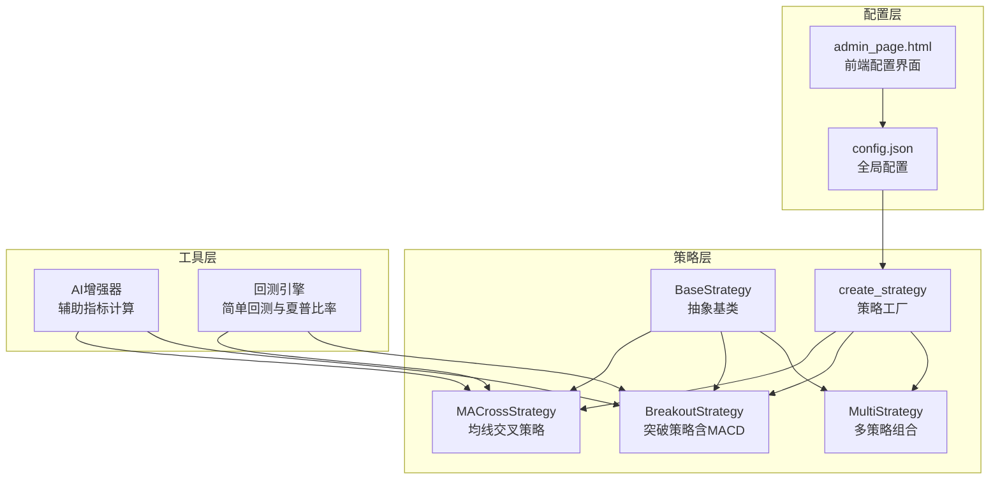
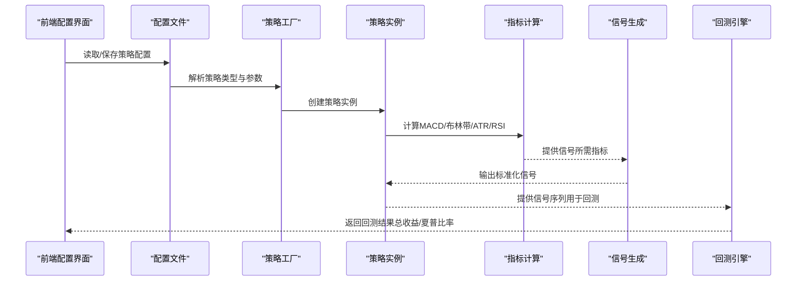
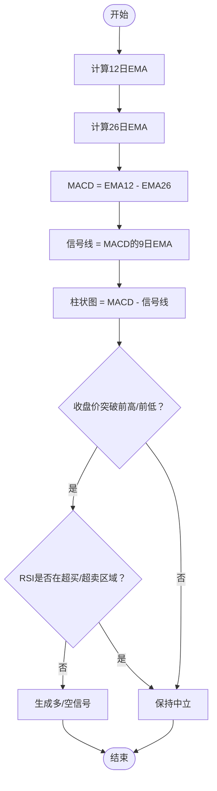
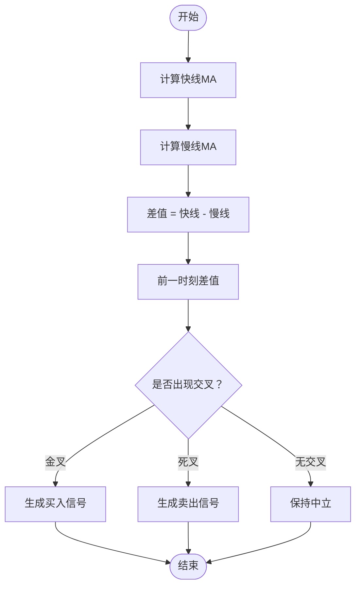
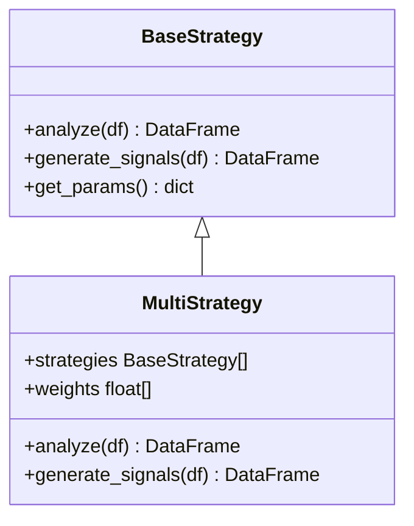
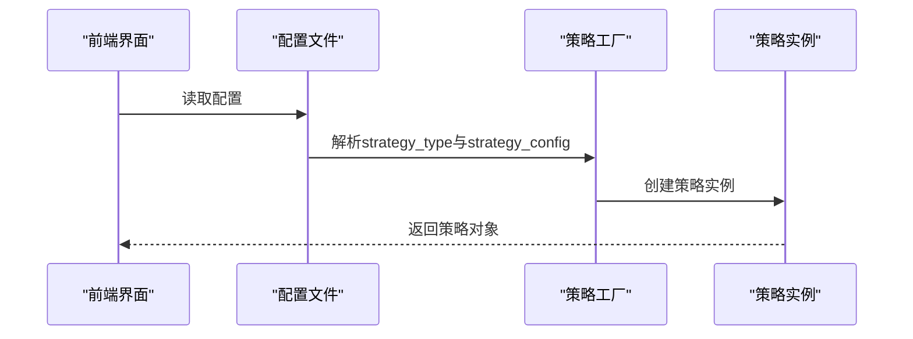
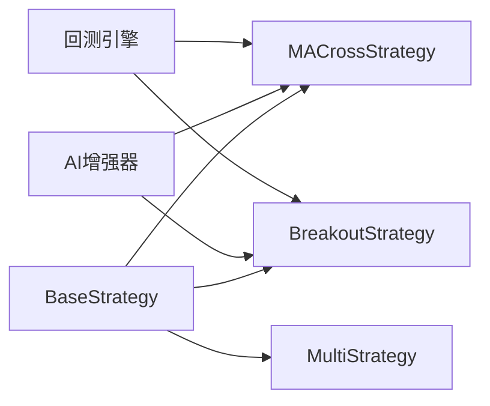

# MACD策略

<cite>
**本文档引用的文件**
- [src/strategies/macd.py](file://src/strategies/macd.py)
- [src/strategies/breakout.py](file://src/strategies/breakout.py)
- [src/strategies/base.py](file://src/strategies/base.py)
- [src/strategies/factory.py](file://src/strategies/factory.py)
- [src/strategies/multi.py](file://src/strategies/multi.py)
- [src/utils/ai_enhancer.py](file://src/utils/ai_enhancer.py)
- [src/aetherlife/evolution/engine.py](file://src/aetherlife/evolution/engine.py)
- [configs/config.json](file://configs/config.json)
- [src/ui/admin_page.html](file://src/ui/admin_page.html)
</cite>

## 目录
1. [简介](#简介)
2. [项目结构](#项目结构)
3. [核心组件](#核心组件)
4. [架构总览](#架构总览)
5. [详细组件分析](#详细组件分析)
6. [依赖关系分析](#依赖关系分析)
7. [性能考量](#性能考量)
8. [故障排除指南](#故障排除指南)
9. [结论](#结论)
10. [附录](#附录)

## 简介
本文件面向MACD策略的完整技术文档，基于仓库中的现有实现进行梳理与扩展说明。当前代码库包含两种与MACD相关的策略实现：
- MACrossStrategy（均线交叉策略）：使用简单移动平均线交叉产生买卖信号，属于广义的MACD思想但不直接计算MACD指标。
- BreakoutStrategy（突破策略）：在趋势跟踪中内嵌了完整的MACD指标计算，并结合布林带、ATR与RSI等指标生成交易信号。

本文档将围绕以下主题展开：
- MACD指标的计算原理与信号生成机制（快慢线、信号线、柱状图）
- 交叉信号识别（金叉/死叉）与背离解读
- 参数配置与优化建议（快线、慢线、信号线周期）
- 不同时间框架下的适用性（短期与长期）
- 策略性能评估方法与回测流程
- 实际交易案例与胜率、风险收益比分析思路

## 项目结构
该系统采用“策略工厂 + 多策略组合 + 基类抽象”的模块化设计，便于扩展与集成多种技术指标与信号规则。

图表来源
- [src/strategies/base.py](file://src/strategies/base.py#L6-L31)
- [src/strategies/macd.py](file://src/strategies/macd.py#L5-L40)
- [src/strategies/breakout.py](file://src/strategies/breakout.py#L6-L79)
- [src/strategies/multi.py](file://src/strategies/multi.py#L6-L38)
- [src/strategies/factory.py](file://src/strategies/factory.py#L10-L36)
- [src/utils/ai_enhancer.py](file://src/utils/ai_enhancer.py#L262-L267)
- [src/aetherlife/evolution/engine.py](file://src/aetherlife/evolution/engine.py#L122-L138)
- [configs/config.json](file://configs/config.json#L1-L28)
- [src/ui/admin_page.html](file://src/ui/admin_page.html#L438-L442)

章节来源
- [src/strategies/base.py](file://src/strategies/base.py#L6-L31)
- [src/strategies/factory.py](file://src/strategies/factory.py#L10-L36)
- [configs/config.json](file://configs/config.json#L1-L28)

## 核心组件
- BaseStrategy：定义策略的统一接口（analyze、generate_signals），并提供参数访问与信号验证的通用能力。
- MACrossStrategy：基于简单移动平均线交叉的信号生成，适合趋势跟踪与震荡过滤。
- BreakoutStrategy：在趋势突破逻辑中嵌入MACD、布林带、ATR与RSI，形成多因子综合信号。
- MultiStrategy：对多个子策略的信号进行加权聚合，输出标准化的-1/0/1信号。
- 工厂模式：根据配置动态创建策略实例，支持多策略组合。
- AI增强器：提供MACD柱状图值的快速计算，用于辅助判断市场动能。
- 回测引擎：提供简单多空回测与夏普比率计算，用于策略性能评估。

章节来源
- [src/strategies/base.py](file://src/strategies/base.py#L6-L31)
- [src/strategies/macd.py](file://src/strategies/macd.py#L5-L40)
- [src/strategies/breakout.py](file://src/strategies/breakout.py#L6-L79)
- [src/strategies/multi.py](file://src/strategies/multi.py#L6-L38)
- [src/strategies/factory.py](file://src/strategies/factory.py#L10-L36)
- [src/utils/ai_enhancer.py](file://src/utils/ai_enhancer.py#L262-L267)
- [src/aetherlife/evolution/engine.py](file://src/aetherlife/evolution/engine.py#L122-L138)

## 架构总览
MACD策略在系统中的位置与交互如下：

图表来源
- [src/ui/admin_page.html](file://src/ui/admin_page.html#L438-L442)
- [configs/config.json](file://configs/config.json#L10-L14)
- [src/strategies/factory.py](file://src/strategies/factory.py#L10-L36)
- [src/strategies/breakout.py](file://src/strategies/breakout.py#L21-L79)
- [src/aetherlife/evolution/engine.py](file://src/aetherlife/evolution/engine.py#L122-L138)

## 详细组件分析

### MACD指标计算与信号生成（基于BreakoutStrategy）
BreakoutStrategy在趋势突破逻辑中实现了完整的MACD指标计算，具体步骤如下：
- 快线（12日指数加权平均）与慢线（26日指数加权平均）计算
- MACD线 = 快线 - 慢线
- 信号线（9日指数加权平均）= MACD线的9日EMA
- 柱状图（MACD直方图）= MACD线 - 信号线

信号生成规则：
- 当收盘价突破前高且MACD柱状图为正值时做多；当收盘价跌破前低且MACD柱状图为负值时做空
- 当RSI进入超买/超卖区域时抑制信号，避免逆势交易

图表来源
- [src/strategies/breakout.py](file://src/strategies/breakout.py#L47-L60)
- [src/strategies/breakout.py](file://src/strategies/breakout.py#L74-L77)

章节来源
- [src/strategies/breakout.py](file://src/strategies/breakout.py#L21-L79)

### 交叉信号识别（MACrossStrategy）
MACrossStrategy通过简单移动平均线交叉产生信号，属于广义的MACD思想：
- 计算快线（默认10日）与慢线（默认50日）的均值
- 计算差值与前一时刻差值，识别金叉（由负转正）与死叉（由正转负）
- 生成-1/0/1信号

图表来源
- [src/strategies/macd.py](file://src/strategies/macd.py#L18-L39)

章节来源
- [src/strategies/macd.py](file://src/strategies/macd.py#L5-L40)

### 多策略组合（MultiStrategy）
MultiStrategy对多个子策略的信号进行加权聚合，最终输出标准化的-1/0/1信号，提升稳定性与鲁棒性。

图表来源
- [src/strategies/base.py](file://src/strategies/base.py#L6-L31)
- [src/strategies/multi.py](file://src/strategies/multi.py#L6-L38)

章节来源
- [src/strategies/multi.py](file://src/strategies/multi.py#L6-L38)

### 策略工厂与配置
策略工厂根据配置字符串创建对应策略实例，支持多策略组合。前端配置界面可读写策略参数与风控设置。

图表来源
- [src/ui/admin_page.html](file://src/ui/admin_page.html#L438-L442)
- [configs/config.json](file://configs/config.json#L10-L14)
- [src/strategies/factory.py](file://src/strategies/factory.py#L10-L36)

章节来源
- [src/strategies/factory.py](file://src/strategies/factory.py#L10-L36)
- [configs/config.json](file://configs/config.json#L10-L14)
- [src/ui/admin_page.html](file://src/ui/admin_page.html#L438-L442)

## 依赖关系分析
- 策略基类与继承关系：所有策略均继承自BaseStrategy，确保统一的接口与参数管理。
- 工具依赖：AI增强器提供MACD柱状图值的快速计算，可用于辅助判断市场动能。
- 回测依赖：回测引擎以信号序列为基础进行简单多空回测，计算总收益与夏普比率。

图表来源
- [src/strategies/base.py](file://src/strategies/base.py#L6-L31)
- [src/strategies/macd.py](file://src/strategies/macd.py#L5-L40)
- [src/strategies/breakout.py](file://src/strategies/breakout.py#L6-L79)
- [src/strategies/multi.py](file://src/strategies/multi.py#L6-L38)
- [src/utils/ai_enhancer.py](file://src/utils/ai_enhancer.py#L262-L267)
- [src/aetherlife/evolution/engine.py](file://src/aetherlife/evolution/engine.py#L122-L138)

章节来源
- [src/strategies/base.py](file://src/strategies/base.py#L6-L31)
- [src/utils/ai_enhancer.py](file://src/utils/ai_enhancer.py#L262-L267)
- [src/aetherlife/evolution/engine.py](file://src/aetherlife/evolution/engine.py#L122-L138)

## 性能考量
- 计算复杂度：MACD计算涉及多次指数加权平均，时间复杂度约为O(n)，空间复杂度O(n)。
- 数据长度要求：信号生成通常需要至少较长周期的数据窗口（如50日），以避免早期信号的噪声影响。
- 回测效率：回测引擎采用简单多空回测，计算开销较小，适合快速迭代与参数扫描。
- 参数敏感性：MACD周期对信号质量影响显著，需结合市场波动性进行优化。

## 故障排除指南
- 空DataFrame处理：当输入为空或长度不足时，信号生成会返回空DataFrame或填充0信号，避免异常传播。
- 参数缺失：策略构造时使用默认参数（如快线10日、慢线50日），若配置缺失则采用默认值。
- 指标异常：在RSI与MACD计算中存在除零保护与NaN替换，确保数值稳定性。

章节来源
- [src/strategies/macd.py](file://src/strategies/macd.py#L29-L34)
- [src/strategies/breakout.py](file://src/strategies/breakout.py#L64-L72)

## 结论
本仓库提供了两条与MACD相关的策略路径：
- MACrossStrategy：基于均线交叉的简单信号，适合趋势跟踪与过滤震荡。
- BreakoutStrategy：在突破策略中嵌入MACD、布林带、ATR与RSI，形成多因子综合信号，更贴近实战。

建议在实际应用中：
- 根据市场波动性调整MACD周期（快线、慢线、信号线）
- 在震荡市场中优先使用均线交叉策略，在趋势明确时使用突破策略
- 使用多策略组合提升稳定性，并通过回测评估参数与权重
- 结合风控参数（止盈止损、最大仓位等）控制回撤与风险收益比

## 附录

### MACD参数配置与优化方法
- 快线周期：常用12日，反映短期价格变化
- 慢线周期：常用26日，反映长期趋势
- 信号线周期：常用9日，平滑MACD线
- 优化建议：
  - 使用滚动窗口回测比较不同周期组合的夏普比率与胜率
  - 在高波动市场适当延长周期以减少噪音
  - 在震荡市场缩短周期以提高灵敏度

章节来源
- [src/strategies/breakout.py](file://src/strategies/breakout.py#L47-L52)
- [src/strategies/macd.py](file://src/strategies/macd.py#L11-L16)

### 不同时间框架下的应用
- 短期交易（分钟级）：MACD周期较短，信号更频繁，适合日内交易与高频策略
- 长期趋势跟踪（小时/日线）：MACD周期较长，信号更稳定，适合趋势跟踪与波段交易

章节来源
- [configs/config.json](file://configs/config.json#L7-L7)
- [src/ui/admin_page.html](file://src/ui/admin_page.html#L438-L442)

### 策略性能评估方法
- 回测流程：以信号序列驱动多空头寸，按收盘价换仓，计算总收益与年化夏普比率
- 指标选择：总收益、年化夏普比率、最大回撤、胜率、盈亏比
- 实战建议：先在历史数据上进行参数扫描与样本外验证，再结合风控参数进行实盘部署

章节来源
- [src/aetherlife/evolution/engine.py](file://src/aetherlife/evolution/engine.py#L122-L138)

### 实际交易案例与胜率统计
- 案例设计：在指定时间窗口内运行策略，记录每次入场/出场的收益与时间
- 统计指标：胜率（盈利次数/总次数）、平均盈亏比（平均盈利/平均亏损绝对值）、最大连续亏损
- 注意事项：避免过拟合，使用样本外数据验证策略稳健性

章节来源
- [src/aetherlife/evolution/engine.py](file://src/aetherlife/evolution/engine.py#L122-L138)