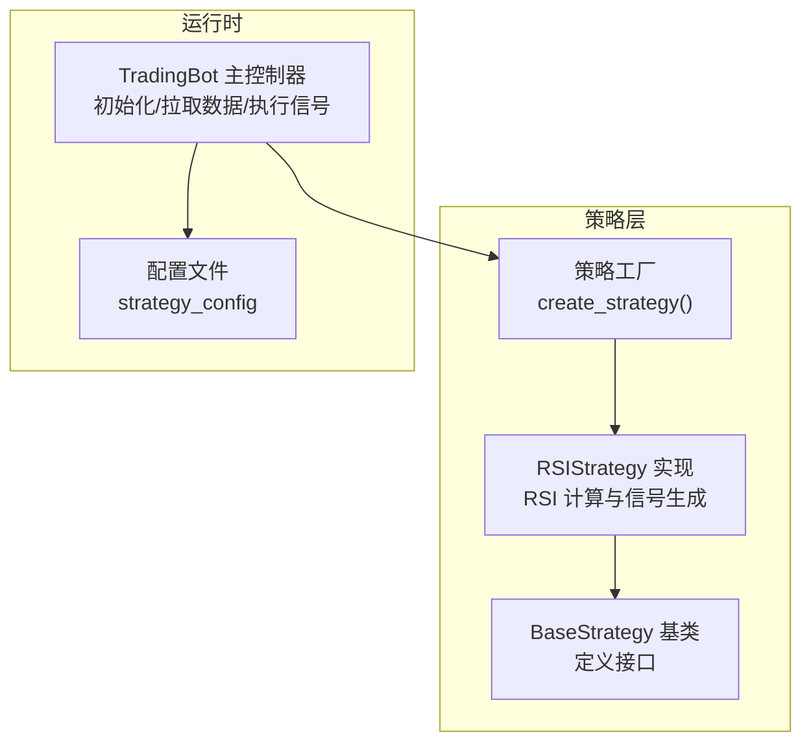
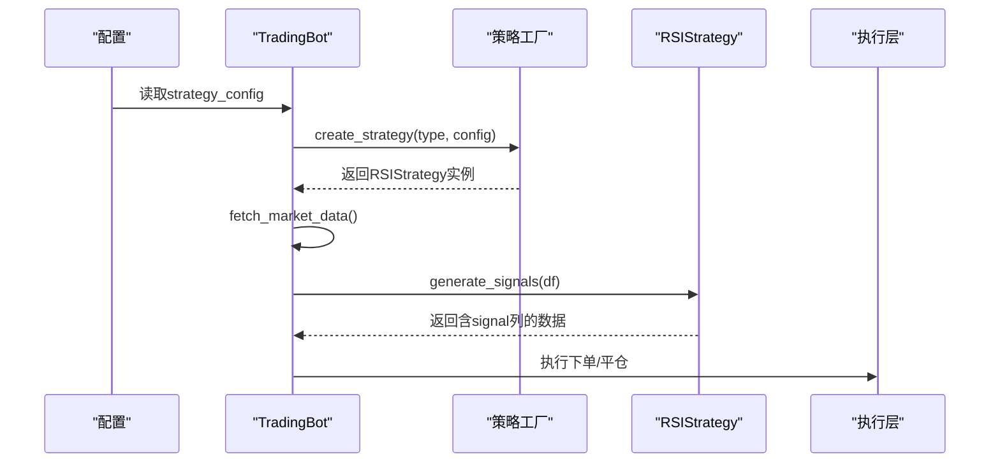
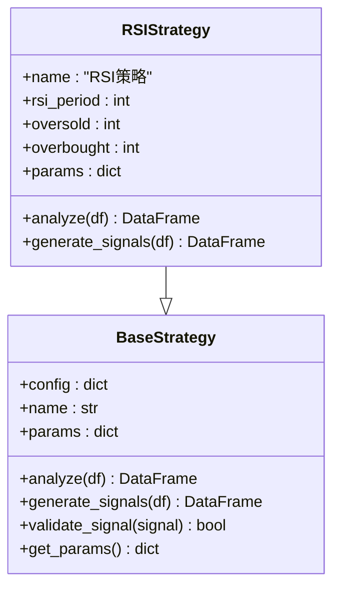
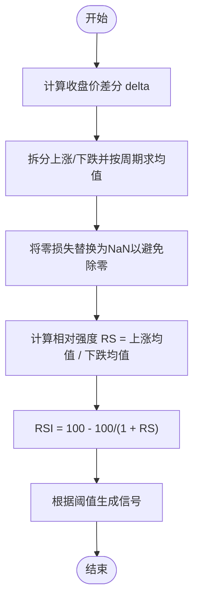
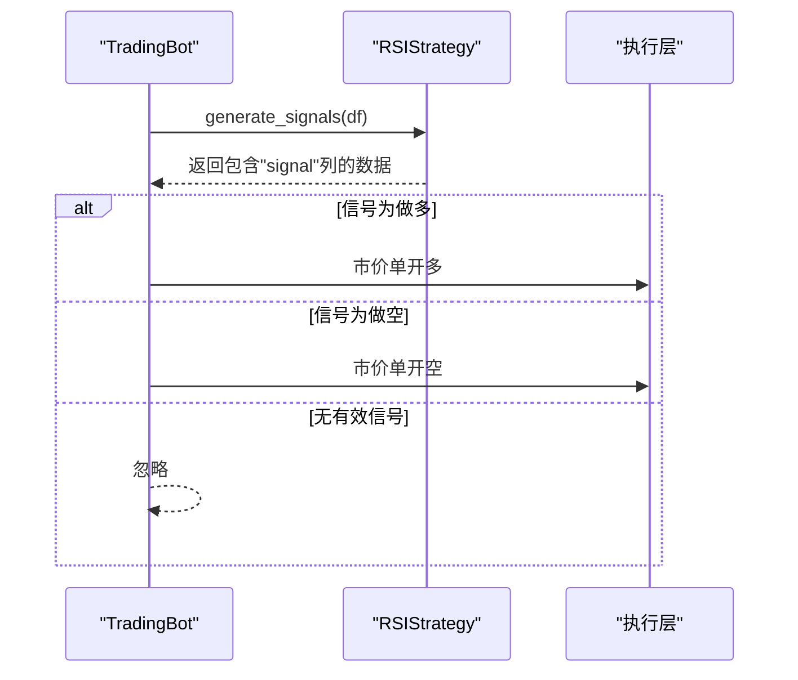
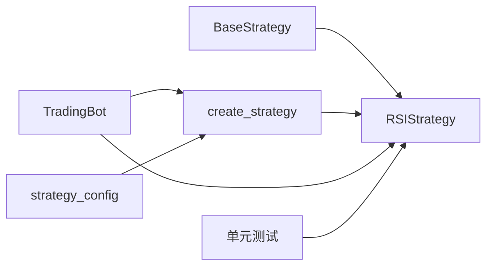

# RSI策略

<cite>
**本文引用的文件**
- [src/strategies/rsi.py](file://src/strategies/rsi.py)
- [src/strategies/base.py](file://src/strategies/base.py)
- [src/strategies/factory.py](file://src/strategies/factory.py)
- [src/trading_bot.py](file://src/trading_bot.py)
- [configs/config.json](file://configs/config.json)
- [src/utils/ai_enhancer.py](file://src/utils/ai_enhancer.py)
- [src/aetherlife/evolution/engine.py](file://src/aetherlife/evolution/engine.py)
- [tests/test_strategies.py](file://tests/test_strategies.py)
</cite>

## 目录
1. [引言](#引言)
2. [项目结构](#项目结构)
3. [核心组件](#核心组件)
4. [架构总览](#架构总览)
5. [详细组件分析](#详细组件分析)
6. [依赖关系分析](#依赖关系分析)
7. [性能考量](#性能考量)
8. [故障排查指南](#故障排查指南)
9. [结论](#结论)
10. [附录](#附录)

## 引言
本文件面向“RSI相对强弱指数”策略，基于仓库中的具体实现进行技术文档化。内容涵盖RSI计算方法、超买超卖阈值设定、信号生成逻辑、参数配置要点、在不同市场环境下的适用性、参数优化思路以及与其它指标的组合使用建议。为保证可追溯性，所有技术细节均对应到源码文件与行号。

## 项目结构
RSI策略位于策略子模块中，通过工厂模式被交易机器人加载；其计算与信号生成流程贯穿于数据获取、策略分析与信号执行环节。

图表来源
- [src/strategies/factory.py](file://src/strategies/factory.py#L10-L35)
- [src/strategies/base.py](file://src/strategies/base.py#L6-L30)
- [src/strategies/rsi.py](file://src/strategies/rsi.py#L6-L41)
- [src/trading_bot.py](file://src/trading_bot.py#L83-L85)
- [configs/config.json](file://configs/config.json#L10-L14)

章节来源
- [src/strategies/factory.py](file://src/strategies/factory.py#L10-L35)
- [src/strategies/base.py](file://src/strategies/base.py#L6-L30)
- [src/strategies/rsi.py](file://src/strategies/rsi.py#L6-L41)
- [src/trading_bot.py](file://src/trading_bot.py#L83-L85)
- [configs/config.json](file://configs/config.json#L10-L14)

## 核心组件
- RSIStrategy：实现RSI指标计算与买卖信号生成，继承自BaseStrategy。
- BaseStrategy：策略抽象基类，定义analyze与generate_signals接口。
- 策略工厂：根据策略类型创建具体策略实例。
- TradingBot：主控制器，负责初始化、拉取数据、调用策略生成信号并执行交易。

章节来源
- [src/strategies/rsi.py](file://src/strategies/rsi.py#L6-L41)
- [src/strategies/base.py](file://src/strategies/base.py#L6-L30)
- [src/strategies/factory.py](file://src/strategies/factory.py#L10-L35)
- [src/trading_bot.py](file://src/trading_bot.py#L83-L85)

## 架构总览
下图展示从配置到策略执行的关键交互路径。

图表来源
- [src/trading_bot.py](file://src/trading_bot.py#L83-L113)
- [src/strategies/factory.py](file://src/strategies/factory.py#L10-L35)
- [src/strategies/rsi.py](file://src/strategies/rsi.py#L31-L41)

## 详细组件分析

### RSI策略类（RSIStrategy）
- 继承关系：RSIStrategy -> BaseStrategy
- 关键属性
  - rsi_period：RSI周期长度，默认14
  - oversold：超卖阈值，默认30
  - overbought：超买阈值，默认70
  - params：策略参数字典，便于导出
- 计算步骤
  - 计算收盘价差分delta
  - 分别计算窗口期均值化的“上涨”和“下跌”
  - 计算相对强度RS，并据此得到RSI值
- 信号生成规则
  - 当RSI小于超卖阈值：做多信号
  - 当RSI大于超买阈值：做空信号
  - 其它情况：持有或无信号

图表来源
- [src/strategies/base.py](file://src/strategies/base.py#L6-L30)
- [src/strategies/rsi.py](file://src/strategies/rsi.py#L6-L19)

章节来源
- [src/strategies/rsi.py](file://src/strategies/rsi.py#L6-L41)
- [src/strategies/base.py](file://src/strategies/base.py#L6-L30)

### RSI计算流程（算法级）

图表来源
- [src/strategies/rsi.py](file://src/strategies/rsi.py#L21-L29)

章节来源
- [src/strategies/rsi.py](file://src/strategies/rsi.py#L21-L29)

### 信号生成序列（策略到执行）

图表来源
- [src/trading_bot.py](file://src/trading_bot.py#L101-L113)
- [src/trading_bot.py](file://src/trading_bot.py#L115-L204)
- [src/strategies/rsi.py](file://src/strategies/rsi.py#L31-L41)

章节来源
- [src/trading_bot.py](file://src/trading_bot.py#L101-L113)
- [src/trading_bot.py](file://src/trading_bot.py#L115-L204)
- [src/strategies/rsi.py](file://src/strategies/rsi.py#L31-L41)

### 参数配置与默认值
- 策略类型：rsi
- 关键参数
  - rsi_period：RSI周期，默认14
  - oversold：超卖阈值，默认30
  - overbought：超买阈值，默认70
- 配置位置
  - 在运行时由策略工厂读取strategy_config传入
  - 示例配置文件中strategy_config字段用于传递策略参数

章节来源
- [src/strategies/rsi.py](file://src/strategies/rsi.py#L9-L19)
- [src/strategies/factory.py](file://src/strategies/factory.py#L10-L35)
- [configs/config.json](file://configs/config.json#L10-L14)

### 与其它指标的组合使用
- 与趋势类指标结合：可在趋势确认后使用RSI进行入场时机选择
- 与成交量指标结合：在放量背景下RSI信号更具可信度
- 与波动率指标结合：在高波动时段适当收紧阈值或提高过滤条件

（本节为通用实践指导，不直接分析具体文件）

### RSI背离信号识别（概念性说明）
- 顶背离：价格创新高而RSI未能创新高，预示上涨动能减弱
- 底背离：价格新低而RSI未创新低，预示下跌动能衰竭
- 确认标准：通常需要价格与RSI的形态差异持续一段时间，并伴随成交量或趋势指标的变化
- 注意：该仓库未内置背离检测逻辑，需在上层策略或扩展中自行实现

（本节为通用实践指导，不直接分析具体文件）

## 依赖关系分析
- RSIStrategy依赖BaseStrategy提供的接口契约
- TradingBot通过策略工厂创建RSIStrategy实例
- 配置文件提供strategy_config，驱动策略参数注入
- 测试文件验证RSI列的存在与信号取值范围

图表来源
- [src/strategies/base.py](file://src/strategies/base.py#L6-L30)
- [src/strategies/rsi.py](file://src/strategies/rsi.py#L6-L19)
- [src/strategies/factory.py](file://src/strategies/factory.py#L10-L35)
- [src/trading_bot.py](file://src/trading_bot.py#L83-L85)
- [tests/test_strategies.py](file://tests/test_strategies.py#L38-L50)

章节来源
- [src/strategies/base.py](file://src/strategies/base.py#L6-L30)
- [src/strategies/rsi.py](file://src/strategies/rsi.py#L6-L19)
- [src/strategies/factory.py](file://src/strategies/factory.py#L10-L35)
- [src/trading_bot.py](file://src/trading_bot.py#L83-L85)
- [tests/test_strategies.py](file://tests/test_strategies.py#L38-L50)

## 性能考量
- 计算复杂度：RSI计算为O(n)，其中n为数据点数量；滚动均值操作在时间序列上高效
- 内存占用：主要受历史K线长度影响；建议按需截取数据窗口
- 实盘延迟：TradingBot采用异步拉取数据与执行，注意网络与交易所响应延迟对信号时效的影响

（本节提供一般性指导，不直接分析具体文件）

## 故障排查指南
- 空数据或数据不足
  - 现象：generate_signals返回空DataFrame或仅填充0信号
  - 原因：输入数据为空或长度小于RSI周期
  - 处理：确保传入至少rsi_period条K线
- RSI阈值设置不当
  - 现象：频繁无效信号或错过信号
  - 原因：阈值过于严格或宽松
  - 处理：结合市场波动性调整oversold/overbought
- 与其它指标组合冲突
  - 现象：RSI与趋势/成交量信号相互矛盾
  - 处理：增加过滤条件或采用加权融合

章节来源
- [src/strategies/rsi.py](file://src/strategies/rsi.py#L31-L41)

## 结论
本RSI策略以简洁明确的阈值法实现超买超卖交易信号，具备良好的可解释性与可配置性。在震荡市场中表现稳定，在趋势市中可能产生较多假突破。建议结合趋势与成交量过滤、动态阈值与参数优化，以提升策略稳定性与胜率。

## 附录

### RSI参数优化技术
- 网格搜索：对oversold与overbought在合理区间内遍历，评估回测收益与最大回撤
- 遗传/进化算法：利用策略变体生成器探索参数空间，自动收敛至较优解
- 在线学习：基于实时信号质量动态调整阈值

章节来源
- [src/aetherlife/evolution/engine.py](file://src/aetherlife/evolution/engine.py#L71-L88)

### 实战应用示例（基于现有实现）
- 使用策略工厂创建RSI策略并注入参数
- TradingBot按配置拉取数据并调用策略生成信号
- 执行层根据信号进行开仓/平仓

章节来源
- [src/strategies/factory.py](file://src/strategies/factory.py#L10-L35)
- [src/trading_bot.py](file://src/trading_bot.py#L83-L113)
- [src/trading_bot.py](file://src/trading_bot.py#L115-L204)

### RSI值含义与阈值设定原理
- RSI取值范围0–100，衡量价格变动速度与幅度
- 常用阈值：超买70、超卖30，但应结合市场波动性与周期长度调整
- 周期长度：越短越敏感，越长越平滑；需与交易频率匹配

（本节为通用知识，不直接分析具体文件）