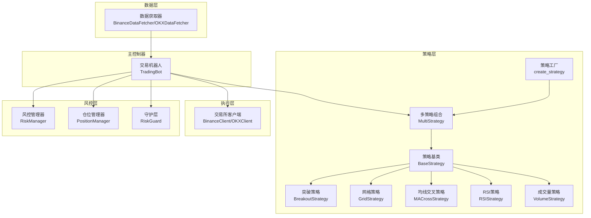
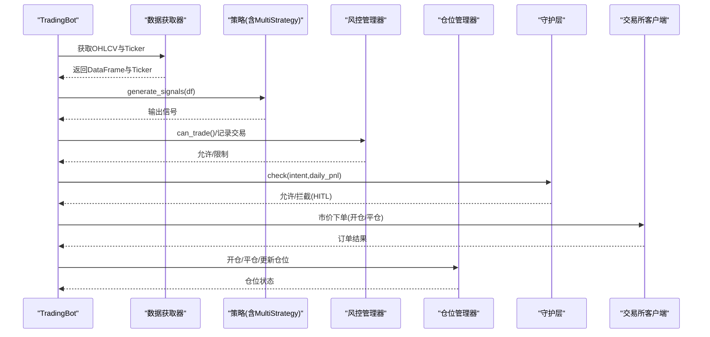
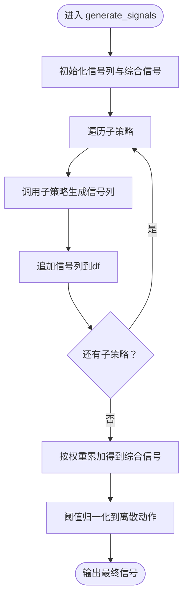
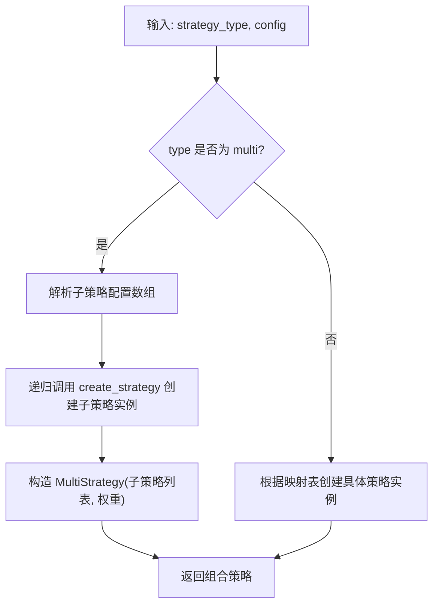
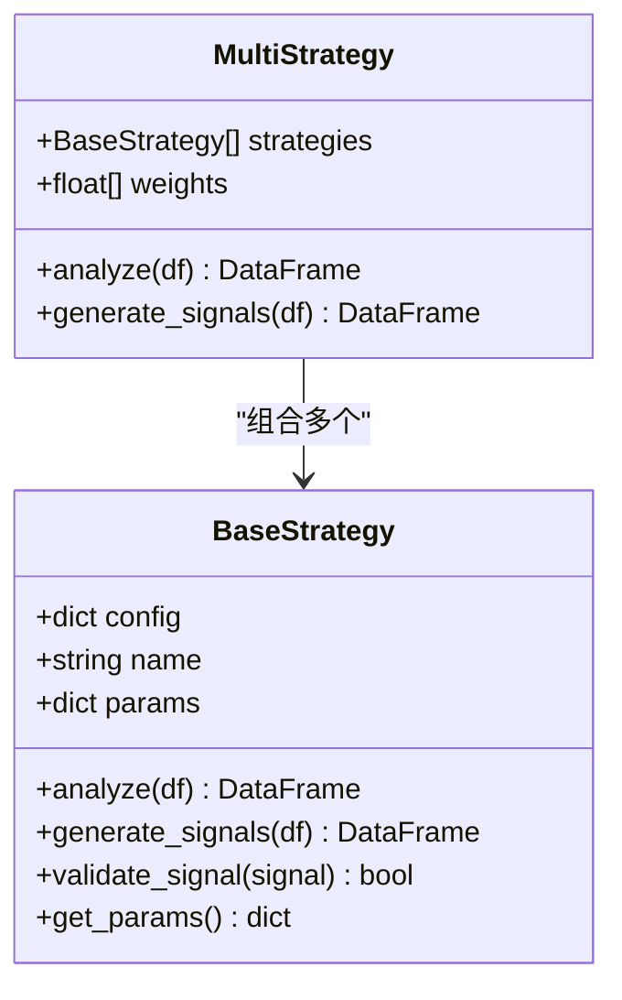
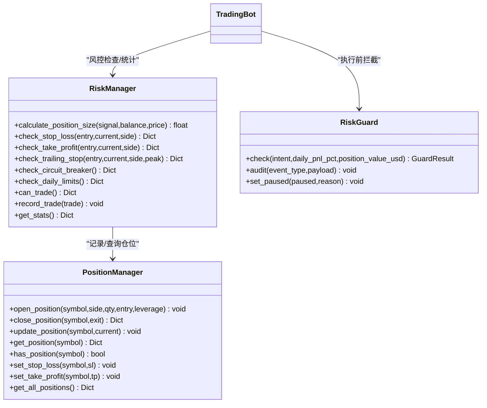
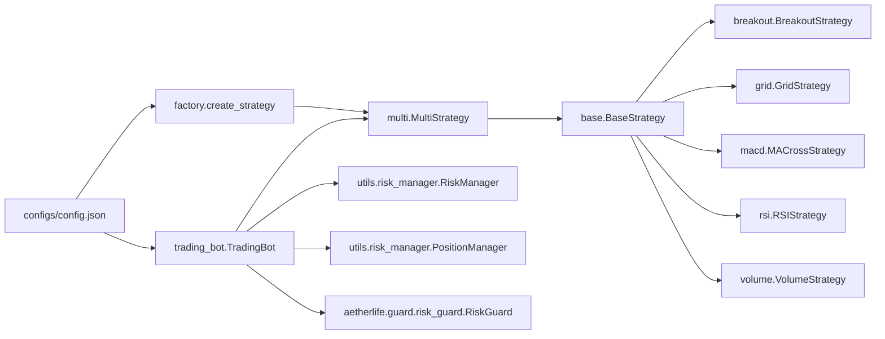

# 多策略组合

<cite>
**本文引用的文件**
- [src/strategies/multi.py](file://src/strategies/multi.py)
- [src/strategies/base.py](file://src/strategies/base.py)
- [src/strategies/factory.py](file://src/strategies/factory.py)
- [src/strategies/breakout.py](file://src/strategies/breakout.py)
- [src/strategies/grid.py](file://src/strategies/grid.py)
- [src/strategies/macd.py](file://src/strategies/macd.py)
- [src/strategies/rsi.py](file://src/strategies/rsi.py)
- [src/strategies/volume.py](file://src/strategies/volume.py)
- [src/utils/risk_manager.py](file://src/utils/risk_manager.py)
- [src/aetherlife/guard/risk_guard.py](file://src/aetherlife/guard/risk_guard.py)
- [src/trading_bot.py](file://src/trading_bot.py)
- [configs/config.json](file://configs/config.json)
- [src/utils/config.py](file://src/utils/config.py)
</cite>

## 目录
1. [引言](#引言)
2. [项目结构](#项目结构)
3. [核心组件](#核心组件)
4. [架构总览](#架构总览)
5. [组件详解](#组件详解)
6. [依赖关系分析](#依赖关系分析)
7. [性能与风险考量](#性能与风险考量)
8. [故障排查指南](#故障排查指南)
9. [结论](#结论)
10. [附录](#附录)

## 引言
本文件面向“多策略组合系统”的技术文档，围绕策略权重分配、信号融合机制与风险管理展开，系统阐述如何在现有策略体系上构建组合策略，如何进行信号聚合与权重调整，以及在不同市场环境下如何实现风险分散与收益增强。同时给出参数优化思路与回测框架建议，帮助读者在真实交易环境中落地该系统。

## 项目结构
系统采用分层架构：数据层负责行情与行情快照获取；策略层提供多种独立策略及组合策略工厂；执行层对接交易所客户端；风控层包含基础风控与守护层；主控制器驱动整体流程。

图表来源
- [src/trading_bot.py](file://src/trading_bot.py#L1-L346)
- [src/strategies/multi.py](file://src/strategies/multi.py#L1-L38)
- [src/strategies/factory.py](file://src/strategies/factory.py#L1-L36)
- [src/utils/risk_manager.py](file://src/utils/risk_manager.py#L1-L388)
- [src/aetherlife/guard/risk_guard.py](file://src/aetherlife/guard/risk_guard.py#L1-L84)

章节来源
- [src/trading_bot.py](file://src/trading_bot.py#L1-L346)
- [src/strategies/multi.py](file://src/strategies/multi.py#L1-L38)
- [src/strategies/factory.py](file://src/strategies/factory.py#L1-L36)
- [src/utils/risk_manager.py](file://src/utils/risk_manager.py#L1-L388)
- [src/aetherlife/guard/risk_guard.py](file://src/aetherlife/guard/risk_guard.py#L1-L84)

## 核心组件
- 多策略组合（MultiStrategy）：聚合多个子策略的信号，按权重加总并归一化输出最终信号。
- 策略工厂（create_strategy）：根据配置递归创建子策略树，支持“multi”类型组合策略。
- 策略基类（BaseStrategy）：定义统一接口（analyze、generate_signals），并提供参数导出与信号验证钩子。
- 风控与仓位（RiskManager、PositionManager）：提供仓位规模计算、止损止盈、追踪止损、熔断与日限等风控能力。
- 守护层（RiskGuard）：在执行前进行电路断路器与大额人工确认拦截。
- 主控制器（TradingBot）：拉取数据、调用策略、风控检查、下单与平仓、统计与日志。

章节来源
- [src/strategies/multi.py](file://src/strategies/multi.py#L1-L38)
- [src/strategies/base.py](file://src/strategies/base.py#L1-L31)
- [src/strategies/factory.py](file://src/strategies/factory.py#L1-L36)
- [src/utils/risk_manager.py](file://src/utils/risk_manager.py#L1-L388)
- [src/aetherlife/guard/risk_guard.py](file://src/aetherlife/guard/risk_guard.py#L1-L84)
- [src/trading_bot.py](file://src/trading_bot.py#L1-L346)

## 架构总览
下图展示从数据获取到下单执行的端到端流程，以及风控与守护层的介入点。

图表来源
- [src/trading_bot.py](file://src/trading_bot.py#L92-L255)
- [src/utils/risk_manager.py](file://src/utils/risk_manager.py#L175-L194)
- [src/aetherlife/guard/risk_guard.py](file://src/aetherlife/guard/risk_guard.py#L48-L68)

## 组件详解

### 多策略组合（MultiStrategy）
- 设计理念
  - 将多个独立策略的信号进行聚合，形成更稳健的信号输出。
  - 通过权重控制各策略影响力，便于在不同市场阶段动态调整。
- 关键实现
  - analyze：依次调用子策略的分析逻辑，为后续信号生成做准备。
  - generate_signals：为每个子策略生成信号列，累加加权得到综合信号，再进行阈值归一化输出最终信号。
  - 权重：构造时接收权重列表，未指定则均分。
- 信号融合机制
  - 子策略各自输出信号列，随后按权重加总。
  - 归一化规则将连续值映射到离散动作空间（例如-1/0/1）以适配交易执行。
- 风险管理衔接
  - 组合信号可作为下单强度输入，配合风控模块的仓位计算使用。

图表来源
- [src/strategies/multi.py](file://src/strategies/multi.py#L16-L37)

章节来源
- [src/strategies/multi.py](file://src/strategies/multi.py#L1-L38)

### 策略工厂（create_strategy）
- 功能
  - 根据配置递归创建策略树，支持“multi”类型组合策略。
  - 对“multi”类型：读取子策略配置列表，逐个创建子策略实例，传入权重列表构造MultiStrategy。
- 使用场景
  - 在配置文件中声明“multi”，并提供子策略数组与权重，即可构建任意组合。

图表来源
- [src/strategies/factory.py](file://src/strategies/factory.py#L10-L35)

章节来源
- [src/strategies/factory.py](file://src/strategies/factory.py#L1-L36)

### 策略基类（BaseStrategy）
- 角色
  - 定义策略统一接口：analyze（计算指标）、generate_signals（生成信号）。
  - 提供参数导出与信号验证钩子，便于调试与扩展。
- 与组合策略的关系
  - MultiStrategy依赖所有子策略遵循同一接口，确保可插拔与可组合。

图表来源
- [src/strategies/base.py](file://src/strategies/base.py#L6-L31)
- [src/strategies/multi.py](file://src/strategies/multi.py#L6-L14)

章节来源
- [src/strategies/base.py](file://src/strategies/base.py#L1-L31)
- [src/strategies/multi.py](file://src/strategies/multi.py#L1-L38)

### 典型策略（用于组合）
- 突破策略（BreakoutStrategy）：趋势跟踪，结合布林带、ATR与RSI过滤。
- 网格策略（GridStrategy）：震荡区间内高抛低吸。
- 均线交叉（MACrossStrategy）：趋势反转信号。
- RSI策略（RSIStrategy）：超买超卖反转。
- 成交量策略（VolumeStrategy）：放量确认方向。

这些策略共同构成组合策略的“因子池”，通过权重分配与信号融合实现协同。

章节来源
- [src/strategies/breakout.py](file://src/strategies/breakout.py#L1-L79)
- [src/strategies/grid.py](file://src/strategies/grid.py#L1-L63)
- [src/strategies/macd.py](file://src/strategies/macd.py#L1-L40)
- [src/strategies/rsi.py](file://src/strategies/rsi.py#L1-L42)
- [src/strategies/volume.py](file://src/strategies/volume.py#L1-L44)

### 风控与守护层
- 风控管理器（RiskManager）
  - 仓位规模：基于账户余额、最大仓位比例与信号强度计算。
  - 止损止盈：固定阈值与追踪止损联动。
  - 熔断与日限：单日最大亏损、最大交易次数、连续亏损限制。
- 仓位管理器（PositionManager）
  - 开仓/平仓/更新浮动盈亏，维护止盈止损价格。
- 守护层（RiskGuard）
  - 执行前拦截：电路断路器、单日最大亏损、大额人工确认（HITL）。

图表来源
- [src/utils/risk_manager.py](file://src/utils/risk_manager.py#L12-L241)
- [src/aetherlife/guard/risk_guard.py](file://src/aetherlife/guard/risk_guard.py#L23-L84)

章节来源
- [src/utils/risk_manager.py](file://src/utils/risk_manager.py#L1-L388)
- [src/aetherlife/guard/risk_guard.py](file://src/aetherlife/guard/risk_guard.py#L1-L84)

### 主控制器（TradingBot）
- 职责
  - 初始化数据获取器、客户端与策略。
  - 循环拉取数据、分析生成信号、风控检查、执行下单与平仓、更新仓位与统计。
- 关键流程
  - fetch_market_data：并行获取OHLCV与Ticker。
  - analyze：调用策略生成信号并取最新值。
  - execute_signal：根据信号与风控条件下单或平仓。
  - check_positions：周期性检查止损止盈并自动平仓。

章节来源
- [src/trading_bot.py](file://src/trading_bot.py#L27-L283)

## 依赖关系分析
- 组合策略依赖
  - MultiStrategy依赖BaseStrategy接口，确保子策略可替换。
  - 工厂create_strategy负责递归创建子策略树，支持“multi”类型。
- 风控与执行耦合
  - TradingBot在下单前调用RiskManager.can_trade与RiskGuard.check，保证合规。
  - PositionManager与RiskManager相互配合，记录交易并更新日统计。
- 配置与校验
  - 配置文件支持策略与风控参数；配置校验模块确保字段合法。

图表来源
- [src/strategies/factory.py](file://src/strategies/factory.py#L10-L35)
- [src/strategies/multi.py](file://src/strategies/multi.py#L6-L14)
- [src/trading_bot.py](file://src/trading_bot.py#L30-L85)
- [configs/config.json](file://configs/config.json#L1-L28)

章节来源
- [src/strategies/factory.py](file://src/strategies/factory.py#L1-L36)
- [src/strategies/multi.py](file://src/strategies/multi.py#L1-L38)
- [src/trading_bot.py](file://src/trading_bot.py#L1-L346)
- [configs/config.json](file://configs/config.json#L1-L28)

## 性能与风险考量
- 信号融合与权重
  - 加权平均能放大优势策略的影响，但需注意极端权重导致的单一化风险。
  - 归一化阈值（如正负0.3）可减少噪声，但也可能抑制细粒度信号。
- 风险分散与收益增强
  - 不同策略在不同市场阶段表现差异较大：突破适合趋势、网格适合震荡、RSI适合反转、成交量提供确认。
  - 组合策略通过权重与阈值在不同环境下的表现对比，可实现更稳健的收益曲线。
- 参数优化建议
  - 基于回测框架的夏普比率优化：以滑点、手续费、最大回撤为约束，寻找最优权重与阈值。
  - 遗传算法/贝叶斯优化：对权重、阈值与策略参数进行联合搜索。
- 实施要点
  - 严格区分“信号强度”与“下单强度”，风控模块据此计算仓位规模。
  - 熔断与日限防止系统在不利阶段继续扩大损失。

[本节为通用指导，无需列出具体文件来源]

## 故障排查指南
- 信号异常
  - 检查子策略是否正确生成信号列，确认MultiStrategy是否正确收集与加权。
  - 核对归一化阈值是否合理，避免过度抑制信号。
- 下单失败
  - 核对风控限制（熔断、日限、连败限制）与守护层拦截原因。
  - 检查最小下单量精度与账户余额是否满足要求。
- 仓位与盈亏
  - 使用PositionManager查询当前仓位，确认止盈止损设置是否生效。
  - 通过RiskManager.get_stats核对日统计与总交易次数。

章节来源
- [src/strategies/multi.py](file://src/strategies/multi.py#L16-L37)
- [src/utils/risk_manager.py](file://src/utils/risk_manager.py#L175-L241)
- [src/aetherlife/guard/risk_guard.py](file://src/aetherlife/guard/risk_guard.py#L48-L68)
- [src/trading_bot.py](file://src/trading_bot.py#L115-L205)

## 结论
多策略组合通过统一接口与工厂模式实现策略的即插即用，利用加权聚合与阈值归一化形成稳健信号，并与风控与守护层紧密协作，在不同市场环境下实现风险分散与收益增强。建议在实际部署中结合回测与参数优化，持续迭代权重与阈值，以适配不断变化的市场。

[本节为总结性内容，无需列出具体文件来源]

## 附录

### 组合策略构建方法
- 策略选择标准
  - 市场适应性：趋势/震荡/反转/量价策略互补。
  - 信号质量：波动率、胜率、盈亏比、最大回撤等指标。
- 相关性分析
  - 计算子策略信号间的互相关与IC（信息系数），剔除高度冗余策略。
- 夏普比率优化
  - 在约束（最大回撤、换手率、手续费）下最大化夏普比率，确定权重向量。

[本节为方法论描述，无需列出具体文件来源]

### 回测框架设计与绩效评估
- 回测框架
  - 基于历史OHLCV，逐根K线运行策略，记录信号、成交、盈亏与净值曲线。
- 绩效指标
  - 收益率、年化波动率、夏普比率、最大回撤、胜率、盈亏比、最长连续亏损等。

[本节为概念性内容，无需列出具体文件来源]

### 配置示例与参数说明
- 配置文件位置与用途
  - configs/config.json：系统级配置，包含交易所、交易对、时间周期、策略与风控参数。
- 关键参数
  - 策略：strategy、strategy_config（如突破策略的窗口与阈值）。
  - 风控：max_position_pct、stop_loss_pct、take_profit_pct、max_daily_trades、max_consecutive_losses、circuit_breaker_loss_pct。
  - AI增强：可选开关，用于后续扩展。

章节来源
- [configs/config.json](file://configs/config.json#L1-L28)
- [src/utils/config.py](file://src/utils/config.py#L15-L49)