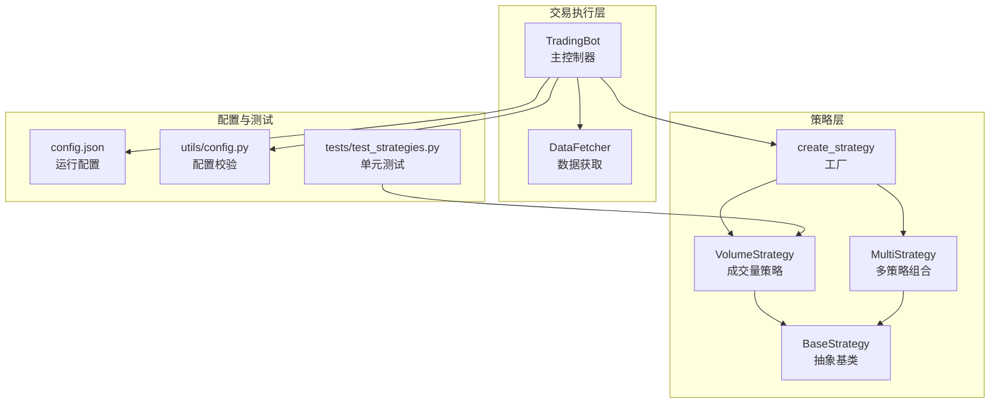
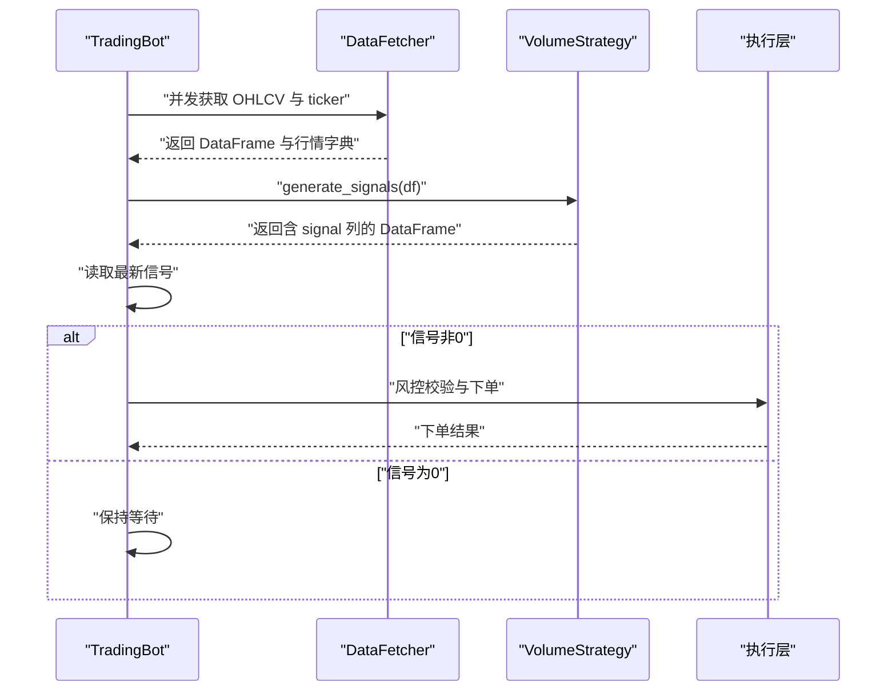
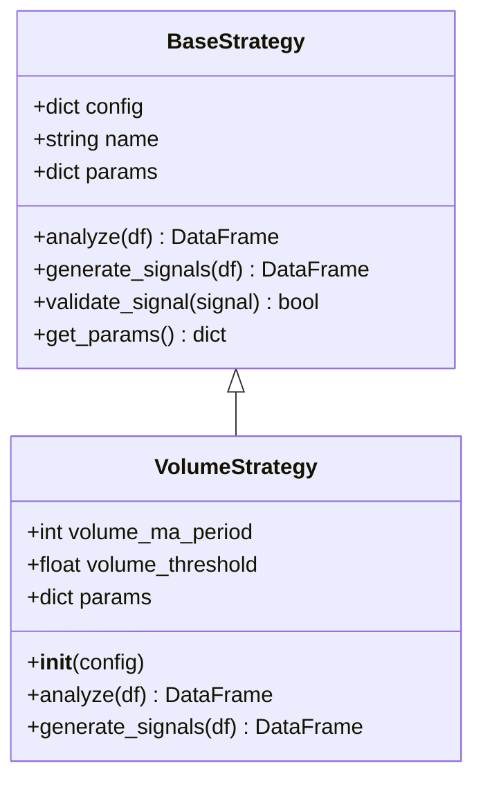
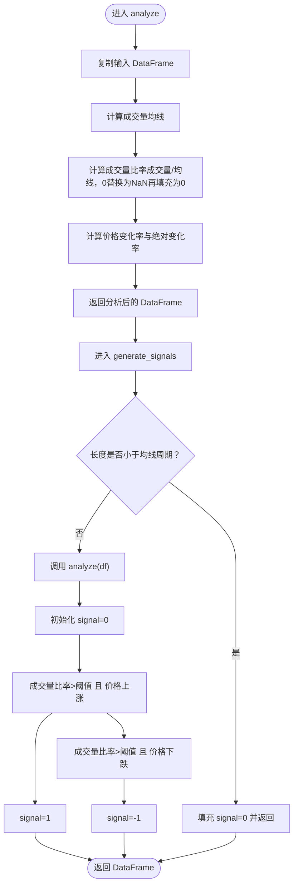
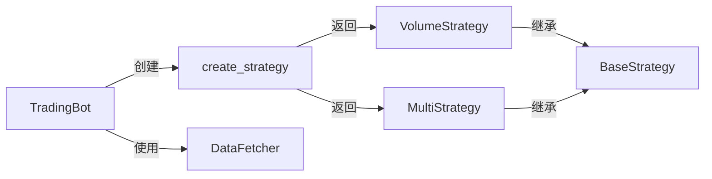

# 成交量策略

<cite>
**本文档引用的文件**
- [src/strategies/volume.py](file://src/strategies/volume.py)
- [src/strategies/base.py](file://src/strategies/base.py)
- [src/strategies/factory.py](file://src/strategies/factory.py)
- [src/strategies/multi.py](file://src/strategies/multi.py)
- [src/trading_bot.py](file://src/trading_bot.py)
- [src/data/data_fetcher.py](file://src/data/data_fetcher.py)
- [configs/config.json](file://configs/config.json)
- [src/utils/config.py](file://src/utils/config.py)
- [tests/test_strategies.py](file://tests/test_strategies.py)
</cite>

## 目录
1. [简介](#简介)
2. [项目结构](#项目结构)
3. [核心组件](#核心组件)
4. [架构总览](#架构总览)
5. [详细组件分析](#详细组件分析)
6. [依赖关系分析](#依赖关系分析)
7. [性能考量](#性能考量)
8. [故障排查指南](#故障排查指南)
9. [结论](#结论)
10. [附录](#附录)

## 简介
本文件面向“成交量策略”的技术文档，围绕成交量分析的基本原理、量价关系理论、常用指标与信号生成机制展开，并结合本仓库现有实现进行深入解析。内容涵盖：
- 成交量分析基础与量价关系理论
- 常用成交量指标（如成交量比率）的计算方法
- 策略信号生成机制（成交量突破、量价配合、背离信号判定）
- 在不同市场阶段（底部确认、顶部反转、趋势延续）的应用要点
- 参数设置指南与多时间框架验证思路
- 结合本仓库的实现路径与调用流程

## 项目结构
成交量策略位于策略层，采用统一的策略基类接口，通过工厂模式创建与组合，最终由交易机器人驱动执行。

图表来源
- [src/strategies/volume.py](file://src/strategies/volume.py#L6-L43)
- [src/strategies/base.py](file://src/strategies/base.py#L6-L30)
- [src/strategies/factory.py](file://src/strategies/factory.py#L10-L35)
- [src/strategies/multi.py](file://src/strategies/multi.py#L6-L37)
- [src/trading_bot.py](file://src/trading_bot.py#L13-L85)
- [src/data/data_fetcher.py](file://src/data/data_fetcher.py#L17-L62)
- [configs/config.json](file://configs/config.json#L1-L28)
- [src/utils/config.py](file://src/utils/config.py#L15-L37)
- [tests/test_strategies.py](file://tests/test_strategies.py#L13-L50)

章节来源
- [src/strategies/volume.py](file://src/strategies/volume.py#L6-L43)
- [src/strategies/base.py](file://src/strategies/base.py#L6-L30)
- [src/strategies/factory.py](file://src/strategies/factory.py#L10-L35)
- [src/strategies/multi.py](file://src/strategies/multi.py#L6-L37)
- [src/trading_bot.py](file://src/trading_bot.py#L13-L85)
- [src/data/data_fetcher.py](file://src/data/data_fetcher.py#L17-L62)
- [configs/config.json](file://configs/config.json#L1-L28)
- [src/utils/config.py](file://src/utils/config.py#L15-L37)
- [tests/test_strategies.py](file://tests/test_strategies.py#L13-L50)

## 核心组件
- VolumeStrategy：基于成交量与价格变化的简单量能信号策略，核心逻辑包含成交量均值、成交量比率与价格变化率的计算，并据此生成多/空信号。
- BaseStrategy：所有策略的抽象基类，定义了 analyze 与 generate_signals 的规范。
- MultiStrategy：多策略组合器，支持对多个子策略的信号加权聚合。
- TradingBot：主控制器，负责初始化数据源、策略实例、拉取数据、生成信号与执行交易。
- DataFetcher：数据获取器，提供 OHLCV 与行情数据的异步获取能力。
- 工厂 create_strategy：根据配置动态创建具体策略实例，包括多策略组合。

章节来源
- [src/strategies/volume.py](file://src/strategies/volume.py#L6-L43)
- [src/strategies/base.py](file://src/strategies/base.py#L6-L30)
- [src/strategies/multi.py](file://src/strategies/multi.py#L6-L37)
- [src/trading_bot.py](file://src/trading_bot.py#L13-L85)
- [src/data/data_fetcher.py](file://src/data/data_fetcher.py#L17-L62)
- [src/strategies/factory.py](file://src/strategies/factory.py#L10-L35)

## 架构总览
成交量策略在系统中的工作流如下：
- TradingBot 初始化时通过工厂创建 VolumeStrategy 实例
- 每轮循环中，TradingBot 并发获取 OHLCV 与 ticker 数据
- 将 OHLCV 传入策略的 generate_signals，得到最新信号
- 若信号非零，则进入风控校验与下单执行流程

图表来源
- [src/trading_bot.py](file://src/trading_bot.py#L92-L113)
- [src/strategies/volume.py](file://src/strategies/volume.py#L33-L43)
- [src/data/data_fetcher.py](file://src/data/data_fetcher.py#L40-L62)

章节来源
- [src/trading_bot.py](file://src/trading_bot.py#L92-L113)
- [src/strategies/volume.py](file://src/strategies/volume.py#L33-L43)
- [src/data/data_fetcher.py](file://src/data/data_fetcher.py#L40-L62)

## 详细组件分析

### VolumeStrategy 组件分析
- 设计要点
  - 继承自 BaseStrategy，遵循统一的 analyze/generate_signals 接口
  - 参数化配置：成交量均线周期与成交量阈值
  - 计算指标：成交量均值、成交量比率（成交量/成交量均值）、价格变化率与绝对变化率
  - 信号生成：当成交量超过阈值且价格同向变动时生成多/空信号；否则为持有

图表来源
- [src/strategies/base.py](file://src/strategies/base.py#L6-L30)
- [src/strategies/volume.py](file://src/strategies/volume.py#L6-L17)

- 关键算法流程（成交量比率与信号生成）

图表来源
- [src/strategies/volume.py](file://src/strategies/volume.py#L19-L43)

- 参数与行为
  - volume_ma_period：用于计算成交量均值的时间窗口，默认 20
  - volume_threshold：成交量放大量阈值，默认 2（即成交量至少为均值的 2 倍）
  - 当成交量显著放大且价格同向变动时，策略给出明确方向信号；否则为持有

- 与多策略组合的关系
  - MultiStrategy 可以对多个子策略（包括 VolumeStrategy）的信号进行加权聚合，形成综合信号

章节来源
- [src/strategies/volume.py](file://src/strategies/volume.py#L6-L43)
- [src/strategies/multi.py](file://src/strategies/multi.py#L21-L37)

### 策略信号生成机制
- 成交量突破
  - 通过成交量比率与阈值比较判断是否出现放量
- 量价配合
  - 仅在成交量放大且价格朝同一方向变动时才生成信号，避免假突破
- 背离信号
  - 当前实现未直接计算 OBV、能量潮等指标，但可通过扩展在 analyze 中加入相应列后参与信号生成

章节来源
- [src/strategies/volume.py](file://src/strategies/volume.py#L19-L43)

### 多时间框架验证方法
- 当前 TradingBot 使用单一时间周期（由配置决定），若需多时间框架验证，可在 TradingBot 层扩展：
  - 为不同时间周期分别拉取 OHLCV
  - 对每个周期独立运行 VolumeStrategy 并汇总信号
  - 仅当主周期与辅助周期信号一致时才执行交易

章节来源
- [src/trading_bot.py](file://src/trading_bot.py#L92-L113)
- [configs/config.json](file://configs/config.json#L7-L7)

### 与数据获取的集成
- TradingBot 并发获取 OHLCV 与 ticker，确保信号生成时具备最新价格与成交量
- DataFetcher 提供 Binance 与 OKX 的异步接口，支持 WebSocket 订阅（用于实时行情）

章节来源
- [src/trading_bot.py](file://src/trading_bot.py#L92-L99)
- [src/data/data_fetcher.py](file://src/data/data_fetcher.py#L40-L62)
- [src/data/data_fetcher.py](file://src/data/data_fetcher.py#L188-L234)
- [src/data/data_fetcher.py](file://src/data/data_fetcher.py#L327-L396)

## 依赖关系分析
- VolumeStrategy 依赖 BaseStrategy 的接口契约
- TradingBot 通过工厂 create_strategy 创建策略实例
- MultiStrategy 可组合多个策略，实现信号融合
- TradingBot 依赖 DataFetcher 提供 OHLCV 与 ticker

图表来源
- [src/trading_bot.py](file://src/trading_bot.py#L83-L85)
- [src/strategies/factory.py](file://src/strategies/factory.py#L10-L35)
- [src/strategies/volume.py](file://src/strategies/volume.py#L6-L17)
- [src/strategies/multi.py](file://src/strategies/multi.py#L6-L14)
- [src/data/data_fetcher.py](file://src/data/data_fetcher.py#L17-L62)

章节来源
- [src/trading_bot.py](file://src/trading_bot.py#L83-L85)
- [src/strategies/factory.py](file://src/strategies/factory.py#L10-L35)
- [src/strategies/volume.py](file://src/strategies/volume.py#L6-L17)
- [src/strategies/multi.py](file://src/strategies/multi.py#L6-L14)
- [src/data/data_fetcher.py](file://src/data/data_fetcher.py#L17-L62)

## 性能考量
- 计算复杂度
  - analyze 中的滚动均值与比率计算为 O(N)，其中 N 为 K 线条数
  - generate_signals 为 O(N)，整体为线性复杂度
- 内存占用
  - 新增列（如 volume_ma、volume_ratio、price_change）会增加内存占用，建议在长序列上谨慎使用
- I/O 与并发
  - TradingBot 并发获取 OHLCV 与 ticker，减少等待时间，提高响应速度

章节来源
- [src/strategies/volume.py](file://src/strategies/volume.py#L19-L43)
- [src/trading_bot.py](file://src/trading_bot.py#L95-L98)

## 故障排查指南
- 空 DataFrame 或长度不足
  - 当输入 DataFrame 为空或长度小于均线周期时，策略会填充 signal=0 并返回
- 配置校验失败
  - 使用 utils/config.py 的 validate_config 校验 exchange、symbols、strategy 等关键字段
- 策略未生效
  - 检查 strategy 配置是否正确传入 create_strategy
  - 确认 TradingBot 的 analyze 是否正确读取最新信号

章节来源
- [src/strategies/volume.py](file://src/strategies/volume.py#L34-L38)
- [src/utils/config.py](file://src/utils/config.py#L15-L37)
- [src/trading_bot.py](file://src/trading_bot.py#L83-L85)

## 结论
本成交量策略以“成交量放大 + 量价配合”为核心思想，通过简单的成交量比率与价格变化率实现信号生成，具备良好的可解释性与较低的计算复杂度。结合多策略组合与多时间框架验证，可进一步提升策略稳健性。对于更丰富的成交量指标（如 OBV、能量潮），可在 analyze 中扩展相应列后参与信号生成。

## 附录

### 常用成交量指标与计算方法（概念性说明）
- 成交量比率（Volume Ratio）
  - 定义：当日成交量 / 近期成交量均值
  - 用途：衡量当日放量程度，作为信号强度参考
- OBV（On Balance Volume）
  - 定义：根据价格涨跌累计成交量，价格涨则加当日量，跌则减当日量
  - 用途：判断资金流入/流出趋势
- 能量潮（Chaikin Oscillator）
  - 定义：快线（短期 EMA）与慢线（长期 EMA）之差
  - 用途：衡量资金流入强度的变化速率

说明：以上为通用技术分析概念，当前仓库实现未直接计算这些指标，但可在 VolumeStrategy.analyze 中扩展相应列后参与信号生成。

### 策略参数设置指南
- volume_ma_period
  - 建议范围：10–50（取决于时间周期与市场波动）
  - 影响：均线越短越敏感，越长越平滑
- volume_threshold
  - 建议范围：1.5–3.0（典型放量阈值）
  - 影响：阈值越高，信号越稀少，胜率可能提升但频率下降

章节来源
- [src/strategies/volume.py](file://src/strategies/volume.py#L12-L17)

### 实战应用与案例思路
- 底部确认
  - 观察放量回调或缩量盘整后的放量突破，结合价格形态与趋势线
- 顶部反转
  - 放量滞涨或放量冲高回落，结合技术指标背离
- 趋势延续
  - 在上升/下降趋势中，持续放量伴随价格同向运动

说明：以上为通用交易理念，具体信号应以策略输出为准。

### 多时间框架验证方法（实现建议）
- 在 TradingBot 层为不同时间周期分别获取 OHLCV
- 分别运行 VolumeStrategy 并汇总信号
- 仅当主周期与辅助周期信号一致时才执行交易

章节来源
- [src/trading_bot.py](file://src/trading_bot.py#L92-L99)
- [configs/config.json](file://configs/config.json#L7-L7)