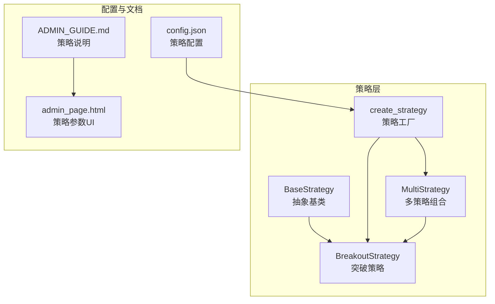
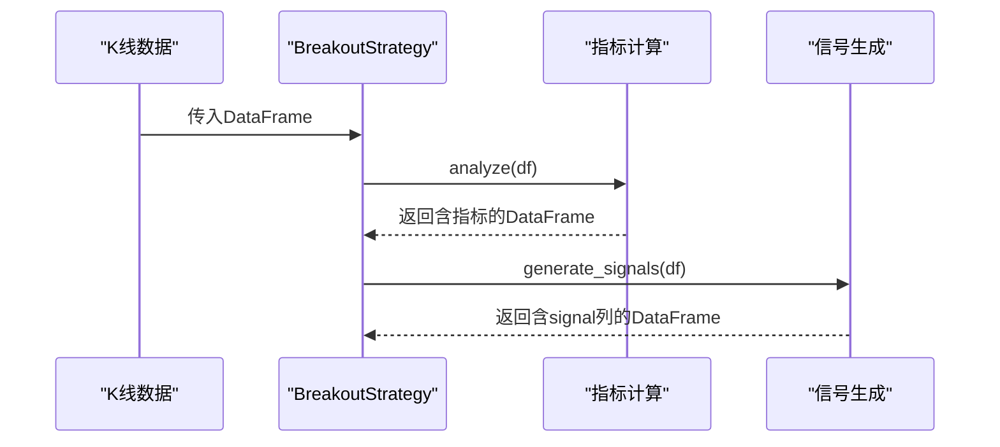
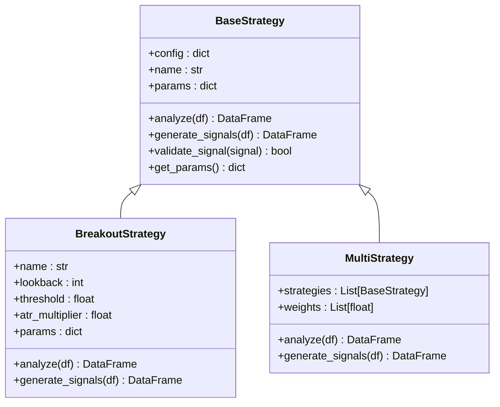
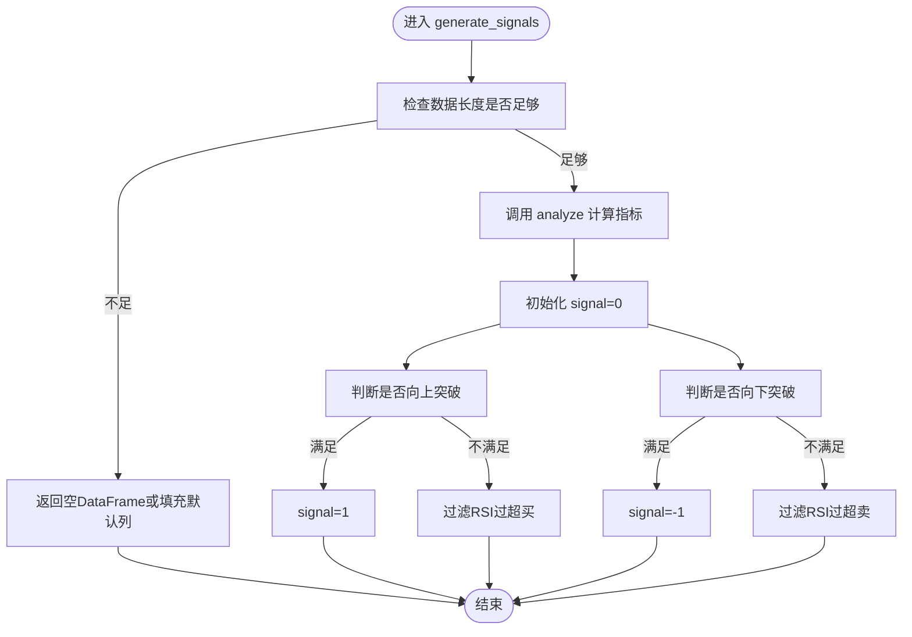
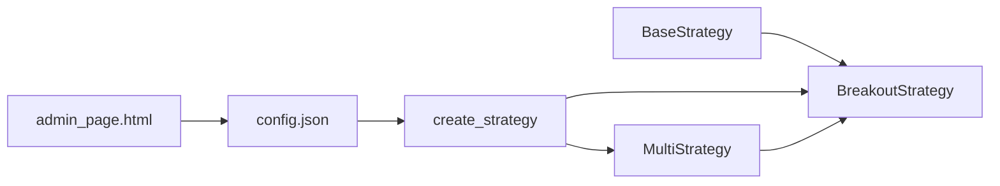

# 突破策略

<cite>
**本文引用的文件列表**
- [src/strategies/breakout.py](file://src/strategies/breakout.py)
- [src/strategies/base.py](file://src/strategies/base.py)
- [src/strategies/factory.py](file://src/strategies/factory.py)
- [src/strategies/multi.py](file://src/strategies/multi.py)
- [tests/test_strategies.py](file://tests/test_strategies.py)
- [configs/config.json](file://configs/config.json)
- [docs/ADMIN_GUIDE.md](file://docs/ADMIN_GUIDE.md)
- [src/ui/admin_page.html](file://src/ui/admin_page.html)
- [src/ui/dashboard.py](file://src/ui/dashboard.py)
- [src/aetherlife/evolution/engine.py](file://src/aetherlife/evolution/engine.py)
</cite>

## 目录
1. [简介](#简介)
2. [项目结构](#项目结构)
3. [核心组件](#核心组件)
4. [架构总览](#架构总览)
5. [详细组件分析](#详细组件分析)
6. [依赖关系分析](#依赖关系分析)
7. [性能考量](#性能考量)
8. [故障排查指南](#故障排查指南)
9. [结论](#结论)
10. [附录](#附录)

## 简介
本文件面向开发者与策略使用者，系统化阐述“突破策略”的工作原理与实现细节，覆盖以下主题：
- 价格突破通道的识别机制
- 支撑阻力位的计算方法
- 突破信号的生成逻辑
- 核心参数配置（突破周期、阈值、ATR倍数等）
- 信号规则（向上突破买入、向下突破卖出）
- 适用市场环境与时间框架建议
- 参数调优指南与实际代码示例路径

## 项目结构
突破策略位于策略子模块中，采用“基类 + 具体策略 + 工厂 + 多策略组合”的分层设计，便于扩展与复用。关键文件如下：
- 策略基类：定义统一接口与通用能力
- 突破策略：实现突破通道识别与信号生成
- 策略工厂：按类型创建具体策略实例
- 多策略组合：聚合多个策略信号并加权融合
- 配置与文档：策略参数、UI说明与风控建议
- 测试：验证指标生成与信号有效性

图表来源
- [src/strategies/base.py](file://src/strategies/base.py#L6-L31)
- [src/strategies/breakout.py](file://src/strategies/breakout.py#L6-L79)
- [src/strategies/factory.py](file://src/strategies/factory.py#L10-L36)
- [src/strategies/multi.py](file://src/strategies/multi.py#L6-L38)
- [configs/config.json](file://configs/config.json#L10-L14)
- [docs/ADMIN_GUIDE.md](file://docs/ADMIN_GUIDE.md#L54-L61)
- [src/ui/admin_page.html](file://src/ui/admin_page.html#L366-L376)

章节来源
- [src/strategies/base.py](file://src/strategies/base.py#L6-L31)
- [src/strategies/breakout.py](file://src/strategies/breakout.py#L6-L79)
- [src/strategies/factory.py](file://src/strategies/factory.py#L10-L36)
- [src/strategies/multi.py](file://src/strategies/multi.py#L6-L38)
- [configs/config.json](file://configs/config.json#L10-L14)
- [docs/ADMIN_GUIDE.md](file://docs/ADMIN_GUIDE.md#L54-L61)
- [src/ui/admin_page.html](file://src/ui/admin_page.html#L366-L376)

## 核心组件
- 策略基类 BaseStrategy：定义 analyze 与 generate_signals 抽象方法，提供参数获取与信号校验的通用能力。
- 突破策略 BreakoutStrategy：继承基类，实现指标计算与信号生成；包含回看周期、突破阈值、ATR倍数等参数。
- 策略工厂 create_strategy：按字符串类型创建策略实例，支持多策略组合。
- 多策略组合 MultiStrategy：对多个子策略分别生成信号并加权融合，输出最终信号。

章节来源
- [src/strategies/base.py](file://src/strategies/base.py#L6-L31)
- [src/strategies/breakout.py](file://src/strategies/breakout.py#L6-L79)
- [src/strategies/factory.py](file://src/strategies/factory.py#L10-L36)
- [src/strategies/multi.py](file://src/strategies/multi.py#L6-L38)

## 架构总览
突破策略在数据流中的位置与交互如下：
- 输入：K线数据（开盘、最高、最低、收盘、成交量）
- 中间：指标计算（移动平均、最高/最低、ATR、布林带、MACD、RSI）
- 输出：信号列（1/0/-1），用于后续下单执行

图表来源
- [src/strategies/breakout.py](file://src/strategies/breakout.py#L21-L79)

章节来源
- [src/strategies/breakout.py](file://src/strategies/breakout.py#L21-L79)

## 详细组件分析

### 突破策略类 BreakoutStrategy
- 继承关系：继承自 BaseStrategy，遵循统一接口。
- 关键参数：
  - 回看周期（lookback_period）：用于计算最高/最低价格窗口长度
  - 突破阈值（threshold）：突破触发的最小百分比
  - ATR倍数（atr_multiplier）：用于动态止损距离的倍数
- 指标计算（analyze）：
  - 移动平均：20日与50日简单移动平均
  - 最高价/最低价：滚动窗口最高/最低
  - ATR：真实波幅滚动均值
  - 布林带：20日均值与2倍标准差上下轨
  - MACD：快线与慢线差值及信号线
  - RSI：避免除零处理的相对强弱指标
- 信号生成（generate_signals）：
  - 向上突破：收盘价大于前一根K线最高价×(1+阈值)，且RSI不过度超买
  - 向下突破：收盘价小于前一根K线最低价×(1-阈值)，且RSI不过度超卖
  - 缺省保护：当数据不足或为空时返回空DataFrame或填充默认信号列

图表来源
- [src/strategies/base.py](file://src/strategies/base.py#L6-L31)
- [src/strategies/breakout.py](file://src/strategies/breakout.py#L6-L79)
- [src/strategies/multi.py](file://src/strategies/multi.py#L6-L38)

章节来源
- [src/strategies/breakout.py](file://src/strategies/breakout.py#L6-L79)
- [src/strategies/base.py](file://src/strategies/base.py#L6-L31)
- [src/strategies/multi.py](file://src/strategies/multi.py#L6-L38)

### 信号生成规则详解
- 向上突破买入信号：
  - 触发条件：当前收盘价 > 前一根K线的最高价 × (1 + 阈值)
  - 过滤条件：RSI ≤ 80（避免过度超买）
- 向下突破卖出信号：
  - 触发条件：当前收盘价 < 前一根K线的最低价 × (1 - 阈值)
  - 过滤条件：RSI ≥ 20（避免过度超卖）
- 默认保护：
  - 当数据长度不足或为空时，返回空DataFrame或确保signal列存在

图表来源
- [src/strategies/breakout.py](file://src/strategies/breakout.py#L64-L79)

章节来源
- [src/strategies/breakout.py](file://src/strategies/breakout.py#L64-L79)

### 参数配置与调优
- 核心参数（来自配置文件与策略类）：
  - 回看周期（lookback_period）：决定突破通道的时间范围
  - 突破阈值（threshold）：突破触发的最小百分比
  - ATR倍数（atr_multiplier）：用于动态止损距离的倍数
- UI与文档中的参数说明：
  - 管理后台策略参数页提供回看周期与阈值输入框
  - 管理指南明确“突破策略”参数项与建议范围
- 配置示例（来自配置文件）：
  - 策略类型：breakout
  - 策略参数：lookback_period、threshold、atr_multiplier
  - 风控参数：最大仓位比例、止损比例、止盈比例、每日最大亏损
- 参数调优建议（结合实现与文档）：
  - 回看周期：在15~25之间尝试，观察突破频率与误报率
  - 阈值：在0.3%~0.8%之间尝试，兼顾突破灵敏度与噪音过滤
  - ATR倍数：在1.5~3之间尝试，平衡止损距离与回撤
  - RSI过滤：维持RSI超买/超卖区间以减少逆势信号

章节来源
- [configs/config.json](file://configs/config.json#L10-L14)
- [src/ui/admin_page.html](file://src/ui/admin_page.html#L366-L376)
- [docs/ADMIN_GUIDE.md](file://docs/ADMIN_GUIDE.md#L54-L61)
- [src/strategies/breakout.py](file://src/strategies/breakout.py#L12-L19)

### 适用市场环境与时间框架
- 市场环境：
  - 突破策略更适合趋势明显的行情；震荡行情可能导致磨损
- 时间框架：
  - 支持多种时间周期（1m, 5m, 15m, 1h, 4h, 1d）
  - 建议在趋势初期或突破确认后使用更高时间框架进行确认
- 风控建议：
  - 建议止损比例1%-3%，止盈为止损的2-3倍
  - 单笔仓位不超过总资金的10%，每日最大亏损不超过5%

章节来源
- [src/ui/admin_page.html](file://src/ui/admin_page.html#L384-L388)
- [docs/ADMIN_GUIDE.md](file://docs/ADMIN_GUIDE.md#L82-L84)
- [docs/ADMIN_GUIDE.md](file://docs/ADMIN_GUIDE.md#L94-L104)

### 实际代码示例与测试
- 突破策略类与方法：
  - 类定义与参数初始化：[src/strategies/breakout.py](file://src/strategies/breakout.py#L6-L19)
  - 指标计算（analyze）：[src/strategies/breakout.py](file://src/strategies/breakout.py#L21-L62)
  - 信号生成（generate_signals）：[src/strategies/breakout.py](file://src/strategies/breakout.py#L64-L79)
- 策略工厂与多策略组合：
  - 工厂创建策略：[src/strategies/factory.py](file://src/strategies/factory.py#L10-L36)
  - 多策略信号融合：[src/strategies/multi.py](file://src/strategies/multi.py#L21-L37)
- 测试用例（验证指标与信号）：
  - 测试setup与断言：[tests/test_strategies.py](file://tests/test_strategies.py#L13-L51)

章节来源
- [src/strategies/breakout.py](file://src/strategies/breakout.py#L6-L79)
- [src/strategies/factory.py](file://src/strategies/factory.py#L10-L36)
- [src/strategies/multi.py](file://src/strategies/multi.py#L21-L37)
- [tests/test_strategies.py](file://tests/test_strategies.py#L13-L51)

## 依赖关系分析
- 组件耦合：
  - BreakoutStrategy 依赖 BaseStrategy 的接口约定
  - 工厂函数 create_strategy 将字符串映射到具体策略类
  - 多策略组合聚合多个策略实例并进行信号融合
- 外部依赖：
  - pandas/numpy 用于数值计算与滚动窗口
  - UI与配置文件提供参数入口与可视化

图表来源
- [src/strategies/base.py](file://src/strategies/base.py#L6-L31)
- [src/strategies/breakout.py](file://src/strategies/breakout.py#L6-L79)
- [src/strategies/factory.py](file://src/strategies/factory.py#L10-L36)
- [src/strategies/multi.py](file://src/strategies/multi.py#L6-L38)
- [configs/config.json](file://configs/config.json#L10-L14)
- [src/ui/admin_page.html](file://src/ui/admin_page.html#L366-L376)

章节来源
- [src/strategies/base.py](file://src/strategies/base.py#L6-L31)
- [src/strategies/breakout.py](file://src/strategies/breakout.py#L6-L79)
- [src/strategies/factory.py](file://src/strategies/factory.py#L10-L36)
- [src/strategies/multi.py](file://src/strategies/multi.py#L6-L38)
- [configs/config.json](file://configs/config.json#L10-L14)
- [src/ui/admin_page.html](file://src/ui/admin_page.html#L366-L376)

## 性能考量
- 计算复杂度：
  - 滚动窗口（如最高/最低、ATR、移动平均、RSI）的时间复杂度与数据长度成正比
  - 多策略组合的信号融合为线性叠加，整体仍为O(n)
- 优化建议：
  - 合理设置回看周期，避免过长导致延迟与内存占用
  - 对于高频数据，可考虑降采样或缓存中间结果
  - 在UI与仪表盘中，仅渲染必要指标，减少前端压力

## 故障排查指南
- 常见问题与定位：
  - 信号列缺失：确认 generate_signals 是否被正确调用，以及数据长度是否满足最小阈值
  - 指标列缺失：确认 analyze 是否执行成功，检查滚动窗口大小与数据完整性
  - 参数未生效：核对配置文件与UI参数输入，确保策略工厂按类型创建了正确实例
- 测试辅助：
  - 使用单元测试验证指标列存在与信号取值范围
  - 使用空DataFrame测试边界情况

章节来源
- [tests/test_strategies.py](file://tests/test_strategies.py#L13-L51)
- [src/strategies/breakout.py](file://src/strategies/breakout.py#L64-L79)

## 结论
突破策略通过“回看周期 + 突破阈值 + RSI过滤”的组合，在趋势环境中具备较好的捕捉能力。其参数（回看周期、阈值、ATR倍数）直接影响突破频率与误报率，需结合市场波动性与时间框架进行调优。配合工厂与多策略组合，可在保持简洁的同时扩展策略能力，并通过UI与配置文件实现参数可视化与快速迭代。

## 附录
- 管理后台策略参数页（回看周期、阈值输入框）
- 管理指南中的策略说明与参数建议
- 配置文件中的策略参数与风控参数
- 多Agent参数变体生成（包含突破策略参数空间）

章节来源
- [src/ui/admin_page.html](file://src/ui/admin_page.html#L366-L376)
- [docs/ADMIN_GUIDE.md](file://docs/ADMIN_GUIDE.md#L54-L61)
- [configs/config.json](file://configs/config.json#L10-L14)
- [src/aetherlife/evolution/engine.py](file://src/aetherlife/evolution/engine.py#L71-L88)