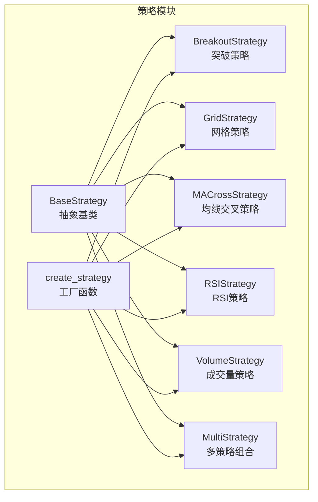
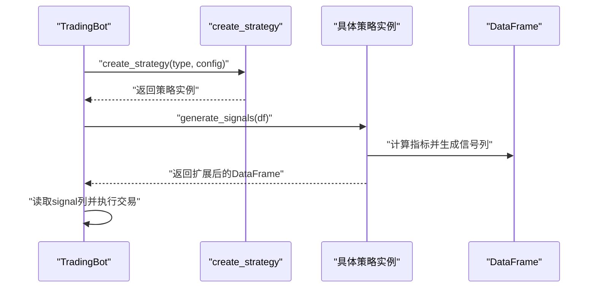
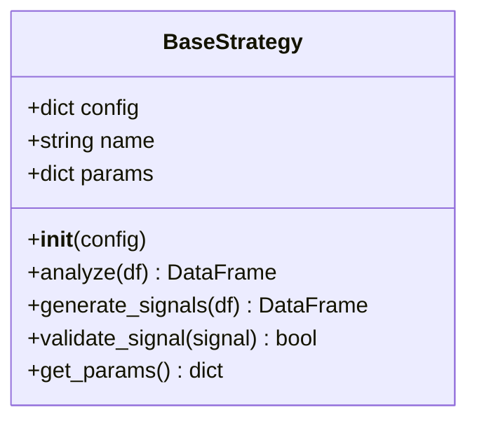
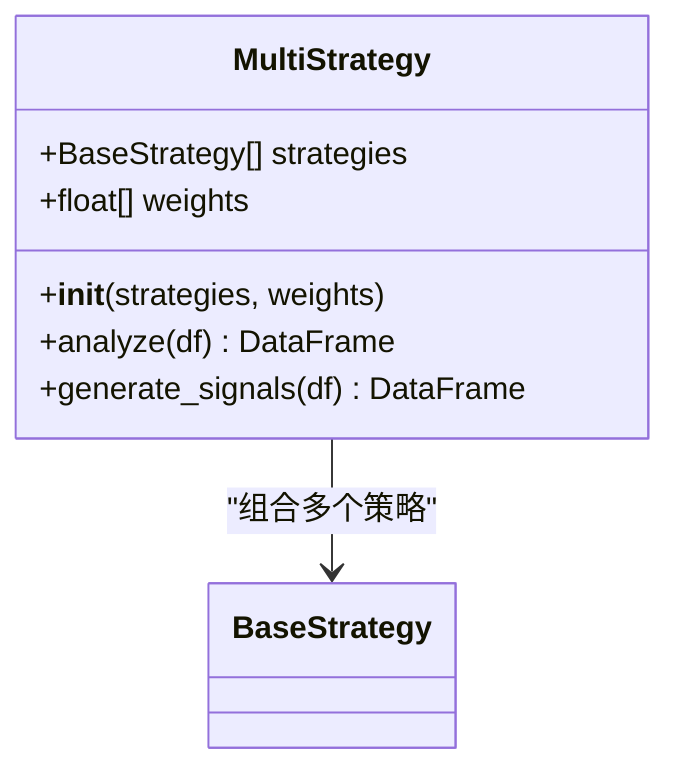
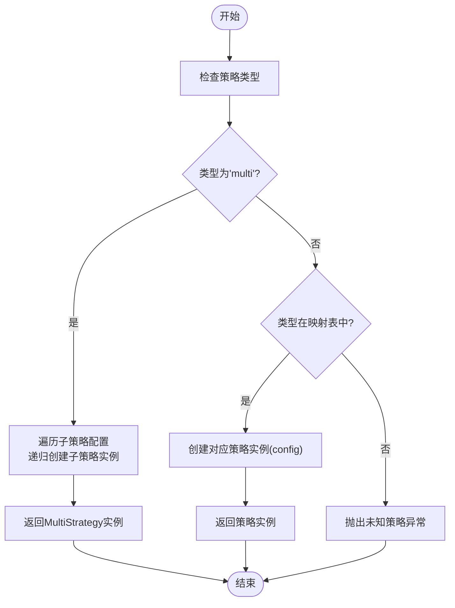
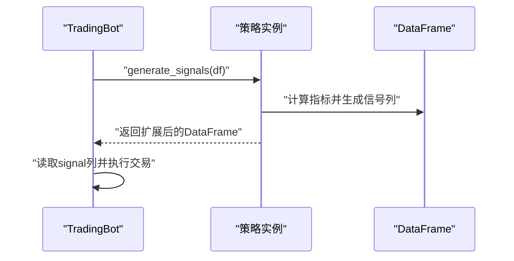
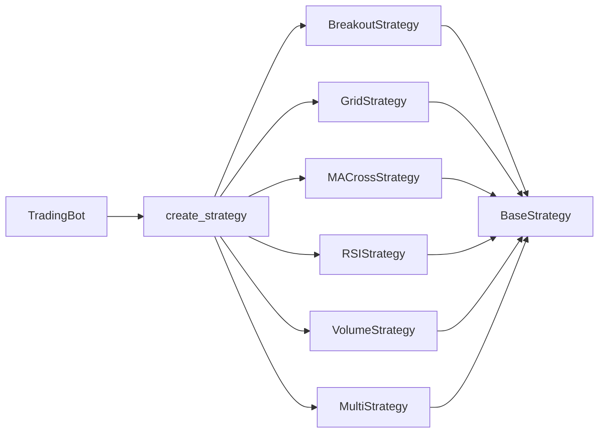

# 策略基类设计

<cite>
**本文档引用的文件**
- [src/strategies/base.py](file://src/strategies/base.py)
- [src/strategies/__init__.py](file://src/strategies/__init__.py)
- [src/strategies/factory.py](file://src/strategies/factory.py)
- [src/strategies/breakout.py](file://src/strategies/breakout.py)
- [src/strategies/grid.py](file://src/strategies/grid.py)
- [src/strategies/multi.py](file://src/strategies/multi.py)
- [src/strategies/macd.py](file://src/strategies/macd.py)
- [src/strategies/rsi.py](file://src/strategies/rsi.py)
- [src/strategies/volume.py](file://src/strategies/volume.py)
- [src/trading_bot.py](file://src/trading_bot.py)
- [tests/test_strategies.py](file://tests/test_strategies.py)
</cite>

## 目录
1. [简介](#简介)
2. [项目结构](#项目结构)
3. [核心组件](#核心组件)
4. [架构总览](#架构总览)
5. [详细组件分析](#详细组件分析)
6. [依赖关系分析](#依赖关系分析)
7. [性能考虑](#性能考虑)
8. [故障排除指南](#故障排除指南)
9. [结论](#结论)
10. [附录](#附录)

## 简介
本文件围绕策略基类设计进行系统化技术文档编写，重点阐述BaseStrategy抽象基类的设计理念、接口规范、参数配置机制与扩展模式。文档将深入解析抽象方法analyze()与generate_signals()的职责边界与实现要求，并解释信号验证机制validate_signal()的设计目的与使用场景。同时，文档将完整梳理策略参数管理机制（params字典与get_params()方法），并提供最佳实践指南与具体示例路径，帮助开发者基于基类快速构建自定义策略。

## 项目结构
策略相关代码位于src/strategies目录下，采用“按功能分层”的组织方式：
- base.py：定义抽象基类BaseStrategy及其公共接口
- 具体策略：breakout.py、grid.py、macd.py、rsi.py、volume.py等
- 组合策略：multi.py
- 工厂：factory.py，用于根据类型动态创建策略实例
- 导出：__init__.py统一导出所有策略与工厂函数

图表来源
- [src/strategies/base.py](file://src/strategies/base.py#L6-L31)
- [src/strategies/breakout.py](file://src/strategies/breakout.py#L6-L79)
- [src/strategies/grid.py](file://src/strategies/grid.py#L5-L63)
- [src/strategies/multi.py](file://src/strategies/multi.py#L6-L38)
- [src/strategies/factory.py](file://src/strategies/factory.py#L10-L36)

章节来源
- [src/strategies/__init__.py](file://src/strategies/__init__.py#L1-L21)

## 核心组件
本节聚焦BaseStrategy抽象基类的设计与职责，以及其在系统中的作用。

- 抽象基类职责
  - 定义策略通用接口：analyze()与generate_signals()为抽象方法，强制子类实现
  - 提供默认实现：validate_signal()返回True，get_params()返回params字典
  - 参数管理：通过config构造函数注入配置，内部维护params字典与name标识
  - 类型约束：使用类型注解确保输入输出为pandas DataFrame

- 接口定义与签名
  - analyze(df: pd.DataFrame) -> pd.DataFrame：计算技术指标，返回扩展后的DataFrame
  - generate_signals(df: pd.DataFrame) -> pd.DataFrame：基于指标生成交易信号列
  - validate_signal(signal: dict) -> bool：可选验证逻辑，默认放行
  - get_params() -> dict：返回策略参数快照

- 设计原则
  - 明确分离：analyze负责指标计算，generate_signals负责信号生成
  - 可扩展：通过工厂函数支持多策略注册与动态创建
  - 可组合：MultiStrategy支持多策略组合与加权聚合
  - 可观测：通过params与name便于日志与监控

章节来源
- [src/strategies/base.py](file://src/strategies/base.py#L6-L31)

## 架构总览
策略层与交易主流程的交互如下：TradingBot在initialize阶段通过工厂函数创建具体策略实例；在analyze阶段调用策略的generate_signals(df)，从结果中提取信号并驱动后续执行。

图表来源
- [src/trading_bot.py](file://src/trading_bot.py#L83-L113)
- [src/strategies/factory.py](file://src/strategies/factory.py#L10-L36)

## 详细组件分析

### BaseStrategy抽象基类
- 角色定位：所有策略的共同父类，定义统一接口与默认行为
- 关键字段
  - config：策略配置字典
  - name：策略名称（默认"BaseStrategy"）
  - params：策略参数字典（默认空）
- 抽象方法
  - analyze：计算技术指标，返回扩展后的DataFrame
  - generate_signals：生成信号列，返回扩展后的DataFrame
- 可选方法
  - validate_signal：验证信号有效性（默认放行）
  - get_params：返回params字典

图表来源
- [src/strategies/base.py](file://src/strategies/base.py#L6-L31)

章节来源
- [src/strategies/base.py](file://src/strategies/base.py#L6-L31)

### 具体策略实现模式
所有具体策略均遵循以下模式：
- 继承BaseStrategy并实现两个抽象方法
- 在__init__中读取config并设置name与params
- analyze中计算技术指标，generate_signals中基于指标生成信号列
- 对于长度不足或空DataFrame的情况，返回空DataFrame或填充默认信号

以突破策略为例：
- analyze：计算移动平均、ATR、布林带、MACD、RSI等指标
- generate_signals：基于突破条件与RSI过滤生成信号

章节来源
- [src/strategies/breakout.py](file://src/strategies/breakout.py#L6-L79)
- [src/strategies/grid.py](file://src/strategies/grid.py#L5-L63)
- [src/strategies/macd.py](file://src/strategies/macd.py#L5-L40)
- [src/strategies/rsi.py](file://src/strategies/rsi.py#L6-L42)
- [src/strategies/volume.py](file://src/strategies/volume.py#L6-L44)

### 多策略组合策略
MultiStrategy作为特殊策略，不直接计算指标，而是：
- 将多个子策略传入构造函数
- analyze：依次调用子策略的analyze
- generate_signals：为每个子策略生成信号列，再进行加权聚合并归一化到-1/0/1

图表来源
- [src/strategies/multi.py](file://src/strategies/multi.py#L6-L38)

章节来源
- [src/strategies/multi.py](file://src/strategies/multi.py#L6-L38)

### 工厂模式与策略注册
工厂函数create_strategy根据策略类型字符串映射到具体策略类，并支持多策略组合：
- 支持类型："breakout"、"grid"、"ma_cross"、"rsi"、"volume"、"multi"
- 对于"multi"类型，需从config中读取子策略列表与权重，递归创建子策略
- 未知类型抛出异常

图表来源
- [src/strategies/factory.py](file://src/strategies/factory.py#L10-L36)

章节来源
- [src/strategies/factory.py](file://src/strategies/factory.py#L10-L36)

### 信号验证机制
BaseStrategy提供validate_signal()默认实现，返回True。该方法为可选钩子，允许子类重写以增加信号合法性校验（如范围检查、时间窗口一致性、与其他信号的冲突检测等）。在TradingBot中并未直接调用此方法，但为未来扩展预留了接口。

章节来源
- [src/strategies/base.py](file://src/strategies/base.py#L24-L26)

### 策略参数管理机制
- params字典：在__init__中由子类填充，记录关键参数（如周期、阈值、权重等）
- get_params()：返回params字典，便于外部查询策略配置
- 实践建议：在__init__中将config读取到本地字段后，统一写入params，保证一致性与可观测性

章节来源
- [src/strategies/breakout.py](file://src/strategies/breakout.py#L15-L19)
- [src/strategies/grid.py](file://src/strategies/grid.py#L15-L18)
- [src/strategies/macd.py](file://src/strategies/macd.py#L13-L16)
- [src/strategies/rsi.py](file://src/strategies/rsi.py#L15-L19)
- [src/strategies/volume.py](file://src/strategies/volume.py#L14-L17)
- [src/strategies/base.py](file://src/strategies/base.py#L28-L30)

### 与交易主流程的集成
TradingBot在analyze阶段调用策略的generate_signals(df)，从结果中读取signal列并据此执行下单或平仓操作。该流程体现了策略层与执行层的清晰边界。

图表来源
- [src/trading_bot.py](file://src/trading_bot.py#L101-L113)

章节来源
- [src/trading_bot.py](file://src/trading_bot.py#L101-L113)

## 依赖关系分析
策略模块内部依赖关系清晰，遵循“上层调用下层”的单向依赖：
- TradingBot依赖工厂函数create_strategy创建策略实例
- 具体策略依赖BaseStrategy抽象基类
- MultiStrategy依赖多个BaseStrategy实例
- 工厂函数依赖具体策略类进行实例化

图表来源
- [src/trading_bot.py](file://src/trading_bot.py#L15-L18)
- [src/strategies/factory.py](file://src/strategies/factory.py#L2-L8)
- [src/strategies/base.py](file://src/strategies/base.py#L6-L31)

章节来源
- [src/strategies/__init__.py](file://src/strategies/__init__.py#L1-L21)

## 性能考虑
- 数据帧操作：所有策略均基于pandas DataFrame进行批量化计算，注意内存占用与计算复杂度
- 空DataFrame与长度不足：各策略在输入为空或长度不足时返回空DataFrame或默认信号，避免重复计算
- 多策略组合：MultiStrategy会多次调用子策略的analyze/generate_signals，应控制子策略数量与计算复杂度
- 信号生成：尽量使用向量化操作，减少循环与逐行处理

## 故障排除指南
- 策略未实现抽象方法
  - 症状：继承BaseStrategy但未实现analyze或generate_signals
  - 处理：确保子类实现两个抽象方法
- 信号列缺失
  - 症状：TradingBot无法读取signal列
  - 处理：确认generate_signals返回的DataFrame包含"signal"列
- 空DataFrame导致异常
  - 症状：generate_signals对空DataFrame处理不当
  - 处理：参考现有策略对空DataFrame的处理模式，返回空DataFrame或填充默认信号
- 未知策略类型
  - 症状：工厂函数抛出未知策略异常
  - 处理：确认策略类型字符串正确，或在工厂映射中注册新策略

章节来源
- [tests/test_strategies.py](file://tests/test_strategies.py#L52-L56)
- [src/strategies/factory.py](file://src/strategies/factory.py#L32-L33)

## 结论
BaseStrategy抽象基类通过明确的接口定义与默认行为，为策略层提供了统一的扩展框架。结合工厂模式与多策略组合，系统实现了高内聚、低耦合的策略体系。开发者只需遵循analyze与generate_signals的职责边界，合理管理params字典，并在需要时重写validate_signal，即可快速构建高质量的交易策略。

## 附录

### 最佳实践指南
- 继承与实现
  - 必须实现analyze与generate_signals两个抽象方法
  - 在__init__中完成config读取、name设置与params填充
- 输入输出约定
  - analyze与generate_signals均接收pd.DataFrame并返回扩展后的DataFrame
  - 对空DataFrame或长度不足的输入，返回空DataFrame或填充默认信号
- 参数管理
  - 所有关键参数统一写入params字典，便于外部查询与监控
  - 使用get_params()获取参数快照
- 信号验证
  - 如需增强信号合法性校验，重写validate_signal方法
- 异常处理
  - 对异常输入进行显式判断与优雅降级
  - 在TradingBot中已对空DataFrame与信号列缺失进行容错处理

### 自定义策略示例路径
- 基于基类创建自定义策略
  - 参考路径：[src/strategies/breakout.py](file://src/strategies/breakout.py#L6-L79)
  - 参考路径：[src/strategies/grid.py](file://src/strategies/grid.py#L5-L63)
  - 参考路径：[src/strategies/macd.py](file://src/strategies/macd.py#L5-L40)
  - 参考路径：[src/strategies/rsi.py](file://src/strategies/rsi.py#L6-L42)
  - 参考路径：[src/strategies/volume.py](file://src/strategies/volume.py#L6-L44)
- 多策略组合
  - 参考路径：[src/strategies/multi.py](file://src/strategies/multi.py#L6-L38)
- 工厂注册与创建
  - 参考路径：[src/strategies/factory.py](file://src/strategies/factory.py#L10-L36)
- 测试用例参考
  - 参考路径：[tests/test_strategies.py](file://tests/test_strategies.py#L13-L56)