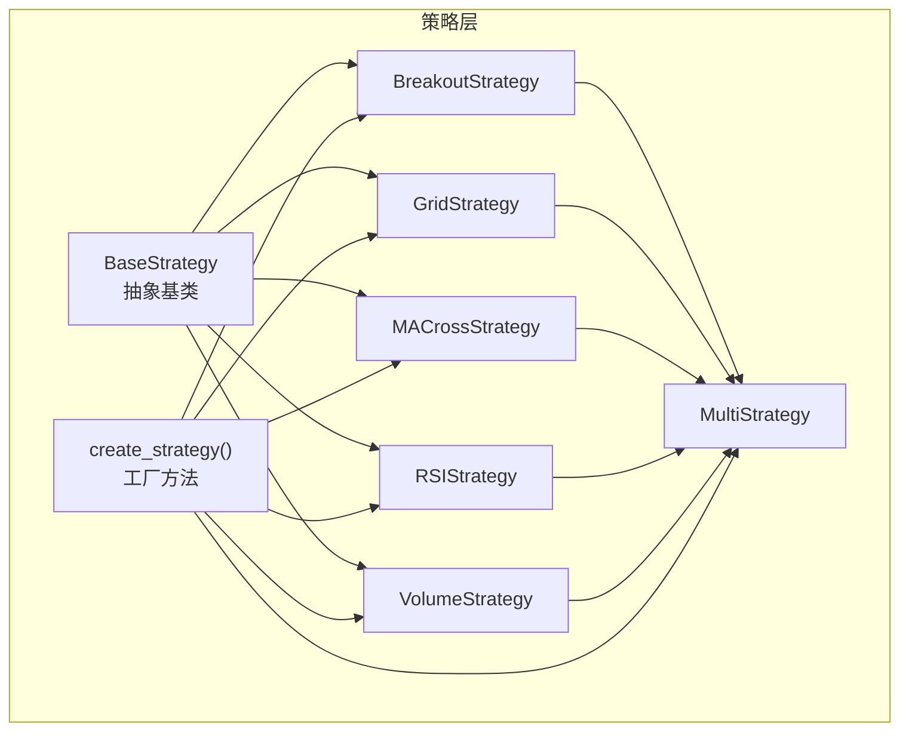
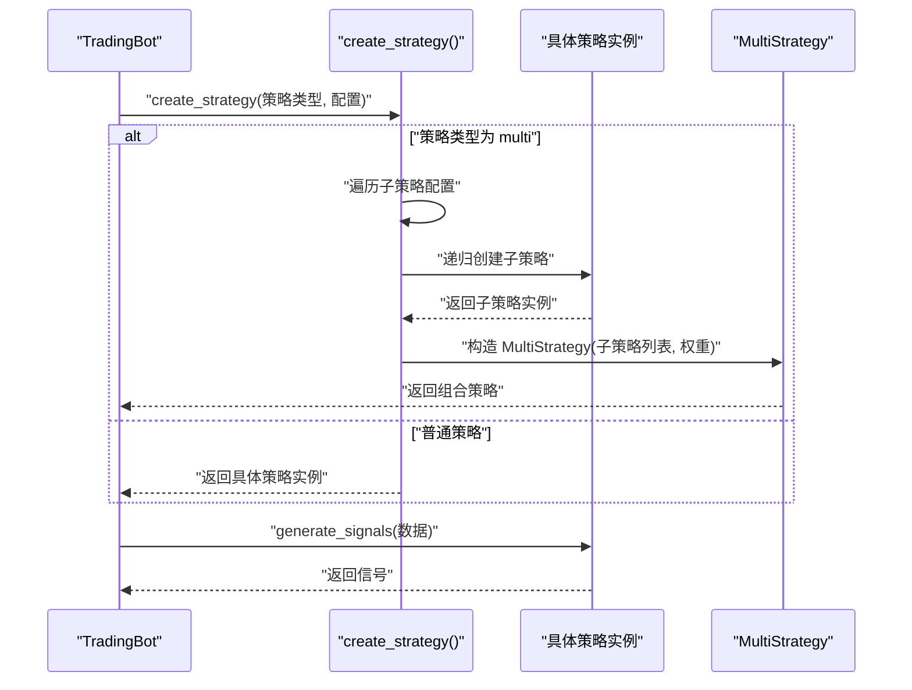
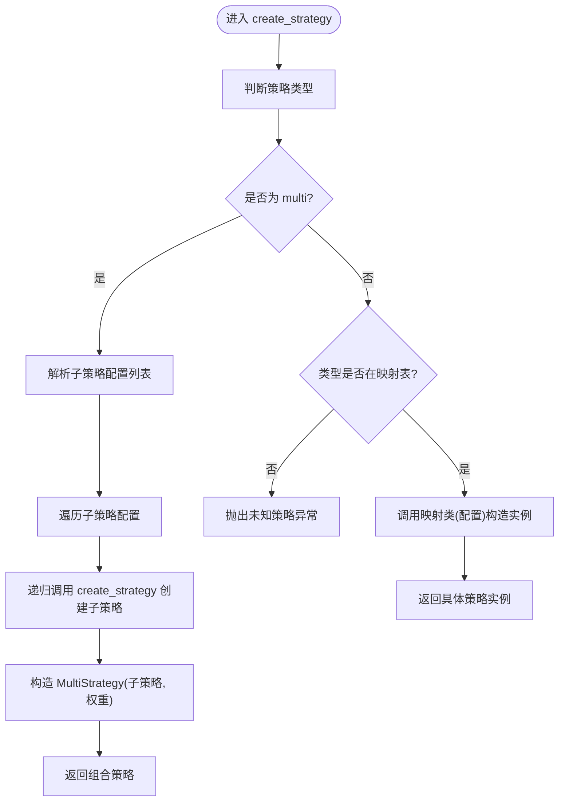
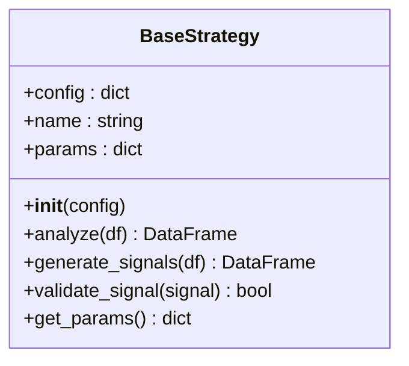
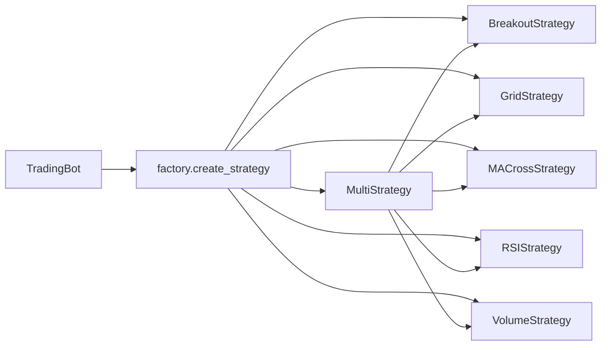

# 策略工厂模式

<cite>
**本文引用的文件**
- [src/strategies/factory.py](file://src/strategies/factory.py)
- [src/strategies/base.py](file://src/strategies/base.py)
- [src/strategies/__init__.py](file://src/strategies/__init__.py)
- [src/strategies/breakout.py](file://src/strategies/breakout.py)
- [src/strategies/grid.py](file://src/strategies/grid.py)
- [src/strategies/macd.py](file://src/strategies/macd.py)
- [src/strategies/rsi.py](file://src/strategies/rsi.py)
- [src/strategies/volume.py](file://src/strategies/volume.py)
- [src/strategies/multi.py](file://src/strategies/multi.py)
- [src/trading_bot.py](file://src/trading_bot.py)
- [configs/config.json](file://configs/config.json)
- [src/utils/config.py](file://src/utils/config.py)
- [src/utils/config_manager.py](file://src/utils/config_manager.py)
- [tests/test_strategies.py](file://tests/test_strategies.py)
</cite>

## 目录
1. [引言](#引言)
2. [项目结构](#项目结构)
3. [核心组件](#核心组件)
4. [架构总览](#架构总览)
5. [详细组件分析](#详细组件分析)
6. [依赖关系分析](#依赖关系分析)
7. [性能考量](#性能考量)
8. [故障排查指南](#故障排查指南)
9. [结论](#结论)
10. [附录](#附录)

## 引言
本文件围绕策略工厂模式展开，系统性阐述策略工厂的设计与实现，重点包括：
- 工厂方法模式的应用与策略创建的统一接口
- 策略注册机制（策略名称映射、参数验证、动态加载）
- 工厂方法 create_strategy() 的实现细节（实例化、参数传递、错误处理）
- 策略工厂在系统架构中的作用（解耦、扩展性、可维护性）
- 使用示例与扩展指南（新增策略、配置管理最佳实践）

## 项目结构
策略相关代码集中在 src/strategies 目录，采用“按功能分层 + 统一工厂入口”的组织方式：
- 策略基类定义于 base.py，统一规范 analyze/generate_signals 接口
- 多个具体策略实现位于同目录下，如 breakout、grid、macd、rsi、volume
- 工厂方法位于 factory.py，集中管理策略注册与实例化
- 多策略组合策略 multi.py 将多个子策略组合为复合策略
- 策略模块通过 __init__.py 暴露统一接口，便于上层导入
- 主程序 trading_bot.py 在初始化阶段通过工厂创建策略实例

图表来源
- [src/strategies/base.py](file://src/strategies/base.py#L6-L31)
- [src/strategies/breakout.py](file://src/strategies/breakout.py#L6-L79)
- [src/strategies/grid.py](file://src/strategies/grid.py#L5-L63)
- [src/strategies/macd.py](file://src/strategies/macd.py#L5-L40)
- [src/strategies/rsi.py](file://src/strategies/rsi.py#L6-L42)
- [src/strategies/volume.py](file://src/strategies/volume.py#L6-L44)
- [src/strategies/multi.py](file://src/strategies/multi.py#L6-L38)
- [src/strategies/factory.py](file://src/strategies/factory.py#L10-L35)

章节来源
- [src/strategies/__init__.py](file://src/strategies/__init__.py#L1-L21)
- [src/strategies/factory.py](file://src/strategies/factory.py#L1-L36)

## 核心组件
- 策略基类 BaseStrategy：定义统一接口 analyze、generate_signals，以及默认参数与信号验证钩子
- 具体策略：Breakout、Grid、MACross、RSI、Volume 等，均继承自 BaseStrategy
- 工厂方法 create_strategy：根据策略类型字符串映射到具体策略类，支持多策略组合
- 多策略组合策略 MultiStrategy：对多个子策略进行统一分析与信号聚合
- 主程序 TradingBot：在初始化阶段调用工厂创建策略实例并注入配置

章节来源
- [src/strategies/base.py](file://src/strategies/base.py#L6-L31)
- [src/strategies/breakout.py](file://src/strategies/breakout.py#L6-L79)
- [src/strategies/grid.py](file://src/strategies/grid.py#L5-L63)
- [src/strategies/macd.py](file://src/strategies/macd.py#L5-L40)
- [src/strategies/rsi.py](file://src/strategies/rsi.py#L6-L42)
- [src/strategies/volume.py](file://src/strategies/volume.py#L6-L44)
- [src/strategies/multi.py](file://src/strategies/multi.py#L6-L38)
- [src/strategies/factory.py](file://src/strategies/factory.py#L10-L35)
- [src/trading_bot.py](file://src/trading_bot.py#L84-L85)

## 架构总览
策略工厂在系统中承担“策略解耦与动态装配”的角色：
- 对外：提供统一的 create_strategy(strategy_type, config) 接口
- 对内：集中管理策略注册表与实例化流程；对多策略场景递归构建子策略树
- 与主程序：TradingBot 在 initialize 阶段通过工厂创建策略，随后在交易循环中调用策略生成信号

图表来源
- [src/trading_bot.py](file://src/trading_bot.py#L84-L85)
- [src/strategies/factory.py](file://src/strategies/factory.py#L10-L35)
- [src/strategies/multi.py](file://src/strategies/multi.py#L9-L14)

## 详细组件分析

### 工厂方法 create_strategy 实现详解
- 注册机制：内部维护策略名称到类的映射表，涵盖 breakout、grid、ma_cross、rsi、volume、multi
- 参数传递：将外部传入的 config 字典直接传递给目标策略构造函数
- 动态加载：通过映射表实现“名称驱动”的策略选择，无需上层感知具体类名
- 多策略组合：当策略类型为 multi 时，解析子策略配置列表，递归调用工厂创建子策略，再以 MultiStrategy 组合
- 错误处理：若策略类型不在映射表中，抛出异常，提示未知策略

图表来源
- [src/strategies/factory.py](file://src/strategies/factory.py#L10-L35)

章节来源
- [src/strategies/factory.py](file://src/strategies/factory.py#L10-L35)

### 策略基类 BaseStrategy
- 角色：定义策略统一接口与通用能力
- 关键点：
  - analyze(df)：计算技术指标，供上层生成信号
  - generate_signals(df)：基于指标生成交易信号列
  - validate_signal(signal)：默认放行，可被子类覆盖
  - get_params()：统一暴露策略参数字典
  - __init__(config)：接收配置并初始化通用属性

图表来源
- [src/strategies/base.py](file://src/strategies/base.py#L6-L31)

章节来源
- [src/strategies/base.py](file://src/strategies/base.py#L6-L31)

### 具体策略实现要点
- 突破策略 BreakoutStrategy：滚动窗口计算移动平均、最高最低、ATR、布林带、MACD、RSI 等指标，依据突破阈值与RSI过滤生成信号
- 网格策略 GridStrategy：以网格数量与网格间距计算网格线，根据当前价格与网格位置生成买卖信号
- 均线交叉策略 MACrossStrategy：计算快慢均线差值与前值，金叉死叉生成信号
- RSI 策略 RSIStrategy：计算 RSI 指标，超卖超买阈值生成信号
- 成交量策略 VolumeStrategy：计算成交量均值与倍数，结合价格变化生成信号
- 多策略组合 MultiStrategy：对每个子策略分别执行 analyze/generate_signals，聚合后归一化到 -1/0/1

章节来源
- [src/strategies/breakout.py](file://src/strategies/breakout.py#L6-L79)
- [src/strategies/grid.py](file://src/strategies/grid.py#L5-L63)
- [src/strategies/macd.py](file://src/strategies/macd.py#L5-L40)
- [src/strategies/rsi.py](file://src/strategies/rsi.py#L6-L42)
- [src/strategies/volume.py](file://src/strategies/volume.py#L6-L44)
- [src/strategies/multi.py](file://src/strategies/multi.py#L6-L38)

### 主程序集成与使用
- TradingBot 在 initialize 阶段读取配置中的 strategy 与 strategy_config，调用 create_strategy 创建策略实例
- 在交易循环 analyze 阶段，调用策略 generate_signals 获取信号
- 该流程体现了策略工厂在系统中的“解耦”作用：上层仅依赖统一接口，不关心具体策略实现

章节来源
- [src/trading_bot.py](file://src/trading_bot.py#L84-L85)
- [src/trading_bot.py](file://src/trading_bot.py#L101-L113)

### 配置与参数验证
- 配置文件 config.json 定义了默认策略、时间周期、杠杆等参数
- 工具模块 config.py 提供配置校验，确保策略类型在受支持集合内
- 配置管理器 config_manager.py 支持安全存储与加载敏感信息，提供默认配置模板

章节来源
- [configs/config.json](file://configs/config.json#L1-L28)
- [src/utils/config.py](file://src/utils/config.py#L15-L37)
- [src/utils/config_manager.py](file://src/utils/config_manager.py#L117-L144)

## 依赖关系分析
- 工厂方法依赖具体策略类进行实例化
- 多策略组合依赖工厂递归创建子策略
- 主程序 TradingBot 依赖工厂创建策略实例
- 策略模块通过 __init__.py 暴露统一接口，便于导入

图表来源
- [src/strategies/factory.py](file://src/strategies/factory.py#L10-L35)
- [src/strategies/multi.py](file://src/strategies/multi.py#L9-L14)
- [src/trading_bot.py](file://src/trading_bot.py#L84-L85)

章节来源
- [src/strategies/__init__.py](file://src/strategies/__init__.py#L1-L21)
- [src/strategies/factory.py](file://src/strategies/factory.py#L10-L35)
- [src/trading_bot.py](file://src/trading_bot.py#L84-L85)

## 性能考量
- 工厂方法为 O(1) 映射查找，创建策略成本低
- 多策略组合在 analyze/generate_signals 阶段会逐个执行子策略，注意数据帧拷贝与重复计算
- 建议：
  - 对公共指标进行缓存或复用
  - 控制子策略数量与权重规模，避免信号聚合过程中的额外开销
  - 在 TradingBot 的交易循环中尽量减少不必要的数据拷贝

## 故障排查指南
- 未知策略类型：工厂方法在类型不在映射表时抛出异常，需检查配置中的 strategy 字段是否拼写正确
- 配置校验失败：使用配置校验工具检查 exchange、symbols、strategy 等字段是否符合要求
- 空数据或长度不足：部分策略在数据长度不足时返回空结果或默认信号，需确认数据获取与窗口大小设置
- 多策略组合异常：检查子策略配置列表与权重，确保类型与配置合法

章节来源
- [src/strategies/factory.py](file://src/strategies/factory.py#L32-L33)
- [src/utils/config.py](file://src/utils/config.py#L15-L37)
- [tests/test_strategies.py](file://tests/test_strategies.py#L52-L55)

## 结论
策略工厂模式通过统一接口与集中注册，实现了策略的解耦、可扩展与易维护。工厂方法 create_strategy 以“名称驱动”的方式简化了策略装配，配合多策略组合策略，进一步增强了系统的表达能力。在实际工程中，建议遵循统一的配置规范与参数验证流程，确保策略工厂的稳定与可维护。

## 附录

### 使用示例与最佳实践
- 使用工厂创建单一策略：在 TradingBot 初始化阶段，传入 strategy 与 strategy_config，由工厂创建对应策略实例
- 使用工厂创建多策略组合：strategy_config 中包含 strategies 列表与可选权重，工厂将递归创建子策略并组合
- 新增策略步骤：
  1) 在 src/strategies 下新增策略文件，继承 BaseStrategy 并实现 analyze/generate_signals
  2) 在 src/strategies/__init__.py 中导出新策略类
  3) 在 src/strategies/factory.py 的映射表中注册新策略名称与类
  4) 在配置文件中设置 strategy 为新策略名称，或在运行时传入相应配置
- 配置管理最佳实践：
  - 使用 config.json 存放非敏感配置
  - 使用 config_manager 的安全存储机制保存敏感信息
  - 通过配置校验工具保证输入合法性

章节来源
- [src/trading_bot.py](file://src/trading_bot.py#L84-L85)
- [src/strategies/__init__.py](file://src/strategies/__init__.py#L1-L21)
- [src/strategies/factory.py](file://src/strategies/factory.py#L10-L35)
- [configs/config.json](file://configs/config.json#L1-L28)
- [src/utils/config_manager.py](file://src/utils/config_manager.py#L48-L80)
- [src/utils/config.py](file://src/utils/config.py#L15-L37)