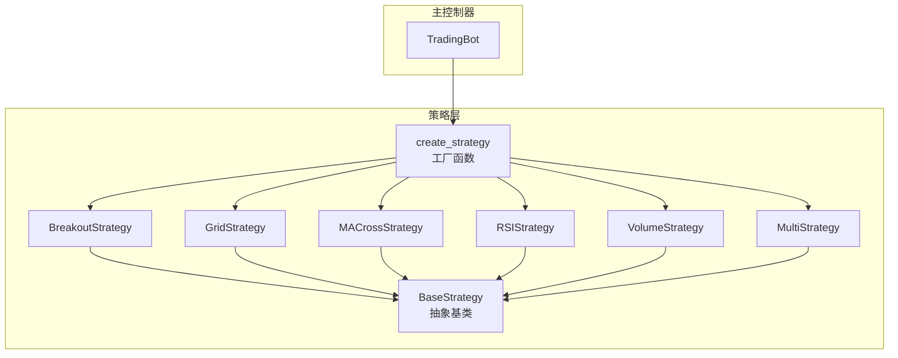
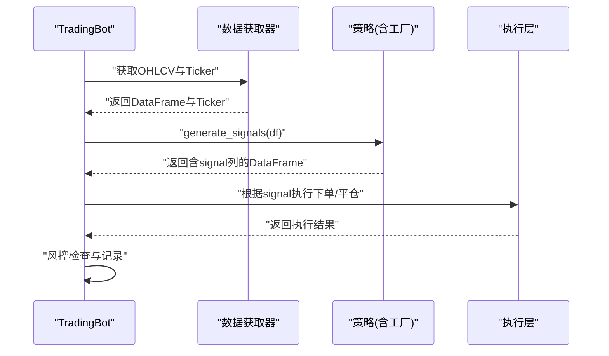
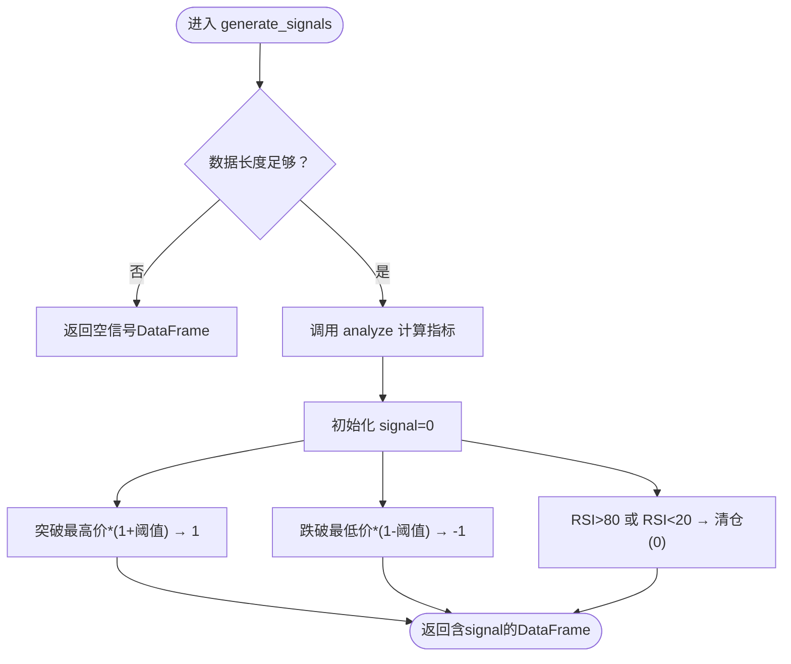
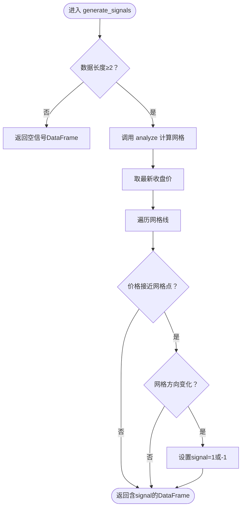
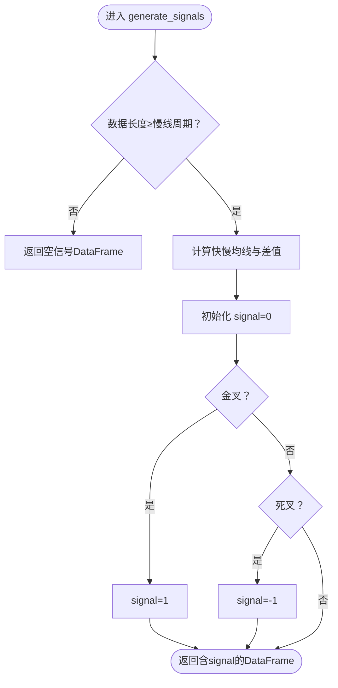
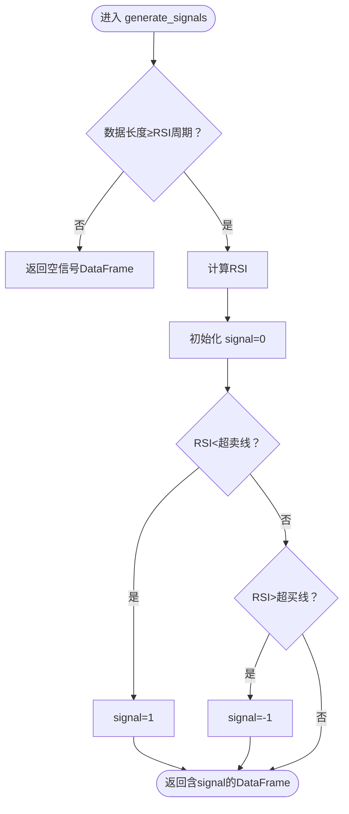
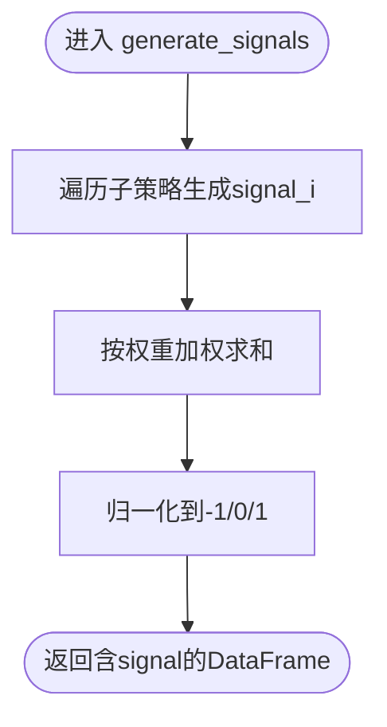
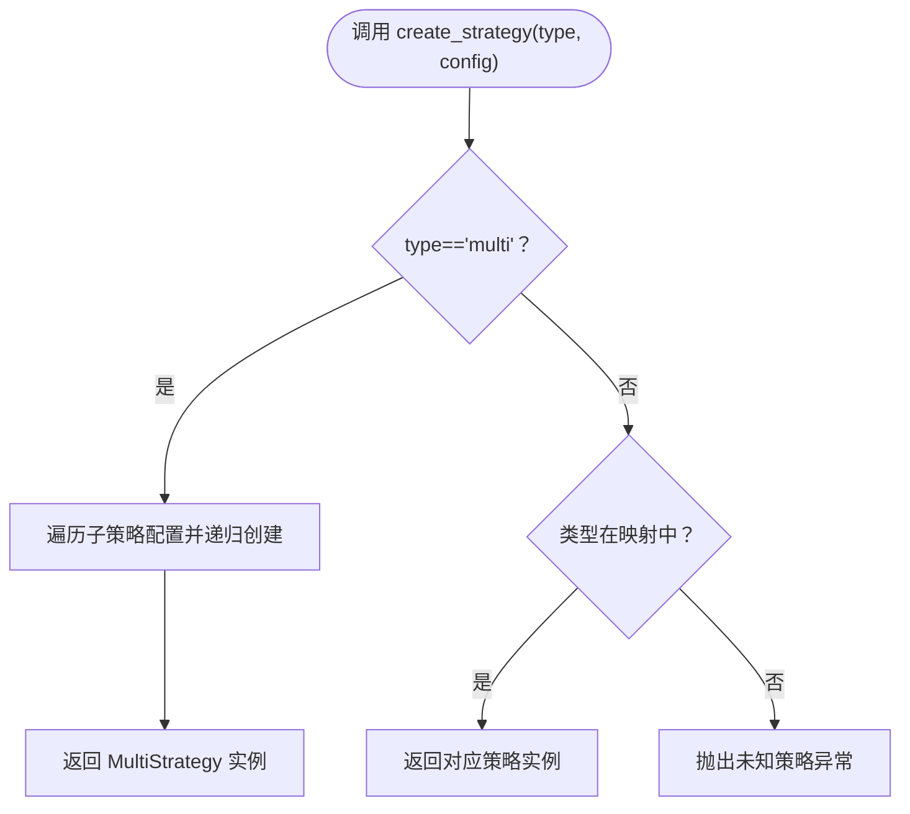
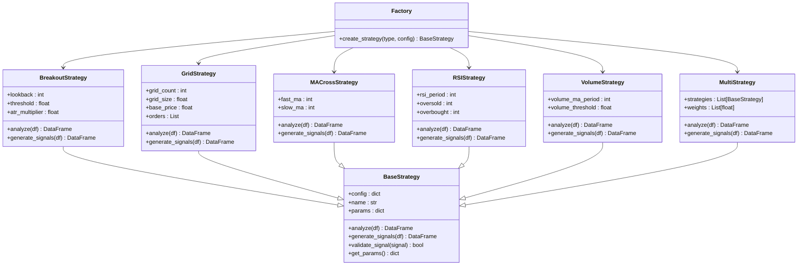

# 策略系统

<cite>
**本文引用的文件列表**
- [src/strategies/base.py](file://src/strategies/base.py)
- [src/strategies/breakout.py](file://src/strategies/breakout.py)
- [src/strategies/grid.py](file://src/strategies/grid.py)
- [src/strategies/macd.py](file://src/strategies/macd.py)
- [src/strategies/rsi.py](file://src/strategies/rsi.py)
- [src/strategies/volume.py](file://src/strategies/volume.py)
- [src/strategies/factory.py](file://src/strategies/factory.py)
- [src/strategies/multi.py](file://src/strategies/multi.py)
- [src/trading_bot.py](file://src/trading_bot.py)
- [configs/config.json](file://configs/config.json)
- [tests/test_strategies.py](file://tests/test_strategies.py)
- [src/utils/config_manager.py](file://src/utils/config_manager.py)
- [src/ui/admin_page.html](file://src/ui/admin_page.html)
- [src/ui/admin_backend.py](file://src/ui/admin_backend.py)
</cite>

## 更新摘要
**所做更改**
- 新增网格策略(GridStrategy)的详细文档说明
- 更新策略工厂模式以包含网格策略的完整实现
- 补充网格策略的参数配置指南和使用示例
- 更新UI策略列表以反映网格策略的可用性
- 增强多策略组合策略的文档说明

## 目录
1. [简介](#简介)
2. [项目结构](#项目结构)
3. [核心组件](#核心组件)
4. [架构总览](#架构总览)
5. [详细组件分析](#详细组件分析)
6. [依赖关系分析](#依赖关系分析)
7. [性能考量](#性能考量)
8. [故障排查指南](#故障排查指南)
9. [结论](#结论)
10. [附录](#附录)

## 简介
本文件面向策略系统的开发者与使用者，系统性阐述策略基类的设计理念、信号生成接口、参数配置机制与性能优化策略；详解突破策略、网格策略、均线交叉策略、RSI策略、成交量策略的实现原理与适用场景；说明策略工厂模式的创建、参数传递与动态加载机制；提供策略参数配置指南与策略输出格式及信号含义；介绍多策略组合的实现与权重分配；并给出扩展与自定义策略的实践路径。

**更新** 本次更新重点增强了网格策略的文档说明，补充了其在震荡市场中的应用价值和实现细节。

## 项目结构
策略系统位于 src/strategies 目录下，采用"基类 + 多子策略 + 工厂 + 组合策略"的分层设计，配合 TradingBot 主控制器完成数据拉取、策略分析、信号生成与执行。



**图表来源**
- [src/strategies/base.py](file://src/strategies/base.py#L6-L31)
- [src/strategies/breakout.py](file://src/strategies/breakout.py#L6-L79)
- [src/strategies/grid.py](file://src/strategies/grid.py#L5-L63)
- [src/strategies/macd.py](file://src/strategies/macd.py#L5-L40)
- [src/strategies/rsi.py](file://src/strategies/rsi.py#L6-L42)
- [src/strategies/volume.py](file://src/strategies/volume.py#L6-L44)
- [src/strategies/multi.py](file://src/strategies/multi.py#L6-L38)
- [src/strategies/factory.py](file://src/strategies/factory.py#L10-L36)
- [src/trading_bot.py](file://src/trading_bot.py#L15-L86)

**章节来源**
- [src/strategies/base.py](file://src/strategies/base.py#L6-L31)
- [src/strategies/factory.py](file://src/strategies/factory.py#L10-L36)
- [src/trading_bot.py](file://src/trading_bot.py#L15-L86)

## 核心组件
- 策略基类 BaseStrategy：定义统一的 analyze(df) 与 generate_signals(df) 接口，提供参数字典 params 与名称 name，以及可扩展的 validate_signal 与 get_params 方法。
- 具体策略：Breakout、Grid、MACross、RSI、Volume 各自实现指标计算与信号生成逻辑，并在 __init__ 中解析配置参数。
- 工厂 create_strategy：根据策略类型字符串动态创建策略实例，支持"multi"组合策略的递归构建。
- 组合策略 MultiStrategy：聚合多个子策略，分别生成信号并加权融合，最终输出标准化的 -1/0/1 信号。

**更新** 新增网格策略作为核心策略组件之一，专门针对震荡市场的网格交易模式。

**章节来源**
- [src/strategies/base.py](file://src/strategies/base.py#L6-L31)
- [src/strategies/breakout.py](file://src/strategies/breakout.py#L9-L19)
- [src/strategies/grid.py](file://src/strategies/grid.py#L8-L18)
- [src/strategies/macd.py](file://src/strategies/macd.py#L8-L16)
- [src/strategies/rsi.py](file://src/strategies/rsi.py#L9-L19)
- [src/strategies/volume.py](file://src/strategies/volume.py#L9-L17)
- [src/strategies/multi.py](file://src/strategies/multi.py#L9-L14)
- [src/strategies/factory.py](file://src/strategies/factory.py#L10-L36)

## 架构总览
策略系统与主控制器的交互流程如下：



**图表来源**
- [src/trading_bot.py](file://src/trading_bot.py#L92-L114)
- [src/trading_bot.py](file://src/trading_bot.py#L115-L205)
- [src/strategies/factory.py](file://src/strategies/factory.py#L10-L36)

**章节来源**
- [src/trading_bot.py](file://src/trading_bot.py#L92-L114)
- [src/trading_bot.py](file://src/trading_bot.py#L115-L205)
- [src/strategies/factory.py](file://src/strategies/factory.py#L10-L36)

## 详细组件分析

### 策略基类 BaseStrategy 设计
- 接口职责
  - analyze(df): 计算技术指标，返回包含指标列的 DataFrame。
  - generate_signals(df): 基于指标生成信号列"signal"，取值为 -1/0/1。
  - validate_signal(signal): 可选扩展，用于信号有效性校验。
  - get_params(): 返回策略参数字典。
- 参数与命名
  - config 字典由外部传入，策略内部解析并填充 self.params。
  - name 用于 UI 展示与日志标识。
- 设计优势
  - 统一接口便于工厂与组合策略复用。
  - 明确的信号输出格式，利于主控制器统一处理。

**章节来源**
- [src/strategies/base.py](file://src/strategies/base.py#L6-L31)

### 突破策略 BreakoutStrategy
- 实现要点
  - 指标：SMA(20/50)、最高价/最低价回看窗口、ATR、布林带、MACD、RSI。
  - 信号：收盘价突破前一日最高价×(1+阈值)做多；跌破前一日最低价×(1-阈值)做空；RSI超买超卖时清仓。
  - 阈值与回看周期来自配置，ATR倍数用于动态止损。
- 适用场景
  - 趋势明确、波动较大的行情；震荡行情易产生磨损。
- 参数配置
  - lookback_period：回看周期
  - threshold：突破阈值（百分比）
  - atr_multiplier：ATR倍数



**图表来源**
- [src/strategies/breakout.py](file://src/strategies/breakout.py#L64-L78)

**章节来源**
- [src/strategies/breakout.py](file://src/strategies/breakout.py#L9-L19)
- [src/strategies/breakout.py](file://src/strategies/breakout.py#L21-L62)
- [src/strategies/breakout.py](file://src/strategies/breakout.py#L64-L78)

### 网格策略 GridStrategy
- 实现要点
  - 指标：以基础价格为中心，按网格间距划分上下若干层网格。
  - 信号：当价格触及网格且方向改变时，依据涨跌方向生成 1/-1 信号。
  - 若未显式设置 base_price，则取最新收盘价作为基准。
- 适用场景
  - 区间震荡市场，追求高频小利润。
- 参数配置
  - grid_count：网格层数
  - grid_size：网格间距（百分比）
  - base_price：网格中心价格（可选）



**图表来源**
- [src/strategies/grid.py](file://src/strategies/grid.py#L42-L62)

**章节来源**
- [src/strategies/grid.py](file://src/strategies/grid.py#L8-L18)
- [src/strategies/grid.py](file://src/strategies/grid.py#L20-L40)
- [src/strategies/grid.py](file://src/strategies/grid.py#L42-L62)

### 均线交叉策略 MACrossStrategy
- 实现要点
  - 指标：快慢均线差值与前值比较，形成金叉/死叉。
  - 信号：金叉（快线上穿慢线）→ 1；死叉（快线下穿慢线）→ -1；否则 0。
- 适用场景
  - 趋势跟踪，适合中长线。
- 参数配置
  - fast_ma：快线周期
  - slow_ma：慢线周期



**图表来源**
- [src/strategies/macd.py](file://src/strategies/macd.py#L29-L39)

**章节来源**
- [src/strategies/macd.py](file://src/strategies/macd.py#L8-L16)
- [src/strategies/macd.py](file://src/strategies/macd.py#L18-L27)
- [src/strategies/macd.py](file://src/strategies/macd.py#L29-L39)

### RSI 策略 RSIStrategy
- 实现要点
  - 指标：RSI（平滑计算，避免除零）。
  - 信号：RSI 低于超卖线 → 1；高于超买线 → -1；否则 0。
- 适用场景
  - 超买超卖反转，适合震荡行情。
- 参数配置
  - rsi_period：RSI周期
  - oversold：超卖线
  - overbought：超买线



**图表来源**
- [src/strategies/rsi.py](file://src/strategies/rsi.py#L31-L41)

**章节来源**
- [src/strategies/rsi.py](file://src/strategies/rsi.py#L9-L19)
- [src/strategies/rsi.py](file://src/strategies/rsi.py#L21-L29)
- [src/strategies/rsi.py](file://src/strategies/rsi.py#L31-L41)

### 成交量策略 VolumeStrategy
- 实现要点
  - 指标：成交量均线与放量倍数，价格涨跌幅绝对值。
  - 信号：放量且价格上涨 → 1；放量且价格下跌 → -1；否则 0。
- 适用场景
  - 量价配合确认趋势强度。
- 参数配置
  - volume_ma_period：成交量均线周期
  - volume_threshold：放量倍数阈值

```mermaid
flowchart TD
Start(["进入 generate_signals"]) --> LenCheck{"数据长度≥均线周期？"}
LenCheck -- 否 --> ReturnEmpty["返回空信号DataFrame"]
LenCheck -- 是 --> Analyze["计算成交量均值与放量倍数、价格涨跌幅"]
Analyze --> SignalZero["初始化 signal=0"]
SignalZero --> BullVolume{"放量且上涨？"}
BullVolume -- 是 --> SignalBuy["signal=1"]
BullVolume -- 否 --> BearVolume{"放量且下跌？"}
BearVolume -- is -- 是 --> SignalSell["signal=-1"]
BearVolume -- 否 --> End(["返回含signal的DataFrame"])
SignalBuy --> End
SignalSell --> End
```

**图表来源**
- [src/strategies/volume.py](file://src/strategies/volume.py#L33-L43)

**章节来源**
- [src/strategies/volume.py](file://src/strategies/volume.py#L9-L17)
- [src/strategies/volume.py](file://src/strategies/volume.py#L19-L31)
- [src/strategies/volume.py](file://src/strategies/volume.py#L33-L43)

### 多策略组合 MultiStrategy
- 实现要点
  - 聚合多个子策略，逐个生成信号列 signal_i。
  - 对各信号按权重加权求和，再归一化到 -1/0/1。
  - 权重默认均分，也可外部传入。
- 适用场景
  - 将不同策略的优势互补，提高稳定性与鲁棒性。
- 参数配置
  - strategies：子策略列表
  - weights：权重列表（可为空则均分）



**图表来源**
- [src/strategies/multi.py](file://src/strategies/multi.py#L21-L37)

**章节来源**
- [src/strategies/multi.py](file://src/strategies/multi.py#L9-L14)
- [src/strategies/multi.py](file://src/strategies/multi.py#L16-L37)

### 策略工厂模式 create_strategy
- 功能
  - 根据字符串类型创建具体策略实例。
  - "multi"类型支持递归构建子策略与权重。
- 扩展性
  - 新增策略只需在工厂映射中注册即可被动态加载。
- 参数传递
  - config 字典透传给策略构造函数，策略内部解析为 self.params。



**图表来源**
- [src/strategies/factory.py](file://src/strategies/factory.py#L10-L36)

**章节来源**
- [src/strategies/factory.py](file://src/strategies/factory.py#L10-L36)

### 策略输出格式与信号含义
- 输出格式
  - DataFrame，包含原始 OHLCV 与策略计算的指标列，以及"signal"列。
- 信号含义
  - 1：买入信号
  - -1：卖出信号
  - 0：持有/清仓信号
- 主控制器处理
  - TradingBot 从最新行读取 signal 值并执行下单或平仓。

**章节来源**
- [src/trading_bot.py](file://src/trading_bot.py#L101-L113)
- [src/strategies/base.py](file://src/strategies/base.py#L14-L22)

## 依赖关系分析



**图表来源**
- [src/strategies/base.py](file://src/strategies/base.py#L6-L31)
- [src/strategies/breakout.py](file://src/strategies/breakout.py#L6-L79)
- [src/strategies/grid.py](file://src/strategies/grid.py#L5-L63)
- [src/strategies/macd.py](file://src/strategies/macd.py#L5-L40)
- [src/strategies/rsi.py](file://src/strategies/rsi.py#L6-L42)
- [src/strategies/volume.py](file://src/strategies/volume.py#L6-L44)
- [src/strategies/multi.py](file://src/strategies/multi.py#L6-L38)
- [src/strategies/factory.py](file://src/strategies/factory.py#L2-L8)

**章节来源**
- [src/strategies/base.py](file://src/strategies/base.py#L6-L31)
- [src/strategies/factory.py](file://src/strategies/factory.py#L2-L8)

## 性能考量
- 计算复杂度
  - 滚动窗口（如 SMA、RSI、ATR、成交量均线）通常为 O(n) 每指标，整体与指标数量线性相关。
  - 多策略组合会叠加多次 analyze/generate_signals，需关注 n×k 的开销。
- 内存与缓存
  - 建议仅保留必要的列，避免冗余中间列；对长序列可分批处理或使用更高效的滚动实现。
- I/O 与并发
  - TradingBot 已采用异步获取 OHLCV 与 Ticker 并行请求，减少等待时间。
- 信号生成频率
  - 建议根据时间周期与 loop_interval 控制信号生成频率，避免过度频繁的下单尝试。

## 故障排查指南
- 空 DataFrame 或长度不足
  - 各策略在 generate_signals 中对长度进行检查，若不足则返回空或全 0 的信号。请确保传入的数据长度满足策略需求。
- 信号异常
  - 检查策略参数是否合理（如 RSI 周期、网格间距、均线周期等），并参考单元测试断言信号取值范围。
- 工厂创建失败
  - 当传入未知策略类型时会抛出异常。请确认类型字符串与工厂映射一致。
- 配置与参数
  - 通过 UI 或配置文件设置策略参数，确保数值范围合理；必要时使用默认配置进行对比。

**章节来源**
- [src/strategies/breakout.py](file://src/strategies/breakout.py#L64-L78)
- [src/strategies/grid.py](file://src/strategies/grid.py#L42-L62)
- [src/strategies/macd.py](file://src/strategies/macd.py#L29-L39)
- [src/strategies/rsi.py](file://src/strategies/rsi.py#L31-L41)
- [src/strategies/volume.py](file://src/strategies/volume.py#L33-L43)
- [src/strategies/factory.py](file://src/strategies/factory.py#L32-L33)
- [tests/test_strategies.py](file://tests/test_strategies.py#L38-L50)

## 结论
该策略系统以 BaseStrategy 为核心，结合工厂与组合策略，实现了可扩展、可配置、可测试的策略框架。各策略覆盖趋势、震荡、反转与量价分析等典型场景；通过统一的信号输出与主控制器集成，能够快速落地到实盘交易。新增的网格策略进一步丰富了震荡市场的交易手段，建议在实盘前充分测试与参数优化，并结合风控策略保障资金安全。

**更新** 网格策略的加入使得策略系统能够更好地适应震荡市场环境，为用户提供更多样化的交易策略选择。

## 附录

### 策略参数配置指南
- 通用参数
  - 交易对：支持多个交易对（逗号分隔）
  - 时间周期：1m/5m/15m/1h/4h
  - 杠杆倍数：1-125（建议不超过10）
- 各策略关键参数
  - 突破策略：lookback_period、threshold、atr_multiplier
  - 网格策略：grid_count、grid_size、base_price
  - 均线交叉：fast_ma、slow_ma
  - RSI策略：rsi_period、oversold、overbought
  - 成交量策略：volume_ma_period、volume_threshold
- 风控参数
  - max_position_pct、stop_loss_pct、take_profit_pct、max_daily_loss

**章节来源**
- [configs/config.json](file://configs/config.json#L10-L20)
- [src/ui/admin_page.html](file://src/ui/admin_page.html#L349-L376)
- [src/utils/config_manager.py](file://src/utils/config_manager.py#L117-L144)

### 使用模式与扩展指导
- 使用模式
  - 在 TradingBot 中通过 create_strategy 创建策略实例，传入 strategy_config。
  - 在主循环中调用 generate_signals 获取信号，再执行下单或平仓。
- 扩展新策略
  - 新建文件继承 BaseStrategy，实现 analyze 与 generate_signals。
  - 在工厂映射中注册新类型，或通过"multi"组合策略进行集成。
  - 编写单元测试验证信号取值与边界条件。

**章节来源**
- [src/trading_bot.py](file://src/trading_bot.py#L83-L85)
- [src/strategies/factory.py](file://src/strategies/factory.py#L12-L19)
- [tests/test_strategies.py](file://tests/test_strategies.py#L13-L50)

### 网格策略详细配置说明
- 网格策略参数详解
  - grid_count：网格层数，决定网格的密集程度，默认10层
  - grid_size：网格间距，以百分比表示，默认1%（即价格变动1%触发交易）
  - base_price：网格中心价格，可选参数；未设置时自动使用最新收盘价
- 网格策略工作原理
  - 以 base_price 为中心，向上向下各生成 grid_count 层网格
  - 当价格触及某个网格且方向发生变化时，生成相应的买卖信号
  - 通过精确的价格比较（小于 grid_size 的百分比差异）识别网格命中
- 适用市场环境
  - 震荡区间明显的市场
  - 价格在支撑阻力位之间反复波动的行情
  - 适合高频交易，追求薄利多单的策略

**章节来源**
- [src/strategies/grid.py](file://src/strategies/grid.py#L8-L18)
- [src/strategies/grid.py](file://src/strategies/grid.py#L20-L40)
- [src/strategies/grid.py](file://src/strategies/grid.py#L42-L62)
- [src/ui/admin_backend.py](file://src/ui/admin_backend.py#L208-L216)