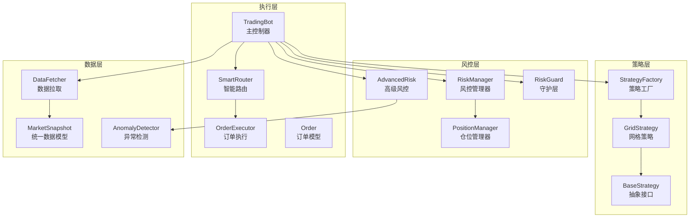
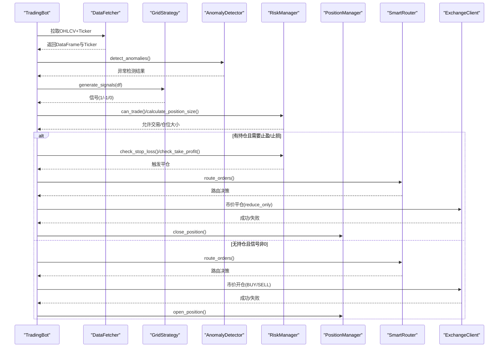
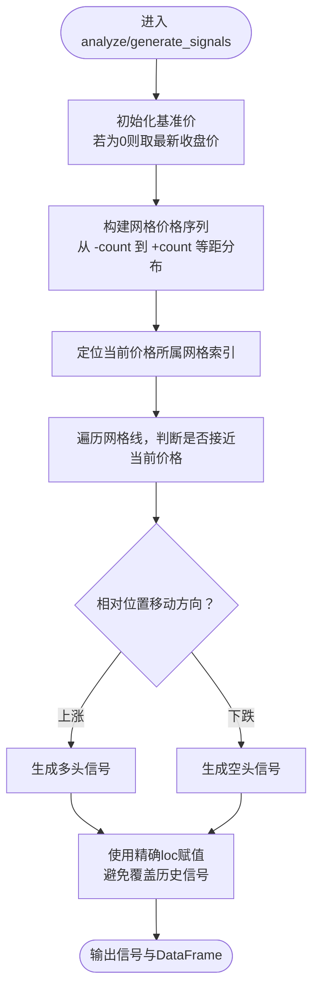
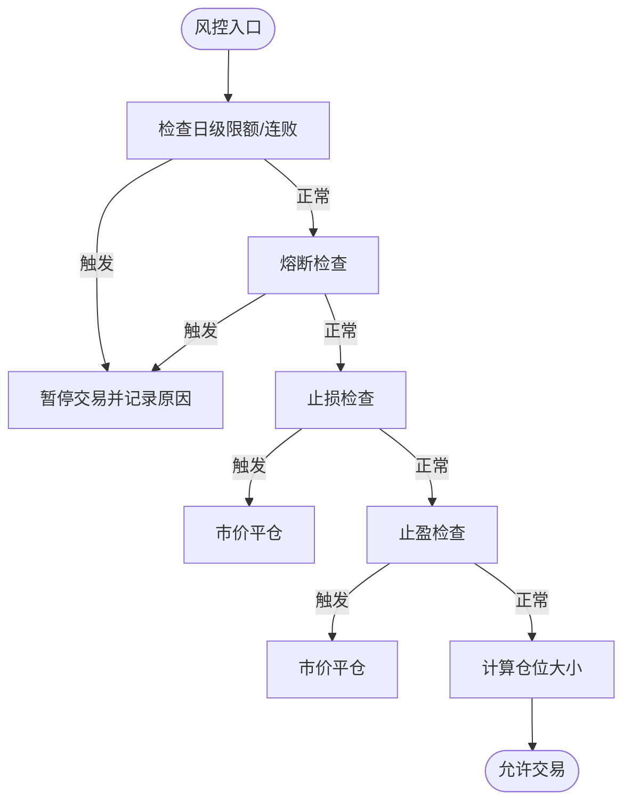
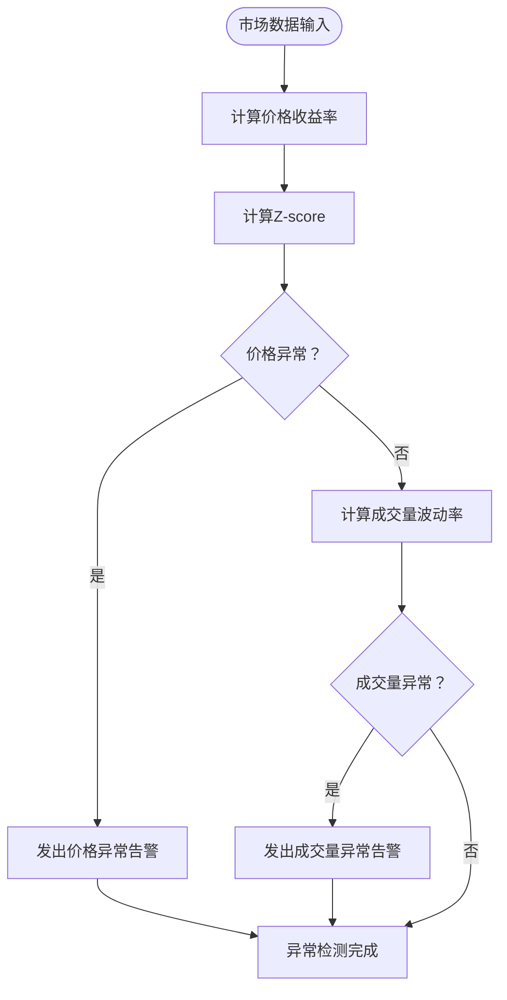
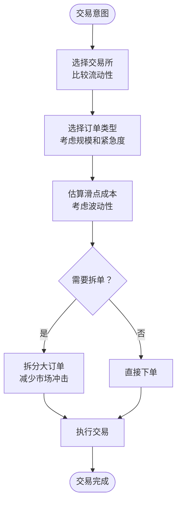
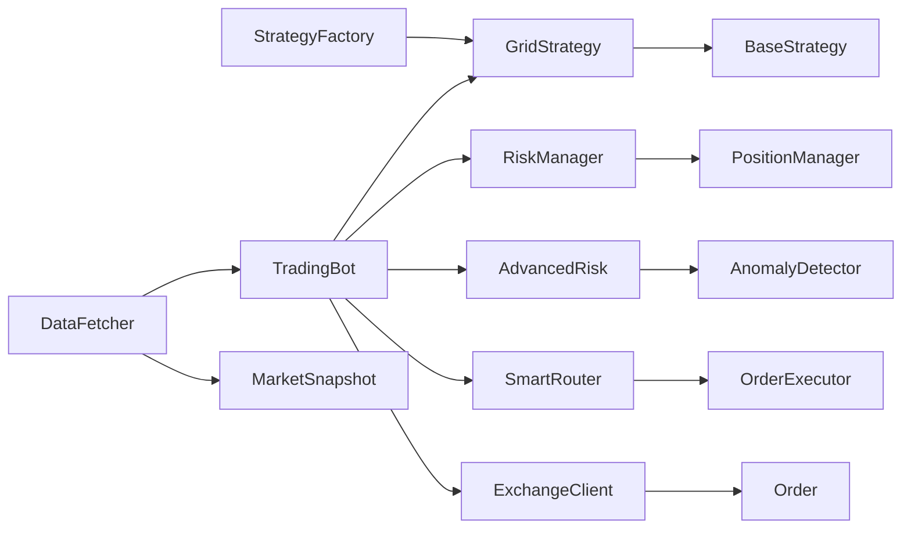

# 网格策略

<cite>
**本文引用的文件**
- [src/strategies/grid.py](file://src/strategies/grid.py)
- [src/strategies/base.py](file://src/strategies/base.py)
- [src/strategies/factory.py](file://src/strategies/factory.py)
- [src/utils/risk_manager.py](file://src/utils/risk_manager.py)
- [src/aetherlife/guard/risk_guard.py](file://src/aetherlife/guard/risk_guard.py)
- [src/trading_bot.py](file://src/trading_bot.py)
- [configs/config.json](file://configs/config.json)
- [src/aetherlife/evolution/engine.py](file://src/aetherlife/evolution/engine.py)
- [src/execution/order.py](file://src/execution/order.py)
- [src/aetherlife/perception/models.py](file://src/aetherlife/perception/models.py)
- [src/aetherlife/guard/advanced_risk.py](file://src/aetherlife/guard/advanced_risk.py)
- [src/aetherlife/execution/smart_router.py](file://src/aetherlife/execution/smart_router.py)
</cite>

## 更新摘要
**变更内容**
- 新增波动性风险管理机制，增强网格策略在高波动市场条件下的适应性
- 优化信号生成算法，改进网格线识别和触发逻辑
- 增强风控体系，集成异常检测和高级风险度量
- 完善滑点估算和订单路由机制，提升执行效率

## 目录
1. [引言](#引言)
2. [项目结构](#项目结构)
3. [核心组件](#核心组件)
4. [架构总览](#架构总览)
5. [详细组件分析](#详细组件分析)
6. [波动性风险管理](#波动性风险管理)
7. [依赖关系分析](#依赖关系分析)
8. [性能考量](#性能考量)
9. [故障排查指南](#故障排查指南)
10. [结论](#结论)
11. [附录](#附录)

## 引言
本文件围绕网格策略进行系统化技术文档化，重点阐述以下内容：
- 核心概念与工作机制：价格区间设定、网格密度计算、自动买卖触发逻辑
- 风险控制机制：最大网格数量限制、资金分配策略、止损保护措施
- 参数配置：网格间距、初始资金、交易手续费等关键参数的设置原则
- 不同市场环境下的表现：震荡市场的优势与单边行情的风险
- 波动性风险管理：新增的异常检测、VaR计算和高级风控机制
- 参数优化指南与实盘应用建议：结合回测流程与风控体系给出落地建议

## 项目结构
网格策略位于策略子系统中，采用"策略工厂 + 基类 + 风控 + 执行"的分层组织方式。主程序负责数据拉取、策略分析、风控检查与订单执行。新增的波动性风险管理模块提供了更高级的风险控制能力。

**图表来源**
- [src/strategies/grid.py](file://src/strategies/grid.py#L1-L71)
- [src/strategies/base.py](file://src/strategies/base.py#L1-L56)
- [src/strategies/factory.py](file://src/strategies/factory.py#L1-L36)
- [src/utils/risk_manager.py](file://src/utils/risk_manager.py#L1-L388)
- [src/aetherlife/guard/advanced_risk.py](file://src/aetherlife/guard/advanced_risk.py#L1-L558)
- [src/aetherlife/guard/risk_guard.py](file://src/aetherlife/guard/risk_guard.py#L1-L84)
- [src/trading_bot.py](file://src/trading_bot.py#L1-L370)
- [src/aetherlife/execution/smart_router.py](file://src/aetherlife/execution/smart_router.py#L1-L445)
- [src/execution/order.py](file://src/execution/order.py#L1-L26)
- [src/aetherlife/perception/models.py](file://src/aetherlife/perception/models.py#L1-L64)

**章节来源**
- [src/strategies/grid.py](file://src/strategies/grid.py#L1-L71)
- [src/strategies/base.py](file://src/strategies/base.py#L1-L56)
- [src/strategies/factory.py](file://src/strategies/factory.py#L1-L36)
- [src/trading_bot.py](file://src/trading_bot.py#L1-L370)

## 核心组件
- 策略基类：定义策略的统一接口（分析与信号生成），并提供参数导出能力。
- 网格策略：实现网格价格带、网格密度、当前所处网格的计算，并根据价格与网格位置关系生成买卖信号。
- 策略工厂：按类型创建具体策略实例，支持组合策略。
- 风控管理器：负责仓位规模计算、止损止盈检查、熔断与日级限额、交易记录与统计。
- 仓位管理器：维护开仓/平仓、浮动盈亏、止损止盈挂单。
- 高级风控：提供VaR计算、异常检测、合规检查等高级风险控制功能。
- 智能路由：根据市场条件和订单特征选择最优交易所和订单类型，估算滑点和手续费。
- 守护层：在更高层级对意图进行最终拦截，包含熔断与大额人工确认。
- 主控制器：拉取数据、调用策略、风控检查、下单执行、仓位监控与止盈止损。

**章节来源**
- [src/strategies/base.py](file://src/strategies/base.py#L6-L56)
- [src/strategies/grid.py](file://src/strategies/grid.py#L5-L71)
- [src/strategies/factory.py](file://src/strategies/factory.py#L10-L36)
- [src/utils/risk_manager.py](file://src/utils/risk_manager.py#L12-L388)
- [src/aetherlife/guard/advanced_risk.py](file://src/aetherlife/guard/advanced_risk.py#L229-L558)
- [src/aetherlife/guard/risk_guard.py](file://src/aetherlife/guard/risk_guard.py#L23-L84)
- [src/trading_bot.py](file://src/trading_bot.py#L27-L370)
- [src/aetherlife/execution/smart_router.py](file://src/aetherlife/execution/smart_router.py#L49-L445)

## 架构总览
网格策略在主循环中的工作流如下，新增了波动性风险管理环节：

**图表来源**
- [src/trading_bot.py](file://src/trading_bot.py#L103-L207)
- [src/aetherlife/guard/advanced_risk.py](file://src/aetherlife/guard/advanced_risk.py#L229-L351)
- [src/utils/risk_manager.py](file://src/utils/risk_manager.py#L175-L242)
- [src/aetherlife/execution/smart_router.py](file://src/aetherlife/execution/smart_router.py#L98-L159)
- [src/execution/order.py](file://src/execution/order.py#L4-L25)

## 详细组件分析

### 网格策略算法与信号生成
**更新** 优化了信号生成算法，改进了网格线识别和触发逻辑

- 价格区间设定：以基准价为中心，向上向下扩展至指定网格数量与网格间距，形成上下边界。
- 网格密度计算：网格线等间距分布于对数尺度上，便于在价格波动时保持单位收益稳定。
- 自动买卖触发逻辑：当最新价格靠近某网格线时，依据其相对当前位置的移动方向生成多/空信号；若已持有相反方向头寸，则触发平仓。

**图表来源**
- [src/strategies/grid.py](file://src/strategies/grid.py#L20-L71)

**章节来源**
- [src/strategies/grid.py](file://src/strategies/grid.py#L5-L71)

### 风险控制与资金分配
- 资金分配策略：基于账户总余额与最大仓位占比计算基础头寸，结合信号强度进行缩放，同时受最小/最大仓位限制。
- 止损止盈：按入场价与当前价计算盈亏百分比，满足阈值即触发平仓。
- 熔断与日限：单日累计亏损达到熔断阈值或连续亏损达到上限时暂停交易；同时限制日交易次数。
- 守护层拦截：在更高层级对意图进行最终拦截，必要时要求人工确认。

**图表来源**
- [src/utils/risk_manager.py](file://src/utils/risk_manager.py#L175-L242)
- [src/aetherlife/guard/risk_guard.py](file://src/aetherlife/guard/risk_guard.py#L48-L68)

**章节来源**
- [src/utils/risk_manager.py](file://src/utils/risk_manager.py#L12-L388)
- [src/aetherlife/guard/risk_guard.py](file://src/aetherlife/guard/risk_guard.py#L23-L84)

### 参数配置与设置原则
- 网格参数
  - 网格数量：决定网格带宽度与交易频率，数值越大覆盖范围越广但可能降低单次收益稳定性。
  - 网格间距：决定网格密度与信号敏感度，较小间距更灵敏但易产生频繁交易。
  - 基准价：可固定或动态取最近价格，影响网格带中心位置。
- 资金与风控参数
  - 最大仓位占比：控制单笔风险敞口占总资产的比例。
  - 止损/止盈比例：用于保护利润与限制损失。
  - 日级限额与熔断：控制连续亏损与交易频次。
- 配置来源
  - 策略配置与风控配置在主配置文件中集中管理，策略工厂按类型创建实例。

**章节来源**
- [src/strategies/grid.py](file://src/strategies/grid.py#L8-L18)
- [configs/config.json](file://configs/config.json#L10-L20)
- [src/strategies/factory.py](file://src/strategies/factory.py#L10-L36)

### 在不同市场环境下的表现
- 震荡市场（适合网格）
  - 优势：价格在网格带内反复穿越，可多次低买高卖，摊薄成本并累积利润。
  - 关注：网格间距应适中，避免过窄导致过度交易，或过宽导致收益稀释。
- 单边行情（高风险）
  - 风险：单边持续上涨或下跌可能导致头寸被快速止损或长时间无法获利。
  - 应对：适当收紧止损、减少网格数量、提高熔断阈值、必要时暂停交易。
- 高波动市场（新增）
  - 优势：通过异常检测和VaR计算，能够识别异常波动并及时调整策略。
  - 机制：利用波动率阈值检测异常价格和成交量，动态调整网格参数。

### 参数优化指南与实盘建议
- 回测流程
  - 使用策略工厂创建网格策略实例，对历史K线生成信号并计算总收益与夏普比率，筛选最优参数组合。
- 实盘建议
  - 从保守参数起步（较大网格间距、较小网格数量、严格止损止盈与熔断）。
  - 结合市场波动率调整网格间距；在高波动时段降低网格数量或提高熔断阈值。
  - 将网格策略与趋势策略结合，单边趋势强烈时切换到趋势策略或暂停网格交易。
  - 利用高级风控功能，定期进行VaR计算和异常检测，及时发现潜在风险。

**章节来源**
- [src/aetherlife/evolution/engine.py](file://src/aetherlife/evolution/engine.py#L90-L145)
- [src/strategies/factory.py](file://src/strategies/factory.py#L10-L36)

## 波动性风险管理

### 异常检测机制
**新增** 集成了高级异常检测功能，能够识别价格、成交量和波动率的异常模式

- 价格异常检测：通过Z-score计算检测异常的价格波动，当偏离历史平均超过设定阈值时发出警告。
- 成交量异常检测：监测成交量的异常激增，帮助识别市场情绪变化。
- 波动率异常检测：基于历史波动率计算，识别异常的市场波动情况。

**图表来源**
- [src/aetherlife/guard/advanced_risk.py](file://src/aetherlife/guard/advanced_risk.py#L266-L351)

### 风险价值(VaR)计算
**新增** 提供多种VaR计算方法，支持风险度量和资本配置

- 历史模拟法：基于历史收益率数据计算风险价值，无需假设分布形态。
- 参数法：假设收益率服从正态分布，通过均值和标准差计算VaR。
- 蒙特卡洛模拟：通过大量随机模拟计算风险价值，适用于复杂投资组合。

### 智能路由与滑点管理
**更新** 增强了订单执行效率，特别针对高波动市场

- 交易所选择：根据流动性数据自动选择最佳交易所，优先考虑Binance或Bybit的流动性。
- 订单类型优化：根据订单大小、紧急程度和市场条件选择最优订单类型（市价单、限价单、FOK等）。
- 滑点估算：考虑订单规模和市场波动性，提供更准确的滑点成本估算。

**图表来源**
- [src/aetherlife/execution/smart_router.py](file://src/aetherlife/execution/smart_router.py#L98-L159)
- [src/aetherlife/execution/smart_router.py](file://src/aetherlife/execution/smart_router.py#L239-L262)

**章节来源**
- [src/aetherlife/guard/advanced_risk.py](file://src/aetherlife/guard/advanced_risk.py#L229-L558)
- [src/aetherlife/execution/smart_router.py](file://src/aetherlife/execution/smart_router.py#L49-L445)

## 依赖关系分析
- 策略层
  - GridStrategy 继承自 BaseStrategy，遵循统一接口。
  - 策略工厂根据类型映射创建具体策略实例。
- 风控层
  - TradingBot 依赖 RiskManager 与 PositionManager 进行风控与仓位管理。
  - AdvancedRisk 提供高级风险控制功能，包括异常检测和VaR计算。
  - RiskGuard 在更高层级对意图进行拦截。
- 执行层
  - TradingBot 通过 SmartRouter 和 ExchangeClient 下达市价单，订单模型参考市价单实现。
- 数据层
  - DataFetcher 提供OHLCV与Ticker，统一数据模型用于感知层与策略层。

**图表来源**
- [src/strategies/grid.py](file://src/strategies/grid.py#L3-L4)
- [src/strategies/base.py](file://src/strategies/base.py#L6-L22)
- [src/strategies/factory.py](file://src/strategies/factory.py#L10-L36)
- [src/trading_bot.py](file://src/trading_bot.py#L13-L22)
- [src/aetherlife/guard/advanced_risk.py](file://src/aetherlife/guard/advanced_risk.py#L229-L351)
- [src/aetherlife/execution/smart_router.py](file://src/aetherlife/execution/smart_router.py#L49-L159)
- [src/execution/order.py](file://src/execution/order.py#L13-L25)
- [src/aetherlife/perception/models.py](file://src/aetherlife/perception/models.py#L15-L64)

**章节来源**
- [src/strategies/grid.py](file://src/strategies/grid.py#L1-L71)
- [src/strategies/base.py](file://src/strategies/base.py#L1-L56)
- [src/strategies/factory.py](file://src/strategies/factory.py#L1-L36)
- [src/trading_bot.py](file://src/trading_bot.py#L1-L370)
- [src/aetherlife/guard/advanced_risk.py](file://src/aetherlife/guard/advanced_risk.py#L1-L558)
- [src/aetherlife/execution/smart_router.py](file://src/aetherlife/execution/smart_router.py#L1-L445)
- [src/execution/order.py](file://src/execution/order.py#L1-L26)
- [src/aetherlife/perception/models.py](file://src/aetherlife/perception/models.py#L1-L64)

## 性能考量
- 计算复杂度
  - analyze 中网格线生成与当前网格定位为线性操作，整体时间复杂度与K线长度成正比。
  - generate_signals 对每个网格线做阈值判断，整体复杂度与网格数量成线性关系。
  - 新增的异常检测算法使用deque数据结构，历史数据管理更高效。
- 优化建议
  - 降低网格数量或使用缓存最近一次网格线集合以减少重复计算。
  - 将阈值判断改为向量化操作，提升大数据量下的处理效率。
  - 在高频场景下，合并风控检查与下单逻辑，减少网络往返与锁竞争。
  - 利用异常检测的deque结构，避免list.pop(0)的O(n)性能问题。

**章节来源**
- [src/aetherlife/guard/advanced_risk.py](file://src/aetherlife/guard/advanced_risk.py#L261-L265)

## 故障排查指南
- 网格信号异常
  - 检查基准价是否正确初始化，以及网格数量与间距是否合理。
  - 确认当前价格是否处于网格带范围内，避免边界情况导致信号不生效。
  - 注意新增的loc精确赋值机制，避免历史信号被意外覆盖。
- 仓位为0或下单失败
  - 核对风控计算的仓位是否小于最小交易单位，必要时调整最小仓位占比或信号强度。
  - 检查交易所精度与最小下单量限制，确保数量四舍五入后仍满足要求。
  - 利用智能路由功能，检查订单类型选择是否合适。
- 风控拦截频繁
  - 检查熔断阈值、日限额与连败次数设置是否过于严苛；根据回测结果逐步放宽。
  - 关注守护层的人工确认阈值，避免因大额头寸被误拦截。
  - 利用异常检测功能，检查是否存在市场异常波动影响策略表现。
- 波动性风险
  - 监控VaR计算结果，及时发现风险上升趋势。
  - 检查异常检测告警，特别是价格和成交量异常。
  - 根据波动率变化动态调整网格参数。

**章节来源**
- [src/strategies/grid.py](file://src/strategies/grid.py#L42-L71)
- [src/utils/risk_manager.py](file://src/utils/risk_manager.py#L62-L72)
- [src/trading_bot.py](file://src/trading_bot.py#L134-L142)
- [src/aetherlife/guard/risk_guard.py](file://src/aetherlife/guard/risk_guard.py#L48-L68)
- [src/aetherlife/guard/advanced_risk.py](file://src/aetherlife/guard/advanced_risk.py#L266-L351)

## 结论
网格策略在震荡市场具备稳定的套利机会，但对参数与风控要求较高。通过合理的网格间距与数量、严格的止损止盈与熔断机制，可在不同市场环境下实现稳健收益。新增的波动性风险管理功能进一步增强了策略在高波动市场条件下的适应性，包括异常检测、VaR计算和智能路由等功能。建议以回测驱动参数优化，并结合实盘风控体系与守护层拦截，确保系统在单边行情中具备足够的生存能力。通过集成高级风险管理和智能执行机制，网格策略能够在各种市场条件下保持更好的稳定性。

## 附录
- 关键参数清单
  - 网格数量：决定网格带宽度与交易频率
  - 网格间距：决定网格密度与信号敏感度
  - 基准价：网格中心位置
  - 最大仓位占比：单笔风险敞口上限
  - 止损/止盈比例：保护利润与限制损失
  - 日级限额与熔断：控制连续亏损与交易频次
  - 波动率阈值：异常检测敏感度
  - VaR置信水平：风险度量参数
- 配置示例路径
  - 策略与风控配置：[configs/config.json](file://configs/config.json#L10-L20)
  - 默认配置与回退参数：[src/trading_bot.py](file://src/trading_bot.py#L324-L344)
- 高级功能
  - 异常检测器：[src/aetherlife/guard/advanced_risk.py](file://src/aetherlife/guard/advanced_risk.py#L229-L351)
  - VaR计算器：[src/aetherlife/guard/advanced_risk.py](file://src/aetherlife/guard/advanced_risk.py#L64-L227)
  - 智能路由：[src/aetherlife/execution/smart_router.py](file://src/aetherlife/execution/smart_router.py#L49-L445)