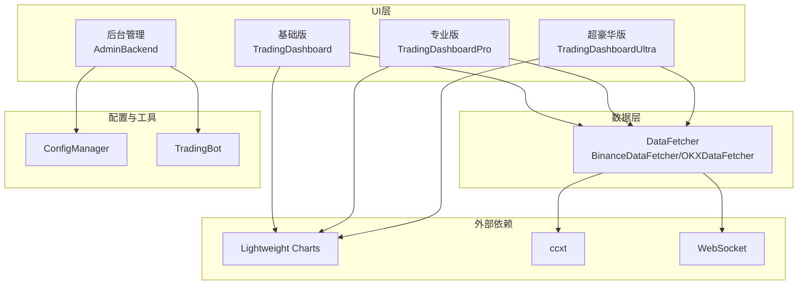
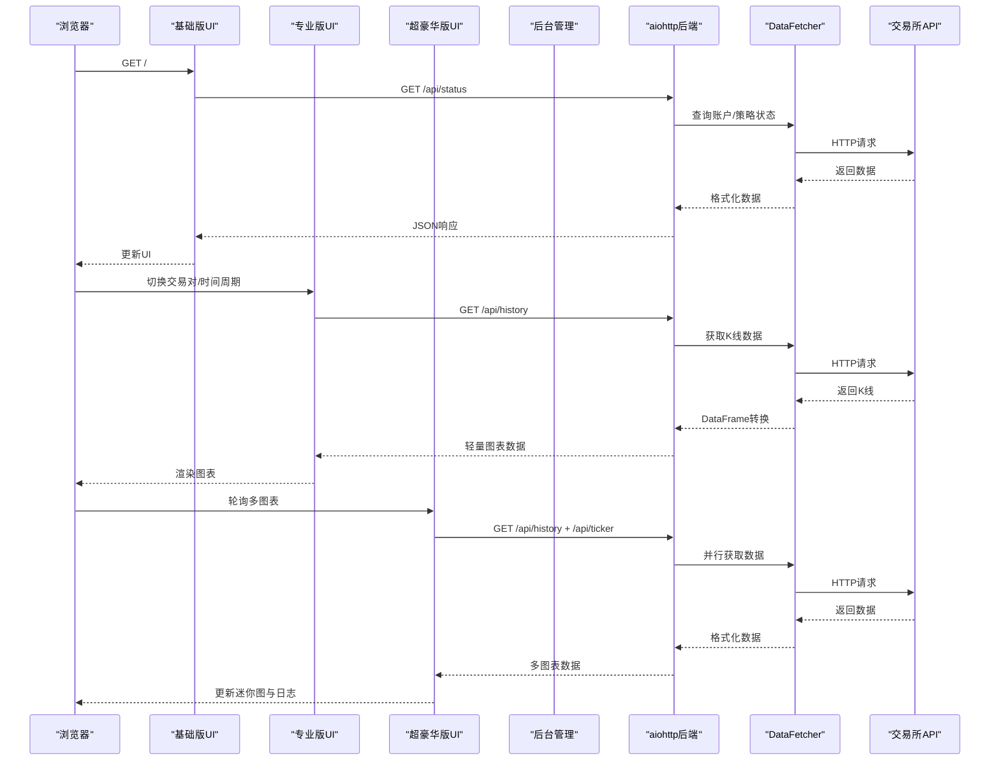
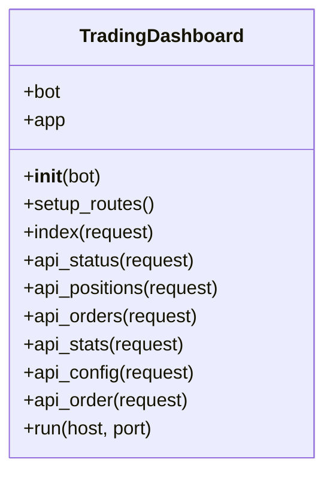
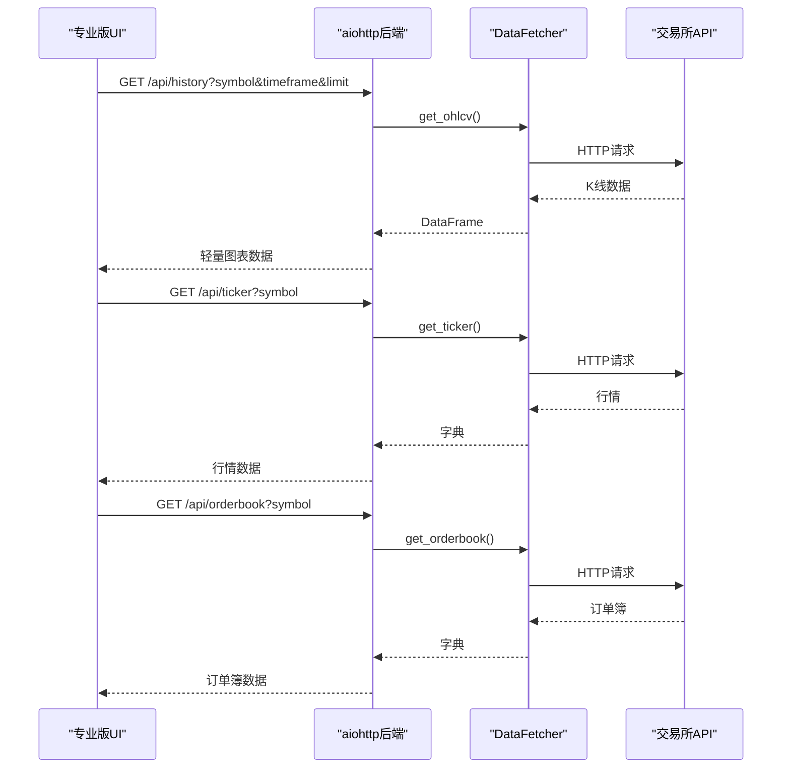
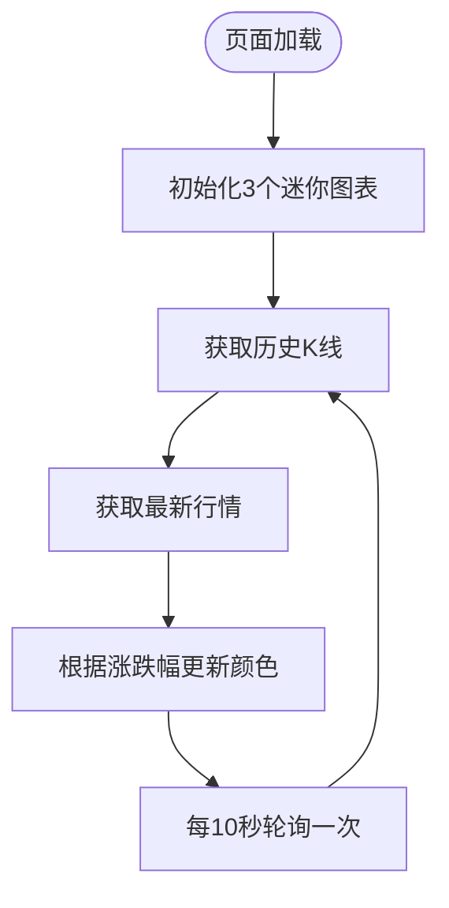
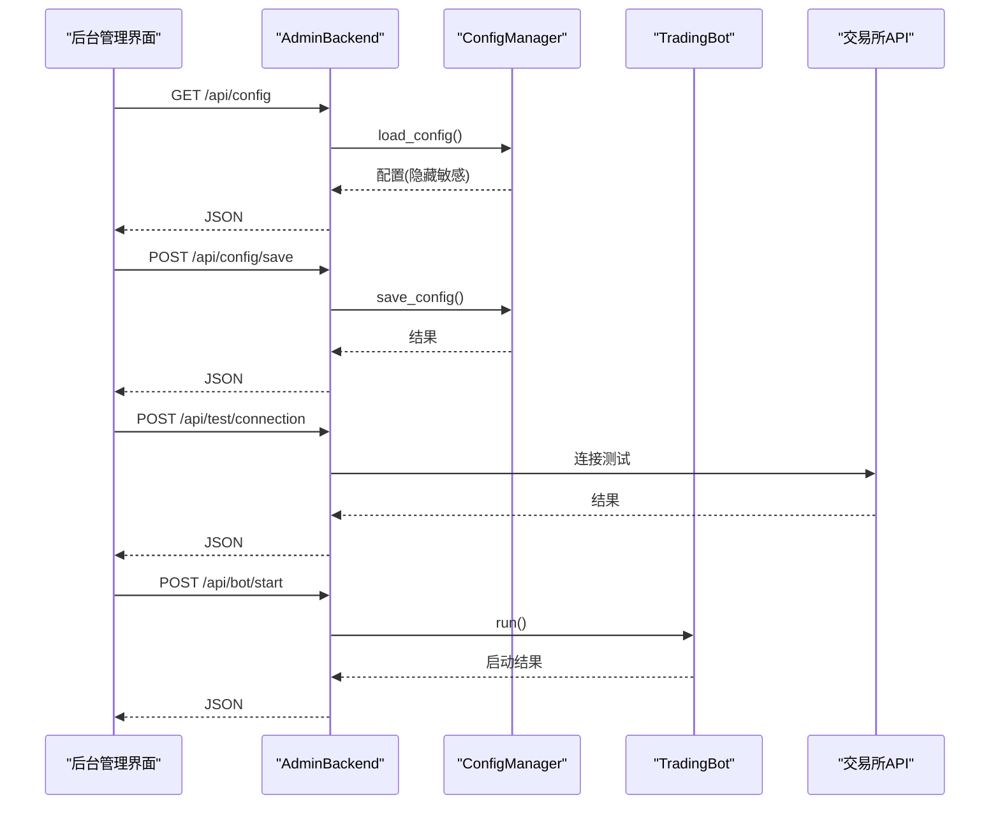
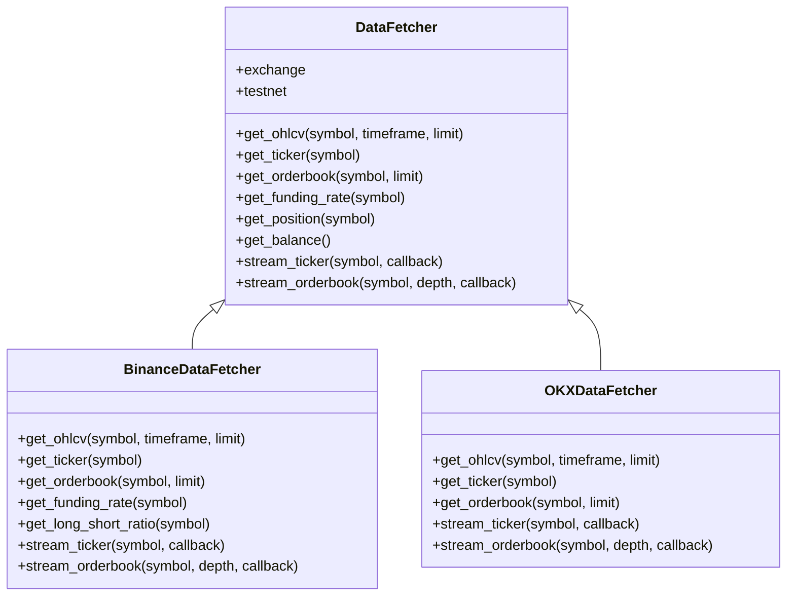
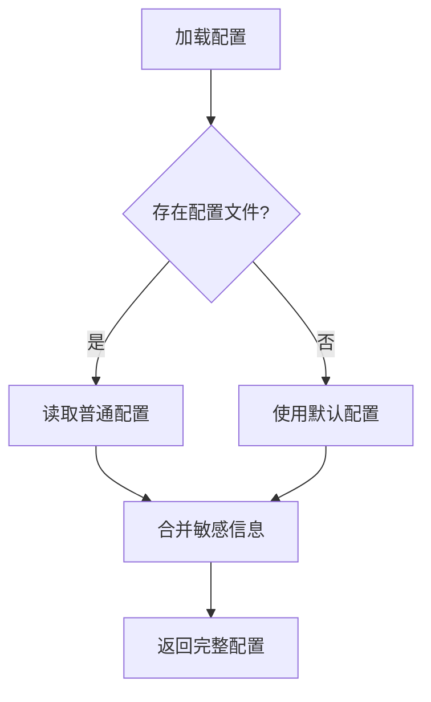
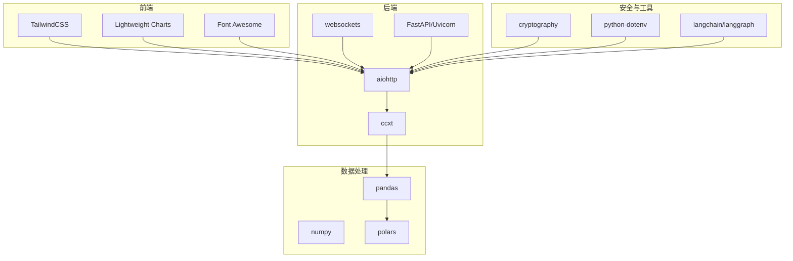

# Web仪表盘

<cite>
**本文档引用的文件**
- [src/ui/dashboard.py](file://src/ui/dashboard.py)
- [src/ui/dashboard_pro.py](file://src/ui/dashboard_pro.py)
- [src/ui/dashboard_ultra.py](file://src/ui/dashboard_ultra.py)
- [src/ui/admin_page.html](file://src/ui/admin_page.html)
- [src/ui/admin_backend.py](file://src/ui/admin_backend.py)
- [src/ui/run.py](file://src/ui/run.py)
- [src/data/data_fetcher.py](file://src/data/data_fetcher.py)
- [src/utils/config_manager.py](file://src/utils/config_manager.py)
- [src/trading_bot.py](file://src/trading_bot.py)
- [requirements.txt](file://requirements.txt)
- [start_admin.py](file://start_admin.py)
- [check_admin.py](file://check_admin.py)
</cite>

## 目录
1. [简介](#简介)
2. [项目结构](#项目结构)
3. [核心组件](#核心组件)
4. [架构总览](#架构总览)
5. [详细组件分析](#详细组件分析)
6. [依赖关系分析](#依赖关系分析)
7. [性能考量](#性能考量)
8. [故障排查指南](#故障排查指南)
9. [结论](#结论)
10. [附录](#附录)

## 简介
本项目为量化交易系统的Web仪表盘，提供三种可视化版本：
- 基础版：简洁的实时监控面板与交互式K线图表
- 专业版：支持多市场、多时间周期、订单簿与指标叠加的专业级终端
- 超豪华版：全景监控与AI信号处理的沉浸式控制室界面

系统采用深色主题、毛玻璃效果与响应式布局，结合Lightweight Charts实现高性能K线渲染，并通过RESTful API与WebSocket实现数据与控制的实时交互。

## 项目结构
仪表盘相关的核心文件组织如下：
- UI层：基础版、专业版、超豪华版三个独立的Web应用
- 后台管理：独立的管理界面与API服务
- 数据层：统一的数据获取器，支持Binance与OKX
- 配置管理：安全存储与验证API密钥
- 启动入口：统一的启动脚本与模式选择

**图表来源**
- [src/ui/dashboard.py](file://src/ui/dashboard.py#L13-L385)
- [src/ui/dashboard_pro.py](file://src/ui/dashboard_pro.py#L10-L580)
- [src/ui/dashboard_ultra.py](file://src/ui/dashboard_ultra.py#L9-L434)
- [src/ui/admin_backend.py](file://src/ui/admin_backend.py#L20-L447)
- [src/data/data_fetcher.py](file://src/data/data_fetcher.py#L17-L434)
- [src/utils/config_manager.py](file://src/utils/config_manager.py#L14-L212)

**章节来源**
- [src/ui/run.py](file://src/ui/run.py#L1-L102)
- [requirements.txt](file://requirements.txt#L1-L70)

## 核心组件
- 基础版仪表盘：提供总权益、当前持仓、今日交易、胜率等关键指标；集成Lightweight Charts展示K线；支持快速买入/卖出按钮与订单提交。
- 专业版终端：多市场选择、多时间周期切换、订单簿深度展示、MA指标叠加、实时行情轮询与图表缩放。
- 超豪华版控制室：多图表网格、AI信号面板、风控雷达图、事件日志与全局状态展示。
- 后台管理系统：配置管理、API测试、策略参数、风控设置、AI功能开关与系统设置。
- 数据获取器：统一抽象Binance与OKX的K线、行情、订单簿与WebSocket流。
- 配置管理器：加密存储API密钥与配置，提供默认配置与导出功能。

**章节来源**
- [src/ui/dashboard.py](file://src/ui/dashboard.py#L13-L385)
- [src/ui/dashboard_pro.py](file://src/ui/dashboard_pro.py#L10-L580)
- [src/ui/dashboard_ultra.py](file://src/ui/dashboard_ultra.py#L9-L434)
- [src/ui/admin_page.html](file://src/ui/admin_page.html#L1-L790)
- [src/ui/admin_backend.py](file://src/ui/admin_backend.py#L20-L447)
- [src/data/data_fetcher.py](file://src/data/data_fetcher.py#L17-L434)
- [src/utils/config_manager.py](file://src/utils/config_manager.py#L14-L212)

## 架构总览
系统采用前后端分离的架构：
- 前端：HTML + TailwindCSS + JavaScript，使用Lightweight Charts渲染K线，通过fetch与WebSocket获取数据。
- 后端：Python aiohttp提供RESTful API，支持数据查询、配置管理、机器人控制等。
- 数据层：统一的DataFetcher抽象，屏蔽交易所差异，支持异步HTTP与WebSocket。
- 安全：配置管理器对敏感信息进行加密存储，后台管理界面提供API测试与验证。

**图表来源**
- [src/ui/dashboard.py](file://src/ui/dashboard.py#L338-L375)
- [src/ui/dashboard_pro.py](file://src/ui/dashboard_pro.py#L29-L77)
- [src/ui/dashboard_ultra.py](file://src/ui/dashboard_ultra.py#L28-L59)
- [src/data/data_fetcher.py](file://src/data/data_fetcher.py#L85-L119)

## 详细组件分析

### 基础版仪表盘（TradingDashboard）
- 设计理念：极简信息密度，突出关键指标与实时图表；深色主题与毛玻璃面板营造科技感。
- 实时监控面板：总权益、当前持仓、今日交易、胜率四个卡片，数据来自后端状态接口。
- 交互式K线图表：Lightweight Charts集成，支持窗口大小调整；演示数据通过定时器更新。
- 快速交易控制：买入/卖出按钮，点击后向后端提交订单请求。
- 策略状态显示：当前策略名称、自动交易状态与信号强度条形图。
- 最近活动：表格展示订单历史，支持滚动查看。

**图表来源**
- [src/ui/dashboard.py](file://src/ui/dashboard.py#L13-L385)

**章节来源**
- [src/ui/dashboard.py](file://src/ui/dashboard.py#L31-L385)

### 专业版终端（TradingDashboardPro）
- 多市场与多时间周期：顶部导航支持切换交易对与时间周期，底部面板展示当前持仓与委托。
- 订单簿与最新成交：右侧边栏展示买卖盘深度与价差，支持快速交易输入框。
- 图表功能：支持MA7/MA25叠加，指标开关切换，图表自动缩放。
- 实时数据：定时轮询行情与订单簿，简化蜡烛图更新逻辑。
- 资产账户：展示总资产估值、可用余额与操作按钮。

**图表来源**
- [src/ui/dashboard_pro.py](file://src/ui/dashboard_pro.py#L29-L77)
- [src/data/data_fetcher.py](file://src/data/data_fetcher.py#L85-L157)

**章节来源**
- [src/ui/dashboard_pro.py](file://src/ui/dashboard_pro.py#L25-L580)

### 超豪华版控制室（TradingDashboardUltra）
- 全景布局：网格化布局，包含市场热力图、AI信号面板、风控雷达、多图表网格与事件日志。
- 多图表：每个图表展示单一币种的迷你面积图，随时间轮询更新；根据涨跌幅动态切换颜色。
- 风控雷达：使用Chart.js绘制多维风控指标雷达图。
- 事件日志：定时追加系统心跳日志，自动滚动至最新消息。
- 毛玻璃与霓虹风格：强调沉浸式体验，适合大屏监控。

**图表来源**
- [src/ui/dashboard_ultra.py](file://src/ui/dashboard_ultra.py#L367-L409)

**章节来源**
- [src/ui/dashboard_ultra.py](file://src/ui/dashboard_ultra.py#L60-L434)

### 后台管理系统（AdminBackend + admin_page.html）
- 管理界面：侧边导航、标签页切换、通知提示与状态指示。
- 配置管理：加载/保存/重置/导出配置；隐藏敏感信息显示；支持多策略参数。
- API测试：验证API密钥格式与连接有效性；测试公开接口。
- 机器人控制：启动/停止交易机器人，轮询状态更新。
- 交易所与策略：支持Binance/OKX，提供策略列表与参数模板。

**图表来源**
- [src/ui/admin_backend.py](file://src/ui/admin_backend.py#L57-L396)
- [src/utils/config_manager.py](file://src/utils/config_manager.py#L82-L144)

**章节来源**
- [src/ui/admin_page.html](file://src/ui/admin_page.html#L1-L790)
- [src/ui/admin_backend.py](file://src/ui/admin_backend.py#L20-L447)
- [src/utils/config_manager.py](file://src/utils/config_manager.py#L14-L212)

### 数据获取器（DataFetcher）
- 统一抽象：定义get_ohlcv、get_ticker、get_orderbook、stream_ticker、stream_orderbook等接口。
- Binance实现：支持测试网与正式网，提供K线、行情、订单簿与WebSocket流。
- OKX实现：支持测试网与正式网，提供K线、行情、订单簿与WebSocket流。
- WebSocket：持续监听市场数据，回调处理并传递给UI层。

**图表来源**
- [src/data/data_fetcher.py](file://src/data/data_fetcher.py#L17-L434)

**章节来源**
- [src/data/data_fetcher.py](file://src/data/data_fetcher.py#L17-L434)

### 配置管理器（ConfigManager）
- 加密存储：使用Fernet对API密钥等敏感信息进行加密存储，保护配置文件。
- 默认配置：提供完整的默认配置模板，便于快速启动。
- 导出与验证：支持导出配置（可选包含敏感信息），验证API密钥格式。

**图表来源**
- [src/utils/config_manager.py](file://src/utils/config_manager.py#L82-L144)

**章节来源**
- [src/utils/config_manager.py](file://src/utils/config_manager.py#L14-L212)

## 依赖关系分析
- 前端依赖：TailwindCSS提供响应式与毛玻璃样式；Lightweight Charts负责高性能K线渲染；Font Awesome图标库。
- 后端依赖：aiohttp提供异步HTTP服务；ccxt支持多交易所统一接口；websockets用于WebSocket通信。
- 数据处理：pandas/numpy进行数据转换与计算；polars作为高性能替代方案。
- 安全与工具：cryptography进行配置加密；dotenv管理环境变量；langchain/langgraph支持AI增强功能。

**图表来源**
- [requirements.txt](file://requirements.txt#L1-L70)

**章节来源**
- [requirements.txt](file://requirements.txt#L1-L70)

## 性能考量
- 异步I/O：使用aiohttp与async/await减少阻塞，提升并发处理能力。
- 轻量图表：Lightweight Charts针对K线场景优化，支持大规模数据渲染。
- 轮询策略：专业版与超豪华版采用定时轮询，平衡实时性与资源消耗。
- 数据缓存：配置管理器与数据获取器内部维护会话与连接，减少重复建立成本。
- WebSocket：交易所WebSocket流提供低延迟数据，建议在生产环境中优先使用。

[本节为通用指导，无需具体文件分析]

## 故障排查指南
- 后台管理界面无法访问
  - 使用检查脚本确认端口占用情况
  - 确认后台服务已启动并监听指定端口
- API密钥验证失败
  - 检查密钥长度与格式要求
  - 确认测试网/正式网选择正确
- 交易所连接异常
  - 查看API测试返回的错误信息
  - 检查网络连通性与代理设置
- 图表数据为空
  - 确认数据获取器初始化成功
  - 检查交易所API返回状态码与数据格式
- WebSocket连接断开
  - 检查心跳设置与网络稳定性
  - 确认回调函数正确注册

**章节来源**
- [check_admin.py](file://check_admin.py#L1-L40)
- [src/ui/admin_backend.py](file://src/ui/admin_backend.py#L159-L209)
- [src/data/data_fetcher.py](file://src/data/data_fetcher.py#L85-L119)

## 结论
该Web仪表盘系统以模块化设计实现了从数据获取、策略执行到可视化展示的完整闭环。基础版注重简洁与易用，专业版强调功能完整性，超豪华版追求沉浸式监控体验。通过统一的数据抽象与安全的配置管理，系统具备良好的扩展性与安全性。建议在生产环境中优先采用WebSocket实现实时数据流，并结合AI增强模块提升决策质量。

[本节为总结性内容，无需具体文件分析]

## 附录

### API接口设计（RESTful）
- 状态查询
  - GET /api/status：返回总权益、持仓、今日交易、胜率等状态信息
  - GET /api/stats：返回交易统计（总交易数、胜/负次数、总盈亏）
- 订单管理
  - GET /api/positions：返回当前持仓列表
  - GET /api/orders：返回当前委托与历史委托
  - POST /api/order：提交买入/卖出订单
- 配置更新
  - GET /api/config：获取当前配置（隐藏敏感信息）
  - POST /api/config/save：保存配置
  - POST /api/config/reset：重置为默认配置
  - GET /api/config/export：导出配置（可选包含敏感信息）
- 后台管理
  - POST /api/test/connection：测试API连接
  - POST /api/test/api：测试公开接口
  - GET /api/exchanges：获取支持的交易所列表
  - GET /api/symbols：获取交易对列表
  - GET /api/strategies：获取可用策略列表
  - POST /api/bot/start：启动交易机器人
  - POST /api/bot/stop：停止交易机器人
  - GET /api/bot/status：获取机器人状态

**章节来源**
- [src/ui/dashboard.py](file://src/ui/dashboard.py#L338-L375)
- [src/ui/admin_backend.py](file://src/ui/admin_backend.py#L29-L51)

### WebSocket连接与实时数据更新
- 专业版：通过WebSocket订阅实时行情与订单簿，回调处理后更新UI
- 超豪华版：WebSocket用于高频数据流，图表实时刷新
- 基础版：演示数据通过定时器更新，生产环境建议替换为WebSocket

**章节来源**
- [src/data/data_fetcher.py](file://src/data/data_fetcher.py#L188-L234)
- [src/ui/dashboard_pro.py](file://src/ui/dashboard_pro.py#L395-L457)

### 不同版本仪表盘的差异化功能
- 基础版：简洁指标面板 + 交互式K线 + 快速交易按钮
- 专业版：多市场/多时间周期 + 订单簿 + MA指标 + 资产账户
- 超豪华版：全景网格布局 + AI信号面板 + 风控雷达 + 事件日志

**章节来源**
- [src/ui/dashboard.py](file://src/ui/dashboard.py#L96-L203)
- [src/ui/dashboard_pro.py](file://src/ui/dashboard_pro.py#L200-L344)
- [src/ui/dashboard_ultra.py](file://src/ui/dashboard_ultra.py#L191-L304)

### 自定义开发指南
- 样式修改
  - 深色主题：通过Tailwind配置与CSS变量调整背景色与文字色
  - 毛玻璃效果：使用backdrop-filter与半透明边框实现
  - 响应式布局：利用Tailwind网格与断点适配不同屏幕尺寸
- 功能扩展
  - 新增UI：参考现有类的路由与HTML模板结构
  - 新增API：在对应后端类中添加路由与处理逻辑
  - 新增策略：在策略工厂中注册新策略并提供参数模板
- 主题定制
  - 颜色体系：通过Tailwind theme.extend定义品牌色与语义色
  - 字体与排版：引入Google Fonts并配置字体族与字号
  - 动画与过渡：使用Tailwind动画类与自定义CSS实现流畅交互

**章节来源**
- [src/ui/dashboard.py](file://src/ui/dashboard.py#L35-L74)
- [src/ui/dashboard_pro.py](file://src/ui/dashboard_pro.py#L89-L153)
- [src/ui/dashboard_ultra.py](file://src/ui/dashboard_ultra.py#L72-L153)