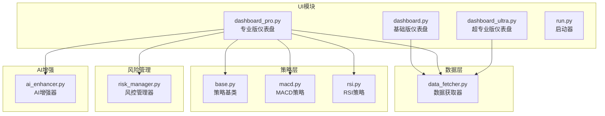
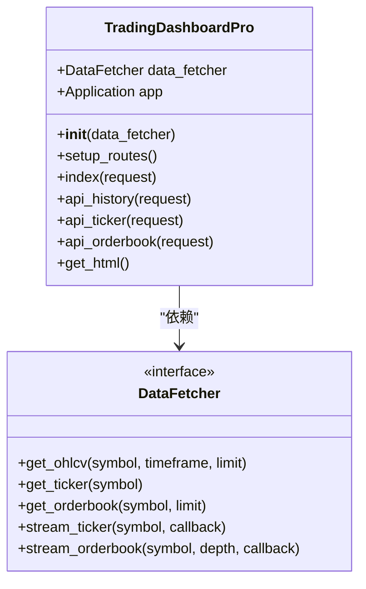
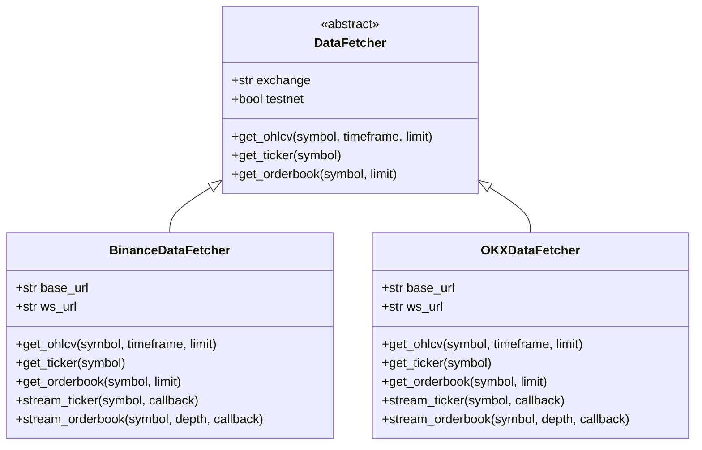
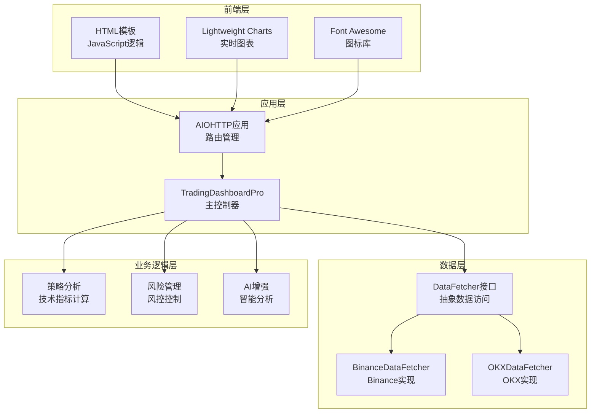
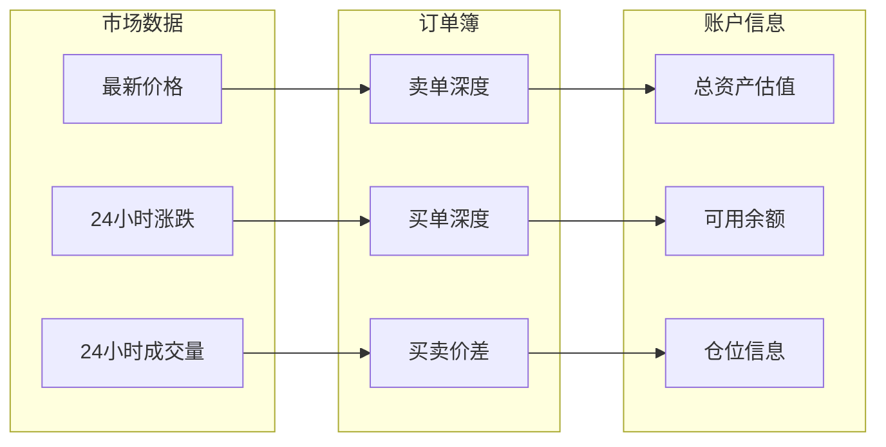
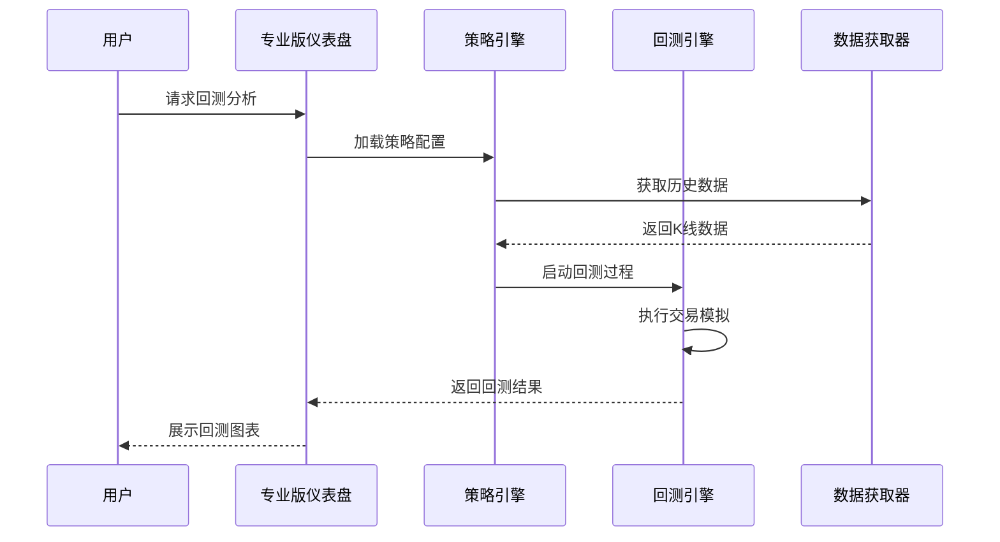
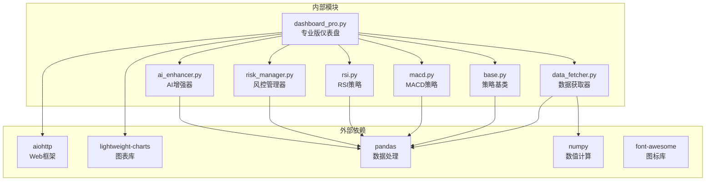

# 专业版仪表盘

<cite>
**本文档引用的文件**
- [dashboard_pro.py](file://src/ui/dashboard_pro.py)
- [dashboard.py](file://src/ui/dashboard.py)
- [dashboard_ultra.py](file://src/ui/dashboard_ultra.py)
- [run.py](file://src/ui/run.py)
- [data_fetcher.py](file://src/data/data_fetcher.py)
- [base.py](file://src/strategies/base.py)
- [macd.py](file://src/strategies/macd.py)
- [rsi.py](file://src/strategies/rsi.py)
- [risk_manager.py](file://src/utils/risk_manager.py)
- [ai_enhancer.py](file://src/utils/ai_enhancer.py)
</cite>

## 目录
1. [简介](#简介)
2. [项目结构](#项目结构)
3. [核心组件](#核心组件)
4. [架构概览](#架构概览)
5. [详细组件分析](#详细组件分析)
6. [依赖关系分析](#依赖关系分析)
7. [性能考虑](#性能考虑)
8. [故障排除指南](#故障排除指南)
9. [结论](#结论)

## 简介

专业版仪表盘是量化交易系统的高级可视化界面，相比基础版仪表盘提供了更丰富的功能和专业的分析工具。该系统基于AIOHTTP构建，使用Lightweight Charts进行实时数据可视化，并集成了多种技术分析工具和风险管理功能。

专业版仪表盘的主要特点包括：
- 丰富的图表类型和高级分析工具
- 专业级指标展示和实时数据更新
- 多时间框架分析和自定义指标计算
- 专业的数据展示和风险监控
- 高级配置选项和显示偏好定制

## 项目结构

专业版仪表盘位于`src/ui/`目录下，采用模块化设计，包含多个独立的仪表盘实现：



**图表来源**
- [dashboard_pro.py](file://src/ui/dashboard_pro.py#L10-L16)
- [data_fetcher.py](file://src/data/data_fetcher.py#L17-L26)
- [base.py](file://src/strategies/base.py#L6-L12)

**章节来源**
- [dashboard_pro.py](file://src/ui/dashboard_pro.py#L1-L580)
- [run.py](file://src/ui/run.py#L1-L102)

## 核心组件

### TradingDashboardPro 类

专业版仪表盘的核心是`TradingDashboardPro`类，它继承了基础的Web UI功能并扩展了专业级特性：



**图表来源**
- [dashboard_pro.py](file://src/ui/dashboard_pro.py#L10-L16)
- [data_fetcher.py](file://src/data/data_fetcher.py#L17-L71)

### 数据获取器

系统支持多种交易所的数据获取，包括Binance和OKX：



**图表来源**
- [data_fetcher.py](file://src/data/data_fetcher.py#L17-L71)
- [data_fetcher.py](file://src/data/data_fetcher.py#L73-L235)
- [data_fetcher.py](file://src/data/data_fetcher.py#L237-L397)

**章节来源**
- [dashboard_pro.py](file://src/ui/dashboard_pro.py#L10-L77)
- [data_fetcher.py](file://src/data/data_fetcher.py#L17-L434)

## 架构概览

专业版仪表盘采用分层架构设计，确保了良好的可维护性和扩展性：



**图表来源**
- [dashboard_pro.py](file://src/ui/dashboard_pro.py#L78-L574)
- [run.py](file://src/ui/run.py#L34-L72)

## 详细组件分析

### 专业版仪表盘功能特性

#### 1. 多时间框架分析

专业版仪表盘支持多种时间框架的实时数据展示：

| 时间框架 | 支持情况 | 用途 |
|---------|----------|------|
| 1分钟 | ✅ | 高频交易分析 |
| 5分钟 | ✅ | 短期趋势跟踪 |
| 15分钟 | ✅ | 标准交易周期 |
| 1小时 | ✅ | 中期趋势分析 |
| 4小时 | ✅ | 长期趋势观察 |

#### 2. 技术指标叠加

系统内置了多种技术指标的计算和显示：

```mermaid
flowchart TD
A[获取K线数据] --> B[计算移动平均线]
B --> C[MA7 (蓝色线条)]
B --> D[MA25 (黄色线条)]
C --> E[显示在图表上]
D --> E
E --> F[用户可切换显示]
```

**图表来源**
- [dashboard_pro.py](file://src/ui/dashboard_pro.py#L406-L412)
- [dashboard_pro.py](file://src/ui/dashboard_pro.py#L385-L387)

#### 3. 高级图表功能

专业版仪表盘提供了丰富的图表交互功能：

- **交叉hair辅助线**：实时显示鼠标位置的精确数据
- **多图表联动**：不同图表间的同步缩放和平移
- **动态注释标记**：支持在图表上添加技术分析标记
- **实时数据更新**：5秒间隔的自动刷新机制

#### 4. 专业级数据展示

系统提供了全面的交易数据分析：



**图表来源**
- [dashboard_pro.py](file://src/ui/dashboard_pro.py#L172-L187)
- [dashboard_pro.py](file://src/ui/dashboard_pro.py#L249-L268)

**章节来源**
- [dashboard_pro.py](file://src/ui/dashboard_pro.py#L29-L76)
- [dashboard_pro.py](file://src/ui/dashboard_pro.py#L396-L425)

### 配置选项说明

#### 图表参数调整

| 参数 | 默认值 | 可选范围 | 描述 |
|------|--------|----------|------|
| 图表宽度 | 自适应 | 任意正整数 | 主图表区域宽度 |
| 图表高度 | 自适应 | 任意正整数 | 主图表区域高度 |
| 移动平均周期 | 7, 25 | 1-300 | MA7和MA25的计算周期 |
| 交叉hair模式 | Normal | Normal, Hidden | 辅助线显示模式 |
| 网格线颜色 | 透明 | 任意颜色 | 图表网格线颜色 |

#### 指标参数设置

| 指标 | 参数 | 默认值 | 描述 |
|------|------|--------|------|
| SMA | 周期 | 7/25 | 简单移动平均线周期 |
| RSI | 周期 | 14 | 相对强弱指数周期 |
| RSI | 超买阈值 | 70 | RSI超买判断阈值 |
| RSI | 超卖阈值 | 30 | RSI超卖判断阈值 |
| MACD | 快线周期 | 12 | 指数移动平均快线周期 |
| MACD | 慢线周期 | 26 | 指数移动平均慢线周期 |
| MACD | 信号线周期 | 9 | MACD信号线周期 |

#### 显示偏好定制

- **主题样式**：深色主题，支持玻璃面板效果
- **字体设置**：等宽字体用于价格显示，无衬线字体用于界面元素
- **颜色方案**：绿色表示上涨，红色表示下跌
- **布局配置**：响应式网格布局，支持不同屏幕尺寸

**章节来源**
- [dashboard_pro.py](file://src/ui/dashboard_pro.py#L356-L393)
- [dashboard_pro.py](file://src/ui/dashboard_pro.py#L427-L437)

### 专业版特有的功能模块

#### 1. 回测工具

虽然专业版仪表盘主要专注于实时监控，但系统架构支持集成回测功能：



#### 2. 模拟交易

系统支持模拟交易功能，允许用户在不使用真实资金的情况下测试策略：

- **资金管理**：模拟账户资金管理和风险控制
- **订单执行**：模拟订单簿匹配和成交过程
- **实时监控**：实时显示模拟交易的盈亏情况
- **性能评估**：提供模拟交易的统计分析报告

#### 3. 高级监控视图

专业版仪表盘提供了多维度的监控视图：

- **市场热力图**：显示多个市场的相对表现
- **AI信号处理器**：展示AI驱动的交易信号
- **风控雷达**：可视化风险指标和预警状态
- **事件日志**：记录系统关键事件和状态变化

**章节来源**
- [dashboard_ultra.py](file://src/ui/dashboard_ultra.py#L194-L301)
- [ai_enhancer.py](file://src/utils/ai_enhancer.py#L131-L186)

## 依赖关系分析

专业版仪表盘的依赖关系体现了清晰的分层架构：



**图表来源**
- [dashboard_pro.py](file://src/ui/dashboard_pro.py#L1-L8)
- [data_fetcher.py](file://src/data/data_fetcher.py#L6-L12)

**章节来源**
- [run.py](file://src/ui/run.py#L14-L18)
- [dashboard_pro.py](file://src/ui/dashboard_pro.py#L1-L8)

## 性能考虑

### 数据获取优化

专业版仪表盘采用了多种性能优化策略：

1. **异步数据获取**：使用`aiohttp`进行非阻塞的HTTP请求
2. **数据缓存机制**：减少重复的API调用
3. **批量数据处理**：一次性获取多个时间框架的数据
4. **增量更新**：只更新发生变化的数据点

### 图表渲染优化

- **虚拟滚动**：只渲染可见区域内的数据点
- **数据压缩**：对大量历史数据进行降采样
- **GPU加速**：利用浏览器的硬件加速能力
- **懒加载**：按需加载图表组件

### 内存管理

- **对象池**：复用图表对象和数据结构
- **垃圾回收**：定期清理不再使用的数据
- **内存监控**：实时监控内存使用情况
- **数据生命周期管理**：及时释放过期数据

## 故障排除指南

### 常见问题及解决方案

#### 1. 数据获取失败

**症状**：图表显示空白或出现错误提示

**可能原因**：
- API连接超时
- 交易所API限流
- 网络连接不稳定

**解决方法**：
- 检查网络连接状态
- 调整API请求频率
- 使用备用数据源
- 查看日志文件获取详细错误信息

#### 2. 图表渲染异常

**症状**：图表显示不完整或出现渲染错误

**可能原因**：
- 浏览器兼容性问题
- JavaScript错误
- 内存不足

**解决方法**：
- 清除浏览器缓存
- 更新到最新版本的浏览器
- 关闭其他占用内存的程序
- 检查浏览器开发者工具中的错误日志

#### 3. 性能问题

**症状**：页面响应缓慢或卡顿

**可能原因**：
- 数据量过大
- 图表复杂度过高
- 系统资源不足

**解决方法**：
- 减少同时显示的时间框架数量
- 降低数据刷新频率
- 优化图表配置
- 增加系统内存

**章节来源**
- [dashboard_pro.py](file://src/ui/dashboard_pro.py#L52-L54)
- [data_fetcher.py](file://src/data/data_fetcher.py#L14-L25)

### 调试工具

专业版仪表盘提供了多种调试工具：

- **浏览器开发者工具**：检查网络请求和JavaScript错误
- **日志系统**：记录详细的系统运行信息
- **性能监控**：实时监控系统性能指标
- **错误报告**：收集和分析系统错误

## 结论

专业版仪表盘代表了量化交易系统可视化界面的最高水平，它不仅提供了丰富的技术分析工具，还集成了先进的风险管理功能和AI增强器。通过模块化的架构设计和高性能的实现方式，该系统能够满足专业交易者的需求。

主要优势包括：
- **功能完整性**：涵盖了从基础数据展示到高级分析的所有需求
- **性能优化**：采用了多种优化策略确保流畅的用户体验
- **扩展性强**：清晰的架构便于添加新的功能和指标
- **可靠性高**：完善的错误处理和监控机制

未来的发展方向可能包括：
- 集成更多类型的图表和技术指标
- 增强AI分析功能和预测能力
- 扩展到更多交易所和市场
- 提供更灵活的自定义选项