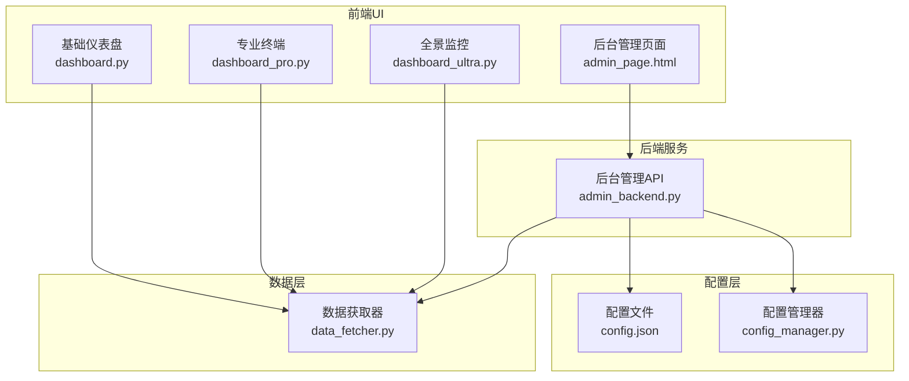
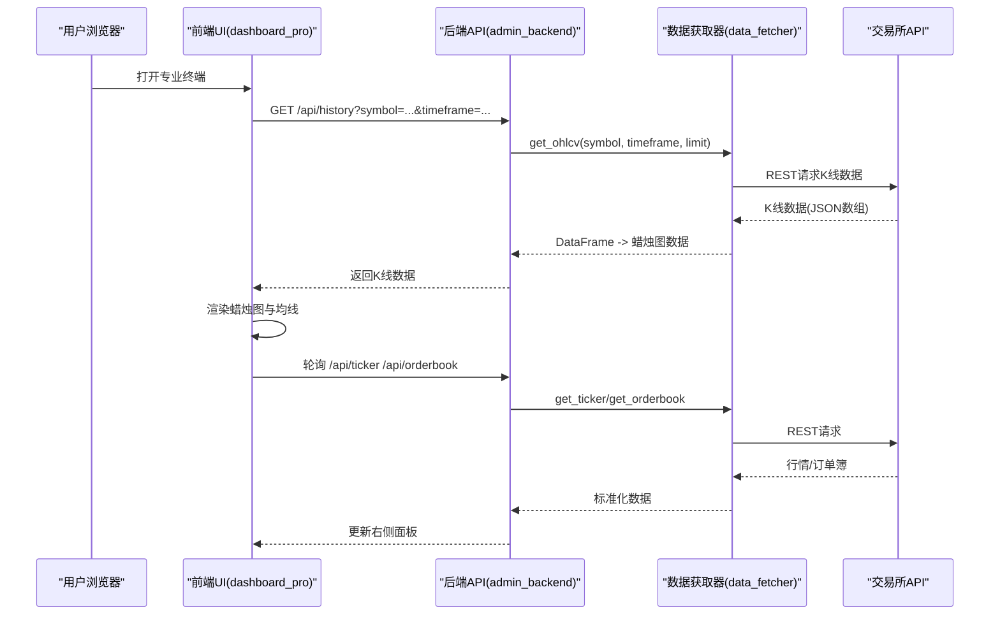
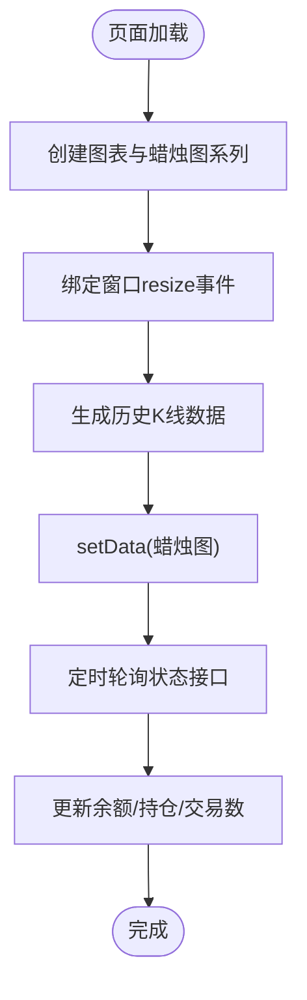
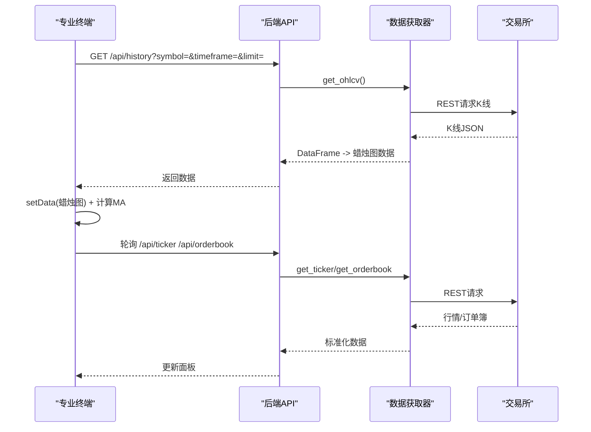
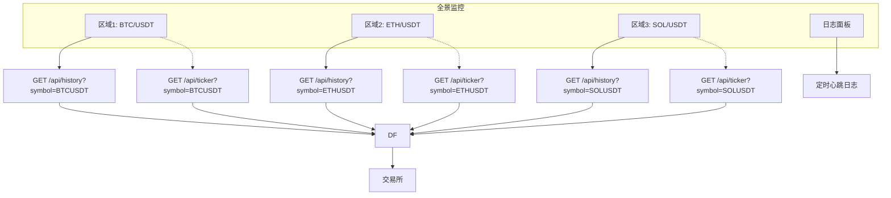
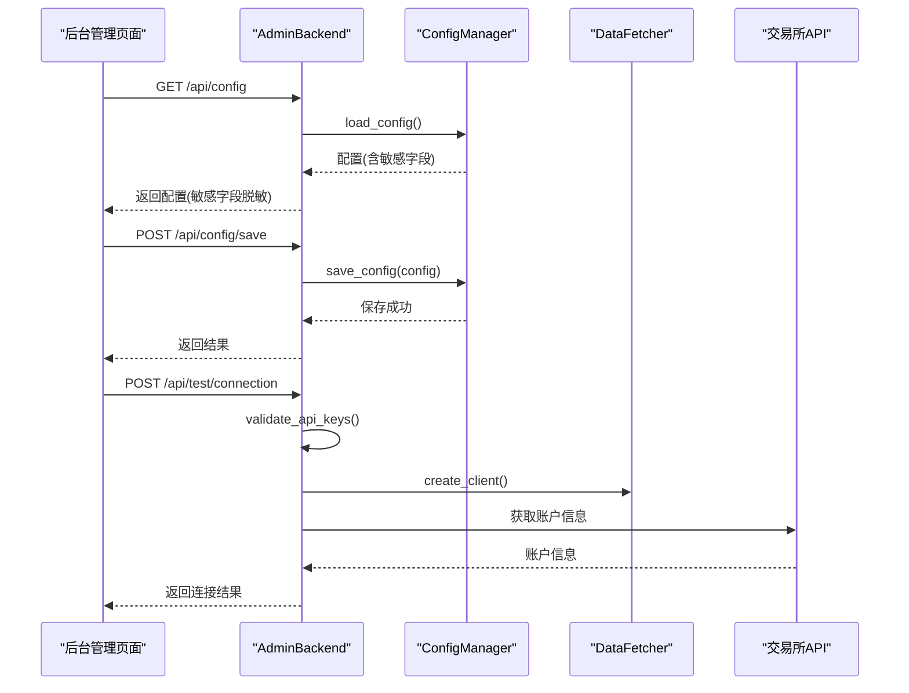
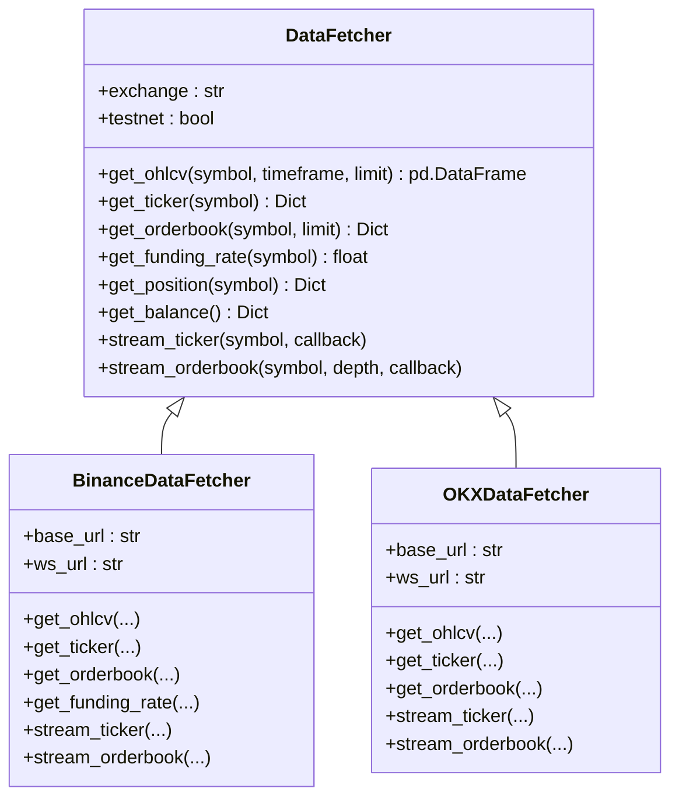
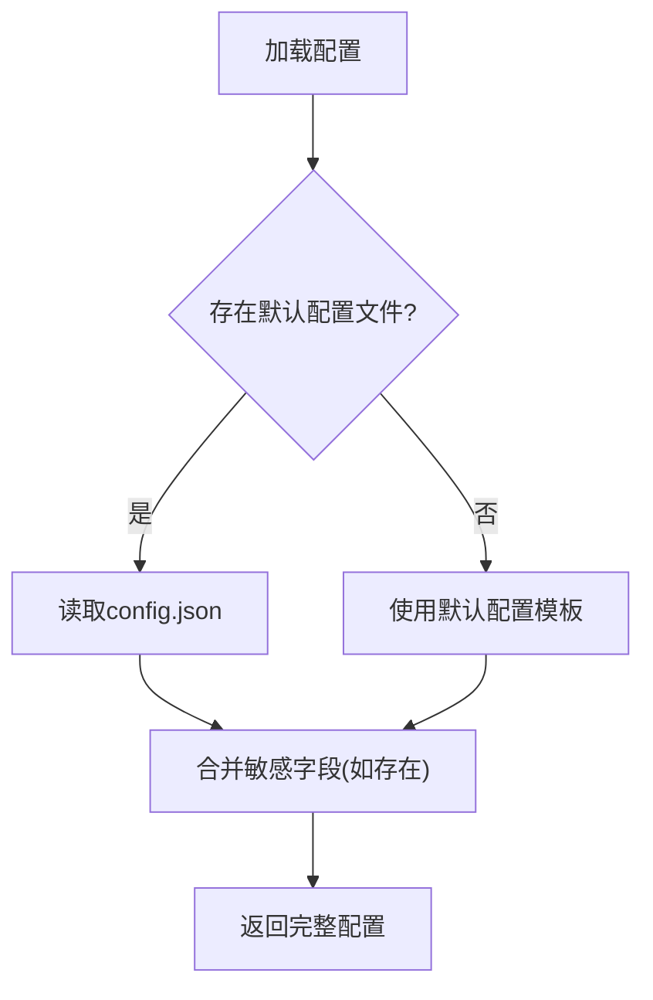
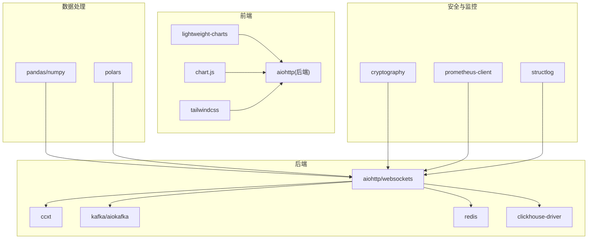

# 交互式图表系统

<cite>
**本文档引用的文件**
- [src/ui/dashboard.py](file://src/ui/dashboard.py)
- [src/ui/dashboard_pro.py](file://src/ui/dashboard_pro.py)
- [src/ui/dashboard_ultra.py](file://src/ui/dashboard_ultra.py)
- [src/ui/admin_page.html](file://src/ui/admin_page.html)
- [src/ui/admin_backend.py](file://src/ui/admin_backend.py)
- [src/data/data_fetcher.py](file://src/data/data_fetcher.py)
- [src/utils/config_manager.py](file://src/utils/config_manager.py)
- [configs/config.json](file://configs/config.json)
- [requirements.txt](file://requirements.txt)
</cite>

## 目录
1. [简介](#简介)
2. [项目结构](#项目结构)
3. [核心组件](#核心组件)
4. [架构总览](#架构总览)
5. [详细组件分析](#详细组件分析)
6. [依赖关系分析](#依赖关系分析)
7. [性能考虑](#性能考虑)
8. [故障排除指南](#故障排除指南)
9. [结论](#结论)
10. [附录](#附录)

## 简介
本项目是一个基于 Lightweight Charts 的交互式图表系统，提供从数据获取、图表渲染到实时更新与后台管理的完整闭环。系统支持多套UI仪表盘（基础版、专业版、全景超清版），并集成后台管理页面，实现交易对切换、时间范围选择、技术指标叠加、订单簿与成交明细展示、以及配置管理与API连通性测试等功能。

## 项目结构
系统采用前后端分离的UI模块与后端API服务相结合的方式：
- 前端UI：三套独立的仪表盘页面，分别面向不同用户群体与场景
- 后端API：提供数据接口、配置管理、机器人控制等服务
- 数据层：统一的数据获取器封装，支持多家交易所
- 配置层：安全的配置管理与持久化

**图表来源**
- [src/ui/dashboard.py](file://src/ui/dashboard.py#L13-L385)
- [src/ui/dashboard_pro.py](file://src/ui/dashboard_pro.py#L10-L580)
- [src/ui/dashboard_ultra.py](file://src/ui/dashboard_ultra.py#L9-L434)
- [src/ui/admin_page.html](file://src/ui/admin_page.html#L1-L790)
- [src/ui/admin_backend.py](file://src/ui/admin_backend.py#L20-L447)
- [src/data/data_fetcher.py](file://src/data/data_fetcher.py#L17-L434)
- [src/utils/config_manager.py](file://src/utils/config_manager.py#L14-L212)
- [configs/config.json](file://configs/config.json#L1-L28)

**章节来源**
- [src/ui/dashboard.py](file://src/ui/dashboard.py#L13-L385)
- [src/ui/dashboard_pro.py](file://src/ui/dashboard_pro.py#L10-L580)
- [src/ui/dashboard_ultra.py](file://src/ui/dashboard_ultra.py#L9-L434)
- [src/ui/admin_page.html](file://src/ui/admin_page.html#L1-L790)
- [src/ui/admin_backend.py](file://src/ui/admin_backend.py#L20-L447)
- [src/data/data_fetcher.py](file://src/data/data_fetcher.py#L17-L434)
- [src/utils/config_manager.py](file://src/utils/config_manager.py#L14-L212)
- [configs/config.json](file://configs/config.json#L1-L28)

## 核心组件
- 图表渲染与交互：基于 Lightweight Charts，提供蜡烛图、均线叠加、自适应尺寸、缩放与十字光标
- 数据获取与转换：统一抽象的数据获取器，封装Binance/OKX REST与WebSocket接口，输出Lightweight Charts兼容格式
- 实时更新策略：定时轮询与WebSocket订阅结合，保证低延迟与高可用
- 主题与适配：深色主题、暗色网格、响应式布局，适配桌面与移动设备
- 后台管理：配置管理、API连通性测试、策略与机器人控制

**章节来源**
- [src/ui/dashboard.py](file://src/ui/dashboard.py#L233-L334)
- [src/ui/dashboard_pro.py](file://src/ui/dashboard_pro.py#L354-L438)
- [src/ui/dashboard_ultra.py](file://src/ui/dashboard_ultra.py#L336-L410)
- [src/data/data_fetcher.py](file://src/data/data_fetcher.py#L40-L71)

## 架构总览
系统采用“前端UI + 后端API + 数据层”的分层架构。前端通过REST接口拉取历史K线与行情，部分场景使用WebSocket实现低延迟数据推送；后端提供配置管理、机器人控制与后台管理页面；数据层统一抽象多家交易所的API差异。

**图表来源**
- [src/ui/dashboard_pro.py](file://src/ui/dashboard_pro.py#L29-L76)
- [src/ui/admin_backend.py](file://src/ui/admin_backend.py#L28-L51)
- [src/data/data_fetcher.py](file://src/data/data_fetcher.py#L85-L178)

**章节来源**
- [src/ui/dashboard_pro.py](file://src/ui/dashboard_pro.py#L29-L76)
- [src/ui/admin_backend.py](file://src/ui/admin_backend.py#L28-L51)
- [src/data/data_fetcher.py](file://src/data/data_fetcher.py#L85-L178)

## 详细组件分析

### 基础仪表盘（dashboard.py）
- 图表初始化：创建图表容器，设置透明背景、浅色文字、网格与边框颜色
- 蜡烛图系列：设置上涨/下跌颜色、边框与烛芯颜色
- 自适应尺寸：监听窗口resize事件，动态调整图表宽高
- 数据加载：生成示例K线数据并一次性setData
- 实时更新：每2秒轮询状态接口，更新UI数值；蜡烛图采用模拟更新方式

**图表来源**
- [src/ui/dashboard.py](file://src/ui/dashboard.py#L233-L334)

**章节来源**
- [src/ui/dashboard.py](file://src/ui/dashboard.py#L233-L334)

### 专业终端（dashboard_pro.py）
- 图表初始化：创建图表容器，启用十字光标，设置网格与价格刻度边框
- 蜡烛图与均线：蜡烛图系列配置上涨/下跌颜色；叠加MA7/MA25两条均线
- 自适应尺寸：监听窗口resize事件，应用新的宽高选项
- 数据获取：通过REST接口获取历史K线，转换为Lightweight Charts格式；计算SMA序列
- 实时更新：定时轮询ticker与orderbook，更新顶部行情与右侧订单簿；定时刷新K线（模拟）

**图表来源**
- [src/ui/dashboard_pro.py](file://src/ui/dashboard_pro.py#L395-L457)
- [src/ui/dashboard_pro.py](file://src/ui/dashboard_pro.py#L523-L570)

**章节来源**
- [src/ui/dashboard_pro.py](file://src/ui/dashboard_pro.py#L354-L438)
- [src/ui/dashboard_pro.py](file://src/ui/dashboard_pro.py#L395-L457)
- [src/ui/dashboard_pro.py](file://src/ui/dashboard_pro.py#L523-L570)

### 全景监控（dashboard_ultra.py）
- 多图表网格：四个区域展示多币种迷你图，每个区域独立创建Lightweight Charts实例
- 迷你图配置：Area系列，禁用滚动与缩放，隐藏垂直网格，仅保留水平网格
- 数据获取：通过REST接口获取历史收盘价序列，用于Area图绘制
- 实时更新：定时轮询各图表对应symbol的ticker，动态更新涨跌幅颜色与趋势色
- 日志面板：定时追加系统心跳日志，自动滚动至底部

**图表来源**
- [src/ui/dashboard_ultra.py](file://src/ui/dashboard_ultra.py#L336-L410)

**章节来源**
- [src/ui/dashboard_ultra.py](file://src/ui/dashboard_ultra.py#L336-L410)

### 后台管理页面与API（admin_page.html + admin_backend.py）
- 后台页面：提供配置管理、API测试、策略与机器人控制的可视化界面
- 后端API：提供配置读写、导出、连接测试、交易所与策略查询、机器人启停与状态查询
- 配置管理：ConfigManager负责配置文件的加密存储与解密读取，默认配置模板
- 数据获取：AdminBackend通过DataFetcher访问交易所API，实现连通性测试与公开接口验证

**图表来源**
- [src/ui/admin_page.html](file://src/ui/admin_page.html#L599-L787)
- [src/ui/admin_backend.py](file://src/ui/admin_backend.py#L57-L210)
- [src/utils/config_manager.py](file://src/utils/config_manager.py#L82-L116)
- [src/data/data_fetcher.py](file://src/data/data_fetcher.py#L400-L407)

**章节来源**
- [src/ui/admin_page.html](file://src/ui/admin_page.html#L599-L787)
- [src/ui/admin_backend.py](file://src/ui/admin_backend.py#L57-L210)
- [src/utils/config_manager.py](file://src/utils/config_manager.py#L82-L116)
- [src/data/data_fetcher.py](file://src/data/data_fetcher.py#L400-L407)

### 数据获取器（data_fetcher.py）
- 抽象基类：定义统一接口（OHLCV、ticker、orderbook、资金费率、仓位、余额、WebSocket流）
- Binance实现：REST接口获取K线/行情/深度，WebSocket订阅bookTicker与depth；支持测试网与正式网
- OKX实现：REST接口获取K线/行情/深度，WebSocket订阅tickers与books；支持测试网与正式网
- 便捷工厂：根据exchange参数创建对应数据获取器实例

**图表来源**
- [src/data/data_fetcher.py](file://src/data/data_fetcher.py#L17-L71)
- [src/data/data_fetcher.py](file://src/data/data_fetcher.py#L73-L235)
- [src/data/data_fetcher.py](file://src/data/data_fetcher.py#L237-L397)

**章节来源**
- [src/data/data_fetcher.py](file://src/data/data_fetcher.py#L17-L71)
- [src/data/data_fetcher.py](file://src/data/data_fetcher.py#L73-L235)
- [src/data/data_fetcher.py](file://src/data/data_fetcher.py#L237-L397)

### 配置管理（config_manager.py + config.json）
- ConfigManager：负责配置文件的读写、加密存储与解密读取；默认配置模板；导出配置（可选包含敏感信息）
- config.json：系统默认配置，包含交易所、交易对、时间周期、策略、杠杆、风控参数与AI增强开关

**图表来源**
- [src/utils/config_manager.py](file://src/utils/config_manager.py#L82-L116)
- [configs/config.json](file://configs/config.json#L1-L28)

**章节来源**
- [src/utils/config_manager.py](file://src/utils/config_manager.py#L82-L116)
- [configs/config.json](file://configs/config.json#L1-L28)

## 依赖关系分析
- 前端依赖：aiohttp（后端）、lightweight-charts（图表）、chart.js（雷达图）、tailwindcss（样式）
- 后端依赖：aiohttp/websockets（HTTP/WebSocket）、ccxt（统一交易所接口）、kafka/redis/clickhouse（可选扩展）
- 数据处理：pandas/numpy（数据结构与计算）、polars（高性能数据处理）
- 安全与监控：cryptography（配置加密）、prometheus-client/structlog（监控与日志）

**图表来源**
- [requirements.txt](file://requirements.txt#L1-L92)

**章节来源**
- [requirements.txt](file://requirements.txt#L1-L92)

## 性能考虑
- 图表渲染优化
  - 使用setData一次性注入历史数据，避免逐条插入导致的重绘开销
  - 对于实时更新，优先采用局部更新（如仅更新最后一根蜡烛的close或更新均线序列）
- 数据获取优化
  - REST接口设置合理超时与并发限制，避免阻塞
  - WebSocket长连接复用，减少握手成本
- 内存优化
  - 限制历史数据长度（limit参数），定期清理过期数据
  - 在多图表场景下，按需创建与销毁图表实例，避免内存泄漏
- 网络与并发
  - 合理设置轮询间隔，避免频繁请求；对高频数据采用WebSocket
  - 对多个symbol/timeframe并行请求时，使用异步并发控制

[本节为通用指导，无需具体文件分析]

## 故障排除指南
- 图表不显示或空白
  - 检查图表容器宽高是否为正值，确认resize事件已绑定
  - 确认setData传入的数据格式符合Lightweight Charts要求（时间戳与OHLC字段）
- 数据获取失败
  - 检查DataFetcher的URL与参数，确认交易所API可达
  - 对于WebSocket，检查连接状态与心跳设置
- 后台配置无法保存
  - 确认ConfigManager的密钥文件存在且权限正确
  - 检查敏感字段是否被正确分离与加密
- 连接测试失败
  - 校验API Key/Secret Key格式与长度
  - 确认testnet参数与交易所匹配

**章节来源**
- [src/ui/dashboard.py](file://src/ui/dashboard.py#L264-L267)
- [src/ui/dashboard_pro.py](file://src/ui/dashboard_pro.py#L389-L392)
- [src/data/data_fetcher.py](file://src/data/data_fetcher.py#L85-L119)
- [src/data/data_fetcher.py](file://src/data/data_fetcher.py#L188-L234)
- [src/utils/config_manager.py](file://src/utils/config_manager.py#L31-L46)
- [src/ui/admin_backend.py](file://src/ui/admin_backend.py#L159-L209)

## 结论
该交互式图表系统以Lightweight Charts为核心，构建了从数据获取、图表渲染到实时更新与后台管理的完整体系。通过统一的数据获取器抽象与多套UI仪表盘，系统能够灵活适配不同用户需求与设备环境。建议在生产环境中进一步完善WebSocket订阅、内存与网络优化，并持续扩展指标与插件能力。

[本节为总结，无需具体文件分析]

## 附录

### 图表初始化与主题适配要点
- 初始化选项：layout背景、文字颜色、grid网格、timeScale与rightPriceScale边框
- 主题适配：深色背景、浅色文字、半透明面板与毛玻璃效果
- 尺寸自适应：监听window.resize，动态applyOptions(width/height)

**章节来源**
- [src/ui/dashboard.py](file://src/ui/dashboard.py#L235-L253)
- [src/ui/dashboard_pro.py](file://src/ui/dashboard_pro.py#L356-L375)
- [src/ui/dashboard_ultra.py](file://src/ui/dashboard_ultra.py#L339-L347)

### 蜡烛图系列配置与样式定制
- 颜色设置：upColor/downColor、borderUpColor/borderDownColor、wickUpColor/wickDownColor
- 样式定制：borderVisible、lineWidth、title等
- 数据格式：时间戳time、开盘open、最高high、最低low、收盘close

**章节来源**
- [src/ui/dashboard.py](file://src/ui/dashboard.py#L255-L262)
- [src/ui/dashboard_pro.py](file://src/ui/dashboard_pro.py#L377-L387)

### 交互功能与实时更新机制
- 交互功能：时间范围切换、交易对切换、缩放与平移、十字光标
- 实时更新：定时轮询ticker/orderbook，部分场景使用WebSocket订阅
- 增量更新策略：仅更新最新数据点，避免全量重绘

**章节来源**
- [src/ui/dashboard_pro.py](file://src/ui/dashboard_pro.py#L524-L554)
- [src/ui/dashboard_pro.py](file://src/ui/dashboard_pro.py#L562-L569)

### 移动端适配与触摸事件
- 响应式布局：使用TailwindCSS断点与网格系统
- 触摸手势：Lightweight Charts默认支持缩放与平移，建议在移动端开启合适的handleScroll/handleScale选项
- 交互优化：在小屏设备上适当减少指标叠加与面板复杂度

**章节来源**
- [src/ui/dashboard_pro.py](file://src/ui/dashboard_pro.py#L389-L392)
- [src/ui/dashboard_ultra.py](file://src/ui/dashboard_ultra.py#L344-L346)