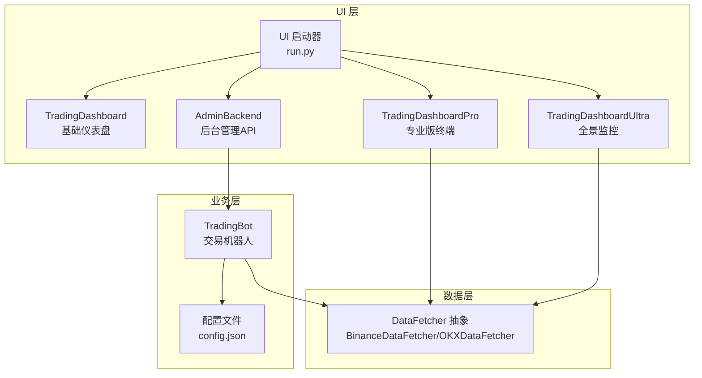
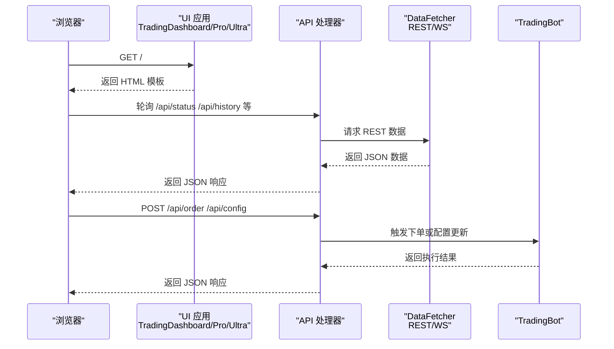
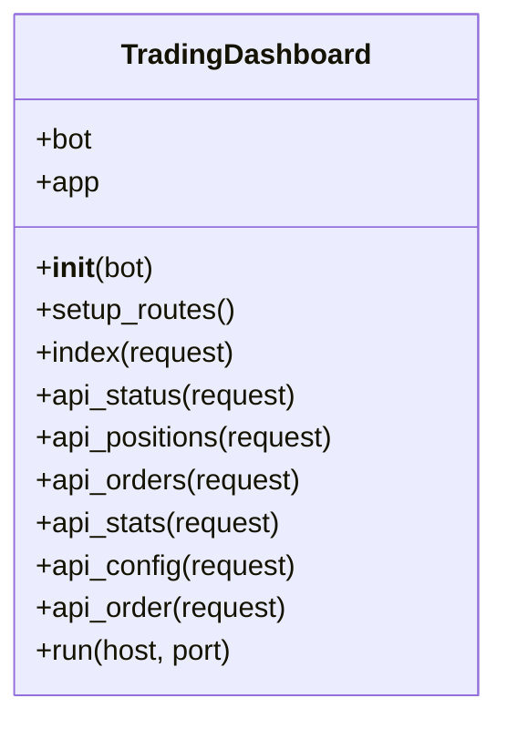
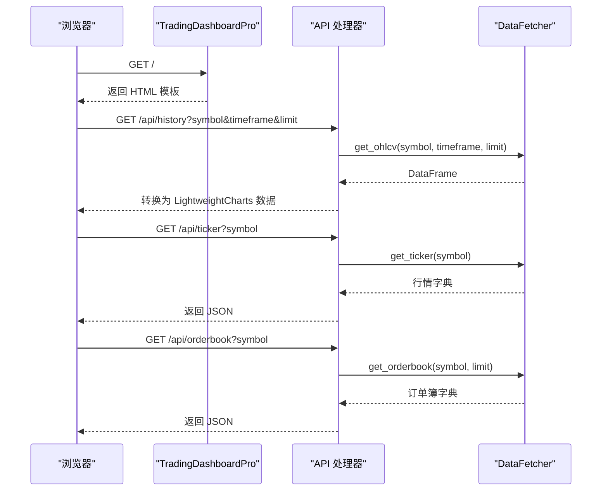
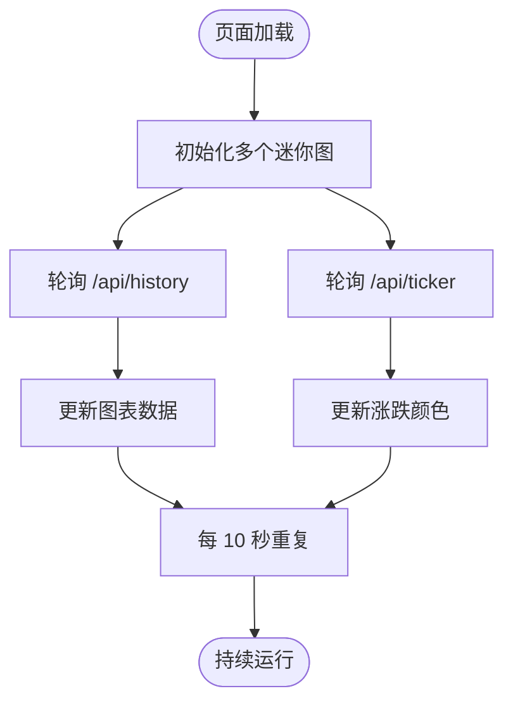
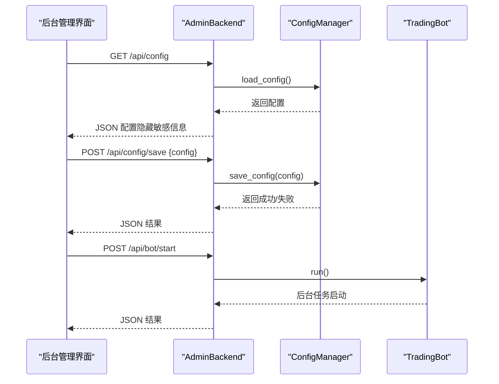
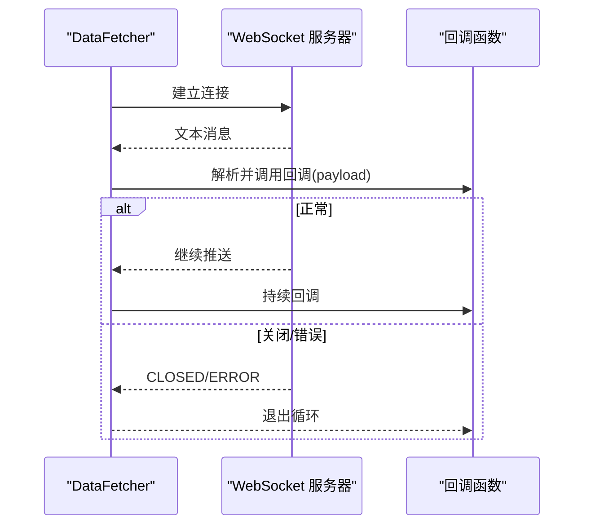
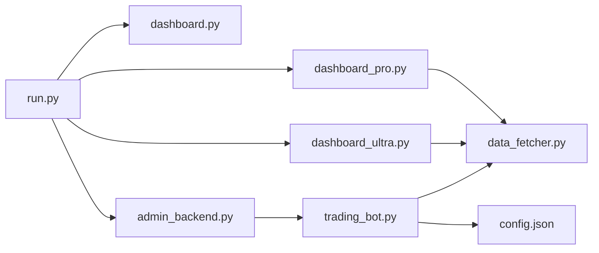

# 仪表盘核心功能

<cite>
**本文档引用的文件**
- [src/ui/dashboard.py](file://src/ui/dashboard.py)
- [src/ui/dashboard_pro.py](file://src/ui/dashboard_pro.py)
- [src/ui/dashboard_ultra.py](file://src/ui/dashboard_ultra.py)
- [src/ui/admin_backend.py](file://src/ui/admin_backend.py)
- [src/ui/run.py](file://src/ui/run.py)
- [src/data/data_fetcher.py](file://src/data/data_fetcher.py)
- [src/trading_bot.py](file://src/trading_bot.py)
- [configs/config.json](file://configs/config.json)
- [scripts/ws_realtime_demo.py](file://scripts/ws_realtime_demo.py)
</cite>

## 目录
1. [简介](#简介)
2. [项目结构](#项目结构)
3. [核心组件](#核心组件)
4. [架构总览](#架构总览)
5. [详细组件分析](#详细组件分析)
6. [依赖关系分析](#依赖关系分析)
7. [性能考虑](#性能考虑)
8. [故障排查指南](#故障排查指南)
9. [结论](#结论)
10. [附录](#附录)

## 简介
本文件聚焦于仪表盘核心功能模块，涵盖以下方面：
- TradingDashboard 类的设计架构与初始化流程，包括 bot 实例注入、路由设置与中间件配置
- HTML 模板结构与样式体系，包括深色主题、毛玻璃效果、响应式布局
- 实时状态监控面板的关键指标（总权益、当前持仓、今日交易数量、胜率）的数据绑定与更新机制
- WebSocket 连接建立、实时数据轮询、错误处理与重连机制
- API 接口定义，包括状态查询、订单管理、配置更新等 RESTful 端点的请求格式、响应结构与错误码处理

## 项目结构
仪表盘相关的核心文件位于 src/ui 目录，配合数据获取模块 src/data 与交易机器人核心 src/trading_bot 提供完整的前端展示与后端数据支撑。

图表来源
- [src/ui/run.py](file://src/ui/run.py#L34-L95)
- [src/ui/dashboard.py](file://src/ui/dashboard.py#L13-L385)
- [src/ui/dashboard_pro.py](file://src/ui/dashboard_pro.py#L10-L580)
- [src/ui/dashboard_ultra.py](file://src/ui/dashboard_ultra.py#L9-L434)
- [src/ui/admin_backend.py](file://src/ui/admin_backend.py#L20-L447)
- [src/data/data_fetcher.py](file://src/data/data_fetcher.py#L17-L434)
- [src/trading_bot.py](file://src/trading_bot.py#L27-L346)
- [configs/config.json](file://configs/config.json#L1-L28)

章节来源
- [src/ui/run.py](file://src/ui/run.py#L34-L95)
- [src/ui/dashboard.py](file://src/ui/dashboard.py#L13-L385)
- [src/ui/dashboard_pro.py](file://src/ui/dashboard_pro.py#L10-L580)
- [src/ui/dashboard_ultra.py](file://src/ui/dashboard_ultra.py#L9-L434)
- [src/ui/admin_backend.py](file://src/ui/admin_backend.py#L20-L447)
- [src/data/data_fetcher.py](file://src/data/data_fetcher.py#L17-L434)
- [src/trading_bot.py](file://src/trading_bot.py#L27-L346)
- [configs/config.json](file://configs/config.json#L1-L28)

## 核心组件
- TradingDashboard：基础仪表盘，提供主页与若干 API 端点，包含静态 HTML 模板与实时轮询逻辑
- TradingDashboardPro：专业版终端，集成 K 线历史、实时行情、订单簿等数据，并提供 MA 指标
- TradingDashboardUltra：全景监控，提供多图表与日志面板，强调视觉冲击与信息密度
- AdminBackend：后台管理 API，提供配置管理、API 测试、策略信息、Bot 控制等接口
- DataFetcher：抽象数据获取器，封装 Binance/OKX 的 REST 与 WebSocket 接口
- TradingBot：交易机器人核心，负责策略分析、风控、下单与仓位管理
- UI 启动器：根据模式选择不同 UI 实例并启动服务

章节来源
- [src/ui/dashboard.py](file://src/ui/dashboard.py#L13-L385)
- [src/ui/dashboard_pro.py](file://src/ui/dashboard_pro.py#L10-L580)
- [src/ui/dashboard_ultra.py](file://src/ui/dashboard_ultra.py#L9-L434)
- [src/ui/admin_backend.py](file://src/ui/admin_backend.py#L20-L447)
- [src/data/data_fetcher.py](file://src/data/data_fetcher.py#L17-L434)
- [src/trading_bot.py](file://src/trading_bot.py#L27-L346)
- [src/ui/run.py](file://src/ui/run.py#L34-L95)

## 架构总览
仪表盘采用“前端 HTML + aiohttp 后端 + 数据获取器”的分层架构。基础版与专业版/全景版分别通过不同的 HTML 模板与 API 调用方式实现可视化；后台管理 API 与交易机器人通过统一的配置与数据通道进行交互。

图表来源
- [src/ui/dashboard.py](file://src/ui/dashboard.py#L31-L385)
- [src/ui/dashboard_pro.py](file://src/ui/dashboard_pro.py#L25-L580)
- [src/ui/dashboard_ultra.py](file://src/ui/dashboard_ultra.py#L60-L434)
- [src/ui/admin_backend.py](file://src/ui/admin_backend.py#L20-L447)
- [src/data/data_fetcher.py](file://src/data/data_fetcher.py#L40-L434)
- [src/trading_bot.py](file://src/trading_bot.py#L115-L205)

## 详细组件分析

### TradingDashboard 类分析
- 设计架构
  - 使用 aiohttp.web.Application 构建应用，通过 setup_routes 注册路由
  - 支持主页渲染与多个 API 端点：/api/status、/api/positions、/api/orders、/api/stats、/api/config、/api/order
  - 通过构造函数注入 bot 实例，便于后续与交易机器人交互
- 初始化流程
  - __init__ 中保存 bot 引用并创建 web.Application
  - setup_routes 完成路由注册
  - run(host, port) 启动服务
- HTML 模板与样式
  - 深色主题：body 背景色与字体颜色
  - 毛玻璃效果：glass-panel 类，backdrop-filter 与半透明边框
  - 响应式布局：Tailwind CSS 的 grid 与 flex 布局
  - 图表：LightweightCharts 初始化与窗口尺寸自适应
- 实时状态监控面板
  - 总权益、当前持仓、今日交易、胜率等指标通过 DOM ID 绑定
  - 定时轮询 /api/status 更新 UI
- WebSocket 与轮询
  - 基础版使用定时轮询模拟实时更新
  - 专业版/全景版使用 DataFetcher 的 WebSocket 接口（在数据层实现）

图表来源
- [src/ui/dashboard.py](file://src/ui/dashboard.py#L13-L385)

章节来源
- [src/ui/dashboard.py](file://src/ui/dashboard.py#L13-L385)

### TradingDashboardPro 分析
- 功能增强
  - 集成 K 线历史、实时行情、订单簿 API
  - 支持 MA 指标叠加，计算 SMA 并绘制
  - 顶部导航、市场列表、订单簿与快速交易面板
- 数据流
  - /api/history：调用 DataFetcher.get_ohlcv，转换为 LightweightCharts 所需格式
  - /api/ticker：获取最新行情
  - /api/orderbook：获取订单簿并渲染买卖盘
- 轮询策略
  - 行情与订单簿每 5 秒轮询一次
  - K 线历史每 15 秒刷新一次（简化处理）

图表来源
- [src/ui/dashboard_pro.py](file://src/ui/dashboard_pro.py#L25-L580)
- [src/data/data_fetcher.py](file://src/data/data_fetcher.py#L85-L157)

章节来源
- [src/ui/dashboard_pro.py](file://src/ui/dashboard_pro.py#L10-L580)
- [src/data/data_fetcher.py](file://src/data/data_fetcher.py#L85-L157)

### TradingDashboardUltra 分析
- 全景监控特性
  - 多图表网格、市场热力图、AI 策略引擎面板、风控雷达
  - 使用 Chart.js 渲染雷达图，LightweightCharts 渲染迷你图
- 数据与轮询
  - /api/history：返回迷你图所需收盘价序列
  - /api/ticker：返回涨跌幅与成交量，驱动图表颜色与趋势
  - 每 10 秒轮询一次多图表数据
- 日志面板
  - 自动滚动的日志输出，周期性写入系统心跳

图表来源
- [src/ui/dashboard_ultra.py](file://src/ui/dashboard_ultra.py#L336-L434)

章节来源
- [src/ui/dashboard_ultra.py](file://src/ui/dashboard_ultra.py#L9-L434)

### AdminBackend 分析
- 路由与职责
  - 配置管理：获取、保存、重置、导出配置
  - API 测试：连接测试与公开接口测试
  - 交易所与策略信息：支持的交易所、交易对、策略列表
  - Bot 控制：启动、停止、状态查询
- 与 TradingBot 的集成
  - 通过构造函数注入 bot 实例，实现启动/停止/状态查询
  - 配置变更通过 ConfigManager 写入持久化存储

图表来源
- [src/ui/admin_backend.py](file://src/ui/admin_backend.py#L20-L447)

章节来源
- [src/ui/admin_backend.py](file://src/ui/admin_backend.py#L20-L447)

### DataFetcher 与 WebSocket 连接
- 抽象与实现
  - DataFetcher 定义 get_ohlcv、get_ticker、get_orderbook、stream_ticker、stream_orderbook 等接口
  - BinanceDataFetcher/OKXDataFetcher 提供具体实现，支持 REST 与 WebSocket
- WebSocket 特性
  - 心跳保活（heartbeat=20）
  - 断线处理：消息类型 CLOSED/ERROR 时退出循环
  - 回调驱动：通过回调函数将数据传递给上层 UI 或业务逻辑
- 错误处理与重连
  - 当前实现中，UI 层通过轮询替代 WebSocket 实时推送（基础版与专业版）
  - 数据层具备 WebSocket 能力，可在需要时直接使用

图表来源
- [src/data/data_fetcher.py](file://src/data/data_fetcher.py#L188-L234)
- [src/data/data_fetcher.py](file://src/data/data_fetcher.py#L327-L396)

章节来源
- [src/data/data_fetcher.py](file://src/data/data_fetcher.py#L17-L434)
- [scripts/ws_realtime_demo.py](file://scripts/ws_realtime_demo.py#L30-L62)

### TradingBot 与仪表盘联动
- 交易机器人负责策略分析、风控、下单与仓位管理
- 仪表盘通过 API 查询状态、历史数据与实时行情
- 配置文件提供策略参数、风控阈值与交易对列表

章节来源
- [src/trading_bot.py](file://src/trading_bot.py#L27-L346)
- [configs/config.json](file://configs/config.json#L1-L28)

## 依赖关系分析

图表来源
- [src/ui/run.py](file://src/ui/run.py#L34-L95)
- [src/ui/dashboard.py](file://src/ui/dashboard.py#L13-L385)
- [src/ui/dashboard_pro.py](file://src/ui/dashboard_pro.py#L10-L580)
- [src/ui/dashboard_ultra.py](file://src/ui/dashboard_ultra.py#L9-L434)
- [src/ui/admin_backend.py](file://src/ui/admin_backend.py#L20-L447)
- [src/data/data_fetcher.py](file://src/data/data_fetcher.py#L17-L434)
- [src/trading_bot.py](file://src/trading_bot.py#L27-L346)
- [configs/config.json](file://configs/config.json#L1-L28)

章节来源
- [src/ui/run.py](file://src/ui/run.py#L34-L95)
- [src/ui/dashboard.py](file://src/ui/dashboard.py#L13-L385)
- [src/ui/dashboard_pro.py](file://src/ui/dashboard_pro.py#L10-L580)
- [src/ui/dashboard_ultra.py](file://src/ui/dashboard_ultra.py#L9-L434)
- [src/ui/admin_backend.py](file://src/ui/admin_backend.py#L20-L447)
- [src/data/data_fetcher.py](file://src/data/data_fetcher.py#L17-L434)
- [src/trading_bot.py](file://src/trading_bot.py#L27-L346)
- [configs/config.json](file://configs/config.json#L1-L28)

## 性能考虑
- 轮询频率与资源占用
  - 专业版与全景版采用 5–15 秒轮询，平衡实时性与网络负载
  - 建议根据网络环境调整轮询间隔，避免频繁请求导致延迟累积
- 图表渲染优化
  - LightweightCharts 与 Chart.js 在移动端可能影响性能，建议按需渲染与懒加载
- WebSocket 替代方案
  - 若网络条件允许，可直接使用 DataFetcher 的 stream_ticker/stream_orderbook，减少轮询带来的延迟与带宽消耗
- 数据缓存
  - 对于不频繁变动的数据（如交易对列表、策略参数），可在前端缓存以降低请求次数

## 故障排查指南
- WebSocket 连接问题
  - 检查 DataFetcher 的 stream_* 方法是否正确传入回调函数
  - 确认 heartbeat 参数与服务器保活策略匹配
  - 断线时查看消息类型是否为 CLOSED/ERROR，确保回调退出循环
- API 响应异常
  - 检查 /api/history、/api/ticker、/api/orderbook 的参数与返回格式
  - 对于错误响应，确认 status 码与错误信息是否被正确处理
- 轮询失效
  - 确认浏览器控制台无跨域或网络错误
  - 检查定时器是否被意外清除或异常中断
- 配置与权限
  - 后台管理 API 的配置保存需验证必要字段
  - API 测试接口需确保密钥格式与测试网设置正确

章节来源
- [src/data/data_fetcher.py](file://src/data/data_fetcher.py#L188-L234)
- [src/ui/dashboard_pro.py](file://src/ui/dashboard_pro.py#L29-L76)
- [src/ui/admin_backend.py](file://src/ui/admin_backend.py#L57-L157)

## 结论
仪表盘核心功能模块通过清晰的分层设计实现了从数据获取到前端展示的完整闭环。基础版侧重简洁与易用，专业版与全景版在可视化与信息密度上进一步提升。结合后台管理 API 与交易机器人，系统形成了可配置、可监控、可扩展的交易监控体系。未来可在保持现有稳定性的基础上，引入 WebSocket 实时推送与更完善的错误重连机制，进一步提升用户体验与系统可靠性。

## 附录

### API 接口定义

- 状态查询
  - 路径：GET /api/status
  - 请求：无
  - 响应：包含 balance、positions、todayTrades、winRate、status 等字段
  - 错误码：无（基础版返回固定示例数据）

- 持仓查询
  - 路径：GET /api/positions
  - 请求：无
  - 响应：空数组占位（基础版）
  - 错误码：无

- 订单查询
  - 路径：GET /api/orders
  - 请求：无
  - 响应：空数组占位（基础版）
  - 错误码：无

- 统计查询
  - 路径：GET /api/stats
  - 请求：无
  - 响应：包含 total_trades、win_count、loss_count、total_pnl 等字段
  - 错误码：无

- 配置更新
  - 路径：POST /api/config
  - 请求体：JSON 配置对象
  - 响应：{"success": true}
  - 错误码：无（基础版直接返回成功）

- 订单管理
  - 路径：POST /api/order
  - 请求体：{"symbol": "...", "side": "BUY|SELL"}
  - 响应：{"success": true, "order_id": "..."}
  - 错误码：无（基础版直接返回成功）

- 专业版 API
  - K 线历史：GET /api/history?symbol&timeframe&limit
  - 最新行情：GET /api/ticker?symbol
  - 订单簿：GET /api/orderbook?symbol
  - 错误码：500（当数据获取器不可用或异常时）

- 后台管理 API
  - 获取配置：GET /api/config
  - 保存配置：POST /api/config/save
  - 重置配置：POST /api/config/reset
  - 导出配置：GET /api/config/export?include_sensitive=false
  - 连接测试：POST /api/test/connection
  - 公开接口测试：POST /api/test/api
  - 交易所列表：GET /api/exchanges
  - 交易对列表：GET /api/symbols
  - 策略列表：GET /api/strategies
  - 启动 Bot：POST /api/bot/start
  - 停止 Bot：POST /api/bot/stop
  - Bot 状态：GET /api/bot/status

章节来源
- [src/ui/dashboard.py](file://src/ui/dashboard.py#L338-L375)
- [src/ui/dashboard_pro.py](file://src/ui/dashboard_pro.py#L29-L76)
- [src/ui/admin_backend.py](file://src/ui/admin_backend.py#L57-L396)