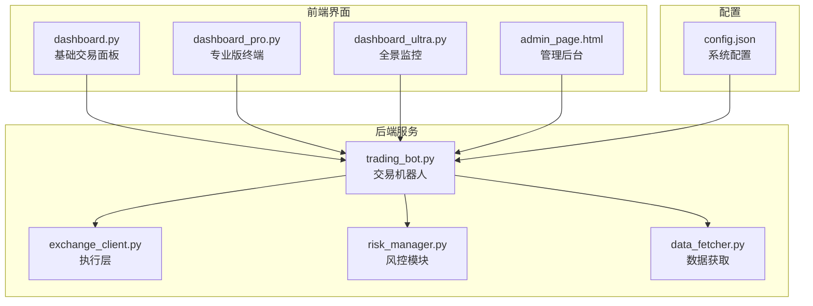
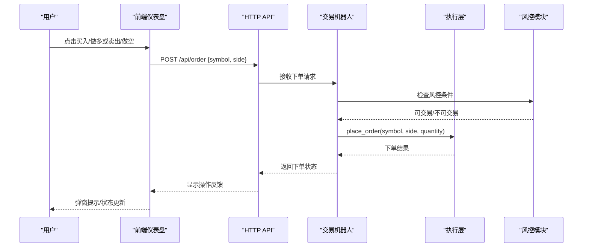
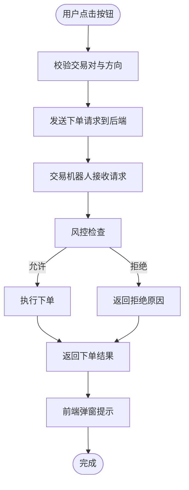
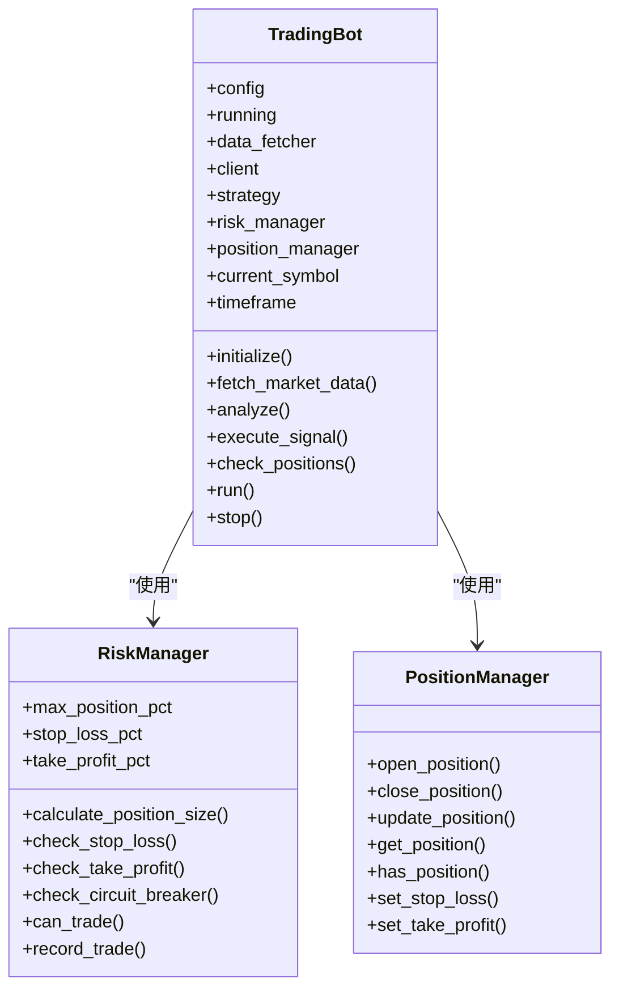
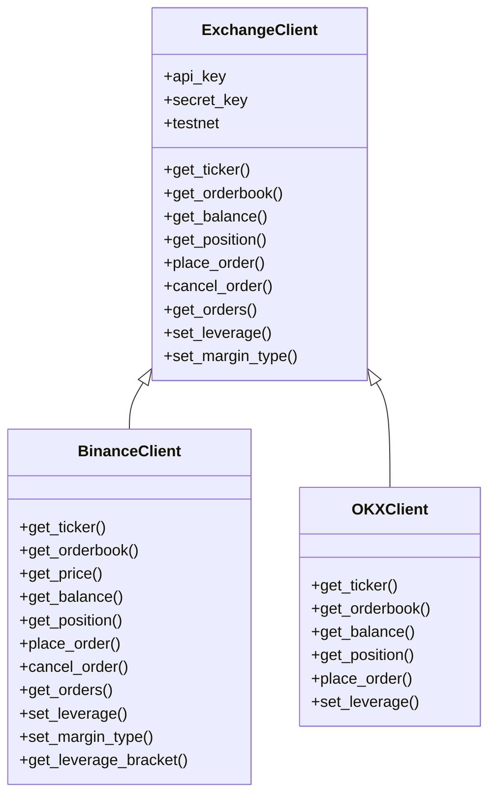
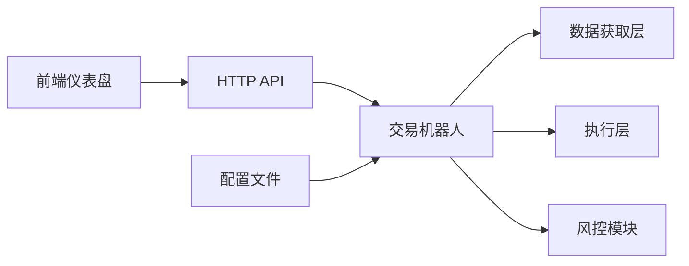

# 快速交易控制面板

<cite>
**本文档引用的文件**
- [src/ui/dashboard.py](file://src/ui/dashboard.py)
- [src/ui/dashboard_pro.py](file://src/ui/dashboard_pro.py)
- [src/ui/dashboard_ultra.py](file://src/ui/dashboard_ultra.py)
- [src/ui/admin_page.html](file://src/ui/admin_page.html)
- [src/trading_bot.py](file://src/trading_bot.py)
- [src/execution/exchange_client.py](file://src/execution/exchange_client.py)
- [src/utils/risk_manager.py](file://src/utils/risk_manager.py)
- [src/data/data_fetcher.py](file://src/data/data_fetcher.py)
- [configs/config.json](file://configs/config.json)
</cite>

## 目录
1. [简介](#简介)
2. [项目结构](#项目结构)
3. [核心组件](#核心组件)
4. [架构概览](#架构概览)
5. [详细组件分析](#详细组件分析)
6. [依赖关系分析](#依赖关系分析)
7. [性能考量](#性能考量)
8. [故障排除指南](#故障排除指南)
9. [结论](#结论)

## 简介
本文件为快速交易控制面板的技术文档，聚焦于手动交易功能实现、交易对选择器、策略状态显示、UI设计原则、交易确认机制以及安全考虑。该系统采用前后端分离架构，前端提供直观的交易界面，后端通过交易机器人协调数据获取、策略分析与执行层，配合风控模块确保交易安全。

## 项目结构
项目采用模块化组织，核心目录包含：
- src/ui：前端仪表盘与管理界面
- src/trading_bot.py：交易机器人主控制器
- src/execution：执行层，封装交易所API
- src/utils：风控与工具模块
- src/data：数据获取层
- configs：系统配置

图表来源
- [src/ui/dashboard.py](file://src/ui/dashboard.py#L1-L385)
- [src/ui/dashboard_pro.py](file://src/ui/dashboard_pro.py#L1-L580)
- [src/ui/dashboard_ultra.py](file://src/ui/dashboard_ultra.py#L1-L434)
- [src/ui/admin_page.html](file://src/ui/admin_page.html#L1-L456)
- [src/trading_bot.py](file://src/trading_bot.py#L1-L346)
- [src/execution/exchange_client.py](file://src/execution/exchange_client.py#L1-L432)
- [src/utils/risk_manager.py](file://src/utils/risk_manager.py#L1-L388)
- [src/data/data_fetcher.py](file://src/data/data_fetcher.py#L1-L434)
- [configs/config.json](file://configs/config.json#L1-L28)

章节来源
- [src/ui/dashboard.py](file://src/ui/dashboard.py#L1-L385)
- [src/ui/dashboard_pro.py](file://src/ui/dashboard_pro.py#L1-L580)
- [src/ui/dashboard_ultra.py](file://src/ui/dashboard_ultra.py#L1-L434)
- [src/ui/admin_page.html](file://src/ui/admin_page.html#L1-L456)
- [src/trading_bot.py](file://src/trading_bot.py#L1-L346)
- [src/execution/exchange_client.py](file://src/execution/exchange_client.py#L1-L432)
- [src/utils/risk_manager.py](file://src/utils/risk_manager.py#L1-L388)
- [src/data/data_fetcher.py](file://src/data/data_fetcher.py#L1-L434)
- [configs/config.json](file://configs/config.json#L1-L28)

## 核心组件
- 交易机器人：负责初始化、数据获取、策略分析、信号执行、仓位检查与风控。
- 执行层：封装Binance/OKX等交易所API，支持下单、撤单、查询账户与仓位。
- 风控模块：计算仓位大小、检查止损止盈、熔断机制与日限统计。
- 数据获取层：异步获取K线、行情、订单簿等数据，支持WebSocket订阅。
- 前端仪表盘：提供快速交易按钮、交易对选择器、策略状态显示与实时图表。

章节来源
- [src/trading_bot.py](file://src/trading_bot.py#L27-L346)
- [src/execution/exchange_client.py](file://src/execution/exchange_client.py#L20-L432)
- [src/utils/risk_manager.py](file://src/utils/risk_manager.py#L12-L388)
- [src/data/data_fetcher.py](file://src/data/data_fetcher.py#L17-L434)

## 架构概览
系统采用“前端仪表盘 + 交易机器人”的分层架构。前端通过HTTP API与交易机器人交互，机器人内部协调数据获取、策略分析与执行层，同时受风控模块约束。

图表来源
- [src/ui/dashboard.py](file://src/ui/dashboard.py#L314-L332)
- [src/trading_bot.py](file://src/trading_bot.py#L115-L205)
- [src/execution/exchange_client.py](file://src/execution/exchange_client.py#L226-L275)
- [src/utils/risk_manager.py](file://src/utils/risk_manager.py#L175-L194)

## 详细组件分析

### 快速交易控制面板（基础版）
- 手动交易功能
  - 买入/做多按钮：点击后向后端发送POST请求，携带交易对与买卖方向，返回下单结果并弹窗提示。
  - 卖出/做空按钮：逻辑与买入相同，方向相反。
- 交易对选择器
  - 使用原生下拉菜单，包含预设交易对选项；当前默认展示为特定交易对。
  - 选择器具备默认值与可扩展性，便于后续动态更新。
- 策略状态显示
  - 展示当前策略名称、自动交易运行状态与信号强度可视化条形图。
- UI设计原则
  - 暗色主题与玻璃面板风格，强调对比度与可读性。
  - 响应式布局，适配不同屏幕尺寸。
- 交易确认机制
  - 前端直接弹窗提示下单已发送，后端返回成功状态。
- 安全考虑
  - 前端未实现权限验证与风险提示，建议在生产环境中增加二次确认与风险提示。

图表来源
- [src/ui/dashboard.py](file://src/ui/dashboard.py#L314-L332)
- [src/trading_bot.py](file://src/trading_bot.py#L115-L205)
- [src/utils/risk_manager.py](file://src/utils/risk_manager.py#L175-L194)

章节来源
- [src/ui/dashboard.py](file://src/ui/dashboard.py#L13-L385)

### 专业版交易终端（Pro）
- 交易对选择器
  - 提供多个交易对按钮，点击后更新当前交易对并刷新图表与数据。
  - 支持时间周期切换与技术指标开关。
- 快速交易面板
  - 提供买入/卖出按钮与数量输入框，便于快速下单。
- 实时数据
  - 通过API获取K线、行情与订单簿，定时轮询更新。
- 风险与账户
  - 展示账户资产、可用余额与交易历史。

章节来源
- [src/ui/dashboard_pro.py](file://src/ui/dashboard_pro.py#L10-L580)

### 全景监控（Ultra）
- 多图表网格与信号卡片
  - 展示多币种迷你图、AI策略信号与风控雷达。
- 实时日志
  - 自动滚动的日志输出，便于监控系统状态。
- 与基础面板差异
  - 更注重宏观视角与信号聚合，适合高级用户。

章节来源
- [src/ui/dashboard_ultra.py](file://src/ui/dashboard_ultra.py#L9-L434)

### 管理后台（Admin）
- 配置管理
  - 支持交易所选择、API密钥配置、测试网模式、策略参数与风控参数调整。
- 实时监控
  - 展示系统状态、延迟、Agent状态与回测结果。
- 一键操作
  - 启动/停止机器人、保存/加载/导出配置、测试连接等。

章节来源
- [src/ui/admin_page.html](file://src/ui/admin_page.html#L1-L456)

### 交易机器人与风控
- 初始化与配置
  - 从配置文件加载策略、交易对、时间周期与风控参数。
- 数据获取与分析
  - 并行获取OHLCV与行情，生成交易信号。
- 信号执行
  - 根据信号与风控条件执行开仓/平仓，计算仓位大小并处理精度。
- 风控检查
  - 止损止盈、熔断机制、日限统计与连续亏损控制。
- 仓位管理
  - 记录开仓/平仓、更新浮动盈亏与历史。

图表来源
- [src/trading_bot.py](file://src/trading_bot.py#L27-L346)
- [src/utils/risk_manager.py](file://src/utils/risk_manager.py#L12-L388)

章节来源
- [src/trading_bot.py](file://src/trading_bot.py#L27-L346)
- [src/utils/risk_manager.py](file://src/utils/risk_manager.py#L12-L388)

### 执行层（交易所客户端）
- Binance客户端
  - 支持获取行情、订单簿、价格、账户与仓位，下单时处理精度与步进。
  - 设置杠杆与保证金模式。
- OKX客户端
  - 提供相似接口，部分功能尚未完全实现。
- 通用工厂
  - 根据配置创建对应交易所客户端。

图表来源
- [src/execution/exchange_client.py](file://src/execution/exchange_client.py#L20-L432)

章节来源
- [src/execution/exchange_client.py](file://src/execution/exchange_client.py#L20-L432)

### 数据获取层
- Binance数据获取器
  - 获取K线、24小时行情、订单簿与资金费率，支持WebSocket订阅。
- OKX数据获取器
  - 提供类似接口，支持WebSocket订阅。
- 工厂方法
  - 根据配置创建对应数据获取器。

章节来源
- [src/data/data_fetcher.py](file://src/data/data_fetcher.py#L17-L434)

## 依赖关系分析
- 前端仪表盘依赖后端API提供状态、图表与下单接口。
- 交易机器人依赖数据获取层、执行层与风控模块。
- 配置文件驱动策略与风控参数，影响交易行为。

图表来源
- [src/ui/dashboard.py](file://src/ui/dashboard.py#L21-L30)
- [src/trading_bot.py](file://src/trading_bot.py#L63-L91)
- [configs/config.json](file://configs/config.json#L1-L28)

章节来源
- [src/ui/dashboard.py](file://src/ui/dashboard.py#L21-L30)
- [src/trading_bot.py](file://src/trading_bot.py#L63-L91)
- [configs/config.json](file://configs/config.json#L1-L28)

## 性能考量
- 异步I/O：数据获取与执行层均采用异步方式，提升并发性能。
- 轮询策略：前端定时轮询更新图表与状态，建议根据网络状况调整轮询间隔。
- 精度处理：下单时严格遵循交易所步进与精度要求，避免无效订单。
- 风控前置：在下单前进行风控检查，减少无效交易带来的资源消耗。

## 故障排除指南
- API连接失败
  - 检查API密钥与测试网配置，确认网络可达性。
- 下单失败
  - 查看返回的错误信息，确认交易对精度与步进是否满足要求。
- 图表不更新
  - 确认WebSocket连接状态与轮询任务是否正常运行。
- 风控拦截
  - 检查熔断、日限与连续亏损限制，必要时调整风控参数。

章节来源
- [src/execution/exchange_client.py](file://src/execution/exchange_client.py#L165-L170)
- [src/ui/admin_page.html](file://src/ui/admin_page.html#L448-L449)

## 结论
快速交易控制面板通过清晰的前后端分工与完善的风控体系，实现了从策略信号到执行下单的闭环。建议在生产环境中增强前端的安全确认与风险提示，并持续优化轮询与WebSocket连接策略以提升用户体验与系统稳定性。