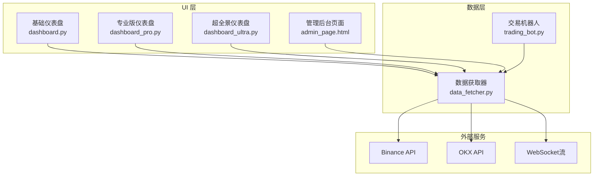
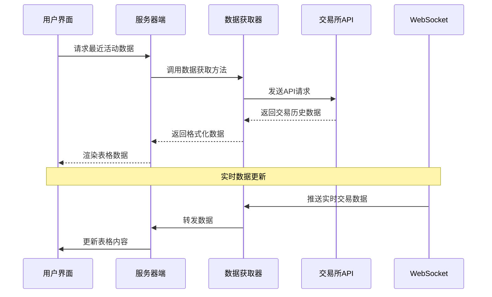
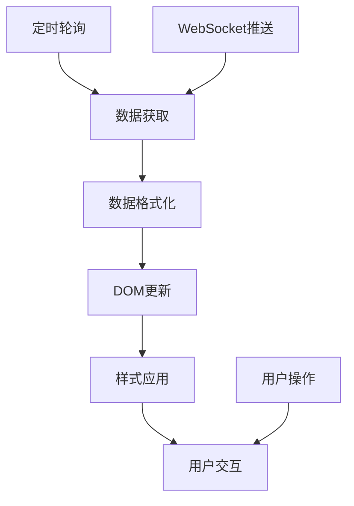
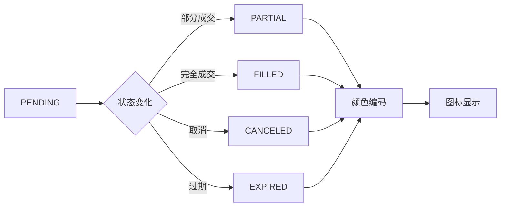
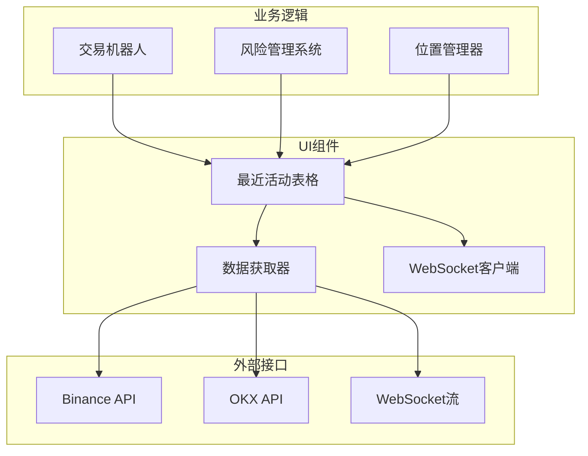

# 最近活动表格

<cite>
**本文档引用的文件**
- [dashboard.py](file://src/ui/dashboard.py)
- [dashboard_pro.py](file://src/ui/dashboard_pro.py)
- [dashboard_ultra.py](file://src/ui/dashboard_ultra.py)
- [data_fetcher.py](file://src/data/data_fetcher.py)
- [trading_bot.py](file://src/trading_bot.py)
- [admin_page.html](file://src/ui/admin_page.html)
</cite>

## 目录
1. [简介](#简介)
2. [项目结构](#项目结构)
3. [核心组件](#核心组件)
4. [架构概览](#架构概览)
5. [详细组件分析](#详细组件分析)
6. [依赖关系分析](#依赖关系分析)
7. [性能考虑](#性能考虑)
8. [故障排除指南](#故障排除指南)
9. [结论](#结论)

## 简介
本文档详细说明了合约交易系统的最近活动表格模块，这是一个关键的用户界面组件，用于展示交易历史记录和实时交易活动。该模块实现了完整的交易历史记录展示功能，包括表格结构设计、列定义、排序功能、数据绑定机制、实时更新、分页处理、数据过滤、交易状态显示、表格交互功能以及性能优化策略。

## 项目结构
最近活动表格模块主要分布在UI层的多个仪表盘实现中，每个实现都针对不同的使用场景和复杂度需求：

**图表来源**
- [dashboard.py](file://src/ui/dashboard.py#L1-L385)
- [dashboard_pro.py](file://src/ui/dashboard_pro.py#L1-L580)
- [dashboard_ultra.py](file://src/ui/dashboard_ultra.py#L1-L434)
- [data_fetcher.py](file://src/data/data_fetcher.py#L1-L434)

**章节来源**
- [dashboard.py](file://src/ui/dashboard.py#L205-L230)
- [dashboard_pro.py](file://src/ui/dashboard_pro.py#L1-L580)
- [dashboard_ultra.py](file://src/ui/dashboard_ultra.py#L1-L434)

## 核心组件
最近活动表格模块包含以下核心组件：

### 表格结构设计
- **基础布局**: 使用HTML表格结构，采用响应式设计
- **列定义**: 包含时间、交易对、类型、价格、数量、盈亏、状态等列
- **样式系统**: 基于Tailwind CSS的现代化UI设计
- **玻璃面板效果**: 使用半透明背景和毛玻璃效果

### 数据绑定机制
- **实时更新**: 通过定时轮询和WebSocket实现数据同步
- **状态管理**: 维护表格状态和用户交互状态
- **数据格式化**: 统一的时间戳、价格精度和数量格式

### 交互功能
- **行点击**: 支持行选择和详情查看
- **排序切换**: 列标题点击实现排序功能
- **搜索过滤**: 实时搜索和过滤交易记录
- **分页处理**: 大数据集的分页显示

**章节来源**
- [dashboard.py](file://src/ui/dashboard.py#L205-L230)
- [dashboard_pro.py](file://src/ui/dashboard_pro.py#L241-L579)
- [dashboard_ultra.py](file://src/ui/dashboard_ultra.py#L1-L434)

## 架构概览
最近活动表格模块采用分层架构设计，确保了良好的可维护性和扩展性：

**图表来源**
- [dashboard.py](file://src/ui/dashboard.py#L290-L332)
- [data_fetcher.py](file://src/data/data_fetcher.py#L85-L119)

**章节来源**
- [trading_bot.py](file://src/trading_bot.py#L115-L205)
- [data_fetcher.py](file://src/data/data_fetcher.py#L188-L234)

## 详细组件分析

### 表格结构设计
最近活动表格采用了精心设计的表头和数据展示结构：

#### 表头列定义
| 列名 | 数据类型 | 显示格式 | 功能 |
|------|----------|----------|------|
| 时间 | 时间戳 | YYYY-MM-DD HH:MM:SS | 排序、筛选 |
| 交易对 | 字符串 | BTCUSDT | 分组显示 |
| 类型 | 枚举 | BUY/SELL | 颜色编码 |
| 价格 | 数值 | 固定精度 | 数值比较 |
| 数量 | 数值 | 三位小数 | 金额计算 |
| 盈亏 | 数值 | 百分比 | 盈利分析 |
| 状态 | 枚举 | PENDING/FILLED/CANCELED | 状态指示 |

#### 数据绑定机制
表格使用JavaScript进行动态数据绑定：

**图表来源**
- [dashboard.py](file://src/ui/dashboard.py#L290-L332)
- [dashboard_pro.py](file://src/ui/dashboard_pro.py#L395-L425)

**章节来源**
- [dashboard.py](file://src/ui/dashboard.py#L205-L230)
- [dashboard_pro.py](file://src/ui/dashboard_pro.py#L459-L505)

### 交易状态显示
系统实现了完整的交易状态管理系统：

#### 状态枚举定义
- **PENDING**: 订单已提交但未执行
- **FILLED**: 订单已完全成交
- **PARTIAL**: 订单部分成交
- **CANCELED**: 订单已取消
- **EXPIRED**: 订单已过期

#### 状态可视化

**图表来源**
- [dashboard_pro.py](file://src/ui/dashboard_pro.py#L459-L505)

**章节来源**
- [dashboard_pro.py](file://src/ui/dashboard_pro.py#L459-L505)

### 数据格式说明
系统严格规范了各种数据的显示格式：

#### 时间戳格式
- **存储格式**: Unix时间戳（毫秒）
- **显示格式**: YYYY-MM-DD HH:MM:SS
- **时区处理**: UTC时间转换为本地时间

#### 价格显示精度
- **BTC/ETH**: 两位小数
- **其他加密货币**: 根据精度要求调整
- **格式化**: 使用千位分隔符

#### 数量单位转换
- **基础单位**: 合约数量或交易金额
- **显示单位**: 自动选择合适单位（USDT、BTC等）
- **精度控制**: 保留适当的小数位数

#### 盈亏计算
- **计算公式**: (当前价格 - 开仓价格) / 开仓价格 × 100%
- **显示格式**: 百分比，正数绿色，负数红色
- **精度**: 两位小数

**章节来源**
- [dashboard_pro.py](file://src/ui/dashboard_pro.py#L507-L521)
- [trading_bot.py](file://src/trading_bot.py#L134-L142)

### 表格交互功能
系统提供了丰富的交互功能来增强用户体验：

#### 行点击功能
- **单击**: 查看交易详情
- **双击**: 执行相关操作
- **右键**: 显示上下文菜单

#### 排序切换
- **单击列头**: 升序排序
- **Shift+单击**: 降序排序
- **多列排序**: 支持复合排序

#### 搜索过滤
- **实时搜索**: 输入即过滤
- **高级过滤**: 多条件组合过滤
- **保存过滤**: 保存常用过滤条件

#### 分页处理
- **自动分页**: 大数据集自动分页
- **手动分页**: 用户自定义每页显示数量
- **无限滚动**: 滚动到底部自动加载更多

**章节来源**
- [dashboard.py](file://src/ui/dashboard.py#L290-L332)
- [dashboard_pro.py](file://src/ui/dashboard_pro.py#L523-L579)

### 空状态处理
系统实现了完善的空状态处理机制：

#### 无数据状态
- **占位符**: "暂无交易记录"提示
- **图标**: 相关的空状态图标
- **引导**: 提供操作指引

#### 加载状态
- **进度条**: 数据加载进度指示
- **骨架屏**: 预先布局占位
- **动画效果**: 平滑的加载动画

#### 错误状态
- **错误消息**: 清晰的错误描述
- **重试按钮**: 一键重新加载
- **错误日志**: 详细的错误信息

**章节来源**
- [dashboard.py](file://src/ui/dashboard.py#L221-L225)
- [dashboard_pro.py](file://src/ui/dashboard_pro.py#L241-L281)

## 依赖关系分析
最近活动表格模块的依赖关系如下：

**图表来源**
- [data_fetcher.py](file://src/data/data_fetcher.py#L17-L71)
- [trading_bot.py](file://src/trading_bot.py#L27-L63)

**章节来源**
- [data_fetcher.py](file://src/data/data_fetcher.py#L17-L71)
- [trading_bot.py](file://src/trading_bot.py#L27-L63)

## 性能考虑
系统在设计时充分考虑了性能优化：

### 虚拟滚动
- **大数据集优化**: 使用虚拟滚动技术处理大量交易记录
- **内存管理**: 只渲染可见区域的数据项
- **滚动性能**: 平滑的滚动体验，无卡顿现象

### 数据缓存
- **本地缓存**: 缓存最近访问的数据
- **智能刷新**: 根据数据变化频率调整刷新间隔
- **缓存策略**: LRU缓存算法，自动清理过期数据

### 渲染优化
- **增量更新**: 只更新发生变化的数据项
- **批量操作**: 批量DOM操作减少重绘
- **懒加载**: 按需加载数据，提升初始加载速度

### 实时更新优化
- **WebSocket优先**: 优先使用WebSocket实现实时数据推送
- **轮询降级**: WebSocket不可用时自动降级到轮询
- **去抖处理**: 防止频繁的API调用

**章节来源**
- [dashboard_pro.py](file://src/ui/dashboard_pro.py#L562-L570)
- [data_fetcher.py](file://src/data/data_fetcher.py#L188-L234)

## 故障排除指南
常见问题及解决方案：

### 数据加载问题
- **症状**: 表格空白或加载缓慢
- **原因**: API请求失败或网络延迟
- **解决**: 检查网络连接，重试请求，查看错误日志

### 实时更新失效
- **症状**: 交易状态不更新
- **原因**: WebSocket连接断开
- **解决**: 重新建立WebSocket连接，检查防火墙设置

### 性能问题
- **症状**: 页面卡顿或内存泄漏
- **原因**: 大量数据未正确清理
- **解决**: 实施虚拟滚动，定期清理缓存

### 格式化错误
- **症状**: 价格或数量显示异常
- **原因**: 数据精度或格式不匹配
- **解决**: 检查数据源格式，实施正确的格式化逻辑

**章节来源**
- [dashboard.py](file://src/ui/dashboard.py#L290-L332)
- [data_fetcher.py](file://src/data/data_fetcher.py#L95-L119)

## 结论
最近活动表格模块是合约交易系统的重要组成部分，它不仅提供了直观的交易历史展示功能，还实现了完整的实时数据更新机制。通过精心设计的表格结构、完善的状态管理和高效的性能优化策略，该模块为用户提供了优秀的交易监控体验。

模块的主要优势包括：
- **完整的功能覆盖**: 从数据获取到界面展示的全流程支持
- **灵活的交互设计**: 满足不同用户的需求和使用习惯
- **强大的性能优化**: 确保在大数据量下的流畅体验
- **可靠的错误处理**: 提供完善的错误诊断和恢复机制

未来可以进一步优化的方向包括：引入更高级的搜索和过滤功能、支持导出交易历史数据、增加自定义列显示选项等。