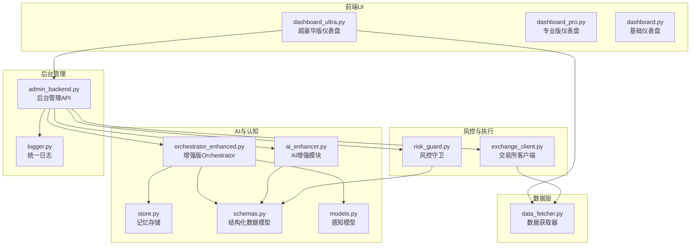
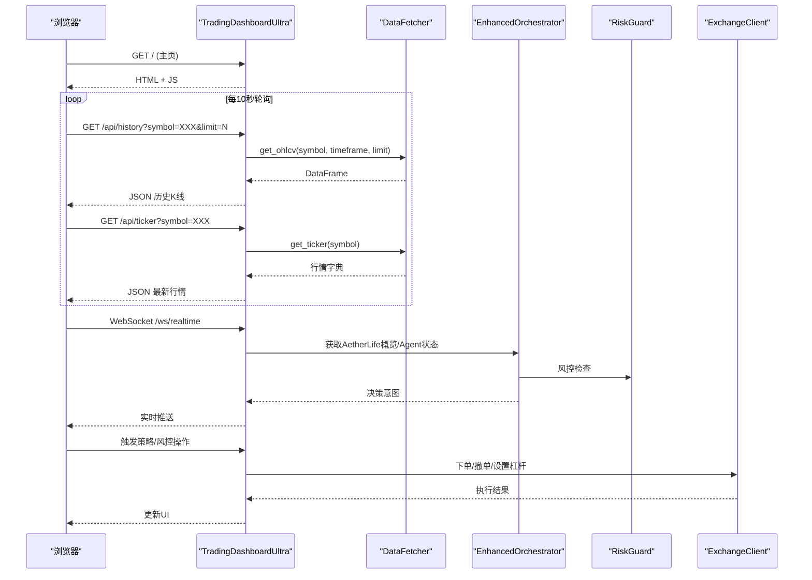
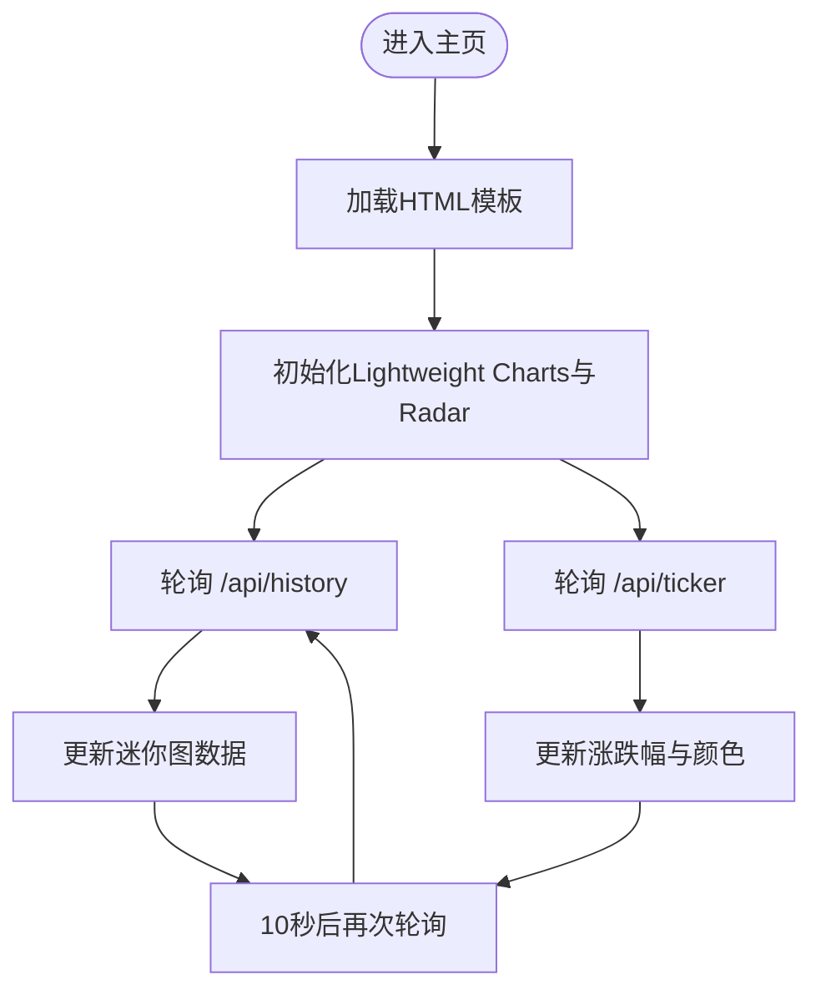
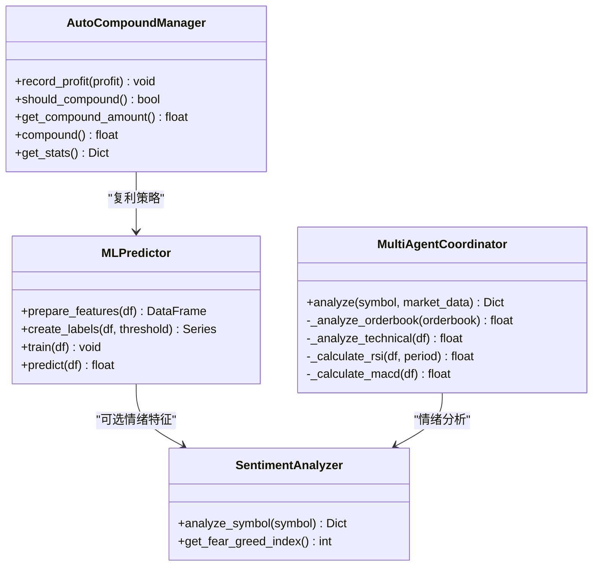
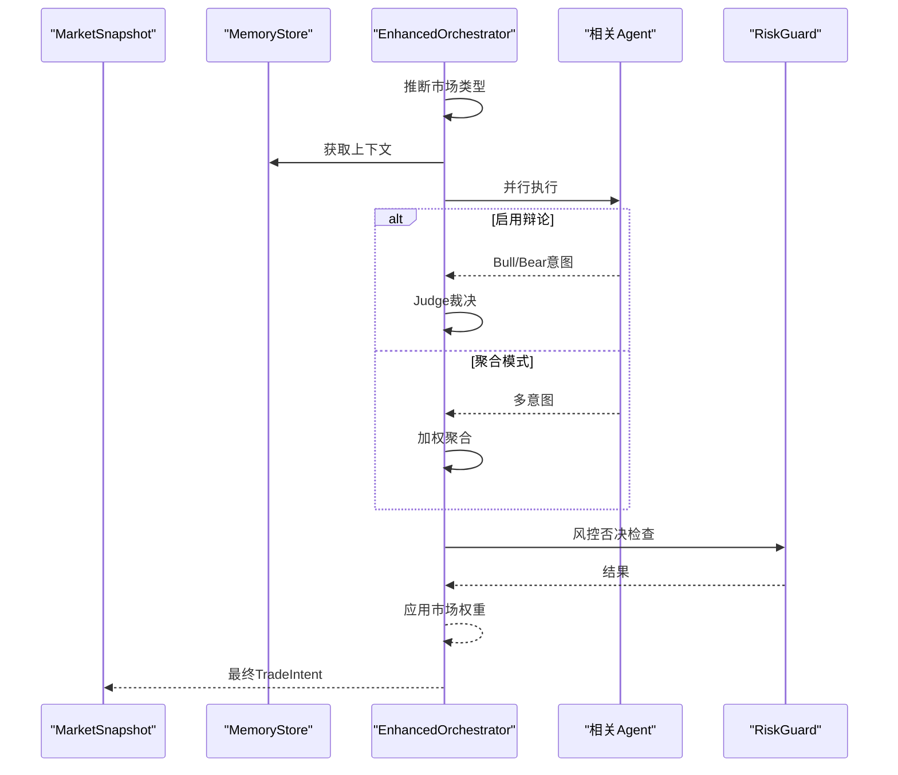
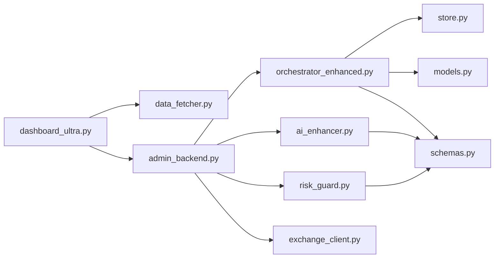

# 超豪华版仪表盘

<cite>
**本文档引用的文件**
- [src/ui/dashboard_ultra.py](file://src/ui/dashboard_ultra.py)
- [src/ui/dashboard_pro.py](file://src/ui/dashboard_pro.py)
- [src/ui/dashboard.py](file://src/ui/dashboard.py)
- [src/data/data_fetcher.py](file://src/data/data_fetcher.py)
- [src/utils/ai_enhancer.py](file://src/utils/ai_enhancer.py)
- [src/aetherlife/cognition/orchestrator_enhanced.py](file://src/aetherlife/cognition/orchestrator_enhanced.py)
- [src/aetherlife/guard/risk_guard.py](file://src/aetherlife/guard/risk_guard.py)
- [src/execution/exchange_client.py](file://src/execution/exchange_client.py)
- [src/aetherlife/memory/store.py](file://src/aetherlife/memory/store.py)
- [src/aetherlife/perception/models.py](file://src/aetherlife/perception/models.py)
- [src/aetherlife/cognition/schemas.py](file://src/aetherlife/cognition/schemas.py)
- [src/ui/admin_backend.py](file://src/ui/admin_backend.py)
- [src/utils/logger.py](file://src/utils/logger.py)
- [configs/config.json](file://configs/config.json)
- [configs/aetherlife.json](file://configs/aetherlife.json)
</cite>

## 目录
1. [简介](#简介)
2. [项目结构](#项目结构)
3. [核心组件](#核心组件)
4. [架构总览](#架构总览)
5. [详细组件分析](#详细组件分析)
6. [依赖关系分析](#依赖关系分析)
7. [性能考量](#性能考量)
8. [故障排除指南](#故障排除指南)
9. [结论](#结论)
10. [附录](#附录)

## 简介
本文件面向“超豪华版仪表盘”（dashboard_ultra.py）的技术文档，系统阐述其相较“专业版”（dashboard_pro.py）的进一步增强与扩展能力，涵盖：
- 完整监控生态：多图表、实时数据、事件日志与系统状态
- 高级分析套件：AI策略引擎、风控雷达、多Agent协同
- 企业级功能：后台管理、权限与审计、报告与可视化
- 高级配置：自定义指标、复杂规则引擎、自动化工作流
- 扩展性设计：插件化UI、API扩展、第三方集成

超豪华版在专业版基础上，引入了全景监控视图、AI信号处理器、风控雷达、事件日志与系统心跳等企业级特性，并通过后台管理API与AetherLife多Agent体系实现更强大的策略协同与风险控制。

## 项目结构
超豪华版仪表盘位于 src/ui/dashboard_ultra.py，配合数据获取层、AI增强模块、AetherLife认知与风控体系、执行层以及后台管理API共同构成完整的交易监控与控制系统。

**图表来源**
- [src/ui/dashboard_ultra.py](file://src/ui/dashboard_ultra.py#L1-L434)
- [src/ui/dashboard_pro.py](file://src/ui/dashboard_pro.py#L1-L580)
- [src/ui/dashboard.py](file://src/ui/dashboard.py#L1-L385)
- [src/data/data_fetcher.py](file://src/data/data_fetcher.py#L1-L434)
- [src/utils/ai_enhancer.py](file://src/utils/ai_enhancer.py#L1-L360)
- [src/aetherlife/cognition/orchestrator_enhanced.py](file://src/aetherlife/cognition/orchestrator_enhanced.py#L1-L323)
- [src/aetherlife/guard/risk_guard.py](file://src/aetherlife/guard/risk_guard.py#L1-L84)
- [src/execution/exchange_client.py](file://src/execution/exchange_client.py#L1-L432)
- [src/aetherlife/memory/store.py](file://src/aetherlife/memory/store.py#L1-L155)
- [src/aetherlife/perception/models.py](file://src/aetherlife/perception/models.py#L1-L64)
- [src/aetherlife/cognition/schemas.py](file://src/aetherlife/cognition/schemas.py#L1-L219)
- [src/ui/admin_backend.py](file://src/ui/admin_backend.py#L1-L349)
- [src/utils/logger.py](file://src/utils/logger.py#L1-L34)

**章节来源**
- [src/ui/dashboard_ultra.py](file://src/ui/dashboard_ultra.py#L1-L434)
- [src/ui/dashboard_pro.py](file://src/ui/dashboard_pro.py#L1-L580)
- [src/ui/dashboard.py](file://src/ui/dashboard.py#L1-L385)

## 核心组件
- 超豪华版仪表盘（TradingDashboardUltra）
  - 提供全景监控视图：市场热力图、AI策略引擎面板、风控雷达、多图表网格、事件日志
  - 通过REST API提供历史K线与最新行情，支持轮询刷新与实时趋势指示
- 数据获取层（DataFetcher）
  - 支持Binance/OKX等交易所，提供K线、行情、订单簿、资金费率等数据
  - 提供WebSocket订阅接口，便于实时行情与订单簿流式推送
- AI增强模块（AI Enhancer）
  - 情绪分析、机器学习预测、多Agent协调、自动复利管理
- 增强版Orchestrator（AetherLife）
  - 多市场Agent协同、辩论机制、权重聚合、风控否决、LangGraph状态机预留
- 风控守卫（RiskGuard）
  - 电路断路器、单日最大亏损限制、大额人工确认（HITL）、审计日志
- 后台管理API（AdminBackend）
  - 配置管理、策略管理、Bot控制、AetherLife扩展接口、WebSocket实时推送
- 执行层（ExchangeClient）
  - Binance/OKX合约交易客户端，支持下单、撤单、杠杆设置、持仓查询等

**章节来源**
- [src/ui/dashboard_ultra.py](file://src/ui/dashboard_ultra.py#L9-L434)
- [src/data/data_fetcher.py](file://src/data/data_fetcher.py#L17-L434)
- [src/utils/ai_enhancer.py](file://src/utils/ai_enhancer.py#L15-L360)
- [src/aetherlife/cognition/orchestrator_enhanced.py](file://src/aetherlife/cognition/orchestrator_enhanced.py#L21-L323)
- [src/aetherlife/guard/risk_guard.py](file://src/aetherlife/guard/risk_guard.py#L23-L84)
- [src/ui/admin_backend.py](file://src/ui/admin_backend.py#L28-L349)
- [src/execution/exchange_client.py](file://src/execution/exchange_client.py#L20-L432)

## 架构总览
超豪华版仪表盘采用前后端分离与模块化架构：
- 前端：基于HTML/CSS/JavaScript，使用Lightweight Charts与Chart.js进行可视化
- 后端：aiohttp Web应用，提供REST API与WebSocket
- 数据层：异步HTTP客户端，支持多交易所API
- 认知与风控：多Agent协同、风险控制、记忆存储
- 后台管理：统一配置、策略与执行控制入口

**图表来源**
- [src/ui/dashboard_ultra.py](file://src/ui/dashboard_ultra.py#L17-L428)
- [src/data/data_fetcher.py](file://src/data/data_fetcher.py#L40-L142)
- [src/aetherlife/cognition/orchestrator_enhanced.py](file://src/aetherlife/cognition/orchestrator_enhanced.py#L84-L151)
- [src/aetherlife/guard/risk_guard.py](file://src/aetherlife/guard/risk_guard.py#L48-L68)
- [src/execution/exchange_client.py](file://src/execution/exchange_client.py#L226-L275)
- [src/ui/admin_backend.py](file://src/ui/admin_backend.py#L306-L307)

## 详细组件分析

### 超豪华版仪表盘（TradingDashboardUltra）
- 视图布局
  - HUD头部：系统状态、延迟、CPU、内存、全局盈亏、告警
  - 左上：市场热力图（静态CSS网格）
  - 中上：AI策略引擎（信号卡片、置信度、杠杆、统计）
  - 右上：风控雷达（Chart.js雷达图）
  - 中部：多图表网格（BTC/ETH/SOL迷你图 + 事件日志）
- 数据流
  - 历史K线：/api/history，返回时间序列数组，用于Lightweight Charts区域图
  - 最新行情：/api/ticker，返回价格、涨跌幅、成交量等
  - 趋势指示：根据涨跌幅动态切换迷你图颜色
  - 日志：每5秒追加系统心跳日志
- 路由与响应
  - GET /：返回完整HTML
  - GET /api/history：返回历史K线
  - GET /api/ticker：返回最新行情

**图表来源**
- [src/ui/dashboard_ultra.py](file://src/ui/dashboard_ultra.py#L24-L428)

**章节来源**
- [src/ui/dashboard_ultra.py](file://src/ui/dashboard_ultra.py#L9-L434)

### 数据获取层（DataFetcher）
- 支持交易所
  - Binance：K线、行情、订单簿、资金费率、多空比、WebSocket订阅
  - OKX：K线、行情、订单簿、WebSocket订阅
- 关键方法
  - get_ohlcv(symbol, timeframe, limit)：返回OHLCV DataFrame
  - get_ticker(symbol)：返回24小时行情字典
  - get_orderbook(symbol, limit)：返回买卖盘
  - stream_ticker/stream_orderbook：WebSocket回调驱动
- 错误处理
  - 对API错误码进行捕获与抛出，避免静默失败

**章节来源**
- [src/data/data_fetcher.py](file://src/data/data_fetcher.py#L17-L434)

### AI增强模块（AI Enhancer）
- 情绪分析（SentimentAnalyzer）
  - 提供符号情绪评分、Twitter提及数、新闻评分、恐慌贪婪指数
- 机器学习预测（MLPredictor）
  - 特征工程：RSI、MACD、布林带位置、成交量比率、ATR
  - 标签构建：未来10周期收益二分类
  - 训练与预测：逻辑回归模型，输出置信度
- 多Agent协调（MultiAgentCoordinator）
  - 订单簿压力、技术指标（RSI/MACD/趋势）、权重聚合
  - 综合信号与决策（BUY/SELL/HOLD）
- 自动复利（AutoCompoundManager）
  - 利润阈值触发、复利比例、统计报表

**图表来源**
- [src/utils/ai_enhancer.py](file://src/utils/ai_enhancer.py#L15-L360)

**章节来源**
- [src/utils/ai_enhancer.py](file://src/utils/ai_enhancer.py#L15-L360)

### 增强版Orchestrator（AetherLife）
- 多Agent协同
  - 基础Agent：做市、订单流、统计套利、新闻情绪
  - 专业化Agent：A股、全球股票、加密微结构、跨市场Lead-Lag、外汇微结构、期货微结构、情绪Agent
  - 风控Agent：RiskGuardAgent
  - 辩论机制：Bull/Bear并行 → Judge裁决
- 决策流程
  - 市场类型推断（Crypto/A股/美股/外汇/期货）
  - 相关Agent选择与并行执行
  - 加权聚合或辩论裁决
  - 风控否决与市场权重调整
- LangGraph预留
  - TradeIntent/Vote/LangGraphState等结构化数据模型

**图表来源**
- [src/aetherlife/cognition/orchestrator_enhanced.py](file://src/aetherlife/cognition/orchestrator_enhanced.py#L84-L151)
- [src/aetherlife/guard/risk_guard.py](file://src/aetherlife/guard/risk_guard.py#L48-L68)
- [src/aetherlife/memory/store.py](file://src/aetherlife/memory/store.py#L134-L145)
- [src/aetherlife/perception/models.py](file://src/aetherlife/perception/models.py#L55-L64)
- [src/aetherlife/cognition/schemas.py](file://src/aetherlife/cognition/schemas.py#L32-L58)

**章节来源**
- [src/aetherlife/cognition/orchestrator_enhanced.py](file://src/aetherlife/cognition/orchestrator_enhanced.py#L21-L323)
- [src/aetherlife/guard/risk_guard.py](file://src/aetherlife/guard/risk_guard.py#L23-L84)
- [src/aetherlife/memory/store.py](file://src/aetherlife/memory/store.py#L43-L155)
- [src/aetherlife/perception/models.py](file://src/aetherlife/perception/models.py#L15-L64)
- [src/aetherlife/cognition/schemas.py](file://src/aetherlife/cognition/schemas.py#L32-L219)

### 风控守卫（RiskGuard）
- 核心能力
  - 电路断路器：当日亏损达到阈值触发
  - 单日最大亏损：超过阈值禁止交易
  - 大额人工确认（HITL）：超过阈值的头寸要求人工确认
  - 审计日志：统一日志输出 + 文件落盘 + 回调
- 配置
  - 电路断路器阈值、单日最大亏损阈值、HITL开关与阈值、审计日志路径

**章节来源**
- [src/aetherlife/guard/risk_guard.py](file://src/aetherlife/guard/risk_guard.py#L23-L84)

### 后台管理API（AdminBackend）
- 配置管理
  - 获取/保存/重置/导出配置，敏感信息脱敏展示
  - API连通性测试与交易所API可用性验证
- 基础信息
  - 交易所列表、交易对、策略列表
- Bot控制
  - 启动/停止/状态查询
- AetherLife扩展接口
  - 概览、Agent列表、模型管理、回测、训练进度、交易/持仓/风控、市场快照、延迟
- WebSocket实时推送
  - /ws/realtime 实时推送市场与策略状态

**章节来源**
- [src/ui/admin_backend.py](file://src/ui/admin_backend.py#L28-L349)

### 执行层（ExchangeClient）
- Binance客户端
  - 行情：get_ticker/get_orderbook
  - 交易：get_balance/get_position/place_order/cancel_order/get_orders
  - 风险：set_leverage/set_margin_type
  - 精度与签名：动态精度处理、HMAC签名
- OKX客户端
  - 行情：get_ticker/get_orderbook
  - 交易：占位（待实现）

**章节来源**
- [src/execution/exchange_client.py](file://src/execution/exchange_client.py#L20-L432)

## 依赖关系分析
- 组件耦合
  - dashboard_ultra.py 依赖 data_fetcher 提供数据，依赖 admin_backend 提供AetherLife扩展接口
  - admin_backend 依赖 orchestrator_enhanced、ai_enhancer、risk_guard、exchange_client
  - orchestrator_enhanced 依赖 memory_store、perception.models、schemas
  - ai_enhancer 依赖 schemas
  - risk_guard 依赖 schemas
- 外部依赖
  - aiohttp、pandas、numpy、sklearn（MLPredictor）
  - 可选Redis（MemoryStore持久化）
  - 可选Chart.js、Lightweight Charts（前端可视化）

**图表来源**
- [src/ui/dashboard_ultra.py](file://src/ui/dashboard_ultra.py#L1-L434)
- [src/ui/admin_backend.py](file://src/ui/admin_backend.py#L1-L349)
- [src/aetherlife/cognition/orchestrator_enhanced.py](file://src/aetherlife/cognition/orchestrator_enhanced.py#L1-L323)
- [src/aetherlife/memory/store.py](file://src/aetherlife/memory/store.py#L1-L155)
- [src/aetherlife/perception/models.py](file://src/aetherlife/perception/models.py#L1-L64)
- [src/aetherlife/cognition/schemas.py](file://src/aetherlife/cognition/schemas.py#L1-L219)
- [src/utils/ai_enhancer.py](file://src/utils/ai_enhancer.py#L1-L360)
- [src/aetherlife/guard/risk_guard.py](file://src/aetherlife/guard/risk_guard.py#L1-L84)
- [src/execution/exchange_client.py](file://src/execution/exchange_client.py#L1-L432)
- [src/data/data_fetcher.py](file://src/data/data_fetcher.py#L1-L434)

**章节来源**
- [src/ui/dashboard_ultra.py](file://src/ui/dashboard_ultra.py#L1-L434)
- [src/ui/admin_backend.py](file://src/ui/admin_backend.py#L1-L349)
- [src/aetherlife/cognition/orchestrator_enhanced.py](file://src/aetherlife/cognition/orchestrator_enhanced.py#L1-L323)
- [src/aetherlife/memory/store.py](file://src/aetherlife/memory/store.py#L1-L155)
- [src/aetherlife/perception/models.py](file://src/aetherlife/perception/models.py#L1-L64)
- [src/aetherlife/cognition/schemas.py](file://src/aetherlife/cognition/schemas.py#L1-L219)
- [src/utils/ai_enhancer.py](file://src/utils/ai_enhancer.py#L1-L360)
- [src/aetherlife/guard/risk_guard.py](file://src/aetherlife/guard/risk_guard.py#L1-L84)
- [src/execution/exchange_client.py](file://src/execution/exchange_client.py#L1-L432)
- [src/data/data_fetcher.py](file://src/data/data_fetcher.py#L1-L434)

## 性能考量
- 前端性能
  - 轻量级图表库（Lightweight Charts、Chart.js），减少DOM与重绘
  - 轮询间隔10秒，避免频繁请求；趋势颜色动态切换降低视觉负担
- 后端性能
  - 异步HTTP与WebSocket，提升并发吞吐
  - DataFetcher统一错误处理，避免阻塞
  - Orchestrator并行执行Agent，缩短决策延迟
- 数据与存储
  - MemoryStore使用deque限制内存占用，支持可选Redis持久化
  - RiskGuard审计日志异步写入，避免阻塞主流程

[本节为通用指导，不直接分析具体文件]

## 故障排除指南
- 仪表盘无法加载数据
  - 检查 /api/history 与 /api/ticker 是否返回错误
  - 确认 data_fetcher 正常工作，网络与API密钥正确
- WebSocket无法连接
  - 检查 /ws/realtime 路由与RealTimePush实现
  - 查看后台管理日志，定位连接问题
- 风控拦截
  - 检查 RiskGuard 阈值配置与当日亏损
  - 如启用HITL，确认人工确认流程
- 日志与审计
  - 统一日志输出与审计文件路径，必要时开启回调

**章节来源**
- [src/ui/dashboard_ultra.py](file://src/ui/dashboard_ultra.py#L28-L58)
- [src/ui/admin_backend.py](file://src/ui/admin_backend.py#L306-L307)
- [src/aetherlife/guard/risk_guard.py](file://src/aetherlife/guard/risk_guard.py#L70-L84)
- [src/utils/logger.py](file://src/utils/logger.py#L12-L34)

## 结论
超豪华版仪表盘在专业版基础上，实现了：
- 全景监控视图与实时数据刷新
- AI策略引擎与风控雷达
- 事件日志与系统心跳
- 后台管理API与AetherLife多Agent体系
- 风控守卫与审计日志
- 执行层与数据层的完整闭环

这些增强使系统具备企业级监控、分析与控制能力，适合高并发、多市场的复杂交易场景。

[本节为总结性内容，不直接分析具体文件]

## 附录
- 配置文件
  - 交易系统配置：exchange、testnet、symbols、timeframe、strategy、leverage、风险参数、AI增强开关
  - AetherLife配置：log_level、认知与进化参数、风控审计日志路径
- 建议
  - 在生产环境启用Redis持久化与审计日志
  - 合理设置轮询间隔与图表刷新频率
  - 为AI模型与Agent权重建立定期评估与校准流程

**章节来源**
- [configs/config.json](file://configs/config.json#L1-L28)
- [configs/aetherlife.json](file://configs/aetherlife.json#L1-L17)