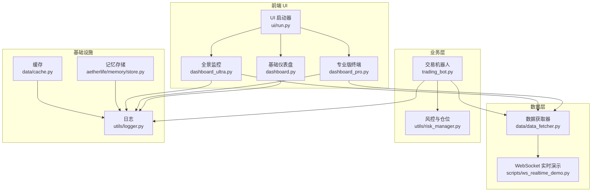
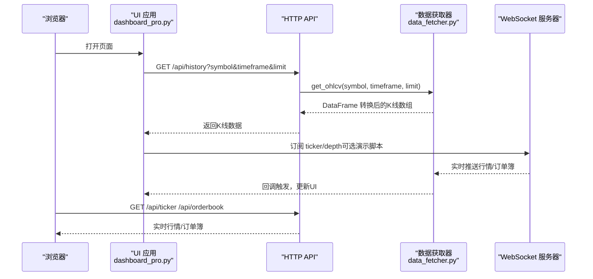
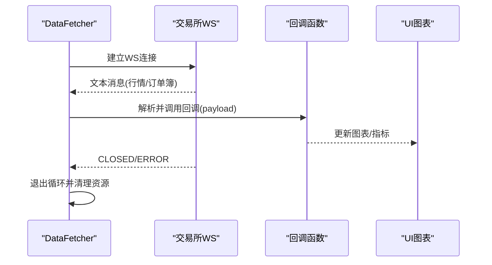
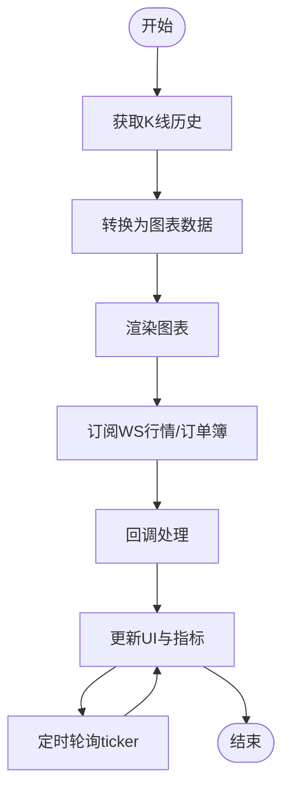
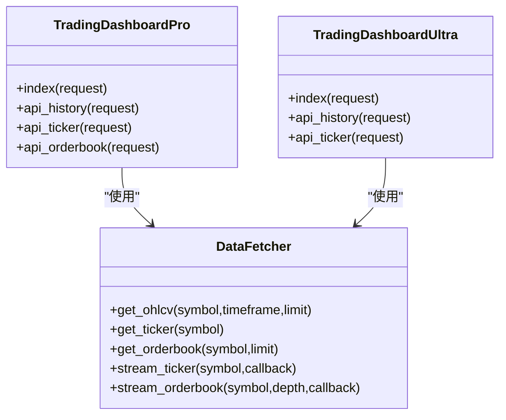
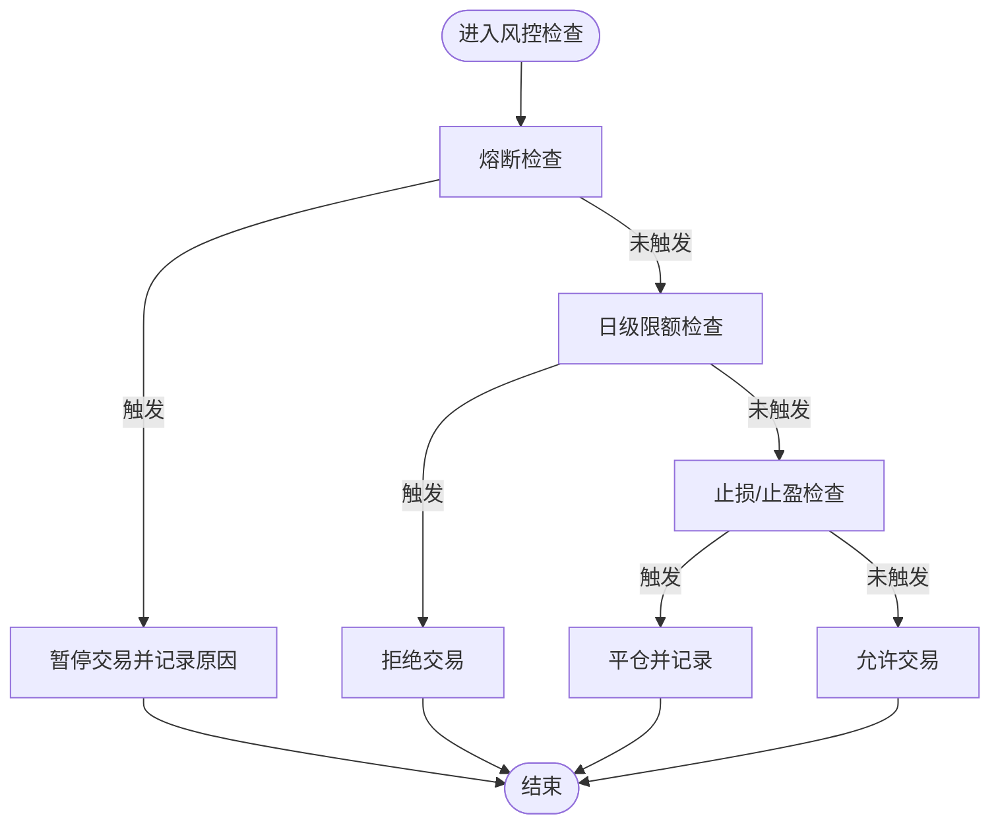
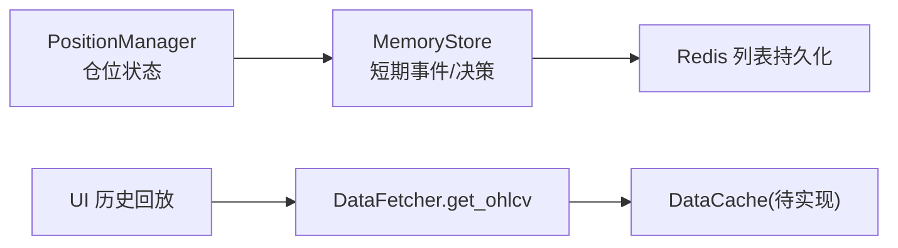
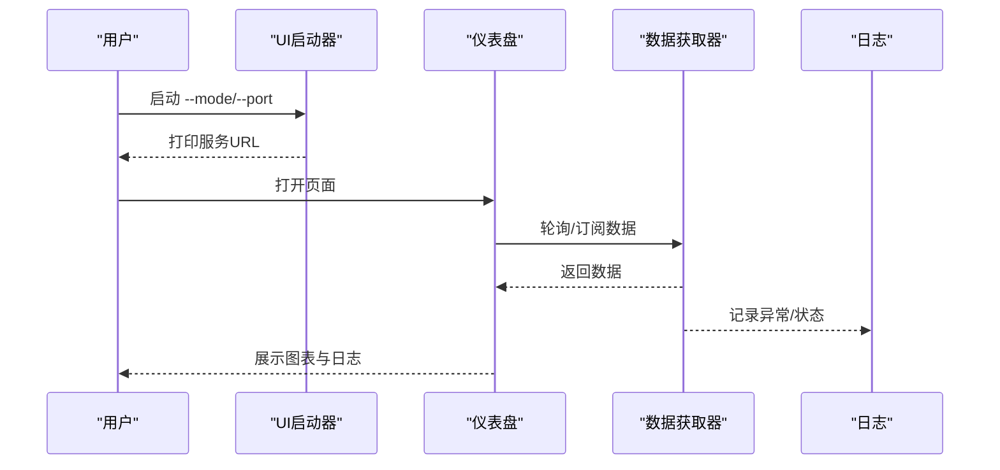
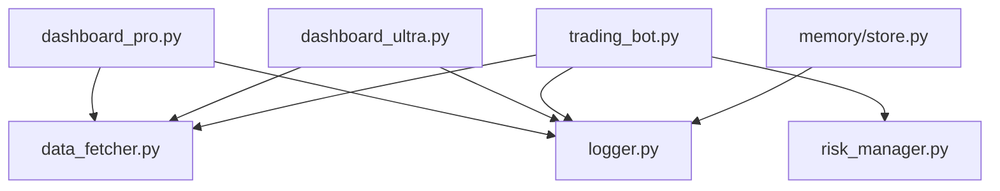

# 实时监控

<cite>
**本文引用的文件**   
- [src/ui/dashboard.py](file://src/ui/dashboard.py)
- [src/ui/dashboard_pro.py](file://src/ui/dashboard_pro.py)
- [src/ui/dashboard_ultra.py](file://src/ui/dashboard_ultra.py)
- [src/ui/run.py](file://src/ui/run.py)
- [src/data/data_fetcher.py](file://src/data/data_fetcher.py)
- [scripts/ws_realtime_demo.py](file://scripts/ws_realtime_demo.py)
- [src/trading_bot.py](file://src/trading_bot.py)
- [src/utils/risk_manager.py](file://src/utils/risk_manager.py)
- [src/utils/logger.py](file://src/utils/logger.py)
- [src/aetherlife/memory/store.py](file://src/aetherlife/memory/store.py)
- [src/data/cache.py](file://src/data/cache.py)
</cite>

## 目录
1. [简介](#简介)
2. [项目结构](#项目结构)
3. [核心组件](#核心组件)
4. [架构总览](#架构总览)
5. [详细组件分析](#详细组件分析)
6. [依赖关系分析](#依赖关系分析)
7. [性能考量](#性能考量)
8. [故障排除指南](#故障排除指南)
9. [结论](#结论)
10. [附录](#附录)

## 简介
本技术文档聚焦于量化交易系统的“实时监控”能力，覆盖以下主题：
- 实时数据推送机制：WebSocket 连接、事件订阅与数据流处理
- 监控数据采集与传输：交易状态、市场数据、系统健康检查
- 实时图表实现：数据可视化、动态更新与性能优化
- 监控告警：异常检测、阈值设置与告警级别
- 数据存储与缓存：内存管理、持久化与历史回放
- 调试与故障排除：连接状态、数据流分析与性能监控
- 最佳实践与性能调优

## 项目结构
系统采用“前端 UI + 数据获取层 + 业务引擎”的分层组织：
- UI 层：提供基础、专业版与全景三种仪表盘，负责展示与交互
- 数据层：封装 Binance/OKX 的 REST 与 WebSocket 接口，提供历史与实时数据
- 业务层：交易机器人负责策略分析、下单与风控
- 工具与基础设施：日志、风控、内存与缓存

**图表来源**
- [src/ui/run.py](file://src/ui/run.py#L34-L95)
- [src/ui/dashboard.py](file://src/ui/dashboard.py#L13-L385)
- [src/ui/dashboard_pro.py](file://src/ui/dashboard_pro.py#L10-L580)
- [src/ui/dashboard_ultra.py](file://src/ui/dashboard_ultra.py#L9-L434)
- [src/data/data_fetcher.py](file://src/data/data_fetcher.py#L17-L434)
- [scripts/ws_realtime_demo.py](file://scripts/ws_realtime_demo.py#L30-L62)
- [src/trading_bot.py](file://src/trading_bot.py#L27-L346)
- [src/utils/risk_manager.py](file://src/utils/risk_manager.py#L12-L388)
- [src/utils/logger.py](file://src/utils/logger.py#L12-L34)
- [src/aetherlife/memory/store.py](file://src/aetherlife/memory/store.py#L43-L138)
- [src/data/cache.py](file://src/data/cache.py#L4-L7)

**章节来源**
- [src/ui/run.py](file://src/ui/run.py#L34-L95)
- [src/ui/dashboard.py](file://src/ui/dashboard.py#L13-L385)
- [src/ui/dashboard_pro.py](file://src/ui/dashboard_pro.py#L10-L580)
- [src/ui/dashboard_ultra.py](file://src/ui/dashboard_ultra.py#L9-L434)
- [src/data/data_fetcher.py](file://src/data/data_fetcher.py#L17-L434)
- [scripts/ws_realtime_demo.py](file://scripts/ws_realtime_demo.py#L30-L62)
- [src/trading_bot.py](file://src/trading_bot.py#L27-L346)
- [src/utils/risk_manager.py](file://src/utils/risk_manager.py#L12-L388)
- [src/utils/logger.py](file://src/utils/logger.py#L12-L34)
- [src/aetherlife/memory/store.py](file://src/aetherlife/memory/store.py#L43-L138)
- [src/data/cache.py](file://src/data/cache.py#L4-L7)

## 核心组件
- 仪表盘与前端交互
  - 基础仪表盘：提供关键指标与简单图表，通过轮询接口更新
  - 专业版终端：支持 K 线历史、实时行情与订单簿，采用轮询与轻量指标
  - 全景监控：多图表网格、雷达图与日志控制台，定时刷新
- 数据获取与实时推送
  - DataFetcher 抽象与具体实现（BinanceDataFetcher、OKXDataFetcher）
  - WebSocket 行情与订单簿订阅，回调驱动数据更新
- 业务与风控
  - TradingBot：策略分析、下单与风控检查
  - RiskManager：止损止盈、熔断与日级限额
- 存储与缓存
  - MemoryStore：短期事件与决策的记忆，可选 Redis 持久化
  - DataCache：占位缓存容器（当前未实现具体逻辑）

**章节来源**
- [src/ui/dashboard.py](file://src/ui/dashboard.py#L13-L385)
- [src/ui/dashboard_pro.py](file://src/ui/dashboard_pro.py#L10-L580)
- [src/ui/dashboard_ultra.py](file://src/ui/dashboard_ultra.py#L9-L434)
- [src/data/data_fetcher.py](file://src/data/data_fetcher.py#L17-L434)
- [src/trading_bot.py](file://src/trading_bot.py#L27-L346)
- [src/utils/risk_manager.py](file://src/utils/risk_manager.py#L12-L388)
- [src/aetherlife/memory/store.py](file://src/aetherlife/memory/store.py#L43-L138)
- [src/data/cache.py](file://src/data/cache.py#L4-L7)

## 架构总览
系统通过 UI 与数据层解耦，UI 通过 HTTP API 获取历史与静态数据；实时数据通过 WebSocket 由数据层订阅并以回调形式注入。业务层在本地进行策略与风控判断，不直接暴露给 UI。

**图表来源**
- [src/ui/dashboard_pro.py](file://src/ui/dashboard_pro.py#L29-L76)
- [src/data/data_fetcher.py](file://src/data/data_fetcher.py#L85-L142)
- [scripts/ws_realtime_demo.py](file://scripts/ws_realtime_demo.py#L30-L62)

**章节来源**
- [src/ui/dashboard_pro.py](file://src/ui/dashboard_pro.py#L29-L76)
- [src/data/data_fetcher.py](file://src/data/data_fetcher.py#L85-L142)
- [scripts/ws_realtime_demo.py](file://scripts/ws_realtime_demo.py#L30-L62)

## 详细组件分析

### 实时数据推送机制（WebSocket）
- 连接建立
  - Binance：使用固定 WS URL，订阅 bookTicker 或 depth@100ms
  - OKX：连接公共 WS，发送订阅消息（tickers/books/books5）
- 事件订阅
  - ticker：推送最新价、买卖价与成交量
  - orderbook：推送 bids/asks，支持 depth 参数
- 数据流处理
  - 回调函数接收原始数据，转换为统一结构后驱动 UI 更新
  - 支持心跳保活与异常关闭处理

**图表来源**
- [src/data/data_fetcher.py](file://src/data/data_fetcher.py#L188-L234)
- [src/data/data_fetcher.py](file://src/data/data_fetcher.py#L327-L396)

**章节来源**
- [src/data/data_fetcher.py](file://src/data/data_fetcher.py#L188-L234)
- [src/data/data_fetcher.py](file://src/data/data_fetcher.py#L327-L396)
- [scripts/ws_realtime_demo.py](file://scripts/ws_realtime_demo.py#L30-L62)

### 监控数据采集与传输
- 历史数据
  - K 线：REST 接口获取 OHLCV，转换为 Lightweight Charts 所需格式
  - 行情与订单簿：REST 接口获取最新 ticker 与 orderbook
- 实时数据
  - WebSocket 订阅 ticker 与 orderbook，回调驱动 UI 动态更新
- 系统健康检查
  - UI 侧通过定时轮询接口与日志输出反映系统状态
  - 全景监控包含“系统在线”指示与心跳日志

**图表来源**
- [src/ui/dashboard_pro.py](file://src/ui/dashboard_pro.py#L29-L76)
- [src/ui/dashboard_ultra.py](file://src/ui/dashboard_ultra.py#L367-L409)

**章节来源**
- [src/ui/dashboard_pro.py](file://src/ui/dashboard_pro.py#L29-L76)
- [src/ui/dashboard_ultra.py](file://src/ui/dashboard_ultra.py#L367-L409)

### 实时图表实现（可视化、动态更新与优化）
- 图表库
  - Lightweight Charts：蜡烛图、均线、自适应尺寸
  - Chart.js：雷达图（全景监控）
- 动态更新
  - 专业版：定时轮询 ticker 与 orderbook，必要时刷新 K 线
  - 全景监控：定时刷新多图表与日志控制台
- 性能优化
  - 限制数据点数量（如历史 K 线 limit）
  - 使用区域渲染与禁用滚动缩放以减少重绘
  - 指标计算在前端完成，避免额外网络请求

**图表来源**
- [src/ui/dashboard_pro.py](file://src/ui/dashboard_pro.py#L10-L580)
- [src/ui/dashboard_ultra.py](file://src/ui/dashboard_ultra.py#L9-L434)
- [src/data/data_fetcher.py](file://src/data/data_fetcher.py#L17-L434)

**章节来源**
- [src/ui/dashboard_pro.py](file://src/ui/dashboard_pro.py#L10-L580)
- [src/ui/dashboard_ultra.py](file://src/ui/dashboard_ultra.py#L9-L434)
- [src/data/data_fetcher.py](file://src/data/data_fetcher.py#L17-L434)

### 监控告警系统（异常检测、阈值与级别）
- 触发条件
  - 止损/止盈：基于入场价与当前价的百分比阈值
  - 熔断：单日累计亏损达到阈值，进入冷却期暂停交易
  - 日级限额：单日最大交易次数与连续亏损次数
- 通知机制
  - 控制台日志输出（统一 Logger）
  - UI 日志控制台（全景监控）
- 告警级别
  - 熔断（暂停交易）、连续亏损警告、止盈/止损触发提示

**图表来源**
- [src/utils/risk_manager.py](file://src/utils/risk_manager.py#L129-L194)

**章节来源**
- [src/utils/risk_manager.py](file://src/utils/risk_manager.py#L12-L388)
- [src/utils/logger.py](file://src/utils/logger.py#L12-L34)
- [src/ui/dashboard_ultra.py](file://src/ui/dashboard_ultra.py#L411-L424)

### 实时监控的数据存储与缓存
- 内存管理
  - MemoryStore：短期事件与决策队列，支持 Redis 持久化与加载
  - PositionManager：内存中维护仓位状态与浮动盈亏
- 数据持久化
  - Redis 列表持久化近期交易与决策，限制最大长度
- 历史回放
  - UI 通过 REST 接口拉取历史 K 线进行回放
- 缓存策略
  - DataCache 类存在但未实现具体逻辑，可用于未来扩展

**图表来源**
- [src/aetherlife/memory/store.py](file://src/aetherlife/memory/store.py#L43-L138)
- [src/utils/risk_manager.py](file://src/utils/risk_manager.py#L244-L339)
- [src/data/data_fetcher.py](file://src/data/data_fetcher.py#L85-L119)
- [src/data/cache.py](file://src/data/cache.py#L4-L7)

**章节来源**
- [src/aetherlife/memory/store.py](file://src/aetherlife/memory/store.py#L43-L138)
- [src/utils/risk_manager.py](file://src/utils/risk_manager.py#L244-L339)
- [src/data/data_fetcher.py](file://src/data/data_fetcher.py#L85-L119)
- [src/data/cache.py](file://src/data/cache.py#L4-L7)

### 调试与故障排除
- 连接状态检查
  - UI 启动器会打印服务地址与模式，确认端口映射
  - WebSocket 订阅脚本演示如何建立连接与处理回调
- 数据流分析
  - 使用统一 Logger 输出关键事件与异常堆栈
  - 全景监控日志控制台输出系统心跳
- 性能监控
  - 专业版定时轮询 ticker 与 orderbook，观察延迟
  - 全景监控显示系统在线与心跳日志

**图表来源**
- [src/ui/run.py](file://src/ui/run.py#L34-L95)
- [src/ui/dashboard_ultra.py](file://src/ui/dashboard_ultra.py#L411-L424)
- [src/utils/logger.py](file://src/utils/logger.py#L12-L34)

**章节来源**
- [src/ui/run.py](file://src/ui/run.py#L34-L95)
- [src/ui/dashboard_ultra.py](file://src/ui/dashboard_ultra.py#L411-L424)
- [src/utils/logger.py](file://src/utils/logger.py#L12-L34)
- [scripts/ws_realtime_demo.py](file://scripts/ws_realtime_demo.py#L30-L62)

## 依赖关系分析
- UI 与数据层
  - 专业版与全景监控依赖 DataFetcher 提供的历史与实时数据
- 业务与数据
  - TradingBot 并行获取 OHLCV 与 ticker，不直接依赖 UI
- 风控与业务
  - RiskManager 与 PositionManager 为 TradingBot 提供风控与仓位管理
- 基础设施
  - Logger 为所有模块提供统一日志输出

**图表来源**
- [src/ui/dashboard_pro.py](file://src/ui/dashboard_pro.py#L10-L580)
- [src/ui/dashboard_ultra.py](file://src/ui/dashboard_ultra.py#L9-L434)
- [src/data/data_fetcher.py](file://src/data/data_fetcher.py#L17-L434)
- [src/trading_bot.py](file://src/trading_bot.py#L27-L346)
- [src/utils/risk_manager.py](file://src/utils/risk_manager.py#L12-L388)
- [src/utils/logger.py](file://src/utils/logger.py#L12-L34)
- [src/aetherlife/memory/store.py](file://src/aetherlife/memory/store.py#L43-L138)

**章节来源**
- [src/ui/dashboard_pro.py](file://src/ui/dashboard_pro.py#L10-L580)
- [src/ui/dashboard_ultra.py](file://src/ui/dashboard_ultra.py#L9-L434)
- [src/data/data_fetcher.py](file://src/data/data_fetcher.py#L17-L434)
- [src/trading_bot.py](file://src/trading_bot.py#L27-L346)
- [src/utils/risk_manager.py](file://src/utils/risk_manager.py#L12-L388)
- [src/utils/logger.py](file://src/utils/logger.py#L12-L34)
- [src/aetherlife/memory/store.py](file://src/aetherlife/memory/store.py#L43-L138)

## 性能考量
- 网络与并发
  - 使用 aiohttp 并行获取 OHLCV 与 ticker，降低等待时间
  - WebSocket 心跳保活，异常时自动断开与清理
- 前端渲染
  - 限制历史数据点数量，避免过度渲染
  - 关闭图表滚动与缩放，提升响应速度
- 缓存与持久化
  - DataCache 待实现，建议引入内存缓存与过期策略
  - MemoryStore 的 Redis 持久化可作为历史事件回放的基础

[本节为通用指导，无需特定文件引用]

## 故障排除指南
- UI 无法访问
  - 检查启动参数与端口映射，确认服务已启动
  - 查看日志输出定位问题
- WebSocket 不更新
  - 确认订阅参数与交易所格式（如 OKX 合约格式）
  - 检查回调是否被正确注册与调用
- 图表不刷新
  - 检查定时轮询间隔与接口返回数据格式
  - 确认前端图表对象已正确初始化与应用尺寸
- 风控频繁触发
  - 调整止损/止盈与熔断阈值
  - 检查日级限额与连续亏损计数逻辑

**章节来源**
- [src/ui/run.py](file://src/ui/run.py#L34-L95)
- [src/data/data_fetcher.py](file://src/data/data_fetcher.py#L188-L234)
- [src/ui/dashboard_pro.py](file://src/ui/dashboard_pro.py#L562-L570)
- [src/utils/risk_manager.py](file://src/utils/risk_manager.py#L129-L194)

## 结论
本系统通过清晰的分层设计实现了“实时监控”能力：UI 通过 HTTP 与 WebSocket 获取数据，业务层在本地完成策略与风控，基础设施提供统一日志与可扩展的存储方案。建议后续增强 DataCache 与告警通知通道，进一步完善实时性与可观测性。

[本节为总结，无需特定文件引用]

## 附录
- 启动与运行
  - 使用 UI 启动器选择模式与端口，自动打开浏览器
  - WebSocket 实时演示脚本用于验证连接与回调
- 配置与扩展
  - DataFetcher 支持 Binance/OKX，可按需扩展其他交易所
  - MemoryStore 支持 Redis 持久化，便于历史回放与审计

**章节来源**
- [src/ui/run.py](file://src/ui/run.py#L24-L95)
- [scripts/ws_realtime_demo.py](file://scripts/ws_realtime_demo.py#L20-L62)
- [src/data/data_fetcher.py](file://src/data/data_fetcher.py#L400-L407)
- [src/aetherlife/memory/store.py](file://src/aetherlife/memory/store.py#L90-L127)