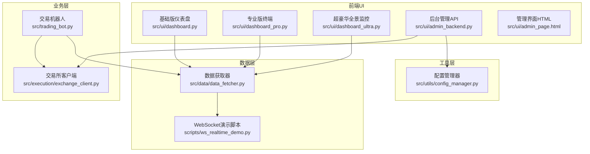
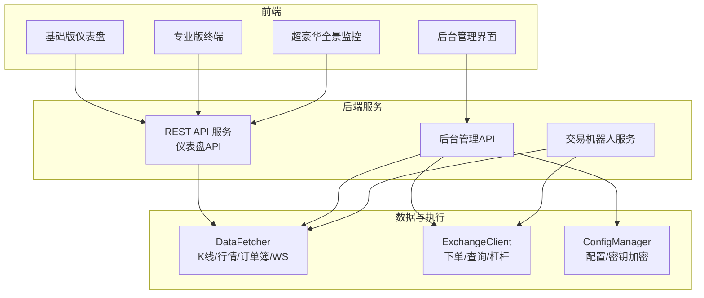
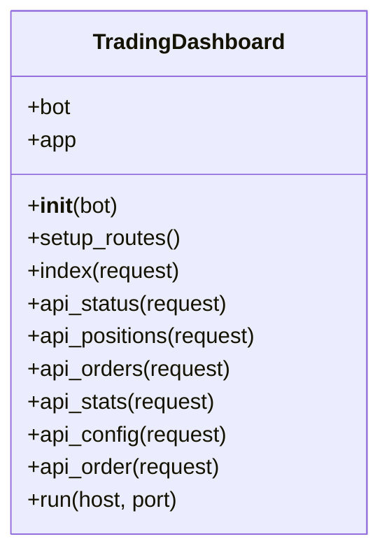
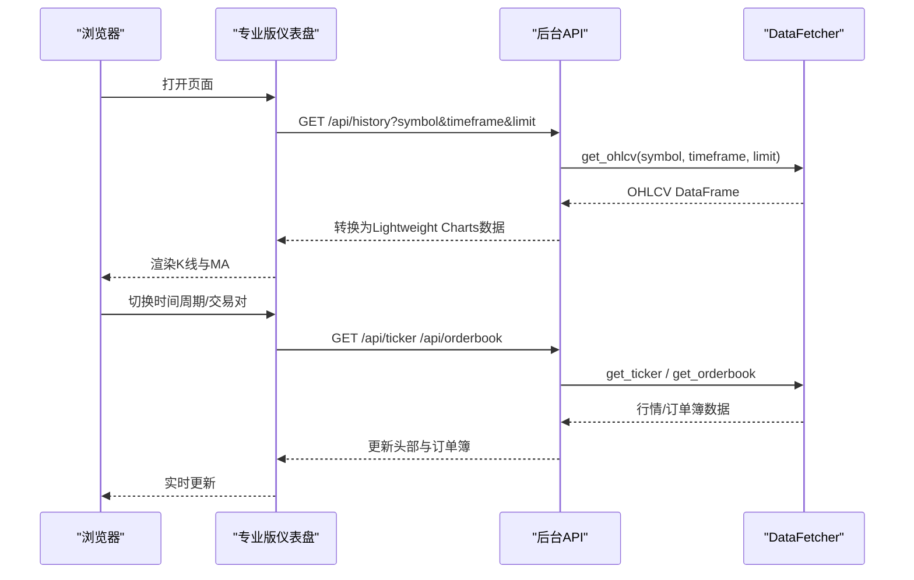
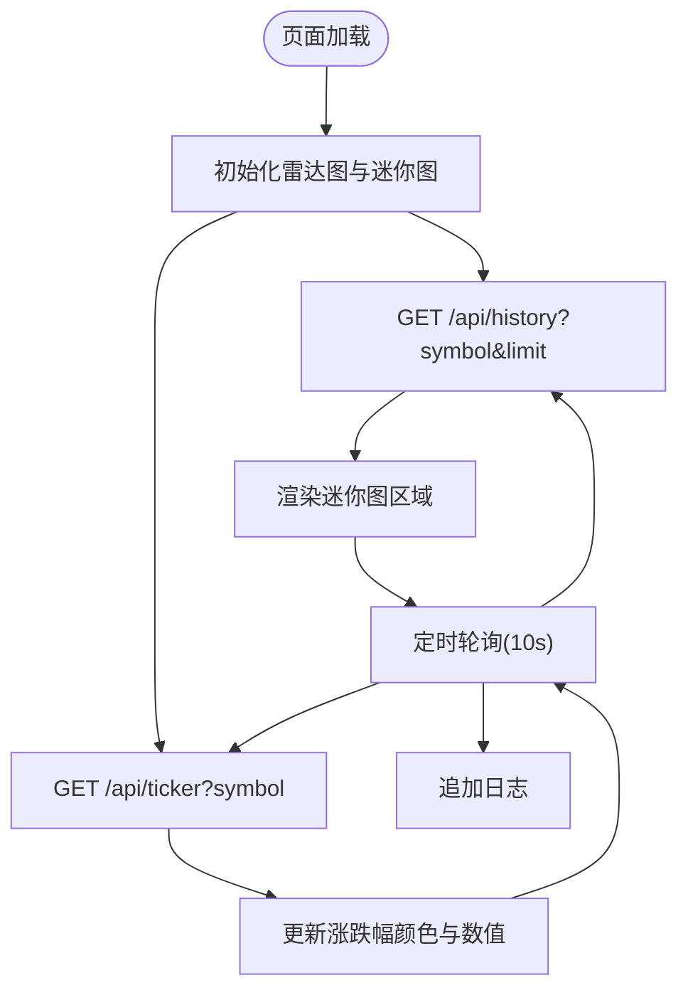
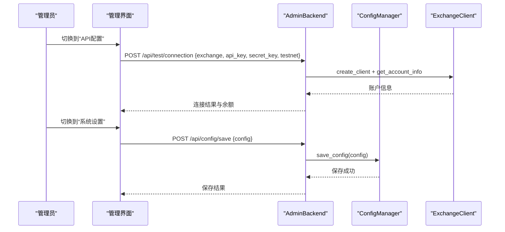
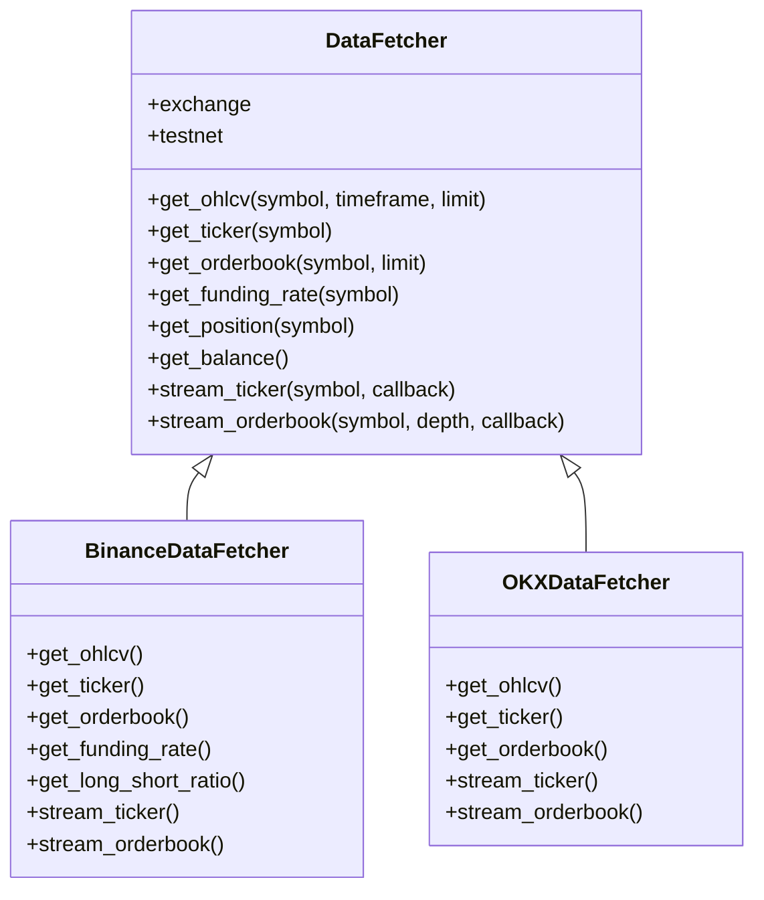
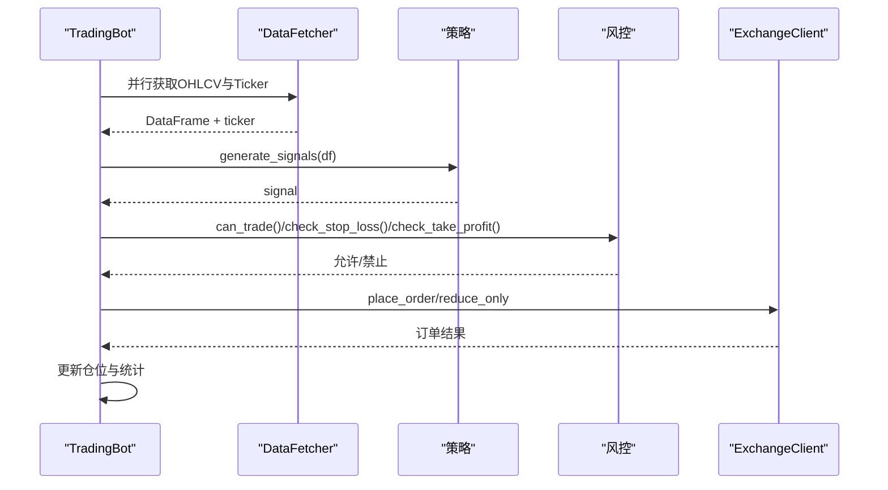
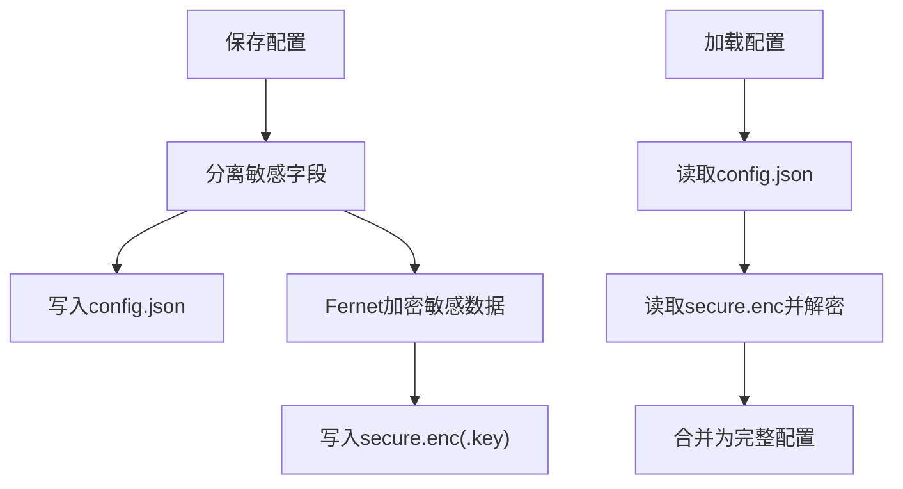
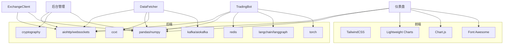

# 监控管理系统

<cite>
**本文档引用的文件**
- [src/ui/dashboard.py](file://src/ui/dashboard.py)
- [src/ui/dashboard_pro.py](file://src/ui/dashboard_pro.py)
- [src/ui/dashboard_ultra.py](file://src/ui/dashboard_ultra.py)
- [src/ui/admin_backend.py](file://src/ui/admin_backend.py)
- [src/ui/admin_page.html](file://src/ui/admin_page.html)
- [src/utils/config_manager.py](file://src/utils/config_manager.py)
- [src/data/data_fetcher.py](file://src/data/data_fetcher.py)
- [src/trading_bot.py](file://src/trading_bot.py)
- [src/execution/exchange_client.py](file://src/execution/exchange_client.py)
- [scripts/ws_realtime_demo.py](file://scripts/ws_realtime_demo.py)
- [requirements.txt](file://requirements.txt)
- [docs/ADMIN_GUIDE.md](file://docs/ADMIN_GUIDE.md)
</cite>

## 目录
1. [简介](#简介)
2. [项目结构](#项目结构)
3. [核心组件](#核心组件)
4. [架构总览](#架构总览)
5. [详细组件分析](#详细组件分析)
6. [依赖关系分析](#依赖关系分析)
7. [性能考虑](#性能考虑)
8. [故障排查指南](#故障排查指南)
9. [结论](#结论)
10. [附录](#附录)

## 简介
本项目为量化交易系统的监控管理系统，提供三类Web仪表盘（基础版、专业版、超豪华版）与后台管理界面，覆盖实时状态监控、交易历史记录、性能指标展示、用户管理、配置管理与系统监控。系统采用异步架构，结合WebSocket实时数据流与REST API，实现低延迟的市场数据展示与交易控制。

## 项目结构
系统主要由UI层（仪表盘与管理界面）、数据层（数据获取与WebSocket订阅）、业务层（交易机器人与风控）与工具层（配置管理与加密存储）组成。核心文件分布如下：
- UI层：src/ui/dashboard*.py、admin_backend.py、admin_page.html
- 数据层：src/data/data_fetcher.py、scripts/ws_realtime_demo.py
- 业务层：src/trading_bot.py、src/execution/exchange_client.py
- 工具层：src/utils/config_manager.py
- 文档与依赖：docs/ADMIN_GUIDE.md、requirements.txt

**图表来源**
- [src/ui/dashboard.py](file://src/ui/dashboard.py#L1-L385)
- [src/ui/dashboard_pro.py](file://src/ui/dashboard_pro.py#L1-L580)
- [src/ui/dashboard_ultra.py](file://src/ui/dashboard_ultra.py#L1-L434)
- [src/ui/admin_backend.py](file://src/ui/admin_backend.py#L1-L447)
- [src/ui/admin_page.html](file://src/ui/admin_page.html#L1-L790)
- [src/data/data_fetcher.py](file://src/data/data_fetcher.py#L1-L434)
- [src/trading_bot.py](file://src/trading_bot.py#L1-L346)
- [src/execution/exchange_client.py](file://src/execution/exchange_client.py#L1-L432)
- [scripts/ws_realtime_demo.py](file://scripts/ws_realtime_demo.py#L1-L62)

**章节来源**
- [src/ui/dashboard.py](file://src/ui/dashboard.py#L1-L385)
- [src/ui/dashboard_pro.py](file://src/ui/dashboard_pro.py#L1-L580)
- [src/ui/dashboard_ultra.py](file://src/ui/dashboard_ultra.py#L1-L434)
- [src/ui/admin_backend.py](file://src/ui/admin_backend.py#L1-L447)
- [src/ui/admin_page.html](file://src/ui/admin_page.html#L1-L790)
- [src/data/data_fetcher.py](file://src/data/data_fetcher.py#L1-L434)
- [src/trading_bot.py](file://src/trading_bot.py#L1-L346)
- [src/execution/exchange_client.py](file://src/execution/exchange_client.py#L1-L432)
- [scripts/ws_realtime_demo.py](file://scripts/ws_realtime_demo.py#L1-L62)

## 核心组件
- 仪表盘组件
  - 基础版：提供核心指标与简单图表，适合入门用户。
  - 专业版：支持多市场、多时间周期、订单簿与技术指标叠加。
  - 超豪华版：全景监控，多图表网格、风控雷达与日志面板。
- 后台管理组件
  - 配置管理：API密钥安全存储、配置导入导出、默认配置重置。
  - 策略管理：策略参数配置、杠杆设置、策略说明。
  - 风控中心：止损止盈、每日最大亏损、单笔最大仓位等。
  - AI增强：多Agent协作、ML预测、情绪分析、自动复利。
  - 系统设置：配置保存、加载、恢复默认、导出备份。
- 数据组件
  - DataFetcher：统一抽象，支持Binance/OKX，提供K线、行情、订单簿与WebSocket订阅。
  - WebSocket演示：展示实时行情与订单簿订阅。
- 业务组件
  - TradingBot：策略驱动的自动化交易，风控与仓位管理。
  - ExchangeClient：交易所API封装，下单、撤单、查询等。
- 工具组件
  - ConfigManager：配置文件与敏感信息加密存储，支持导出与校验。

**章节来源**
- [src/ui/dashboard.py](file://src/ui/dashboard.py#L13-L385)
- [src/ui/dashboard_pro.py](file://src/ui/dashboard_pro.py#L10-L580)
- [src/ui/dashboard_ultra.py](file://src/ui/dashboard_ultra.py#L9-L434)
- [src/ui/admin_backend.py](file://src/ui/admin_backend.py#L20-L447)
- [src/ui/admin_page.html](file://src/ui/admin_page.html#L1-L790)
- [src/data/data_fetcher.py](file://src/data/data_fetcher.py#L17-L434)
- [src/trading_bot.py](file://src/trading_bot.py#L27-L346)
- [src/execution/exchange_client.py](file://src/execution/exchange_client.py#L20-L432)
- [src/utils/config_manager.py](file://src/utils/config_manager.py#L14-L212)

## 架构总览
系统采用前后端分离与模块化设计：
- 前端仪表盘通过REST API获取数据；专业版与超豪华版进一步通过DataFetcher访问交易所数据。
- 后台管理API提供配置管理、策略与风控设置、Bot控制与API测试。
- 交易机器人独立运行，通过DataFetcher与ExchangeClient与市场交互。
- 配置管理器负责敏感信息加密存储，确保安全性。

**图表来源**
- [src/ui/dashboard.py](file://src/ui/dashboard.py#L21-L378)
- [src/ui/dashboard_pro.py](file://src/ui/dashboard_pro.py#L18-L580)
- [src/ui/dashboard_ultra.py](file://src/ui/dashboard_ultra.py#L17-L434)
- [src/ui/admin_backend.py](file://src/ui/admin_backend.py#L29-L447)
- [src/data/data_fetcher.py](file://src/data/data_fetcher.py#L40-L434)
- [src/execution/exchange_client.py](file://src/execution/exchange_client.py#L20-L432)
- [src/utils/config_manager.py](file://src/utils/config_manager.py#L48-L212)

## 详细组件分析

### 基础版仪表盘（TradingDashboard）
- 设计理念：简洁直观，聚焦核心指标（总权益、持仓、当日交易、胜率）与K线图表。
- 功能特性：
  - 实时状态：通过轮询更新总权益、持仓、当日交易等指标。
  - 图表展示：Lightweight Charts绘制K线，支持窗口大小自适应。
  - 快速交易：按钮触发下单请求。
- 数据来源：REST API返回模拟数据，实际部署中应对接真实数据源。
- 集成方式：Aiohttp应用，提供/index与/api/*接口。

**图表来源**
- [src/ui/dashboard.py](file://src/ui/dashboard.py#L13-L385)

**章节来源**
- [src/ui/dashboard.py](file://src/ui/dashboard.py#L13-L385)

### 专业版终端（TradingDashboardPro）
- 设计理念：面向专业用户的多市场、多时间周期交易终端，强调订单簿与技术指标。
- 功能特性：
  - 多市场选择与时间周期切换。
  - 订单簿可视化与买卖盘渲染。
  - MA指标叠加与图表缩放。
  - 资产账户与快速交易面板。
- 数据来源：通过/api/history、/api/ticker、/api/orderbook接口获取DataFetcher数据。
- 集成方式：Aiohttp应用，提供/index与/api/*接口。

**图表来源**
- [src/ui/dashboard_pro.py](file://src/ui/dashboard_pro.py#L29-L580)
- [src/data/data_fetcher.py](file://src/data/data_fetcher.py#L85-L179)

**章节来源**
- [src/ui/dashboard_pro.py](file://src/ui/dashboard_pro.py#L10-L580)
- [src/data/data_fetcher.py](file://src/data/data_fetcher.py#L73-L396)

### 超豪华全景监控（TradingDashboardUltra）
- 设计理念：超宽屏、多图表网格、风控雷达与日志面板，适合集中监控。
- 功能特性：
  - 多图表网格：BTC/ETH/SOL迷你图与涨跌幅指示。
  - 风控雷达：多维度风险指标可视化。
  - 事件日志：系统心跳与运行日志滚动输出。
- 数据来源：通过/api/history与/api/ticker接口获取迷你图数据与涨跌幅。
- 集成方式：Aiohttp应用，提供/index与/api/*接口。

**图表来源**
- [src/ui/dashboard_ultra.py](file://src/ui/dashboard_ultra.py#L28-L434)
- [src/data/data_fetcher.py](file://src/data/data_fetcher.py#L28-L58)

**章节来源**
- [src/ui/dashboard_ultra.py](file://src/ui/dashboard_ultra.py#L9-L434)
- [src/data/data_fetcher.py](file://src/data/data_fetcher.py#L27-L58)

### 后台管理API（AdminBackend）
- 设计理念：集中式配置与系统管理，提供安全的配置存储与Bot控制。
- 功能特性：
  - 配置管理：获取、保存、重置、导出配置；隐藏敏感信息。
  - API测试：连接测试与公开接口测试。
  - 交易所与策略信息：支持的交易所、交易对与策略列表。
  - Bot控制：启动、停止、状态查询。
  - 管理界面：基于admin_page.html的Tab页管理。
- 安全性：ConfigManager使用Fernet对称加密存储敏感信息，文件权限严格控制。

**图表来源**
- [src/ui/admin_backend.py](file://src/ui/admin_backend.py#L57-L447)
- [src/utils/config_manager.py](file://src/utils/config_manager.py#L48-L116)
- [src/execution/exchange_client.py](file://src/execution/exchange_client.py#L172-L200)

**章节来源**
- [src/ui/admin_backend.py](file://src/ui/admin_backend.py#L20-L447)
- [src/ui/admin_page.html](file://src/ui/admin_page.html#L1-L790)
- [src/utils/config_manager.py](file://src/utils/config_manager.py#L14-L212)
- [src/execution/exchange_client.py](file://src/execution/exchange_client.py#L87-L200)

### 数据获取与WebSocket（DataFetcher）
- 设计理念：统一抽象不同交易所的数据接口，支持REST与WebSocket。
- 功能特性：
  - REST接口：K线、24小时行情、订单簿、资金费率、仓位、余额。
  - WebSocket：实时行情与订单簿订阅，回调驱动更新。
  - 适配：Binance Futures与OKX Swap。
- 集成方式：专业版与超豪华版通过REST接口获取数据；WebSocket用于实时订阅。

**图表来源**
- [src/data/data_fetcher.py](file://src/data/data_fetcher.py#L17-L396)

**章节来源**
- [src/data/data_fetcher.py](file://src/data/data_fetcher.py#L17-L434)
- [scripts/ws_realtime_demo.py](file://scripts/ws_realtime_demo.py#L30-L62)

### 交易机器人（TradingBot）
- 设计理念：策略驱动的自动化交易，内置风控与仓位管理。
- 功能特性：
  - 初始化：校验配置、创建DataFetcher与ExchangeClient、加载策略。
  - 主循环：并行获取K线与行情，分析生成信号，风控检查，执行下单与平仓。
  - 风控：止损止盈、每日最大亏损、单笔最大仓位。
- 集成方式：与DataFetcher和ExchangeClient协作，支持Binance/OKX。

**图表来源**
- [src/trading_bot.py](file://src/trading_bot.py#L92-L297)
- [src/data/data_fetcher.py](file://src/data/data_fetcher.py#L85-L179)
- [src/execution/exchange_client.py](file://src/execution/exchange_client.py#L172-L200)

**章节来源**
- [src/trading_bot.py](file://src/trading_bot.py#L27-L346)

### 配置管理（ConfigManager）
- 设计理念：配置文件与敏感信息分离存储，使用Fernet对称加密。
- 功能特性：
  - 普通配置：config.json
  - 敏感信息：secure.enc（API Key/Secret Key/Passphrase）
  - 默认配置：get_default_config
  - 导出：可选包含敏感信息
  - 校验：validate_api_keys
- 安全性：.key文件权限600，加密密钥自动生成。

**图表来源**
- [src/utils/config_manager.py](file://src/utils/config_manager.py#L48-L116)

**章节来源**
- [src/utils/config_manager.py](file://src/utils/config_manager.py#L14-L212)

## 依赖关系分析
- 前端依赖：TailwindCSS、Lightweight Charts、Chart.js、Font Awesome等。
- 后端依赖：aiohttp、websockets、pandas、numpy、cryptography、ccxt、kafka、redis、langchain、torch等。
- 仪表盘与后台管理通过Aiohttp提供REST API；DataFetcher与ExchangeClient封装交易所接口；TradingBot作为独立服务运行。

**图表来源**
- [requirements.txt](file://requirements.txt#L1-L70)
- [src/ui/dashboard.py](file://src/ui/dashboard.py#L40-L61)
- [src/ui/dashboard_pro.py](file://src/ui/dashboard_pro.py#L86-L88)
- [src/ui/dashboard_ultra.py](file://src/ui/dashboard_ultra.py#L68-L71)

**章节来源**
- [requirements.txt](file://requirements.txt#L1-L70)

## 性能考虑
- 异步并发：DataFetcher与ExchangeClient使用aiohttp，支持高并发请求与WebSocket长连接。
- 数据缓存：Redis可用于高频数据缓存与会话存储，降低API调用频率。
- 图表渲染：Lightweight Charts与Chart.js按需渲染，避免一次性渲染大量数据。
- 轮询策略：仪表盘采用合理轮询间隔，避免过度请求；WebSocket用于实时行情与订单簿。
- 资源隔离：后台管理与仪表盘分离部署，减少相互影响。

## 故障排查指南
- API连接失败
  - 检查API密钥格式与权限；确认测试网/主网选择正确。
  - 使用后台管理的“验证连接”功能进行测试。
- 配置保存失败
  - 检查磁盘空间与文件权限；确认配置格式正确。
  - 使用“恢复默认”重置配置后重新设置。
- Bot启动失败
  - 检查配置完整性与API有效性；查看日志中的错误信息。
  - 确认账户资金充足与交易对规则匹配。
- WebSocket订阅异常
  - 使用scripts/ws_realtime_demo.py验证订阅是否正常。
  - 检查网络与防火墙设置，确保WebSocket端口可达。

**章节来源**
- [src/ui/admin_backend.py](file://src/ui/admin_backend.py#L159-L244)
- [src/utils/config_manager.py](file://src/utils/config_manager.py#L146-L161)
- [scripts/ws_realtime_demo.py](file://scripts/ws_realtime_demo.py#L30-L62)
- [docs/ADMIN_GUIDE.md](file://docs/ADMIN_GUIDE.md#L255-L281)

## 结论
本监控管理系统以模块化与异步架构为核心，提供从基础到专业的多层级仪表盘与完善的后台管理能力。通过DataFetcher与ExchangeClient实现对多交易所的统一接入，结合ConfigManager的安全配置管理与TradingBot的策略执行，形成完整的量化交易闭环。建议在生产环境中强化安全与监控，合理配置轮询与缓存策略，确保系统稳定高效运行。

## 附录
- 版本差异对比
  - 基础版：适合初学者，核心指标与简单图表。
  - 专业版：适合交易员，多市场、多时间周期、订单簿与技术指标。
  - 超豪华版：适合运营与风控，全景监控、风控雷达与日志面板。
- 前端定制建议
  - 样式定制：通过Tailwind配置与CSS变量调整主题色与字体。
  - 布局调整：根据屏幕尺寸与需求调整网格布局与图表尺寸。
  - 功能扩展：新增API接口与前端组件，遵循现有路由与状态管理模式。
- 后端集成要点
  - API接口：遵循REST规范，统一响应结构与错误码。
  - 数据一致性：通过DataFetcher抽象保证多交易所数据格式一致。
  - 安全性：敏感信息加密存储，最小权限原则，定期轮换密钥。