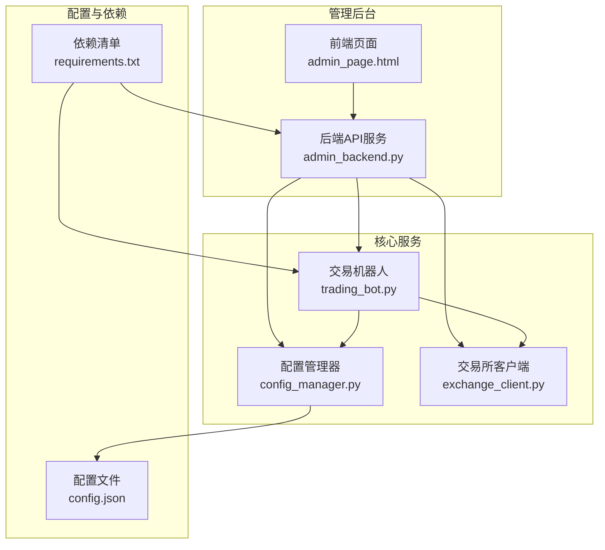
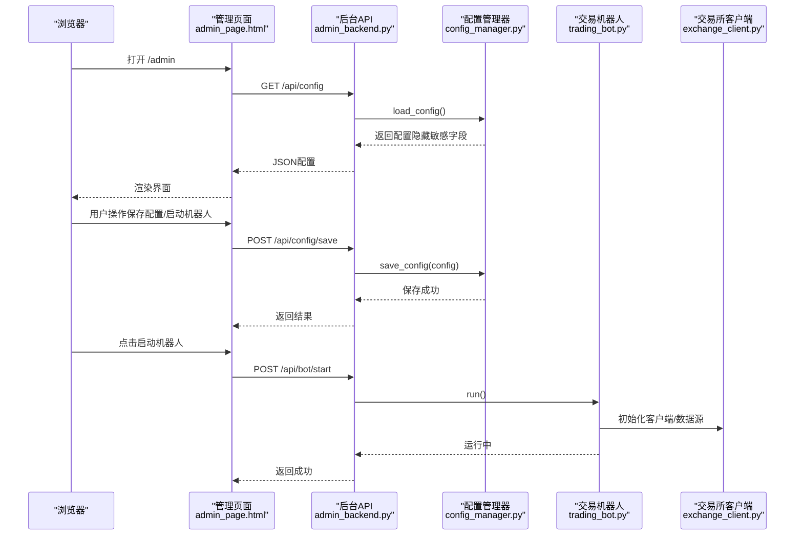
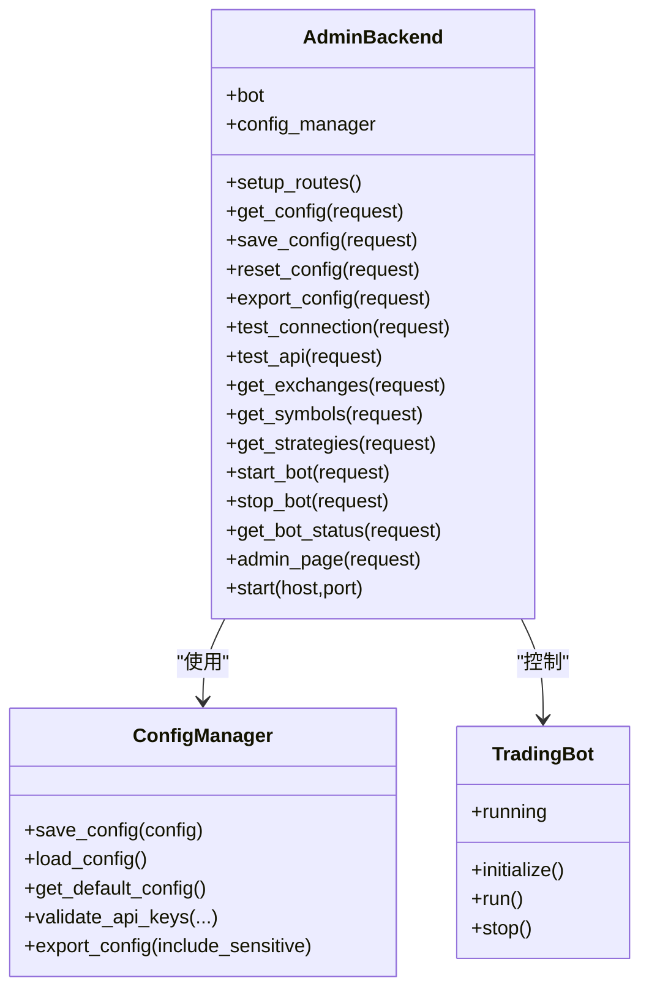
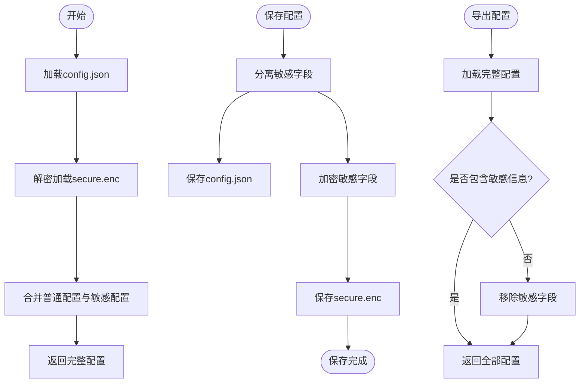
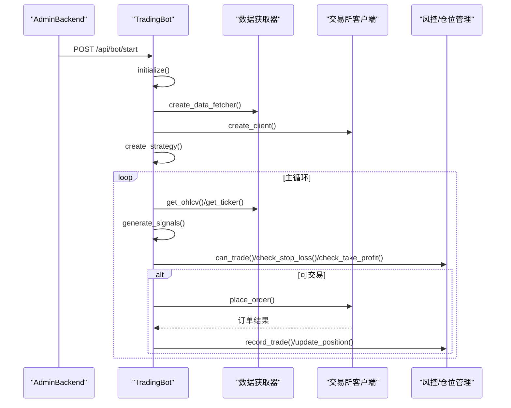
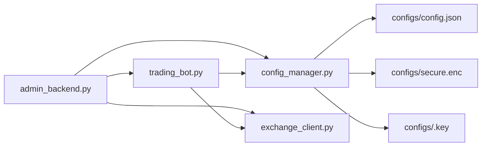

# 管理后台

<cite>
**本文引用的文件**
- [src/ui/admin_backend.py](file://src/ui/admin_backend.py)
- [src/ui/admin_page.html](file://src/ui/admin_page.html)
- [start_admin.py](file://start_admin.py)
- [start_admin_debug.py](file://start_admin_debug.py)
- [check_admin.py](file://check_admin.py)
- [src/utils/config_manager.py](file://src/utils/config_manager.py)
- [src/trading_bot.py](file://src/trading_bot.py)
- [src/utils/risk_manager.py](file://src/utils/risk_manager.py)
- [src/execution/exchange_client.py](file://src/execution/exchange_client.py)
- [configs/config.json](file://configs/config.json)
- [requirements.txt](file://requirements.txt)
- [docs/ADMIN_GUIDE.md](file://docs/ADMIN_GUIDE.md)
</cite>

## 目录
1. [简介](#简介)
2. [项目结构](#项目结构)
3. [核心组件](#核心组件)
4. [架构总览](#架构总览)
5. [详细组件分析](#详细组件分析)
6. [依赖关系分析](#依赖关系分析)
7. [性能考量](#性能考量)
8. [故障排查指南](#故障排查指南)
9. [结论](#结论)
10. [附录](#附录)

## 简介
本文件面向量化交易系统的管理后台，系统以Web界面为核心入口，提供配置管理、策略参数配置、风控设置、AI增强功能开关以及交易机器人控制能力。后台采用异步HTTP框架提供REST风格API，前端使用HTML+TailwindCSS构建响应式界面，后端通过配置管理器实现敏感信息加密存储，并与交易机器人和交易所客户端进行集成，实现配置同步、状态查询与远程控制。

## 项目结构
管理后台主要由以下模块组成：
- 后端API服务：提供配置读写、连接测试、策略信息、机器人控制等接口
- 前端管理页面：基于HTML/TailwindCSS的响应式界面，包含仪表盘、API配置、策略管理、风控中心、AI增强、系统设置等标签页
- 配置管理器：负责配置文件的本地加密存储、读取与导出
- 交易机器人：承载策略执行、风控与下单逻辑
- 交易所客户端：封装Binance/OKX等交易所的API访问
- 启动脚本：提供快速启动、调试启动与状态检查

图表来源
- [src/ui/admin_backend.py](file://src/ui/admin_backend.py#L20-L56)
- [src/ui/admin_page.html](file://src/ui/admin_page.html#L1-L790)
- [src/utils/config_manager.py](file://src/utils/config_manager.py#L14-L30)
- [src/trading_bot.py](file://src/trading_bot.py#L27-L63)
- [src/execution/exchange_client.py](file://src/execution/exchange_client.py#L20-L85)
- [configs/config.json](file://configs/config.json#L1-L28)
- [requirements.txt](file://requirements.txt#L1-L92)

章节来源
- [src/ui/admin_backend.py](file://src/ui/admin_backend.py#L1-L447)
- [src/ui/admin_page.html](file://src/ui/admin_page.html#L1-L790)
- [src/utils/config_manager.py](file://src/utils/config_manager.py#L1-L212)
- [src/trading_bot.py](file://src/trading_bot.py#L1-L346)
- [src/execution/exchange_client.py](file://src/execution/exchange_client.py#L1-L432)
- [configs/config.json](file://configs/config.json#L1-L28)
- [requirements.txt](file://requirements.txt#L1-L92)

## 核心组件
- 后端API服务（AdminBackend）
  - 路由：配置管理、API测试、交易所信息、策略信息、机器人控制、静态页面
  - 功能：加载/保存/重置/导出配置；测试连接与API可用性；获取交易所与策略列表；启动/停止/查询机器人状态
- 配置管理器（ConfigManager）
  - 负责配置文件的本地加密存储，分离敏感字段（如API Key/Secret Key/Passphrase），并提供默认配置、导出与校验
- 交易机器人（TradingBot）
  - 初始化数据源、客户端与策略，主循环抓取数据、分析信号、风控检查与下单执行
- 交易所客户端（ExchangeClient/BinanceClient/OKXClient）
  - 提供统一的异步接口，封装签名、请求与错误处理，支持行情查询、账户信息、下单与杠杆设置
- 前端管理页面（admin_page.html）
  - 响应式布局，包含仪表盘、API配置、策略管理、风控中心、AI增强、系统设置等标签页，内置通知与状态轮询

章节来源
- [src/ui/admin_backend.py](file://src/ui/admin_backend.py#L20-L56)
- [src/utils/config_manager.py](file://src/utils/config_manager.py#L48-L144)
- [src/trading_bot.py](file://src/trading_bot.py#L27-L91)
- [src/execution/exchange_client.py](file://src/execution/exchange_client.py#L20-L85)
- [src/ui/admin_page.html](file://src/ui/admin_page.html#L1-L790)

## 架构总览
管理后台采用前后端分离的架构：前端通过AJAX调用后端API，后端通过配置管理器持久化配置，与交易机器人和交易所客户端进行交互。安全方面，敏感信息采用对称加密存储，文件权限严格控制。

图表来源
- [src/ui/admin_backend.py](file://src/ui/admin_backend.py#L57-L136)
- [src/ui/admin_backend.py](file://src/ui/admin_backend.py#L323-L376)
- [src/utils/config_manager.py](file://src/utils/config_manager.py#L48-L101)
- [src/trading_bot.py](file://src/trading_bot.py#L63-L91)
- [src/execution/exchange_client.py](file://src/execution/exchange_client.py#L20-L85)

## 详细组件分析

### 后端API服务（AdminBackend）
- 路由与职责
  - 配置管理：GET /api/config、POST /api/config/save、POST /api/config/reset、GET /api/config/export
  - API测试：POST /api/test/connection、POST /api/test/api
  - 交易所与策略：GET /api/exchanges、GET /api/symbols、GET /api/strategies
  - 机器人控制：POST /api/bot/start、POST /api/bot/stop、GET /api/bot/status
  - 静态页面：GET /admin、GET /
- 安全与数据处理
  - 配置返回时隐藏敏感字段（如API Key/Secret Key）
  - 保存配置前进行必要字段校验
  - 连接测试时先校验API密钥格式，再尝试连接并获取账户信息
- 机器人集成
  - 启动/停止/查询机器人状态，状态查询包含运行状态、交易所与策略名称

图表来源
- [src/ui/admin_backend.py](file://src/ui/admin_backend.py#L20-L56)
- [src/utils/config_manager.py](file://src/utils/config_manager.py#L48-L144)
- [src/trading_bot.py](file://src/trading_bot.py#L27-L63)

章节来源
- [src/ui/admin_backend.py](file://src/ui/admin_backend.py#L20-L447)

### 配置管理器（ConfigManager）
- 加密存储
  - 普通配置保存至config.json，敏感字段（API Key/Secret Key/Passphrase）加密保存至secure.enc
  - 加密密钥存储于.key文件，权限设为仅所有者可读写
- 默认配置
  - 提供默认策略、风控、AI增强等参数，便于首次使用
- 导出与校验
  - 支持导出配置（可选是否包含敏感信息）
  - 校验API密钥格式（长度与非空）

图表来源
- [src/utils/config_manager.py](file://src/utils/config_manager.py#L48-L194)

章节来源
- [src/utils/config_manager.py](file://src/utils/config_manager.py#L1-L212)
- [configs/config.json](file://configs/config.json#L1-L28)

### 交易机器人（TradingBot）
- 初始化
  - 校验配置，创建数据获取器与交易所客户端，初始化策略与风控/仓位管理器
- 主循环
  - 并行获取OHLCV与Ticker，生成信号，检查仓位与风控，执行下单与平仓
- 风控
  - 止损/止盈/追踪止损、熔断机制、单日限额、连败限制
- 机器人控制
  - 启动/停止，状态查询（运行中/未运行、交易所、策略）

图表来源
- [src/trading_bot.py](file://src/trading_bot.py#L63-L282)
- [src/utils/risk_manager.py](file://src/utils/risk_manager.py#L12-L241)
- [src/execution/exchange_client.py](file://src/execution/exchange_client.py#L20-L85)

章节来源
- [src/trading_bot.py](file://src/trading_bot.py#L1-L346)
- [src/utils/risk_manager.py](file://src/utils/risk_manager.py#L1-L388)

### 交易所客户端（ExchangeClient/BinanceClient/OKXClient）
- 统一接口
  - 行情：get_ticker/get_orderbook/get_exchange_info
  - 交易：get_balance/get_position/place_order/cancel_order/get_orders/set_leverage/set_margin_type
- Binance客户端
  - 支持测试网与主网，签名与错误处理，动态精度处理与杠杆设置
- OKX客户端
  - 提供基础接口占位，部分功能待实现

章节来源
- [src/execution/exchange_client.py](file://src/execution/exchange_client.py#L20-L432)

### 前端管理页面（admin_page.html）
- 响应式布局
  - 使用TailwindCSS与自定义样式，深色主题，玻璃面板效果
- 标签页
  - 仪表盘、API配置、策略管理、风控中心、AI增强、系统设置
- 交互
  - Tab切换、通知Toast、状态轮询、表单验证与保存
- 安全提示
  - API密钥输入框为密码类型，连接测试前校验密钥格式

章节来源
- [src/ui/admin_page.html](file://src/ui/admin_page.html#L1-L790)

## 依赖关系分析
- 后端依赖
  - aiohttp/websockets：异步HTTP服务
  - cryptography：对称加密（Fernet）
  - ccxt/python-binance/okx：交易所接口
  - fastapi/uvicorn：计划中的API框架升级
- 前端依赖
  - TailwindCSS CDN：样式框架
  - Inter字体：排版
- 配置与运行
  - 配置文件位于configs/，包含config.json、secure.enc与.key
  - 启动脚本支持多端口探测与调试输出

图表来源
- [src/ui/admin_backend.py](file://src/ui/admin_backend.py#L16-L27)
- [src/utils/config_manager.py](file://src/utils/config_manager.py#L17-L30)
- [src/trading_bot.py](file://src/trading_bot.py#L14-L22)
- [src/execution/exchange_client.py](file://src/execution/exchange_client.py#L20-L85)
- [configs/config.json](file://configs/config.json#L1-L28)

章节来源
- [requirements.txt](file://requirements.txt#L1-L92)
- [configs/config.json](file://configs/config.json#L1-L28)

## 性能考量
- 异步并发
  - 后端API与交易机器人均采用异步IO，提升并发处理能力
- 数据获取
  - 交易机器人并行获取OHLCV与Ticker，减少等待时间
- 加密与文件I/O
  - 配置管理器分离敏感与普通配置，降低I/O开销
- 前端渲染
  - 使用轻量级JS与AJAX，避免频繁页面刷新

## 故障排查指南
- 后台服务启动
  - 使用启动脚本自动探测可用端口，若端口占用则尝试下一个
  - 调试脚本提供详细的导入与启动过程日志
  - 状态检查脚本可检测多个端口是否被占用
- API连接测试
  - 前端在点击“验证连接”前会校验API Key/Secret Key是否为空
  - 后端先校验密钥格式，再尝试连接并获取账户信息
- 配置保存
  - 后端对必要字段进行校验，保存失败时返回错误信息
  - 配置导出时可选择是否包含敏感信息
- 机器人控制
  - 启动/停止前检查机器人实例是否存在与运行状态
  - 状态查询包含运行状态、交易所与策略名称，便于定位问题

章节来源
- [start_admin.py](file://start_admin.py#L44-L74)
- [start_admin_debug.py](file://start_admin_debug.py#L57-L88)
- [check_admin.py](file://check_admin.py#L9-L36)
- [src/ui/admin_backend.py](file://src/ui/admin_backend.py#L159-L244)
- [src/ui/admin_backend.py](file://src/ui/admin_backend.py#L323-L396)

## 结论
管理后台通过清晰的前后端分工、完善的配置加密存储与严格的风控机制，提供了安全、易用且可扩展的量化交易系统管理能力。其REST API与响应式前端界面使得用户能够高效地完成策略配置、风控设置与机器人控制，同时具备良好的可维护性与安全性。

## 附录

### 后台API接口一览
- 配置管理
  - GET /api/config：获取当前配置（隐藏敏感字段）
  - POST /api/config/save：保存配置（含字段校验）
  - POST /api/config/reset：重置为默认配置
  - GET /api/config/export：导出配置（可选包含敏感信息）
- API测试
  - POST /api/test/connection：测试交易所连接（含密钥校验）
  - POST /api/test/api：测试API可用性（公开接口）
- 交易所与策略
  - GET /api/exchanges：支持的交易所列表
  - GET /api/symbols：交易对列表
  - GET /api/strategies：可用策略列表
- 机器人控制
  - POST /api/bot/start：启动交易机器人
  - POST /api/bot/stop：停止交易机器人
  - GET /api/bot/status：查询机器人状态

章节来源
- [src/ui/admin_backend.py](file://src/ui/admin_backend.py#L29-L56)

### 部署与配置指南
- 环境准备
  - 安装依赖：pip install -r requirements.txt
  - Python版本：3.8+
- 启动后台
  - 快速启动：python start_admin.py
  - 调试启动：python start_admin_debug.py
  - 状态检查：python check_admin.py
- 访问管理界面
  - 默认访问地址：http://127.0.0.1:8080/admin
- 配置文件位置
  - configs/config.json：普通配置
  - configs/secure.enc：加密的敏感配置
  - configs/.key：加密密钥（自动生成，权限600）

章节来源
- [docs/ADMIN_GUIDE.md](file://docs/ADMIN_GUIDE.md#L15-L24)
- [start_admin.py](file://start_admin.py#L16-L80)
- [start_admin_debug.py](file://start_admin_debug.py#L25-L92)
- [check_admin.py](file://check_admin.py#L17-L36)
- [configs/config.json](file://configs/config.json#L1-L28)

### 安全管理机制
- 加密存储
  - API密钥使用对称加密（Fernet）存储，密钥文件权限设为600
  - 敏感字段与普通配置分离存储，导出时可选是否包含敏感信息
- 访问控制
  - 本地监听（默认127.0.0.1），可通过修改host参数暴露到外网（需谨慎）
- 会话管理
  - 后端无会话状态，纯REST接口，建议结合反向代理与TLS保护
- 数据加密
  - 配置文件与密钥文件采用对称加密，确保离线安全

章节来源
- [src/utils/config_manager.py](file://src/utils/config_manager.py#L31-L46)
- [src/utils/config_manager.py](file://src/utils/config_manager.py#L74-L80)
- [src/ui/admin_backend.py](file://src/ui/admin_backend.py#L64-L69)

### 常见管理任务与最佳实践
- 首次使用
  - 配置API：填写交易所API密钥，开启测试网模式，验证连接
  - 配置策略：选择策略、设置参数、交易对与时间周期
  - 设置风控：止损/止盈/每日最大亏损，单笔仓位不超过10%
  - 保存配置：在系统设置页面保存并确认
  - 启动测试：在测试网运行至少1周，观察表现并优化参数
  - 实盘运行：关闭测试网，填写实盘密钥，从小资金开始
- 日常使用
  - 登录后台查看机器人状态
  - 检查交易表现，按需调整参数
  - 定期导出配置备份
- 风险提示
  - 高杠杆高风险，建议杠杆不超过10倍
  - 先测试后实盘，AI并非万能
  - 持续监控，及时调整策略参数

章节来源
- [docs/ADMIN_GUIDE.md](file://docs/ADMIN_GUIDE.md#L183-L247)