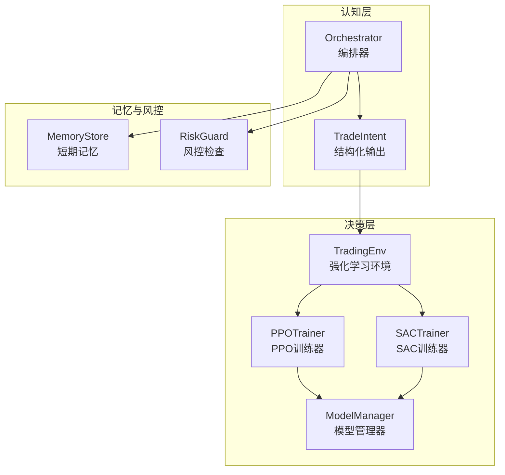
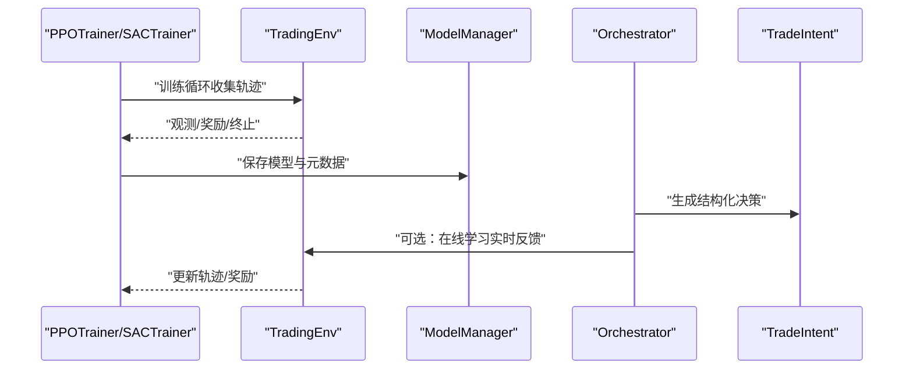
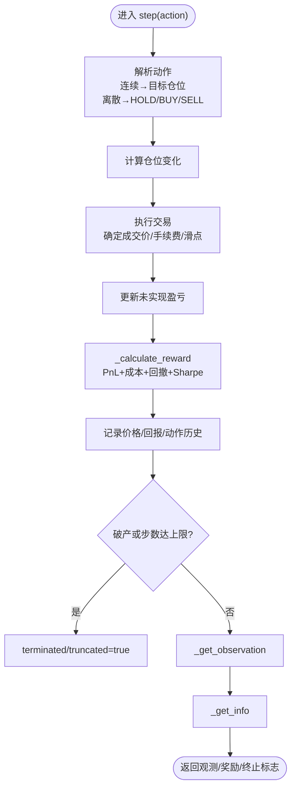
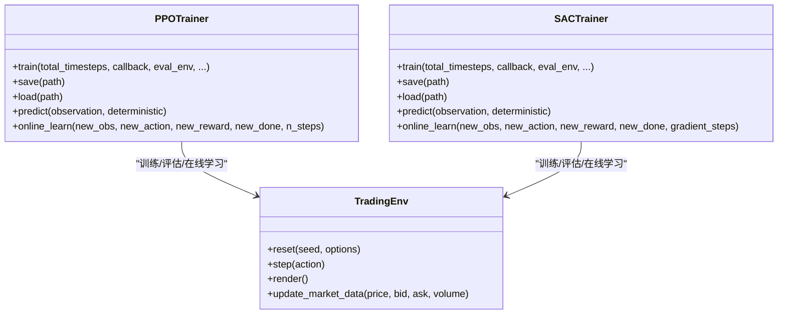
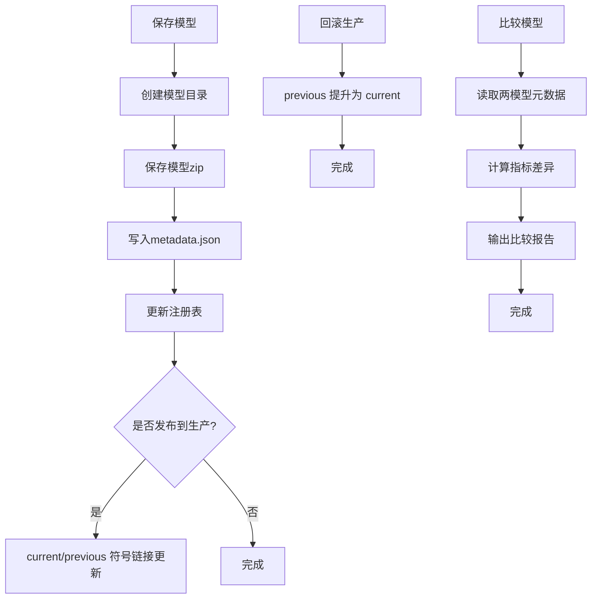
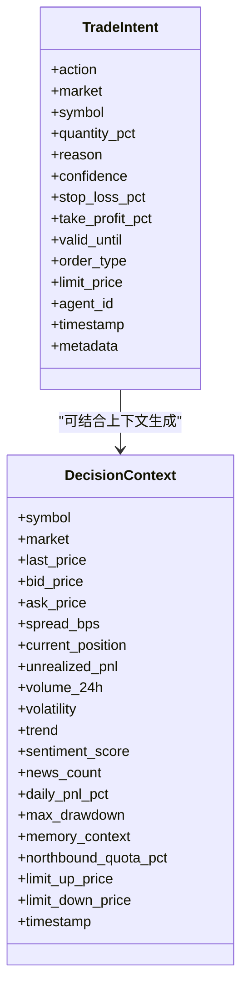
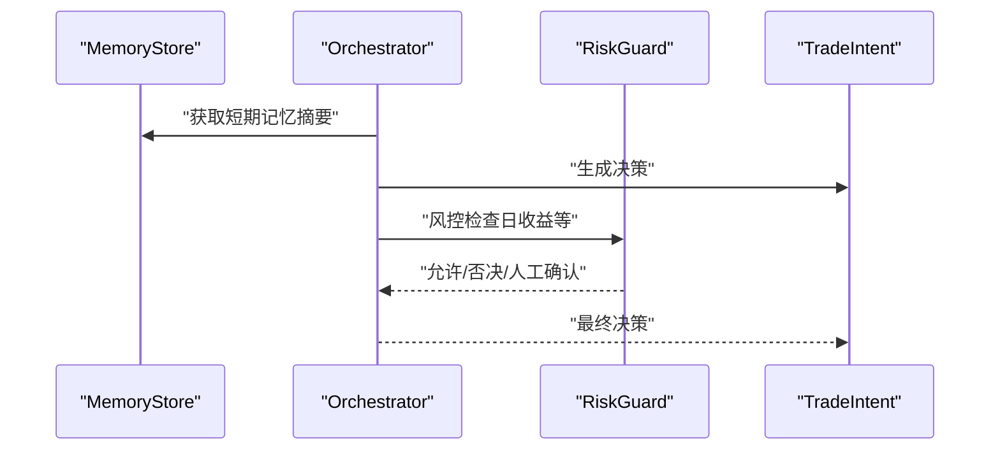

# 决策层

<cite>
**本文引用的文件**
- [rl_env.py](file://src/aetherlife/decision/rl_env.py)
- [ppo_agent.py](file://src/aetherlife/decision/ppo_agent.py)
- [model_manager.py](file://src/aetherlife/decision/model_manager.py)
- [schemas.py](file://src/aetherlife/cognition/schemas.py)
- [store.py](file://src/aetherlife/memory/store.py)
- [orchestrator.py](file://src/aetherlife/cognition/orchestrator.py)
- [run.py](file://src/aetherlife/run.py)
- [config.json](file://configs/config.json)
</cite>

## 目录
1. [引言](#引言)
2. [项目结构](#项目结构)
3. [核心组件](#核心组件)
4. [架构总览](#架构总览)
5. [组件详解](#组件详解)
6. [依赖关系分析](#依赖关系分析)
7. [性能与调参与优化](#性能与调参与优化)
8. [故障排查指南](#故障排查指南)
9. [结论](#结论)
10. [附录](#附录)

## 引言
本文件面向量化交易系统的“决策层”，聚焦于基于强化学习的决策机制，包括：
- PPO/SAC智能体的训练与在线学习
- RLEnv强化学习环境的构建与奖励函数设计
- ModelManager模型管理器的版本控制、A/B测试与自动回滚
- 策略空间定义、动作选择算法、价值函数估计与收敛性保障
- 强化学习调参与性能优化最佳实践

同时，结合认知层的TradeIntent结构化输出与记忆存储，形成从感知、认知、决策到风控与执行的闭环。

## 项目结构
决策层位于 aetherlife/decision 目录，核心文件如下：
- 强化学习环境：rl_env.py
- 智能体训练器：ppo_agent.py（含PPO与SAC训练器）
- 模型管理器：model_manager.py
- 认知层结构化输出：cognition/schemas.py
- 记忆存储：memory/store.py
- 认知层编排器：cognition/orchestrator.py
- 系统入口与配置：run.py、configs/config.json



图示来源
- [rl_env.py](file://src/aetherlife/decision/rl_env.py#L26-L118)
- [ppo_agent.py](file://src/aetherlife/decision/ppo_agent.py#L66-L142)
- [model_manager.py](file://src/aetherlife/decision/model_manager.py#L67-L102)
- [schemas.py](file://src/aetherlife/cognition/schemas.py#L32-L62)
- [store.py](file://src/aetherlife/memory/store.py#L43-L90)
- [orchestrator.py](file://src/aetherlife/cognition/orchestrator.py#L16-L53)

章节来源
- [rl_env.py](file://src/aetherlife/decision/rl_env.py#L1-L118)
- [ppo_agent.py](file://src/aetherlife/decision/ppo_agent.py#L1-L89)
- [model_manager.py](file://src/aetherlife/decision/model_manager.py#L1-L84)
- [schemas.py](file://src/aetherlife/cognition/schemas.py#L1-L62)
- [store.py](file://src/aetherlife/memory/store.py#L1-L50)
- [orchestrator.py](file://src/aetherlife/cognition/orchestrator.py#L1-L37)
- [run.py](file://src/aetherlife/run.py#L32-L71)
- [config.json](file://configs/config.json#L1-L28)

## 核心组件
- 强化学习环境 TradingEnv：定义状态空间、动作空间、交易执行与奖励函数，支持连续与离散动作。
- PPOTrainer/SACTrainer：封装稳定基线PPO与SAC训练流程，支持回调、评估、在线学习。
- ModelManager：模型版本管理、注册表、生产发布与回滚、A/B比较。
- 认知层结构化输出 TradeIntent：统一动作、市场、数量、理由、置信度等字段。
- MemoryStore：短期记忆与审计数据，支撑风控与反思。
- Orchestrator：多Agent聚合或辩论式决策，最终经风控检查。

章节来源
- [rl_env.py](file://src/aetherlife/decision/rl_env.py#L26-L118)
- [ppo_agent.py](file://src/aetherlife/decision/ppo_agent.py#L66-L142)
- [model_manager.py](file://src/aetherlife/decision/model_manager.py#L67-L102)
- [schemas.py](file://src/aetherlife/cognition/schemas.py#L32-L62)
- [store.py](file://src/aetherlife/memory/store.py#L43-L90)
- [orchestrator.py](file://src/aetherlife/cognition/orchestrator.py#L16-L53)

## 架构总览
强化学习决策在“离线训练—在线学习—生产部署”的闭环中运行。训练阶段使用TradingEnv构造的交易仿真环境，PPO/SAC进行策略优化；训练完成后通过ModelManager进行版本化管理与生产发布；运行时，Orchestrator产出TradeIntent，其中可融合强化学习决策（通过RL决策字段），再经风控与执行。



图示来源
- [ppo_agent.py](file://src/aetherlife/decision/ppo_agent.py#L143-L202)
- [rl_env.py](file://src/aetherlife/decision/rl_env.py#L157-L223)
- [model_manager.py](file://src/aetherlife/decision/model_manager.py#L115-L168)
- [orchestrator.py](file://src/aetherlife/cognition/orchestrator.py#L38-L53)

## 组件详解

### 强化学习环境：TradingEnv
- 状态空间：价格、成交量、买卖价差、持仓、未实现盈亏、历史回报、技术指标等，共20维向量。
- 动作空间：连续[-1,1]表示目标仓位，或离散HOLD/BUY/SELL。
- 交易执行：依据bid/ask与滑点、手续费动态更新余额、持仓与入场价，支持同向加仓与反向/平仓。
- 奖励函数：基础PnL变化、交易成本惩罚、回撤惩罚、Sharpe Ratio奖励（需足够历史）。
- 观察构建：对价格、成交量、价差、回报序列与技术指标进行归一化处理。
- 终止条件：破产或达到最大步数。



图示来源
- [rl_env.py](file://src/aetherlife/decision/rl_env.py#L157-L223)
- [rl_env.py](file://src/aetherlife/decision/rl_env.py#L225-L274)
- [rl_env.py](file://src/aetherlife/decision/rl_env.py#L276-L312)
- [rl_env.py](file://src/aetherlife/decision/rl_env.py#L314-L374)

章节来源
- [rl_env.py](file://src/aetherlife/decision/rl_env.py#L26-L118)
- [rl_env.py](file://src/aetherlife/decision/rl_env.py#L157-L223)
- [rl_env.py](file://src/aetherlife/decision/rl_env.py#L225-L312)
- [rl_env.py](file://src/aetherlife/decision/rl_env.py#L314-L374)

### 智能体训练器：PPOTrainer 与 SACTrainer
- PPOTrainer：基于stable-baselines3的PPO，支持自定义策略网络、熵正则、裁剪范围、价值函数系数、梯度裁剪、TensorBoard日志与评估回调。
- SACTrainer：基于SAC，具备Replay Buffer与在线学习能力，适合连续动作空间与高频在线微调。
- 在线学习：PPO采用短步数微调；SAC利用Replay Buffer进行梯度更新。
- 并行环境：提供向量化环境工厂，支持多进程加速训练。



图示来源
- [ppo_agent.py](file://src/aetherlife/decision/ppo_agent.py#L66-L202)
- [ppo_agent.py](file://src/aetherlife/decision/ppo_agent.py#L252-L406)
- [rl_env.py](file://src/aetherlife/decision/rl_env.py#L119-L156)

章节来源
- [ppo_agent.py](file://src/aetherlife/decision/ppo_agent.py#L66-L202)
- [ppo_agent.py](file://src/aetherlife/decision/ppo_agent.py#L252-L406)

### 模型管理器：ModelManager
- 版本管理：以算法+版本+时间戳命名模型目录，保存zip模型、元数据与性能指标。
- 注册表：记录模型ID、算法、版本、训练步数、性能指标、超参与描述。
- 生产发布：通过符号链接维护current与previous，支持一键回滚。
- A/B比较：读取两模型元数据，对比关键指标差异。
- 清理：支持删除模型并同步注册表。



图示来源
- [model_manager.py](file://src/aetherlife/decision/model_manager.py#L115-L168)
- [model_manager.py](file://src/aetherlife/decision/model_manager.py#L292-L348)
- [model_manager.py](file://src/aetherlife/decision/model_manager.py#L350-L392)

章节来源
- [model_manager.py](file://src/aetherlife/decision/model_manager.py#L67-L102)
- [model_manager.py](file://src/aetherlife/decision/model_manager.py#L115-L168)
- [model_manager.py](file://src/aetherlife/decision/model_manager.py#L292-L348)
- [model_manager.py](file://src/aetherlife/decision/model_manager.py#L350-L392)

### 结构化输出：TradeIntent 与决策上下文
- TradeIntent：统一动作（HOLD/BUY/SELL/CLOSE）、市场、标的、数量占比、理由、置信度、风控止盈止损、有效期、订单类型与限价、元数据与时间戳。
- 决策上下文：包含市场快照、订单簿、持仓、波动率、趋势、情绪、风控状态、记忆上下文等。
- 与强化学习的衔接：可在最终决策中嵌入强化学习决策（rl_decision字段），并与风控检查结合。



图示来源
- [schemas.py](file://src/aetherlife/cognition/schemas.py#L32-L62)
- [schemas.py](file://src/aetherlife/cognition/schemas.py#L84-L124)

章节来源
- [schemas.py](file://src/aetherlife/cognition/schemas.py#L32-L62)
- [schemas.py](file://src/aetherlife/cognition/schemas.py#L84-L124)

### 记忆存储与风控
- MemoryStore：短期事件队列（交易事件、决策记录、短期记忆摘要），可选Redis持久化；提供日收益汇总与上下文摘要。
- Orchestrator：多Agent并行或辩论（Bull/Bear/Judge）聚合，结合RiskGuard进行风控否决与人工介入提示。



图示来源
- [store.py](file://src/aetherlife/memory/store.py#L128-L145)
- [orchestrator.py](file://src/aetherlife/cognition/orchestrator.py#L38-L53)

章节来源
- [store.py](file://src/aetherlife/memory/store.py#L43-L90)
- [store.py](file://src/aetherlife/memory/store.py#L128-L145)
- [orchestrator.py](file://src/aetherlife/cognition/orchestrator.py#L16-L53)

## 依赖关系分析
- 训练器依赖环境：PPOTrainer/SACTrainer均依赖TradingEnv进行交互。
- 模型管理器依赖训练器：保存模型时抽取超参与性能指标。
- 编排器依赖结构化输出：TradeIntent作为统一决策载体。
- 记忆存储为风控与反思提供数据基础。

```mermaid
graph LR
Env["TradingEnv"] <- --> PPO["PPOTrainer"]
Env <- --> SAC["SACTrainer"]
PPO --> MM["ModelManager"]
SAC --> MM
ORCH["Orchestrator"] --> SCHEMA["TradeIntent"]
ORCH --> MEM["MemoryStore"]
```

图示来源
- [ppo_agent.py](file://src/aetherlife/decision/ppo_agent.py#L21-L21)
- [rl_env.py](file://src/aetherlife/decision/rl_env.py#L20-L21)
- [model_manager.py](file://src/aetherlife/decision/model_manager.py#L20-L21)
- [orchestrator.py](file://src/aetherlife/cognition/orchestrator.py#L9-L13)
- [schemas.py](file://src/aetherlife/cognition/schemas.py#L32-L62)
- [store.py](file://src/aetherlife/memory/store.py#L43-L90)

章节来源
- [ppo_agent.py](file://src/aetherlife/decision/ppo_agent.py#L21-L21)
- [rl_env.py](file://src/aetherlife/decision/rl_env.py#L20-L21)
- [model_manager.py](file://src/aetherlife/decision/model_manager.py#L20-L21)
- [orchestrator.py](file://src/aetherlife/cognition/orchestrator.py#L9-L13)
- [schemas.py](file://src/aetherlife/cognition/schemas.py#L32-L62)
- [store.py](file://src/aetherlife/memory/store.py#L43-L90)

## 性能与调参与优化
- 状态空间设计
  - 使用价格、成交量、买卖价差、持仓、未实现盈亏、回报序列与技术指标，建议对价格与成交量做归一化，避免量纲差异影响收敛。
  - 技术指标（如RSI）建议使用滑动窗口与标准化，确保跨周期稳定性。
- 动作空间
  - 连续动作（[-1,1]）便于策略直接输出目标仓位；离散动作（HOLD/BUY/SELL）适合快速验证与解释性。
  - 建议在连续动作下加入目标仓位与当前仓位的约束，防止过度换手。
- 奖励函数
  - 基础PnL变化与交易成本惩罚是核心；回撤惩罚与Sharpe奖励有助于长期稳健性。
  - 建议对奖励幅度进行缩放，避免过大导致训练不稳定。
- 训练超参
  - PPO：学习率、裁剪范围、价值函数系数、熵正则、批量大小与更新步数需协同调优；优先保证策略探索与稳定性平衡。
  - SAC：Replay Buffer容量、批次大小、软更新系数、熵系数（可自动）对在线学习效果影响显著。
- 在线学习
  - PPO采用短步数微调；SAC可利用Replay Buffer进行高效梯度更新。
  - 建议对在线学习频率与步数进行限速，避免过拟合。
- 并行与效率
  - 使用向量化环境加速训练；GPU可用时优先使用CUDA。
  - 训练回调记录关键指标（回报、夏普比率、最大回撤），便于监控收敛。
- 模型管理
  - 严格的版本命名与元数据记录，确保A/B测试与回滚可追溯。
  - 生产发布采用符号链接，降低切换风险。

章节来源
- [rl_env.py](file://src/aetherlife/decision/rl_env.py#L314-L374)
- [rl_env.py](file://src/aetherlife/decision/rl_env.py#L276-L312)
- [ppo_agent.py](file://src/aetherlife/decision/ppo_agent.py#L66-L142)
- [ppo_agent.py](file://src/aetherlife/decision/ppo_agent.py#L252-L406)
- [model_manager.py](file://src/aetherlife/decision/model_manager.py#L115-L168)

## 故障排查指南
- 环境安装
  - 若缺少gymnasium，初始化TradingEnv会抛出导入异常；请安装对应依赖。
- 训练中断与恢复
  - 使用EvalCallback与TensorBoard日志定位收敛问题；若回报停滞，检查学习率与裁剪范围。
- 在线学习无效
  - PPO微调步数过少或SAC未正确触发梯度更新；确认online_learn调用参数与环境状态。
- 生产回滚
  - 若无previous模型，回滚会报错；先确保promote_to_production已执行。
- 记忆与风控
  - 若风控否决过多，检查MemoryStore中的日收益与最大回撤统计，适当放宽阈值或调整策略。

章节来源
- [rl_env.py](file://src/aetherlife/decision/rl_env.py#L11-L18)
- [ppo_agent.py](file://src/aetherlife/decision/ppo_agent.py#L175-L186)
- [model_manager.py](file://src/aetherlife/decision/model_manager.py#L322-L339)
- [store.py](file://src/aetherlife/memory/store.py#L140-L145)

## 结论
本决策层以TradingEnv为载体，结合PPO/SAC训练器与ModelManager，实现了从离线训练到在线学习再到生产发布的完整闭环。通过结构化输出TradeIntent与风控编排，系统在追求收益的同时兼顾稳健性与可审计性。建议持续完善奖励函数与状态特征，加强A/B测试与回滚机制，并在生产环境中引入更细粒度的监控与告警。

## 附录
- 系统入口与配置
  - 入口脚本加载配置并启动生命周期循环；配置文件包含交易所、标的、时间框架、策略参数与风控阈值。
- 运行建议
  - 先离线训练，再在线微调；定期评估与回滚；严格记录元数据与性能指标。

章节来源
- [run.py](file://src/aetherlife/run.py#L32-L71)
- [config.json](file://configs/config.json#L1-L28)