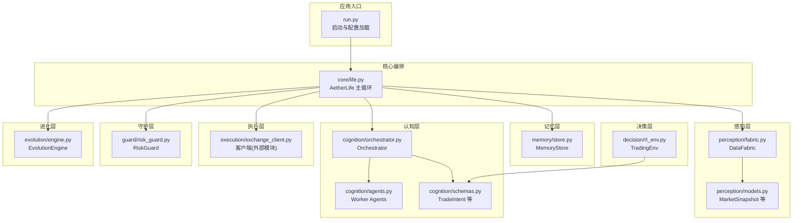
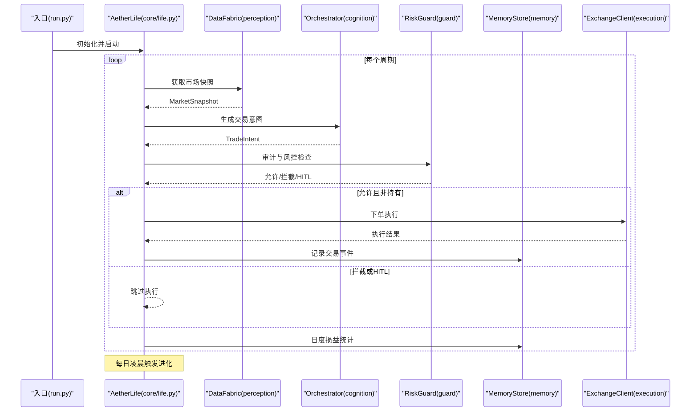
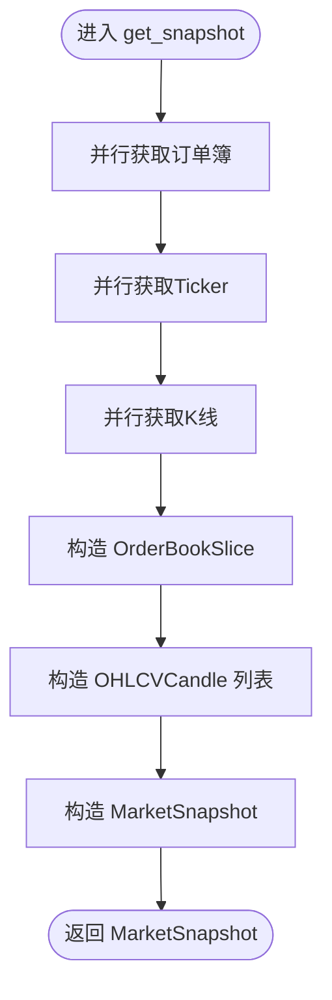
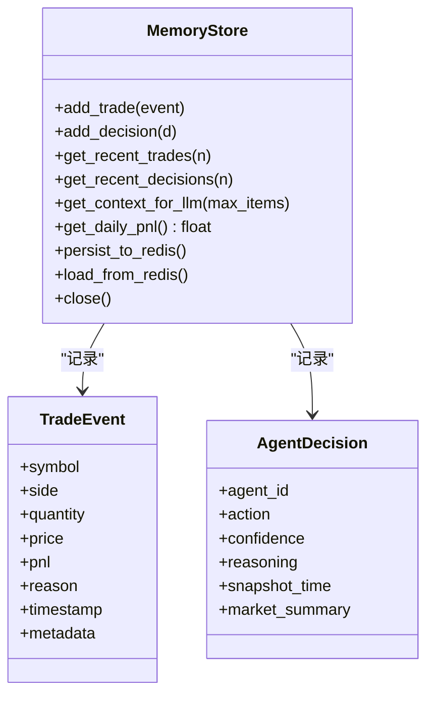
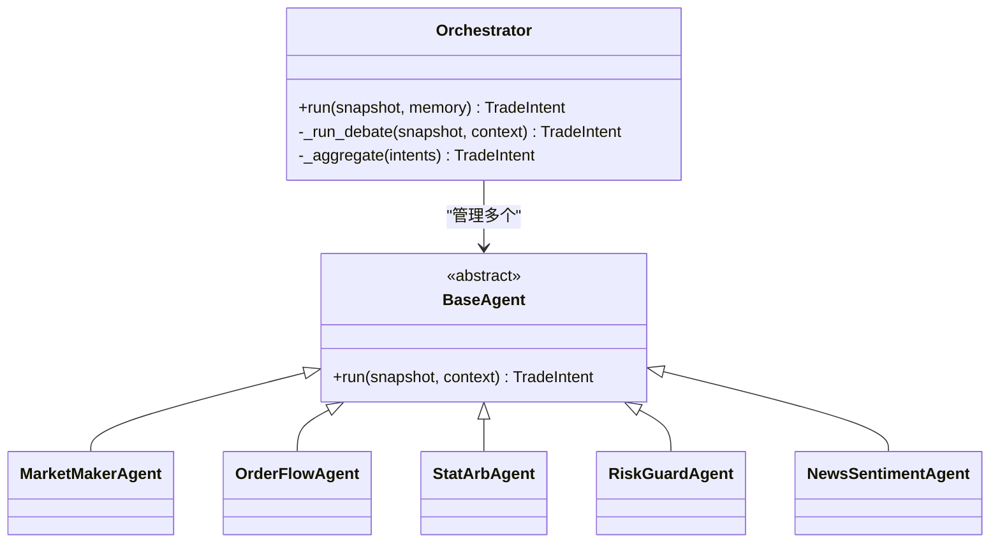
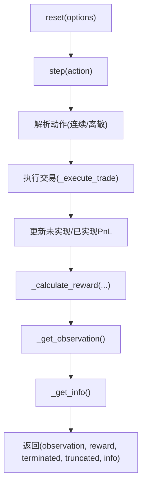
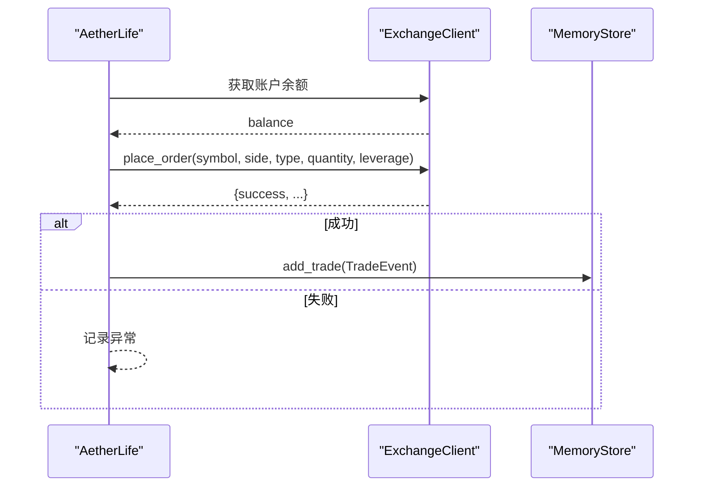
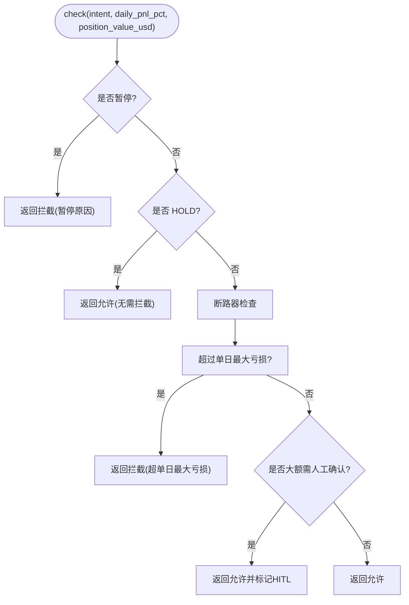
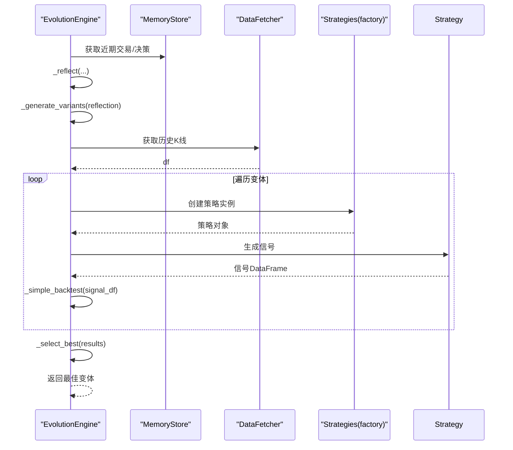
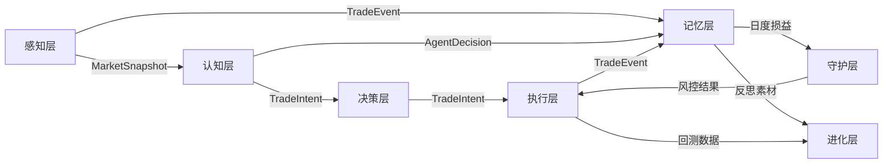

# 分层架构详解

<cite>
**本文档引用的文件**
- [src/aetherlife/__init__.py](file://src/aetherlife/__init__.py)
- [src/aetherlife/run.py](file://src/aetherlife/run.py)
- [src/aetherlife/config.py](file://src/aetherlife/config.py)
- [src/aetherlife/core/life.py](file://src/aetherlife/core/life.py)
- [src/aetherlife/perception/fabric.py](file://src/aetherlife/perception/fabric.py)
- [src/aetherlife/perception/models.py](file://src/aetherlife/perception/models.py)
- [src/aetherlife/memory/store.py](file://src/aetherlife/memory/store.py)
- [src/aetherlife/cognition/orchestrator.py](file://src/aetherlife/cognition/orchestrator.py)
- [src/aetherlife/cognition/agents.py](file://src/aetherlife/cognition/agents.py)
- [src/aetherlife/cognition/schemas.py](file://src/aetherlife/cognition/schemas.py)
- [src/aetherlife/decision/rl_env.py](file://src/aetherlife/decision/rl_env.py)
- [src/aetherlife/guard/risk_guard.py](file://src/aetherlife/guard/risk_guard.py)
- [src/aetherlife/evolution/engine.py](file://src/aetherlife/evolution/engine.py)
</cite>

## 目录
1. [引言](#引言)
2. [项目结构](#项目结构)
3. [核心组件](#核心组件)
4. [架构总览](#架构总览)
5. [详细组件分析](#详细组件分析)
6. [依赖关系分析](#依赖关系分析)
7. [性能考虑](#性能考虑)
8. [故障排除指南](#故障排除指南)
9. [结论](#结论)

## 引言
本文件面向量化交易系统的AetherLife七层架构，逐层解析“感知层→记忆层→认知层(多代理)→决策层→执行层→守护层→进化层”的设计与实现。文档不仅阐述各层职责与数据流，还给出关键流程图与时序图，帮助读者快速理解从市场数据采集到策略自我改进的完整闭环。

## 项目结构
AetherLife采用分层模块化组织，入口脚本负责加载配置并启动主循环；核心生命周期在主类中编排各层协作；感知层抽象多交易所数据；记忆层提供短期与可选Redis持久化；认知层以多代理协同与可选辩论机制形成智能分析；决策层支持结构化输出与强化学习；执行层对接交易客户端；守护层提供风控与审计；进化层每日反思、生成变体并回测择优。

图表来源
- [src/aetherlife/run.py](file://src/aetherlife/run.py#L52-L71)
- [src/aetherlife/core/life.py](file://src/aetherlife/core/life.py#L59-L164)
- [src/aetherlife/perception/fabric.py](file://src/aetherlife/perception/fabric.py#L13-L88)
- [src/aetherlife/perception/models.py](file://src/aetherlife/perception/models.py#L15-L64)
- [src/aetherlife/memory/store.py](file://src/aetherlife/memory/store.py#L43-L155)
- [src/aetherlife/cognition/orchestrator.py](file://src/aetherlife/cognition/orchestrator.py#L16-L93)
- [src/aetherlife/cognition/agents.py](file://src/aetherlife/cognition/agents.py#L13-L109)
- [src/aetherlife/cognition/schemas.py](file://src/aetherlife/cognition/schemas.py#L32-L219)
- [src/aetherlife/decision/rl_env.py](file://src/aetherlife/decision/rl_env.py#L26-L423)
- [src/aetherlife/guard/risk_guard.py](file://src/aetherlife/guard/risk_guard.py#L23-L84)
- [src/aetherlife/evolution/engine.py](file://src/aetherlife/evolution/engine.py#L17-L145)

章节来源
- [src/aetherlife/run.py](file://src/aetherlife/run.py#L1-L71)
- [src/aetherlife/config.py](file://src/aetherlife/config.py#L1-L131)

## 核心组件
- 全局配置：集中定义感知、记忆、认知、决策、执行、守护、进化各层参数，支持从JSON加载与环境变量覆盖。
- 主循环：AetherLife封装单周期生命周期，依次完成感知、认知/决策、审计、风控、执行，并在每日固定时刻触发进化。
- 数据模型：统一订单簿、K线、市场快照等数据结构，确保跨层一致的数据契约。
- 记忆存储：短期事件队列与可选Redis持久化，提供短期记忆摘要与日度损益统计。
- 多代理协调：Orchestrator负责并行调用Worker Agents或辩论(Bull/Bear/Judge)，再经风控Agent综合裁决。
- 强化学习环境：基于Gymnasium构建的交易环境，支持连续/离散动作空间与多维状态特征。
- 风控与审计：断路器、单日最大回撤、大额人工确认(HITL)与审计日志。
- 进化引擎：反思→生成变体→回测→择优，形成策略自我改进闭环。

章节来源
- [src/aetherlife/config.py](file://src/aetherlife/config.py#L98-L131)
- [src/aetherlife/core/life.py](file://src/aetherlife/core/life.py#L20-L164)
- [src/aetherlife/perception/models.py](file://src/aetherlife/perception/models.py#L15-L64)
- [src/aetherlife/memory/store.py](file://src/aetherlife/memory/store.py#L43-L155)
- [src/aetherlife/cognition/orchestrator.py](file://src/aetherlife/cognition/orchestrator.py#L16-L93)
- [src/aetherlife/decision/rl_env.py](file://src/aetherlife/decision/rl_env.py#L26-L423)
- [src/aetherlife/guard/risk_guard.py](file://src/aetherlife/guard/risk_guard.py#L23-L84)
- [src/aetherlife/evolution/engine.py](file://src/aetherlife/evolution/engine.py#L17-L145)

## 架构总览
AetherLife以“感知→记忆→认知→决策→守护→执行→进化”为主线，形成可扩展的七层架构。入口脚本加载配置并启动主循环；主循环内各层通过明确的数据契约交互，最终实现策略驱动的自动化交易与持续优化。

图表来源
- [src/aetherlife/run.py](file://src/aetherlife/run.py#L52-L71)
- [src/aetherlife/core/life.py](file://src/aetherlife/core/life.py#L59-L164)
- [src/aetherlife/perception/fabric.py](file://src/aetherlife/perception/fabric.py#L32-L82)
- [src/aetherlife/cognition/orchestrator.py](file://src/aetherlife/cognition/orchestrator.py#L38-L53)
- [src/aetherlife/guard/risk_guard.py](file://src/aetherlife/guard/risk_guard.py#L48-L68)
- [src/aetherlife/memory/store.py](file://src/aetherlife/memory/store.py#L140-L145)

## 详细组件分析

### 感知层（Perception）
- 职责：统一多交易所数据源，提供市场快照（订单簿、Ticker、K线），支持轮询与未来WS推送。
- 核心组件：
  - DataFabric：并行抓取订单簿、Ticker、K线，组装为MarketSnapshot。
  - 模型：OrderBookSlice、OHLCVCandle、MarketSnapshot，统一跨交易所数据格式。
- 数据传递：从数据层到感知层，再到认知层的TradeIntent输入上下文。

图表来源
- [src/aetherlife/perception/fabric.py](file://src/aetherlife/perception/fabric.py#L32-L82)
- [src/aetherlife/perception/models.py](file://src/aetherlife/perception/models.py#L15-L64)

章节来源
- [src/aetherlife/perception/fabric.py](file://src/aetherlife/perception/fabric.py#L13-L88)
- [src/aetherlife/perception/models.py](file://src/aetherlife/perception/models.py#L15-L64)

### 记忆层（Memory）
- 职责：短期事件与决策记录、日度损益统计、可选Redis持久化。
- 核心组件：
  - MemoryStore：双端队列维护近期事件，短期上下文列表，支持JSON序列化持久化。
  - TradeEvent、AgentDecision：结构化事件记录，便于审计与反思。
- 数据传递：为认知层提供短期记忆摘要，为守护层提供日度损益，为进化层提供反思素材。

图表来源
- [src/aetherlife/memory/store.py](file://src/aetherlife/memory/store.py#L43-L155)

章节来源
- [src/aetherlife/memory/store.py](file://src/aetherlife/memory/store.py#L43-L155)

### 认知层（Cognition：多代理）
- 职责：多Agent并行分析与可选辩论，聚合为TradeIntent，风控Agent一票否决。
- 核心组件：
  - Orchestrator：可选辩论模式（Bull/Bear并行→Judge裁决）或并行聚合，权重加权平均。
  - Worker Agents：做市、订单流、统计套利、风控、新闻情绪等角色。
  - 模型：TradeIntent、Vote、DecisionContext、LangGraphState等。
- 数据传递：MarketSnapshot + 短期记忆摘要 → Agent分析 → TradeIntent → 风控裁决。

图表来源
- [src/aetherlife/cognition/orchestrator.py](file://src/aetherlife/cognition/orchestrator.py#L16-L93)
- [src/aetherlife/cognition/agents.py](file://src/aetherlife/cognition/agents.py#L13-L109)
- [src/aetherlife/cognition/schemas.py](file://src/aetherlife/cognition/schemas.py#L32-L163)

章节来源
- [src/aetherlife/cognition/orchestrator.py](file://src/aetherlife/cognition/orchestrator.py#L16-L93)
- [src/aetherlife/cognition/agents.py](file://src/aetherlife/cognition/agents.py#L13-L109)
- [src/aetherlife/cognition/schemas.py](file://src/aetherlife/cognition/schemas.py#L32-L163)

### 决策层（Decision：结构化输出与RL）
- 职责：提供结构化输出（Pydantic）与可选强化学习环境，支持连续/离散动作空间。
- 核心组件：
  - TradingEnv：状态空间包含价格、成交量、订单簿、持仓、历史PnL、技术指标；动作空间连续[-1,1]或离散HOLD/BUY/SELL；奖励函数包含PnL、滑点、回撤、夏普比率等。
- 数据传递：TradeIntent作为输出模板，可与RL策略结合训练。

图表来源
- [src/aetherlife/decision/rl_env.py](file://src/aetherlife/decision/rl_env.py#L119-L224)
- [src/aetherlife/decision/rl_env.py](file://src/aetherlife/decision/rl_env.py#L225-L275)
- [src/aetherlife/decision/rl_env.py](file://src/aetherlife/decision/rl_env.py#L276-L313)
- [src/aetherlife/decision/rl_env.py](file://src/aetherlife/decision/rl_env.py#L314-L387)

章节来源
- [src/aetherlife/decision/rl_env.py](file://src/aetherlife/decision/rl_env.py#L26-L423)
- [src/aetherlife/cognition/schemas.py](file://src/aetherlife/cognition/schemas.py#L32-L62)

### 执行层（Execution）
- 职责：对接交易客户端，按意图下单，记录交易事件。
- 实现要点：根据MarketSnapshot中的价格与账户余额计算下单数量，支持市价单与杠杆参数，异常捕获并记录。

图表来源
- [src/aetherlife/core/life.py](file://src/aetherlife/core/life.py#L89-L122)

章节来源
- [src/aetherlife/core/life.py](file://src/aetherlife/core/life.py#L47-L122)

### 守护层（Guard）
- 职责：断路器、单日最大回撤、HITL人工确认与审计日志。
- 实现要点：暂停状态、HOLD放行、断路器拦截、HITL标记，审计日志落盘与回调。

图表来源
- [src/aetherlife/guard/risk_guard.py](file://src/aetherlife/guard/risk_guard.py#L48-L68)

章节来源
- [src/aetherlife/guard/risk_guard.py](file://src/aetherlife/guard/risk_guard.py#L23-L84)

### 进化层（Evolution）
- 职责：每日反思、生成策略变体、回测、择优部署。
- 实现要点：从记忆层提取近期交易与决策，生成参数变体（如突破、RSI），使用历史K线回测，按夏普比率选择最优。

图表来源
- [src/aetherlife/evolution/engine.py](file://src/aetherlife/evolution/engine.py#L45-L145)

章节来源
- [src/aetherlife/evolution/engine.py](file://src/aetherlife/evolution/engine.py#L17-L145)

## 依赖关系分析
- 层间耦合：感知层与记忆层松耦合，通过MarketSnapshot与TradeEvent解耦；认知层通过统一Schema与执行层解耦；守护层独立于执行层，仅依赖意图与日度损益。
- 外部依赖：Redis异步客户端、Gymnasium RL库、交易所数据/客户端（外部模块）。
- 循环依赖：未见直接循环导入；各层通过数据类与接口契约交互。

图表来源
- [src/aetherlife/core/life.py](file://src/aetherlife/core/life.py#L59-L164)
- [src/aetherlife/memory/store.py](file://src/aetherlife/memory/store.py#L43-L155)
- [src/aetherlife/guard/risk_guard.py](file://src/aetherlife/guard/risk_guard.py#L23-L84)
- [src/aetherlife/evolution/engine.py](file://src/aetherlife/evolution/engine.py#L17-L145)

章节来源
- [src/aetherlife/core/life.py](file://src/aetherlife/core/life.py#L20-L164)
- [src/aetherlife/memory/store.py](file://src/aetherlife/memory/store.py#L43-L155)

## 性能考虑
- 并行抓取：感知层对订单簿、Ticker、K线采用并发获取，降低单次快照延迟。
- 短期记忆上限：MemoryStore限制短期上下文数量，避免LLM上下文膨胀。
- Redis可选持久化：在高可用场景下启用，注意连接与序列化开销。
- RL环境状态维度：合理控制状态向量维度与归一化，提升训练稳定性。
- 执行成本：手续费与滑点惩罚纳入奖励函数，引导策略避免高频小波动交易。

## 故障排除指南
- 配置加载失败：检查配置文件路径与JSON格式，确认环境变量覆盖生效。
- 记忆层Redis不可用：确认Redis URL与网络连通，MemoryStore会降级为纯内存。
- 执行失败：检查账户余额、下单参数与交易所客户端初始化；查看异常日志。
- 守护层拦截：关注断路器阈值与单日最大亏损；必要时调整阈值或暂停运行。
- 进化回测失败：确认历史数据拉取成功与策略工厂可用；检查信号列存在性。

章节来源
- [src/aetherlife/run.py](file://src/aetherlife/run.py#L32-L49)
- [src/aetherlife/memory/store.py](file://src/aetherlife/memory/store.py#L90-L127)
- [src/aetherlife/core/life.py](file://src/aetherlife/core/life.py#L120-L122)
- [src/aetherlife/guard/risk_guard.py](file://src/aetherlife/guard/risk_guard.py#L54-L68)
- [src/aetherlife/evolution/engine.py](file://src/aetherlife/evolution/engine.py#L94-L120)

## 结论
AetherLife以清晰的七层架构实现了从市场感知到策略进化的闭环：感知层提供统一数据，记忆层沉淀经验，认知层以多代理协同与风控裁决形成稳健决策，决策层支持结构化输出与强化学习，执行层对接真实交易，守护层确保安全合规，进化层推动策略持续优化。该架构既满足MVP快速落地，又为未来LangGraph、LLM与更复杂RL策略预留扩展空间。