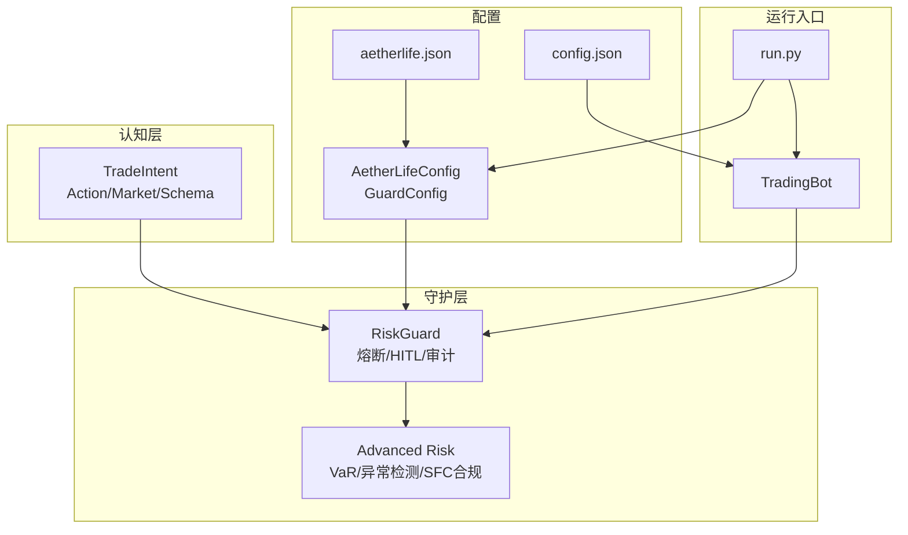
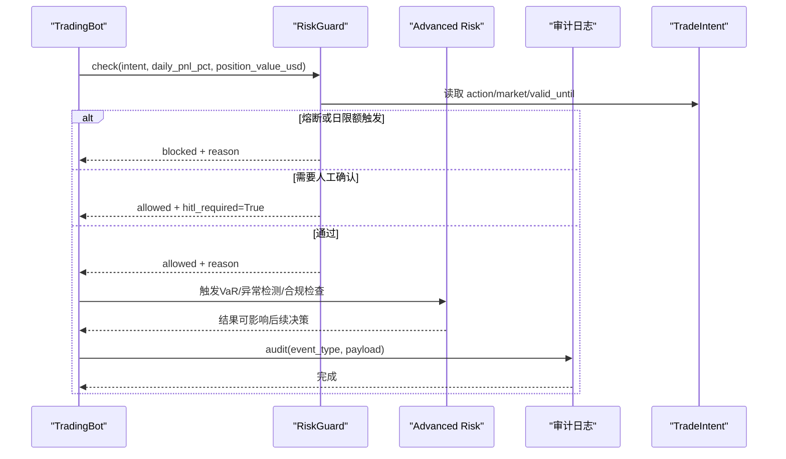
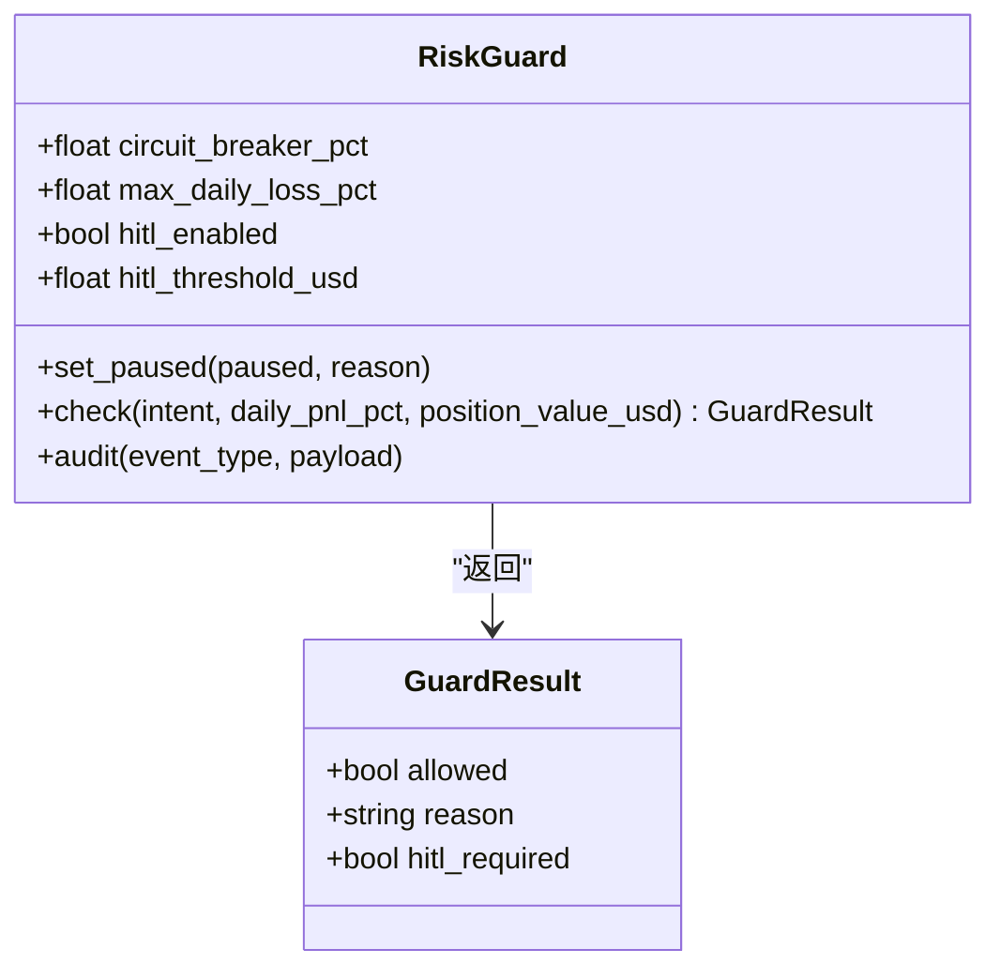
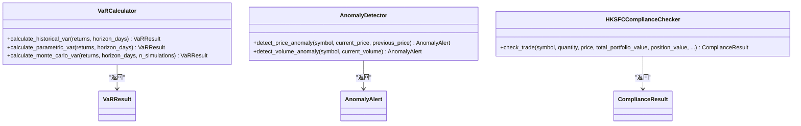
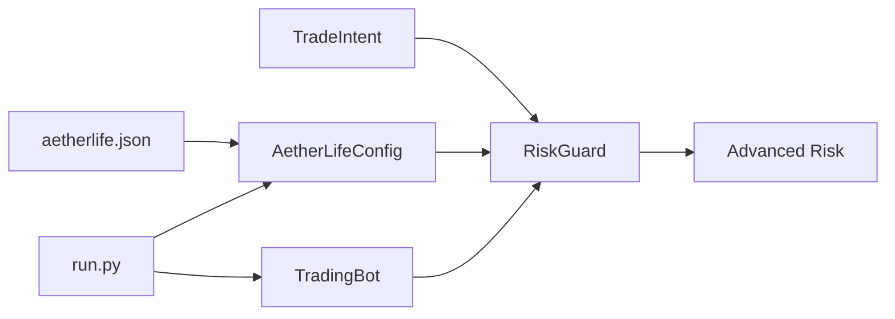

# 守护层

<cite>
**本文引用的文件列表**
- [src/aetherlife/guard/risk_guard.py](file://src/aetherlife/guard/risk_guard.py)
- [src/aetherlife/guard/advanced_risk.py](file://src/aetherlife/guard/advanced_risk.py)
- [src/aetherlife/guard/__init__.py](file://src/aetherlife/guard/__init__.py)
- [src/aetherlife/cognition/schemas.py](file://src/aetherlife/cognition/schemas.py)
- [src/aetherlife/config.py](file://src/aetherlife/config.py)
- [configs/aetherlife.json](file://configs/aetherlife.json)
- [configs/config.json](file://configs/config.json)
- [src/trading_bot.py](file://src/trading_bot.py)
- [src/aetherlife/run.py](file://src/aetherlife/run.py)
</cite>

## 目录
1. [简介](#简介)
2. [项目结构](#项目结构)
3. [核心组件](#核心组件)
4. [架构总览](#架构总览)
5. [组件详解](#组件详解)
6. [依赖关系分析](#依赖关系分析)
7. [性能与可靠性考量](#性能与可靠性考量)
8. [故障排查指南](#故障排查指南)
9. [结论](#结论)
10. [附录](#附录)

## 简介
本文件面向量化交易系统的“守护层”，聚焦于 RiskGuard 风险守护系统的设计与实现，覆盖熔断机制、日交易限制、人工干预（HITL）、审计日志、高级风险度量（VaR）、异常检测与合规检查等能力。文档同时给出风控阈值配置、实时监控指标、异常检测算法、自动阻断机制、合规检查流程、紧急停机程序与事后审计分析，并提供策略配置示例与应急处理方案。

## 项目结构
守护层位于 aetherlife/guard 子模块中，包含基础风控（RiskGuard）与高级风控（VaR、异常检测、SFC合规）两大类能力。与认知层的 TradeIntent 结构耦合，通过配置文件统一注入参数。

图表来源
- [src/aetherlife/guard/risk_guard.py](file://src/aetherlife/guard/risk_guard.py#L1-L84)
- [src/aetherlife/guard/advanced_risk.py](file://src/aetherlife/guard/advanced_risk.py#L1-L564)
- [src/aetherlife/cognition/schemas.py](file://src/aetherlife/cognition/schemas.py#L32-L59)
- [src/aetherlife/config.py](file://src/aetherlife/config.py#L70-L82)
- [configs/aetherlife.json](file://configs/aetherlife.json#L7-L10)
- [configs/config.json](file://configs/config.json#L15-L20)
- [src/aetherlife/run.py](file://src/aetherlife/run.py#L52-L67)
- [src/trading_bot.py](file://src/trading_bot.py#L50-L52)

章节来源
- [src/aetherlife/guard/risk_guard.py](file://src/aetherlife/guard/risk_guard.py#L1-L84)
- [src/aetherlife/guard/advanced_risk.py](file://src/aetherlife/guard/advanced_risk.py#L1-L564)
- [src/aetherlife/cognition/schemas.py](file://src/aetherlife/cognition/schemas.py#L32-L59)
- [src/aetherlife/config.py](file://src/aetherlife/config.py#L70-L82)
- [configs/aetherlife.json](file://configs/aetherlife.json#L7-L10)
- [configs/config.json](file://configs/config.json#L15-L20)
- [src/aetherlife/run.py](file://src/aetherlife/run.py#L52-L67)
- [src/trading_bot.py](file://src/trading_bot.py#L50-L52)

## 核心组件
- RiskGuard：执行前最后一道关卡，负责熔断、日交易限制、HITL 人工干预与审计日志。
- Advanced Risk：提供 VaR 计算、异常检测（价格/成交量/波动率/相关性）、SFC 合规检查。
- 配置体系：AetherLifeConfig/GuardConfig 与 aetherlife.json 提供守护层参数注入。
- 与认知层交互：基于 TradeIntent 的 action、market、valid_until 等字段进行风控判定。

章节来源
- [src/aetherlife/guard/risk_guard.py](file://src/aetherlife/guard/risk_guard.py#L23-L84)
- [src/aetherlife/guard/advanced_risk.py](file://src/aetherlife/guard/advanced_risk.py#L63-L226)
- [src/aetherlife/config.py](file://src/aetherlife/config.py#L70-L82)
- [configs/aetherlife.json](file://configs/aetherlife.json#L7-L10)
- [src/aetherlife/cognition/schemas.py](file://src/aetherlife/cognition/schemas.py#L32-L59)

## 架构总览
守护层在交易执行前进行三道防线：
- 基础风控（RiskGuard）：熔断、日限额、HITL、审计
- 高级风控（Advanced Risk）：VaR、异常检测、SFC 合规
- 配置驱动（AetherLifeConfig/GuardConfig）：统一注入阈值与开关

图表来源
- [src/aetherlife/guard/risk_guard.py](file://src/aetherlife/guard/risk_guard.py#L48-L84)
- [src/aetherlife/guard/advanced_risk.py](file://src/aetherlife/guard/advanced_risk.py#L63-L226)
- [src/aetherlife/cognition/schemas.py](file://src/aetherlife/cognition/schemas.py#L32-L59)

## 组件详解

### RiskGuard：熔断、HITL、审计
- 功能要点
  - 熔断：当日累计亏损达到设定阈值时阻断交易。
  - 日交易限制：防止过度交易导致风险集中。
  - HITL：大额头寸触发人工确认。
  - 审计：统一写入日志、可选文件与回调。
  - 杀手开关：支持外部设置暂停状态与原因。
- 关键参数
  - 熔断阈值（百分比）
  - 单日最大亏损阈值（百分比）
  - HITL 开关与阈值（美元）
  - 审计日志路径与回调
- 返回结构
  - allowed：是否允许
  - reason：阻断/放行原因
  - hitl_required：是否需要人工确认

图表来源
- [src/aetherlife/guard/risk_guard.py](file://src/aetherlife/guard/risk_guard.py#L16-L46)
- [src/aetherlife/guard/risk_guard.py](file://src/aetherlife/guard/risk_guard.py#L48-L84)

章节来源
- [src/aetherlife/guard/risk_guard.py](file://src/aetherlife/guard/risk_guard.py#L23-L84)
- [src/aetherlife/cognition/schemas.py](file://src/aetherlife/cognition/schemas.py#L32-L59)

### 高级风控：VaR、异常检测、SFC 合规
- VaR 计算
  - 支持历史模拟法、参数法、蒙特卡洛模拟法
  - 输出 1日/10日 95%/99% VaR 与 CVaR
- 异常检测
  - 价格、成交量、波动率、相关性异常
  - 基于 Z-score 的统计阈值
- SFC 合规检查
  - 单笔订单上限、日内交易次数、持仓集中度、北向额度
  - A股交易时段限制

图表来源
- [src/aetherlife/guard/advanced_risk.py](file://src/aetherlife/guard/advanced_risk.py#L63-L226)
- [src/aetherlife/guard/advanced_risk.py](file://src/aetherlife/guard/advanced_risk.py#L228-L357)
- [src/aetherlife/guard/advanced_risk.py](file://src/aetherlife/guard/advanced_risk.py#L359-L507)

章节来源
- [src/aetherlife/guard/advanced_risk.py](file://src/aetherlife/guard/advanced_risk.py#L63-L507)

### 配置与注入
- AetherLifeConfig/GuardConfig
  - 控制熔断、日限额、HITL、审计开关与路径
- aetherlife.json
  - 守护层审计日志路径等
- config.json
  - 传统策略与风控参数（如 max_daily_loss）

章节来源
- [src/aetherlife/config.py](file://src/aetherlife/config.py#L70-L82)
- [configs/aetherlife.json](file://configs/aetherlife.json#L7-L10)
- [configs/config.json](file://configs/config.json#L15-L20)

### 与认知层的交互
- TradeIntent 字段
  - action、market、quantity_pct、valid_until、order_type/limit_price 等
- 守护层在执行前读取 intent，结合日累计盈亏与头寸价值进行判定

章节来源
- [src/aetherlife/cognition/schemas.py](file://src/aetherlife/cognition/schemas.py#L32-L59)
- [src/aetherlife/guard/risk_guard.py](file://src/aetherlife/guard/risk_guard.py#L48-L68)

## 依赖关系分析
- RiskGuard 依赖认知层的 TradeIntent 与 Action 枚举
- Advanced Risk 作为独立模块，可被上层调用以增强风控
- 配置通过 AetherLifeConfig 注入，运行入口 run.py 加载 aetherlife.json 并传递给系统

图表来源
- [src/aetherlife/guard/risk_guard.py](file://src/aetherlife/guard/risk_guard.py#L11-L13)
- [src/aetherlife/config.py](file://src/aetherlife/config.py#L70-L82)
- [configs/aetherlife.json](file://configs/aetherlife.json#L7-L10)
- [src/aetherlife/run.py](file://src/aetherlife/run.py#L32-L49)
- [src/trading_bot.py](file://src/trading_bot.py#L50-L52)

章节来源
- [src/aetherlife/guard/risk_guard.py](file://src/aetherlife/guard/risk_guard.py#L11-L13)
- [src/aetherlife/config.py](file://src/aetherlife/config.py#L70-L82)
- [configs/aetherlife.json](file://configs/aetherlife.json#L7-L10)
- [src/aetherlife/run.py](file://src/aetherlife/run.py#L32-L49)
- [src/trading_bot.py](file://src/trading_bot.py#L50-L52)

## 性能与可靠性考量
- RiskGuard
  - O(1) 判断逻辑，无外部 I/O，极低延迟
  - 审计日志采用异步回调与文件追加，失败不影响主流程
- Advanced Risk
  - VaR 计算复杂度取决于样本规模与方法（历史法 O(n log n)，参数法 O(1)，蒙特卡洛 O(N)）
  - 异常检测基于滑动窗口与统计阈值，内存占用可控
- 配置注入
  - 运行时加载 aetherlife.json，建议在启动阶段一次性注入，避免频繁 IO

[本节为通用性能讨论，不直接分析具体文件]

## 故障排查指南
- 熔断未生效
  - 检查日累计盈亏是否正确传入 RiskGuard
  - 确认熔断阈值与冷却时间配置
- HITL 未触发
  - 确认 position_value_usd 是否按 USD 计算
  - 检查 hitl_enabled 与阈值
- 审计日志缺失
  - 检查审计路径与权限
  - 确认回调函数可用性
- 高级风控误报
  - 调整异常检测阈值（price/volume/volatility）
  - 校准 VaR 方法与置信水平
- 合规检查失败
  - 核对单笔订单上限、日内交易次数、持仓集中度与北向额度

章节来源
- [src/aetherlife/guard/risk_guard.py](file://src/aetherlife/guard/risk_guard.py#L48-L84)
- [src/aetherlife/guard/advanced_risk.py](file://src/aetherlife/guard/advanced_risk.py#L228-L357)
- [src/aetherlife/guard/advanced_risk.py](file://src/aetherlife/guard/advanced_risk.py#L359-L507)

## 结论
守护层通过 RiskGuard 提供强约束的执行前风控，结合 Advanced Risk 的专业度量与合规检查，形成“熔断/HITL/审计 + VaR/异常检测/SFC 合规”的完整安全体系。配合配置驱动与运行入口，可在不同市场与策略下灵活调整阈值与行为，满足合规与稳健运营要求。

[本节为总结性内容，不直接分析具体文件]

## 附录

### 风控阈值配置示例
- 基础风控（RiskGuard）
  - 熔断阈值：日累计亏损达到 -5%
  - 单日最大亏损：-10%
  - HITL：开启，阈值 10,000 美元
  - 审计：开启，日志路径 logs/aetherlife_audit.jsonl
- 高级风控（Advanced Risk）
  - VaR：置信水平 95%，持有期 1/10 天
  - 异常检测：价格/成交量/波动率阈值（标准差倍数）
  - 合规：单笔订单上限、日内交易次数、持仓集中度、北向额度

章节来源
- [src/aetherlife/config.py](file://src/aetherlife/config.py#L70-L82)
- [configs/aetherlife.json](file://configs/aetherlife.json#L7-L10)
- [src/aetherlife/guard/advanced_risk.py](file://src/aetherlife/guard/advanced_risk.py#L63-L226)

### 实时监控指标
- 日累计盈亏（百分比）
- 单日交易次数
- 连续亏损次数
- 头寸价值（美元）
- 异常检测评分（Z-score）
- VaR/CVaR 指标
- 合规检查结果（通过/警告/违规）

章节来源
- [src/aetherlife/guard/advanced_risk.py](file://src/aetherlife/guard/advanced_risk.py#L228-L357)
- [src/aetherlife/guard/advanced_risk.py](file://src/aetherlife/guard/advanced_risk.py#L359-L507)

### 异常检测算法
- 价格异常：基于历史收益率的 Z-score
- 成交量异常：基于历史成交量的 Z-score
- 波动率/相关性异常：基于滚动窗口统计与阈值比较

章节来源
- [src/aetherlife/guard/advanced_risk.py](file://src/aetherlife/guard/advanced_risk.py#L228-L357)

### 自动阻断机制
- 熔断：日累计亏损达到阈值，系统暂停交易直至恢复
- 日限额：单日交易次数或连续亏损达到阈值，阻断
- HITL：大额头寸触发人工确认，未确认则阻断

章节来源
- [src/aetherlife/guard/risk_guard.py](file://src/aetherlife/guard/risk_guard.py#L48-L68)

### 合规检查流程
- 单笔订单价值换算与限额对比
- 日内交易次数统计与限额对比
- 持仓集中度评估
- 北向额度与交易时段检查

章节来源
- [src/aetherlife/guard/advanced_risk.py](file://src/aetherlife/guard/advanced_risk.py#L359-L507)

### 紧急停机程序
- 设置暂停状态与原因
- 审计记录停机事件
- 停止交易循环并输出统计

章节来源
- [src/aetherlife/guard/risk_guard.py](file://src/aetherlife/guard/risk_guard.py#L44-L46)
- [src/trading_bot.py](file://src/trading_bot.py#L284-L297)

### 事后审计分析
- 审计日志格式：包含事件类型、负载与 UTC 时间戳
- 文件落盘与回调双通道，确保可追溯
- 结合 VaR/CVaR 与异常检测结果复盘

章节来源
- [src/aetherlife/guard/risk_guard.py](file://src/aetherlife/guard/risk_guard.py#L70-L84)
- [configs/aetherlife.json](file://configs/aetherlife.json#L7-L10)

### 应急处理方案
- 熔断触发：立即暂停交易，等待人工评估与恢复
- 高频异常：降低检测阈值或临时关闭异常检测模块
- 合规违规：冻结相关交易，调整限额或策略参数
- 审计失败：切换回调或本地文件路径，确保至少一种落盘

章节来源
- [src/aetherlife/guard/risk_guard.py](file://src/aetherlife/guard/risk_guard.py#L48-L84)
- [src/aetherlife/guard/advanced_risk.py](file://src/aetherlife/guard/advanced_risk.py#L228-L357)
- [src/aetherlife/guard/advanced_risk.py](file://src/aetherlife/guard/advanced_risk.py#L359-L507)