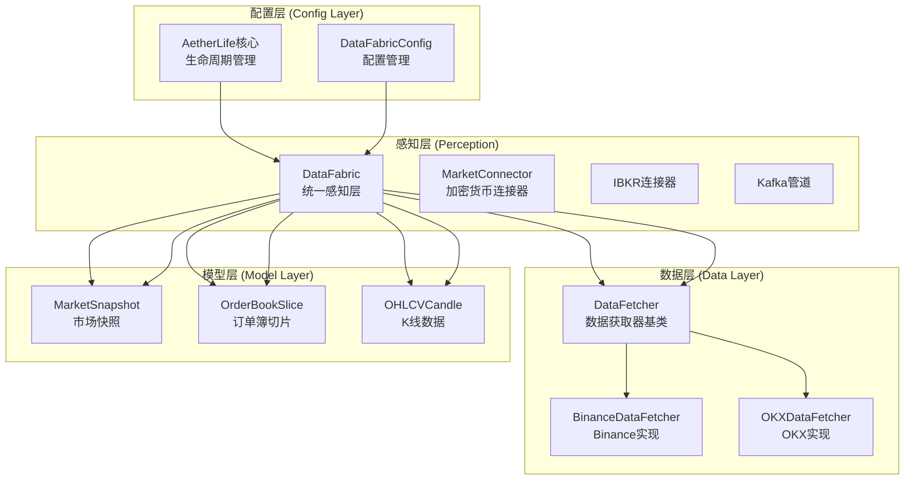
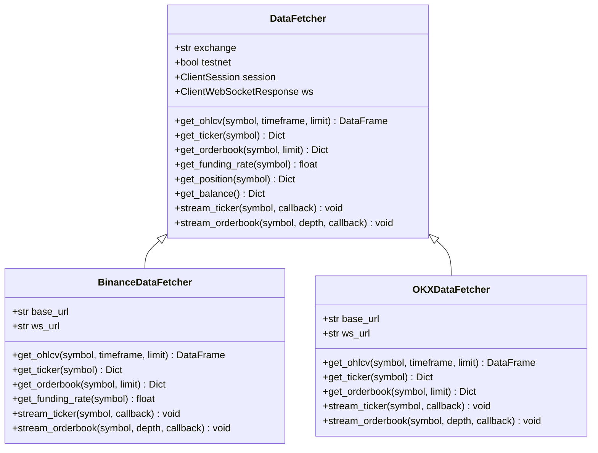
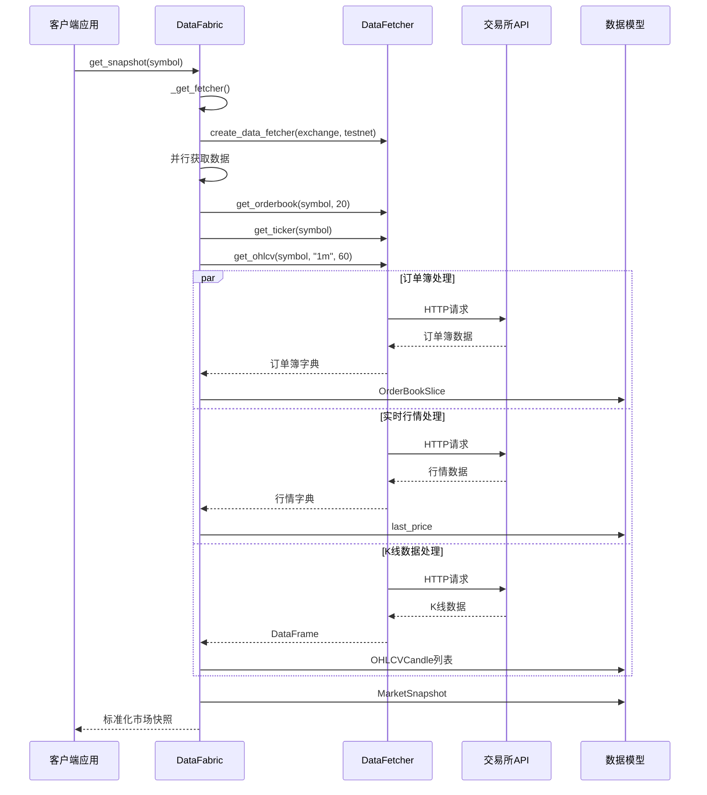
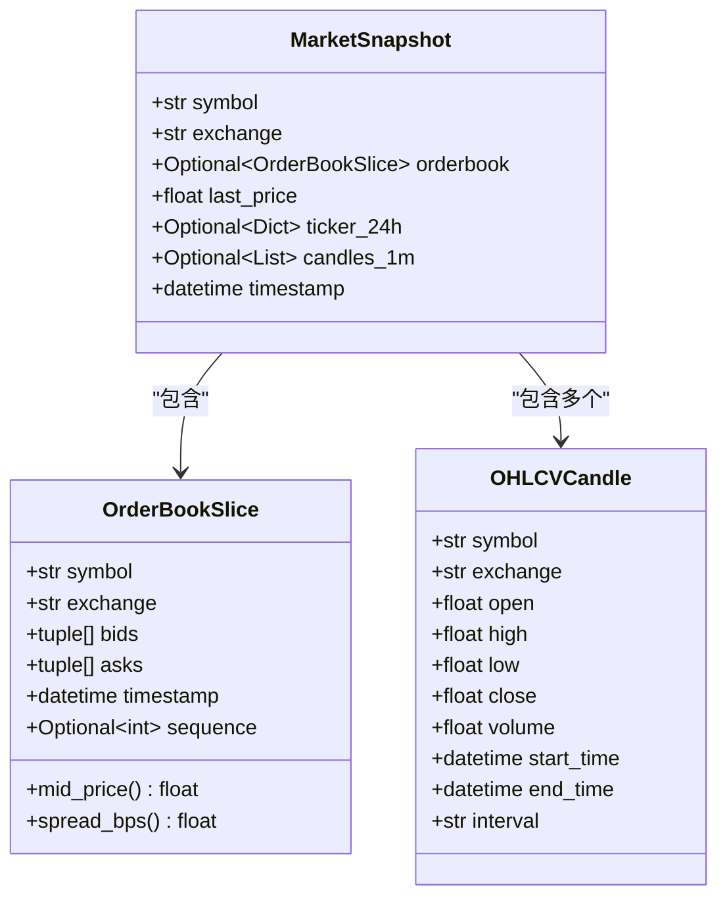
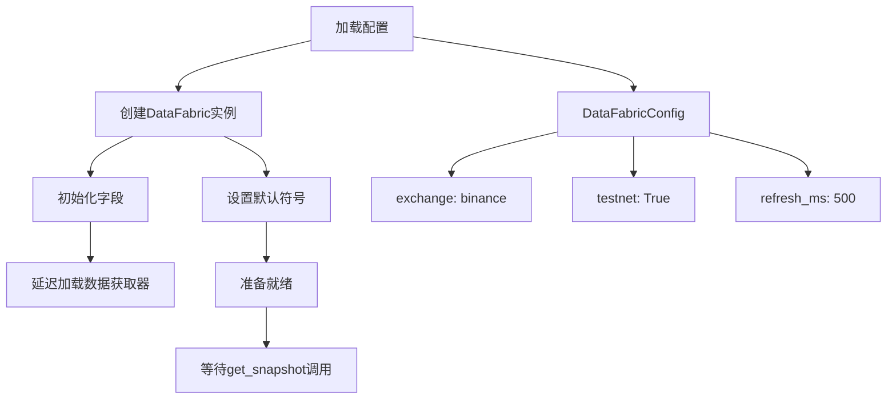
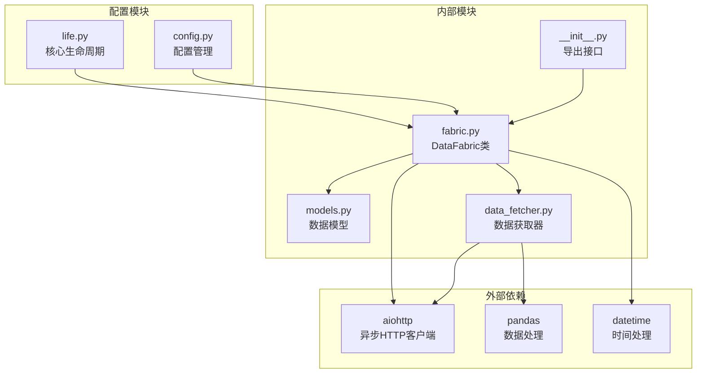
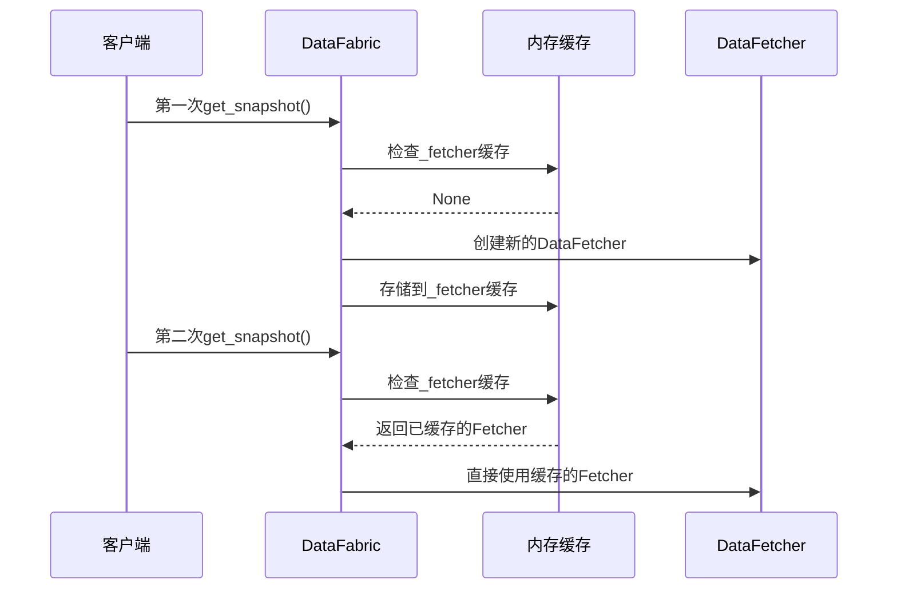

# DataFabric核心数据获取器

<cite>
**本文档引用的文件**
- [fabric.py](file://src/aetherlife/perception/fabric.py)
- [data_fetcher.py](file://src/data/data_fetcher.py)
- [models.py](file://src/aetherlife/perception/models.py)
- [__init__.py](file://src/aetherlife/perception/__init__.py)
- [config.py](file://src/aetherlife/config.py)
- [life.py](file://src/aetherlife/core/life.py)
- [perception_connector_demo.py](file://scripts/perception_connector_demo.py)
</cite>

## 目录
1. [简介](#简介)
2. [项目结构](#项目结构)
3. [核心组件](#核心组件)
4. [架构概览](#架构概览)
5. [详细组件分析](#详细组件分析)
6. [依赖关系分析](#依赖关系分析)
7. [性能考虑](#性能考虑)
8. [故障排除指南](#故障排除指南)
9. [结论](#结论)
10. [附录](#附录)

## 简介

DataFabric是AetherLife智能交易系统中的核心数据获取器，作为统一感知层负责整合多源市场数据并提供标准化的MarketSnapshot数据模型。该组件实现了高效的并行数据获取机制，支持订单簿、实时行情和K线数据的同步获取，并通过统一的数据格式为上层的认知和决策模块提供一致的数据接口。

DataFabric的设计遵循了模块化和可扩展性原则，支持多种交易所（Binance、OKX等）的无缝集成，并为未来的WebSocket推送和Kafka数据管道提供了清晰的扩展路径。

## 项目结构

DataFabric位于感知层（Perception Layer）中，与数据获取器、模型定义和系统配置紧密协作：



**图表来源**
- [fabric.py](file://src/aetherlife/perception/fabric.py#L1-L88)
- [data_fetcher.py](file://src/data/data_fetcher.py#L1-L434)
- [models.py](file://src/aetherlife/perception/models.py#L1-L64)
- [config.py](file://src/aetherlife/config.py#L11-L21)

**章节来源**
- [fabric.py](file://src/aetherlife/perception/fabric.py#L1-L88)
- [__init__.py](file://src/aetherlife/perception/__init__.py#L1-L47)

## 核心组件

### DataFabric类设计

DataFabric作为统一感知层的核心，承担着以下关键职责：

- **多源数据整合**：统一处理来自不同交易所的数据源
- **并行数据获取**：同时获取订单簿、实时行情和K线数据
- **数据格式标准化**：将异构数据转换为统一的MarketSnapshot格式
- **生命周期管理**：提供初始化、数据获取和资源清理功能

### 数据获取器接口

DataFetcher抽象基类定义了标准的数据获取接口：



**图表来源**
- [data_fetcher.py](file://src/data/data_fetcher.py#L17-L71)
- [data_fetcher.py](file://src/data/data_fetcher.py#L73-L187)
- [data_fetcher.py](file://src/data/data_fetcher.py#L237-L397)

**章节来源**
- [data_fetcher.py](file://src/data/data_fetcher.py#L17-L71)
- [data_fetcher.py](file://src/data/data_fetcher.py#L73-L187)
- [data_fetcher.py](file://src/data/data_fetcher.py#L237-L397)

## 架构概览

DataFabric采用分层架构设计，确保了良好的模块分离和可维护性：



**图表来源**
- [fabric.py](file://src/aetherlife/perception/fabric.py#L32-L82)
- [data_fetcher.py](file://src/data/data_fetcher.py#L85-L157)

## 详细组件分析

### DataFabric.get_snapshot方法实现

get_snapshot方法是DataFabric的核心功能，实现了高效的并行数据获取机制：

#### 方法签名和参数
- **方法名**: `get_snapshot`
- **参数**: `symbol: Optional[str] = None`
- **返回值**: `MarketSnapshot`对象
- **异步**: 是

#### 并行数据获取机制

DataFabric使用`asyncio.gather()`实现三路并行数据获取：

```mermaid
flowchart TD
Start([开始 get_snapshot]) --> CheckSymbol["检查符号参数"]
CheckSymbol --> GetFetcher["获取数据获取器"]
GetFetcher --> ParallelFetch["并行获取数据"]
ParallelFetch --> Orderbook["获取订单簿<br/>get_orderbook(symbol, 20)"]
ParallelFetch --> Ticker["获取实时行情<br/>get_ticker(symbol)"]
ParallelFetch --> OHLCV["获取K线数据<br/>get_ohlcv(symbol, '1m', 60)"]
Orderbook --> ProcessOrderbook["处理订单簿数据"]
Ticker --> ProcessTicker["处理实时行情"]
OHLCV --> ProcessCandles["处理K线数据"]
ProcessOrderbook --> BuildOB["构建OrderBookSlice"]
ProcessTicker --> ExtractPrice["提取最新价格"]
ProcessCandles --> BuildCandles["构建OHLCVCandle列表"]
BuildOB --> BuildSnapshot["构建MarketSnapshot"]
ExtractPrice --> BuildSnapshot
BuildCandles --> BuildSnapshot
BuildSnapshot --> End([返回MarketSnapshot])
```



**图表来源**
- [fabric.py](file://src/aetherlife/perception/fabric.py#L32-L82)

#### 订单簿数据处理

订单簿数据处理包含以下步骤：

1. **数据提取**: 从获取器返回的字典中提取`bids`和`asks`字段
2. **格式转换**: 将价格和数量从字符串转换为浮点数
3. **深度限制**: 仅保留前10档的订单簿数据
4. **对象构建**: 创建OrderBookSlice对象

#### K线数据处理

K线数据处理涉及复杂的数据转换逻辑：

1. **DataFrame验证**: 检查返回的DataFrame是否为空或包含必要的列
2. **时间戳处理**: 处理可能的不同时间戳格式
3. **数据类型转换**: 将字符串数值转换为浮点数
4. **对象构建**: 创建OHLCVCandle对象列表

**章节来源**
- [fabric.py](file://src/aetherlife/perception/fabric.py#L32-L82)

### MarketSnapshot数据模型

MarketSnapshot是DataFabric的核心数据结构，提供了统一的市场数据表示：

#### 数据结构定义



**图表来源**
- [models.py](file://src/aetherlife/perception/models.py#L54-L64)
- [models.py](file://src/aetherlife/perception/models.py#L15-L37)
- [models.py](file://src/aetherlife/perception/models.py#L39-L52)

#### 订单簿切片处理

OrderBookSlice提供了实用的方法来计算市场指标：

- **mid_price()**: 计算中间价格 = (最高买价 + 最低卖价) / 2
- **spread_bps()**: 计算买卖价差（基点）= ((最低卖价 - 最高买价) / 中间价格) × 10000

**章节来源**
- [models.py](file://src/aetherlife/perception/models.py#L15-L37)
- [models.py](file://src/aetherlife/perception/models.py#L54-L64)

### 初始化和配置流程

DataFabric的初始化过程涉及多个配置层面：



**图表来源**
- [config.py](file://src/aetherlife/config.py#L11-L21)
- [fabric.py](file://src/aetherlife/perception/fabric.py#L16-L21)

**章节来源**
- [config.py](file://src/aetherlife/config.py#L11-L21)
- [fabric.py](file://src/aetherlife/perception/fabric.py#L16-L21)

## 依赖关系分析

DataFabric的依赖关系体现了清晰的分层架构：



**图表来源**
- [fabric.py](file://src/aetherlife/perception/fabric.py#L6-L10)
- [data_fetcher.py](file://src/data/data_fetcher.py#L6-L11)
- [models.py](file://src/aetherlife/perception/models.py#L3-L6)

### 外部依赖分析

DataFabric主要依赖以下外部库：

- **aiohttp**: 提供异步HTTP客户端功能，支持并发请求
- **pandas**: 用于K线数据的高效处理和转换
- **datetime**: 标准时间处理库，确保时间戳的一致性

### 内部模块耦合

DataFabric与感知层其他组件的耦合关系：

- **低耦合**: 通过接口抽象与具体实现解耦
- **高内聚**: 数据获取逻辑集中在单一职责的类中
- **可扩展**: 易于添加新的数据源和处理逻辑

**章节来源**
- [fabric.py](file://src/aetherlife/perception/fabric.py#L6-L10)
- [data_fetcher.py](file://src/data/data_fetcher.py#L6-L11)
- [models.py](file://src/aetherlife/perception/models.py#L3-L6)

## 性能考虑

### 并行处理优化

DataFabric通过异步并行处理显著提升了数据获取效率：

- **并发请求**: 使用`asyncio.gather()`同时发起三个独立的API请求
- **资源复用**: 单个DataFetcher实例在生命周期内重复使用
- **内存优化**: 仅保留必要的数据字段，避免内存浪费

### 缓存策略

DataFabric实现了智能的延迟加载和缓存机制：



**图表来源**
- [fabric.py](file://src/aetherlife/perception/fabric.py#L23-L27)

### 错误处理机制

DataFabric实现了多层次的错误处理策略：

- **API错误捕获**: 捕获交易所API返回的错误状态
- **数据验证**: 验证返回数据的完整性和有效性
- **降级处理**: 在部分数据获取失败时继续处理可用数据

**章节来源**
- [fabric.py](file://src/aetherlife/perception/fabric.py#L23-L27)
- [data_fetcher.py](file://src/data/data_fetcher.py#L97-L98)

## 故障排除指南

### 常见问题诊断

#### 数据获取失败

**症状**: `get_snapshot()`抛出异常或返回空数据

**可能原因**:
1. 交易所API不可用或限流
2. 网络连接问题
3. 认证凭据无效

**解决方案**:
1. 检查网络连接状态
2. 验证API密钥配置
3. 查看交易所服务状态

#### 数据格式错误

**症状**: 订单簿或K线数据格式不符合预期

**可能原因**:
1. 交易所API响应格式变化
2. 数据类型转换失败

**解决方案**:
1. 更新数据获取器实现
2. 增加数据验证逻辑

#### 性能问题

**症状**: 数据获取延迟过高

**可能原因**:
1. 并发请求过多导致限流
2. 网络延迟过高

**解决方案**:
1. 调整刷新间隔配置
2. 实施请求节流机制

### 调试技巧

#### 日志记录

DataFabric在关键节点提供了详细的日志信息：

- **初始化阶段**: 记录DataFetcher创建和配置信息
- **数据获取阶段**: 记录每个API调用的状态
- **错误处理阶段**: 记录异常详情和恢复措施

#### 性能监控

建议在生产环境中实施以下监控指标：

- **响应时间**: 每个API调用的耗时统计
- **成功率**: API调用的成功率和失败率
- **吞吐量**: 每秒处理的数据量

**章节来源**
- [fabric.py](file://src/aetherlife/perception/fabric.py#L84-L87)
- [data_fetcher.py](file://src/data/data_fetcher.py#L97-L98)

## 结论

DataFabric作为AetherLife智能交易系统的核心数据获取器，展现了优秀的架构设计和实现质量。其主要优势包括：

### 技术优势

1. **高效的并行处理**: 通过异步并发显著提升了数据获取性能
2. **统一的数据模型**: 提供了一致的数据接口，简化了上层开发
3. **灵活的扩展性**: 支持多种交易所和未来技术栈的无缝集成
4. **健壮的错误处理**: 实现了多层次的异常处理和恢复机制

### 架构特点

1. **分层清晰**: 感知层、数据层、模型层职责明确
2. **低耦合高内聚**: 模块间依赖关系简洁明了
3. **可测试性强**: 清晰的接口定义便于单元测试
4. **可维护性好**: 代码结构合理，注释完善

### 应用场景

DataFabric适用于以下应用场景：

- **高频交易系统**: 需要快速获取市场数据的场景
- **多交易所套利**: 需要统一处理多个交易所数据的场景
- **算法交易**: 需要稳定可靠数据源的自动化交易系统
- **市场分析**: 需要历史K线数据进行技术分析的场景

DataFabric的设计为AetherLife系统的进一步发展奠定了坚实的基础，其模块化的架构和清晰的接口定义使其能够适应不断变化的市场需求和技术演进。

## 附录

### 使用示例

#### 基本使用模式

```python
# 异步调用模式
import asyncio
from aetherlife.perception import DataFabric

async def main():
    fabric = DataFabric(exchange="binance", testnet=True)
    
    # 获取市场快照
    snapshot = await fabric.get_snapshot("BTCUSDT")
    
    # 访问数据
    print(f"最新价格: {snapshot.last_price}")
    print(f"订单簿深度: {len(snapshot.orderbook.bids)}")
    
    await fabric.close()

# 运行异步函数
asyncio.run(main())
```

#### 错误处理最佳实践

```python
async def safe_get_snapshot(fabric, symbol):
    try:
        snapshot = await fabric.get_snapshot(symbol)
        return snapshot
    except Exception as e:
        print(f"获取快照失败: {e}")
        return None

# 使用示例
snapshot = await safe_get_snapshot(fabric, "BTCUSDT")
if snapshot:
    # 处理正常情况
    pass
else:
    # 处理错误情况
    pass
```

### 配置选项

DataFabric支持以下配置选项：

| 参数名 | 类型 | 默认值 | 描述 |
|--------|------|--------|------|
| exchange | str | "binance" | 交易所名称 |
| testnet | bool | True | 是否使用测试网络 |
| refresh_ms | int | 500 | 数据刷新间隔（毫秒） |

### 相关文件

- **fabric.py**: DataFabric类的主要实现
- **data_fetcher.py**: 数据获取器基类和具体实现
- **models.py**: 数据模型定义
- **config.py**: 配置管理类
- **life.py**: 系统核心生命周期管理