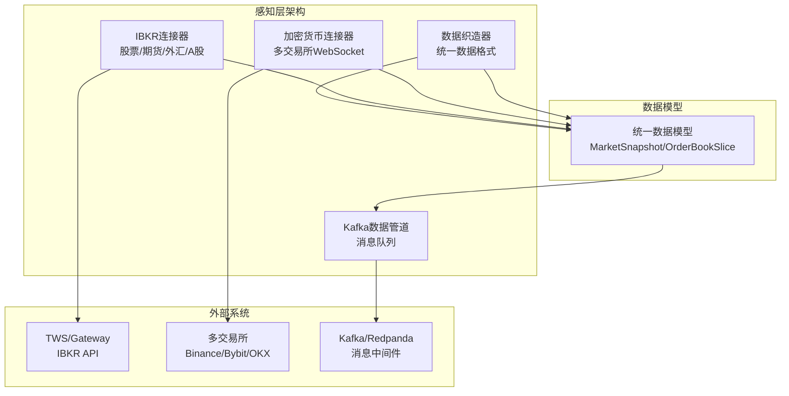
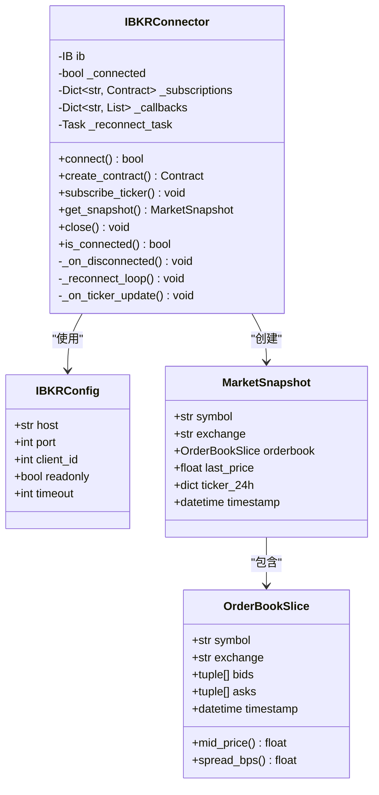
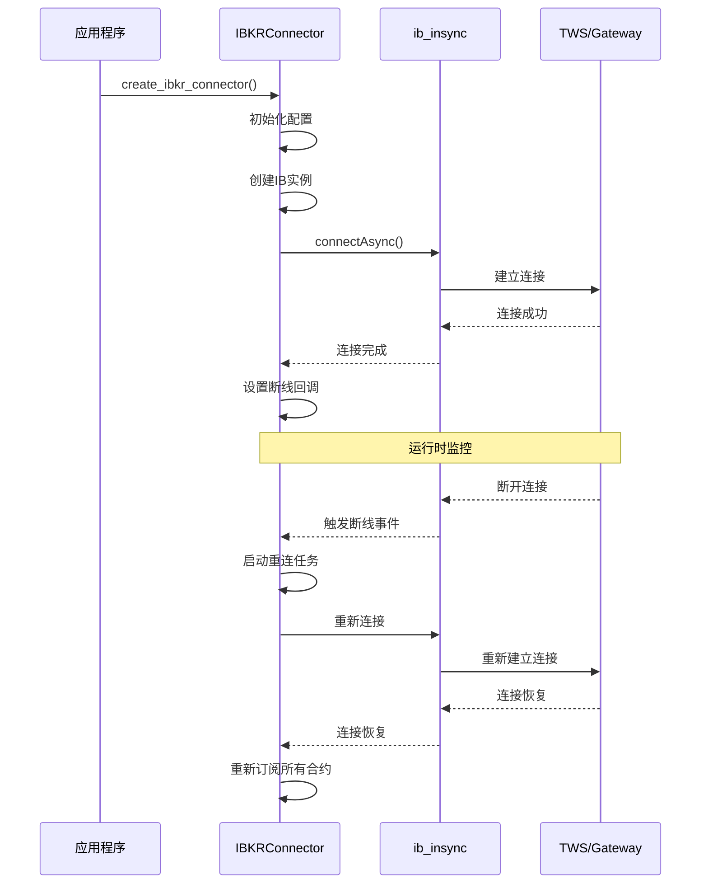
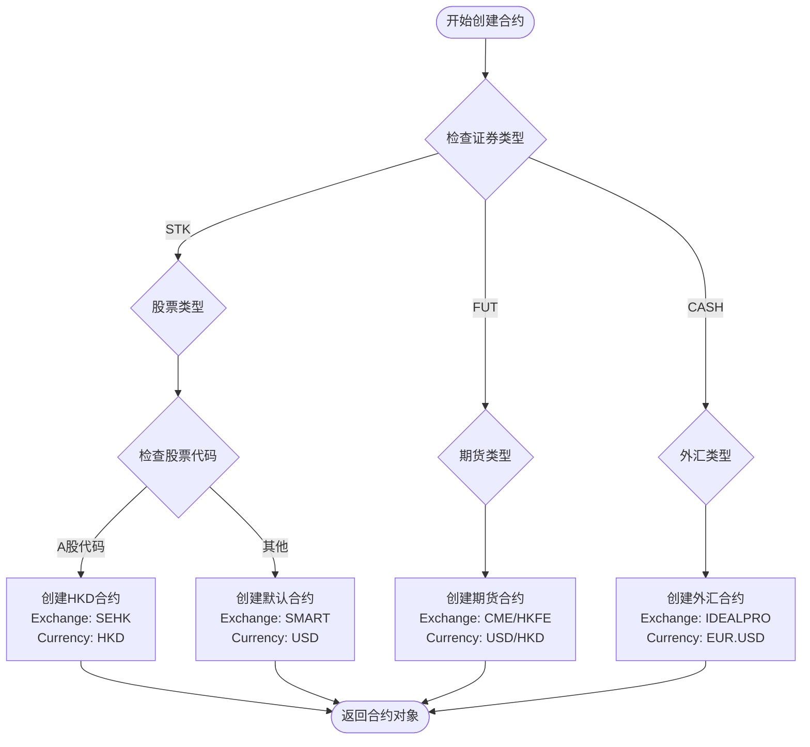
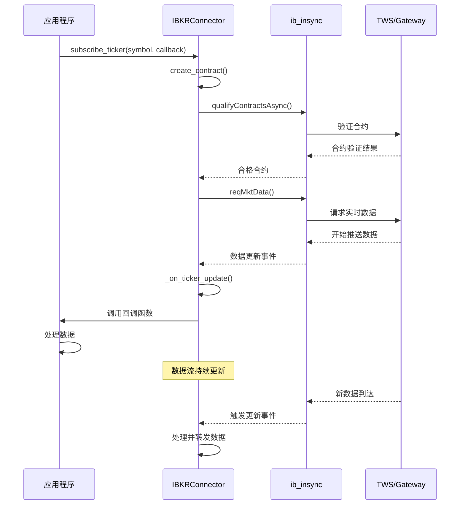
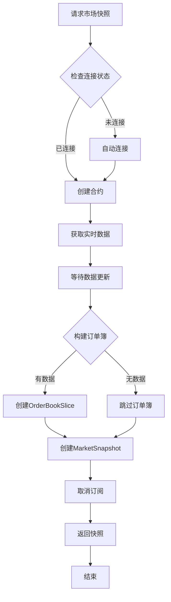
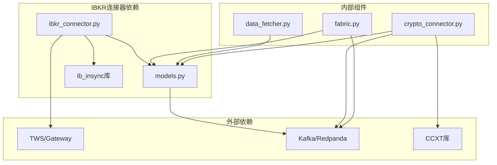

# IBKR数据连接器

<cite>
**本文档引用的文件**
- [ibkr_connector.py](file://src/aetherlife/perception/ibkr_connector.py)
- [crypto_connector.py](file://src/aetherlife/perception/crypto_connector.py)
- [models.py](file://src/aetherlife/perception/models.py)
- [fabric.py](file://src/aetherlife/perception/fabric.py)
- [data_fetcher.py](file://src/data/data_fetcher.py)
- [kafka_producer.py](file://src/aetherlife/perception/kafka_producer.py)
- [perception_connector_demo.py](file://scripts/perception_connector_demo.py)
- [PERCEPTION_UPGRADE_GUIDE.md](file://docs/PERCEPTION_UPGRADE_GUIDE.md)
- [config.json](file://configs/config.json)
</cite>

## 目录
1. [简介](#简介)
2. [项目结构](#项目结构)
3. [核心组件](#核心组件)
4. [架构概览](#架构概览)
5. [详细组件分析](#详细组件分析)
6. [依赖关系分析](#依赖关系分析)
7. [性能考虑](#性能考虑)
8. [故障排除指南](#故障排除指南)
9. [结论](#结论)
10. [附录](#附录)

## 简介

IBKR数据连接器是AetherLife交易系统中的关键组件，专门用于连接Interactive Brokers（IBKR）的TWS API，提供股票、期货、外汇以及A股（通过Stock Connect）的实时数据订阅功能。该连接器采用异步编程模型，支持断线自动重连、数据去重和标准化处理。

与传统的加密货币连接器相比，IBKR连接器具有以下特殊性：
- 使用ib_insync库进行API通信
- 支持A股通过Stock Connect的特殊处理
- 提供完整的市场快照功能
- 具备北向额度查询能力

## 项目结构

AetherLife项目的感知层包含多个数据连接器，每个都针对不同的数据源进行了专门优化：



**图表来源**
- [ibkr_connector.py](file://src/aetherlife/perception/ibkr_connector.py#L1-L323)
- [crypto_connector.py](file://src/aetherlife/perception/crypto_connector.py#L1-L369)
- [models.py](file://src/aetherlife/perception/models.py#L1-L64)

**章节来源**
- [ibkr_connector.py](file://src/aetherlife/perception/ibkr_connector.py#L1-L50)
- [crypto_connector.py](file://src/aetherlife/perception/crypto_connector.py#L1-L50)
- [models.py](file://src/aetherlife/perception/models.py#L1-L30)

## 核心组件

### IBKRConfig配置类
IBKR连接器的核心配置类，定义了连接IBKR所需的所有参数：

| 参数名 | 类型 | 默认值 | 描述 |
|--------|------|--------|------|
| host | str | "127.0.0.1" | TWS/Gateway主机地址 |
| port | int | 7497 | 连接端口（纸面交易: 7497, 实盘: 7496, 网关: 4001/4002） |
| client_id | int | 1 | 客户端ID |
| readonly | bool | True | 只读模式 |
| timeout | int | 20 | 连接超时时间 |

### IBKRConnector主类
IBKR连接器实现了完整的数据获取和管理功能：

**主要功能特性：**
- 异步连接管理
- 多类型合约创建（股票、期货、外汇）
- 实时行情订阅
- 订单簿快照获取
- 自动断线重连
- A股Stock Connect特殊处理

**章节来源**
- [ibkr_connector.py](file://src/aetherlife/perception/ibkr_connector.py#L26-L58)
- [ibkr_connector.py](file://src/aetherlife/perception/ibkr_connector.py#L36-L46)

## 架构概览

IBKR连接器采用分层架构设计，确保了高内聚低耦合的代码组织：



**图表来源**
- [ibkr_connector.py](file://src/aetherlife/perception/ibkr_connector.py#L26-L323)
- [models.py](file://src/aetherlife/perception/models.py#L15-L64)

## 详细组件分析

### 连接管理机制

IBKR连接器实现了完善的连接生命周期管理：



**图表来源**
- [ibkr_connector.py](file://src/aetherlife/perception/ibkr_connector.py#L59-L116)

### 合约创建与管理

IBKR连接器支持多种类型的金融合约创建：



**图表来源**
- [ibkr_connector.py](file://src/aetherlife/perception/ibkr_connector.py#L123-L156)

**章节来源**
- [ibkr_connector.py](file://src/aetherlife/perception/ibkr_connector.py#L123-L156)
- [ibkr_connector.py](file://src/aetherlife/perception/ibkr_connector.py#L175-L203)

### 数据订阅机制

实时数据订阅采用事件驱动的方式：



**图表来源**
- [ibkr_connector.py](file://src/aetherlife/perception/ibkr_connector.py#L158-L203)
- [ibkr_connector.py](file://src/aetherlife/perception/ibkr_connector.py#L205-L228)

**章节来源**
- [ibkr_connector.py](file://src/aetherlife/perception/ibkr_connector.py#L158-L203)
- [ibkr_connector.py](file://src/aetherlife/perception/ibkr_connector.py#L205-L228)

### 市场快照获取

IBKR连接器提供了完整的市场快照获取功能：



**图表来源**
- [ibkr_connector.py](file://src/aetherlife/perception/ibkr_connector.py#L229-L284)

**章节来源**
- [ibkr_connector.py](file://src/aetherlife/perception/ibkr_connector.py#L229-L284)

### A股Stock Connect特殊处理

IBKR连接器对A股数据提供了特殊的处理逻辑：

| 股票代码前缀 | 处理方式 | 交易所 | 货币 |
|-------------|----------|--------|------|
| 6开头（沪市） | 通过SEHK连接 | SEHK | HKD |
| 0开头（深市） | 通过SEHK连接 | SEHK | HKD |
| 3开头（创业板） | 通过SEHK连接 | SEHK | HKD |
| 其他代码 | 标准股票处理 | SMART | USD |

**章节来源**
- [ibkr_connector.py](file://src/aetherlife/perception/ibkr_connector.py#L136-L142)

## 依赖关系分析

IBKR连接器与其他组件的依赖关系如下：



**图表来源**
- [ibkr_connector.py](file://src/aetherlife/perception/ibkr_connector.py#L12-L21)
- [models.py](file://src/aetherlife/perception/models.py#L1-L64)
- [crypto_connector.py](file://src/aetherlife/perception/crypto_connector.py#L11-L18)

**章节来源**
- [ibkr_connector.py](file://src/aetherlife/perception/ibkr_connector.py#L12-L21)
- [models.py](file://src/aetherlife/perception/models.py#L1-L64)
- [crypto_connector.py](file://src/aetherlife/perception/crypto_connector.py#L11-L18)

## 性能考虑

### 连接池管理
- 使用异步连接避免阻塞
- 自动断线检测和重连机制
- 连接超时控制（默认20秒）

### 数据处理优化
- 实时数据采用事件驱动处理
- 订单簿数据按需获取
- 快照模式支持一次性数据获取

### 内存管理
- 及时取消不再使用的订阅
- 清理回调函数列表
- 正确关闭连接资源

## 故障排除指南

### 常见问题及解决方案

**IBKR连接失败**
```
错误: ConnectionRefusedError
解决方案:
1. 检查TWS/Gateway是否正常运行
2. 确认端口配置正确（纸面交易: 7497, 实盘: 7496）
3. 在TWS中启用API连接
4. 验证客户端ID和权限设置
```

**合约创建失败**
```
错误: ValueError: 无法创建合约
解决方案:
1. 检查证券代码格式是否正确
2. 验证证券类型参数
3. 确认交易所和货币设置
4. 使用qualifyContractsAsync验证合约有效性
```

**数据订阅异常**
```
错误: RuntimeError: IBKR未连接
解决方案:
1. 确保连接已成功建立
2. 检查网络连接稳定性
3. 验证回调函数参数
4. 查看日志获取详细错误信息
```

**章节来源**
- [PERCEPTION_UPGRADE_GUIDE.md](file://docs/PERCEPTION_UPGRADE_GUIDE.md#L291-L316)

## 结论

IBKR数据连接器为AetherLife交易系统提供了强大的传统金融市场数据接入能力。通过ib_insync库的使用，该连接器能够稳定地获取股票、期货、外汇以及A股的实时数据，并提供了完整的断线重连和数据处理机制。

与加密货币连接器相比，IBKR连接器更适合需要合规性和监管要求的金融应用场景，特别是在中国市场参与A股交易时，其Stock Connect功能提供了独特的价值。

## 附录

### 配置示例

**基本配置**
```python
from aetherlife.perception import IBKRConfig, IBKRConnector

config = IBKRConfig(
    host="127.0.0.1",
    port=7497,      # 纸面交易端口
    client_id=1,
    readonly=True
)

connector = IBKRConnector(config)
await connector.connect()
```

**A股订阅示例**
```python
# 订阅A股（通过Stock Connect）
await connector.subscribe_ticker(
    symbol="600000",    # 浦发银行
    sec_type="STK",
    exchange="SEHK",    # 通过香港交易所
    currency="HKD",
    callback=on_a_stock_data
)
```

**市场快照获取**
```python
# 获取AAPL市场快照
snapshot = await connector.get_snapshot(
    symbol="AAPL",
    sec_type="STK",
    exchange="SMART",
    currency="USD"
)
```

**章节来源**
- [perception_connector_demo.py](file://scripts/perception_connector_demo.py#L79-L134)
- [PERCEPTION_UPGRADE_GUIDE.md](file://docs/PERCEPTION_UPGRADE_GUIDE.md#L15-L59)