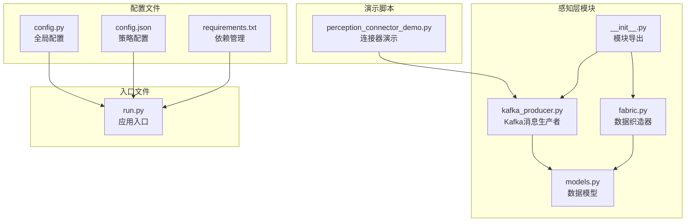
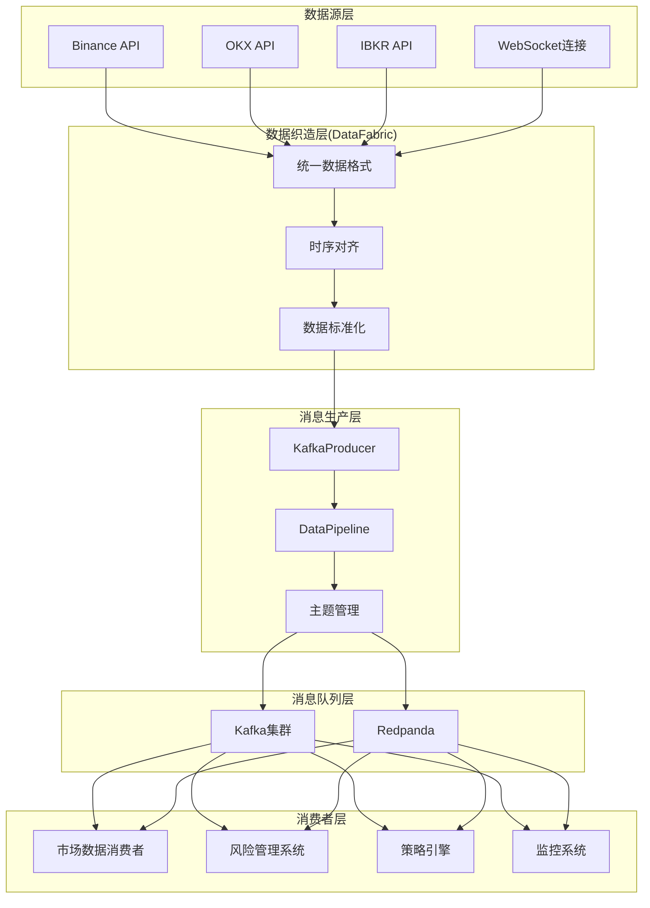
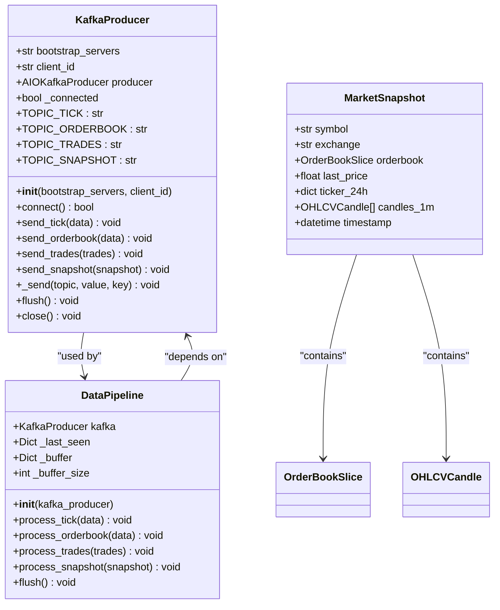
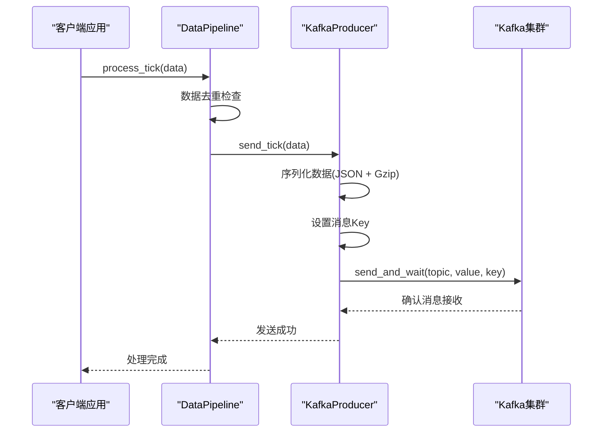
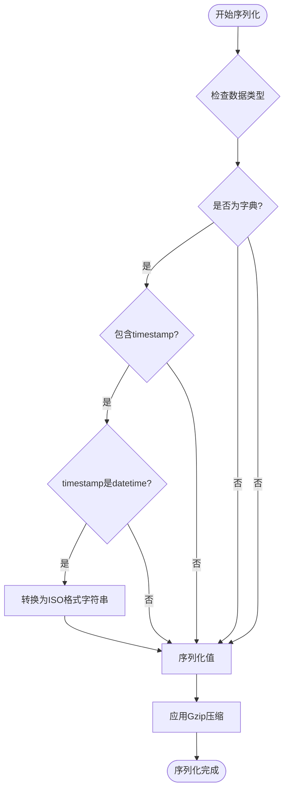
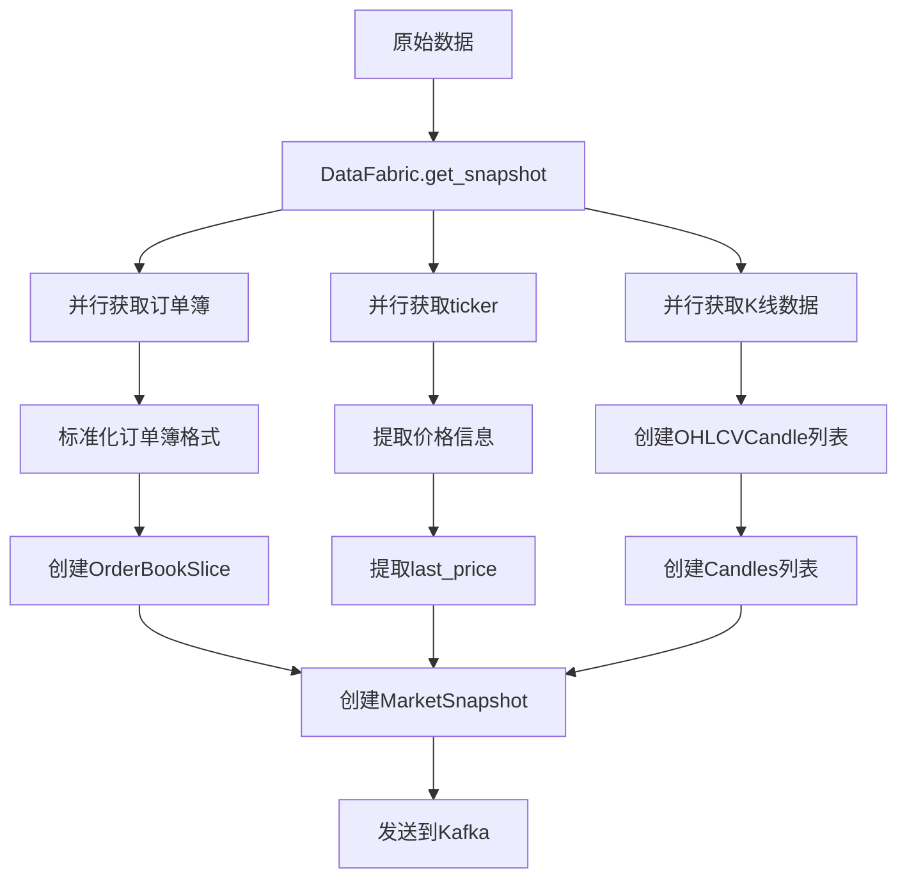
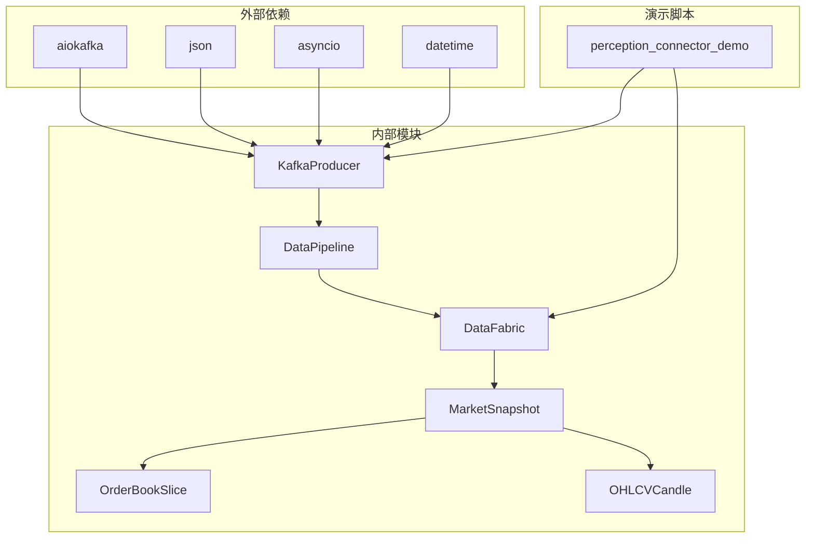
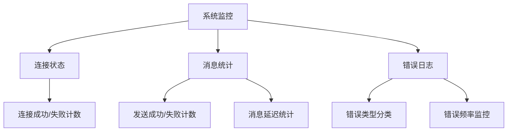

# Kafka消息生产者

<cite>
**本文档引用的文件**
- [kafka_producer.py](file://src/aetherlife/perception/kafka_producer.py)
- [fabric.py](file://src/aetherlife/perception/fabric.py)
- [models.py](file://src/aetherlife/perception/models.py)
- [perception/__init__.py](file://src/aetherlife/perception/__init__.py)
- [perception_connector_demo.py](file://scripts/perception_connector_demo.py)
- [config.py](file://src/aetherlife/config.py)
- [config.json](file://configs/config.json)
- [requirements.txt](file://requirements.txt)
- [run.py](file://src/aetherlife/run.py)
</cite>

## 目录
1. [简介](#简介)
2. [项目结构](#项目结构)
3. [核心组件](#核心组件)
4. [架构概览](#架构概览)
5. [详细组件分析](#详细组件分析)
6. [依赖关系分析](#依赖关系分析)
7. [性能考虑](#性能考虑)
8. [故障排除指南](#故障排除指南)
9. [结论](#结论)
10. [附录](#附录)

## 简介

本文档深入分析了AetherLife合约交易系统中的Kafka消息生产者实现。该系统通过Kafka实现了多源市场的统一数据流，支持实时市场数据的发布和订阅。文档涵盖了KafkaProducer类的设计与实现、消息序列化机制、分区策略、可靠性保证以及与DataFabric的集成方式。

系统采用异步编程模型，使用aiokafka库实现高性能的消息生产，支持多种数据类型的序列化和批量发送优化。通过DataFabric统一多源数据格式，将不同交易所的数据标准化为MarketSnapshot对象，然后通过KafkaProducer发布到不同的主题中。

## 项目结构

AetherLife项目的Kafka消息生产者位于感知层(perception)模块中，主要包含以下关键文件：



**图表来源**
- [kafka_producer.py](file://src/aetherlife/perception/kafka_producer.py#L1-L287)
- [fabric.py](file://src/aetherlife/perception/fabric.py#L1-L88)
- [models.py](file://src/aetherlife/perception/models.py#L1-L64)

**章节来源**
- [kafka_producer.py](file://src/aetherlife/perception/kafka_producer.py#L1-L287)
- [perception/__init__.py](file://src/aetherlife/perception/__init__.py#L1-L47)

## 核心组件

### KafkaProducer类

KafkaProducer是系统的核心组件，负责与Kafka集群建立连接并发送各种类型的数据消息。该类提供了完整的异步消息发送功能，支持多种数据类型的序列化和批量优化。

#### 主要特性
- **异步连接管理**：使用AIOKafkaProducer实现非阻塞连接
- **多种数据类型支持**：支持Tick、OrderBook、Trades和Snapshot数据
- **自动序列化**：JSON格式序列化，支持Gzip压缩
- **批量发送优化**：通过linger_ms参数优化批量发送
- **可靠性保证**：使用acks='all'确保消息持久化

#### 关键配置参数
- `bootstrap_servers`: Kafka集群地址，默认"localhost:9092"
- `client_id`: 客户端标识符，默认"aetherlife"
- `compression_type`: 压缩类型，使用Gzip
- `linger_ms`: 批量发送延迟，10毫秒
- `acks`: 确认级别，使用'all'等待所有副本确认

**章节来源**
- [kafka_producer.py](file://src/aetherlife/perception/kafka_producer.py#L26-L75)

### DataPipeline类

DataPipeline作为数据管道控制器，负责聚合来自多个数据源的数据，进行标准化处理后发送到Kafka。该类实现了数据去重、缓冲管理和批量处理功能。

#### 核心功能
- **数据去重**：基于时间戳和nonce字段防止重复数据
- **缓冲管理**：维护消息缓冲区，支持批量处理
- **标准化处理**：将不同格式的数据转换为统一格式
- **时序对齐**：确保数据的时间顺序正确性

**章节来源**
- [kafka_producer.py](file://src/aetherlife/perception/kafka_producer.py#L220-L279)

### 数据模型

系统定义了统一的数据模型来表示市场数据，确保不同交易所的数据能够被标准化处理。

#### 主要数据模型
- **MarketSnapshot**: 市场快照，包含完整的市场信息
- **OrderBookSlice**: 订单簿快照，包含买卖盘数据
- **OHLCVCandle**: K线数据，包含开盘、最高、最低、收盘价和成交量

**章节来源**
- [models.py](file://src/aetherlife/perception/models.py#L15-L64)

## 架构概览

系统采用分层架构设计，通过DataFabric统一多源数据，然后通过KafkaProducer发布到消息队列中。



**图表来源**
- [fabric.py](file://src/aetherlife/perception/fabric.py#L13-L82)
- [kafka_producer.py](file://src/aetherlife/perception/kafka_producer.py#L26-L75)

## 详细组件分析

### KafkaProducer类详细分析

KafkaProducer类实现了完整的异步消息生产功能，具有以下设计特点：

#### 类结构图



**图表来源**
- [kafka_producer.py](file://src/aetherlife/perception/kafka_producer.py#L26-L217)
- [models.py](file://src/aetherlife/perception/models.py#L54-L64)

#### 消息发送流程



**图表来源**
- [kafka_producer.py](file://src/aetherlife/perception/kafka_producer.py#L76-L204)

#### 数据序列化机制

系统实现了智能的数据序列化机制，确保不同类型的数据能够正确处理：



**图表来源**
- [kafka_producer.py](file://src/aetherlife/perception/kafka_producer.py#L185-L197)

**章节来源**
- [kafka_producer.py](file://src/aetherlife/perception/kafka_producer.py#L26-L217)

### DataFabric与Kafka集成

DataFabric负责将多源数据统一为MarketSnapshot格式，然后通过KafkaProducer发布到消息队列中。

#### 数据转换流程



**图表来源**
- [fabric.py](file://src/aetherlife/perception/fabric.py#L32-L82)
- [kafka_producer.py](file://src/aetherlife/perception/kafka_producer.py#L131-L170)

**章节来源**
- [fabric.py](file://src/aetherlife/perception/fabric.py#L13-L82)

### 主题管理与分区策略

系统定义了四个专门的主题来分类存储不同类型的数据：

| 主题名称 | 数据类型 | 分区键 | 使用场景 |
|---------|----------|--------|----------|
| market_data_tick | 实时Tick数据 | symbol | 价格变动监控 |
| market_data_orderbook | 订单簿数据 | symbol | 市场深度分析 |
| market_data_trades | 成交记录 | symbol | 成交行为分析 |
| market_data_snapshot | 完整市场快照 | symbol | 综合数据分析 |

分区策略采用消息键的哈希算法，确保相同symbol的数据发送到同一分区，保证数据的时序性和一致性。

**章节来源**
- [kafka_producer.py](file://src/aetherlife/perception/kafka_producer.py#L38-L42)
- [kafka_producer.py](file://src/aetherlife/perception/kafka_producer.py#L91-L129)

## 依赖关系分析

系统通过模块化设计实现了清晰的依赖关系，各组件之间的耦合度较低，便于维护和扩展。



**图表来源**
- [requirements.txt](file://requirements.txt#L37-L38)
- [kafka_producer.py](file://src/aetherlife/perception/kafka_producer.py#L13-L21)
- [perception/__init__.py](file://src/aetherlife/perception/__init__.py#L24-L29)

### 外部依赖管理

系统对外部依赖进行了明确的版本控制和管理：

- **aiokafka**: 异步Kafka客户端，版本要求>=0.10.0
- **kafka-python**: 同步Kafka客户端，版本要求>=2.0.2
- **ccxt**: 加密货币交易所接口，版本要求>=4.2.0

这些依赖确保了系统能够稳定地与Kafka集群通信，并支持多种数据源的接入。

**章节来源**
- [requirements.txt](file://requirements.txt#L37-L38)

## 性能考虑

### 异步编程模型

系统采用完全的异步编程模型，使用asyncio和await关键字实现非阻塞I/O操作。这种设计在高并发场景下能够显著提升性能，避免线程阻塞导致的资源浪费。

### 批量发送优化

通过设置linger_ms=10参数，系统能够在10毫秒内收集更多的消息进行批量发送，减少网络往返次数和服务器负载。这种批处理机制在高吞吐量场景下特别有效。

### 内存管理

DataPipeline类实现了智能的内存管理机制：
- 缓冲区大小限制为100条消息
- 自动清理过期数据
- 异步处理避免内存峰值

### 压缩策略

系统默认使用Gzip压缩，能够有效减少网络带宽占用和存储空间需求。对于高频数据流，压缩比通常能达到50%以上。

### 错误处理与重试

系统实现了完善的错误处理机制：
- 连接失败时的优雅降级
- 发送异常的记录和报告
- 自动重连机制
- 消息丢失的检测和处理

## 故障排除指南

### 常见问题诊断

#### Kafka连接问题
- **症状**: "Kafka 连接失败"日志
- **原因**: Kafka服务器不可达或配置错误
- **解决方案**: 检查bootstrap_servers配置，确认Kafka服务状态

#### 消息发送失败
- **症状**: "Kafka 发送失败"日志
- **原因**: 网络问题或主题不存在
- **解决方案**: 检查Kafka集群状态，确认主题已创建

#### 序列化错误
- **症状**: "消息序列化失败"日志
- **原因**: 数据格式不符合预期
- **解决方案**: 检查输入数据的结构和类型

### 监控和调试

系统提供了详细的日志记录功能，可以通过以下方式监控系统状态：



**图表来源**
- [kafka_producer.py](file://src/aetherlife/perception/kafka_producer.py#L68-L74)
- [kafka_producer.py](file://src/aetherlife/perception/kafka_producer.py#L199-L204)

### 性能调优建议

#### Kafka配置优化
- **分区数量**: 根据并发需求调整分区数量
- **副本数量**: 在可靠性要求高的场景下增加副本数
- **压缩类型**: 根据数据特征选择合适的压缩算法

#### 应用层优化
- **批量大小**: 根据网络条件调整批量大小
- **超时设置**: 合理设置连接和请求超时
- **重试策略**: 配置指数退避重试机制

**章节来源**
- [kafka_producer.py](file://src/aetherlife/perception/kafka_producer.py#L57-L64)

## 结论

AetherLife系统的Kafka消息生产者实现了高性能、可靠的异步消息传输功能。通过模块化的架构设计和智能的数据处理机制，系统能够有效地处理多源市场的实时数据流。

### 主要优势
- **异步非阻塞**: 采用asyncio实现高并发处理
- **数据标准化**: 统一多源数据格式，便于后续处理
- **可靠性保证**: 通过acks='all'确保消息持久化
- **性能优化**: 批量发送和压缩技术提升吞吐量
- **错误处理**: 完善的异常处理和监控机制

### 技术亮点
- 智能数据去重机制，避免重复数据传输
- 分层架构设计，组件职责清晰
- 异步编程模型，充分利用现代硬件性能
- 完善的配置管理，支持灵活部署

该系统为合约交易系统提供了坚实的数据基础设施，能够支持高并发、低延迟的市场数据处理需求。

## 附录

### 配置示例

#### 基本配置
```python
# 创建Kafka生产者实例
producer = KafkaProducer(
    bootstrap_servers="localhost:9092",
    client_id="aetherlife"
)
```

#### 数据管道配置
```python
# 创建数据管道
pipeline = await create_data_pipeline(kafka_servers="localhost:9092")
```

#### 高级配置选项
- **连接参数**: bootstrap_servers, client_id, request_timeout_ms
- **性能参数**: linger_ms, batch_size, max_in_flight_requests_per_connection
- **可靠性参数**: acks, retries, enable_idempotence

### 使用示例

#### 发送Tick数据
```python
# 发送实时价格数据
await pipeline.process_tick({
    "symbol": "BTCUSDT",
    "exchange": "binance",
    "last_price": 45000.0,
    "bid_price": 44999.0,
    "ask_price": 45001.0,
    "volume": 100.0,
    "timestamp": datetime.utcnow()
})
```

#### 发送订单簿数据
```python
# 发送订单簿快照
await pipeline.process_orderbook({
    "symbol": "BTCUSDT",
    "exchange": "binance",
    "bids": [(44999.0, 1.0), (44998.0, 2.0)],
    "asks": [(45001.0, 1.0), (45002.0, 2.0)],
    "timestamp": datetime.utcnow(),
    "nonce": 12345
})
```

#### 发送完整快照
```python
# 发送完整市场快照
snapshot = await fabric.get_snapshot("BTCUSDT")
await pipeline.process_snapshot(snapshot)
```

**章节来源**
- [perception_connector_demo.py](file://scripts/perception_connector_demo.py#L137-L182)
- [kafka_producer.py](file://src/aetherlife/perception/kafka_producer.py#L76-L170)