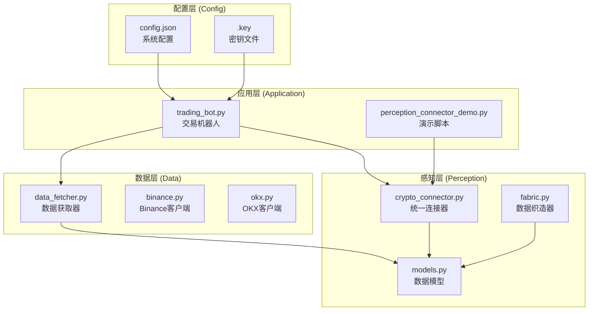
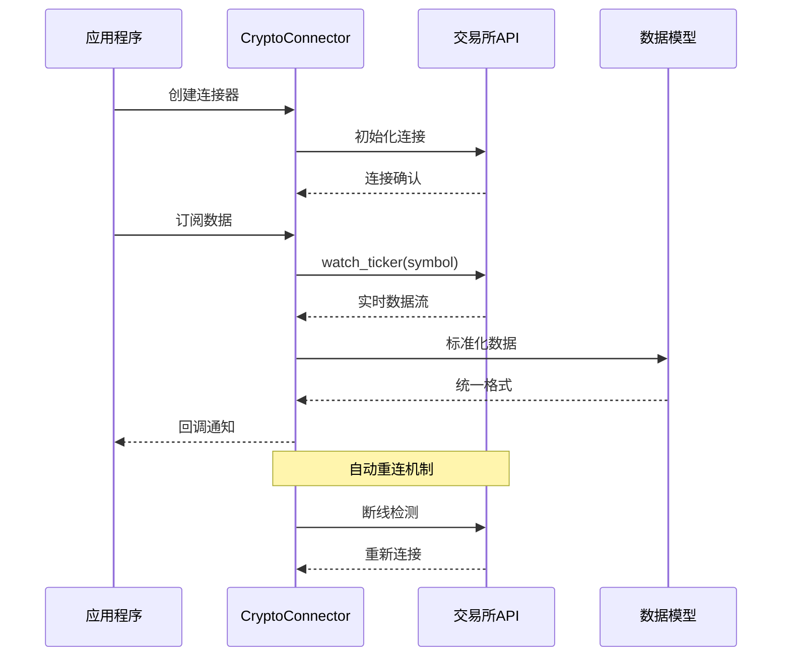
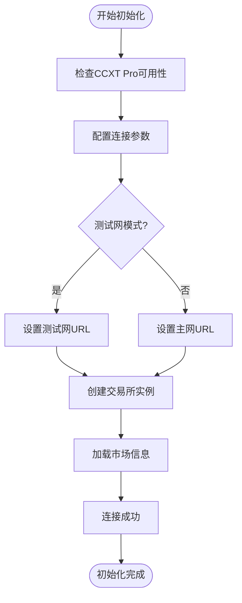
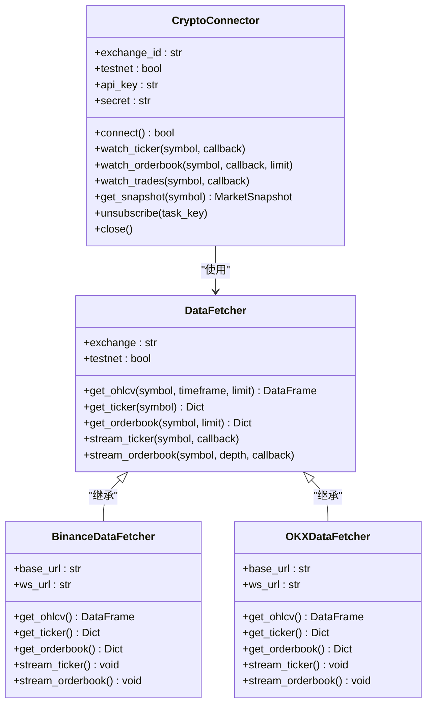
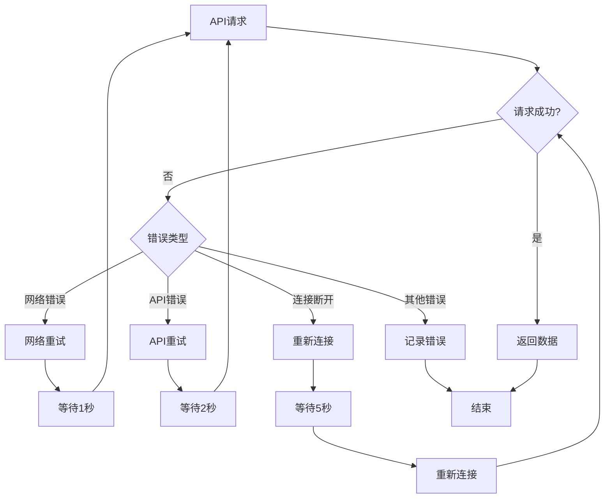
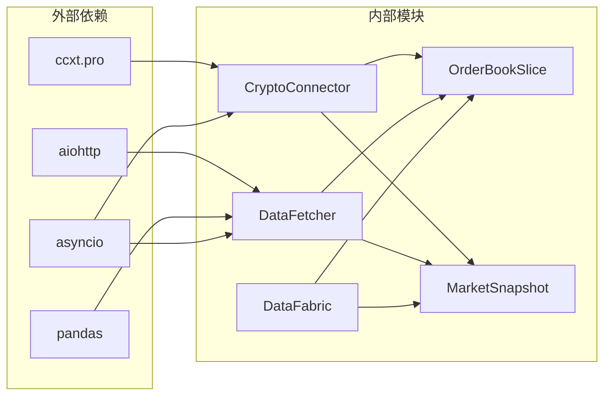

# 加密货币数据连接器

<cite>
**本文档引用的文件**
- [crypto_connector.py](file://src/aetherlife/perception/crypto_connector.py)
- [data_fetcher.py](file://src/data/data_fetcher.py)
- [models.py](file://src/aetherlife/perception/models.py)
- [fabric.py](file://src/aetherlife/perception/fabric.py)
- [binance.py](file://src/data/binance.py)
- [okx.py](file://src/data/okx.py)
- [perception_connector_demo.py](file://scripts/perception_connector_demo.py)
- [trading_bot.py](file://src/trading_bot.py)
- [config.json](file://configs/config.json)
- [.key](file://configs/.key)
- [logger.py](file://src/utils/logger.py)
</cite>

## 目录
1. [简介](#简介)
2. [项目结构](#项目结构)
3. [核心组件](#核心组件)
4. [架构概览](#架构概览)
5. [详细组件分析](#详细组件分析)
6. [依赖关系分析](#依赖关系分析)
7. [性能考虑](#性能考虑)
8. [故障排除指南](#故障排除指南)
9. [结论](#结论)

## 简介

加密货币数据连接器是一个基于CCXT Pro的高性能实时数据获取系统，专为加密货币交易系统设计。该系统支持多个主流交易所（Binance、Bybit、OKX）的实时数据流，提供统一的API接口来获取市场快照、实时报价、订单簿和成交记录。

该连接器采用异步编程模型，支持自动重连、错误处理和资源管理，确保在高并发环境下稳定运行。系统通过标准化的数据格式，为上层策略引擎提供一致的数据接口。

## 项目结构

项目采用模块化设计，主要包含以下关键模块：



**图表来源**
- [crypto_connector.py](file://src/aetherlife/perception/crypto_connector.py#L1-L369)
- [data_fetcher.py](file://src/data/data_fetcher.py#L1-L434)
- [models.py](file://src/aetherlife/perception/models.py#L1-L64)

**章节来源**
- [crypto_connector.py](file://src/aetherlife/perception/crypto_connector.py#L1-L50)
- [data_fetcher.py](file://src/data/data_fetcher.py#L1-L50)

## 核心组件

### CryptoConnector 类

CryptoConnector是整个系统的中央控制器，负责管理与各个交易所的连接和数据流。

**主要功能特性：**
- 多交易所支持（Binance、Bybit、OKX）
- 实时数据订阅（Ticker、OrderBook、Trades）
- 自动重连机制
- 统一数据格式标准化
- 异步任务管理

**关键属性：**
- `exchange_id`: 交易所标识符
- `testnet`: 测试网模式开关
- `api_key/secret`: 认证凭据
- `_connected`: 连接状态
- `_watch_tasks`: 监听任务字典
- `_callbacks`: 回调函数列表

**章节来源**
- [crypto_connector.py](file://src/aetherlife/perception/crypto_connector.py#L23-L86)

### DataFetcher 抽象基类

DataFetcher定义了数据获取的标准接口，为不同交易所提供统一的抽象层。

**核心方法：**
- `get_ohlcv()`: 获取K线数据
- `get_ticker()`: 获取24小时行情
- `get_orderbook()`: 获取订单簿
- `stream_ticker()`: 订阅实时行情
- `stream_orderbook()`: 订阅实时订单簿

**章节来源**
- [data_fetcher.py](file://src/data/data_fetcher.py#L17-L71)

### 数据模型标准化

系统定义了统一的数据模型来标准化来自不同交易所的数据格式。

**核心数据模型：**
- `OrderBookSlice`: 订单簿快照
- `OHLCVCandle`: K线数据
- `MarketSnapshot`: 市场快照

**章节来源**
- [models.py](file://src/aetherlife/perception/models.py#L15-L64)

## 架构概览

系统采用分层架构设计，实现了数据获取、标准化和应用层的清晰分离。



**图表来源**
- [crypto_connector.py](file://src/aetherlife/perception/crypto_connector.py#L50-L154)
- [data_fetcher.py](file://src/data/data_fetcher.py#L188-L234)

## 详细组件分析

### CryptoConnector 初始化流程

连接器的初始化过程包含多个关键步骤：



**图表来源**
- [crypto_connector.py](file://src/aetherlife/perception/crypto_connector.py#L50-L86)

**章节来源**
- [crypto_connector.py](file://src/aetherlife/perception/crypto_connector.py#L35-L86)

### 认证机制

系统支持多种认证方式，主要针对Binance和OKX交易所：

**认证流程：**
1. API Key验证
2. Secret Key签名
3. URL配置（测试网/主网）
4. 速率限制设置

**章节来源**
- [crypto_connector.py](file://src/aetherlife/perception/crypto_connector.py#L53-L57)

### API调用封装

系统为不同类型的API调用提供了统一的封装：



**图表来源**
- [crypto_connector.py](file://src/aetherlife/perception/crypto_connector.py#L23-L369)
- [data_fetcher.py](file://src/data/data_fetcher.py#L17-L407)

**章节来源**
- [crypto_connector.py](file://src/aetherlife/perception/crypto_connector.py#L87-L276)
- [data_fetcher.py](file://src/data/data_fetcher.py#L73-L397)

### 数据格式标准化

系统实现了跨交易所的数据格式标准化，确保上层应用获得一致的数据接口：

**标准化字段：**
- `symbol`: 交易对标识
- `exchange`: 交易所名称
- `timestamp`: 数据时间戳
- `last_price`: 最新价格
- `bid_price/ask_price`: 买价/卖价
- `bids/asks`: 订单簿买卖盘

**章节来源**
- [crypto_connector.py](file://src/aetherlife/perception/crypto_connector.py#L123-L137)
- [crypto_connector.py](file://src/aetherlife/perception/crypto_connector.py#L192-L199)

### 错误重试机制

系统实现了多层次的错误处理和重试机制：



**图表来源**
- [crypto_connector.py](file://src/aetherlife/perception/crypto_connector.py#L146-L154)
- [crypto_connector.py](file://src/aetherlife/perception/crypto_connector.py#L208-L214)

**章节来源**
- [crypto_connector.py](file://src/aetherlife/perception/crypto_connector.py#L146-L154)
- [crypto_connector.py](file://src/aetherlife/perception/crypto_connector.py#L208-L214)

### 生命周期管理

系统提供了完整的资源生命周期管理：

**初始化阶段：**
1. 创建连接器实例
2. 验证CCXT Pro依赖
3. 配置连接参数
4. 建立交易所连接
5. 加载市场信息

**运行阶段：**
1. 管理订阅任务
2. 处理数据回调
3. 监控连接状态
4. 执行自动重连

**关闭阶段：**
1. 取消所有订阅任务
2. 关闭WebSocket连接
3. 清理回调函数
4. 释放资源

**章节来源**
- [crypto_connector.py](file://src/aetherlife/perception/crypto_connector.py#L342-L360)

## 依赖关系分析

系统依赖关系清晰，遵循单一职责原则：



**图表来源**
- [crypto_connector.py](file://src/aetherlife/perception/crypto_connector.py#L11-L18)
- [data_fetcher.py](file://src/data/data_fetcher.py#L6-L12)

**章节来源**
- [crypto_connector.py](file://src/aetherlife/perception/crypto_connector.py#L11-L18)
- [data_fetcher.py](file://src/data/data_fetcher.py#L6-L12)

## 性能考虑

### 异步并发优化

系统采用异步编程模型，充分利用Python的异步I/O特性：

**性能优化点：**
- 使用`asyncio.gather()`并行获取数据
- 异步WebSocket连接管理
- 非阻塞的回调处理
- 内存高效的批量数据处理

### 资源管理

**内存优化：**
- 及时清理已完成的任务
- 合理的缓存策略
- 避免内存泄漏

**网络优化：**
- 连接池复用
- 适当的超时设置
- 错误重试退避算法

## 故障排除指南

### 常见问题及解决方案

**连接失败：**
- 检查网络连接状态
- 验证API密钥有效性
- 确认测试网/主网配置正确
- 查看防火墙设置

**数据延迟：**
- 检查本地网络延迟
- 考虑使用更近的服务器节点
- 优化订阅数量

**内存泄漏：**
- 确保正确调用`close()`方法
- 检查回调函数的生命周期
- 定期清理未使用的订阅

**章节来源**
- [crypto_connector.py](file://src/aetherlife/perception/crypto_connector.py#L342-L360)
- [logger.py](file://src/utils/logger.py#L1-L34)

### 调试技巧

**启用详细日志：**
```python
import logging
logging.basicConfig(level=logging.DEBUG)
```

**监控连接状态：**
- 使用`get_snapshot()`验证数据获取
- 检查回调函数是否正常触发
- 监控任务数量和内存使用

## 结论

加密货币数据连接器是一个设计精良、功能完备的实时数据获取系统。它通过统一的接口抽象了不同交易所的差异，提供了稳定可靠的数据服务。

**主要优势：**
- 支持多交易所实时数据流
- 完善的错误处理和重连机制
- 标准化的数据格式
- 良好的性能和可扩展性
- 清晰的架构设计

**适用场景：**
- 高频交易系统
- 实时数据分析平台
- 多交易所套利系统
- 量化研究平台

该系统为构建复杂的加密货币交易生态系统奠定了坚实的基础，其模块化设计和标准化接口使其易于维护和扩展。