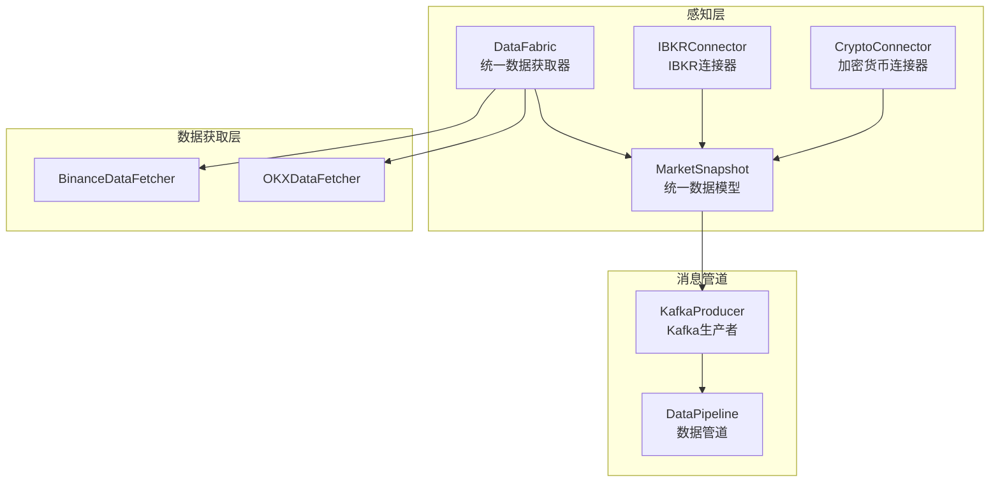
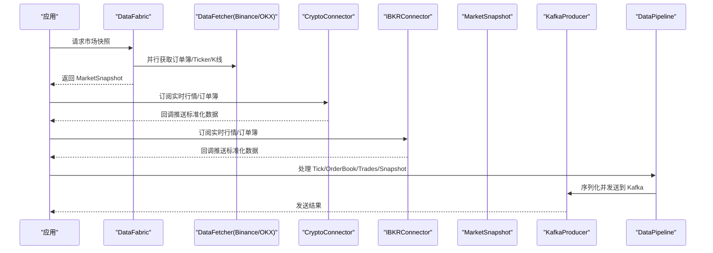
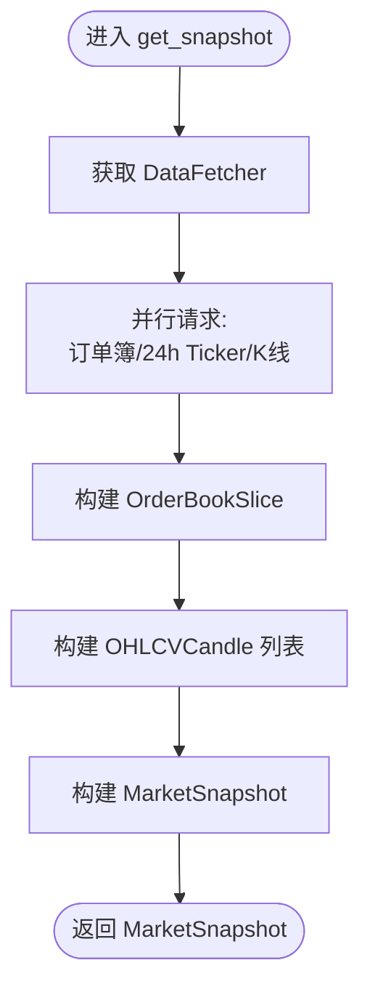
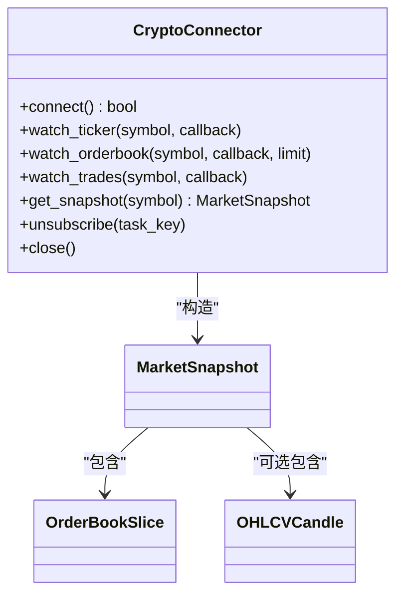
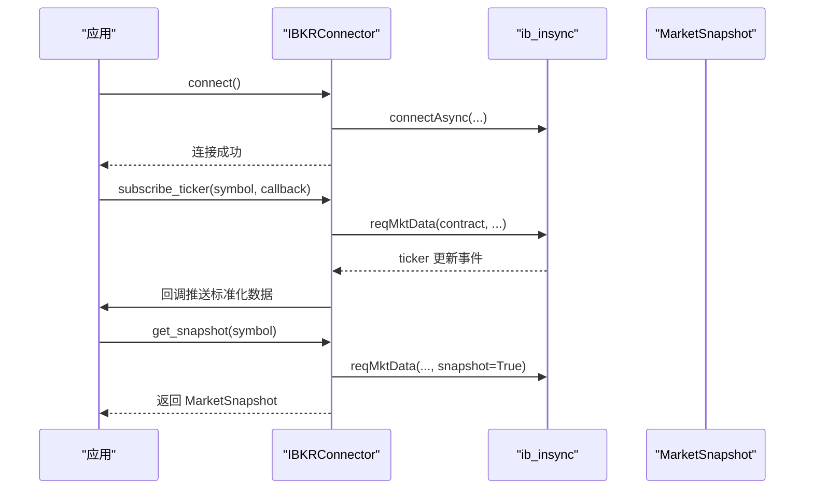
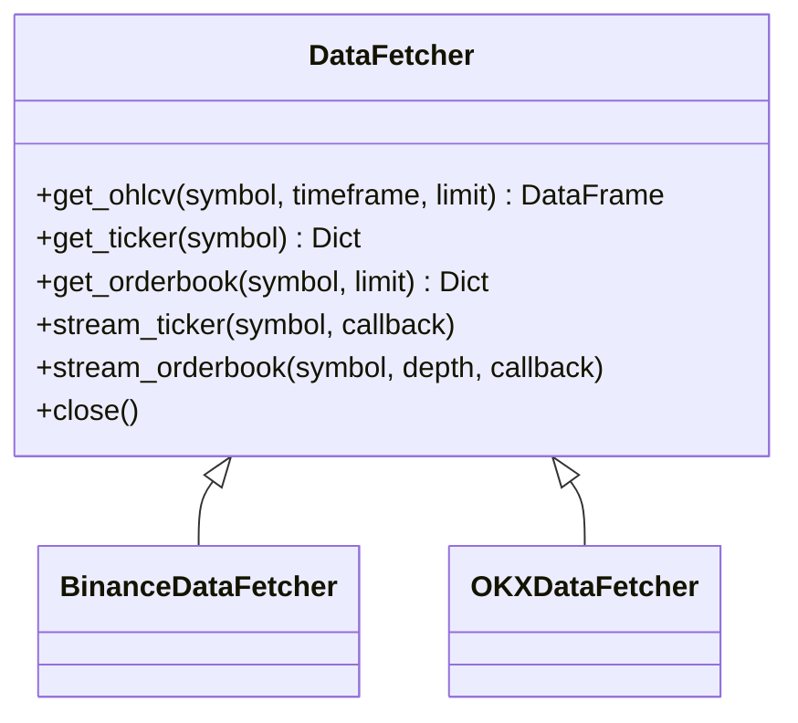
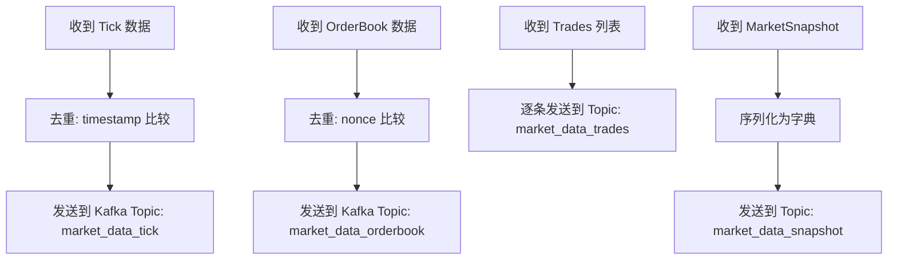
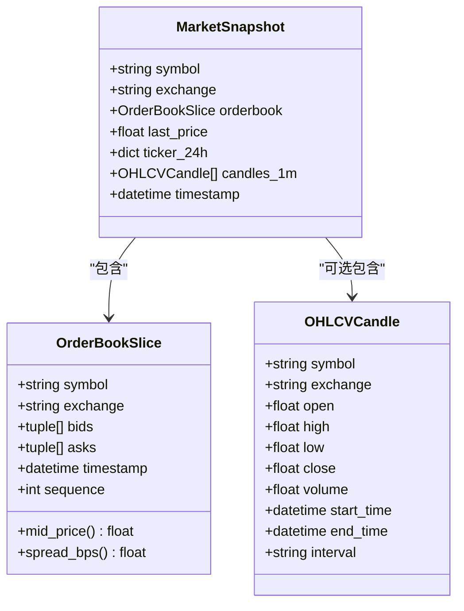
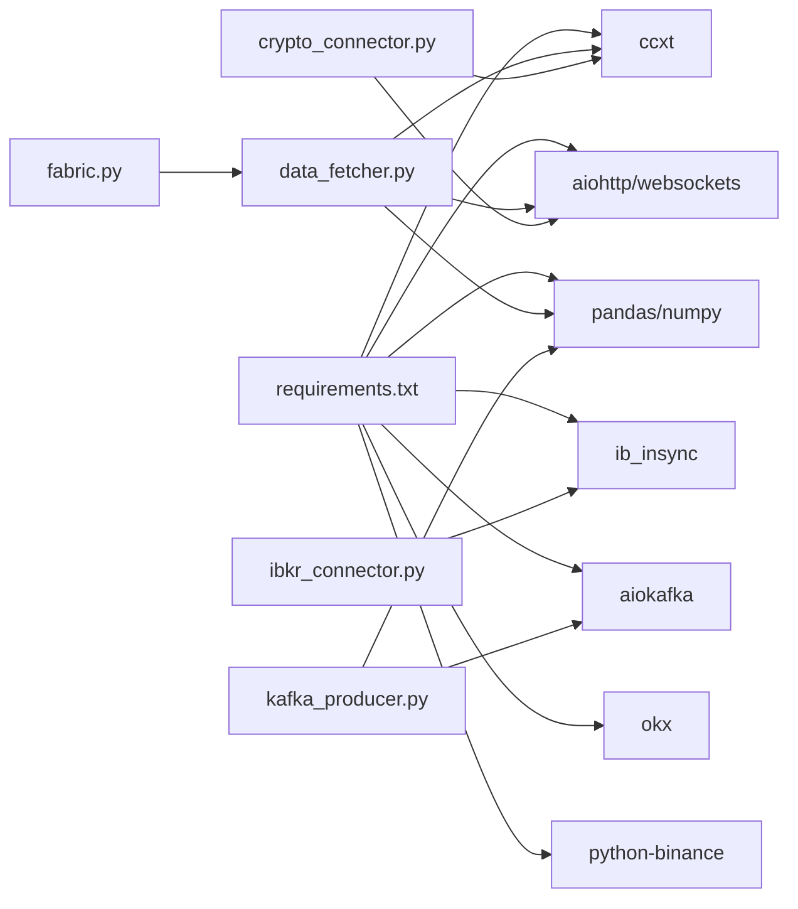

# 感知层

<cite>
**本文引用的文件**
- [src/aetherlife/perception/fabric.py](file://src/aetherlife/perception/fabric.py)
- [src/aetherlife/perception/models.py](file://src/aetherlife/perception/models.py)
- [src/aetherlife/perception/crypto_connector.py](file://src/aetherlife/perception/crypto_connector.py)
- [src/aetherlife/perception/ibkr_connector.py](file://src/aetherlife/perception/ibkr_connector.py)
- [src/aetherlife/perception/kafka_producer.py](file://src/aetherlife/perception/kafka_producer.py)
- [src/data/data_fetcher.py](file://src/data/data_fetcher.py)
- [scripts/perception_connector_demo.py](file://scripts/perception_connector_demo.py)
- [configs/config.json](file://configs/config.json)
- [src/trading_bot.py](file://src/trading_bot.py)
- [requirements.txt](file://requirements.txt)
</cite>

## 目录
1. [简介](#简介)
2. [项目结构](#项目结构)
3. [核心组件](#核心组件)
4. [架构总览](#架构总览)
5. [详细组件分析](#详细组件分析)
6. [依赖关系分析](#依赖关系分析)
7. [性能考虑](#性能考虑)
8. [故障排查指南](#故障排查指南)
9. [结论](#结论)
10. [附录](#附录)

## 简介
本文件面向量化交易系统的“感知层”，系统性阐述如何从多数据源（Binance、OKX、IBKR 等）采集市场数据，统一为 MarketSnapshot 数据模型，并通过 Kafka/Redpanda 管道进行实时数据流发布。文档覆盖 DataFabric 数据获取器的设计模式、实时订单簿处理机制、Kafka 生产者与数据管道的去重与缓冲策略、错误处理与性能优化建议，并提供集成新数据源与自定义数据格式的实践指引。

## 项目结构
感知层相关代码主要位于 src/aetherlife/perception 与 src/data 下，配合 scripts 中的演示脚本与 configs 中的系统配置，形成从连接器、数据获取、模型统一到消息发布的完整链路。

图表来源
- [src/aetherlife/perception/crypto_connector.py](file://src/aetherlife/perception/crypto_connector.py#L23-L369)
- [src/aetherlife/perception/ibkr_connector.py](file://src/aetherlife/perception/ibkr_connector.py#L36-L323)
- [src/aetherlife/perception/fabric.py](file://src/aetherlife/perception/fabric.py#L13-L88)
- [src/data/data_fetcher.py](file://src/data/data_fetcher.py#L17-L407)
- [src/aetherlife/perception/kafka_producer.py](file://src/aetherlife/perception/kafka_producer.py#L26-L287)

章节来源
- [src/aetherlife/perception/fabric.py](file://src/aetherlife/perception/fabric.py#L1-L88)
- [src/aetherlife/perception/models.py](file://src/aetherlife/perception/models.py#L1-L64)
- [src/aetherlife/perception/crypto_connector.py](file://src/aetherlife/perception/crypto_connector.py#L1-L369)
- [src/aetherlife/perception/ibkr_connector.py](file://src/aetherlife/perception/ibkr_connector.py#L1-L323)
- [src/aetherlife/perception/kafka_producer.py](file://src/aetherlife/perception/kafka_producer.py#L1-L287)
- [src/data/data_fetcher.py](file://src/data/data_fetcher.py#L1-L434)

## 核心组件
- DataFabric：统一多源数据获取入口，负责并行抓取订单簿、Ticker、K线，并统一为 MarketSnapshot。
- CryptoConnector：基于 CCXT Pro 的加密货币连接器，支持多交易所 WebSocket 实时订阅与单次快照获取。
- IBKRConnector：基于 ib_insync 的 IBKR 连接器，支持股票、期货、外汇与 A 股（Stock Connect）实时行情与快照。
- DataFetcher（BinanceDataFetcher、OKXDataFetcher）：HTTP/WS 数据获取器，提供 REST 与 WebSocket 两种接入方式。
- KafkaProducer/DataPipeline：Kafka 生产者与数据管道，负责消息序列化、去重、缓冲与批量发送。
- MarketSnapshot/OrderBookSlice/OHLCVCandle：统一数据模型，确保跨交易所一致性。

章节来源
- [src/aetherlife/perception/fabric.py](file://src/aetherlife/perception/fabric.py#L13-L88)
- [src/aetherlife/perception/models.py](file://src/aetherlife/perception/models.py#L15-L64)
- [src/aetherlife/perception/crypto_connector.py](file://src/aetherlife/perception/crypto_connector.py#L23-L369)
- [src/aetherlife/perception/ibkr_connector.py](file://src/aetherlife/perception/ibkr_connector.py#L36-L323)
- [src/data/data_fetcher.py](file://src/data/data_fetcher.py#L17-L407)
- [src/aetherlife/perception/kafka_producer.py](file://src/aetherlife/perception/kafka_producer.py#L26-L287)

## 架构总览
感知层采用“连接器 + 数据获取器 + 统一模型 + 消息管道”的分层设计。DataFabric 作为统一入口，按需并行拉取多源数据；CryptoConnector/IBKRConnector 提供实时订阅能力；DataFetcher 提供 REST/WS 数据通道；最终由 KafkaProducer/DataPipeline 将标准化数据发布至 Kafka/Redpanda。

图表来源
- [src/aetherlife/perception/fabric.py](file://src/aetherlife/perception/fabric.py#L32-L82)
- [src/data/data_fetcher.py](file://src/data/data_fetcher.py#L40-L71)
- [src/aetherlife/perception/crypto_connector.py](file://src/aetherlife/perception/crypto_connector.py#L87-L276)
- [src/aetherlife/perception/ibkr_connector.py](file://src/aetherlife/perception/ibkr_connector.py#L158-L284)
- [src/aetherlife/perception/kafka_producer.py](file://src/aetherlife/perception/kafka_producer.py#L76-L274)

## 详细组件分析

### DataFabric 数据获取器
- 设计模式：工厂 + 组合，按需延迟创建 DataFetcher；统一输出 MarketSnapshot。
- 并行策略：使用 asyncio.gather 并行获取订单簿、Ticker、K线，提升吞吐。
- 数据清洗：统一 bids/asks 为 (price, qty) 元组；构造 OrderBookSlice 与 OHLCVCandle。
- 生命周期：提供 close 方法释放底层资源。

图表来源
- [src/aetherlife/perception/fabric.py](file://src/aetherlife/perception/fabric.py#L23-L82)

章节来源
- [src/aetherlife/perception/fabric.py](file://src/aetherlife/perception/fabric.py#L13-L88)

### CryptoConnector 加密货币连接器
- 多交易所支持：通过 ccxtpro 动态选择交易所类，支持 Binance/Bybit/OKX 等。
- 实时订阅：watch_ticker/watch_orderbook/watch_trades，内部维护回调与任务列表，支持自动重连。
- 快照获取：get_snapshot 使用 fetch_ticker/fetch_order_book 并行获取，构造 MarketSnapshot。
- 资源管理：close 取消所有任务并关闭连接。

图表来源
- [src/aetherlife/perception/crypto_connector.py](file://src/aetherlife/perception/crypto_connector.py#L23-L369)
- [src/aetherlife/perception/models.py](file://src/aetherlife/perception/models.py#L15-L64)

章节来源
- [src/aetherlife/perception/crypto_connector.py](file://src/aetherlife/perception/crypto_connector.py#L23-L369)
- [src/aetherlife/perception/models.py](file://src/aetherlife/perception/models.py#L15-L64)

### IBKRConnector 连接器
- 连接管理：connect 通过 ib_insync 连接 TWS/Gateway，断线自动重连。
- 合约创建：create_contract 支持 STK/FUT/CASH，A 股通过 SEHK（Stock Connect）适配。
- 实时订阅：subscribe_ticker 订阅行情，_on_ticker_update 标准化推送。
- 快照获取：get_snapshot 使用 reqMktData 快照模式，构造 MarketSnapshot 并取消订阅。

图表来源
- [src/aetherlife/perception/ibkr_connector.py](file://src/aetherlife/perception/ibkr_connector.py#L59-L284)

章节来源
- [src/aetherlife/perception/ibkr_connector.py](file://src/aetherlife/perception/ibkr_connector.py#L36-L323)

### DataFetcher 数据获取器（Binance/OKX）
- BinanceDataFetcher：REST 获取 K线/Ticker/订单簿；WebSocket 订阅 ticker/depth。
- OKXDataFetcher：REST 获取 K线/Ticker/订单簿；WebSocket 订阅 tickers/books。
- 统一接口：get_ohlcv/get_ticker/get_orderbook/stream_ticker/stream_orderbook。

图表来源
- [src/data/data_fetcher.py](file://src/data/data_fetcher.py#L17-L407)

章节来源
- [src/data/data_fetcher.py](file://src/data/data_fetcher.py#L73-L407)

### KafkaProducer 与 DataPipeline
- KafkaProducer：连接 Kafka/Redpanda，支持 Tick/OrderBook/Trades/Snapshot 多 Topic 发布；内置 JSON 序列化与 gzip 压缩。
- DataPipeline：提供去重（基于 timestamp/nonce）、缓冲与批量发送；统一处理来自多源的数据。

图表来源
- [src/aetherlife/perception/kafka_producer.py](file://src/aetherlife/perception/kafka_producer.py#L76-L274)

章节来源
- [src/aetherlife/perception/kafka_producer.py](file://src/aetherlife/perception/kafka_producer.py#L26-L287)

### MarketSnapshot 数据模型
- 统一字段：symbol/exchange、orderbook（可选）、last_price、ticker_24h、candles_1m（可选）、timestamp。
- OrderBookSlice：bids/asks 为 (price, qty) 列表，提供 mid_price/spread_bps 辅助计算。
- OHLCVCandle：包含 open/high/low/close/volume 与时间区间。

图表来源
- [src/aetherlife/perception/models.py](file://src/aetherlife/perception/models.py#L15-L64)

章节来源
- [src/aetherlife/perception/models.py](file://src/aetherlife/perception/models.py#L1-L64)

## 依赖关系分析
- 运行时依赖：aiohttp/websockets/pandas/ccxt/ib_insync/aiokafka 等。
- 模块耦合：DataFabric 依赖 DataFetcher；CryptoConnector/IBKRConnector 独立工作；KafkaProducer/DataPipeline 与感知层解耦，仅依赖统一模型。

图表来源
- [requirements.txt](file://requirements.txt#L1-L92)
- [src/aetherlife/perception/fabric.py](file://src/aetherlife/perception/fabric.py#L1-L11)
- [src/data/data_fetcher.py](file://src/data/data_fetcher.py#L1-L14)
- [src/aetherlife/perception/crypto_connector.py](file://src/aetherlife/perception/crypto_connector.py#L1-L18)
- [src/aetherlife/perception/ibkr_connector.py](file://src/aetherlife/perception/ibkr_connector.py#L1-L23)
- [src/aetherlife/perception/kafka_producer.py](file://src/aetherlife/perception/kafka_producer.py#L1-L23)

章节来源
- [requirements.txt](file://requirements.txt#L1-L92)

## 性能考虑
- 并行抓取：DataFabric 使用 asyncio.gather 并行获取订单簿、Ticker、K线，减少等待时间。
- WebSocket 实时订阅：CryptoConnector/IBKRConnector 通过 WebSocket 实时推送，降低轮询开销。
- Kafka 批量发送：KafkaProducer 使用 linger_ms 与 gzip 压缩，提高吞吐与带宽利用率。
- 去重与缓冲：DataPipeline 基于 timestamp/nonce 去重，减少重复消息；缓冲队列降低突发压力。
- 资源复用：DataFetcher 复用 aiohttp 会话与 WebSocket 连接，避免频繁握手。

章节来源
- [src/aetherlife/perception/fabric.py](file://src/aetherlife/perception/fabric.py#L37-L41)
- [src/aetherlife/perception/kafka_producer.py](file://src/aetherlife/perception/kafka_producer.py#L57-L64)
- [src/aetherlife/perception/crypto_connector.py](file://src/aetherlife/perception/crypto_connector.py#L116-L214)
- [src/aetherlife/perception/ibkr_connector.py](file://src/aetherlife/perception/ibkr_connector.py#L96-L122)

## 故障排查指南
- 连接失败
  - CryptoConnector：检查 ccxt.pro 是否安装，网络与测试网地址配置。
  - IBKRConnector：确认 TWS/Gateway 已启动，端口与只读模式配置正确。
  - KafkaProducer：确认 Kafka/Redpanda 地址可达，Topic 存在。
- 数据异常
  - DataFetcher：检查 REST/WS URL 与参数，关注 API 返回码与空响应。
  - DataFabric：确认并行请求的超时设置与异常捕获。
- 消息丢失/重复
  - KafkaProducer：检查 acks 配置与序列化异常日志。
  - DataPipeline：核对去重键（timestamp/nonce）与缓冲刷新逻辑。
- 性能问题
  - 增加并发度与调整 Kafka linger_ms；优化数据模型序列化；启用 gzip 压缩。

章节来源
- [src/aetherlife/perception/crypto_connector.py](file://src/aetherlife/perception/crypto_connector.py#L37-L85)
- [src/aetherlife/perception/ibkr_connector.py](file://src/aetherlife/perception/ibkr_connector.py#L59-L86)
- [src/aetherlife/perception/kafka_producer.py](file://src/aetherlife/perception/kafka_producer.py#L54-L74)
- [src/data/data_fetcher.py](file://src/data/data_fetcher.py#L95-L100)

## 结论
感知层以 DataFabric 为核心，结合 CryptoConnector/IBKRConnector 的实时订阅能力与 DataFetcher 的 REST/WS 通道，统一输出 MarketSnapshot，并通过 KafkaProducer/DataPipeline 实现高吞吐、低延迟的数据流发布。该设计具备良好的扩展性与稳定性，便于后续接入更多数据源与定制化数据格式。

## 附录

### 如何集成新的数据源
- 新增 DataFetcher 子类
  - 在 src/data/data_fetcher.py 中新增子类，实现 get_ohlcv/get_ticker/get_orderbook/stream_ticker/stream_orderbook。
  - 在 create_data_fetcher 中注册新交易所。
- 在 DataFabric 中使用
  - 通过 DataFabric._get_fetcher 获取新 fetcher，保持与现有并行抓取一致的调用方式。
- 示例参考
  - BinanceDataFetcher/OKXDataFetcher 的实现与工厂函数。

章节来源
- [src/data/data_fetcher.py](file://src/data/data_fetcher.py#L400-L407)
- [src/aetherlife/perception/fabric.py](file://src/aetherlife/perception/fabric.py#L23-L27)

### 如何自定义数据格式
- 统一模型扩展
  - 在 MarketSnapshot/OrderBookSlice/OHLCVCandle 中添加字段或派生指标（如 spread_bps）。
- KafkaProducer 序列化
  - 在 KafkaProducer.send_* 中扩展消息体字段，确保序列化兼容。
- DataPipeline 处理
  - 在 DataPipeline.process_* 中增加去重与缓冲策略，保证时序一致性。

章节来源
- [src/aetherlife/perception/models.py](file://src/aetherlife/perception/models.py#L15-L64)
- [src/aetherlife/perception/kafka_producer.py](file://src/aetherlife/perception/kafka_producer.py#L131-L170)
- [src/aetherlife/perception/kafka_producer.py](file://src/aetherlife/perception/kafka_producer.py#L237-L270)

### 配置与运行示例
- 配置文件
  - configs/config.json 提供 exchange/testnet/symbols/timeframe 等基础配置。
- 运行演示
  - scripts/perception_connector_demo.py 展示 Crypto/IBKR/Kafka 的集成使用。
- 主程序
  - src/trading_bot.py 展示了策略与风控如何消费感知层提供的数据。

章节来源
- [configs/config.json](file://configs/config.json#L1-L28)
- [scripts/perception_connector_demo.py](file://scripts/perception_connector_demo.py#L1-L211)
- [src/trading_bot.py](file://src/trading_bot.py#L323-L346)