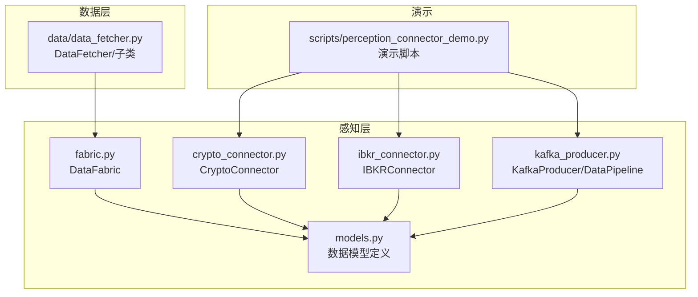
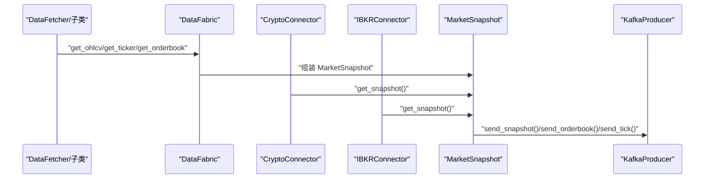
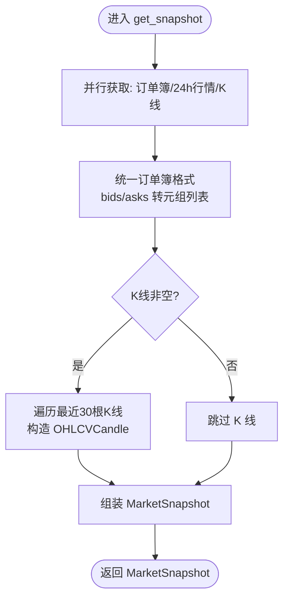
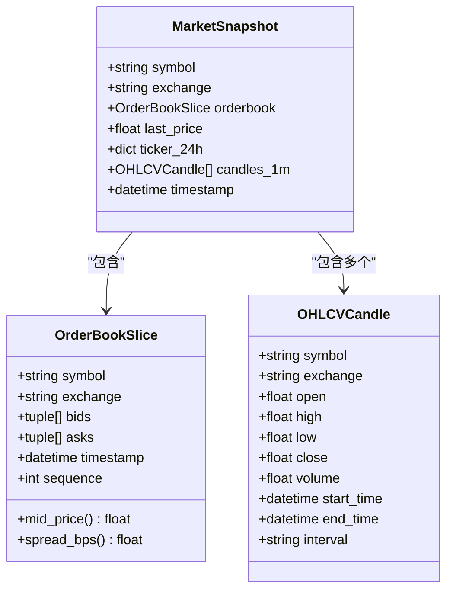
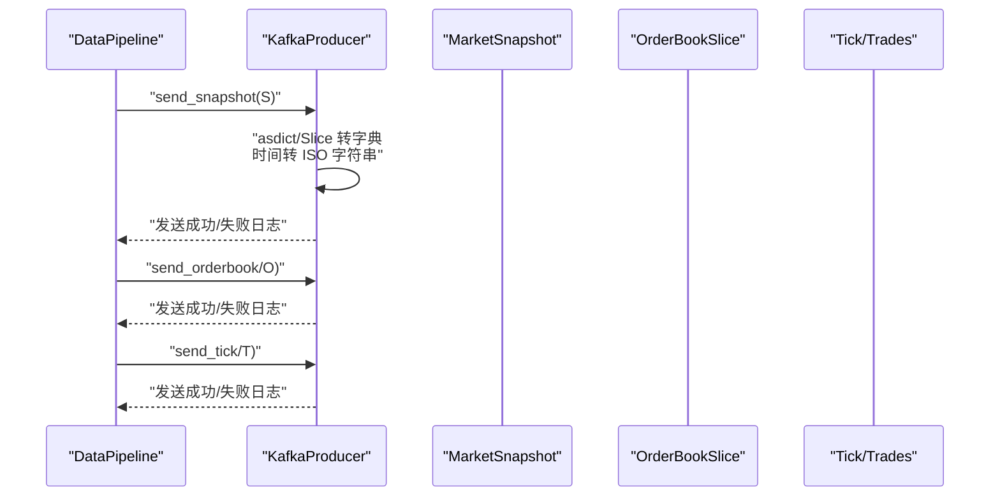
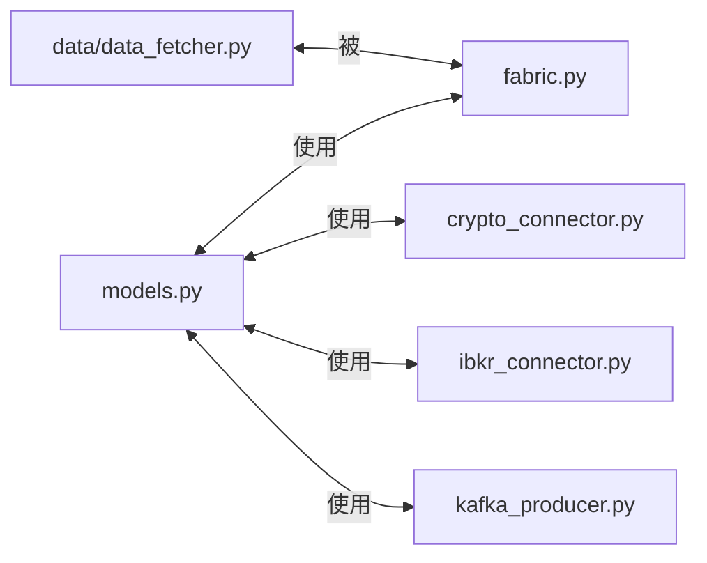

# 数据模型定义

<cite>
**本文引用的文件**
- [src/aetherlife/perception/models.py](file://src/aetherlife/perception/models.py)
- [src/aetherlife/perception/fabric.py](file://src/aetherlife/perception/fabric.py)
- [src/aetherlife/perception/crypto_connector.py](file://src/aetherlife/perception/crypto_connector.py)
- [src/aetherlife/perception/ibkr_connector.py](file://src/aetherlife/perception/ibkr_connector.py)
- [src/aetherlife/perception/kafka_producer.py](file://src/aetherlife/perception/kafka_producer.py)
- [src/data/data_fetcher.py](file://src/data/data_fetcher.py)
- [scripts/perception_connector_demo.py](file://scripts/perception_connector_demo.py)
- [src/aetherlife/perception/__init__.py](file://src/aetherlife/perception/__init__.py)
</cite>

## 目录
1. [引言](#引言)
2. [项目结构](#项目结构)
3. [核心组件](#核心组件)
4. [架构总览](#架构总览)
5. [详细组件分析](#详细组件分析)
6. [依赖分析](#依赖分析)
7. [性能考量](#性能考量)
8. [故障排查指南](#故障排查指南)
9. [结论](#结论)
10. [附录](#附录)

## 引言
本文件聚焦“感知层”数据模型，系统性阐述 MarketSnapshot、OrderBookSlice、OHLCVCandle 的设计理念、字段定义、验证规则、序列化与反序列化机制，以及它们在系统中的流转过程与性能考量。文档同时给出与连接器、数据管道、Fabric 等模块的交互关系图与流程图，帮助读者快速理解从多源数据到统一 MarketSnapshot 的全链路。

## 项目结构
感知层数据模型位于 aetherlife/perception 子模块，配合数据获取器、连接器与 Kafka 管道共同构成统一的数据入口与输出通道。下图展示了与本文相关的模块与文件关系：

图表来源
- [src/aetherlife/perception/models.py](file://src/aetherlife/perception/models.py#L1-L64)
- [src/aetherlife/perception/fabric.py](file://src/aetherlife/perception/fabric.py#L1-L88)
- [src/aetherlife/perception/crypto_connector.py](file://src/aetherlife/perception/crypto_connector.py#L1-L369)
- [src/aetherlife/perception/ibkr_connector.py](file://src/aetherlife/perception/ibkr_connector.py#L1-L323)
- [src/aetherlife/perception/kafka_producer.py](file://src/aetherlife/perception/kafka_producer.py#L1-L287)
- [src/data/data_fetcher.py](file://src/data/data_fetcher.py#L1-L434)
- [scripts/perception_connector_demo.py](file://scripts/perception_connector_demo.py#L1-L211)

章节来源
- [src/aetherlife/perception/__init__.py](file://src/aetherlife/perception/__init__.py#L1-L47)

## 核心组件
本节对三个核心数据模型进行逐项解析，包括用途、字段、约束与典型用法。

- MarketSnapshot
  - 用途：作为 Agent 的一次性消费视图，聚合订单簿、最新价、24小时行情与最近 K 线片段。
  - 关键字段
    - symbol: 交易对标识
    - exchange: 交易所标识
    - orderbook: 可选的 OrderBookSlice
    - last_price: 最新成交价
    - ticker_24h: 可选的 24 小时行情字典
    - candles_1m: 可选的最近 K 线列表
    - timestamp: 快照生成时间
  - 验证规则
    - 可选字段允许为空，调用方需在使用前判空
    - last_price 默认值为 0.0，便于安全计算
    - candles_1m 为列表，建议仅保留近期片段以控制体积
  - 典型用法
    - 由 DataFabric 或连接器构建后，传递给上层策略或写入 Kafka

- OrderBookSlice
  - 用途：统一多交易所的订单簿快照，便于跨市场比较与分析。
  - 关键字段
    - symbol、exchange：标识来源
    - bids、asks：有序列表，元素为 (price, qty) 元组
    - timestamp：快照时间
    - sequence：可选序列号（用于去重/顺序校验）
  - 辅助方法
    - mid_price(): 计算最优买卖价的中价
    - spread_bps(): 计算最优价差的基点（bps）
  - 验证规则
    - bids/asks 为空时，辅助方法返回 0.0
    - mid_price 为非正值时，spread_bps 返回 0.0
  - 典型用法
    - 由 DataFetcher、CryptoConnector、IBKRConnector 统一转换为该结构，再嵌入 MarketSnapshot

- OHLCVCandle
  - 用途：标准化 K 线数据，便于策略统一处理。
  - 关键字段
    - symbol、exchange：标识来源
    - open、high、low、close：OHLC 价格
    - volume：成交量
    - start_time、end_time：K 线起止时间
    - interval：时间间隔（如 "1m"）
  - 验证规则
    - 价格与成交量必须为数值类型
    - 时间字段应为 datetime 类型
    - interval 应为预定义的时间粒度字符串
  - 典型用法
    - 由 DataFetcher 获取 DataFrame 后转换为 OHLCVCandle 列表，嵌入 MarketSnapshot

章节来源
- [src/aetherlife/perception/models.py](file://src/aetherlife/perception/models.py#L9-L64)

## 架构总览
下图展示从多源数据到统一 MarketSnapshot 的整体流程，以及与 Kafka 管道的衔接：

图表来源
- [src/aetherlife/perception/fabric.py](file://src/aetherlife/perception/fabric.py#L32-L82)
- [src/aetherlife/perception/crypto_connector.py](file://src/aetherlife/perception/crypto_connector.py#L277-L324)
- [src/aetherlife/perception/ibkr_connector.py](file://src/aetherlife/perception/ibkr_connector.py#L229-L284)
- [src/aetherlife/perception/kafka_producer.py](file://src/aetherlife/perception/kafka_producer.py#L131-L170)

## 详细组件分析

### DataFabric：统一感知层
DataFabric 聚合来自 DataFetcher 的订单簿、24 小时行情与 K 线，并统一转换为 MarketSnapshot。其关键点如下：
- 并行拉取：使用 asyncio.gather 并行获取订单簿、ticker 与 K 线，降低端到端延迟
- 统一格式：将 bids/asks 转换为 (price, qty) 元组列表，截断至 10 档
- K 线构造：遍历最近 30 根 K 线，构造 OHLCVCandle 列表
- 时间戳：各组件使用 UTC 时间，保证跨模块一致性

图表来源
- [src/aetherlife/perception/fabric.py](file://src/aetherlife/perception/fabric.py#L32-L82)

章节来源
- [src/aetherlife/perception/fabric.py](file://src/aetherlife/perception/fabric.py#L13-L88)

### 连接器：CryptoConnector 与 IBKRConnector
两个连接器均能产出 MarketSnapshot，但数据来源不同：
- CryptoConnector（基于 CCXT Pro）
  - 支持多交易所 WebSocket 实时订阅（Ticker/OrderBook/Trades）
  - 提供 get_snapshot() 单次快照能力
  - 订单簿 bids/asks 转换为 (price, volume) 元组
- IBKRConnector（基于 ib_insync）
  - 支持股票、期货、外汇与 A 股（Stock Connect）实时数据
  - 订阅与快照模式均可使用，断线自动重连
  - 订单簿仅取最优价档位

图表来源
- [src/aetherlife/perception/models.py](file://src/aetherlife/perception/models.py#L15-L64)

章节来源
- [src/aetherlife/perception/crypto_connector.py](file://src/aetherlife/perception/crypto_connector.py#L277-L324)
- [src/aetherlife/perception/ibkr_connector.py](file://src/aetherlife/perception/ibkr_connector.py#L229-L284)

### Kafka 生产者：序列化与发布
KafkaProducer/DataPipeline 将标准化后的数据发布到 Kafka/Redpanda：
- 序列化：使用 JSON 序列化，value_serializer 将 datetime 转为字符串
- 主题划分：tick、orderbook、trades、snapshot
- 去重与缓冲：按 symbol/exchange 去重，基于 nonce 去除重复 OrderBook
- 批量优化：开启 gzip 压缩、设置 linger_ms 与 acks=all

图表来源
- [src/aetherlife/perception/kafka_producer.py](file://src/aetherlife/perception/kafka_producer.py#L131-L210)

章节来源
- [src/aetherlife/perception/kafka_producer.py](file://src/aetherlife/perception/kafka_producer.py#L26-L210)

### 数据模型之间的关系映射
- MarketSnapshot 作为聚合容器，内部组合 OrderBookSlice 与 OHLCVCandle 列表
- OrderBookSlice 与 OHLCVCandle 通过 symbol/exchange 保持来源一致
- DataFabric/CryptoConnector/IBKRConnector 在各自实现中将外部数据转换为上述结构
- KafkaProducer 以字典形式序列化 MarketSnapshot，便于下游消费者反序列化

章节来源
- [src/aetherlife/perception/models.py](file://src/aetherlife/perception/models.py#L15-L64)
- [src/aetherlife/perception/fabric.py](file://src/aetherlife/perception/fabric.py#L45-L82)
- [src/aetherlife/perception/crypto_connector.py](file://src/aetherlife/perception/crypto_connector.py#L298-L324)
- [src/aetherlife/perception/ibkr_connector.py](file://src/aetherlife/perception/ibkr_connector.py#L254-L284)
- [src/aetherlife/perception/kafka_producer.py](file://src/aetherlife/perception/kafka_producer.py#L138-L170)

## 依赖分析
- 模块内聚与耦合
  - models.py 为纯数据结构定义，无副作用，内聚性高
  - DataFabric 依赖 DataFetcher 抽象接口，耦合于具体实现
  - 连接器依赖第三方库（ccxt.pro、ib_insync），对外暴露统一接口
  - KafkaProducer 依赖 aiokafka，负责序列化与发布
- 外部依赖与集成点
  - DataFetcher/子类：BinanceDataFetcher、OKXDataFetcher
  - 第三方库：ccxt.pro、ib_insync、aiokafka
- 潜在循环依赖
  - 当前文件未见循环导入；注意在新增模块时避免相互 import

图表来源
- [src/aetherlife/perception/models.py](file://src/aetherlife/perception/models.py#L1-L64)
- [src/aetherlife/perception/fabric.py](file://src/aetherlife/perception/fabric.py#L1-L88)
- [src/aetherlife/perception/crypto_connector.py](file://src/aetherlife/perception/crypto_connector.py#L1-L369)
- [src/aetherlife/perception/ibkr_connector.py](file://src/aetherlife/perception/ibkr_connector.py#L1-L323)
- [src/aetherlife/perception/kafka_producer.py](file://src/aetherlife/perception/kafka_producer.py#L1-L287)
- [src/data/data_fetcher.py](file://src/data/data_fetcher.py#L1-L434)

章节来源
- [src/aetherlife/perception/__init__.py](file://src/aetherlife/perception/__init__.py#L1-L47)

## 性能考量
- 并行拉取：DataFabric 使用 asyncio.gather 并行获取订单簿、ticker 与 K 线，显著降低等待时间
- 数据裁剪：订单簿仅保留前 N 档，K 线仅保留最近若干根，减少内存与序列化开销
- 序列化优化：KafkaProducer 启用 gzip 压缩、合理设置 linger_ms 与 acks=all，在吞吐与可靠性间平衡
- 去重策略：基于时间戳与 nonce 去重，避免重复消息占用带宽与下游处理压力
- 时间一致性：统一使用 UTC 时间戳，避免跨模块时间换算误差

## 故障排查指南
- 订单簿为空或异常
  - 现象：mid_price/spread_bps 返回 0.0
  - 排查：确认 bids/asks 是否为空；检查上游数据源是否正常
- K 线为空
  - 现象：MarketSnapshot.candles_1m 为 None
  - 排查：确认 DataFetcher 返回的 DataFrame 非空且包含 open_time 列
- Kafka 发送失败
  - 现象：日志出现 KafkaError 或序列化失败
  - 排查：检查 bootstrap_servers、topic 名称、消息体中 datetime 是否正确序列化
- 连接器异常
  - 现象：CryptoConnector/IBKRConnector 无法连接或回调失败
  - 排查：确认第三方库安装、网络连通性、API 凭据与测试网配置

章节来源
- [src/aetherlife/perception/fabric.py](file://src/aetherlife/perception/fabric.py#L54-L82)
- [src/aetherlife/perception/kafka_producer.py](file://src/aetherlife/perception/kafka_producer.py#L185-L204)
- [src/aetherlife/perception/crypto_connector.py](file://src/aetherlife/perception/crypto_connector.py#L116-L154)
- [src/aetherlife/perception/ibkr_connector.py](file://src/aetherlife/perception/ibkr_connector.py#L196-L228)

## 结论
本文系统梳理了感知层数据模型的设计与实现，明确了 MarketSnapshot、OrderBookSlice、OHLCVCandle 的职责边界与交互关系。通过 DataFabric、连接器与 Kafka 管道，系统实现了从多源异构数据到统一结构化视图的高效转换，并提供了序列化、去重与性能优化策略。建议在扩展新数据源时遵循统一的数据转换规范，确保模型的一致性与可维护性。

## 附录
- 示例：如何创建与使用数据模型
  - 创建 MarketSnapshot（参考 DataFabric 的组装逻辑）
  - 创建 OrderBookSlice（参考连接器与 DataFabric 的转换）
  - 创建 OHLCVCandle（参考 DataFabric 的 K 线构造）
- 示例：如何序列化与发布到 Kafka
  - 使用 KafkaProducer 的 send_snapshot/send_orderbook/send_tick
  - DataPipeline 提供去重与缓冲封装
- 示例：演示脚本
  - scripts/perception_connector_demo.py 展示了连接器与 Kafka 管道的集成使用

章节来源
- [src/aetherlife/perception/fabric.py](file://src/aetherlife/perception/fabric.py#L32-L82)
- [src/aetherlife/perception/crypto_connector.py](file://src/aetherlife/perception/crypto_connector.py#L277-L324)
- [src/aetherlife/perception/ibkr_connector.py](file://src/aetherlife/perception/ibkr_connector.py#L229-L284)
- [src/aetherlife/perception/kafka_producer.py](file://src/aetherlife/perception/kafka_producer.py#L131-L170)
- [scripts/perception_connector_demo.py](file://scripts/perception_connector_demo.py#L1-L211)