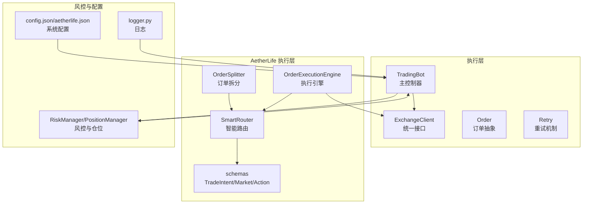
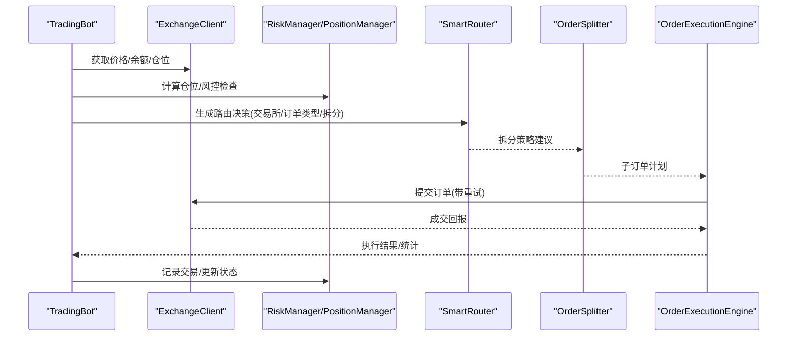
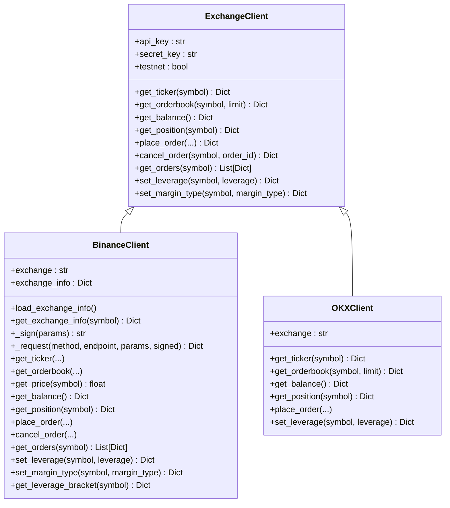
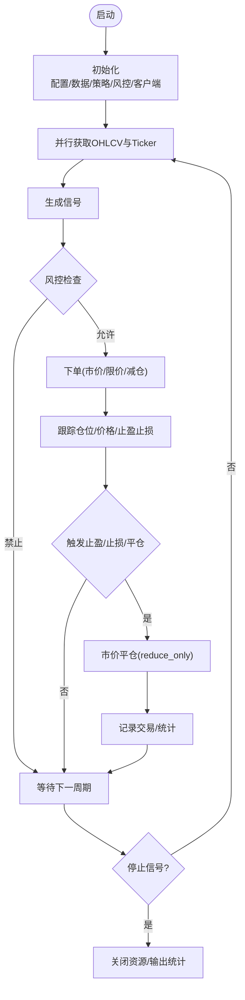
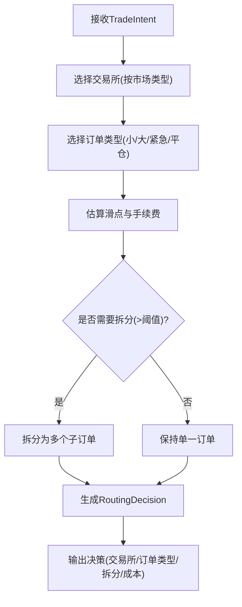
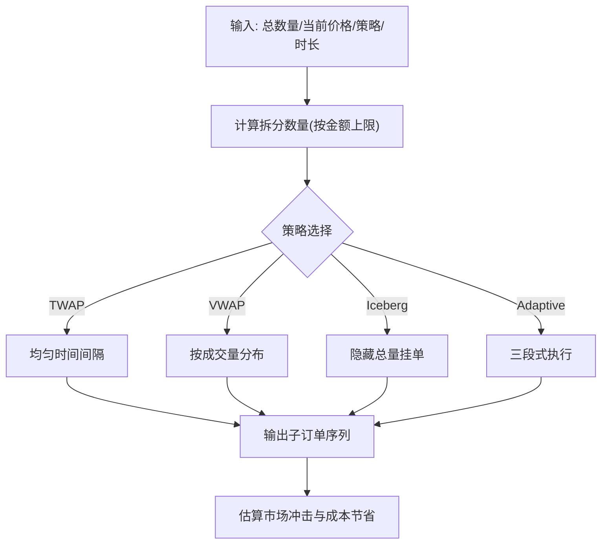
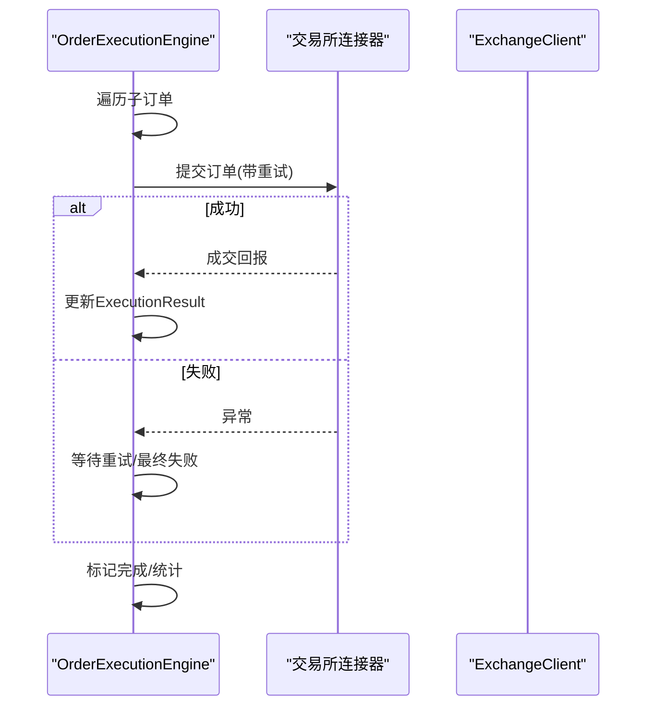
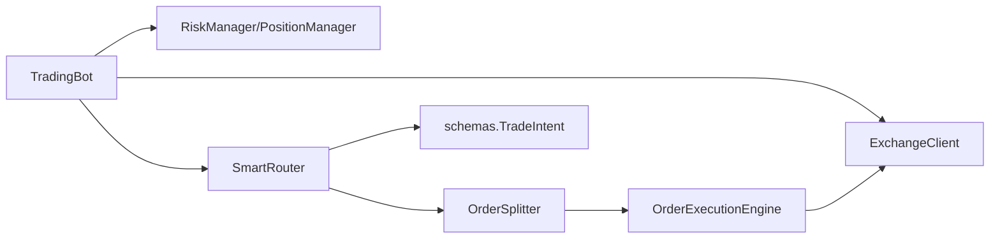

# 执行层

<cite>
**本文引用的文件**
- [src/execution/exchange_client.py](file://src/execution/exchange_client.py)
- [src/execution/order.py](file://src/execution/order.py)
- [src/execution/retry.py](file://src/execution/retry.py)
- [src/trading_bot.py](file://src/trading_bot.py)
- [src/utils/risk_manager.py](file://src/utils/risk_manager.py)
- [src/aetherlife/execution/smart_router.py](file://src/aetherlife/execution/smart_router.py)
- [src/aetherlife/execution/order_splitter.py](file://src/aetherlife/execution/order_splitter.py)
- [src/aetherlife/execution/order_executor.py](file://src/aetherlife/execution/order_executor.py)
- [src/aetherlife/cognition/schemas.py](file://src/aetherlife/cognition/schemas.py)
- [configs/config.json](file://configs/config.json)
- [configs/aetherlife.json](file://configs/aetherlife.json)
- [src/utils/logger.py](file://src/utils/logger.py)
</cite>

## 目录
1. [引言](#引言)
2. [项目结构](#项目结构)
3. [核心组件](#核心组件)
4. [架构总览](#架构总览)
5. [详细组件分析](#详细组件分析)
6. [依赖关系分析](#依赖关系分析)
7. [性能考量](#性能考量)
8. [故障排查指南](#故障排查指南)
9. [结论](#结论)
10. [附录](#附录)

## 引言
本文件面向量化交易系统的“执行层”，聚焦以下目标：
- 深入解析 SmartRouter 智能路由系统的设计原理，覆盖多交易所选择、流动性评估、滑点与手续费估算、订单拆分与执行策略。
- 说明 ExchangeClient 交易所客户端的统一接口设计，以及在 TradingBot 中的集成方式。
- 细化 Order 订单管理生命周期与 Retry 重试机制的可靠性保障。
- 覆盖订单执行算法、仓位管理策略、手续费与交易成本控制。
- 提供多交易所接入的实现示例与执行性能优化技巧。

## 项目结构
执行层相关代码主要分布在如下位置：
- 传统执行层：exchange_client、order、retry、trading_bot
- AetherLife 执行层：smart_router、order_splitter、order_executor 与认知层 schemas
- 风控与日志：risk_manager、logger
- 配置：config.json、aetherlife.json

图表来源
- [src/execution/exchange_client.py](file://src/execution/exchange_client.py#L20-L85)
- [src/trading_bot.py](file://src/trading_bot.py#L27-L91)
- [src/aetherlife/execution/smart_router.py](file://src/aetherlife/execution/smart_router.py#L49-L159)
- [src/aetherlife/execution/order_splitter.py](file://src/aetherlife/execution/order_splitter.py#L39-L144)
- [src/aetherlife/execution/order_executor.py](file://src/aetherlife/execution/order_executor.py#L63-L153)
- [src/aetherlife/cognition/schemas.py](file://src/aetherlife/cognition/schemas.py#L32-L58)
- [src/utils/risk_manager.py](file://src/utils/risk_manager.py#L12-L52)
- [configs/config.json](file://configs/config.json#L1-L28)
- [src/utils/logger.py](file://src/utils/logger.py#L12-L28)

章节来源
- [src/execution/exchange_client.py](file://src/execution/exchange_client.py#L1-L432)
- [src/trading_bot.py](file://src/trading_bot.py#L1-L346)
- [src/aetherlife/execution/smart_router.py](file://src/aetherlife/execution/smart_router.py#L1-L444)
- [src/aetherlife/execution/order_splitter.py](file://src/aetherlife/execution/order_splitter.py#L1-L428)
- [src/aetherlife/execution/order_executor.py](file://src/aetherlife/execution/order_executor.py#L1-L433)
- [src/aetherlife/cognition/schemas.py](file://src/aetherlife/cognition/schemas.py#L1-L219)
- [src/utils/risk_manager.py](file://src/utils/risk_manager.py#L1-L388)
- [configs/config.json](file://configs/config.json#L1-L28)
- [src/utils/logger.py](file://src/utils/logger.py#L1-L34)

## 核心组件
- ExchangeClient 统一接口：抽象出 get_ticker、get_orderbook、get_balance、get_position、place_order、cancel_order、set_leverage、set_margin_type 等方法，并提供 BinanceClient、OKXClient 等具体实现。
- TradingBot 主控制器：负责初始化数据源、策略、风控与仓位管理；在主循环中拉取数据、生成信号、风控检查、下单与止盈止损。
- SmartRouter 智能路由：根据市场类型、订单规模、置信度与紧急程度，自动选择交易所与订单类型，并估算滑点与手续费，必要时拆分订单。
- OrderSplitter 订单拆分：支持 TWAP、VWAP、Iceberg、Adaptive 等策略，降低市场冲击并优化执行成本。
- OrderExecutionEngine 执行引擎：封装多交易所统一接口、自动重试、状态跟踪与统计。
- RiskManager/PositionManager：风控与仓位管理，包含止损止盈、熔断、连败限制与每日限额。
- schemas：定义 TradeIntent、Market、Action 等结构，支撑智能路由与跨市场信号。

章节来源
- [src/execution/exchange_client.py](file://src/execution/exchange_client.py#L20-L85)
- [src/trading_bot.py](file://src/trading_bot.py#L27-L205)
- [src/aetherlife/execution/smart_router.py](file://src/aetherlife/execution/smart_router.py#L49-L159)
- [src/aetherlife/execution/order_splitter.py](file://src/aetherlife/execution/order_splitter.py#L39-L144)
- [src/aetherlife/execution/order_executor.py](file://src/aetherlife/execution/order_executor.py#L63-L153)
- [src/utils/risk_manager.py](file://src/utils/risk_manager.py#L12-L241)
- [src/aetherlife/cognition/schemas.py](file://src/aetherlife/cognition/schemas.py#L32-L58)

## 架构总览
下图展示从 TradingBot 到 ExchangeClient 与 AetherLife 执行层的整体交互流程：

图表来源
- [src/trading_bot.py](file://src/trading_bot.py#L115-L205)
- [src/execution/exchange_client.py](file://src/execution/exchange_client.py#L136-L171)
- [src/aetherlife/execution/smart_router.py](file://src/aetherlife/execution/smart_router.py#L98-L159)
- [src/aetherlife/execution/order_splitter.py](file://src/aetherlife/execution/order_splitter.py#L73-L144)
- [src/aetherlife/execution/order_executor.py](file://src/aetherlife/execution/order_executor.py#L117-L153)

## 详细组件分析

### ExchangeClient 统一接口与多交易所接入
- 设计要点
  - 基类定义统一接口，派生类实现具体交易所 API。
  - BinanceClient 支持测试网与主网切换、签名、请求封装与错误处理。
  - OKXClient 当前占位实现，便于后续扩展。
- 关键能力
  - 行情接口：get_ticker、get_orderbook、get_price
  - 交易接口：get_balance、get_position、place_order、cancel_order、get_orders、set_leverage、set_margin_type
- 接入示例
  - 通过工厂函数 create_client 创建指定交易所实例，传入 API Key/Secret 与 testnet 标志。

图表来源
- [src/execution/exchange_client.py](file://src/execution/exchange_client.py#L20-L85)
- [src/execution/exchange_client.py](file://src/execution/exchange_client.py#L87-L342)

章节来源
- [src/execution/exchange_client.py](file://src/execution/exchange_client.py#L20-L342)

### TradingBot 订单生命周期与风控集成
- 生命周期关键节点
  - 初始化：校验配置、创建数据源、策略、风控与仓位管理器、交易客户端。
  - 主循环：并行获取 OHLCV 与 Ticker，生成信号，风控检查，下单，检查止盈止损，记录统计。
  - 停止：关闭数据源与客户端，输出交易统计。
- 仓位与成本
  - 使用 RiskManager 计算仓位大小，考虑最大/最小仓位比例与信号强度。
  - 通过 PositionManager 维护开仓、更新、平仓与盈亏计算。
- 多交易所接入
  - 通过 create_client 注入 Binance/OKX 客户端，统一调用 place_order、get_price、get_balance 等。

图表来源
- [src/trading_bot.py](file://src/trading_bot.py#L63-L296)
- [src/utils/risk_manager.py](file://src/utils/risk_manager.py#L62-L241)

章节来源
- [src/trading_bot.py](file://src/trading_bot.py#L63-L296)
- [src/utils/risk_manager.py](file://src/utils/risk_manager.py#L12-L241)

### SmartRouter 智能路由系统
- 设计目标
  - 根据市场类型选择交易所（加密货币优先 Binance/Bybit，A股/美股等走 IBKR）。
  - 根据订单规模、置信度与紧急程度选择订单类型（市价/限价/FOK/IOC/POST_ONLY）。
  - 估算滑点与手续费，决定是否拆分订单。
- 核心流程
  - 选择交易所：依据 Market 类型与流动性偏好。
  - 选择订单类型：小单高置信度用市价，大单用限价，紧急平仓用 FOK，中等单做市用 POST_ONLY。
  - 成本估算：滑点 = 基础滑点 × 订单规模因子 × 波动因子；手续费 = 订单金额 × 手续费率。
  - 拆分策略：超过阈值拆分为多个子订单，减少市场冲击。
  - 决策输出：RoutingDecision 包含交易所、订单类型、拆分子订单、滑点、手续费与原因。

图表来源
- [src/aetherlife/execution/smart_router.py](file://src/aetherlife/execution/smart_router.py#L98-L159)
- [src/aetherlife/execution/smart_router.py](file://src/aetherlife/execution/smart_router.py#L161-L237)
- [src/aetherlife/execution/smart_router.py](file://src/aetherlife/execution/smart_router.py#L239-L262)
- [src/aetherlife/execution/smart_router.py](file://src/aetherlife/execution/smart_router.py#L264-L303)
- [src/aetherlife/cognition/schemas.py](file://src/aetherlife/cognition/schemas.py#L32-L58)

章节来源
- [src/aetherlife/execution/smart_router.py](file://src/aetherlife/execution/smart_router.py#L49-L321)
- [src/aetherlife/cognition/schemas.py](file://src/aetherlife/cognition/schemas.py#L32-L58)

### OrderSplitter 订单拆分策略
- 支持策略
  - TWAP：均匀分配时间，适合中低冲击执行。
  - VWAP：按成交量分布分配，集中在流动性高的时段。
  - Iceberg：隐藏总量，仅挂单不主动吃单，适合大单隐蔽执行。
  - Adaptive：三段式自适应，前中后分别承担不同比例，兼顾速度与成本。
- 市场冲击估算
  - 通过 sqrt(quantity/market_depth) × volatility 模型估算冲击，比较拆分前后成本差异。

图表来源
- [src/aetherlife/execution/order_splitter.py](file://src/aetherlife/execution/order_splitter.py#L73-L144)
- [src/aetherlife/execution/order_splitter.py](file://src/aetherlife/execution/order_splitter.py#L146-L332)
- [src/aetherlife/execution/order_splitter.py](file://src/aetherlife/execution/order_splitter.py#L334-L376)

章节来源
- [src/aetherlife/execution/order_splitter.py](file://src/aetherlife/execution/order_splitter.py#L39-L376)

### OrderExecutionEngine 执行引擎
- 统一接口与重试
  - 通过 connectors 映射 Exchange 到具体连接器，执行时自动重试，失败后记录错误。
  - 支持 dry-run 模式，便于回测与验证。
- 状态跟踪与统计
  - 维护活跃订单与已完成订单，提供查询与统计接口，输出成功率、平均手续费与滑点等。
- 回调机制
  - 执行完成后回调上层，便于联动风控与记录。

图表来源
- [src/aetherlife/execution/order_executor.py](file://src/aetherlife/execution/order_executor.py#L117-L250)
- [src/aetherlife/execution/order_executor.py](file://src/aetherlife/execution/order_executor.py#L251-L283)
- [src/execution/exchange_client.py](file://src/execution/exchange_client.py#L136-L171)

章节来源
- [src/aetherlife/execution/order_executor.py](file://src/aetherlife/execution/order_executor.py#L63-L384)

### Order 与 Retry 机制
- Order
  - 当前提供市价单类与限价单函数占位，体现未来扩展方向。
- Retry
  - 提供撤单重试占位，体现执行层对可靠性的重视。

章节来源
- [src/execution/order.py](file://src/execution/order.py#L1-L26)
- [src/execution/retry.py](file://src/execution/retry.py#L1-L6)

## 依赖关系分析
- 组件耦合
  - TradingBot 依赖 ExchangeClient、RiskManager、PositionManager、策略与数据源。
  - AetherLife 执行层内部强关联：SmartRouter 依赖 schemas，OrderSplitter 与 OrderExecutionEngine 依赖 SmartRouter 输出。
- 外部依赖
  - ExchangeClient 依赖 aiohttp、hmac、hashlib、time 等标准库。
  - 执行引擎依赖 asyncio 与 uuid 生成订单 ID。
- 风险与环路
  - 当前未发现直接循环依赖；SmartRouter 与 OrderExecutionEngine 通过 RoutingDecision 解耦。

图表来源
- [src/trading_bot.py](file://src/trading_bot.py#L14-L24)
- [src/aetherlife/execution/smart_router.py](file://src/aetherlife/execution/smart_router.py#L17-L18)
- [src/aetherlife/execution/order_executor.py](file://src/aetherlife/execution/order_executor.py#L18-L19)

章节来源
- [src/trading_bot.py](file://src/trading_bot.py#L14-L24)
- [src/aetherlife/execution/smart_router.py](file://src/aetherlife/execution/smart_router.py#L17-L18)
- [src/aetherlife/execution/order_executor.py](file://src/aetherlife/execution/order_executor.py#L18-L19)

## 性能考量
- 并行化
  - TradingBot 在获取 OHLCV 与 Ticker 时采用并行请求，缩短主循环等待时间。
- 请求超时与重试
  - ExchangeClient 使用 aiohttp.ClientTimeout 控制超时；OrderExecutionEngine 提供自动重试与退避。
- 拆分执行
  - OrderSplitter 的 TWAP/VWAP/Iceberg/Adaptive 可显著降低市场冲击，提升执行性价比。
- 精度与步进
  - BinanceClient 在市价单时按交易对精度与步进进行修正，避免下单失败。
- 配置驱动
  - 通过 config.json 与 aetherlife.json 调整杠杆、滑点、手续费、风控阈值等，以适配不同市场与风险偏好。

章节来源
- [src/trading_bot.py](file://src/trading_bot.py#L95-L98)
- [src/execution/exchange_client.py](file://src/execution/exchange_client.py#L16-L35)
- [src/aetherlife/execution/order_executor.py](file://src/aetherlife/execution/order_executor.py#L82-L90)
- [src/aetherlife/execution/order_splitter.py](file://src/aetherlife/execution/order_splitter.py#L50-L70)
- [src/execution/exchange_client.py](file://src/execution/exchange_client.py#L242-L254)
- [configs/config.json](file://configs/config.json#L1-L28)
- [configs/aetherlife.json](file://configs/aetherlife.json#L1-L17)

## 故障排查指南
- 常见问题定位
  - ExchangeClient 请求失败：检查 API Key/Secret、网络与超时设置；查看 Binance 错误码与 aiohttp 异常。
  - 下单失败：确认精度与步进、可用余额、杠杆设置与保证金模式；检查风控限制。
  - 执行引擎失败：查看重试日志与错误消息，确认连接器是否正确注入。
- 日志与统计
  - 使用统一 logger 输出关键事件；利用 OrderExecutionEngine 统计接口查看成功率与平均成本。
- 配置核验
  - 通过 validate_config 校验配置项；确保 symbols、timeframe、strategy、risk 等字段完整。

章节来源
- [src/execution/exchange_client.py](file://src/execution/exchange_client.py#L136-L171)
- [src/execution/exchange_client.py](file://src/execution/exchange_client.py#L191-L204)
- [src/aetherlife/execution/order_executor.py](file://src/aetherlife/execution/order_executor.py#L231-L244)
- [src/utils/logger.py](file://src/utils/logger.py#L12-L28)
- [src/trading_bot.py](file://src/trading_bot.py#L65-L69)

## 结论
本执行层以 ExchangeClient 为基础，结合 TradingBot 的主循环与风控体系，形成“信号—路由—拆分—执行—风控”的闭环。AetherLife 的 SmartRouter、OrderSplitter 与 OrderExecutionEngine 进一步提升了多交易所接入能力、滑点与成本控制能力，以及执行可靠性。通过配置驱动与并行化优化，系统可在不同市场与风险偏好下稳定运行。

## 附录
- 多交易所接入示例
  - Binance：通过 create_client("binance", api_key, secret_key, testnet) 创建实例，随后在 TradingBot 中注入使用。
  - OKX：通过 create_client("okx", ...) 创建实例，当前占位实现，后续可补充签名与下单逻辑。
- 执行性能优化建议
  - 优先使用限价单与拆分策略，降低滑点与冲击。
  - 合理设置重试次数与延迟，平衡可靠性与延迟。
  - 使用并行请求与缓存（如 exchange_info）减少等待时间。
  - 严格控制精度与步进，避免无效下单。

章节来源
- [src/execution/exchange_client.py](file://src/execution/exchange_client.py#L403-L411)
- [src/trading_bot.py](file://src/trading_bot.py#L75-L81)
- [src/aetherlife/execution/order_splitter.py](file://src/aetherlife/execution/order_splitter.py#L146-L332)
- [src/aetherlife/execution/order_executor.py](file://src/aetherlife/execution/order_executor.py#L82-L90)