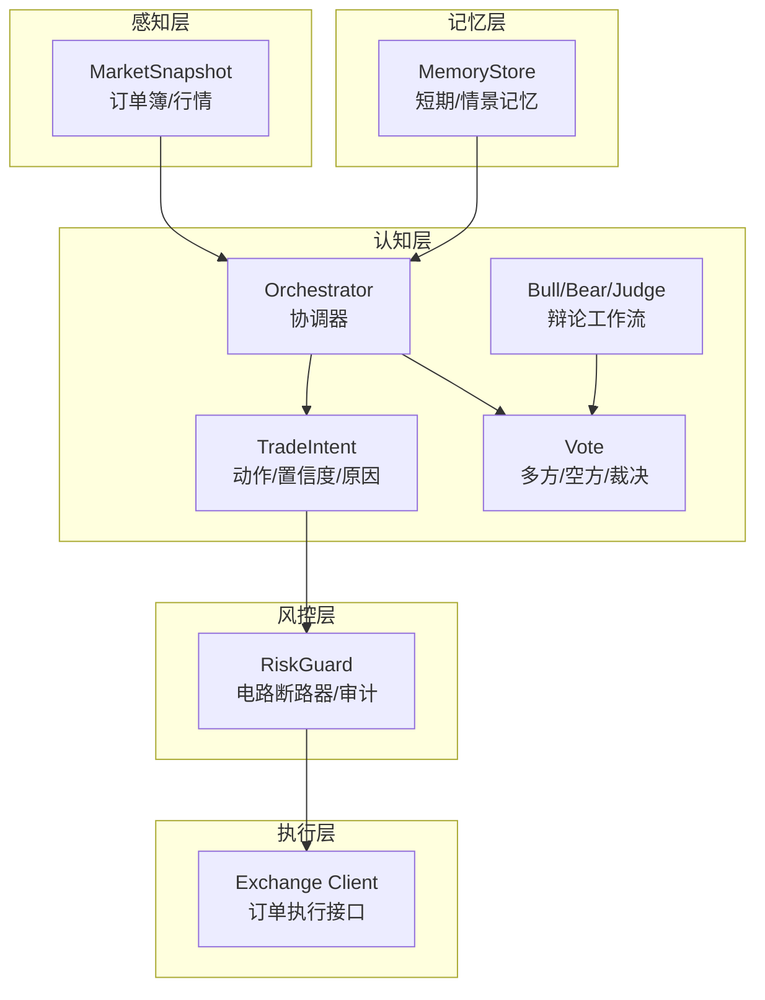
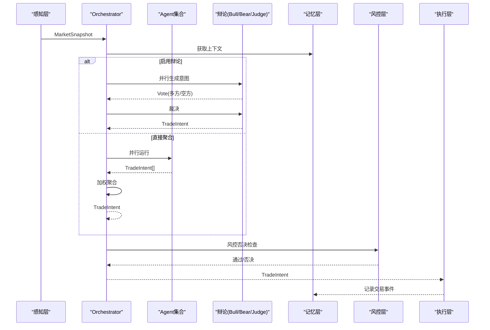
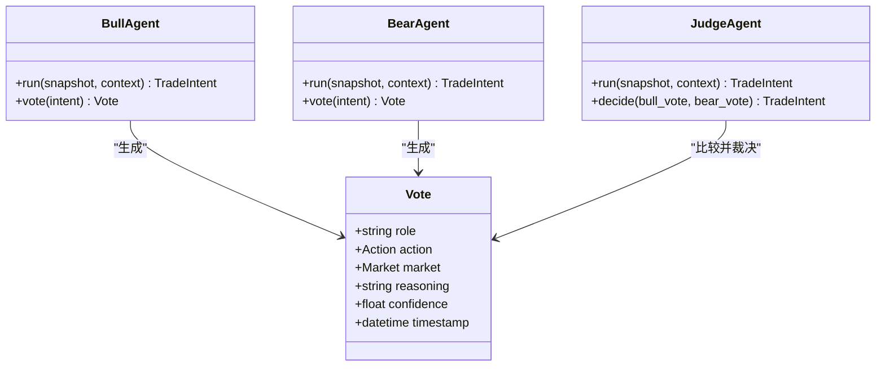
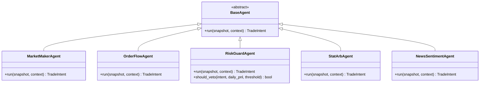
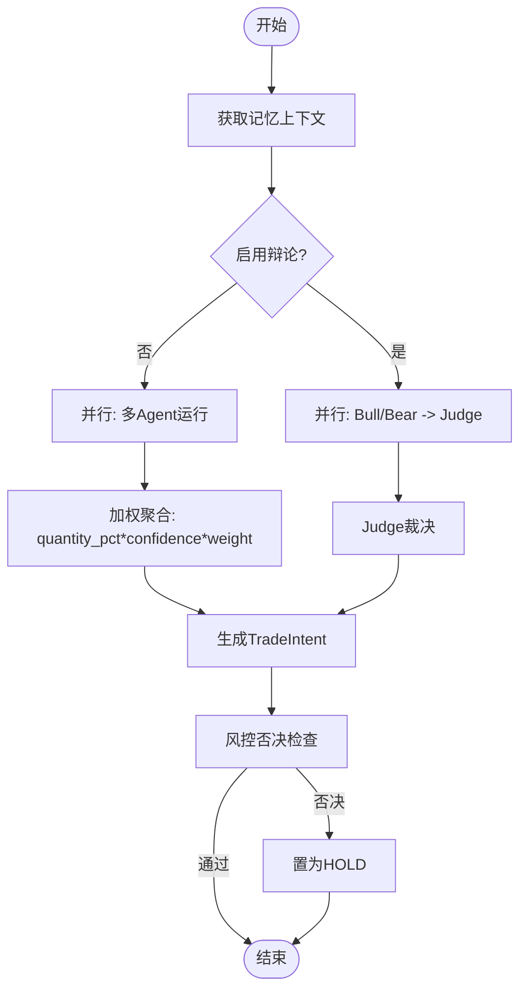
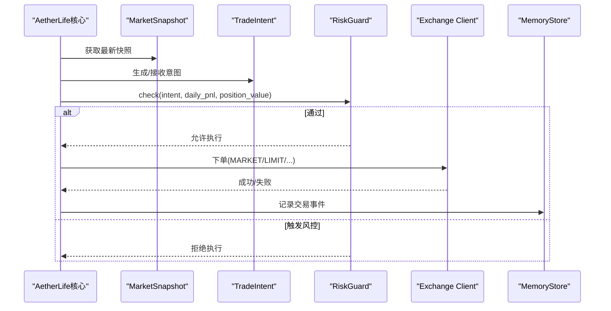
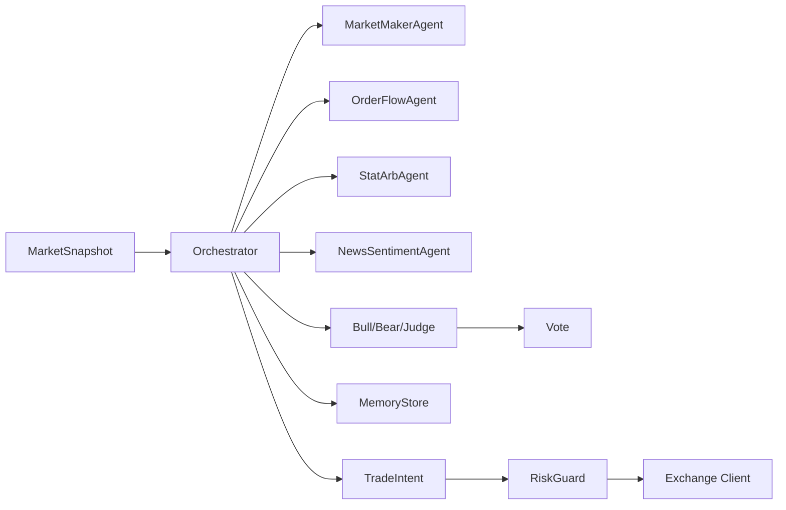

# 交易意图与数据模型

<cite>
**本文引用的文件列表**
- [src/aetherlife/cognition/schemas.py](file://src/aetherlife/cognition/schemas.py)
- [src/aetherlife/cognition/agents.py](file://src/aetherlife/cognition/agents.py)
- [src/aetherlife/cognition/debate.py](file://src/aetherlife/cognition/debate.py)
- [src/aetherlife/cognition/orchestrator.py](file://src/aetherlife/cognition/orchestrator.py)
- [src/aetherlife/cognition/orchestrator_enhanced.py](file://src/aetherlife/cognition/orchestrator_enhanced.py)
- [src/aetherlife/perception/models.py](file://src/aetherlife/perception/models.py)
- [src/aetherlife/memory/store.py](file://src/aetherlife/memory/store.py)
- [src/aetherlife/guard/risk_guard.py](file://src/aetherlife/guard/risk_guard.py)
- [src/aetherlife/core/life.py](file://src/aetherlife/core/life.py)
- [src/execution/order.py](file://src/execution/order.py)
- [configs/aetherlife.json](file://configs/aetherlife.json)
- [scripts/cognition_multi_agent_demo.py](file://scripts/cognition_multi_agent_demo.py)
</cite>

## 目录
1. [引言](#引言)
2. [项目结构](#项目结构)
3. [核心组件](#核心组件)
4. [架构总览](#架构总览)
5. [详细组件分析](#详细组件分析)
6. [依赖关系分析](#依赖关系分析)
7. [性能考量](#性能考量)
8. [故障排查指南](#故障排查指南)
9. [结论](#结论)
10. [附录](#附录)

## 引言
本文件面向AetherLife系统的交易意图与数据模型，提供权威参考。重点覆盖以下方面：
- TradeIntent交易意图的数据结构：action动作类型、quantity_pct数量百分比、confidence置信度、reason原因字段的定义与使用规则
- Action枚举类型的动作选项及其语义
- Vote投票模型的设计与辩论工作流
- 与交易执行相关的数据流转过程
- 数据验证规则、序列化格式与与其他模块的接口规范

## 项目结构
AetherLife围绕“感知-认知-执行-记忆-风控”五层组织代码，交易意图作为核心数据载体贯穿多模块：
- 认知层：定义交易意图、动作枚举、投票模型、决策上下文与状态机
- 感知层：提供统一的市场快照与订单簿数据结构
- 执行层：抽象订单执行接口（当前为占位实现）
- 记忆层：短期与情景记忆，支撑上下文与风控
- 风控层：电路断路器与审计

图表来源
- [src/aetherlife/perception/models.py](file://src/aetherlife/perception/models.py#L55-L64)
- [src/aetherlife/cognition/schemas.py](file://src/aetherlife/cognition/schemas.py#L32-L162)
- [src/aetherlife/cognition/debate.py](file://src/aetherlife/cognition/debate.py#L15-L100)
- [src/aetherlife/cognition/orchestrator.py](file://src/aetherlife/cognition/orchestrator.py#L16-L93)
- [src/aetherlife/memory/store.py](file://src/aetherlife/memory/store.py#L43-L155)
- [src/aetherlife/guard/risk_guard.py](file://src/aetherlife/guard/risk_guard.py#L23-L84)

章节来源
- [src/aetherlife/perception/models.py](file://src/aetherlife/perception/models.py#L1-L64)
- [src/aetherlife/cognition/schemas.py](file://src/aetherlife/cognition/schemas.py#L1-L219)
- [src/aetherlife/cognition/orchestrator.py](file://src/aetherlife/cognition/orchestrator.py#L1-L93)

## 核心组件
本节聚焦交易意图与相关数据模型的定义与约束。

- Action枚举：HOLD、BUY、SELL、CLOSE
- Market枚举：CRYPTO、A_STOCK、HK_STOCK、US_STOCK、INTL_STOCK、FOREX、FUTURES、COMMODITIES
- TradeIntent：交易意图的核心载体，包含动作、市场、标的、仓位比例、原因、置信度、风控参数、时效性、执行参数、元数据与时间戳
- Vote：辩论投票模型，包含角色、动作、市场、推理、置信度与时间戳
- DecisionContext：决策上下文，包含市场快照、订单簿、持仓、趋势、情绪、风控状态、记忆上下文等
- LangGraphState：LangGraph状态机的全局状态，承载多Agent意图、辩论结果、风控检查、强化学习决策、最终决策与执行结果

章节来源
- [src/aetherlife/cognition/schemas.py](file://src/aetherlife/cognition/schemas.py#L12-L162)

## 架构总览
交易意图在系统中的流转路径如下：
- 感知层提供MarketSnapshot
- 认知层的Orchestrator协调多个Agent或辩论流程，产出TradeIntent
- 记忆层提供上下文与风控状态
- 风控层进行电路断路器与审计
- 执行层根据TradeIntent对接交易所客户端下单

图表来源
- [src/aetherlife/cognition/orchestrator.py](file://src/aetherlife/cognition/orchestrator.py#L38-L93)
- [src/aetherlife/cognition/debate.py](file://src/aetherlife/cognition/debate.py#L55-L100)
- [src/aetherlife/memory/store.py](file://src/aetherlife/memory/store.py#L134-L145)
- [src/aetherlife/guard/risk_guard.py](file://src/aetherlife/guard/risk_guard.py#L48-L68)
- [src/aetherlife/core/life.py](file://src/aetherlife/core/life.py#L89-L121)

## 详细组件分析

### TradeIntent数据模型与字段规范
- 字段定义与约束
  - action：动作枚举，默认HOLD
  - market：市场枚举，默认CRYPTO
  - symbol：标的，默认"BTCUSDT"
  - quantity_pct：仓位比例，范围[0,1]，默认0
  - reason：决策原因，字符串
  - confidence：置信度，范围[0,1]，默认0.5
  - stop_loss_pct/take_profit_pct：风控止盈止损比例，范围[0,1]
  - valid_until：意图有效期
  - order_type：订单类型，默认"MARKET"，可选MARKET/LIMIT/FOK/IOC/POST_ONLY
  - limit_price：限价单价格
  - agent_id：发出意图的Agent标识
  - timestamp：生成时间
  - metadata：附加元数据字典
- 序列化与校验
  - 使用Pydantic模型，自动校验字段范围与类型
  - Config.use_enum_values=True，确保枚举以值形式序列化
- 用途
  - 作为Agent输出与Orchestrator聚合的统一数据结构
  - 作为风控层与执行层的输入

章节来源
- [src/aetherlife/cognition/schemas.py](file://src/aetherlife/cognition/schemas.py#L32-L62)

### Action枚举与动作语义
- HOLD：持有，不改变头寸
- BUY：做多，增加多头头寸
- SELL：做空，增加空头头寸
- CLOSE：平仓，减少头寸至零

章节来源
- [src/aetherlife/cognition/schemas.py](file://src/aetherlife/cognition/schemas.py#L12-L18)

### Vote投票模型与辩论工作流
- Vote字段
  - role：角色，如bull、bear、judge或Agent名称
  - action：动作
  - market：市场
  - reasoning：推理
  - confidence：置信度
  - timestamp：投票时间
- Bull/Bear/Judge
  - Bull/Bear：基于基础Agent（如做市Agent与订单流Agent）生成TradeIntent，并转换为Vote
  - Judge：比较双方置信度与动作，决定最终TradeIntent，否则返回HOLD
- 投票裁决规则
  - 若多方置信度更高且动作是BUY，则采纳多方
  - 若空方置信度更高且动作是SELL，则采纳空方
  - 否则返回HOLD并记录分歧

图表来源
- [src/aetherlife/cognition/schemas.py](file://src/aetherlife/cognition/schemas.py#L64-L74)
- [src/aetherlife/cognition/debate.py](file://src/aetherlife/cognition/debate.py#L15-L100)

章节来源
- [src/aetherlife/cognition/debate.py](file://src/aetherlife/cognition/debate.py#L15-L100)
- [src/aetherlife/cognition/schemas.py](file://src/aetherlife/cognition/schemas.py#L64-L74)

### Agent与决策上下文
- MarketSnapshot：统一的市场快照，包含symbol、exchange、orderbook、last_price、ticker_24h、candles_1m与timestamp
- DecisionContext：供Agent使用的决策上下文，包含市场快照、订单簿、持仓、趋势、情绪、风控状态与记忆上下文
- Agent基类与具体Agent
  - BaseAgent：抽象接口，run(snapshot, context) -> TradeIntent
  - MarketMakerAgent：基于订单簿深度与价差给出HOLD/BUY/SELL
  - OrderFlowAgent：基于买卖盘量比给出HOLD/BUY/SELL
  - RiskGuardAgent：仅做否决判断，不发起交易
  - StatArbAgent：统计套利Agent（当前为占位）
  - NewsSentimentAgent：新闻/情绪Agent（当前为占位）

图表来源
- [src/aetherlife/cognition/agents.py](file://src/aetherlife/cognition/agents.py#L13-L109)
- [src/aetherlife/perception/models.py](file://src/aetherlife/perception/models.py#L55-L64)

章节来源
- [src/aetherlife/cognition/agents.py](file://src/aetherlife/cognition/agents.py#L13-L109)
- [src/aetherlife/perception/models.py](file://src/aetherlife/perception/models.py#L15-L64)

### Orchestrator与增强版Orchestrator
- Orchestrator
  - 支持并行运行多个Agent，或启用辩论（Bull/Bear/Judge）
  - 聚合策略：按action加权平均quantity_pct与confidence
  - 风控否决：RiskGuardAgent.should_veto检查后将意图置为HOLD
- 增强版Orchestrator
  - 支持按市场选择相关Agent
  - 更健壮的异常处理与聚合逻辑
  - 与LangGraphState配合，支持多意图、辩论结果、强化学习决策与最终决策

图表来源
- [src/aetherlife/cognition/orchestrator.py](file://src/aetherlife/cognition/orchestrator.py#L38-L93)
- [src/aetherlife/cognition/orchestrator_enhanced.py](file://src/aetherlife/cognition/orchestrator_enhanced.py#L107-L293)

章节来源
- [src/aetherlife/cognition/orchestrator.py](file://src/aetherlife/cognition/orchestrator.py#L16-L93)
- [src/aetherlife/cognition/orchestrator_enhanced.py](file://src/aetherlife/cognition/orchestrator_enhanced.py#L107-L293)

### 执行与风控
- 执行层
  - 当前提供订单执行接口的占位实现（市价单类），实际对接在核心生命周期中完成
  - 核心生命周期根据TradeIntent与MarketSnapshot计算下单数量并调用客户端下单
- 风控层
  - RiskGuard：电路断路器与日最大亏损限制，支持人工确认（HITL）与审计
  - 审计：日志输出、可选文件落盘与回调

图表来源
- [src/aetherlife/core/life.py](file://src/aetherlife/core/life.py#L89-L121)
- [src/aetherlife/guard/risk_guard.py](file://src/aetherlife/guard/risk_guard.py#L48-L68)
- [src/execution/order.py](file://src/execution/order.py#L1-L26)

章节来源
- [src/aetherlife/core/life.py](file://src/aetherlife/core/life.py#L89-L121)
- [src/aetherlife/guard/risk_guard.py](file://src/aetherlife/guard/risk_guard.py#L23-L84)
- [src/execution/order.py](file://src/execution/order.py#L1-L26)

## 依赖关系分析
- 认知层依赖感知层的MarketSnapshot与订单簿数据
- Orchestrator依赖Agent集合与记忆层上下文
- Vote与辩论Agent相互协作，Judge基于Vote裁决
- 风控层依赖TradeIntent与记忆层的日收益
- 执行层依赖核心生命周期与交易所客户端

图表来源
- [src/aetherlife/cognition/orchestrator.py](file://src/aetherlife/cognition/orchestrator.py#L16-L93)
- [src/aetherlife/cognition/debate.py](file://src/aetherlife/cognition/debate.py#L15-L100)
- [src/aetherlife/memory/store.py](file://src/aetherlife/memory/store.py#L134-L145)
- [src/aetherlife/guard/risk_guard.py](file://src/aetherlife/guard/risk_guard.py#L48-L68)

章节来源
- [src/aetherlife/cognition/orchestrator.py](file://src/aetherlife/cognition/orchestrator.py#L16-L93)
- [src/aetherlife/cognition/debate.py](file://src/aetherlife/cognition/debate.py#L15-L100)
- [src/aetherlife/memory/store.py](file://src/aetherlife/memory/store.py#L43-L155)
- [src/aetherlife/guard/risk_guard.py](file://src/aetherlife/guard/risk_guard.py#L23-L84)

## 性能考量
- 并行执行：Orchestrator使用asyncio.gather并行运行Agent或辩论，提升吞吐
- 聚合策略：按action加权平均quantity_pct与confidence，避免单一Agent主导
- 订单拆分：智能路由可根据订单规模拆分为多笔，降低冲击成本
- 缓存与记忆：跨市场Agent维护价格历史缓存，减少重复计算
- 风控前置：RiskGuard在执行前快速过滤高风险意图，避免无效执行

## 故障排查指南
- TradeIntent字段校验失败
  - 检查quantity_pct/confidence/stop_loss_pct/take_profit_pct是否在[0,1]范围内
  - 确认order_type是否为允许值
- Orchestrator聚合异常
  - 检查Agent输出是否均为TradeIntent实例
  - 确认权重配置与action一致性
- 风控否决
  - 检查日收益是否触发电路断路器或日最大亏损
  - 检查置信度过低导致的否决
- 记忆上下文为空
  - 确认MemoryStore.get_context_for_llm是否正确生成
  - 检查短期记忆队列长度与Redis持久化配置

章节来源
- [src/aetherlife/cognition/orchestrator.py](file://src/aetherlife/cognition/orchestrator.py#L48-L53)
- [src/aetherlife/memory/store.py](file://src/aetherlife/memory/store.py#L134-L145)
- [src/aetherlife/guard/risk_guard.py](file://src/aetherlife/guard/risk_guard.py#L48-L68)

## 结论
TradeIntent作为AetherLife交易意图的核心数据模型，通过严格的字段约束与Pydantic校验保障可解析性与一致性。结合多Agent并行与辩论裁决机制，系统实现了稳健的决策聚合；配合风控与记忆模块，形成从感知到执行的闭环。建议在生产环境中：
- 明确各Agent的置信度阈值与权重
- 完善风控参数与审计策略
- 逐步接入真实订单执行接口与多市场数据源

## 附录

### 数据验证规则与序列化
- 字段范围
  - quantity_pct/confidence/stop_loss_pct/take_profit_pct ∈ [0,1]
  - order_type ∈ {"MARKET","LIMIT","FOK","IOC","POST_ONLY"}
- 序列化
  - 枚举以值序列化（use_enum_values=True）
  - 时间字段为UTC时间戳
- 元数据
  - metadata用于携带额外上下文，如跨市场信号参数

章节来源
- [src/aetherlife/cognition/schemas.py](file://src/aetherlife/cognition/schemas.py#L32-L62)

### 接口规范与演示
- 配置文件
  - aetherlife.json支持启用辩论、审计日志路径等
- 运行入口
  - 通过入口脚本加载配置并启动AetherLife主循环
- 演示脚本
  - 展示多Agent场景与A股场景下的最终决策输出

章节来源
- [configs/aetherlife.json](file://configs/aetherlife.json#L1-L17)
- [src/aetherlife/run.py](file://src/aetherlife/run.py#L32-L71)
- [scripts/cognition_multi_agent_demo.py](file://scripts/cognition_multi_agent_demo.py#L158-L194)