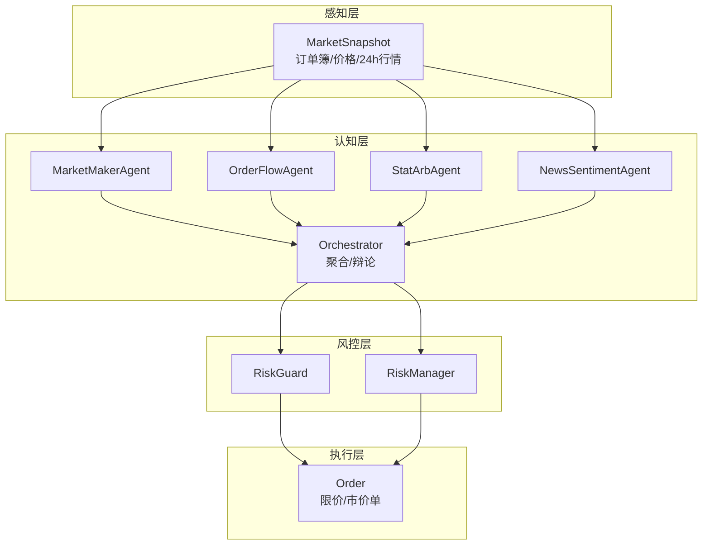
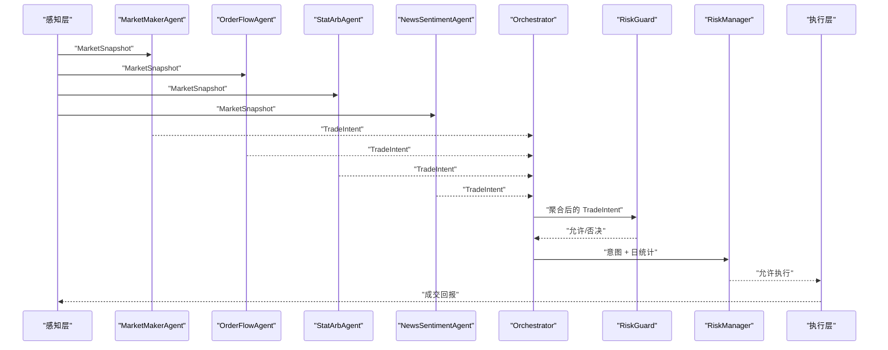
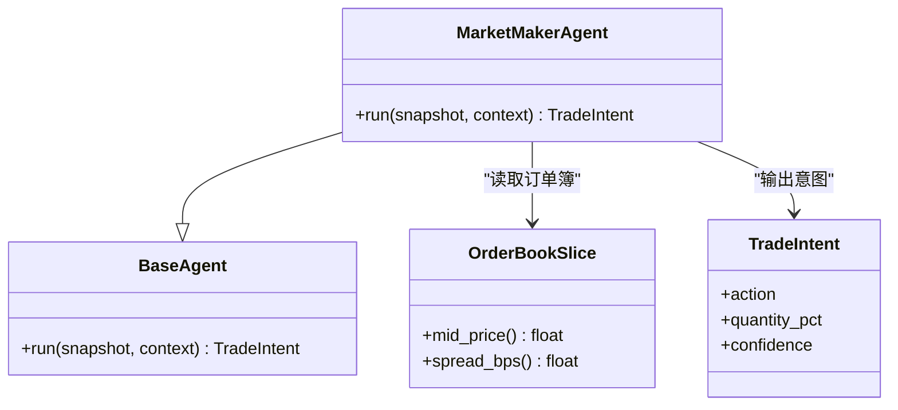
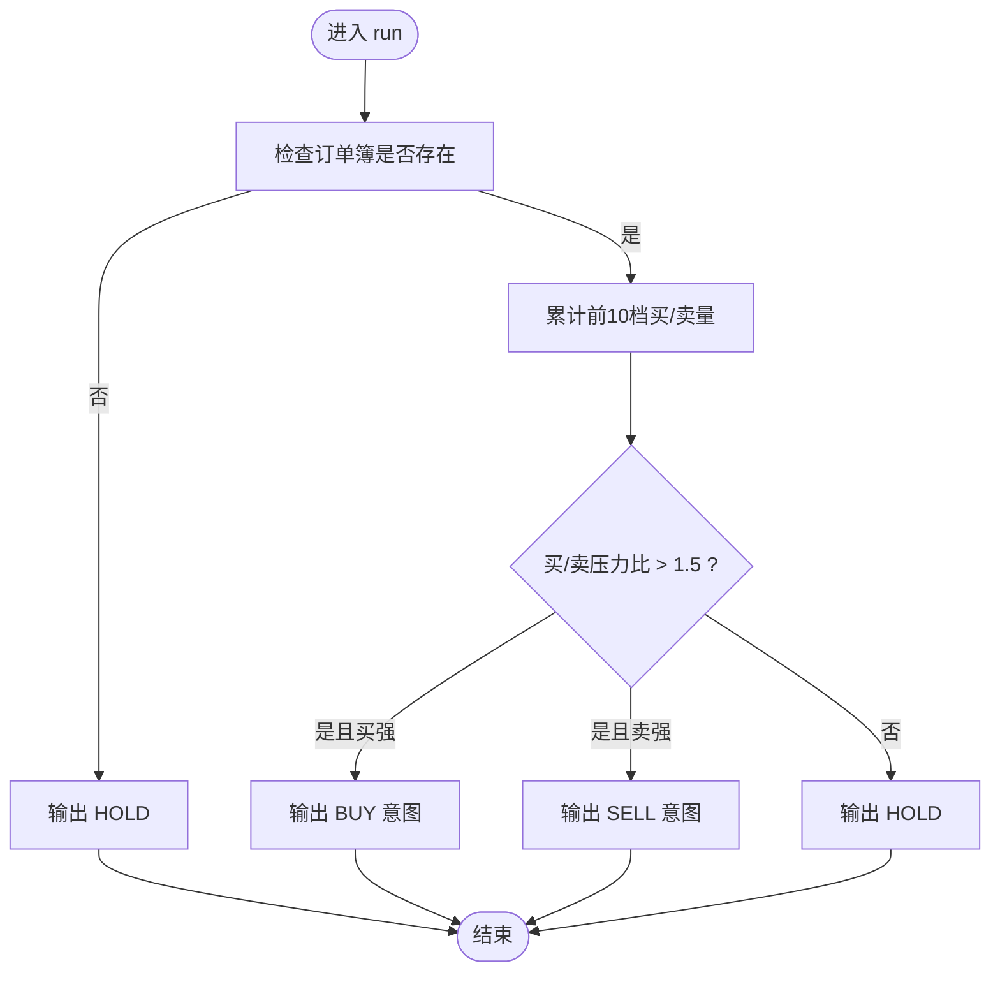
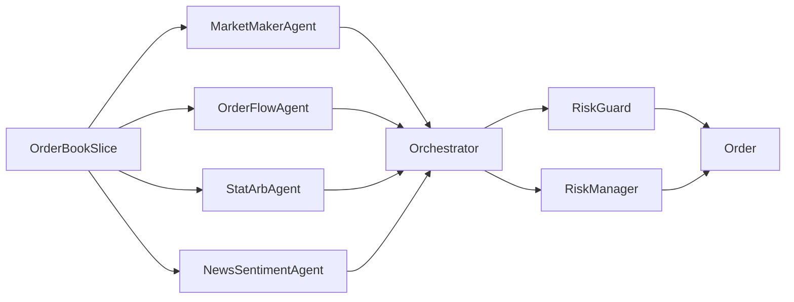

# 专业代理

<cite>
**本文引用的文件**
- [src/aetherlife/cognition/agents.py](file://src/aetherlife/cognition/agents.py)
- [src/aetherlife/cognition/agent_specialized.py](file://src/aetherlife/cognition/agent_specialized.py)
- [src/aetherlife/cognition/orchestrator.py](file://src/aetherlife/cognition/orchestrator.py)
- [src/aetherlife/cognition/schemas.py](file://src/aetherlife/cognition/schemas.py)
- [src/aetherlife/perception/models.py](file://src/aetherlife/perception/models.py)
- [src/aetherlife/guard/risk_guard.py](file://src/aetherlife/guard/risk_guard.py)
- [src/utils/risk_manager.py](file://src/utils/risk_manager.py)
- [src/execution/order.py](file://src/execution/order.py)
- [src/aetherlife/cognition/agent_cross_market.py](file://src/aetherlife/cognition/agent_cross_market.py)
</cite>

## 目录
1. [简介](#简介)
2. [项目结构](#项目结构)
3. [核心组件](#核心组件)
4. [架构总览](#架构总览)
5. [详细组件分析](#详细组件分析)
6. [依赖关系分析](#依赖关系分析)
7. [性能考量](#性能考量)
8. [故障排查指南](#故障排查指南)
9. [结论](#结论)

## 简介
本文件面向“专业代理”能力，围绕以下四类代理展开：
- 做市商代理（MarketMakerAgent）：订单簿分析、价差计算、库存管理策略
- 订单流代理（OrderFlowAgent）：微观结构分析、买卖压力判断、交易时机选择
- 统计套利代理（StatArbAgent）：单品种套利逻辑（当前为占位实现，后续可接入协整）
- 新闻情感代理（NewsSentimentAgent）：API集成与情绪分析框架（当前为占位实现）

同时，文档涵盖决策规则、风险控制、性能指标与实际应用场景，并提供可视化图示帮助理解。

## 项目结构
本项目采用“认知层（Agent）+ 感知层（MarketSnapshot）+ 风控层（RiskGuard/RiskManager）+ 执行层（Order）”的分层架构。专业代理位于认知层，接收感知层提供的市场快照，输出结构化交易意图，再由风控层进行拦截与审计，最终驱动执行层下单。

图表来源
- [src/aetherlife/cognition/orchestrator.py](file://src/aetherlife/cognition/orchestrator.py#L16-L53)
- [src/aetherlife/cognition/agents.py](file://src/aetherlife/cognition/agents.py#L25-L108)
- [src/aetherlife/perception/models.py](file://src/aetherlife/perception/models.py#L54-L64)
- [src/aetherlife/guard/risk_guard.py](file://src/aetherlife/guard/risk_guard.py#L23-L68)
- [src/utils/risk_manager.py](file://src/utils/risk_manager.py#L12-L241)
- [src/execution/order.py](file://src/execution/order.py#L1-L26)

章节来源
- [src/aetherlife/cognition/orchestrator.py](file://src/aetherlife/cognition/orchestrator.py#L16-L53)
- [src/aetherlife/cognition/agents.py](file://src/aetherlife/cognition/agents.py#L25-L108)
- [src/aetherlife/perception/models.py](file://src/aetherlife/perception/models.py#L54-L64)
- [src/aetherlife/guard/risk_guard.py](file://src/aetherlife/guard/risk_guard.py#L23-L68)
- [src/utils/risk_manager.py](file://src/utils/risk_manager.py#L12-L241)
- [src/execution/order.py](file://src/execution/order.py#L1-L26)

## 核心组件
- 专业代理基类与具体代理
  - 基类：BaseAgent，定义统一的异步 run 接口，接收 MarketSnapshot 与上下文字符串，返回 TradeIntent
  - 具体代理：MarketMakerAgent、OrderFlowAgent、StatArbAgent、NewsSentimentAgent
- 认知层编排器：Orchestrator，负责并行运行多个代理，聚合其意图，必要时启用辩论模式，最后交由风控代理否决
- 风控层：RiskGuard（执行前拦截与审计）、RiskManager（仓位/止损止盈/熔断/日限）
- 执行层：Order（限价/市价单占位实现）
- 数据模型：TradeIntent、DecisionContext、MarketSnapshot、OrderBookSlice 等

章节来源
- [src/aetherlife/cognition/agents.py](file://src/aetherlife/cognition/agents.py#L13-L108)
- [src/aetherlife/cognition/orchestrator.py](file://src/aetherlife/cognition/orchestrator.py#L16-L93)
- [src/aetherlife/guard/risk_guard.py](file://src/aetherlife/guard/risk_guard.py#L23-L84)
- [src/utils/risk_manager.py](file://src/utils/risk_manager.py#L12-L241)
- [src/execution/order.py](file://src/execution/order.py#L1-L26)
- [src/aetherlife/cognition/schemas.py](file://src/aetherlife/cognition/schemas.py#L32-L59)
- [src/aetherlife/perception/models.py](file://src/aetherlife/perception/models.py#L15-L64)

## 架构总览
下图展示专业代理在系统中的位置与交互流程：感知层提供 MarketSnapshot，专业代理基于订单簿与上下文生成 TradeIntent，编排器聚合/辩论后交由风控层拦截，最终驱动执行层下单。

图表来源
- [src/aetherlife/cognition/orchestrator.py](file://src/aetherlife/cognition/orchestrator.py#L38-L53)
- [src/aetherlife/cognition/agents.py](file://src/aetherlife/cognition/agents.py#L25-L108)
- [src/aetherlife/guard/risk_guard.py](file://src/aetherlife/guard/risk_guard.py#L48-L68)
- [src/utils/risk_manager.py](file://src/utils/risk_manager.py#L175-L194)

## 详细组件分析

### 做市商代理（MarketMakerAgent）
- 决策规则
  - 以订单簿为中心：计算中间价与价差（bps），若价差过大则观望
  - 买卖压力：取前N档买卖量求和，比较买/卖压力，形成买入/卖出意图
  - 保守仓位：默认 10% 仓位，结合 confidence 输出
- 风险控制
  - 价差阈值：当价差过大时直接 HOLD，避免滑点与流动性风险
  - 与风控层配合：Orchestrator 聚合后交由 RiskGuard 判断是否否决
- 性能指标
  - 价差 bps、买卖压力比、confidence、执行命中率（可由上层统计）
- 实际应用场景
  - 低流动性市场（如加密货币）的薄价差做市
  - 高频/微结构场景下的买卖压力捕捉
- 代码级关系图

图表来源
- [src/aetherlife/cognition/agents.py](file://src/aetherlife/cognition/agents.py#L25-L47)
- [src/aetherlife/perception/models.py](file://src/aetherlife/perception/models.py#L15-L37)
- [src/aetherlife/cognition/schemas.py](file://src/aetherlife/cognition/schemas.py#L32-L59)

章节来源
- [src/aetherlife/cognition/agents.py](file://src/aetherlife/cognition/agents.py#L25-L47)
- [src/aetherlife/perception/models.py](file://src/aetherlife/perception/models.py#L15-L37)
- [src/aetherlife/cognition/schemas.py](file://src/aetherlife/cognition/schemas.py#L32-L59)

### 订单流代理（OrderFlowAgent）
- 决策规则
  - 以订单簿买卖压力为核心：取前10档累计买/卖量，比较比例
  - 1.5 倍阈值：买盘强于卖盘或反之即给出相应方向意图
  - 保守仓位：默认 8% 仓位，结合 confidence 输出
- 风险控制
  - 与 MarketMakerAgent 类似，价差过大时 HOLD
  - 编排器聚合后由风控层拦截
- 性能指标
  - 订单流比、confidence、胜率、盈亏比
- 实际应用场景
  - 微观结构分析、流动性提供者（LP）策略、高频交易中的买卖压力识别

图表来源
- [src/aetherlife/cognition/agents.py](file://src/aetherlife/cognition/agents.py#L71-L87)

章节来源
- [src/aetherlife/cognition/agents.py](file://src/aetherlife/cognition/agents.py#L71-L87)

### 统计套利代理（StatArbAgent）
- 当前实现
  - 单品种占位：无价差对，直接 HOLD，confidence 保持中性
- 后续扩展建议（协整分析准备）
  - 数据准备：多时间序列价格序列（至少两个相关资产）
  - 平稳性检验：ADF/PP/KPSS 等单位根检验
  - 参数估计：OLS/ML 估计协整向量
  - 均值回归：残差序列均值回复，设定上下轨
  - 风控：止损/止盈/熔断，动态仓位
- 决策规则（扩展后）
  - 残差偏离上轨→做空价差（或对应资产组合）
  - 残差偏离下轨→做多价差（或对应资产组合）
  - 回归中线→平仓
- 风险控制
  - 严控单笔/日最大损失，熔断与冷却
  - 动态跟踪残差波动，设置动态止损
- 性能指标
  - 协整检验 p 值、残差半衰期、夏普比率、最大回撤
- 实际应用场景
  - 股债配对、ETF/指数配对、跨市场价差

章节来源
- [src/aetherlife/cognition/agents.py](file://src/aetherlife/cognition/agents.py#L90-L98)

### 新闻情感代理（NewsSentimentAgent）
- 当前实现
  - 占位：直接 HOLD，confidence 中性
- 框架与集成建议
  - 数据源：X/Twitter、新闻 API（如 NewsAPI/GDELT）、中文平台（微信公众号/雪球/知乎）
  - 模型：预训练情感模型（如 BERT-based）或规则词典
  - 输出：标准化情绪分数（-1 到 1），结合 MarketSnapshot 与上下文
- 决策规则（扩展后）
  - 强正向：买入
  - 强负向：卖出
  - 中性：观望
- 风险控制
  - 情绪阈值与仓位联动，避免极端情绪导致的反向信号
- 性能指标
  - 情绪预测准确率、胜率、信息系数 IC
- 实际应用场景
  - 宏观事件驱动、政策公告、财报季、地缘政治

章节来源
- [src/aetherlife/cognition/agents.py](file://src/aetherlife/cognition/agents.py#L101-L108)
- [src/aetherlife/cognition/agent_cross_market.py](file://src/aetherlife/cognition/agent_cross_market.py#L288-L405)

### 专业代理的跨市场与微观结构扩展
- 跨市场 Lead-Lag 套利（CrossMarketLeadLagAgent）
  - 基于价格历史计算相对变化，检测领先-滞后信号
  - 依据信号强度调整仓位与 confidence
- 外汇/期货/加密货币等市场的微观结构专家
  - 针对不同市场的点差、流动性、交易制度定制策略
  - 例如：外汇对点差极小，阈值更严格；期货关注基差与展期

章节来源
- [src/aetherlife/cognition/agent_cross_market.py](file://src/aetherlife/cognition/agent_cross_market.py#L16-L145)
- [src/aetherlife/cognition/agent_cross_market.py](file://src/aetherlife/cognition/agent_cross_market.py#L147-L285)
- [src/aetherlife/cognition/agent_cross_market.py](file://src/aetherlife/cognition/agent_cross_market.py#L288-L405)

## 依赖关系分析
- 代理与感知层
  - MarketMakerAgent/OrderFlowAgent/StatArbAgent/NewsSentimentAgent 均依赖 MarketSnapshot 提供的订单簿与价格信息
- 代理与编排器
  - Orchestrator 并行运行多个代理，聚合意图，必要时启用辩论（Bull/Bear/Judge）
- 代理与风控层
  - RiskGuardAgent 仅输出 HOLD/否决，由外部逻辑解释“是否否决”
  - RiskGuard 执行前拦截，结合日收益与限额
  - RiskManager 负责仓位/止损止盈/熔断/日限
- 执行层
  - Order（限价/市价单）为占位实现，后续接入真实交易所客户端

图表来源
- [src/aetherlife/cognition/agents.py](file://src/aetherlife/cognition/agents.py#L25-L108)
- [src/aetherlife/cognition/orchestrator.py](file://src/aetherlife/cognition/orchestrator.py#L16-L53)
- [src/aetherlife/guard/risk_guard.py](file://src/aetherlife/guard/risk_guard.py#L23-L68)
- [src/utils/risk_manager.py](file://src/utils/risk_manager.py#L12-L241)
- [src/execution/order.py](file://src/execution/order.py#L1-L26)

章节来源
- [src/aetherlife/cognition/agents.py](file://src/aetherlife/cognition/agents.py#L25-L108)
- [src/aetherlife/cognition/orchestrator.py](file://src/aetherlife/cognition/orchestrator.py#L16-L53)
- [src/aetherlife/guard/risk_guard.py](file://src/aetherlife/guard/risk_guard.py#L23-L68)
- [src/utils/risk_manager.py](file://src/utils/risk_manager.py#L12-L241)
- [src/execution/order.py](file://src/execution/order.py#L1-L26)

## 性能考量
- 订单簿深度与价差
  - 价差过大时优先 HOLD，避免滑点与冲击成本
  - 买卖压力比阈值应随市场波动率动态调整
- 仓位与风险预算
  - RiskManager 提供最大仓位、止损止盈、熔断与日限
  - RiskGuard 提供执行前拦截与审计
- 并发与吞吐
  - Orchestrator 并行运行多个代理，提高响应速度
  - 订单簿与上下文解析应尽量轻量化，避免阻塞
- 指标与回测
  - 建议补充：胜率、盈亏比、最大连续亏损、夏普比率、最大回撤等

## 故障排查指南
- 订单簿为空
  - 现象：代理输出 HOLD，reason 明确
  - 处理：检查感知层数据拉取与 MarketSnapshot 构造
- 价差过大
  - 现象：MarketMakerAgent/OrderFlowAgent 输出 HOLD
  - 处理：检查流动性状况，等待流动性改善
- 风控拦截
  - 现象：RiskGuard 返回拒绝或需要人工确认
  - 处理：检查日收益、限额与熔断状态；必要时暂停交易
- 执行失败
  - 现象：下单异常
  - 处理：检查交易所客户端、账户权限与最小下单量精度

章节来源
- [src/aetherlife/cognition/agents.py](file://src/aetherlife/cognition/agents.py#L25-L47)
- [src/aetherlife/guard/risk_guard.py](file://src/aetherlife/guard/risk_guard.py#L48-L68)
- [src/utils/risk_manager.py](file://src/utils/risk_manager.py#L175-L194)

## 结论
- MarketMakerAgent 与 OrderFlowAgent 以订单簿为核心，通过价差与买卖压力快速做出交易决策，适合高频与微结构场景
- StatArbAgent 当前为占位实现，后续可接入协整分析，构建稳健的单品种均值回归策略
- NewsSentimentAgent 为情绪分析预留框架，可对接多源 API 与模型，提升宏观事件驱动的交易质量
- 风控体系（RiskGuard 与 RiskManager）贯穿执行前与执行中，确保系统安全与合规
- 建议持续优化阈值、动态仓位与熔断策略，结合回测与实盘指标迭代