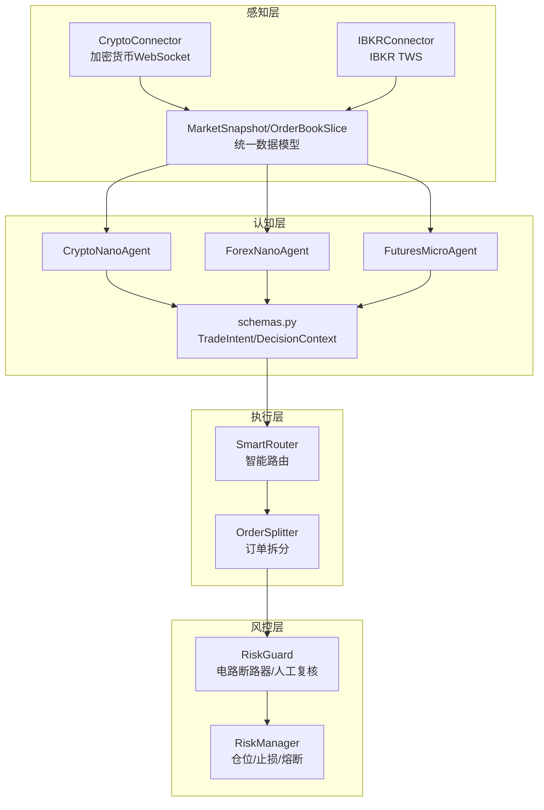
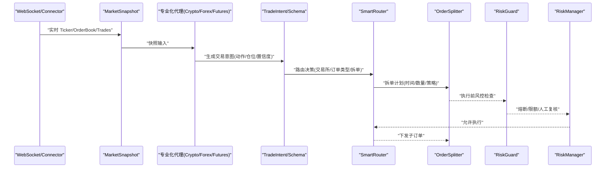
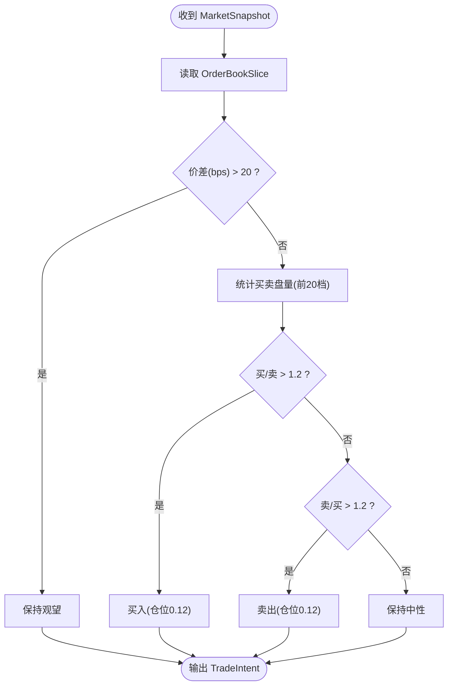
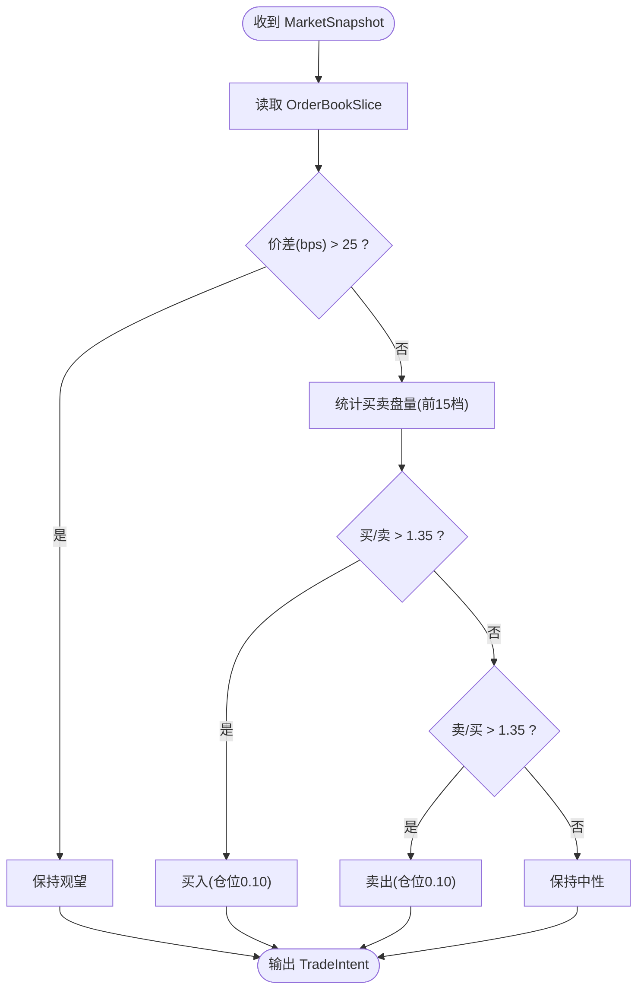
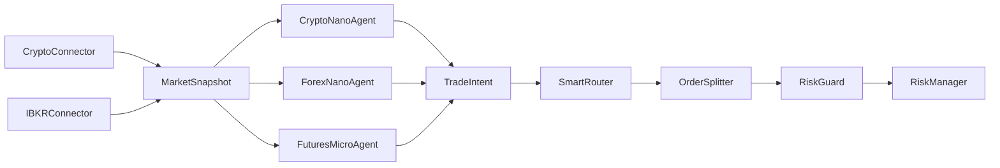

# 专业化市场代理

<cite>
**本文引用的文件**
- [agent_specialized.py](file://src/aetherlife/cognition/agent_specialized.py)
- [agent_cross_market.py](file://src/aetherlife/cognition/agent_cross_market.py)
- [crypto_connector.py](file://src/aetherlife/perception/crypto_connector.py)
- [ibkr_connector.py](file://src/aetherlife/perception/ibkr_connector.py)
- [models.py](file://src/aetherlife/perception/models.py)
- [schemas.py](file://src/aetherlife/cognition/schemas.py)
- [risk_guard.py](file://src/aetherlife/guard/risk_guard.py)
- [risk_manager.py](file://src/utils/risk_manager.py)
- [factory.py](file://src/strategies/factory.py)
- [base.py](file://src/strategies/base.py)
- [smart_router.py](file://src/aetherlife/execution/smart_router.py)
- [order_splitter.py](file://src/aetherlife/execution/order_splitter.py)
- [orchestrator.py](file://src/aetherlife/cognition/orchestrator.py)
</cite>

## 目录
1. [简介](#简介)
2. [项目结构](#项目结构)
3. [核心组件](#核心组件)
4. [架构总览](#架构总览)
5. [专业化代理详解](#专业化代理详解)
6. [依赖关系分析](#依赖关系分析)
7. [性能考量](#性能考量)
8. [故障排查指南](#故障排查指南)
9. [结论](#结论)

## 简介
本文件面向专业化市场代理的使用者与维护者，系统化阐述三类微代理在高频交易、流动性分析与价格发现方面的策略设计与实现要点，并结合风控与执行链路给出优化建议。重点覆盖：
- CryptoNanoAgent：加密货币高频率交易策略、资金费率与流动性敏感性
- ForexNanoAgent：外汇点差优化、流动性提供与市场影响最小化
- FuturesNanoAgent：期货保证金管理、杠杆控制与合约轮换逻辑

## 项目结构
系统采用“感知-认知-执行-风控”分层架构，专业化代理位于认知层，负责基于市场快照生成交易意图；感知层提供多交易所实时数据；执行层负责路由与订单拆分；风控层贯穿全链路。

**图表来源**
- [crypto_connector.py](file://src/aetherlife/perception/crypto_connector.py#L23-L369)
- [ibkr_connector.py](file://src/aetherlife/perception/ibkr_connector.py#L36-L323)
- [models.py](file://src/aetherlife/perception/models.py#L15-L64)
- [agent_specialized.py](file://src/aetherlife/cognition/agent_specialized.py#L281-L352)
- [agent_cross_market.py](file://src/aetherlife/cognition/agent_cross_market.py#L147-L285)
- [schemas.py](file://src/aetherlife/cognition/schemas.py#L32-L125)
- [smart_router.py](file://src/aetherlife/execution/smart_router.py#L89-L395)
- [order_splitter.py](file://src/aetherlife/execution/order_splitter.py#L39-L427)
- [risk_guard.py](file://src/aetherlife/guard/risk_guard.py#L23-L84)
- [risk_manager.py](file://src/utils/risk_manager.py#L12-L388)

**章节来源**
- [crypto_connector.py](file://src/aetherlife/perception/crypto_connector.py#L23-L369)
- [ibkr_connector.py](file://src/aetherlife/perception/ibkr_connector.py#L36-L323)
- [models.py](file://src/aetherlife/perception/models.py#L15-L64)
- [agent_specialized.py](file://src/aetherlife/cognition/agent_specialized.py#L281-L352)
- [agent_cross_market.py](file://src/aetherlife/cognition/agent_cross_market.py#L147-L285)
- [schemas.py](file://src/aetherlife/cognition/schemas.py#L32-L125)
- [smart_router.py](file://src/aetherlife/execution/smart_router.py#L89-L395)
- [order_splitter.py](file://src/aetherlife/execution/order_splitter.py#L39-L427)
- [risk_guard.py](file://src/aetherlife/guard/risk_guard.py#L23-L84)
- [risk_manager.py](file://src/utils/risk_manager.py#L12-L388)

## 核心组件
- 专业化代理
  - CryptoNanoAgent：针对加密货币高灵敏度订单流与极小点差场景，采用更激进的阈值与更高仓位比例
  - ForexNanoAgent：针对外汇点差敏感与日内波动捕捉，强调点差阈值与订单流比值
  - FuturesMicroAgent：针对期货展期、基差与成本管理，侧重流动性与价差控制
- 感知层
  - CryptoConnector：基于 CCXT Pro 的多交易所 WebSocket 订阅，提供 Ticker/OrderBook/Trades 实时流
  - IBKRConnector：基于 ib_insync 的 TWS/Gateway 订阅，支持股票、期货、外汇与 A 股 Stock Connect
  - 统一数据模型：MarketSnapshot、OrderBookSlice、OHLCVCandle
- 执行与风控
  - SmartRouter：根据市场类型与订单规模选择交易所与订单类型，估算滑点与手续费，决定是否拆单
  - OrderSplitter：基于市场深度与波动率进行 TWAP/VWAP/Iceberg 等拆单，降低市场冲击
  - RiskGuard：电路断路器、单日最大亏损、大额人工复核
  - RiskManager：仓位管理、止损止盈、熔断与连续亏损限制

**章节来源**
- [agent_specialized.py](file://src/aetherlife/cognition/agent_specialized.py#L281-L352)
- [agent_cross_market.py](file://src/aetherlife/cognition/agent_cross_market.py#L147-L285)
- [crypto_connector.py](file://src/aetherlife/perception/crypto_connector.py#L23-L369)
- [ibkr_connector.py](file://src/aetherlife/perception/ibkr_connector.py#L36-L323)
- [models.py](file://src/aetherlife/perception/models.py#L15-L64)
- [smart_router.py](file://src/aetherlife/execution/smart_router.py#L89-L395)
- [order_splitter.py](file://src/aetherlife/execution/order_splitter.py#L39-L427)
- [risk_guard.py](file://src/aetherlife/guard/risk_guard.py#L23-L84)
- [risk_manager.py](file://src/utils/risk_manager.py#L12-L388)

## 架构总览
下图展示从感知到执行的关键交互流程，以及专业化代理如何在不同市场中应用差异化策略。

**图表来源**
- [crypto_connector.py](file://src/aetherlife/perception/crypto_connector.py#L116-L275)
- [ibkr_connector.py](file://src/aetherlife/perception/ibkr_connector.py#L158-L284)
- [agent_specialized.py](file://src/aetherlife/cognition/agent_specialized.py#L295-L351)
- [agent_cross_market.py](file://src/aetherlife/cognition/agent_cross_market.py#L160-L285)
- [schemas.py](file://src/aetherlife/cognition/schemas.py#L32-L62)
- [smart_router.py](file://src/aetherlife/execution/smart_router.py#L98-L160)
- [order_splitter.py](file://src/aetherlife/execution/order_splitter.py#L73-L120)
- [risk_guard.py](file://src/aetherlife/guard/risk_guard.py#L48-L68)
- [risk_manager.py](file://src/utils/risk_manager.py#L175-L194)

## 专业化代理详解

### 加密货币微代理：CryptoNanoAgent
- 市场特点
  - 24/7 交易、高波动、极小点差（通常 <20 bps）、高频策略适用
  - 资金费率与永续特性对策略收益有显著影响
- 交易规则与策略
  - 订单流阈值更敏感：当买/卖盘量比超过 1.2 时触发方向性交易
  - 价差阈值：价差超过 20 bps 时保持观望
  - 仓位比例：相对激进，以 0.12 的比例参与趋势
- 风险控制
  - 结合 RiskGuard 的电路断路器与 RiskManager 的止损止盈，防止极端波动导致的连续亏损
  - SmartRouter 与 OrderSplitter 在高波动时段减少单笔冲击
- 优化策略
  - 引入资金费率监控与滑点预测，动态调整阈值与仓位
  - 多交易所对比路由，利用流动性差异降低执行成本

**图表来源**
- [agent_specialized.py](file://src/aetherlife/cognition/agent_specialized.py#L295-L351)
- [models.py](file://src/aetherlife/perception/models.py#L25-L37)

**章节来源**
- [agent_specialized.py](file://src/aetherlife/cognition/agent_specialized.py#L281-L352)
- [crypto_connector.py](file://src/aetherlife/perception/crypto_connector.py#L116-L214)
- [risk_guard.py](file://src/aetherlife/guard/risk_guard.py#L48-L68)
- [risk_manager.py](file://src/utils/risk_manager.py#L73-L105)
- [smart_router.py](file://src/aetherlife/execution/smart_router.py#L98-L160)
- [order_splitter.py](file://src/aetherlife/execution/order_splitter.py#L73-L120)

### 外汇微代理：ForexNanoAgent
- 市场特点
  - 点差极小且对交易成本敏感（通常 <10 bps），日内波动捕捉为主
  - 货币对相关性强，适合跨货币对联动策略
- 交易规则与策略
  - 价差阈值：超过 10 bps 即保持观望
  - 订单流策略：买/卖盘量比超过 1.25 触发方向性交易
  - 仓位比例：保守 0.08，强调点差与流动性优先
- 风险控制
  - 严格控制单笔订单规模，避免点差放大带来的成本侵蚀
  - 与 SmartRouter 的滑点估算配合，确保订单类型与滑点预算匹配
- 优化策略
  - 引入点差预测与流动性预测，动态设定价差阈值
  - 通过 IBKRConnector 的多货币对订阅，构建货币对相关性网络

**图表来源**
- [agent_cross_market.py](file://src/aetherlife/cognition/agent_cross_market.py#L160-L215)
- [models.py](file://src/aetherlife/perception/models.py#L25-L37)

**章节来源**
- [agent_cross_market.py](file://src/aetherlife/cognition/agent_cross_market.py#L147-L215)
- [ibkr_connector.py](file://src/aetherlife/perception/ibkr_connector.py#L158-L284)
- [smart_router.py](file://src/aetherlife/execution/smart_router.py#L98-L160)
- [risk_manager.py](file://src/utils/risk_manager.py#L175-L194)

### 期货微代理：FuturesMicroAgent
- 市场特点
  - 合约轮换与基差变化显著，需关注展期成本与滚动策略
  - 保证金与杠杆对风险暴露影响大，需严格控制头寸规模
- 交易规则与策略
  - 价差阈值：超过 25 bps 保持观望
  - 订单流策略：买/卖盘量比超过 1.35 触发方向性交易
  - 仓位比例：0.10，兼顾趋势捕捉与风险控制
- 风险控制
  - 与 RiskManager 的杠杆上限与熔断机制联动，防止展期与波动叠加导致的大幅回撤
  - SmartRouter 与 OrderSplitter 在合约切换窗口期减少冲击
- 优化策略
  - 引入基差模型与展期成本预测，动态调整入场时机
  - 多周期信号融合，避免单一周期的噪声误导

**图表来源**
- [agent_cross_market.py](file://src/aetherlife/cognition/agent_cross_market.py#L231-L285)
- [models.py](file://src/aetherlife/perception/models.py#L25-L37)

**章节来源**
- [agent_cross_market.py](file://src/aetherlife/cognition/agent_cross_market.py#L218-L285)
- [risk_manager.py](file://src/utils/risk_manager.py#L12-L388)
- [smart_router.py](file://src/aetherlife/execution/smart_router.py#L98-L160)
- [order_splitter.py](file://src/aetherlife/execution/order_splitter.py#L73-L120)

## 依赖关系分析
- 代理与感知层
  - 三大代理均依赖 MarketSnapshot 与 OrderBookSlice，前者来自 CryptoConnector/IBKRConnector 的实时流
- 代理与执行层
  - 代理输出 TradeIntent，经 SmartRouter 选择交易所与订单类型，再由 OrderSplitter 拆单
- 代理与风控层
  - RiskGuard 在执行前进行电路断路器与大额人工复核检查；RiskManager 提供仓位与止损止盈控制
- 策略工厂
  - 策略工厂用于创建具体策略实例，便于在执行层与风控层复用

**图表来源**
- [crypto_connector.py](file://src/aetherlife/perception/crypto_connector.py#L277-L328)
- [ibkr_connector.py](file://src/aetherlife/perception/ibkr_connector.py#L229-L284)
- [agent_specialized.py](file://src/aetherlife/cognition/agent_specialized.py#L295-L351)
- [agent_cross_market.py](file://src/aetherlife/cognition/agent_cross_market.py#L160-L285)
- [schemas.py](file://src/aetherlife/cognition/schemas.py#L32-L62)
- [smart_router.py](file://src/aetherlife/execution/smart_router.py#L98-L160)
- [order_splitter.py](file://src/aetherlife/execution/order_splitter.py#L73-L120)
- [risk_guard.py](file://src/aetherlife/guard/risk_guard.py#L48-L68)
- [risk_manager.py](file://src/utils/risk_manager.py#L175-L194)

**章节来源**
- [factory.py](file://src/strategies/factory.py#L10-L36)
- [base.py](file://src/strategies/base.py#L6-L31)

## 性能考量
- 感知层
  - WebSocket 订阅与回调处理需避免阻塞，建议使用异步队列与背压控制
  - 订阅去重与自动重连逻辑应具备指数退避与错误隔离
- 认知层
  - 代理策略阈值与仓位应结合历史波动率自适应调整，避免固定阈值在不同市场环境失效
- 执行层
  - 拆单策略应结合市场深度与成交量分布，避免在浅薄深度下单造成更大滑点
  - 路由决策需考虑交易成本与流动性，优先选择高流动性与低滑点的交易所
- 风控层
  - 电路断路器与熔断冷却时间应与市场波动周期匹配，避免过度保护
  - 止损止盈与追踪止损应与信号强度联动，提高胜率与盈亏比

## 故障排查指南
- 连接问题
  - CryptoConnector：检查 CCXT Pro 是否安装、测试网地址配置、自动重连日志
  - IBKRConnector：确认 TWS/Gateway 地址端口、客户端 ID、断线重连与重新订阅流程
- 数据问题
  - 订单簿为空或深度不足：检查订阅是否成功、回调是否被异常中断
  - MarketSnapshot 字段缺失：确认 Connector 的数据映射与时间戳处理
- 策略问题
  - 代理未触发交易：核对价差阈值、订单流比值与仓位比例是否合理
  - 意图冲突：在多代理聚合时，检查权重与置信度归一化逻辑
- 执行问题
  - 滑点超限：评估 SmartRouter 的滑点估算与 OrderSplitter 的拆单粒度
  - 风控拦截：检查 RiskGuard 的电路断路器与 RiskManager 的熔断状态

**章节来源**
- [crypto_connector.py](file://src/aetherlife/perception/crypto_connector.py#L50-L86)
- [ibkr_connector.py](file://src/aetherlife/perception/ibkr_connector.py#L59-L86)
- [agent_specialized.py](file://src/aetherlife/cognition/agent_specialized.py#L295-L351)
- [agent_cross_market.py](file://src/aetherlife/cognition/agent_cross_market.py#L160-L285)
- [risk_guard.py](file://src/aetherlife/guard/risk_guard.py#L48-L68)
- [risk_manager.py](file://src/utils/risk_manager.py#L129-L153)

## 结论
本系统通过专业化代理在不同市场中的差异化策略，结合统一的数据模型与风控执行链路，实现了对高频、低点差、高波动市场的稳健应对。建议在实际部署中持续优化阈值自适应、滑点预测与熔断冷却策略，并加强跨市场联动与情绪因子的融合，以进一步提升策略稳定性与收益风险比。