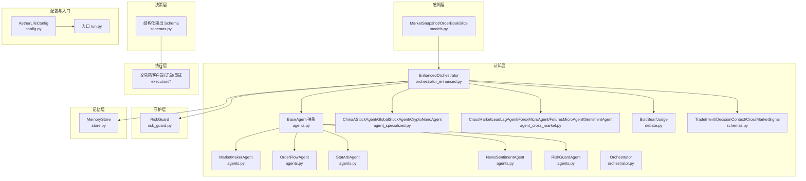
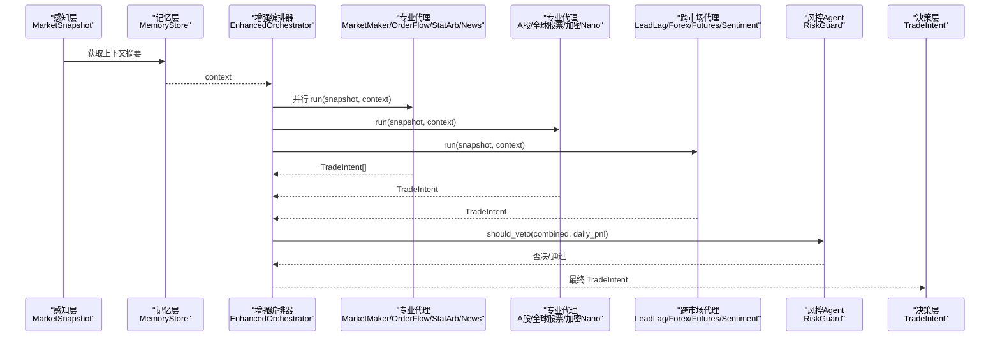
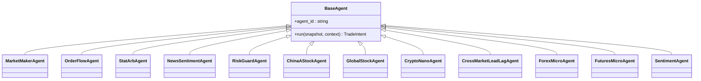
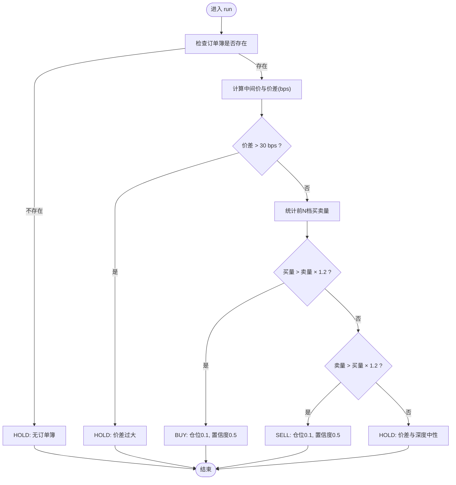
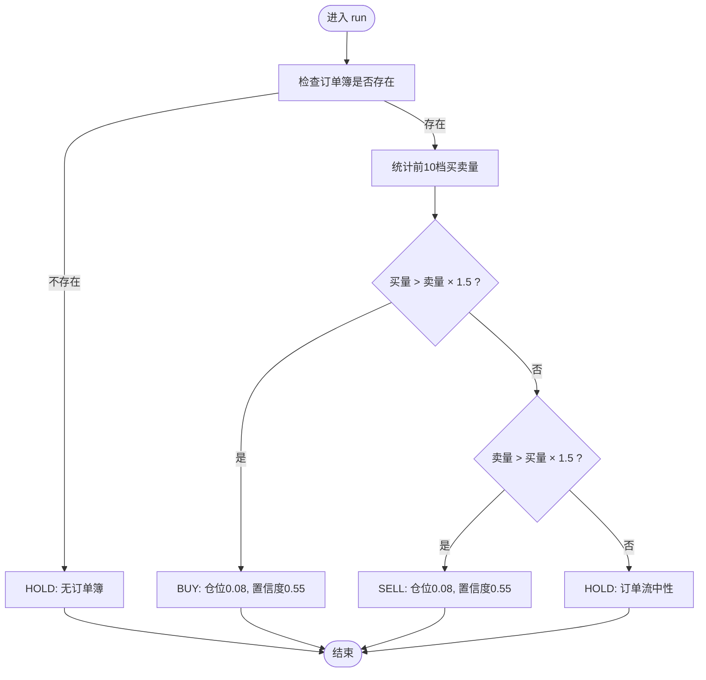
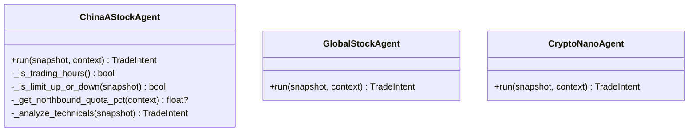
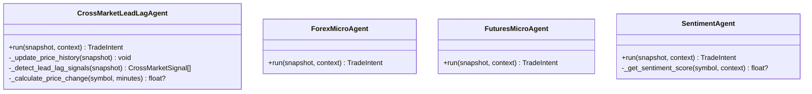
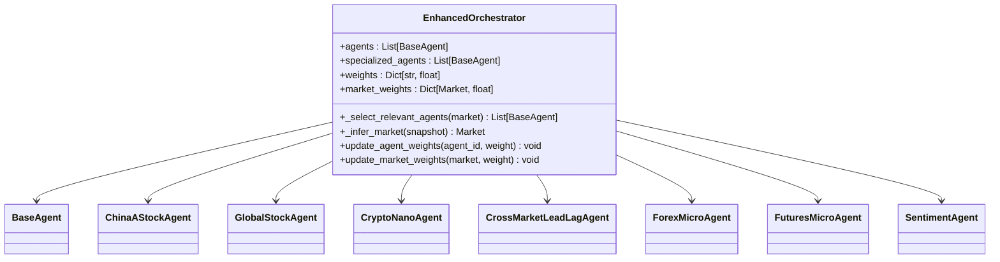
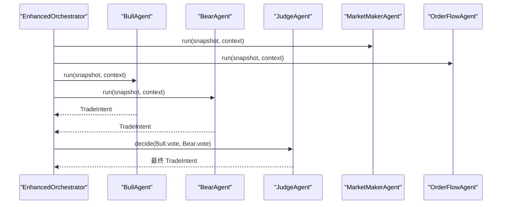
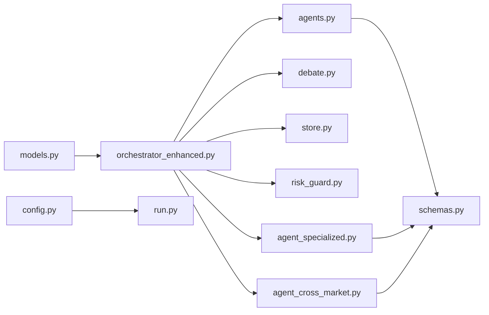

# 代理系统

<cite>
**本文引用的文件列表**
- [agents.py](file://src/aetherlife/cognition/agents.py)
- [agent_specialized.py](file://src/aetherlife/cognition/agent_specialized.py)
- [agent_cross_market.py](file://src/aetherlife/cognition/agent_cross_market.py)
- [schemas.py](file://src/aetherlife/cognition/schemas.py)
- [orchestrator.py](file://src/aetherlife/cognition/orchestrator.py)
- [orchestrator_enhanced.py](file://src/aetherlife/cognition/orchestrator_enhanced.py)
- [debate.py](file://src/aetherlife/cognition/debate.py)
- [models.py](file://src/aetherlife/perception/models.py)
- [risk_guard.py](file://src/aetherlife/guard/risk_guard.py)
- [store.py](file://src/aetherlife/memory/store.py)
- [config.py](file://src/aetherlife/config.py)
- [run.py](file://src/aetherlife/run.py)
- [cognition_multi_agent_demo.py](file://scripts/cognition_multi_agent_demo.py)
- [perception_connector_demo.py](file://scripts/perception_connector_demo.py)
</cite>

## 更新摘要
**变更内容**
- 新增7种专业代理类型，支持多市场协调和专业化分析
- 增强编排器功能，支持动态权重调整和市场类型推断
- 扩展市场类型支持，包括A股、外汇、期货等专业市场
- 改进决策逻辑，增加跨市场套利和情绪分析能力

## 目录
1. [引言](#引言)
2. [项目结构](#项目结构)
3. [核心组件](#核心组件)
4. [架构总览](#架构总览)
5. [详细组件分析](#详细组件分析)
6. [依赖关系分析](#依赖关系分析)
7. [性能考量](#性能考量)
8. [故障排查指南](#故障排查指南)
9. [结论](#结论)
10. [附录](#附录)

## 引言
本文件面向AetherLife系统的"代理组件群"，系统性梳理从基础抽象到专业代理、跨市场代理、风控与记忆存储、以及编排器的整体设计与实现要点。重点覆盖：
- BaseAgent基类的设计理念与通用接口
- MarketMakerAgent、OrderFlowAgent、StatArbAgent、NewsSentimentAgent等专业代理的具体实现
- 跨市场代理AgentCrossMarket的设计思路（多市场数据整合、价差分析、套利机会识别）
- 增强编排器EnhancedOrchestrator的多市场协调能力
- 训练数据来源、决策逻辑、风险控制与性能评估方法

## 项目结构
AetherLife采用分层架构：感知层提供统一数据模型与连接器；认知层定义代理抽象与编排器；决策层以结构化Schema输出；执行层对接交易所；守护层负责风控与审计；记忆层提供短期与情景记忆。

**图表来源**
- [agents.py](file://src/aetherlife/cognition/agents.py#L13-L109)
- [agent_specialized.py](file://src/aetherlife/cognition/agent_specialized.py#L17-L352)
- [agent_cross_market.py](file://src/aetherlife/cognition/agent_cross_market.py#L16-L405)
- [schemas.py](file://src/aetherlife/cognition/schemas.py#L32-L219)
- [orchestrator.py](file://src/aetherlife/cognition/orchestrator.py#L16-L93)
- [orchestrator_enhanced.py](file://src/aetherlife/cognition/orchestrator_enhanced.py#L21-L323)
- [models.py](file://src/aetherlife/perception/models.py#L15-L64)
- [risk_guard.py](file://src/aetherlife/guard/risk_guard.py#L23-L84)
- [store.py](file://src/aetherlife/memory/store.py#L43-L155)
- [config.py](file://src/aetherlife/config.py#L98-L131)
- [run.py](file://src/aetherlife/run.py#L52-L71)

**章节来源**
- [run.py](file://src/aetherlife/run.py#L52-L71)
- [config.py](file://src/aetherlife/config.py#L98-L131)

## 核心组件
- BaseAgent：抽象基类，定义统一的异步run接口，接收MarketSnapshot与上下文字符串，返回TradeIntent。
- TradeIntent：结构化输出，包含动作、市场、符号、仓位比例、置信度、止盈止损、时效性、元数据等。
- DecisionContext：决策上下文，承载市场快照、订单簿、持仓、情绪、风控状态、记忆上下文等。
- Orchestrator：协调器，聚合多个Agent或辩论流程，最终经风控Agent否决后输出。
- EnhancedOrchestrator：增强版协调器，支持多市场专业化Agent、动态权重调整和市场类型推断。
- RiskGuard：执行前风控检查，支持电路断路器、单日最大亏损、大额人工确认与审计。
- MemoryStore：短期+情景记忆，支持Redis持久化，提供上下文摘要与日收益汇总。
- MarketSnapshot/OrderBookSlice：感知层统一数据模型，提供mid_price与spread_bps等关键指标。

**章节来源**
- [agents.py](file://src/aetherlife/cognition/agents.py#L13-L109)
- [schemas.py](file://src/aetherlife/cognition/schemas.py#L32-L125)
- [orchestrator.py](file://src/aetherlife/cognition/orchestrator.py#L16-L93)
- [orchestrator_enhanced.py](file://src/aetherlife/cognition/orchestrator_enhanced.py#L21-L323)
- [risk_guard.py](file://src/aetherlife/guard/risk_guard.py#L23-L84)
- [store.py](file://src/aetherlife/memory/store.py#L43-L155)
- [models.py](file://src/aetherlife/perception/models.py#L15-L64)

## 架构总览
下图展示一次完整决策循环：感知层提供MarketSnapshot，记忆层提供上下文，增强编排器聚合各Agent或辩论，风控检查，最终输出结构化TradeIntent。

**图表来源**
- [orchestrator_enhanced.py](file://src/aetherlife/cognition/orchestrator_enhanced.py#L84-L151)
- [agents.py](file://src/aetherlife/cognition/agents.py#L25-L109)
- [agent_specialized.py](file://src/aetherlife/cognition/agent_specialized.py#L17-L352)
- [agent_cross_market.py](file://src/aetherlife/cognition/agent_cross_market.py#L16-L405)
- [risk_guard.py](file://src/aetherlife/guard/risk_guard.py#L48-L68)
- [schemas.py](file://src/aetherlife/cognition/schemas.py#L32-L62)

## 详细组件分析

### BaseAgent基类与通用接口
- 设计理念：统一异步接口，便于并行执行；输出TradeIntent，确保结构化与可审计。
- 通用接口：run(snapshot, context) -> TradeIntent；子类按市场与数据特征实现具体逻辑。
- 与其他组件关系：被所有专业代理继承；与编排器配合；与风控Agent协同。

**图表来源**
- [agents.py](file://src/aetherlife/cognition/agents.py#L13-L109)
- [agent_specialized.py](file://src/aetherlife/cognition/agent_specialized.py#L17-L352)
- [agent_cross_market.py](file://src/aetherlife/cognition/agent_cross_market.py#L16-L405)

**章节来源**
- [agents.py](file://src/aetherlife/cognition/agents.py#L13-L23)

### MarketMakerAgent（做市/价差代理）
- 决策依据：订单簿bid/ask深度与价差（bps）。当价差过大或买卖压力显著时给出行动建议。
- 逻辑要点：价差阈值控制、买卖压力比、默认持有策略与置信度设定。
- 适用场景：流动性充足、价差可控的市场环境。

**图表来源**
- [agents.py](file://src/aetherlife/cognition/agents.py#L25-L47)

**章节来源**
- [agents.py](file://src/aetherlife/cognition/agents.py#L25-L47)

### OrderFlowAgent（订单流/微观结构代理）
- 决策依据：近N档买卖盘总量比，强调微观流动性与短期压力。
- 逻辑要点：阈值更宽松，适合高频与快速波动市场；默认持有与中性判断。
- 适用场景：流动性较好、订单流变化明显的市场。

**图表来源**
- [agents.py](file://src/aetherlife/cognition/agents.py#L71-L87)

**章节来源**
- [agents.py](file://src/aetherlife/cognition/agents.py#L71-L87)

### StatArbAgent（统计套利代理）
- 当前实现：单品种MVP阶段，无价差对，优先观望。
- 发展方向：接入协整、多资产配对、滚动回归等统计套利方法。

**章节来源**
- [agents.py](file://src/aetherlife/cognition/agents.py#L90-L98)

### NewsSentimentAgent（新闻/情绪代理）
- 当前实现：占位符，返回HOLD并提示模块未接入。
- 发展方向：接入X/Twitter、新闻API、微信公众号、雪球、Reddit等，输出情绪分数并影响决策。

**章节来源**
- [agents.py](file://src/aetherlife/cognition/agents.py#L101-L109)

### RiskGuardAgent（风控代理）
- 角色定位：一票否决，不主动发起交易，仅基于外部逻辑进行否决判断。
- 否决条件：意图非HOLD且日收益超阈值或置信度过低。
- 与执行层配合：与守护层RiskGuard共同构成风控闭环。

**章节来源**
- [agents.py](file://src/aetherlife/cognition/agents.py#L50-L68)

### 专业代理：A股/全球股票/加密Nano
- ChinaAStockAgent：A股特有逻辑（交易时段、涨跌停、北向额度、印花税成本、T+1等），结合订单流与价差分析。
- GlobalStockAgent：美股/全球股票，考虑流动性与订单流，支持fractional shares与多时区。
- CryptoNanoAgent：加密货币nano永续，高灵敏度阈值，高频策略适用。

**图表来源**
- [agent_specialized.py](file://src/aetherlife/cognition/agent_specialized.py#L17-L352)

**章节来源**
- [agent_specialized.py](file://src/aetherlife/cognition/agent_specialized.py#L17-L352)

### 跨市场代理：Lead-Lag、外汇、期货、情绪
- CrossMarketLeadLagAgent：基于历史价格变化检测跨市场领先-滞后信号，输出目标市场的建议动作与强度。
- ForexMicroAgent：外汇点差敏感，基于买卖压力与价差阈值决策。
- FuturesMicroAgent：期货微策略，关注价差与订单流，适配展期与基差。
- SentimentAgent：情绪分析，从上下文解析情绪分数，映射到买入/卖出/持有。

**图表来源**
- [agent_cross_market.py](file://src/aetherlife/cognition/agent_cross_market.py#L16-L405)

**章节来源**
- [agent_cross_market.py](file://src/aetherlife/cognition/agent_cross_market.py#L16-L405)

### 增强编排器：多市场协调与专业化分析
- EnhancedOrchestrator：支持7种专业代理的协调，具备市场类型推断、动态权重调整和辩论机制。
- 市场类型推断：根据交易所和符号自动识别市场类型（加密货币、A股、美股、外汇、期货）。
- 动态权重调整：支持Agent权重和市场权重的实时调整。
- 多市场专业化：为不同市场类型选择相应的专业代理组合。

**图表来源**
- [orchestrator_enhanced.py](file://src/aetherlife/cognition/orchestrator_enhanced.py#L21-L323)

**章节来源**
- [orchestrator_enhanced.py](file://src/aetherlife/cognition/orchestrator_enhanced.py#L21-L323)

### 编排器与辩论工作流
- Orchestrator：默认并行调用多个Agent，加权聚合输出；可选开启辩论（Bull/Bear/Judge）。
- Bull/Bear/Judge：多方/空方视角解读同一快照，Judge基于置信度裁决。
- EnhancedOrchestrator：支持7种专业代理的协调，具备市场类型推断和动态权重调整。
- 风控：RiskGuardAgent参与否决，EnhancedOrchestrator再做最终判定。

**图表来源**
- [orchestrator.py](file://src/aetherlife/cognition/orchestrator.py#L55-L63)
- [debate.py](file://src/aetherlife/cognition/debate.py#L15-L99)

**章节来源**
- [orchestrator.py](file://src/aetherlife/cognition/orchestrator.py#L16-L93)
- [debate.py](file://src/aetherlife/cognition/debate.py#L15-L99)
- [orchestrator_enhanced.py](file://src/aetherlife/cognition/orchestrator_enhanced.py#L223-L233)

### 训练数据、决策逻辑与性能评估
- 训练数据来源：脚本演示展示了如何构造MarketSnapshot与上下文，用于Agent推理与编排器聚合。
- 决策逻辑：以结构化Schema输出，便于后续强化学习或LLM生成；支持元数据扩展。
- 性能评估：可通过MemoryStore记录交易事件与决策，计算日收益、胜率、最大回撤等指标；也可结合守护层审计日志进行事后复盘。
- 动态权重调整：支持实时调整Agent权重和市场权重，优化决策效果。

**章节来源**
- [cognition_multi_agent_demo.py](file://scripts/cognition_multi_agent_demo.py#L35-L265)
- [store.py](file://src/aetherlife/memory/store.py#L134-L145)
- [risk_guard.py](file://src/aetherlife/guard/risk_guard.py#L70-L83)
- [orchestrator_enhanced.py](file://src/aetherlife/cognition/orchestrator_enhanced.py#L314-L322)

## 依赖关系分析
- 组件耦合：增强编排器聚合多个代理，代理间低耦合；风控Agent与守护层形成独立检查点。
- 外部依赖：感知层提供统一数据模型；记忆层支持Redis持久化；配置层集中管理运行参数。
- 潜在循环依赖：当前文件组织清晰，未发现循环导入。

**图表来源**
- [orchestrator_enhanced.py](file://src/aetherlife/cognition/orchestrator_enhanced.py#L9-L16)
- [agents.py](file://src/aetherlife/cognition/agents.py#L9-L10)
- [agent_specialized.py](file://src/aetherlife/cognition/agent_specialized.py#L10-L12)
- [agent_cross_market.py](file://src/aetherlife/cognition/agent_cross_market.py#L9-L11)
- [models.py](file://src/aetherlife/perception/models.py#L15-L64)
- [config.py](file://src/aetherlife/config.py#L98-L131)
- [run.py](file://src/aetherlife/run.py#L22-L23)

**章节来源**
- [orchestrator.py](file://src/aetherlife/cognition/orchestrator.py#L16-L93)
- [agents.py](file://src/aetherlife/cognition/agents.py#L13-L109)
- [agent_specialized.py](file://src/aetherlife/cognition/agent_specialized.py#L17-L352)
- [agent_cross_market.py](file://src/aetherlife/cognition/agent_cross_market.py#L16-L405)
- [models.py](file://src/aetherlife/perception/models.py#L15-L64)
- [config.py](file://src/aetherlife/config.py#L98-L131)
- [run.py](file://src/aetherlife/run.py#L52-L71)

## 性能考量
- 并行执行：增强编排器默认并行调用多个Agent，提升响应速度。
- 动态权重调整：支持实时调整Agent权重和市场权重，优化决策效果。
- 价差与深度阈值：通过合理设置价差阈值与统计档位，减少无效交易与滑点。
- 记忆与审计：短期记忆与审计日志有助于快速定位问题，但需注意I/O开销。
- 市场类型推断：自动识别市场类型，减少人工配置，提高系统适应性。

## 故障排查指南
- 无订单簿数据：多数代理在订单簿缺失时返回HOLD，检查感知层连接器与数据管道。
- 价差过大：代理会主动观望，确认市场流动性与交易成本。
- 风控否决：若被风控否决，检查日收益、置信度与阈值设置。
- 审计日志：通过守护层审计接口查看事件详情，定位异常。
- 权重配置：检查Agent权重和市场权重设置，确保决策逻辑符合预期。

**章节来源**
- [agents.py](file://src/aetherlife/cognition/agents.py#L31-L47)
- [risk_guard.py](file://src/aetherlife/guard/risk_guard.py#L48-L68)
- [store.py](file://src/aetherlife/memory/store.py#L134-L145)
- [orchestrator_enhanced.py](file://src/aetherlife/cognition/orchestrator_enhanced.py#L314-L322)

## 结论
AetherLife代理系统以BaseAgent为核心，通过专业代理与跨市场代理实现多市场、多维度的智能决策；增强编排器支持7种专业代理的协调，具备市场类型推断和动态权重调整能力；风控机制保障安全与一致性；结构化输出与记忆存储为后续强化学习与评估奠定基础。建议在实际部署中：
- 明确各代理的适用市场与阈值
- 结合历史回测与实时监控完善风控参数
- 利用动态权重调整优化决策效果
- 逐步引入LLM与强化学习，提升决策质量与鲁棒性

## 附录
- 演示脚本：提供多Agent演示、编排器聚合、权重动态调整与感知层连接器使用示例。
- 配置说明：集中管理数据、记忆、认知、决策、执行、守护与进化配置。

**章节来源**
- [cognition_multi_agent_demo.py](file://scripts/cognition_multi_agent_demo.py#L35-L265)
- [perception_connector_demo.py](file://scripts/perception_connector_demo.py#L22-L201)
- [config.py](file://src/aetherlife/config.py#L98-L131)